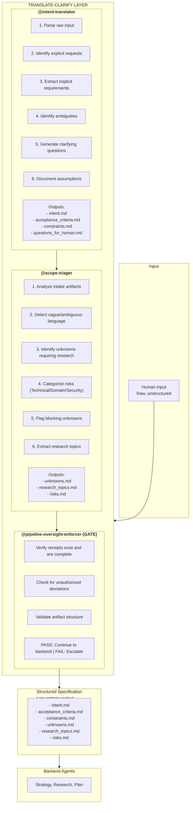
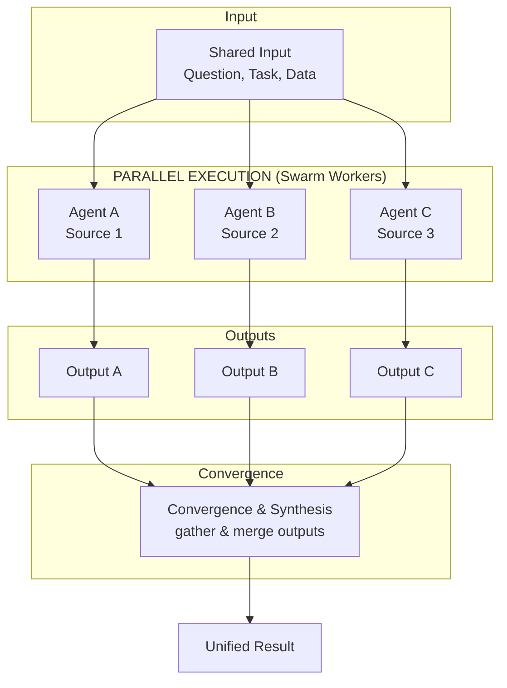
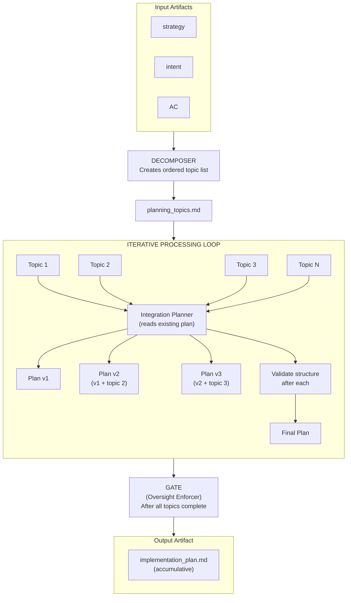
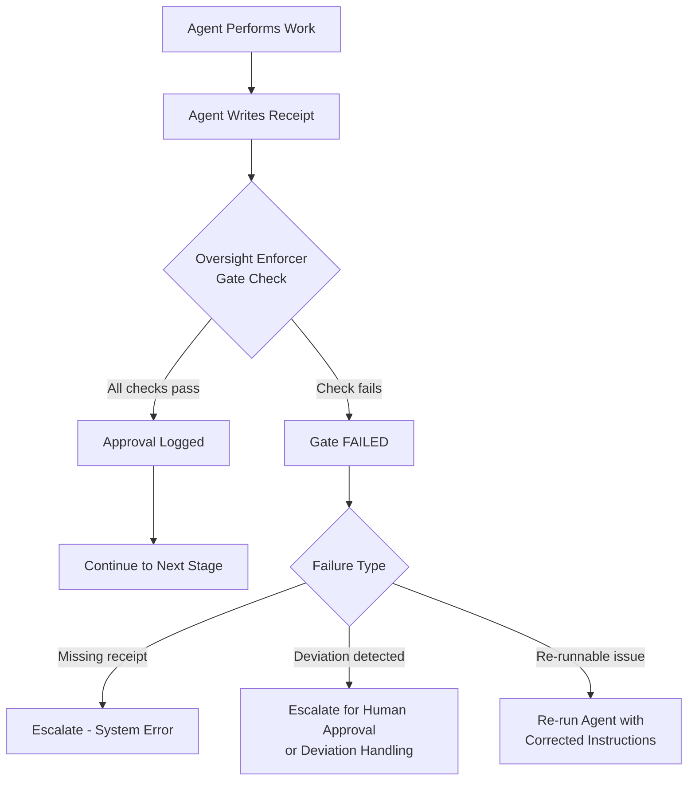
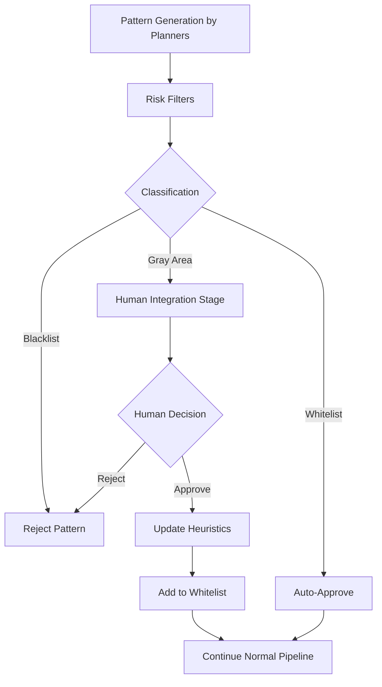

# AI Orchestration Pattern Catalog

This document presents a comprehensive catalog of design patterns for an AI-driven multi-agent orchestration system.

The patterns are organized by category:

- **Architectural** - Structural foundations and high-level design
- **Execution** - Runtime behaviors and process flows
- **Governance** - Oversight, compliance, and quality enforcement

Each pattern entry includes:

- A detailed description of the pattern's purpose and mechanics
- Mappings to industry-standard terminology
- Cross-references to core pipeline rules

Key **SIEVE Pipeline Rules** - fundamental, non-negotiable principles that govern the workflow - are indexed below and referenced in relevant patterns.

## Core SIEVE Pipeline Rules (Index)

1. **"Never debug the printout with a pen – update the document and reprint."** – Always fix issues at the source of truth (strategy/plan), not in the generated artifact. In this system, code and other artifacts are treated as printouts derived from authoritative design documents. When conflicts or bugs occur, the strategy/plan (the "document") must be reconciled or corrected, and the artifact is regenerated, rather than patching code directly. This prevents drift and ensures all changes remain traceable to decisions. *(Enforced by `Printer-Metaphor` and `Merge-Strategies-Not-Code` patterns.)*

2. **"Code First, Tests After."** – Complete all implementation and code reviews before writing any tests. The production codebase must reach a stable, reviewed state before test development begins. No test files are created during code implementation phases, and conversely no production code is modified during the test phase. This temporal separation guarantees that tests target a stable code baseline and that code isn't changed after tests begin. *(Enforced by `Code-First-Tests-After` pattern as Pipeline Rule #2.)*

3. **"Every agent writes a receipt: deviations/assumptions must be explicit."** (No receipt, no proceed.) – Every agent action must be documented in a structured receipt before the pipeline can continue. Each agent produces a receipt detailing what it did, inputs/outputs, any deviations from instructions, and assumptions made. The Pipeline Oversight Enforcer (governance agent) checks that for every stage transition a receipt is present and complete; if not, the process is halted. This rule creates an immutable audit trail and ensures no silent deviations – all decisions are transparent for post-hoc analysis. *(Enforced by `Agent-Gate` and `Receipt-Trail` patterns.)*

4. **"Loop until clean – any failing review re-enters the loop until PASS."** – Quality checks repeat until an artifact passes all reviewers with no issues. Partial approval is not allowed; if any review fails, a patch is applied and all reviewers must re-evaluate the artifact. This guarantees that artifacts meet all defined criteria before proceeding. The system does not accept "good enough" results – it iterates (potentially indefinitely) until the artifact is fully clean, or escalates if it cannot converge. *(Enforced by `Review-Loop` pattern and applied in all artifact review stages.)*

5. **"Integrate, don't (just) approve."** – Transform human approvals into integrated, reusable knowledge. Rather than treating each human approval as a one-off gate, the system uses it as an opportunity to integrate a new pattern or decision into the appropriate knowledge layer (Strategy, Plan, or Artifact) so that future similar instances can be auto-approved. Strategic decisions always require human oversight, but once a Plan-level or Artifact-level pattern is approved and added to a whitelist of heuristics, future occurrences bypass human review. This rule shifts the human role from reactive approver to proactive curator of system knowledge, building progressive trust in the AI's autonomous operation. *(Enforced by `One-Shot-Integration` and `Strategy-Plan-Artifact` patterns.)*

## Architectural Patterns (Structural Foundations)

Architectural patterns define the high-level structure and philosophical underpinnings of the AI workflow pipeline. They describe how information flows from human intent to implementation through layers of abstraction, and establish principles like *single source of truth* and *regeneration*.

### Pattern: Goal-Strategy-Plan-Artifact-Verify (GSPAV)
#### Description

The **Goal-Strategy-Plan-Artifact-Verify (GSPAV)** pattern is the master orchestration flow for this AI workflow system. It represents the complete pipeline that transforms raw human intent into verified, production-ready artifacts through a series of progressively refined stages. This is the top-level pattern that contains and orchestrates all other patterns in the system.

The pattern embodies a fundamental principle: high-entropy human input is systematically refined into low-entropy machine-executable outputs, with verification gates ensuring fidelity at each transformation boundary. It operates on the premise that you *"never debug the printout with a pen - you update the document and reprint."* (See Rule 1.)

**Core Philosophy - Hierarchy of Truth**

The GSPAV pattern enforces a strict hierarchy of specification layers, where each layer has clear responsibilities and acts as the source of truth for the layer below:

1. **Goal/Intent Layer** - What the human wants (high-level outcomes).
2. **Strategy Layer** - The "what" and high-level "how" (patterns, architecture, technology choices).
3. **Plan Layer** - The specific wiring and topology (where components go, how they integrate).
4. **Artifact Layer** - The implementation mechanics (code syntax, exceptions, retries, conventions).
5. **Verification Layer** - Validation that artifacts match their specifications (tests, linting, coverage).

Each layer serves as the specification for the layer below it, creating a traceable chain from human intent to verified implementation. Errors or changes are addressed by updating the responsible layer and regenerating all downstream artifacts, maintaining alignment across the hierarchy.
#### Industry-Standard Terminology Mapping

The Goal-Strategy-Plan-Artifact-Verify pattern maps to several well-established concepts in AI, software engineering, and project management:

| Industry Term | Definition | GSPAV Mapping |
|---------------|------------|---------------|
| **Goal-Driven Planning / Goal-Oriented Action Planning (GOAP)** | An AI planning approach where agents receive high-level goals and autonomously plan sequences of actions to achieve them. | GSPAV's progression from Intent → Strategy → Plan directly implements goal-driven planning: the system autonomously transforms high-level goals into executable sequences. |
| **Hierarchical Task Decomposition (HTN)** | Breaking complex tasks into a hierarchy of subtasks and primitive actions. | GSPAV performs hierarchical decomposition at multiple levels: Strategy decomposes intent into architecture; Plan decomposes strategy into implementation topics; Artifact decomposes plan steps into code/test units. |
| **Planner-Executor Pattern** | A workflow where a planner component generates a task list and executor components carry out the tasks. | GSPAV separates planning (Strategy Planner, Integration Planner) from execution (Implementor, Test-Implementor), allowing specialized agents/models for each phase. |
| **Software Verification and Validation (V&V)** | Ensuring a system meets specifications (verification: "built right") and fulfills its intended purpose (validation: "the right product"). | The Verify layer of GSPAV encompasses both: drift reviews perform verification that artifacts match plans, and artifact/test reviews perform validation that the implementation meets quality and requirements. |
| **Requirements Traceability** | The ability to trace the life of a requirement from origin through implementation, ensuring each implementation element maps to a requirement. | GSPAV maintains bidirectional traceability: Intent → Strategy → Plan → Artifact (forward traceability) and Artifact → Plan → Strategy → Intent (backward traceability via drift checks and coverage matrices). |
| **CI/CD Pipeline with Quality Gates** | A continuous integration/deployment pipeline with checkpoints that enforce quality criteria before advancing. | Every transition in GSPAV acts as a quality gate. The `@pipeline-oversight-enforcer` agent serves as a gatekeeper that verifies receipts and compliance at each stage boundary, blocking progression on rule violations. |
| **Contract-First Development** | Developing by writing specifications/contracts first, then implementing against those specs, treating the spec as the single source of truth. | In GSPAV, each layer's output serves as a contract for the next layer: e.g., Strategy is the contract for Plan, Plan for Artifact. Drift reviews ensure each contract is honored before moving forward. |
| **Constrained Planning** | Planning with explicit constraints and checklists that must be satisfied (often used in regulated workflows). | GSPAV enforces constraints through acceptance criteria and pattern libraries. The plan and artifact stages include structured verification to ensure all specified constraints and criteria are met. |

*Sources for these mappings include IBM, Microsoft, WEF, academic literature, etc., as referenced in the pattern's documentation.*
#### Detailed Flow/Stages

The GSPAV pattern orchestrates the following stages (with key agents):

```mermaid
flowchart TD
    subgraph Intake["Stage 0: Goal/Intent Translation"]
        A[Human Input] --> B["@intent-translator"]
        B --> C["@scope-triager"]
        C --> D["intent.md<br/>acceptance_criteria.md<br/>constraints.md<br/>unknowns.md"]
    end

    subgraph Strategy["Stage 1: Strategy Formation"]
        E["@strategy-planner"] --> F[Draft Strategy]
        F --> G{Human Approval}
        G -->|Approved| H[Approved Strategy]
        G -->|Modify| E
    end

    subgraph Research["Stage 2: Research"]
        I["@research-question-decomposer"] --> J["Crawler Swarm<br/>(web, repo, docs)"]
        J --> K["@research-deduplicator<br/>@research-synthesizer"]
        K --> L["research_findings.md<br/>evidence_table.md<br/>open_gaps.md"]
    end

    subgraph Planning["Stage 3: Plan Integration"]
        M["@planning-topic-decomposer"] --> N["@integration-planner"]
        N --> O["implementation_plan.md<br/>planning_topics.md"]
    end

    subgraph PlanReview["Stage 4: Plan Review"]
        P["@architecture-review<br/>@code-style-review"] --> Q{Pass?}
        Q -->|No| R["@plan-patcher"]
        R --> P
        Q -->|Yes| S[Approved Plan]
    end

    subgraph CodeImpl["Stage 5: Code Implementation"]
        T["@implementor"] --> U["Code Files<br/>step_log.md"]
    end

    subgraph CodeDrift["Stage 6: Code Drift Verification"]
        V["@implementation-drift-review"] --> W{Drift?}
        W -->|Yes| X[Debug/Repair]
        X --> T
        W -->|No| Y[Verified Code]
    end

    subgraph CodeReview["Stage 7: Code Review"]
        Z["@code-anatomical-review<br/>@code-bug-review"] --> AA{Pass?}
        AA -->|No| AB["@code-patcher"]
        AB --> Z
        AA -->|Yes| AC[Approved Code]
    end

    subgraph TestPipeline["Stages 8-12: Test Pipeline"]
        AD["Stage 8: @testing-strategy"] --> AE["Stage 9: Test Plan"]
        AE --> AF["Stage 10: @test-implementor"]
        AF --> AG["Stage 11: Test Drift Review"]
        AG --> AH["Stage 12: Test Review<br/>@test-clarity-review<br/>@test-structure-review"]
    end

    subgraph FinalVerify["Stage 13: Final Verification"]
        AI["@verification-runner"] --> AJ{Pass?}
        AJ -->|No| AK[Debug & Repair]
        AK --> AI
        AJ -->|Yes| AL[Ready for Deployment]
    end

    subgraph Escalation["Escalation: Process Audit"]
        AM["@process-auditor"] --> AN["audit_report.md"]
    end

    D --> E
    H --> I
    L --> M
    O --> P
    S --> T
    U --> V
    Y --> Z
    AC --> AD
    AH --> AI

    CodeDrift -.->|Repeated Failures| AM
    CodeReview -.->|Repeated Failures| AM
    FinalVerify -.->|Repeated Failures| AM
```



**Stage 0: Goal/Intent Translation (INTAKE)**

- **Purpose:** Convert high-entropy human input into structured, low-entropy specifications.
- **Agents:**
  - `@intent-translator` - structures the intent and asks clarifying questions
  - `@scope-triager` - flags unknowns and risks
- **Outputs:** `intent.md` (structured intent), `acceptance_criteria.md`, `constraints.md`, `unknowns.md` (open questions)
- **Gate:** Pipeline Oversight checks that the translator's receipts and structured docs are present before proceeding.

**Stage 1: Strategy Formation**

- **Purpose:** Translate the clarified intent into a high-level solution strategy.
- **Agent:** `@strategy-planner`
- **Activities:** Define architectural patterns to use, tech choices, scope (what will/won't be done), and identify risks.
- **Human Input Required:** A one-shot human Integration Point occurs where the draft strategy must be approved/modified by a human before proceeding. (Strategic decisions are never automated - see Rule 5.)

**Stage 2: Research (Knowledge Gathering)**

- **Purpose:** Resolve unknowns and gather evidence required for planning.
- **Sub-orchestration:** Research Orchestration (a parallel Crawler Swarm)
- **Agents:**
  - `@research-question-decomposer` - breaks down unknowns into specific questions
  - Multiple crawlers in parallel (web, repo, documentation crawlers, etc.)
  - Synthesizer agents (`@research-deduplicator`, `@research-synthesizer`, etc.) to consolidate findings
- **Outputs:** `research_findings.md`, `evidence_table.md`, `open_gaps.md` (unanswered questions), domain structure suggestions, integration maps
- **Gate:** Pipeline Oversight ensures all findings are documented and no required questions are unanswered before planning.

**Stage 3: Plan Integration (Planning)**

- **Purpose:** Transform strategy into a step-by-step implementation plan.
- **Sub-orchestration:** Plan Integration Orchestration (could incorporate Sequential-Topic-Iteration pattern)
- **Agents:**
  - `@planning-topic-decomposer` - decomposes acceptance criteria into an ordered list of implementation topics
  - `@integration-planner` - iteratively generates plan sections for each topic
- **Validation:** After each topic addition, structure is validated (e.g. check plan completeness and consistency)
- **Outputs:** `implementation_plan.md` and `planning_topics.md` (the list of topics)
- **Gate:** Pipeline Oversight enforces that plan receipts are present and that plan covers all acceptance criteria (via drift review) before proceeding.

**Stage 4: Plan Review**

- **Purpose:** Ensure the plan meets all domain rules and is implementable before coding.
- **Agents (Reviewers):**
  - `@architecture-review` - checks layered architecture and dependencies
  - `@code-style-review` - checks naming conventions, etc.
- **Patcher:** `@plan-patcher` to fix any issues
- **Loop:** The plan undergoes a Review-Loop until all plan reviewers pass.
- **Gate:** Oversight enforces no proceed until plan review receipts show all pass.

**Stage 5: Artifact Creation - Code Implementation**

- **Purpose:** Implement the plan's steps in code.
- **Agent:** `@implementor` reads the `implementation_plan` and generates code artifacts accordingly. The implementor is constrained to follow the plan exactly (no creative deviations).
- **Output:** New/modified code files and a `step_log.md` documenting each implemented step
- **Gate:** Oversight ensures implementor's receipt and logs are present.

**Stage 6: Code Drift Verification**

- **Purpose:** Verify that the implemented code matches the plan with no unintended divergence.
- **Agent:** `@implementation-drift-review`
- **Activities:**
  - Compare the plan vs the actual code
  - Identify any missing planned items, extraneous code that wasn't in plan, or mismatches
  - Produce a coverage matrix mapping plan steps to code
- **On PASS:** Proceed to next stage
- **On FAIL:** Route to a debug/repair sub-process (or back to implementation) to address drift
- **Gate:** Oversight ensures no drift issues remain (or they are escalated if persistent).

**Stage 7: Code Review**

- **Purpose:** Enforce code quality via specialized multi-agent reviews.
- **Agents (Sequential Reviewers):**
  - `@code-anatomical-review` - checks function structure, complexity
  - `@code-bug-review` - checks for bugs and edge cases
- **Patcher:** `@code-patcher` applies targeted fixes
- **Loop:** Re-run all code reviewers until every check passes (no known bugs, style violations, etc.)
- **Gate:** Oversight enforces Loop until clean (Rule 4) - code cannot proceed until all reviewers approve.

**Stages 8-12: Test Pipeline**

The test development pipeline runs in parallel to the code pipeline, once code is complete. It mirrors stages 3-7 for test artifacts:

- **Stage 8:** Test Strategy by `@testing-strategy` defining how to test
- **Stage 9:** Test Plan by planning decomposer and integration planner for tests
- **Stage 10:** Test Implementation by `@test-implementor` writing test code
- **Stage 11:** Test Drift Review by `@implementation-drift-review` ensuring tests align with test plan
- **Stage 12:** Test Review by test-specific reviewers like `@test-clarity-review`, `@test-structure-review`, etc., with a patcher for tests

The Code-First-Tests-After rule (Rule 2) is embodied here: the test pipeline starts only after code is code-complete, and runs through a similar GSPAV cycle for test artifacts.

**Stage 13: Final Verification**

- **Purpose:** Perform end-to-end verification on the fully implemented and tested system.
- **Agent:** `@verification-runner` executes final checks such as running all tests, linters, and coverage tools
- **On Success:** The feature is considered verified and ready for deployment.
- **On Failure:** The pipeline triggers a Debug & Repair process to diagnose and fix issues before re-running verification.
- **Gate:** Oversight enforces that verification receipts are present and success criteria met.

**Escalation: Process Audit (On Repeated Failures)**

If certain failures keep occurring (e.g. multiple drift review failures, multiple review loops without progress, or oversight detects something like missing receipts or rule circumvention attempts), an audit orchestration kicks in.

- **Agent:** `@process-auditor` (or equivalent) compiles an `audit_report.md` diagnosing where the process broke down - e.g. which stage had issues, were receipts missing, suspicious patterns, etc. - and recommends remedial actions.
- **Purpose:** This ensures visibility into pipeline problems and continuous improvement of the process.
#### Participating Agents and Roles

The GSPAV pattern involves a variety of specialized agents. They can be grouped by their role in the pipeline:

| Agent Category | Agents | Description |
|----------------|--------|-------------|
| **Translator Agents** (Goal/Intent Intake) | `@intent-translator`, `@scope-triager` | `@intent-translator` converts raw human input into structured intent/requirements. `@scope-triager` identifies ambiguities, unknowns, and potential risks in the request. |
| **Planner Agents** (Strategy/Plan Formation) | `@strategy-planner`, `@research-question-decomposer`, `@planning-topic-decomposer`, `@integration-planner`, `@testing-strategy` | `@strategy-planner` develops the high-level solution strategy. `@research-question-decomposer` formulates questions for unknowns. `@planning-topic-decomposer` breaks requirements into implementable topics. `@integration-planner` writes the implementation plan from topics. `@testing-strategy` plans the testing approach. |
| **Crawler & Research Agents** (Research stage) | `@web-crawler`, `@repo-crawler`, `@dependency-doc-crawler`, `@repo-integration-crawler`, `@domain-structure-crawler`, `@research-deduplicator`, `@research-synthesizer`, `@structure-synthesizer`, `@evidence-binder` | Various crawlers gather information from different sources. Synthesizer agents process and consolidate the research data. |
| **Implementor Agents** (Artifact creation) | `@implementor`, `@test-implementor`, `@verification-runner` | `@implementor` generates code according to the plan. `@test-implementor` creates test code as per the test plan. `@verification-runner` runs the final verification suite. |
| **Reviewer Agents** (Quality verification) | *Plan reviewers:* `@architecture-review`, `@code-style-review`; *Code reviewers:* `@code-anatomical-review`, `@code-bug-review`; *Test reviewers:* `@test-clarity-review`, `@test-structure-review`, `@test-async-review`; *Drift reviewers:* `@implementation-drift-review`, `@plan-drift-reviewer`, `@research-coverage-drift-review` | Plan reviewers handle plan artifact checks. Code reviewers focus on structure and bugs (plus static analysis). Test reviewers focus on test quality (readability, structure, async correctness). Drift reviewers check alignment between artifacts, plans, and requirements. |
| **Patcher Agents** (Auto-fixers) | `@plan-patcher`, `@code-patcher`, `@test-patcher` | Attempt to automatically fix issues detected in plan, code, and test reviews respectively. |
| **Investigator Agent** (Debug/Repair) | `@investigator` | Engages when automated patching and normal loops fail, performing root cause analysis and guiding complex fixes in an isolated debug workflow. |
| **Oversight Agent** (Governance) | `@pipeline-oversight-enforcer` | The central governance agent that implements Agent-Gate behavior at every stage boundary (verifying receipts, checking policy compliance). Embodies rules like "no receipt, no proceed" and coordinates enforcement of all pipeline rules. |

#### Pattern Integration and Orchestration

As the master pattern, GSPAV is implemented by the `Implementation Orchestration` - the end-to-end workflow that creates a new feature or artifact using all the stages above. GSPAV also encompasses various sub-orchestrations that correspond to segments of the pipeline (some of which are patterns in their own right), for example:

- **Research Orchestration** (Stage 2, type: `CREATE`) - Implements the knowledge gathering phase with parallel crawlers (related to `Parallel-Swarm` pattern for concurrent agents).

- **Plan Integration Orchestration** (Stages 3 & 9, type: `INTEGRATE`) - Implements the planning and test planning phases, potentially using `Sequential-Topic-Iteration` pattern to iterate through topics.

- **Artifact Review Orchestration** (Stages 4, 7, 12, type: `REVIEW`) - Implements the `Review-Loop` pattern for plan, code, and test reviews (with patching).

- **Debug & Repair Orchestration** (Stage 13 on failure, type: `REPAIR`) - A recovery process triggered on final verification failure or persistent issues (could involve specialized strategies outside GSPAV scope).

- **Process Audit Orchestration** (Escalation, type: `AUDIT`) - Triggered on rule violations or repeated failures, performing the process-level analysis and reporting (governance oversight).

In summary, the GSPAV pattern provides the structured backbone of the AI workflow, ensuring that a nebulous human request is methodically translated into a concrete, verified solution with full traceability and governance at every step.
### Pattern: Translate-Clarify
#### Description

The Translate-Clarify pattern establishes the sole human-system interface for all AI agent orchestrations. All human input enters through a Translator agent that structures the intent, identifies ambiguities, and asks clarifying questions before passing well-defined specifications to the backend agents. This pattern ensures that high-entropy, unstructured human communication is transformed into low-entropy, machine-processable artifacts that downstream agents can act upon without guesswork or misinterpretation.

The Translator acts as a facade for the complex multi-agent pipeline, abstracting away the orchestration's internal complexity from the human user. It translates between human natural language and the machine's structured format, ensuring the system understands not just what the human says, but what they actually intend to achieve.

**Core Responsibilities:** The Translator (often realized as an `@intent-translator` agent) performs several critical functions:

1. **Intent Identification** - Parse raw human input to determine the underlying goal, including implicit requirements and objectives.
2. **Input Organization** - Structure loose or vague thoughts into coherent, explicit requirements (e.g., produce a list of features or tasks).
3. **Ambiguity Resolution** - Detect unclear or ambiguous instructions and proactively ask clarifying questions rather than making assumptions.
4. **Goal Definition** - Help the human articulate their high-level goals and refine them into actionable tasks.
5. **Constraint Extraction** - Identify any explicit or implicit constraints (e.g., "must use X technology", deadlines, compliance requirements).
6. **Unknown Detection** - Flag areas where information is missing or further research is required (handing off to a research phase if needed).
7. **Result Communication** - Format and present the final results back to the human in a clear, easy-to-consume manner (e.g., summarizing outcomes, code diff, documentation).
8. **Exception Handling** - If something goes wrong in the pipeline, communicate errors or options to the human and engage them in finding alternatives.

**Key Characteristics:** The Translator significantly reduces entropy by converting a high-variance natural language request into deterministic, structured outputs. It also ensures **semantic preservation** - the core meaning and intent from the human are preserved, even as the format is standardized. Through a **Clarification Loop**, it disambiguates any uncertainties via interactive Q&A with the user, rather than letting ambiguities propagate down the pipeline. The Translator's output conforms to a consistent schema (structured intent, acceptance criteria, etc.), providing a stable contract for downstream agents.

#### Industry-Standard Terminology Mapping

The Translate-Clarify pattern aligns with several known concepts in AI and software engineering:

**Natural Language Understanding (NLU)** - *Definition:* Techniques for parsing and understanding human language input (intent, entities, context). *Mapping:* The Translator performs classic NLU tasks: intent recognition (identifying user objectives), entity extraction (key details like names, quantities), semantic parsing, and context handling (considering conversation history or domain context). It effectively serves as an NLU module that bridges human language to structured data.

**Requirements Elicitation (Automated)** - *Definition:* The process of gathering and refining requirements for a project, often through interviews or Q&A. *Mapping:* This pattern functions as an automated requirements elicitation agent. It uncovers implicit needs from vague inputs, translates business-level goals into technical requirements, and minimizes back-and-forth by quickly drilling down into what the user actually wants. It can coordinate multiple steps to clarify requirements that a human analyst might normally perform.

**Human-in-the-Loop (HITL) Interface Agent** - *Definition:* An AI design approach where human feedback is incorporated at key decision points to ensure alignment and trust. *Mapping:* The Translator is a HITL interface: it explicitly engages the human in a Clarification Loop whenever it detects uncertainty. It also supports a Validation Loop at the end (checking if results meet the user's needs before finalizing). When confidence is low or a decision is beyond its scope, it escalates to the human ("intelligent fallback"). (This pattern also reinforces the "Integrate, don't just approve" principle by treating human clarification as strategic input rather than just a yes/no gate - see Rule 5.)

**Proactive Conversational AI / Clarification Dialog** - *Definition:* Dialogue systems that proactively ask follow-up questions to resolve ambiguity rather than waiting for the user to specify everything. *Mapping:* The Translator implements proactive clarification by initiating sub-dialogues with the user whenever the input is ambiguous. It might say, for example, "You mentioned X feature - can you clarify how it should behave in scenario Y?" This ensures an accurate understanding of user intent across complex or incomplete requests.

**Facade / Abstraction Layer** - *Definition:* A design pattern that provides a simplified interface to a complex subsystem. *Mapping:* The Translator acts as a facade to the entire agent orchestration pipeline. To the human, the Translator is the single touchpoint, hiding the complexity of planning, research, coding, testing, etc. behind a simple conversational interface. This abstraction improves usability and decouples the human interaction layer from the internal multi-agent processes.

**Intent Mediation / Unified Intent Mediator** - *Definition:* Patterns or protocols that standardize how intents (goals/commands from users) are represented and handed off between systems. *Mapping:* Translate-Clarify performs intent mediation by producing structured intents that downstream agents can uniformly consume. It extracts parameters and context and formulates a normalized specification artifact (like `intent.md` and `acceptance_criteria.md`) that serves as the contract for the rest of the pipeline.

**A quick terminology summary for this pattern:**

| System Term | Industry-Standard Term(s) |
|-------------|---------------------------|
| Translate-Clarify Pattern | NLU Pipeline; Intent Recognition Layer; Requirements Elicitation Interface |
| Intent Translation | Intent Recognition; Intent Classification; Semantic Parsing |
| Clarification Loop | Clarification Dialog; Proactive Q&A; Disambiguation Workflow |
| Structured Output | Structured Intent; Normalized Requirements; Specification Artifact |
| Human Interface Layer | HITL Interface; Conversational Agent; Facade Layer |
| Scope Triaging | Gap Analysis; Risk Assessment; Unknown Detection |
| Integration (The Human Role) | Strategic Pattern Placement; Knowledge Curation; Heuristic Promotion |

#### Detailed Flow / Steps

After receiving a raw request from the human, the Translate-Clarify pattern proceeds through a series of steps.

**Flow Diagram:** Below is a high-level flow of how input moves through the Translate-Clarify layer and out to the rest of the system:



**Step-by-Step Process:**

**Step 1: Intent Translation** - Agent: `@intent-translator`

This agent reads the raw human request (e.g., a PR comment, feature request, user story) and performs initial parsing and structuring. It identifies what the user explicitly asked for and also infers implicit requirements. For example, if the user says "Add a login feature," the agent will list sub-requirements (login form, authentication method, etc.) even if not explicitly stated. It highlights ambiguities (e.g., "Should it allow social login?") and prepares clarifying questions.

It outputs structured files:
- `intent.md` - summarizing the goal and tasks
- `acceptance_criteria.md` - list of conditions the solution must meet
- `constraints.md` - any constraints or preferences mentioned
- `questions_for_human.md` - questions that need human answer before proceeding

**Step 2: Scope Triage** - Agent: `@scope-triager`

This agent takes the artifacts from Step 1 and performs a risk and ambiguity assessment. It scans the intent and criteria for unclear language or open-ended requests. It identifies unknowns - things that are not specified and may require research or assumptions (e.g., "Which payment gateway to use?"). It categorizes any risks or potential challenges (technical complexity, security concerns, etc.) and flags if any unknowns are "blocking" (must be resolved before implementation). It also compiles `research_topics.md` if there are areas that need further investigation by the system (like unknown technologies or domain questions).

Outputs include:
- `unknowns.md`
- `research_topics.md`
- `risks.md`

**Step 3: Oversight Gate (Intake Validation)**

Before handing off to the Strategy planning stage, the Pipeline Oversight Enforcer (`@pipeline-oversight-enforcer`) verifies that the translator and triager have produced all required receipts and structured outputs. It checks that no instructions were deviated from (e.g., the translator didn't drop any requirement), and that the structured spec is complete and well-formed.

If something is missing (like no acceptance criteria defined) or any suspicious behavior is detected (perhaps the translator tried to inject an unapproved pattern), the Oversight agent will **FAIL** the gate. On failure, it might escalate or ask for human intervention. On **PASS**, the low-entropy, structured specification artifacts (`intent.md`, etc.) are released to the backend orchestrations (Strategy planning, Research, etc.).

---

After this Translate-Clarify stage, the system now has a clear specification of what to build (intent and acceptance criteria), how well it should perform (criteria, constraints), and what is unknown or risky. This ensures that subsequent agents (strategy planners, etc.) start their work with a solid understanding of the task and with any needed clarifications already obtained from the human.

The human is kept in the loop only for those clarification questions, turning what could be an unbounded exchange into a focused Q&A. Once the Translate-Clarify pattern completes, the pipeline proceeds with the Strategy Pattern (GSPAV Stage 1) using the outputs produced here as input.

### Pattern: Strategy-Plan-Artifact

#### Description

The Strategy-Plan-Artifact pattern establishes a three-layer hierarchy of truth that governs how decisions flow from high-level strategy down to concrete implementation details. This pattern enforces a strict separation of concerns: each layer -- Strategy, Plan, Artifact -- has distinct responsibilities, integration rules, and human/machine boundaries.

The core principle is that:

- **Strategy** defines "what/how" at the pattern level
- **Plan** defines "where" and "how to integrate" (topology)
- **Artifact** defines the exact "mechanics/syntax"

This hierarchy ensures that:

1. Strategic decisions (architectural patterns, major technology choices) are made once at the appropriate level of abstraction.
2. Implementation details are derived from, and traceable to, strategic direction -- they do not drift independently.
3. Errors at any level are corrected by updating the source layer (above), not by patching downstream outputs. (This echoes Rule 1: never patch code, update the plan.)
4. Human oversight is concentrated at the Strategy level, while lower layers (Plan and Artifact) can be increasingly automated -- aligning oversight effort with decision impact.

This pattern embodies the Printer Metaphor: *Code is the printout; Strategy/Plan is the document.* In other words, you never grab a pen to fix errors on the printout -- you update the source document (strategy/plan) and "reprint" (regenerate code). Strategy-Plan-Artifact provides the structural framework for that metaphor by clearly delineating what the "document" consists of and how it propagates to the "printout."

#### Integration (The Human Role)

> This pattern formalizes *Integrate, Don't Approve* (Rule 5) at each layer. Human involvement is reframed as integration of patterns into the hierarchy rather than one-off approvals.

Instead of reviewing code and giving a binary yes/no ("approve" or "reject"), the human's role is to **Integrate** -- i.e., strategically place patterns or decisions into the correct layer's knowledge base or documentation.

This is a fundamental shift in mindset:

- **Approval (traditional)** is reactive and instance-based: it answers "Is this code change okay?"
- **Integration (this system)** is generative and pattern-based: it answers "Does this decision belong in our Strategy, Plan, or Artifact standards?"

**Workflow for Human Integration:**

When the AI encounters a suspicious or gray-area pattern during execution, it:

1. **Aggregates & Flags** -- The AI identifies patterns or decisions that it is not confident to auto-approve (e.g., something new or deviating from known best practices).
2. **Classifies Proposal** -- The AI suggests a classification for the pattern: Strategy-level, Plan-level, or Artifact-level (indicating the scope and importance of the decision).
3. **Human Reviews** -- The human reviews this suggestion and decides:
   - If the pattern is acceptable and at which layer to integrate it (maybe adjusting the layer if the AI misclassified).
   - Or to reject the pattern outright (not incorporate it into standards, treat it as a one-off exception).

**Targets of Integration:**

Depending on the layer chosen, different artifacts are updated:

- **Strategy Integration** -- Update the formal Strategy Document. (Example: adding a rule "We now officially use Redis for caching" to the strategy docs.)
- **Plan Integration** -- Update the Plan Heuristics or guidelines. (Example: adding a guideline "Always wire event handlers with an error boundary in GUI components.")
- **Artifact Integration** -- Update Artifact-level heuristics or templates. (Example: "Use this specific retry logic pattern for all network calls.")

**Approval Logic:**

This pattern dictates how often human approval is needed at each layer:

- **Strategy-level patterns** -- Always require human approval. They are never auto-approved on future occurrences; every strategic decision is too significant and context-dependent, so it must be reviewed every time it comes up.
- **Plan-level patterns** -- Require human approval on the first occurrence. Once approved and integrated into the plan heuristics, the same pattern in future plans will be automatically approved (whitelisted).
- **Artifact-level patterns** -- Similarly, require human approval initially, then become part of the artifact-generation heuristics for auto-approval subsequently.

This creates a **progressive automation model**:

- Strategic decisions always involve human judgment (they remain manual).
- Tactical (plan) and operational (artifact) patterns can be learned by the system and automated over time after the first human integration.
- Thus, as more patterns are integrated, the system becomes faster and more autonomous, while the human focuses only on truly novel or high-level strategic decisions.

> The above integration framework is leveraged by the One-Shot-Integration pattern to accumulate organizational knowledge. Strategy-Plan-Artifact provides the blueprint for where integrated knowledge is stored.

#### Industry-Standard Terminology Mapping

The three-layer hierarchy in Strategy-Plan-Artifact maps to several familiar frameworks:

- **Hierarchical Planning (Strategic-Tactical-Operational)**
  - *Definition:* An organizational planning model with three levels: strategic (long-term, high-level), tactical (mid-term, programs/projects), operational (short-term, execution).
  - *Mapping:* In this system: Strategy Layer approximates Strategic planning, Plan Layer approximates Tactical planning, Artifact Layer approximates Operational execution. The roles are analogous: Strategy sets overall direction (patterns/architectural choices), Plan translates strategy into actionable steps (integration points, wiring), Artifact handles day-to-day execution details (syntax, conventions).

- **Hierarchical Task Network (HTN) Planning**
  - *Definition:* AI planning approach that breaks tasks into compound and primitive tasks in a hierarchy.
  - *Mapping:* Strategy-Plan-Artifact mirrors an HTN: Strategy = high-level tasks (what to achieve, design goals), Plan = mid-level tasks (how to achieve, with subtask breakdowns), Artifact = primitive tasks (concrete code implementations).

- **Spec-Driven Development (SDD)**
  - *Definition:* Treating specifications as the central source of truth, from which code is derived.
  - *Mapping:* Strategy and Plan documents serve as the "specifications" in this system. The workflow of SDD (`Constitution -> Specify -> Plan -> Tasks`) directly parallels `Strategy -> Plan -> Artifact` generation. The Strategy doc is like the "constitution," the Plan is the detailed spec, and the Artifact layer produces the tasks (code) according to plan.

- **Separation of Concerns (SoC)**
  - *Definition:* A design principle that each software module or layer should handle a distinct concern or responsibility.
  - *Mapping:* The Strategy, Plan, Artifact layers enforce a strong SoC in the orchestration:
    - Strategy layer is concerned with "what & why" (architectural patterns, high-level policies).
    - Plan layer is concerned with "where & how to integrate" (the topology of components, how pieces connect).
    - Artifact layer is concerned with "exact how (syntax)" (the actual code, algorithms, exception handling, etc.).
  - These concerns are handled separately, which improves clarity and manageability.

- **Hierarchical Multi-Agent Systems (HMAS)**
  - *Definition:* Multi-agent architectures organized in a hierarchy, where higher-level agents delegate tasks to lower-level specialized agents.
  - *Mapping:* This pattern creates a natural HMAS structure. For example, a Strategy agent (leader) formulates a plan and delegates implementation to Implementor sub-agents; implementors further rely on lower-level pattern heuristics. Each layer's agents focus on their scope, and oversight agents ensure alignment between layers.

> Industry sources for these mappings include organizational planning resources, AI planning literature, and modern spec-driven development guides as cited in the pattern document.

---

### Pattern: Printer-Metaphor

#### Overview

The Printer Metaphor is the core architectural philosophy governing how artifacts are created, debugged, and maintained in this AI pipeline. It establishes the principle: *Code is the printout. Strategy/Plan is the document. Therefore, never debug the printout with a pen -- update the document and reprint.*

This pattern enforces a strict separation between the source of truth (the plans/strategies) and the generated output (the code or artifact). All changes and fixes flow through the proper hierarchy of truth (`strategy -> plan -> artifact`) and must pass validation gates again after regeneration. Direct edits to generated artifacts are strongly discouraged (or disallowed), because they break traceability and reproducibility.

#### Full Description

**The Core Metaphor:**

Imagine a physical printer in an office. The document (e.g., a Word file or PDF) contains the content you intend to print. The printout is a physical manifestation of that content. If you notice a typo on the printout, you do not scribble corrections on the paper with a pen; instead, you correct the source document and print it again properly.

**Applied to software via AI:**

- The Strategy/Plan is the "document" -- the authoritative specification of what should be built and how.
- The Code/Artifact is the "printout" -- the result of executing that specification.
- When you find a bug or issue in the code (printout), you don't patch the code directly (don't scribble on the paper). Instead, you update the plan or strategy that led to that code and then regenerate the code (reprint) from the updated plan.

**Why This Matters:**

Enforcing this philosophy yields multiple benefits:

1. **Single Source of Truth:** The implementation plan remains the sole authoritative source; code is always derivable from it. There's no divergence between what the plan says and what the code does.
2. **Reproducibility:** If you have the plan and strategy, you can always regenerate the code deterministically. This is akin to being able to rebuild software from source -- here, the "source" is the plan.
3. **Auditability:** All changes happen at the plan level (which is version-controlled and reviewable). You don't have hidden hotfixes in code that aren't reflected in any spec.
4. **Quality Assurance:** Every time code is regenerated from a plan, it goes through the entire validation pipeline (drift checks, reviews) again. This prevents ad-hoc fixes that circumvent quality gates.
5. **Prevention of Drift:** Manual patches to code that are not back-ported to the design would cause the design and code to drift. This pattern prevents that -- any needed fix updates the design documents, so design and code stay in sync.

**The Hierarchy:**

The Printer Metaphor relies on the layered architecture (`Strategy -> Plan -> Artifact`) described in the previous pattern. A simplified view:

```
Strategy (The Document)
│ "What" and high-level "How"
▼
Plan (The Wiring/Blueprint)
│ Integration topology – "Where does each piece go?"
▼
Artifact (The Printout)
  Implementation – the exact code (syntax and mechanics)
```

Each level has integration rules consistent with **Strategy-Plan-Artifact**:

- **Strategy Level:** Human-integrated changes only (needs approval every time for changes). It's the top layer of truth.
- **Plan Level:** Derived from strategy; changes can be auto-integrated once approved (whitelisted). Often the plan is generated or adjusted by the AI within strategic bounds.
- **Artifact Level:** Generated entirely from the plan -- effectively a "print" operation. Once artifact patterns are approved, the AI can apply them automatically.

> This reflects **Rule 1**: treat the plan as the single source of truth, and never treat code as the source.

#### Integration (The Human Role)

The Printer Metaphor reinforces the integration approach to human oversight:

- **The Pivot:** Humans do not binary "approve" code; they **Integrate** decisions (patterns) into the strategy/plan documents. The question is not "Is this code okay?" but rather "Should this pattern be part of our strategy or plan going forward?"
- **Workflow:** (Same as described in Strategy-Plan-Artifact and One-Shot Integration) The AI flags suspicious patterns, suggests classification, and the human decides how to integrate them.
- **Targets:** Strategy doc, Plan heuristics, or Artifact heuristics get updated by the human's decision.
- **Approval Logic:** Strategy integrations always manual; Plan/Artifact integrations one-time manual then automated (reiterating the progressive trust model).

> Detailed integration steps are covered under Strategy-Plan-Artifact. Printer-Metaphor provides the rationale for why integration (updating the "document") is the only proper way to fix issues.

#### Industry-Standard Terminology Mapping

The Printer Metaphor pattern aligns with several established concepts:

| Term | Definition | Mapping |
|------|------------|---------|
| **Single Source of Truth (SSOT)** | The practice of having one authoritative source for any piece of information, from which all uses of that information are derived. | Here, the Strategy/Plan combined serve as the SSOT for the code. The code is always regenerated from these sources of truth. There is never a "manual tweak" to code that isn't reflected upstream. |
| **Declarative Configuration / Desired State Configuration** | Describing the desired end state rather than the steps to get there, and letting the system converge to that state. | The implementation Plan is effectively a **declarative specification** of the software. It describes what the system should contain/do. The implementor agent then "prints" this state into reality (code). If the actual code drifts from the plan, the system notices (drift review) and regenerates to reconcile with the desired state. |
| **Immutable Infrastructure Pattern** | Never modify deployed servers/infrastructure in place; instead rebuild fresh with changes (common in DevOps). | The Printer Metaphor treats code artifacts as immutable outputs. Rather than patching code (which would be like modifying a live server), you always regenerate from plan (like redeploying infrastructure from scratch). This ensures a clean slate and no lingering side-effects from quick fixes. |
| **GitOps / Infrastructure as Code Reconciliation** | Using version-controlled declarations of desired state (usually in Git) and automatically ensuring the live system matches the repo, reconciling any drift. | The Plan is analogous to the Git desired state. If the code (live system) deviates, the pipeline (like an operator) detects it and reconciles by regenerating code to match the plan. Essentially, code generation here is continuously ensuring `"code state" == "plan spec"`. |

*(Sources for these mappings include Wikipedia on SSOT, Kubernetes docs on declarative config, IBM on immutable infrastructure, and GitOps patterns as listed in the references.)*

---
### Pattern: Merge-Strategies-Not-Code
#### Description

The **Merge-Strategies-Not-Code** pattern is a conflict-resolution principle in the orchestration pipeline: when parallel efforts or versions conflict, **resolve at the strategy/history level, not at the code level**. Instead of merging competing code branches or trying to manually reconcile two different outputs, the system merges the underlying **strategies and decision histories** that led to those outputs, then **regenerates** the plan and artifacts from the unified strategy.

This pattern directly applies the Printer philosophy to merging: just as one wouldn't cut and paste two printouts together to merge documents, one should not merge code outputs directly. Instead, reconcile the source documents (strategy/plan) and then reprint (re-generate the artifact).

In practice, this means if two parallel branches diverged (say two parallel planners or two different approaches were attempted), the system will:

- Compare their strategies and reasoning histories.
- Identify differences in assumptions, patterns, or decisions.
- Create a merged strategy that reconciles these differences (with possible human input to resolve conceptual conflicts).
- Re-run the planning and implementation from this merged strategy to produce a consistent artifact.

**Why This Pattern Exists:** Traditional version control merge conflicts (as in Git, SVN) operate at the textual code level, with limited understanding of the code's meaning. This approach has limitations:

1. **Semantic Blindness:** Text-based merge tools can't understand the intent behind code changes.
2. **Context Loss:** Why a change was made often gets lost; merges focus only on the "what changed" not the rationale.
3. **Drift Accumulation:** Manual merges and quick fixes can introduce subtle inconsistencies, causing the implemented design to drift from the original plan over time.
4. **Unreproducible Decisions:** Each manual conflict resolution is ad-hoc; if you had to regenerate from scratch, you can't easily replay those decisions.

**How Merge-Strategies-Not-Code addresses these issues:**

- **Preserving Intent:** By merging at the strategy level, the system is working with the "why" and "what" (the design decisions), not just the "how" (code diffs). The merged outcome retains the intent behind both contributions. For example, if two approaches each satisfied different acceptance criteria, the merged strategy explicitly incorporates both sets of criteria rather than blindly intermixing code.

- **Reproducibility:** Once a unified strategy is obtained, generating the artifact from it is deterministic. The merge decision is recorded in the strategy, so it can be reproduced (as opposed to a one-time manual code merge).

- **Traceability:** Every line of code in the regenerated artifact traces back to a decision in the merged strategy. You can see *why* it's there, because it comes from a documented strategic choice.

- **Preventing Drift:** Since the artifact is regenerated from an "authoritative" merged strategy document, you avoid piecemeal merging that might leave the design documents outdated. The design (strategy/plan) is updated first, so the final code is aligned with an updated design.

After merging strategies, down-stream drift checks and reviews further ensure the merged artifact meets all criteria and contains no conflicts.

#### Industry-Standard Terminology Mapping

Merge-Strategies-Not-Code aligns with forward-thinking approaches in version control and model-driven engineering:

| Term | Definition | Mapping to This Pattern |
|------|------------|-------------------------|
| **Specification-Driven Development (SDD)** | A methodology where the spec is the central artifact, and code is generated from it. | This pattern is essentially SDD applied to merging: treat the combined strategy documents as the spec and regenerate code, instead of merging code changes. It echoes the principle: *"Never manually merge compiler output; merge the source and recompile."* Here, `strategy = source`, `code = compiled output`. The system updates the spec (strategy/plan) and then produces new code, rather than merging code directly. |
| **Semantic Merge / Intent-Based Merging** | Tools that merge code using an understanding of syntax/semantics (ASTs) rather than raw text. | This pattern takes it a step higher: instead of merging at code semantics, it merges at the intent level (the "spec semantics"). It's like doing a semantic merge but one level above – merging the design decisions themselves. If semantic merge tools reduce conflicts by understanding code logic, merging strategies reduces conflicts by dealing with architectural intent. |
| **Model-Driven Merging / Structured Merge** | Methods to merge high-level models (UML diagrams, etc.) rather than code, often by identifying differences in model elements. | Merge-Strategies-Not-Code is effectively merging two "models" – the strategy documents are models of the intended system. Plans can be seen as derived views. The conflicts are resolved in the model, not in the code. This is aligned with research in model versioning that emphasizes merging at the model (design) level. |
| **Single Source of Truth (SSOT) Architecture** | Every data element is edited in only one place – the canonical source – and all other representations are derived from it. | Here, the strategy document is the SSOT for the system's design. When there's a conflict, you update that source (the strategy) rather than trying to reconcile derived copies (code). After merging strategies, regeneration ensures all derived artifacts (code, tests, docs) are synced to that SSOT. |
| **Design Document Reconciliation** | The process of merging differing design documents from parallel sources into one coherent design. | That's exactly what this pattern does: if two agents produce different strategies (design docs) for the same problem, those documents are compared and reconciled into one unified strategy. The code and plan are then regenerated from that unified design, so everything is consistent with the reconciled vision. |

*Relevant sources include articles on semantic merge tools, model merging research, and Martin Fowler's writings on semantic conflict, as listed in the pattern references.*

---
## Execution Patterns (Coordination & Process Workflows)

Execution patterns define how multiple agents or tasks are coordinated in time – whether working concurrently or sequentially – and enforce specific process orderings in the pipeline. They ensure efficient task execution and adherence to required sequences (such as code then tests).

### Pattern: Parallel-Swarm
#### Overview

The **Parallel-Swarm** pattern is a multi-agent coordination pattern where multiple specialized agents execute concurrently on the same input or related subtasks, and their results are later merged. Essentially, it's a *scatter-gather* approach in the AI orchestration: a problem is **fanned out** to multiple agents in parallel (the "swarm"), and then their outputs are **gathered** at a convergence point, deduplicated, and synthesized into a unified result.

This pattern maximizes throughput and reduces latency by distributing work across independent agents that can operate simultaneously without waiting on each other. It is useful when tasks can be done in parallel to save time, or when diverse perspectives from different agents can yield a better combined answer.

#### Description

In Parallel-Swarm, a shared input (or a set of related inputs) is distributed to multiple specialized agents that run **concurrently**. Each agent focuses on its specialty or a partition of the input. For example, in a research task, one agent might search documentation, another the codebase, another the web, all in parallel. After all agents complete their work, their outputs are collected at a synchronization point and merged.

**Core Characteristics:**

1. **Concurrent Execution:** Multiple agents run simultaneously rather than sequentially, significantly speeding up the overall task if there are no dependencies.
2. **Specialized Agents:** Each agent in the swarm has a distinct focus or expertise (one might handle a specific data source or aspect of the problem).
3. **Shared Input Distribution:** All agents receive the same input or different slices of a common input domain. For instance, splitting a large text by sections for multiple summarizer agents.
4. **Collection Point:** There is a defined point where all agent outputs are gathered (like a barrier sync).
5. **Deduplication/Synthesis:** The collected outputs undergo processing to remove redundancy and to integrate results into one coherent outcome. For example, if multiple agents found overlapping information, duplicates are removed, and complementary info is combined.
6. **Independence:** Agents do not communicate with each other during execution; they work autonomously on their chunk. (Communication, if needed, typically happens only via the merge logic at the end.)

**When to Use:**

- When tasks require gathering information from multiple independent sources (each agent can handle one source in parallel).
- When research or analysis benefits from diverse perspectives or approaches.
- When a task can be decomposed into largely independent sub-tasks that don't need to be done in a strict order.
- In QA, when you want multiple parallel reviewers for different aspects of quality (to shorten review time).
- Whenever reducing latency is critical and you have resources to parallelize.

**When NOT to Use:**

- If tasks have strict sequential dependencies (output of one is needed for another - then you must sequence them).
- If agents need to build incrementally on each other's output (that calls for iterative or sequential patterns instead).
- If resources (e.g., API calls, computational budget) are very limited such that parallelism overhead outweighs benefits.
- If determinism is needed - parallel execution can introduce nondeterministic completion orders which might complicate reproducibility.

#### Industry-Standard Terminology

Parallel-Swarm maps to known paradigms in distributed computing and multi-agent systems.

**Primary Equivalent Terms** (from industry):

| Term | Description | Alignment |
|------|-------------|-----------|
| **Scatter-Gather** | Distribute requests to multiple services or workers in parallel, then wait for and aggregate responses. | Direct match - the overall shape of this pattern is scatter-gather (scatter = fan-out to swarm, gather = converge results). |
| **Fan-Out/Fan-In** | A concurrency pattern where an initial process fans-out work to many parallel executors, then fans-in (collects) their results. | Direct match - describes the same concept of parallel branching and subsequent joining. |
| **Map-Reduce** | Splitting a problem (map) to parallel workers and then reducing (combining) the results. | High alignment - if each agent's work can be seen as the "map" phase and the consolidation as the "reduce", it's conceptually similar (though classic map-reduce implies a particular data partitioning approach). |
| **Fork-Join** | A parallel execution model where a task forks into sub-tasks that run in parallel and then joins to combine results. | High - parallel branches (forks) with a joining point exactly matches this pattern's structure. |
| **Swarm Intelligence** | In AI, a system where multiple simple agents work autonomously toward a common goal (often without centralized control). | Exact match in spirit - here each agent works autonomously on a part of the problem (like ants or bees tackling a task collectively). However, in our system there is an orchestrator that eventually consolidates results, so it's a guided swarm. |
| **Parallel Agent Execution** | Running multiple AI agents concurrently on related tasks. | Direct - that's literally what we're doing. |
| **Concurrent Orchestration** | (as per Microsoft's Agent Framework) Running multiple agents simultaneously on the same task from different angles. | Direct - Microsoft's documentation uses a similar pattern for agents in parallel. |
| **Data Agent Swarm** | A term in some contexts for multiple agents each processing different data parts in parallel. | High - if the input can be split into data chunks, each handled by an agent, that's a data swarm. |

> *The pattern references AWS Prescriptive Guidance for scatter-gather, O'Reilly's "Designing Distributed Systems" for similar patterns, and Microsoft/Azure docs on concurrent agent orchestration for further context.*

**Related Concepts:**

The pattern document also cites:

- **Scatter-Gather** as formalized in *Enterprise Integration Patterns* (and AWS architecture)
- **Fan-Out/Fan-In** in concurrency and cloud architecture (with references to Java design patterns and Microsoft)
- **Map-Reduce** adaptations for AI agent workflows (LangChain's map-reduce, etc.)
- **Fork-Join** model in parallel computing (with references to Wikipedia and Oracle's Fork/Join framework)
- **Swarm multi-agent systems**, including OpenAI's "swarm" experiments and AWS's *Strands Agents* for swarm intelligence
- **Concurrent Agent Orchestration** (Azure architecture guides)

All of which align with or reinforce the usage of this pattern in various domains.

#### Structure

The Parallel-Swarm structure can be visualized as follows:



In this diagram, a single input is fed to three parallel agents. Each produces some output. Those outputs flow into a convergence step which could be implemented by an **Aggregator/Synthesizer agent** that:

- Waits for all results
- Deduplicates overlapping information
- Resolves any inconsistencies between outputs
- Merges them into one final result (e.g., a combined answer or a merged document)

The pattern doesn't prescribe how to merge - it depends on the task (e.g., merging text answers vs merging code diffs are different). But the general idea is a final agent or function is responsible for synthesis.

*(In our system, the **Research Orchestration** (Stage 2 of GSPAV) uses Parallel-Swarm: multiple crawlers run in parallel, then a deduplicator and synthesizer combine their findings.)*

---
### Pattern: Sequential-Topic-Iteration
#### Description

The **Sequential-Topic-Iteration** pattern processes a series of decomposed topics **one at a time in strict order**, where each iteration builds upon the accumulated output of all previous iterations. This is essentially a sequential pipeline within the larger orchestration, ensuring that if topic B depends on decisions made in topic A, topic A is fully resolved and integrated before moving on.

It contrasts with parallel patterns by **enforcing sequential execution** because:

- **Order matters:** Later topics may depend on choices or structures established by earlier topics.
- **Accumulative output:** There is usually a single evolving artifact (like a plan or code file) that grows with each topic's contribution.
- **Context continuity:** Each subsequent iteration needs to see the current state of the artifact, including all prior topics' contributions. Agents working on topic N must have the outputs from topics 1...N-1.
- **Validation checkpoints:** After each topic, you can validate the intermediate artifact (catch errors early at the structure level) before proceeding.

This pattern is essential when dealing with tasks that have inherent dependencies or must be built incrementally.

**Example Use Case:** Implementing a large feature might be broken into topics (data model, API endpoints, UI component, etc.). They must be done sequentially because the data model (topic 1) might inform the API design (topic 2), which in turn must exist before UI (topic 3), etc. The plan document accumulates with each topic's details added in order.

#### Industry-Standard Terminology Mapping

This pattern aligns with familiar workflow constructs:

| Industry Term | Description | Mapping to Sequential-Topic-Iteration |
|---------------|-------------|---------------------------------------|
| **Sequential Orchestration Pattern** | Term from Microsoft's semantic kernel agent orchestration. Essentially a sequence of agents invoked one after another in a predefined order. | Sequential-Topic-Iteration *is* a sequential orchestration: each topic's agent runs after the previous finishes, with output fed forward. |
| **Prompt Chaining / Chain-of-Thought Workflow** | Breaking a task into a sequence of LLM calls, where each call's output feeds the next. | This pattern is a form of prompt chaining. Each topic's plan generation is like a step in a chain, using the current accumulated plan as context for the next step. |
| **Pipeline Pattern** | The classic workflow pattern where data flows through a fixed sequence of processing stages (like an assembly line). | Here the "data" is the evolving artifact (plan or code) and each stage is a topic integration. It's literally a pipeline of topic processing. |
| **Hierarchical Task Decomposition (HTD)** | Breaking a complex objective into smaller tasks. | The step that decomposes into topics is HTD; `Sequential-Topic-Iteration` then executes those tasks in order, ensuring the decomposition's dependencies are respected. The pattern helps implement hierarchical decomposition by providing the execution order for the pieces. |
| **Iterative Refinement Pattern** | Improving a product through repeated cycles, each adding or refining aspects. | Each topic iteration can be seen as refining the plan or artifact. Over multiple passes, the artifact becomes complete. The pattern ensures cumulative experience – each iteration leverages outputs of all previous ones. |
| **Dependent Task Chain** | A sequential workflow where each step depends on the output of the prior step. | Exactly describes this pattern – each topic's handling depends on the artifact state left by previous topics. |
| **Multi-Pass Refinement** | Approaching a complex problem with multiple passes, each focusing on one aspect. | Each topic could be thought of as one pass focusing on a particular aspect (e.g., first pass for basic structure, second for edge cases, etc.), although here "topics" are more domain-driven segments of work. |

*References include Microsoft Learn on sequential agent orchestration, IBM on agentic workflows, Berkeley workflow patterns, and AI21 on task decomposition.*

#### Structure

Below is a structural diagram of Sequential-Topic-Iteration within an orchestration:



The **Decomposer** agent takes the initial input (strategy, intent, acceptance criteria) and produces an ordered list of topics (`planning_topics.md`) that need to be addressed sequentially.

The topics are ordered based on dependencies: foundational topics first, then dependent ones, etc. For instance, "Set up database schema" might come before "Implement API endpoints" which depends on the schema. The decomposer ensures topics are **MECE** - Mutually Exclusive, Collectively Exhaustive, and properly granular.

Then an iterative loop runs through each topic in that list in order. For each topic:

- The **Integration Planner** (or appropriate agent) reads the current accumulated plan (starting empty for topic 1) and integrates the new topic's requirements into it.
- After processing topic 1, we get Plan v1. After topic 2, Plan v2 (which includes topic 1 and 2 content), etc.
- Optionally, after each topic's integration, a validation (like a structure review or drift check) can run to ensure the plan is still sound and covers the acceptance criteria seen so far. This can catch issues early (like a structural incompatibility introduced by a topic).

After all N topics are processed, we have a **Final Plan** (which accumulates everything in proper order). The **Pipeline Oversight Enforcer** performs a gate check on this final plan (ensuring all receipts for each iteration are present, all acceptance criteria mapped, etc.) before allowing the plan to move to implementation.

This pattern ensures that if topic 5 depends on something in topic 2, by the time you reach 5, topic 2's decisions are firmly in place in the plan. There is no parallel writing to the plan that could conflict; it's a disciplined build-up. It also means intermediate deliverables (like Plan v1, v2, ...) are available for inspection or review if needed.

#### Detailed Flow

**Step 1: Topic Decomposition (Ordering)** - Agent: `@planning-topic-decomposer`

- It reads the input artifacts (the intent, acceptance criteria, constraints) and produces an ordered list of clear, focused topics.
- It documents why the topics are ordered as they are (dependencies: e.g., "Topic 3 depends on 1 and 2, so it comes later").
- It ensures topics are properly scoped (not overlapping each other and not too broad/narrow).

**Step 2: Iterative Plan Generation (Per Topic)** - Agent: `@integration-planner` (a planner that integrates each topic)

For each topic:

- It reads the current `implementation_plan.md` (starting empty or baseline).
- It generates or inserts the plan section for this topic.
- It may call sub-agents or internal logic to validate after adding the section (for example, ensure that adding this section didn't break some structural rule).
- Produce an updated plan artifact.

**Validation after each topic (optional):** A structural validation (like `@plan-structure-reviewer` or an oversight check) can run after each iteration to ensure the plan is still consistent and meets the acceptance criteria related to topics so far. For instance, if after topic 3, some acceptance criteria item was supposed to be addressed by then, a drift review could catch if it's missing.

**Step 3: Oversight Gate after full plan**

After all topics are integrated, the oversight enforcer does a final check on the plan completeness (all acceptance criteria covered) and that receipts from each topic's agent are present for traceability.

The Sequential-Topic-Iteration pattern thus yields a cohesive, incrementally built plan or artifact. It prioritizes an ordered, logical progression through the work, avoiding the chaos of parallel development when not appropriate. In summary, it's the right choice when sequential dependency outweighs potential parallel speed gains.

*(In our orchestration, Plan Integration Orchestration (Stage 3 in GSPAV) uses this pattern - it iteratively processes planning topics in order, each iteration adding to the plan and then performing drift and structure checks.)*

### Pattern: Code-First-Tests-After
#### Description

The **Code-First-Tests-After** pattern enforces a strict ordering rule in the Implementation Orchestration: implement all production code and complete all code reviews first, then implement tests. In other words, code and test implementation phases must never interleave - they are two distinct sequential phases. This pattern is a non-negotiable pipeline rule in the system (see Rule 2) governing the temporal relationship between code artifact creation and test artifact creation.

**What this ensures:**

1. The production codebase reaches a stable, reviewed state before any test development begins. This "code complete" milestone means you have a coherent implementation to test against.
2. Tests are written against verified, approved code rather than a moving target. This avoids the scenario where tests chase changing code or have to be rewritten due to mid-flight code changes.
3. The test strategy can fully leverage knowledge of the implementation - since all code is done, those writing tests know exactly how the code behaves and can design tests accordingly.
4. Code reviewers can focus solely on production code quality without also needing to consider tests simultaneously (no split focus).
5. Test reviewers later can assume the codebase is frozen, which simplifies analyzing test coverage and quality (any test failure is due to test issues, not code changing underfoot).

**Core Principle:** The implementation phase is divided into two non-overlapping stages:

- **Phase 1 - Code Complete:** This covers Strategy -> Plan -> Implement (code) -> Drift Review (code) -> Code Review. The team loops on code reviews until all code is approved (`PASS`). Importantly, no test files are created or modified during Phase 1.
- **Phase 2 - Tests Complete:** After code is finalized, then Test Strategy -> Test Plan -> Test Implement -> Drift Review (tests) -> Test Review. The team loops on test reviews until all tests are approved. During Phase 2, production code is frozen in read-only mode - no code changes except possible bug fixes through a structured process (if tests reveal an issue, that triggers a controlled return to Phase 1 or a debug orchestration).

The transition between Phase 1 and Phase 2 is a significant milestone labeled `CODE COMPLETE`. Only once code passes all reviews and drift checks, do we proceed to writing tests. After tests are done and reviewed, reaching `TESTS COMPLETE`, the feature is fully implemented.

*(Essentially, this pattern imposes a mini-waterfall within the implementation cycle: do all coding then all testing, rather than an Agile mix. It is adopted for specific quality reasons.)*

#### Industry-Standard Terminology Mapping

This pattern maps to known software development approaches:

**Test-After Development (TAD) / Test-Later Development (TLD):** Definition: Writing tests after the code is written (opposite of TDD). Mapping: `Code-First-Tests-After` is a disciplined form of TAD. Unlike ad-hoc "write some code then maybe tests," here it's a structured rule with quality gates. Key distinctions the pattern enforces (not always present in casual TAD) include completing code reviews before any test writing, verifying no drift between plan and code, and having a structured test strategy phase.

**Waterfall Testing / Sequential Phase Testing:** Definition: A linear approach where testing is a distinct phase that occurs only after the implementation phase is fully done. Mapping: This pattern essentially adopts a waterfall model within the implementation cycle - code phase then test phase, sequentially. It's waterfall at the micro-scale of one feature. However, unlike pure waterfall, the pattern allows iterative loops within each phase (code review loops, test review loops) to incorporate feedback.

**Phase-Gate Process / Stage-Gate Development:** Definition: Breaking work into phases separated by "gates" where criteria must be met to proceed. Mapping: The `CODE COMPLETE` checkpoint between Phase 1 and Phase 2 is a classic phase gate. All code must pass its quality criteria (reviews, drift checks) before the gate opens to the test phase. Similarly, you could view `TESTS COMPLETE` as another gate before final verification. This pattern explicitly enforces that gate, preventing any test work from starting prematurely.

**Code Complete Milestone:** Definition: A milestone indicating all code for a unit of work is written and reviewed (term popularized by Steve McConnell's *Code Complete*). Mapping: The end of Phase 1 in this pattern is exactly a Code Complete milestone. Criteria: all planned code implemented, all code reviews passed, drift checks clean, and code is frozen ready for test writing.

**Implementation-Then-Verify Pattern:** Definition: A workflow where implementation is fully completed before verification activities begin (as opposed to interleaving them). Mapping: `Code-First-Tests-After` is an implementation-then-verify approach at the feature level. Implementation corresponds to coding the feature; verification corresponds to writing tests and verifying them. By separating these, it ensures a clear boundary between build and test.

**"Big Bang" Testing Preparation:** Definition: Waiting until all components are built before starting integration/testing - usually discouraged at large scale, but can be controlled in small scopes. Mapping: In a controlled environment of a single feature workflow, this pattern is akin to doing a "big bang" of all tests after all code is done. The pattern makes this viable by enforcing discipline (complete code stabilization and reviews) before that "bang," so the tests have a stable target.

*(Industry sources referenced include blog posts comparing TDD vs test-later approaches, articles on Waterfall model in testing, phase-gate guides, etc.)*

**Terminology Comparison Table:**

| This System | Industry Term | Relationship |
|------------------------------|-----------------------------------|---------------------------------------------|
| `Code-First-Tests-After` | Test-After Development (TAD) | Direct mapping, but with quality gates |
| Phase 1 / Phase 2 | Stage-Gate Phases | Implements a phase-gate model (code phase, test phase) |
| `CODE COMPLETE` gate | Code Complete Milestone | Explicit milestone after Phase 1 |
| Strict non-interleaving | Waterfall Phase Separation | Enforces sequential development |
| Drift Review before tests | Implementation Verification | Ensures code meets spec before testing begins |

#### Relationships to Other Patterns

This pattern depends on and complements several others in the orchestration:

**It depends on:**

- **Strategy-Plan-Artifact:** The entire workflow of Phase 1 and Phase 2 still follows the hierarchy of truth (the strategy guides code, plan guides implementation, etc.). It's just segmented by time.
- **Execute-Drift-Review:** Both code implementation and test implementation use the execute → drift-check cycle (implement code then drift review, implement tests then drift review).
- **Review-Loop:** Both code artifacts and test artifacts go through their respective review loops until pass.
- **Agent-Gate:** Every stage transition, including the transition from code phase to test phase, has an oversight gate ensuring compliance (the pipeline enforcer ensures no tests were created too early, etc.).
- **Receipt-Trail:** All agents (implementors, reviewers) produce receipts, so we can audit that no tests were added in Phase 1 and no code changed in Phase 2, etc.

**It complements:**

- **Decompose-Iterate-Synthesize:** The test planning might use a similar topic decomposition on what tests to write (though often test plan is simpler).
- **Parallel-Swarm:** During test review, for example, multiple test reviewers (clarity, structure, performance) could operate in parallel (the pattern document suggests test reviews run in parallel when possible).
- **Investigate-Report-Integrate:** If drift review fails or tests fail, a debug workflow might be triggered to investigate and integrate fixes.
- **Escalation-Audit:** If either phase has repeated failures or issues, a process audit might be triggered (e.g., if code review is failing multiple times, or tests reveal fundamental issues requiring redesign).

*(The pattern doc provided an ASCII dependency graph illustrating these relationships, showing Code-First-Tests-After depends on Execute-Drift-Review, Review-Loop, Strategy-Plan-Artifact, and is overseen by Agent-Gate and Receipt-Trail at all transitions.)*

#### Pipeline Rule Enforcement

The Code-First-Tests-After pattern is enforced as **SIEVE Pipeline Rule #2** in the system:

> **CODE FIRST, TESTS AFTER:** Implement code, complete all code reviews, then tests.

**Enforcement Mechanisms:** The system encodes this rule explicitly:

1. **Implementor Constraints:** The `@implementor` agent (which writes code) is instructed not to create ANY test files in Phase 1. If it tries to, that would violate its prompt/policy.

2. **Test-Implementor Constraints:** The `@test-implementor` agent (which writes tests in Phase 2) is instructed not to modify production code. It should only create/edit test files in that phase.

3. **Pipeline Oversight Checks:** The `@pipeline-oversight-enforcer` actively checks that during stages 5-7 (code implementation stages) no files matching `test_*.py` were created, and during stages 8-12 (test stages) no non-test code files were modified. It also checks receipts to ensure boundaries are respected (receipts can indicate if an agent stepped out of its role).

4. **Escalation:** If these rules are violated (e.g., a test file was created early, or code changed late), the oversight triggers a Process Audit orchestration (escalation) to handle the breach.

**Violation Detection (YAML spec):** The pattern documentation even gives a pseudo-code for the oversight checks:

```yaml
violations:
  phase_1_test_creation:
    files_matching: "test_*.py"
    created_in_stages: [5, 6, 7]  # (Code stages)
    action: FAIL_GATE
  phase_2_code_modification:
    files_matching: "*.py"
    excluding: ["test_*.py", "conftest.py"]
    modified_in_stages: [8, 9, 10, 11, 12]  # (Test stages)
    action: FAIL_GATE
```

This means if any `test_*.py` file is found to have been created in stage 5-7, the gate fails. Or if any production code file (any `.py` not a test) was modified during stages 8-12, that's a violation.

#### Benefits and Trade-offs

**Benefits:**

1. **Clarity of Purpose:** Each phase has a single focus - Phase 1 is all about implementing the feature, Phase 2 is all about testing it. This singular focus reduces context-switching for both humans and agents.

2. **Stable Baseline:** Tests are written against a codebase that isn't changing under them. This yields more reliable tests and fewer false negatives (you're not writing a test only for the code to change and invalidate the test).

3. **Focused Reviews:** During code review, reviewers don't have to consider tests at all; during test review, they don't worry the code will change. Each review process is more focused.

4. **Clear Accountability:** If final verification (integration tests, etc.) fails, you know the issue lies in tests (if code was fully verified) or in an uncovered scenario - not because code was unstable. It separates concerns so blame/diagnosis is clearer.

5. **Complete Information for Tests:** Test planners/writers have the full knowledge of how the feature was implemented (they can design tests knowing exactly what the code does, including edge cases, because code is done).

6. **Reduced Churn:** There's no need to constantly update tests due to ongoing code changes or vice-versa. Once code is done, tests don't face churn from code modifications (except if a bug fix happens but that is handled in a structured way).

**Trade-offs:**

1. **Later Test Feedback:** By deferring test execution until after coding, issues that tests could catch (e.g. functional bugs) aren't discovered until the testing phase, whereas in TDD or interleaved testing they'd be caught earlier.

2. **Potential Rework:** If tests in Phase 2 reveal bugs or missing functionality, you have to go back to Phase 1 (which is a context switch back to coding). This can introduce some rework if not managed (the system might have a policy to handle this via a controlled debug loop).

3. **Not TDD:** You lose the design benefits that Test-Driven Development proponents cite (like writing tests first can improve code design). This pattern is intentionally not TDD, so it sacrifices that aspect.

4. **Longer Initial Cycle:** You won't have any passing tests or validation until both phases are complete - so the feedback cycle for the whole feature is longer. It front-loads coding and delays test validation results, which might slow detection of certain issues.

**Mitigation Strategies:**

The pattern suggests ways to mitigate the downsides:

- **Thorough Code Review:** to catch as many bugs as possible before entering the test phase.
- **Drift Verification:** to ensure the code actually implements the intended plan, reducing the chance of big functional misses before testing.
- **Debug & Repair:** have a structured mechanism when tests reveal issues - likely an orchestrated mini-phase to fix code then re-freeze it, rather than ad-hoc changes.
- **Strategy Validation:** verify the testing strategy itself early (perhaps reviewing the test plan before implementing tests) so that when code is done, the test approach is already vetted (reducing risk of late surprises in how to test).

**Conclusion:**

`Code-First-Tests-After` enforces a methodical, gate-driven approach to implementation that yields a stable code base before testing starts. It's used in this system to ensure focus and maintain the hierarchy of truth (strategy -> plan -> code is fully realized and locked before verifying via tests). While it delays some feedback, the trade-off is a cleaner separation of concerns and potentially higher overall quality by the time testing is done, since code issues are already ironed out.

This pattern is particularly relevant in environments where test execution resources are costly or where partial implementations would make testing complicated - here, nothing enters the test phase until it is deemed production-ready in isolation.
## Governance & Quality Patterns (Oversight and Learning)

Governance and quality patterns enforce correctness, compliance, and continual improvement throughout the pipeline. They ensure each stage meets process requirements (via receipts and gates), that artifacts meet quality bars (via iterative reviews), and that the system learns from human decisions to improve over time.

### Pattern: Agent-Gate
#### Description

The **Agent-Gate** pattern is a fundamental pipeline control mechanism: after every agent produces its output, it must pass through a mandatory oversight gate before the next stage begins. In practice, this means a specialized agent, the `Pipeline Oversight Enforcer`, acts as an automated checkpoint at each stage boundary. It validates that the process was followed correctly (not necessarily the content's quality - that's handled by review agents), and only then allows the workflow to proceed.

This pattern implements a **receipt-based validation**: the gate checks that each agent has produced proper documentation (receipts) of their actions, followed instructions, and did not violate any pipeline rules or inject anything suspicious. It is content-blind - it doesn't evaluate if the code is correct (that's for reviewers), but it ensures the code was produced following the right process and with the required evidence (receipts).

The Agent-Gate serves as a universal quality and governance checkpoint throughout the orchestration. It ensures:

- **Accountability** - every action is logged
- **Traceability** - we know which agent did what at each stage
- **Process integrity** - no skipping steps or cheating at every boundary

Unlike content reviewers which might look at code or plans for issues, the enforcer focuses solely on verifying the process was properly followed.

**Core Principle:** *"No receipt, no proceed."*

Every agent must document its work - what it did, decisions made, any deviations from given instructions, and assumptions. If an agent's receipt is missing or incomplete at the gate, the gate fails and the pipeline stops at that point.

The Oversight Enforcer checks for:

- **Presence of the receipt** for the stage
- **Integrity of the receipt** - did the agent fill out required sections like actions taken, reasoning, etc.?
- **Signs of unauthorized behavior** - like an agent indicating it got an instruction outside its remit, or evidence an agent tried to bypass rules

If these checks pass, the gate opens and the next agent or stage can proceed. If not, it halts the pipeline for either re-execution of the stage or escalation to a human/Audit.

#### Industry-Standard Terminology Mapping

Agent-Gate corresponds to several known concepts:

| Term | Definition | Mapping |
|------|------------|---------|
| **Quality Gates** (CI/CD Pipeline Checkpoints) | Automated checkpoints in software pipelines that ensure certain criteria (tests passed, coverage, etc.) are met before moving to the next phase. | Agent-Gate implements quality gates where the "quality criteria" is process compliance rather than product quality. For example, the criteria might be "receipt exists, no banned patterns, all required approvals present." It's analogous to how in CI a build might not deploy unless tests and linters pass - here, an agent's output doesn't proceed unless it followed the rules. *(Sources: Perforce blog "What Are Quality Gates?", SonarSource on quality gates, InfoQ article on pipeline quality gates.)* |
| **Stage-Gate Process** (Phase-Gate in project management) | A project management methodology dividing projects into stages separated by "gates" where continuation requires certain conditions. | The Agent-Gate is essentially a stage-gate for the AI pipeline. Each stage (plan, code, test, etc.) must pass the gate (oversight check) before the next stage starts. The Pipeline Enforcer is the "gatekeeper" making a binary go/stop decision at each junction. *(Sources: Wikipedia on Phase-gate, Asana on Stage Gate, etc.)* |
| **Multi-Agent System Oversight and Governance** | Frameworks to ensure AI agents operate within defined boundaries, with audit trails and possibly human-in-loop for critical decisions. | Agent-Gate implements exactly such oversight for multi-agent workflows. It requires every agent to produce an audit trail (receipt) and actively monitors for attempts to deviate or circumvent rules (like an agent going rogue). It's part of a governance framework that keeps agents accountable. *(Sources: PwC on validating multi-agent systems, WEF on AI agent safety and governance.)* |
| **Audit Trail Validation** | Ensuring that activities are properly documented with chronological records (for traceability and accountability). | The enforcer literally validates the audit trail entry (receipt) after each agent. It checks that the receipt exists and contains required info. In other words, it validates that the audit trail is intact at every step, fulfilling any compliance needs. *(Sources: Medium article on AI audit trails, Spendflo blog on audit trails.)* |
| **Hierarchical Delegated Oversight (HDO)** | A scalable framework where overseer agents verify subordinate agents' behavior, providing structured verification in multi-agent hierarchies. | The Pipeline Oversight Enforcer is an oversight agent at a higher level ensuring all subordinate agents in the workflow followed protocol. It's a single agent (or a consistent mechanism) that serves as a check on each lower-level agent's work, achieving alignment and safety in the hierarchy. |
| **Gatekeeper Pattern** (Policy Enforcement Point) | A design where an enforcement point checks requests/actions against policies before allowing them (e.g., in Kubernetes admission control, or CI deployment gates). | The Oversight Enforcer acts as a gatekeeper in the pipeline: it enforces the policy "no stage proceeds without a receipt & compliance." If a stage output doesn't meet policy (missing receipt, suspicious content), it blocks progression (like an admission controller rejecting a request that violates policy). *(Sources: Open Policy Agent's Gatekeeper for Kubernetes, Azure Pipeline approvals, Cloudsmith on policy checks in CI.)* |

In essence, Agent-Gate formalizes the concept of "trust but verify" at each step: trust the agents to do their job, but verify they've documented and stayed within bounds before trusting the output to move forward.

#### Detailed Flow / Steps

A typical cycle with an Agent-Gate:

1. **Agent Performs Work** - This is any upstream agent in the pipeline (could be a planner, implementor, reviewer, etc.) doing its task as instructed. For example, `@implementor` writes code, or `@plan-reviewer` reviews a plan. They produce their primary output (code changes, review comments, patched plan, etc.) as specified.

2. **Agent Writes Receipt** - Before declaring completion, the agent must write a structured receipt (`<stage>__<agent_name>.md` or similar) documenting its action. According to the pattern requirements, the receipt should include:
   - A unique `receipt_id` often composed of stage and agent name (to tie it to context)
   - A summary of what was done
   - Any deviations: Did the agent do something not originally planned? If yes, describe it (and possibly why)
   - Any assumptions or interpretations it made beyond the explicit instructions
   - For a reviewer, it might include what issues were found or that all is well
   - Timestamp or order info, etc.

3. **Oversight Enforcer Gate Check** - The `@pipeline-oversight-enforcer` now examines:
   - Did the agent produce the receipt file? (No missing receipt)
   - Does the receipt contain required sections (no empty "decisions made" field, etc.)?
   - Does the receipt indicate the agent followed the protocol (e.g., if the agent deviated from instructions, is that allowed or is it suspicious)?
   - Did the agent attempt something like injecting a directive to another agent or skipping a step? The enforcer can have simple heuristics to detect known red flags in receipts.

4. **Decision** - If all checks pass, the enforcer logs an approval and signals the pipeline to continue to the next stage/agent. If any check fails:
   - The gate is **FAILED** - meaning the pipeline halts at this point. Depending on system design, either the same agent is re-run with corrected instructions, or it escalates to a human or a debug agent.
   - For example, if a receipt is missing entirely, likely a system error occurred - escalate. If a deviation is detected ("I had to use an API not specified"), maybe escalate for human approval or run a deviation-handling routine.



The overhead of this pattern is that after each agent, there's a slight pause for an automated check - but this ensures no stage's output is blindly trusted. It's particularly crucial to catch attempts of an agent to circumvent rules (e.g., an agent might, maliciously or by accident, try to instruct a future agent to ignore something; the oversight looks for such patterns).

**Example:** Suppose the Implementor just finished coding and writes a receipt: "Implemented features X, Y. Did not implement Z because unclear. Assumed Z is not needed." The oversight sees "did not implement Z" as a potential deviation (Z was likely in plan). It might then fail the gate because a feature was skipped. That triggers maybe a clarification or going back to plan or asking a human, rather than just letting tests proceed missing feature Z unexpectedly.

Agent-Gate is applied uniformly at all stage transitions as depicted in the Code-First-Tests-After dependency diagram as well - it's the safety net.

**In summary:** Agent-Gate ensures nothing moves forward in the pipeline without proper documentation and adherence to rules. It is a guard against both mistakes and malicious behavior. It provides the backbone for auditability, making sure if something goes wrong later, there's a breadcrumb trail at every step (since each step had to leave a receipt to pass the gate). This pattern, combined with the Receipt-Trail pattern (which defines the format/content of those receipts), is key for compliance and trust in an autonomous multi-agent pipeline.
### Pattern: Receipt-Trail
#### Description

The Receipt-Trail pattern mandates that every agent in the pipeline produces a structured "receipt" documenting its work. This creates a comprehensive audit trail that enables verification of the process, enforcement of accountability, root cause analysis of issues, and compliance auditing across the entire AI workflow. In other words, each agent must leave behind a form of "paper trail" of what it did.

The pattern embraces a "trust but verify" philosophy: Agents have autonomy to do their tasks, but everything they do is recorded in a receipt so that any stakeholder (human or oversight agent) can later verify it. Because agents operate largely without human intervention, the receipts are the primary evidence for the Pipeline Oversight (Agent-Gate) to validate process compliance without re-evaluating each artifact's content in depth.

**A receipt typically includes:**

- **Inputs consumed:** What inputs did the agent use (files, instructions, prior outputs).
- **Outputs produced:** What outputs/artifacts did it create or modify.
- **Decisions made:** Any important decision or reasoning step.
- **Deviations from instructions:** If the agent did anything not strictly in its instructions or plan (e.g., skipped a step, or changed an approach due to some reason), it must note it.
- **Assumptions applied:** If instructions were ambiguous or incomplete, what assumptions did it make to proceed.

The receipts collectively form the **Receipt Trail** - a chronological sequence of agent actions and their contexts. This ensures traceability: one can trace what happened at each step and why.

**Core Principle:** "Every agent writes a receipt: Deviations/assumptions must be explicit." This is explicitly one of the five non-negotiable pipeline rules (see Rule 3). If an agent did something that wasn't exactly what it was told, it must call it out in the receipt, so it doesn't go unnoticed. Also, any assumptions (like "assuming user meant X by Y") are documented. This way, if something goes wrong or is suboptimal, one can audit the receipts and identify where a wrong assumption or unauthorized step happened.

#### Industry-Standard Terminology Mapping

The Receipt-Trail maps to established practices in software and governance:

| Term | Definition | Mapping | Sources |
|------|------------|---------|---------|
| **Audit Trail / Audit Log** | A detailed record of all events, changes, or actions in a system, used for accountability and analysis. | The receipts are the audit log entries for the AI pipeline. Each receipt is timestamped (implicitly by order) and traces who (which agent) did what, when, and why. This is analogous to log entries or transaction logs in other systems, but at a higher semantic level (including the "why"). | AuditBoard "What is an Audit Trail?", New Relic on audit trails |
| **Agent Provenance (`PROV-AGENT`)** | A provenance model for tracking AI agent interactions, capturing prompts, responses, decisions, and how they relate. (Refers to the W3C PROV model for agents.) | The structure of receipts directly implements an agent provenance system. They capture inputs (which corresponds to PROV's `used` relationship), outputs (PROV's `generated` by the agent), and link the agent to the action (`wasAssociatedWith`). Essentially, receipts fulfill what an AI provenance framework would require. | arXiv PROV-AGENT paper |
| **Agent Execution Trace / Observability Trace** | A record of an agent's internal decision process, tool calls, state changes, etc., for debugging and analysis. | The receipts function as a structured trace output for each agent's execution. If you chain together all receipts, you can reconstruct the entire decision-making path and data flow of the pipeline (observability). Some modern AI observability tools aim to do similar logging; here the system itself enforces that each agent describes its actions. | Langfuse blog on AI agent observability, AgentOps paper, Microsoft's best practices on agent observability |
| **Traceability and Accountability in Multi-Agent Pipelines** | Systems where clear roles, structured handoffs, and saved records enable tracing "who did what" and assigning responsibility for errors. | The receipt system provides exactly that clarity. Each action is tied to a specific agent's receipt, so if an error is found in the final artifact, you can trace back through receipts to see where it might have been introduced or why. Accountability: you know which agent (or agent type) was responsible for each step, so issues can be addressed (like adjusting that agent's prompt/policy if needed). | arXiv paper on traceability in agent pipelines, NexaStack on agentic AI traceability |
| **Chain of Custody / Chain of Accountability** | A documented sequence of custody and modifications of an item, showing who handled it and when (common in law enforcement and data governance). | Receipts create an unbroken chain of custody for artifacts as they pass through the pipeline. For example, if a code file is created by the Implementor (receipt says so), then modified by a Patcher (receipt for that), then reviewed by Reviewer (receipt), you have a chain from creation to final form with each "custodian" identified. If something odd appears in the code, the chain helps pinpoint where it came in. It's very analogous to evidence handling but for digital artifacts. | Datadog on LLM observability chain tracing, Medium article on multi-agent system observability |
| **Governance and Compliance Logging** | Logging mechanisms that ensure AI operations can meet regulatory requirements (e.g., GDPR, audit requirements) by providing transparency and auditability. | The receipts are essentially compliance logs - they provide evidence that proper processes were followed. If an auditor asks "How do you ensure the AI didn't do anything unapproved?", you show the receipts at each step and the oversight logs of Agent-Gate. For regulations requiring explanations of AI decisions, these receipts collectively serve as the explanation trail. | Rierino blog on AI agent governance, AuditBoard on AI in internal audit and compliance |
| **Continuous Controls Monitoring (CCM)** | Real-time monitoring of processes to ensure controls are working and detecting deviations from expected operation. | The Pipeline Oversight Enforcer uses receipts as control evidence to continuously monitor for deviations or missing documentation. Essentially, each receipt is a control point; if one is missing or contains anomalies, the oversight (which is a continuous control mechanism) flags it immediately. So the receipts feed into an automated control system ensuring compliance at runtime, not just after the fact. | ISACA on CCM, AuditBoard on continuous monitoring |

#### Flow / Steps

The pattern outlines the steps an agent goes through regarding receipts:

1. **Agent Receives Work Assignment** - The orchestrator or prior step delegates work to an agent along with inputs (files, instructions, scope, expected outputs). For instance, the Plan stage passes the plan doc to the Implementor with instructions to code it.

2. **Agent Performs Assigned Work** - The agent executes its specialized function using those inputs. E.g., the Implementor writes code, or a Reviewer checks code. It does what it's supposed to do in terms of business logic.

3. **Agent Documents Work in Receipt** - Before finishing:
   - It must create a receipt markdown file (e.g., `5__implementor.md` for Stage 5 implementor)
   - In that receipt, it fills sections like:
     - **Summary of Work**: what did it implement or review, etc.
     - **Inputs**: list files or requirement IDs it worked on
     - **Actions/Changes**: list of files created/modified, decisions like "chose algorithm X for Y"
     - **Deviations**: e.g., "One acceptance criterion was not clear, I interpreted it as..." or "Step 3 of plan had an error, I fixed it" (this is a deviation from just following the plan)
     - **Assumptions**: e.g., "Assuming 'user login' means OAuth Google login since not specified"
     - **Next steps or recommendations** if any (like a Reviewer's receipt might recommend to patch something)
   - The pattern likely has a template that all receipts should follow so that oversight can easily parse them.

4. **Oversight Validation (Agent-Gate happens here)** - The oversight enforcer checks this receipt (as described in Agent-Gate). If good, it logs that the agent is done and triggers next agent; if not, handles accordingly.

**Use of Receipts for Audit & Learning:** Outside the immediate pipeline, these receipts can be aggregated to analyze process improvements (like how often did agents deviate? Which assumptions are common? etc.), but that's beyond the execution flow - it's more about retrospective analysis or feeding into the One-Shot Integration pattern (learning heuristics from human approvals perhaps, but receipts likely play a role in that too as evidence).

The Receipt-Trail pattern, combined with Agent-Gate, essentially mechanizes accountability. It leaves little to trust - everything is verified. If a human or auditor later asks "why did the system make this design choice?", you can point to, say, the Strategy Planner's receipt where it listed the rationale. Or "did the code adhere to the plan?" - you show the drift reviewer's receipt confirming it did or listing what drift was fixed.

In short, Receipt-Trail is about comprehensive logging with semantic richness (not just "action X done" but context of decisions) and it's enforced as part of the pipeline, not optional. This ensures any anomalies can be traced, and compliance requirements for documentation are inherently satisfied by design.

### Pattern: Review-Loop
#### Description

The Review-Loop pattern is the core quality assurance feedback mechanism in the workflow. It implements an iterative cycle where one or more specialized reviewer agents examine an artifact, and if any reviewer finds a problem, the artifact is routed to a patcher agent for correction, then the artifact is re-reviewed by the entire set of reviewers, repeating until all reviewers pass or a limit is reached.

This ensures that an artifact (be it a plan, code, or test) meets ALL defined criteria before it is considered done. There's no concept of "partially acceptable" - it's either all reviewers are satisfied (pass), or it loops for fixes. This provides automated, consistent enforcement of quality standards and structured iterative refinement through feedback.

**Core Mechanics:**

1. **Multi-Reviewer Evaluation:** There can be several reviewers, each specialized (e.g., one for security, one for style, one for completeness). They all review the artifact in parallel or sequence, applying their domain-specific rules.

2. **Binary Gate Decision:** After reviews, the results are aggregated: if ALL reviewers give a pass, the artifact proceeds; if ANY reviewer fails it, then it's considered a failure overall.

3. **Targeted Correction:** If a fail occurs, a patcher agent is invoked to apply fixes addressing the specific issues found. The patcher's goal is minimal, surgical fixes - not to overhaul the artifact, just to correct what reviewers flagged.

4. **Mandatory Loop-Back:** After patching, the artifact isn't just given back to the one reviewer who had an issue; it goes through the full set of reviewers again. This ensures that the patch didn't inadvertently break something that was fine or didn't introduce a new issue for another reviewer's criteria.

5. **Exit Conditions:** The loop continues until all reviewers pass (success) or some escalation threshold is hit (like too many iterations without resolution). If it can't get a full pass after certain attempts, it likely escalates to a human or triggers an audit.

6. **Receipt Trail:** Each iteration produces receipts (review receipts, patcher receipt) so the loop is fully documented.

**"Loop Until Clean" Principle:**

> "Loop until clean - any failing review re-enters the correct loop until PASS."

This is a direct pipeline rule (one of the core rules, see Rule 4). It means the system does not accept partial approvals or "good enough" - it will loop indefinitely (in theory) until the artifact is clean of all issues or forcibly stopped by an override. This ensures quality cannot be compromised by just ignoring a reviewer's concerns or by proceeding with known issues.

In effect, Review-Loop is an automated code/test review process similar to how humans might do code review in cycles, except here it's formalized: `error -> fix -> re-review`, etc.

#### Industry-Standard Terminology Mapping

The Review-Loop pattern maps to many established QA and workflow concepts:

**Quality Gate Pattern (CI/CD)**

- **Definition:** Checkpoints in a pipeline that enforce quality thresholds before moving to next phase.
- **Mapping:** Review-Loop is essentially implementing quality gates through automated reviews - the artifact cannot proceed to integration or deployment until it passes all these gates (reviewers). Each reviewer is like a gate for a specific quality criterion, but the pattern ensures all must be green.
- **Sources:** SonarQube's definition of quality gates, guides on CI/CD quality gates.

**Continuous Feedback Loop**

- **Definition:** Rapid, iterative feedback cycles where changes are immediately tested/reviewed and results are fed back for action.
- **Mapping:** The review-patch-recheck cycle is exactly a continuous feedback loop for artifact quality. The system identifies issues, immediately fixes them, and verifies again, typically in a matter of seconds or minutes, much like CI automated testing giving quick feedback to developers. It embodies the idea of shortening feedback loops to improve quality quickly.
- **Sources:** Articles on efficient code review with fast feedback, Medium on feedback loops power.

**Approval Workflow Pattern**

- **Definition:** A structured process where work items are reviewed and either approved or sent back for changes (like document approval processes).
- **Mapping:** Review-Loop implements a classic approval workflow: an artifact is submitted, reviewers either approve or reject with required changes, and it's resubmitted after changes. It's analogous to e.g. a publication or an expense approval where any rejection leads to corrections and resubmission.
- **Sources:** ACM paper on design patterns for approval processes, Beanstalk guide to code review workflow, etc.

**PDCA Cycle (Plan-Do-Check-Act / Kaizen)**

- **Definition:** A continuous improvement cycle: plan change, implement (do), check results, act on those results (which usually means adjusting and repeating).
- **Mapping:** Review-Loop mirrors a PDCA cycle for quality improvement: "Plan" is the initial creation of artifact, "Do" is produce it, "Check" is run reviewers, "Act" is patch if needed, then repeat (which is exactly PDCA). Each loop can be seen as a micro PDCA cycle driving the artifact closer to quality goals.
- **Sources:** Agile feedback loops references, etc.

**Automated Code Review Pipeline**

- **Definition:** Using AI or static analyzers to automatically review code for issues and enforce standards, possibly integrated into CI/CD.
- **Mapping:** The multi-agent reviewer system is an automated code review pipeline on steroids. For example, we might have agents `CODE-A` (architecture), `CODE-S` (style), `CODE-B` (bug patterns), `CODE-E` (efficiency) all reviewing concurrently or sequentially - the pattern mentions `CODE-A`, `CODE-S`, etc. as examples of specialized reviewers. The Patcher agent plays the role of an auto-fix tool (like some lint tools auto-fix style issues). This aligns with how some CI pipelines incorporate lint and auto-fix tools.
- **Sources:** Blog posts on integrating code review tools into CI, Codegrip on CI/CD code quality, Graphite on code review in CI.

**Self-Correcting Systems**

- **Definition:** Systems that automatically detect issues and correct themselves without human intervention, iterating until stable.
- **Mapping:** Review-Loop makes the artifact production a self-correcting process: the patcher automatically fixes issues and the loop ensures it keeps correcting until no issues remain. No human needs to intervene in most cases; the system itself identifies and resolves problems. This is exactly what a self-healing or self-correcting approach implies.

**Iterative Refinement Pattern**

- **Definition:** A design/optimization approach where a result is repeatedly refined based on feedback until it meets criteria.
- **Mapping:** Each loop iteration refines the artifact based on specific feedback from reviewers. Over iterations, it converges to an artifact that satisfies all criteria (like an optimized solution). This pattern of gradually improving through iteration is exactly iterative refinement.

---

Additionally, the pattern doc provides a **Terminology Mapping Table** mapping system terms to industry concepts/tools:

| System Term | Industry Equivalent | Example Tools/Concepts |
|-------------|---------------------|------------------------|
| Review-Loop | Quality Gate Pipeline | SonarQube, Azure DevOps gates |
| Reviewer Agents | Static Analyzers / AI Code Review tools | CodeRabbit, Qodana, SonarLint |
| Patcher Agent | Auto-fix / Remediation Engine | GitHub Copilot's autofix, DeepCode |
| Loop-Back | Iterative Feedback Cycle | - |
| All-Pass Gate | Approval Threshold | Branch protection rules requiring all checks green |
| Receipt Trail | Audit Log / Change Documentation | Commit history, PR comments |

This table ties each part of our system's review loop to known DevOps equivalents, which is helpful to show it's an extension of common practice, albeit more automated.

---

**Summary**

Review-Loop ensures that nothing substandard slips through - it's a relentless quality filter. If the initial output from an agent isn't perfect (and it seldom is), the review-loop machinery will catch issues and keep applying fixes until perfection (or near enough) is achieved. Combined with Agent-Gate (process compliance) and receipts (traceability), and with One-Shot Integration (learning from approved patterns), these patterns together create a robust closed-loop control for quality and process in the AI orchestration.

### Pattern: One-Shot-Integration
#### Description

The **One-Shot-Integration** pattern is a knowledge institutionalization mechanism that converts human approvals of "gray-area" decisions into permanent heuristics for future decisions. In simpler terms, when a human reviewer encounters a novel pattern or decision in the pipeline and approves it, the system "learns" from that one approval so that next time it doesn't need human approval again.

The key idea is shifting from a model of humans approving outputs to humans integrating patterns. As the documentation states: humans don't really do binary Approve/Reject; instead, they **Integrate** - which means making a strategic decision about how this pattern should be handled going forward (at Strategy, Plan, or Artifact level).

This pattern implements **progressive trust building**: individual human decisions accumulate into organizational knowledge. Over time, fewer things need human review because the system has learned the rules from prior approvals. It is a form of continuous improvement of the autonomy of the system while maintaining human control at a strategic level.

**How it works:**

1. When an agent in the pipeline flags a suspicious or gray-area pattern (something not obviously allowed or disallowed, e.g., using a new library not seen before, or a novel coding approach), it is routed for human review (perhaps via a Human Oversight stage or simply logged for a human to look).

2. The human examines it and if they say "This is acceptable" (approve it), the One-Shot-Integration mechanism kicks in to convert that approval into a new rule or heuristic so that in the future, similar occurrences are auto-approved without human involvement.

3. Specifically, if a human approves a pattern at the Plan or Artifact level, that decision is codified: the pattern is added to a whitelist of known-good patterns (with context of how to handle it). Future identical or similar patterns will then be recognized by the system and auto-approved using the established heuristic.

4. Importantly, Strategy-level patterns remain an exception: the doc notes strategy integration always requires human approval, even if seen before. This keeps high-level decisions under human control always.

5. Thus, a pattern typically only needs a one-time human integration event at Plan or Artifact layers - hence "One-Shot". After one shot, it's integrated into the knowledge base and doesn't need repeat approvals each time it occurs.

**Pivot: Integration vs Approval**

The documentation emphasizes a conceptual pivot:

- **Traditional view:** Approval is a yes/no on an artifact's acceptability.
- **One-Shot view:** Integration is classification and placement of the decision in the org's knowledge base.

This is a shift from case-by-case approval to learning general rules from each case.

**The result is a self-improving governance system:** The more decisions humans make, the more the system learns from them, gradually reducing the need for human input except for genuinely new or strategic decisions. Over time, the organization's knowledge (the heuristics and pattern library) grows, and the AI can handle more autonomously, having captured human reasoning in its rules.

**Key points:**

- **One-time event per pattern type (Plan/Artifact):** Once integrated, future instances are auto-approved.
- **Strategy always needs human:** Because strategic decisions often involve broader considerations and risks.
- **It builds a whitelist of patterns:** Patterns move from "Suspicious - needs human" to "Whitelist - auto-approved" based on one integration decision.

#### Industry-Standard Terminology Mapping

One-Shot-Integration maps to the following industry-standard concepts:

| Term | Definition | Mapping |
|------|------------|---------|
| **Progressive Trust / Incremental Trust Building** | Earning autonomy incrementally as reliability is demonstrated. | One-Shot-Integration explicitly implements progressive trust: each human approval extends the system's autonomy for that pattern in the future. |
| **Phased Approval / Graduated Autonomy** | Start with heavy human approval, gradually remove approvals as trust is built in categories. | Exactly what this pattern does - patterns start as "needs review" and graduate to "whitelisted" as humans approve them once. |
| **Policy Learning from Human Feedback** | Akin to RLHF or learning decision policies from approvals. | One-Shot-Integration uses human integration decisions as training signals to update its decision heuristics (like how RLHF updates a model's policy based on human feedback, here the "policy" is the set of heuristics). |
| **Allowlist/Whitelist Evolution** | Dynamic allowlists that grow over time based on verified trusted entities. | The pattern literally implements evolving whitelists of patterns - each approved pattern is added, expanding auto-approval scope. |
| **Institutional Knowledge Capture / Organizational Learning** | Turning tacit individual decisions into explicit organizational rules. | One-Shot-Integration is capturing the knowledge behind each human approval into organizational heuristics - a clear analog to organizational learning loops (single-loop learning = minor changes, double-loop = update underlying policies - here a human decision updates the underlying policies). |
| **Exception-to-Rule Automation** | Exceptions that consistently get approved become codified rules over time. | That's exactly the concept: patterns that repeatedly would require approval eventually become an always-allow rule via this mechanism. |
| **Automatic Algorithmic Change Protocol (aACP)** | A framework in healthcare ML for auto-approving modifications based on learned approval policies. | Similarly, One-Shot-Integration sets a protocol that once humans approve something, similar changes get auto-approved (which aligns with the concept of having policies that allow autonomous updates when criteria met). It's like learning a hypothesis test from one example (less formal here, but analogous idea). |

**Sources:** Philosophy & tech article on trust, permit.io on human-in-loop, etc., illustrating incremental trust; RLHF Wikipedia and OpenAI/AWS on RLHF; Illumio on allowlist vs denylist; organizational learning frameworks; an ACM piece on safe algorithm updates, etc.

Overall, these mappings show that the approach of learning from human feedback to adjust future autonomy is widely recognized (in trust models, RLHF, policy learning, etc.), and this pattern is applying that specifically to multi-agent workflow governance.

#### Detailed Flow

The pattern documentation provided a detailed flow divided into five phases:

**Phase 1: Gray Area Detection**

Filtering outputs into three categories: blacklist, whitelist, and gray. Gray patterns get flagged for human review.

**Phase 2: AI Pattern Aggregation**

If multiple gray patterns exist, group and analyze them to propose classification at the appropriate level (strategy, plan, or artifact).

**Phase 3: Human Integration Decision**

Human chooses one of the following actions:
- **Approve** at the suggested level
- **Reclassify** to a different level
- **Reject** (add to blacklist)

**Phase 4: Heuristic Update (One-Shot)**

Update the appropriate knowledge base (strategy doc, plan heuristics, or artifact heuristics) with the new pattern. Add the pattern to the whitelist so future similar occurrences auto-approve.

> **Important:** Strategy patterns never auto-approve - they always require human review.

**Phase 5: Future Auto-Approval**

Later, if the same pattern occurs:
- The filter sees it matches the whitelist
- If plan/artifact-level: auto-approve
- If strategy-level: still escalate to human

##### Approval Logic by Level

| Level | First Occurrence | Subsequent Occurrences |
|-------|------------------|------------------------|
| **Strategy** | Human Required | Human Required (always) |
| **Plan** | Human first time | Whitelisted (auto-approve) |
| **Artifact** | Human first time | Whitelisted (auto-approve) |

##### Participating Agents

The pattern involves the following agents:

- `@intent-translator` - Gray Area Reporter (identifies patterns at intake)
- `@strategy-planner` & `@integration-planner` - Propose patterns to human at strategy/plan levels
- `@pipeline-oversight-enforcer` - Enforces heuristics (ensuring compliance with whitelists/blacklists)
- `@plan-structure-reviewer`, `@pattern-plan-review`, `@plan-drift-reviewer` - Supporting agents that help detect patterns needing classification
- Drift reviewers - Ensure integrated heuristics are followed in implementation

##### Agent Interaction Flow



##### Key Benefits

- **Fewer human interventions** - As the system's knowledge grows, less human input is needed
- **High-level governance role** - The human's role shifts to high-level governance rather than micromanaging each instance

#### Summary

One-Shot-Integration is how the system learns new allowed patterns and forbidden patterns (since a rejection can add to blacklist) on the fly, improving with experience.

It ensures that the first time something unknown appears, a human is in the loop, but the second time, the system can handle it autonomously, reflecting the organization's learning. This greatly improves efficiency at scale while still keeping a human check on novel things.

This is akin to how a team might develop coding guidelines over time: initial code review catches something, they add it to their style guide, next time it's known by everyone.

#### Pattern Integration

By integrating these patterns - from strict structural pipelines to adaptive governance and learning - the AI orchestration system achieves both reliability and continuous improvement. Each pattern plays a role:

- **Architectural patterns** - Define the process structure and hierarchy of truth
- **Execution patterns** - Coordinate how work is done (sequentially or in parallel, with enforced orderings)
- **Governance patterns** - Ensure quality, compliance, and learning from human oversight

Together, they form a robust framework for building AI-generated solutions with confidence in their correctness and alignment with human and organizational intent.

---

#### Related Pattern Files

- `pattern.merge-strategies-not-code.md`
- `pattern.code-first-tests-after.md`
- `pattern.agent-gate.md`
- `pattern.review-loop.md`
- `pattern.one-shot-integration.md`
- `pattern.goal-strategy-plan-artifact-verify.md`
- `pattern.translate-clarify.md`
- `pattern.strategy-plan-artifact.md`
- `pattern.printer-metaphor.md`
- `pattern.parallel-swarm.md`
- `pattern.sequential-topic-iteration.md`
- `pattern.receipt-trail.md`
