# Artifact Orchestration Types: Canonical Reference

## Infer Orchestration

### Intent and Definition

Infer Orchestration is responsible for translating a raw user request or vague intent into a well-defined problem specification and initial strategy. Its goal is to infer the explicit goals, constraints, and strategy from an input such as PR comments, feature requests, or natural language instructions.

In practice, this means parsing the intent and producing structured artifacts like:

- An intent document (`intent.md`)
- Acceptance criteria (`acceptance_criteria.md`)
- Constraints (`constraints.md`)
- Identifying any unknowns/open questions (`unknowns.md`)

It then formulates a high-level strategy (`strategy.md`) that aligns with the clarified intent.

This orchestration establishes the ground truth at the strategy layer, separating **what needs to be done** (goals and constraints) from **how it might be achieved** (strategy). By doing so, it creates a clear starting point for downstream planning without yet committing to any design or implementation details.

### Control-Flow or Coordination Diagram (text-based)

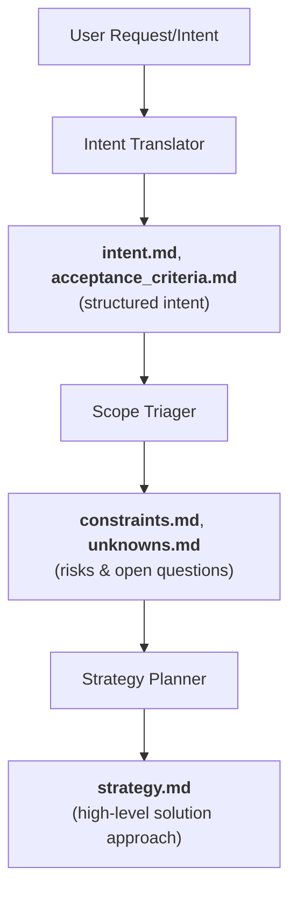

In this flow:

- The **Intent Translator** agent formalizes the request into explicit goals and criteria
- The **Scope Triager** surfaces any knowledge gaps or constraints
- The **Strategy Planner** produces a concise strategy document

Each step is gated by oversight to ensure the outputs are complete and policy-compliant.

### Canonical Failure Modes and Escalation Logic

Failures in the Infer stage usually stem from ambiguity, contradiction, or incompleteness in the input intent. For example, if requirements are unclear or conflicting, the orchestration may be unable to produce a coherent strategy.

**Canonical Failure Modes:**

1. **Ambiguous Intent** - The translator cannot produce a clear `intent.md`
2. **Unresolvable Unknowns** - The triager identifies critical unknowns that block strategy formation

**Escalation Logic:**

The escalation logic in such cases is to seek clarification or perform research rather than guessing:

- **Ambiguities** can trigger a request for human clarification or a refinement of the input
- **Significant unknowns** will hand off to the Research Orchestration to gather necessary evidence

A pipeline oversight gate at this stage ensures that if any required output (`intent`, `criteria`, etc.) is missing or empty, the process halts for review.

In essence, the Infer Orchestration will not proceed to planning until a validated intent and strategy are in place - it escalates to human input or additional research rather than risk proceeding on faulty assumptions.

### Composition (what it calls, what calls it)

The Infer Orchestration is typically the entry point of an artifact's lifecycle. It is invoked by higher-level workflows (like a Create or Update Orchestration) whenever a new task or change is initiated. It generally does not call any sub-orchestrations on its own (its steps are self-contained), but its output directly feeds subsequent orchestrations.

For example, the structured `intent.md`, `unknowns.md`, and `strategy.md` it produces become inputs to the Research and Plan orchestrations. After inferencing, the workflow often calls a Research Orchestration (if `unknowns.md` is non-empty) to resolve open questions, or proceeds to a Plan Orchestration if everything is clear.

In summary, Create pipelines and Update pipelines call Infer at the start to establish a correct intent, whereas Infer itself remains focused on interpretation and does not delegate to other orchestrations.

### Domain-Neutrality

Infer Orchestration is domain-neutral because it deals with high-level intent and strategy rather than domain-specific implementation. Whether the end artifact is code, prose, a design document, or a test plan, inferring the goals and constraints is a language understanding task. The agents (translators, triagers, and planners) operate on descriptions and requirements, which makes this orchestration applicable to any artifact type.

The output strategy is likewise abstract - it captures approach patterns (e.g., choose an algorithm, select an architectural style) without binding to technology, thereby maintaining separation of concerns.

This domain-agnostic design supports the truth hierarchy: the Strategy defined here guides planning but does not directly impose any artifact-level details. By not entangling with code or document specifics, the Infer stage ensures that decisions at the strategy layer can be reviewed or adjusted independently (governance can require human approval for strategy changes) before any concrete artifact work begins.

## Analyze Orchestration

### Intent and Definition

Analyze Orchestration focuses on developing a deep understanding of an existing artifact or system. Its intent is to generate structured knowledge about the artifact's current state, architecture, or content, which is crucial when planning modifications or audits.

In essence, Analyze orchestrations answer the question: "What is the artifact's current form and what significant patterns or issues does it have?"

This could involve:

- Static analysis of code
- Summarization of a document
- Identification of architectural patterns
- Extraction of requirements from an existing plan

By doing so, the orchestration provides an evidence-based understanding (facts, metrics, detected patterns) of the artifact. This stage aligns with the truth hierarchy's artifact layer - it doesn't alter the artifact but reveals truth about it.

The result is typically an analysis report or model of the artifact that can inform:

- **Planning** - e.g., where to insert new functionality
- **Governance** - e.g., detecting drift or anti-patterns

### Control-Flow or Coordination Diagram (text-based)

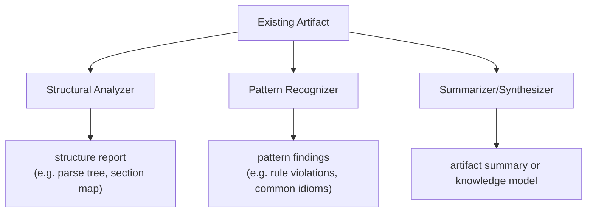

In this generic flow, multiple specialized analysis agents operate in parallel or sequence on the same artifact:

- A **Structural Analyzer** might parse the artifact to understand its components (for code, this could be an AST or dependency graph)
- A **Pattern Recognizer** checks the artifact against known patterns or anti-pattern libraries (for instance, detecting architectural rule violations or stylistic issues)
- A **Summarizer** produces a high-level description (for human understanding or further planning)

The orchestration coordinates these steps and then consolidates their outputs into a cohesive understanding (e.g. an analysis report or annotated model of the artifact). This analysis does not modify the artifact – it is purely observational and diagnostic.

### Canonical Failure Modes and Escalation Logic

As an observational process, Analyze Orchestration "fails" not in the sense of a broken artifact, but when it cannot produce a reliable understanding.

**Failure Modes:**

1. **Insufficient Information** - Parts of the artifact are too opaque (e.g., undocumented code or missing context) to analyze
2. **Analysis Tools Limitation** - The analyzers cannot handle the artifact size or format
3. **Ambiguous Findings** - Conflicting patterns or metrics that cannot be conclusively interpreted

**Escalation Logic:**

The escalation logic for analysis issues is to bring in additional help rather than proceed with uncertainty:

- If analysis is incomplete due to missing context, the orchestration may trigger a **Research Orchestration** to gather background or ask an **Investigator agent** to do a deeper dive in a sandbox (without changing the artifact)
- If analysis reveals a potential systemic issue (say a repeated anti-pattern across modules), it might escalate a report to a human or a governance audit
- The **Pipeline Oversight Enforcer** will flag if required analysis outputs or receipts are missing or if suspicious inconsistencies are found (e.g., analysis data not matching artifact content)

In case of ambiguous or inconclusive analysis, a common escalation is to mark the uncertainty and continue (with the risk noted), or to pause the pipeline for human review if the understanding is critical for safe progression.

### Composition (what it calls, what calls it)

Analyze Orchestrations are often called by **Update** or **Audit** orchestrations when a thorough understanding of the current artifact is needed before making changes or judgments.

**What calls Analyze:**

- **Update Orchestration** - Might invoke an Analyze step to map out where in the codebase a new feature should be inserted or to understand the impact of a change
- **Audit Orchestration** - Uses analysis outputs (like drift reports or violation reports) as input signals for detecting issues

**What Analyze calls:**

The Analyze Orchestration itself can involve multiple analysis agents (as described above), but typically it does not call further sub-orchestrations. Its outputs (e.g., structural maps, summaries, or lists of detected issues) are consumed by:

- **Planners** - Use the knowledge to design integration of new work
- **Review orchestrations or Audits** - Use it to cross-check expectations (for example, a drift analysis compares an artifact against its specification and feeds results into an audit)

**Summary:** Update, Verify, and Audit processes call Analyze to gather facts; Analyze produces reports but doesn't directly trigger other orchestrations except perhaps an optional Research step if directed.

### Domain-Neutrality

The Analyze pattern applies across domains because every artifact type can benefit from structured understanding.

**Domain-Specific Applications:**

- **Code artifacts** - Analysis might involve static code analysis, architecture reconstruction, or code summarization
- **Textual artifacts** (documents, knowledge bases) - Analysis could mean outline extraction, consistency checking, or fact extraction
- **Plans or designs** - Analysis may check completeness or consistency with higher-level strategy (analogous to drift checks)

The orchestration's internal agents are chosen per domain (e.g., a `linter` and `complexity analyzer` for code vs. a `grammar checker` and `outline analyzer` for a document), but the orchestration itself remains a generic "understand this artifact" pipeline.

**Key Benefits:**

- **Reusability** - The same orchestration pattern is adapted via different agent toolsets
- **Separation of concerns** - It does not plan changes or fix issues (that's for Plan or Repair orchestrations); it purely delivers an accurate picture of the artifact's state
- **Governance utility** - This clear role makes it an essential governance tool for artifact audit and for any planning stage that needs a reality check on the current state

## Research Orchestration

### Intent and Definition

Research Orchestration is designed to resolve knowledge gaps by performing a targeted information-gathering and synthesis process. Whenever the pipeline encounters "unknowns" or requires external/domain knowledge, this CREATE-type orchestration is invoked. Its intent is to transform high-level questions or uncertainties into evidence-backed findings that can guide decision-making.

In practice, the Research Orchestration takes a list of specific research questions (derived from the unknowns identified earlier) and coordinates a multi-agent process to find answers. It produces artifacts such as:

- A research findings report
- An evidence table linking claims to sources
- An open questions list for anything that remains unanswered

Essentially, it acts as a scatter-gather knowledge engine: scattering many specialized information crawlers out to gather data, then gathering and synthesizing their outputs into coherent knowledge. This ensures that subsequent planning or implementation is based on facts and best practices rather than assumptions.

### Control-Flow or Coordination Diagram (text-based)

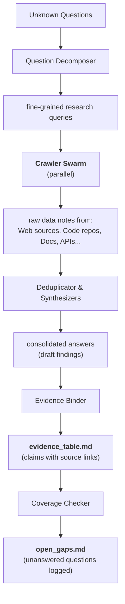

The orchestration proceeds in waves:

1. **Question Decomposition** - A Research Question Decomposer breaks broad unknowns into focused, answerable questions.

2. **Parallel Crawling** - A swarm of Crawler agents operate in parallel, each specialized (web search, repository mining, documentation lookup, etc.), to retrieve raw information relevant to those questions.

3. **Synthesis Phase** - Once data is collected, a Deduplicator agent merges overlapping findings and removes noise, then Research Synthesizer agents compile the cleaned data into human-readable findings or insights. A Structure Synthesizer may also propose domain structures or integration points discovered (for example, suggesting how the knowledge fits into the project's domain model).

4. **Evidence Binding** - An Evidence Binder systematically links each claim or answer to its supporting sources, creating an `evidence_table.md` for traceability.

5. **Coverage Check** - A Coverage/Drift Reviewer agent checks if all original questions have been addressed; any that have not are recorded as open gaps in `open_gaps.md` for transparency.

Throughout, the Pipeline Enforcer gates each stage, enforcing completeness and quality (e.g., ensuring that every claim has evidence, and that no question was silently ignored).

### Canonical Failure Modes and Escalation Logic

Research Orchestration can encounter several failure modes, mostly related to information quality and completeness.

**Failure Modes:**

1. **No Relevant Data** - Despite crawling, the agents find little or no information to answer a question, leading to many entries in `open_gaps.md`
2. **Conflicting Evidence** - Sources provide contradictory answers, making synthesis difficult
3. **Excessive Information** - Too much data to synthesize coherently, risking information overload or hallucination

The orchestration's design handles some of these gracefully: unanswered questions are explicitly documented (not hidden), and conflicting evidence can be noted in the findings with multiple perspectives.

**Escalation Logic:**

The escalation logic is triggered if the research output is insufficient or too uncertain for planning. In such cases:

- The pipeline may escalate to a **human expert review** of the open questions
- The strategy may be adjusted (for example, if a critical unknown can't be resolved, a strategic decision might be made to proceed with an assumption or reduce scope)
- The search may be broadened: if initial crawlers failed, the system might prompt an expanded research (wider search queries, or using different tools)

**Governance:**

The Pipeline Oversight Enforcer ensures no research question is simply dropped - any gap leads to either an explicit record or an escalation. If the research process itself fails (e.g., a tool error or no receipts from a crawler), oversight will flag it and could retry or ask for human input.

In summary, Research Orchestration errs on the side of documenting gaps and escalating uncertainties, rather than providing a possibly-wrong answer.

### Composition (what it calls, what calls it)

The Research Orchestration is generally invoked by other orchestrations that encounter unknowns - most commonly by a Plan or Create Orchestration after the initial infer step.

**What triggers Research:**

- In a Create (Implementation) pipeline, once intent and strategy are set, any `unknowns.md` triggers the Research sub-orchestration (Stage 2) to gather needed information before planning proceeds
- It may also be called during Update Orchestrations if new questions arise about how to implement a change (like researching a new API or library to use)

**What Research produces:**

On the output side, Research produces artifacts that directly feed into planning:

- `research_findings.md`
- `evidence_table.md`
- Other evidence artifacts

These are consumed by the Plan Orchestration to ensure that design decisions are evidence-based.

**Internal composition:**

The Research Orchestration itself is self-contained in terms of sub-calls: it orchestrates numerous agents (decomposer, crawlers, synthesizers, etc.) internally, but it does not invoke higher-level orchestrations. Once it completes, control returns to the caller (e.g., the main implementation orchestrator) along with the research outputs.

For quality, it does have an internal review stage - the coverage drift check - which acts like an embedded Review ensuring completeness of answers, but this is within the research flow.

**Summary:**

`Infer` -> `Research` -> `Plan` is a common chain: Infer hands off unknowns to Research; Research returns answers to enable effective planning.

### Domain-Neutrality

Research Orchestration is inherently domain-neutral and evidence-driven. By using specialized crawler agents, it can handle a wide range of domains:

- It can research programming problems by reading API docs or StackOverflow (via web crawlers)
- It can gather information from a codebase (via repository crawlers)
- It can collect facts from knowledge bases for a prose article

The pattern of `decompose questions -> gather data -> synthesize answers` is applicable to code, text, interface design, or any domain where external knowledge or context is needed.

The outputs are structured in a generic way (findings with evidence, unanswered questions list) so that the next stages (planning or auditing) can use them regardless of domain. This orchestration does not introduce domain-specific decisions; it provides data and truth for others to act on.

Governance is built in uniformly: every claim is backed by a source, aligning with artifact-level trust requirements (nothing is asserted without evidence). The result is a reusable research module that can plug into any artifact workflow where learning is required, ensuring that subsequent strategies or plans are well-informed and credible.

## Plan Orchestration

### Intent and Definition

Plan Orchestration converts strategic intent into a concrete implementation plan. Operating at the "Plan" layer of truth, it takes the high-level strategy (the what and general how) and produces an actionable, ordered sequence of steps (the detailed how) for artifact creation or change.

The intent is to ensure that all requirements and acceptance criteria are addressed by a well-structured plan before any actual building or coding begins.

In essence, Plan Orchestration performs **decomposition and synthesis**:

- It decomposes goals into smaller tasks/topics
- It synthesizes those into a cohesive plan artifact (e.g., an `implementation_plan.md` or a `test_plan.md`)

This orchestration is responsible for strictly bridging strategy to execution:

- It neither concerns itself with high-level directional changes (that's strategy)
- Nor with the low-level code or text (that's the artifact implementation)

By enforcing this layer, the system can ensure that any work to be done has been planned and reviewed in isolation before implementation, preserving design integrity and alignment with requirements.

### Control-Flow or Coordination Diagram (text-based)

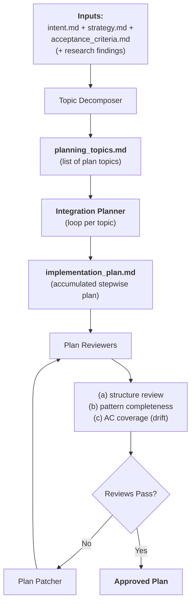

The Plan Orchestration begins by reading the strategic inputs (intent, strategy, constraints, and any research outputs) and engaging a **Planning Topic Decomposer** agent. This decomposer splits the overall task into discrete planning topics or sub-problems (each topic is a coherent set of steps) and orders them logically (foundation first, then dependents). It produces a `planning_topics.md` which enumerates these topics and their rationale (effectively the plan's outline).

Next, an **Integration Planner** agent iterates through each topic in sequence (this is an iterative refinement loop). For each topic, the planner adds the relevant steps to the `implementation_plan.md`, ensuring each step is actionable and specific. The plan is built up incrementally, which means after each topic the plan can be partially reviewed or validated before moving on.

Once all topics are processed, the orchestration invokes a **Plan Review** sub-phase: multiple reviewers check the plan against different quality criteria:

- A **Structure Reviewer** validates that the plan's format and ordering meet all structural rules (e.g., steps are sequentially numbered, each step has necessary sections like goal, success criteria, dependencies)
- A **Pattern Reviewer** checks that the plan covers required patterns and uses the organization's standard approaches (for example, ensuring each step references known best-practice patterns, and that nothing is missing from a process perspective)
- A **Plan Drift (Coverage) Reviewer** verifies that every acceptance criterion is mapped to one or more steps and no requirement was left out or only partially addressed

If any of these reviews fail, a **Plan Patcher** agent can adjust the plan to fix issues (e.g., add a missing step or clarify a step) and then re-run the reviews, looping until the plan passes all checks. This ensures the output is an **Approved Plan** artifact that is complete, coherent, and aligned with both strategy and requirements.

### Canonical Failure Modes and Escalation Logic

Failure modes in Plan Orchestration generally manifest as review failures or an inability to produce a viable plan for the given intent.

**Canonical Failure Scenarios:**

1. **Incomplete Coverage** - The plan fails the drift/coverage check, meaning some requirements or acceptance criteria were not addressed.

2. **Structural Flaws** - The plan structure is invalid (steps out of order, missing components) and cannot be easily fixed by the patcher (for instance, a fundamental ordering issue).

3. **Pattern Violations** - The plan conflicts with established strategy or patterns (e.g., it proposes an approach that violates an architectural decision or omits a mandated step).

**Iterative Refinement:**

The orchestration addresses many issues via iterative refinement: minor failures trigger the patch-and-review loop.

**Escalation Logic:**

The escalation logic kicks in if the plan cannot be made to pass reviews within a reasonable number of loops or if a fundamental issue is detected. For example, if after several attempts the plan still can't cover a particular acceptance criterion, this might indicate that the strategy is flawed or additional research is needed.

In such a case, the process escalates back to a higher level:

- It could prompt an Investigation or re-Infer the strategy (adjusting the approach)
- It could escalate to a human architect to intervene

Another escalation trigger is if a Strategic decision is required that falls outside the plan's authority - e.g., needing to change an architectural pattern to make the plan work. By design, the plan orchestration would escalate that as a Strategy-level integration change rather than silently alter course.

**Governance:**

Throughout, governance is present: the final plan cannot proceed to implementation unless the `Pipeline Oversight Enforcer` sees that all plan review receipts are present and passing.

If the plan stage "fails" (cannot produce an approved plan), the orchestration will not permit implementation to start - instead it halts and flags the issue as requiring higher-level resolution (possibly triggering an Audit if this failure is seen as a process anomaly).

### Composition (what it calls, what calls it)

Plan Orchestration is called by Create or Update orchestrations once the strategy is established (and research completed if needed).

**What calls Plan Orchestration:**

- In a new implementation scenario, the Implementation (Create) Orchestration invokes the Plan Orchestration to generate the `implementation_plan.md` (this corresponds to stages 3 and 9 in the pipeline: one plan for code implementation, one for test implementation)
- In an Update Orchestration, the plan step would similarly create a plan for the changes (often a smaller plan focusing on the delta)

**What Plan Orchestration calls:**

- Plan Orchestration itself may call sub-orchestrations for reviews - specifically, it leverages the Artifact Review Orchestration pattern to review and fix the plan artifact
- However, these review steps are often considered part of the plan workflow rather than a completely separate orchestration call (they can be implemented inline with reviewer agents, as in the example above)
- The Plan Orchestration might also incorporate an Integrate Orchestration when merging new information into an existing plan
- For instance, integrating research findings into the strategy could be handled by an integrate step to ensure coherence, though in our pipeline this was done by the integration planner agent internally

**Handoff after approval:**

Once a plan is approved, the Plan Orchestration hands off to the next phase: typically a Create Orchestration (to implement the plan) or directly to an Integrate/Implement step if in the middle of an update.

**Summary:**

- Create and Update orchestrations call Plan
- Plan internally calls Review (for plan verification), and sometimes uses Integrate logic (when assembling plan from multiple inputs)
- Plan's outputs (the plan docs) are then consumed by Implement/Create steps and also serve as a reference for Verify/Drift checks later in the pipeline

### Domain-Neutrality

Plan Orchestration, while exemplified here with software implementation plans, is a domain-neutral concept of turning strategy into an actionable game plan. The specifics of the plan content and the review criteria will vary by domain:

- For a **coding project**, steps might be code tasks
- For a **documentation project**, steps might be chapters or sections to write
- For a **design project**, steps could be prototyping stages

However, the orchestration pattern remains the same. It always ensures that intents are fully expanded into concrete to-dos and that those to-dos are vetted against requirements and best practices.

The domain-neutral design is evident in the separation of concerns: a plan for any artifact type should cover all acceptance criteria for that artifact and use the patterns appropriate to that domain.

**Domain-Specific Examples:**

- If the artifact is a **text document**, the plan might ensure all outline points are covered and style guidelines followed
- If the artifact is a **user interface design**, the plan might ensure each user story is addressed by a design component

The plan review step would simply use the relevant pattern library for that domain.

By not hard-coding any domain specifics in the orchestration logic (only in the review rules and pattern libraries), the Plan Orchestration can be reused across code, prose, or other artifacts.

**Key Governance Benefits:**

Crucially, it preserves layering: it deals only with plan correctness, leaving actual execution to the artifact creation stage. This upholds governance: changes to how work is done (process patterns) can be managed at the plan level distinct from actual content changes, improving cross-domain consistency and compliance.

## Create Orchestration

### Intent and Definition

Create Orchestration is an end-to-end workflow that produces a new artifact (or set of artifacts) from scratch, managing the entire lifecycle from intent to verified output. Its intent is to automate the full creation pipeline for a new change or feature, ensuring that by the end of the process, the artifact is not only created but also reviewed, verified, and compliant with all requirements.

A prime example is the Implementation Orchestration for software development, which takes a feature request and yields production-ready code and tests. However, the Create Orchestration concept can apply to any artifact:

- Writing a document
- Creating a design prototype
- Any other artifact type

**Key Characteristics:**

The key characteristics are that it operates as a high-level conductor, delegating to various specialized sub-orchestrations for each phase of work (`infer`, `plan`, `implement`, `review`, etc.) and enforcing quality at each step.

It is essentially a pattern of orchestration patterns - a composition that uses all other orchestration types in a strict sequence to go from nothing to a completed artifact.

The Create Orchestration embodies the system's promise of agent-driven artifact development: it doesn't perform the work itself but coordinates multiple agents and sub-workflows to achieve the final outcome.

### Control-Flow or Coordination Diagram (text-based)

Due to its comprehensive scope, the Create Orchestration's flow can be visualized as a layered pipeline with feedback loops:

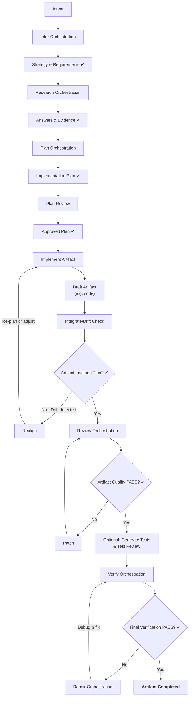

> **Note:** ✔ marks a governance gate before proceeding.

In this flow, the **Create Orchestrator** sequences all major phases:

1. It first calls `Infer` to set the direction and gather the strategy
2. Then calls `Research` to resolve unknowns
3. Then invokes `Plan` to produce a concrete plan

After plan creation, it ensures a **Plan Review** (a specialized Review orchestration on the plan artifact) passes, enforcing that the plan meets all criteria before implementation.

Next, the orchestrator delegates to an implementation agent (or sub-orchestration) to **Create** the artifact according to the plan (for code, this means writing the code following the plan steps). It immediately performs a **Drift Review** to compare the produced artifact against the plan to catch any deviations - if discrepancies are found, it can loop by sending the artifact back for fixes (or even re-planning small portions) to realign with the intended design.

Once the artifact conforms to the plan, the orchestrator triggers an **Artifact Review Orchestration**: a battery of pattern-based reviews (style, correctness, etc.) with an automated patching loop. The artifact is iteratively improved until all review checks pass, with mandatory gating that it cannot proceed while any review fails. If this loop is unable to resolve certain issues within a set limit, the orchestration will escalate (to Audit or human) rather than produce a subpar artifact.

For software, after code is finalized, the Create Orchestration may then generate and execute a **Test Plan** (essentially repeating `Plan -> Implement -> Review` for test cases).

Finally, it runs a **Verify Orchestration** (e.g., run all tests, do final lint/coverage) to ensure the artifact works in practice. Only if this final verification passes does the Create Orchestration declare success. If verification fails (e.g., tests fail), it triggers a **Repair Orchestration** to debug and fix the issues, then reruns verification.

This entire pipeline is overseen by governance agents at each stage, and receipts are logged for each action, creating an auditable trail.

### Canonical Failure Modes and Escalation Logic

Given its breadth, the Create Orchestration can encounter failure at any stage. Its design, however, is to fail early and fail fast within each sub-stage rather than propagate an undetected error forward.

**Canonical Failure Modes:**

1. **Repeated Review Failures** - An artifact (plan, code, or test) is stuck in a review loop, failing the same checks even after patching. The orchestration has a loop limit (e.g., 3 attempts); hitting this triggers an escalation to AUDIT or human intervention. In fact, multiple back-to-back review loop failures will cause the system to invoke a Process Audit Orchestration to analyze why our automated fixes aren't converging.

2. **Drift/Integration Failures** - If an implemented artifact consistently drifts from the plan (or the plan itself was flawed such that the artifact can't meet the requirements), the orchestration may call a Repair or re-Planning. After two consecutive drift check failures, a higher-level Audit can be triggered to see if the plan was unrealistic or if there's a systemic misalignment.

3. **Verification Failure** - If final tests or validation do not pass even after a repair attempt, the orchestration will escalate to human decision-makers, marking the outcome as "cannot complete automatically."

4. **Process Anomalies** - Missing receipts or an agent deviating from protocol (skipping a step). The `Pipeline Enforcer` monitors this and can trigger a process audit if needed.

**Escalation Logic:**

In general, the escalation logic for Create Orchestration is multi-tiered:

- **Minor issues** loop within the same sub-orchestration (e.g., review loops with patching)
- **Persistent issues** escalate to specialized orchestrations like Repair (for artifact-level fixes) or Audit (for systemic/process issues)
- **Unresolvable issues** escalate ultimately to humans if the automation cannot resolve them

Importantly, the orchestration never "patches over" a failure silently - an artifact will not be promoted unless all gates pass or an explicit human override is given. This strict approach ensures that the final artifact is trustworthy, and any unresolved issues are surfaced rather than hidden.

### Composition (what it calls, what calls it)

Create Orchestration is a top-level composite that calls almost every other orchestration type as part of its workflow.

**What Create Orchestration Calls:**

For instance, the Implementation (Create) Orchestration calls:

- `Infer` - to interpret intent
- `Research` - to gather info
- `Plan` - to devise the steps
- Multiple `Review` orchestrations - plan review, code review, test review
- `Integrate` steps - to merge content like test plans or incorporate fixes
- `Verify` - to run final tests
- `Repair` - if any verification fails
- `Audit` - if governance limits are hit

It acts as the central coordinator that ensures each of these sub-orchestrations are invoked in the right order and under the right conditions.

**What Calls Create Orchestration:**

No other orchestration calls a Create Orchestration (since Create is typically the highest-level task like "implement this feature" or "write this document").

**Variations:**

However, there can be variations of create: e.g., a "Document Creation Orchestration" would similarly call steps to research facts, plan the outline, draft content, review for grammar/style, and verify requirements coverage.

**Strict Layering:**

The strict layering and separation of concerns is respected in the composition: the Create Orchestrator itself does no actual creation work - it routes tasks to specialized agents or sub-orchestrators. This means the Create Orchestration is primarily about coordination and integration of results.

**Human Involvement:**

Human involvement in Create Orchestration typically comes via governance touchpoints: e.g., requiring human approval for any strategic pattern changes that arise during the process (the "Integration Pivot" - where AI suggests a pattern classification and a human may update strategy or plan heuristics accordingly).

**Summary:**

In summary, Create Orchestration is the umbrella that invokes all needed sub-orchestrations in a lifecycle, and its own logic ensures that the outputs of one feed correctly into the next, with gating in between.

### Domain-Neutrality

While the prototypical Create Orchestration example comes from software (AI-driven code pipeline), the orchestration type is meant to be domain-agnostic and reusable for different artifact types by swapping in domain-specific agents.

The pattern of `infer → plan → create → verify` holds whether the artifact is code, a research report, a design mockup, or an operating procedure document. Domain-specific knowledge is encapsulated in the sub-agents (e.g., code generators vs. text writers vs. graphic designers) and the review patterns (coding standards vs. writing style guides), but the Create Orchestration's structure remains the same. This ensures a consistent "lifecycle" regardless of artifact type.

Moreover, by enforcing the truth hierarchy layers, the Create Orchestration prevents domain-specific shortcuts that violate separation of concerns. For example, it wouldn't allow directly editing a piece of code because a test failed; instead it invokes a Repair Orchestration to produce a patch with root-cause analysis, and then Integrate that patch through the normal plan/review pipeline.

This governance principle (artifacts are not patched ad-hoc) is maintained across domains. For instance, if a final document fails a fact-check, instead of just tweaking the doc on the fly, the system would go back to Research or Plan to properly address the gap, then regenerate and review.

Thus, the Create Orchestration ensures all artifact types go through rigorous, structured creation with no direct bypassing of quality gates. It treats code, text, or any artifact with the same philosophy:

- Delegate specialized creation
- Enforce quality gates
- Only integrate changes through governed channels

## Integrate Orchestration

### Intent and Definition

Integrate Orchestration manages the merging of new content (a "delta") into an existing artifact, doing so in a controlled and conflict-free manner. Its intent is to apply changes or additions without breaking the coherence of the artifact.

In simpler terms, whenever we have to "insert this piece into that larger whole," the Integrate Orchestration comes into play. This could be:

- Merging new research findings into an existing plan
- Integrating a code patch into the codebase
- Combining a drafted paragraph into a document

The hallmark of Integrate is that it deals with two inputs: an existing artifact and a piece of new content, and produces an integrated artifact as output.

Unlike `Create` (which builds from scratch) or `Update` (which orchestrates a full change), Integrate is a more focused orchestration that assumes you already have a change ready and just need to weave it in properly.

It emphasizes maintaining structural and stylistic integrity: the result should look like it naturally belongs, as if it was part of the artifact all along, with no broken references or stylistic inconsistencies.

In the truth hierarchy, Integrate operates at the **artifact composition level** - implementing a change according to a plan or strategy given.

### Control-Flow or Coordination Diagram (text-based)

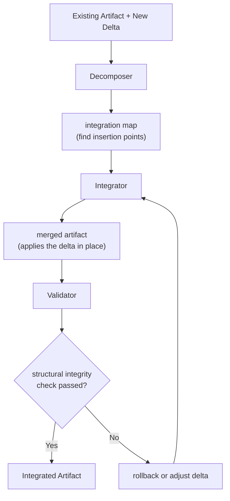

First, the **Decomposer** (structure analyzer) examines the Existing Artifact to determine where and how the new content should fit. For example, if the artifact is a document, the decomposer finds the correct section or paragraph for insertion; if code, it identifies the correct module or function to modify. This produces an `integration map` or plan - essentially instructions for the merge (e.g., "add these steps under section 2.3").

Next, the **Integrator** (merger) agent performs the actual content merge according to that map. It inserts or replaces content in the artifact, resolving minor format or syntax details as needed.

Finally, a **Validator** (checker) runs to verify that the resulting artifact is sound. This includes checking that the artifact still maintains structural integrity (e.g., the document outline is correct, or the code compiles/tests pass in a structural sense) and that any references or cross-links are intact.

If the Validator finds issues (common failure modes might be a structural conflict or broken reference), the orchestration can take corrective action:

- If a conflict is detected, it may revert the merge and either flag for human review or attempt an automated strategy adjustment (such as inserting the content in a slightly different place)
- The process may loop: `adjust strategy -> merge -> validate`, until the integrated artifact passes validation or an escalation condition is met

At the end, we have an **Integrated Artifact** that includes the new changes and has passed all immediate checks.

### Canonical Failure Modes and Escalation Logic

Integrating changes can fail in a few predictable ways.

**Canonical Failure Modes:**

1. **Structural Conflicts** - The new content doesn't fit cleanly (e.g., adding it violates ordering or causes duplication). The response is typically to flag the conflict and either attempt an alternative merge strategy or escalate to a human to decide how to reconcile the structure.

2. **Broken References** - The delta content might introduce references (links, citations, function calls) that don't resolve in the context of the existing artifact. The orchestration will detect these and attempt to repair them (update links, import missing dependencies in code, etc.).

3. **Style Mismatch** - The inserted content might be in a different style or format (imagine a paragraph with a different tone, or code using a different naming convention). The Integrate Orchestration can run a style normalization pass to adjust the new content to match the host artifact's style.

4. **Validation Failure** - The post-merge artifact fails some correctness check (for code, maybe it doesn't compile or a test fails; for a document, maybe the formatting is off or a lint check fails). In such cases, the orchestration may revert to the pre-merge state and either retry with an adjusted approach or escalate the problem to a Repair Orchestration if the issue seems complex.

**Escalation Logic:**

The escalation logic for integration is often to involve human oversight if automated merging cannot resolve conflicts. For example, if two sections of text both need to exist but conflict in content, a human editor might need to intervene.

Another escalation path: if repeated attempts to integrate a change result in unacceptable drift or conflicts, this could trigger an Audit to see if the plan for integration was flawed or if a higher-level strategy change is needed.

In practice, integrators try minor adjustments and fallback strategies first, and only escalate when it's clear the delta cannot be fitted without larger repercussions.

**Governance:**

Pipeline governance enforces that no integration is accepted until validation passes all criteria ("gate" on validation success), thus preventing partial merges from slipping through.

### Composition (what it calls, what calls it)

Integrate Orchestration is usually called by higher-level orchestrations whenever incremental updates are applied.

**What Calls Integrate:**

- **Plan Orchestration** - Uses an integrate-like process to incorporate research findings into the plan (ensuring new steps merge into the plan structure coherently)
- **Update Orchestration** - After generating the content change (say a code diff or a doc fragment), an Integrate Orchestration is invoked to apply that diff to the main artifact
- **Create Orchestration** - Commonly invokes Integrate as a sub-step when combining phases (e.g., merging a generated test plan into the overall plan or merging a patched fix into the codebase)

**What Integrate Calls:**

Integrate itself typically doesn't call other full orchestrations except in failure cases; it works with internal agents (`decomposer`, `merger`, `validator`).

One exception is if integration fails in a complicated way, it might hand off to a Review or Repair process:

- After merging, one might run a quick Review to ensure the integrated artifact meets standards
- Call Repair if the integration introduced a bug not easily fixed by re-merging

**Outputs and Consumers:**

The outputs of Integrate (the merged artifact) are then consumed by subsequent steps like:

- **Review orchestrations** - To formally review the updated artifact
- **Verify** - To test it

**Summary:**

Plan, Update, and Repair orchestrations call Integrate to perform structured merges; Integrate itself works within its scope but signals to others if further action (like review or human input) is needed for complex merges.

### Domain-Neutrality

The Integrate pattern is domain-neutral in that merging new content into an existing context is a universal problem. The specifics (line-based diff vs. section insertion) differ, but the principles hold: preserve what's already good, only add the new, and maintain consistency.

**Domain-Specific Applications:**

- **Code** - Applying a code diff or new function into the codebase without breaking builds or logic
- **Documents** - Inserting new sections or edits without ruining the document's flow or format
- **Plans** - Adding steps or modifications without invalidating the plan's logic

The orchestration uses domain-specific analyzers and validators (e.g., a structure validator may parse a document structure vs. compiling code for a codebase), but the high-level steps remain the same.

**Core Integration Rules:**

The rules it enforces are analogous across domains:

- **Preserve Existing** - Don't overwrite unless authorized
- **Maintain References** - Links or dependencies must remain valid
- **Ensure Style Consistency** - New content matches existing style
- **No Orphaned Additions** - Every new piece must integrate into the whole structure

These rules have parallels whether merging text or code. Thus, the Integrate Orchestration can be reused with appropriate agent tooling for different artifact types.

**Separation of Concerns:**

By design, it separates the concern of "how to merge" from "what to merge" - the latter comes from Plan or Create processes. This separation means Integrate just focuses on the mechanics of a correct merge, which is a transferable skill across domains.

**Governance:**

In terms of governance, Integrate introduces human checkpoints in a domain-agnostic way: any time a merge touches higher-level patterns (Strategy or Plan heuristics), it defers to human approval as per integration targets policy. This ensures that domain-wide decisions are not made by an automated merge in isolation.

## Review Orchestration

### Intent and Definition

Review Orchestration conducts a pattern-based critique of an artifact and iteratively improves it through a feedback loop. Its intent is to enforce quality standards and catch issues or deviations in an artifact before that artifact is considered "done" or eligible for release.

Unlike integration (which merges content) or verify (which checks functionality), Review focuses on **policy and pattern conformance**: does the artifact meet the organization's standards, guidelines, and best practices?

This applies to:

- **Code** - coding standards, architecture guidelines, security rules
- **Documents** - grammar, style guide, completeness
- **Plans** - ensuring required sections/patterns are present

The Review Orchestration achieves this by orchestrating multiple specialized **Reviewer agents**, each checking the artifact from a different angle, and a **Patcher agent** that can fix certain failures automatically.

The outcome is either a `PASS` (artifact meets all criteria) or, if not, the artifact is patched and re-reviewed until it passes or a defined loop limit is reached.

In effect, Review acts as an automated code (or document) review process, akin to a multi-expert panel that can also do quick fixes, ensuring the artifact is critically evaluated and polished against known quality patterns.

### Control-Flow or Coordination Diagram (text-based)

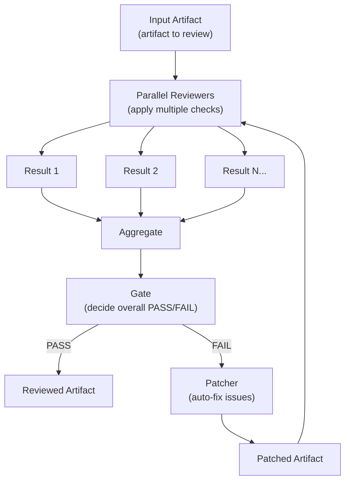

In this flow, the artifact enters the review orchestration and is simultaneously sent to multiple **Reviewer agents** in parallel. Each reviewer focuses on a specific pattern set or aspect. For example, one might check code style, another security vulnerabilities, another architectural compliance. They each produce a report of findings (pass/fail and notes).

The orchestration then uses a **Gate** (an Enforcer/decision agent) to aggregate these results and decide if the artifact overall passes all checks. If all reviewers pass, the artifact is considered reviewed (the orchestration ends with a `PASS` output). If any check fails, the gate marks the whole review as `FAIL`.

In the fail case, a **Patcher agent** is invoked to attempt fixes on the artifact based on the reviewers' feedback. For instance, if the style check failed due to line length, the patcher might reformat code; if a document has a spelling error, the patcher corrects it.

The patched artifact is then fed back into the loop, and the set of reviewers run again to evaluate the changes. This cycle repeats until either:

- The artifact passes all checks (loop exits with success), or
- The number of iterations reaches a predefined `max_loops` limit

If the loop limit is hit without achieving a pass, the orchestration triggers an **escalation step** instead of looping further. Escalation typically means handing off to a higher-level Audit or a human for manual review of the persistent issues.

### Canonical Failure Modes and Escalation Logic

The Review Orchestration is itself about handling "failures" (each failed check triggers the loop), but there are failure modes concerning the review process:

1. **Loop Exhaustion** - The artifact cannot reach a `PASS` within the allowed number of patches/reviews. This is a key trigger for escalation; at that point, it's assumed the remaining issues might be too complex or systemic for automated patching. The orchestration will escalate to an Audit orchestration or human review when the loop limit is reached.

2. **Conflicting Feedback** - Two reviewers may repeatedly conflict (for example, one patch to satisfy reviewer A causes a new issue for reviewer B). In such cases, the orchestration recognizes the deadlock and escalates to a human arbitrator to resolve the conflict.

3. **Unpatchable Issues** - The patcher might not know how to fix a certain failure (e.g., a logical flaw or a design inconsistency). If after an attempt the same issue persists, the system might mark it as `requires human fix` and escalate.

4. **Reviewer Error** - If a reviewer agent itself encounters an error or produces an invalid result, the orchestration can retry that reviewer or skip it and escalate if it consistently fails to execute.

**Escalation Logic:**

The escalation logic is generally to preserve quality: better to involve a human or audit than to allow a subpar artifact. Specifically, upon escalation, the Review Orchestration might produce a summary of the issues and then invoke an Audit Orchestration (for systemic pattern issues or process issues) or simply halt the pipeline for manual intervention.

An example: if a code review fails 3 times on the same pattern and cannot fix it, a Process Audit might be triggered to examine if the pattern rule is too strict or if there's a knowledge gap in the patcher.

**Governance Aspect:**

Another governance aspect: the review orchestration never forces a `PASS`. If quality isn't met, it escalates rather than marking an artifact "approved" with known issues. This strictness ensures that artifact governance (through reviews) is upheld and any failure to reach consensus is handled at a higher level, not waived.

### Composition (what it calls, what calls it)

Review Orchestrations are called by `Create`/`Update` orchestrations at points where an artifact needs validation. In the Implementation pipeline, for example, Plan Review, Code Review, and Test Review are all instances of the Review Orchestration applied to different artifact types.

A `Repair` Orchestration also calls a Review Orchestration after applying a fix, to ensure the repaired artifact meets quality standards before returning it. Essentially, any time we have an artifact that must meet certain standards before proceeding, a Review step is inserted.

The Review Orchestration itself is self-contained in terms of sub-calls; it uses internal parallel agents for checking and a patcher agent for fixing. It typically does not call other orchestrations except at escalation (where it might call `Audit` as a next step on failure).

**Upstream and Downstream Flow:**

- **Upstream:** It's orchestrated by higher flows - e.g., the Create Orchestration will invoke a Review on the code artifact, and again on the test artifact, etc., as mandatory gates
- **Downstream:** A successful Review yields an improved artifact ready for the next stage (like verify or integration into the main branch), whereas an escalated Review will hand off to Audit or halt the pipeline

**Artifact Audit vs Pipeline Audit:**

It's worth noting that Review is a form of artifact governance (ensuring the artifact itself is good), distinct from pipeline governance. However, its outputs (review reports) are often used by pipeline-level audits to detect systemic issues (for example, if many artifacts keep failing the same review rule, the Audit orchestration takes that as input).

**Summary:**

`Create`, `Update`, and `Repair` orchestrations call Review to perform quality checks on artifacts; Review may in turn invoke a limited escalation to `Audit`; otherwise it is an end-of-line for that artifact's refinement loop.

### Domain-Neutrality

The Review Orchestration is inherently domain-adaptable. The concept of having multiple criteria and looping until an artifact meets all of them can be applied to any artifact type by changing the reviewer agents.

**Domain-Specific Reviewers:**

- **Code:** Plug in linters, static analyzers, and style checkers
- **Text documents:** Plug in grammar checkers, fact checkers, style guide enforcers
- **Plans:** Use plan structure and completeness checkers

The orchestration logic (`parallel review -> aggregate -> patch -> loop`) remains identical.

**Pattern Library Concept:**

This separation is facilitated by a pattern library concept: each artifact type has its pattern sets (for example, `CODE-A` patterns for architecture, `CODE-S` for style, etc., as seen with code reviewers), and the reviewers enforce those. The Review Orchestration itself doesn't hard-code any domain rules; it just knows how to manage the process of applying them and fixing issues.

**Reusability Benefits:**

This ensures reusability across domains - one can create new Reviewer agents for a new domain and immediately use the same orchestration framework. It also provides a consistent governance checkpoint across artifact types: whether it's code or prose, an artifact cannot bypass the review stage. Only after passing review is an artifact considered for integration or release, ensuring all artifacts, irrespective of domain, are held to their respective quality standards.

**Controlled Improvement Cycle:**

Furthermore, the presence of the patcher in the loop underscores the principle that even though automated fixes are applied, they are applied in a controlled loop, not as one-off edits. This pattern holds across domains (e.g., an automated editor for prose would make changes and then the document is re-reviewed, just like code is re-linted and re-checked). This systematic approach yields a reliable improvement cycle for any artifact type.

## Verify Orchestration

### Intent and Definition

Verify Orchestration validates that an artifact is functionally correct, complete, and conforms to its intended behavior in a live or execution sense. In contrast to Review (which checks static patterns and style), Verify is about **dynamic correctness and conformance**: does the code run and produce expected outcomes? Does the document or plan satisfy all acceptance criteria when followed or executed?

Essentially, Verify orchestrations perform final checks such as:

- Running test suites
- Performing end-to-end validations
- Comparing the artifact against an authoritative specification or acceptance tests

The intent is to catch any discrepancies between the artifact and the original intent (goal) at a holistic level - ensuring there's no drift in behavior and that everything works together as a whole.

Verify is often the last gate before declaring an artifact "done." It often includes steps like executing the artifact in a sandbox (for code, running the compiled program and tests; for infrastructure, deploying and pinging; for a process document, maybe a walkthrough simulation) and measuring the results against expected criteria.

### Control-Flow or Coordination Diagram (text-based)

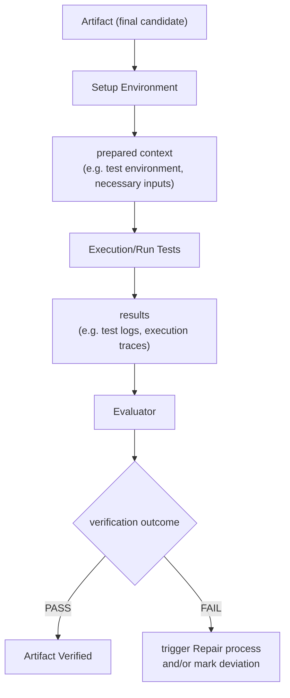

For example, in a software context, the Verify Orchestration will set up the testing environment (compiling code, deploying to a test server, etc.), then run the full test suite and other verification steps like lint checks or coverage analysis. The results (logs, pass/fail counts, coverage metrics) are collected and an `Evaluator` agent determines if all criteria are met (all tests passed, coverage is above threshold, etc.).

If the outcome is `PASS`, the artifact is confirmed working and ready. If it's a `FAIL`, the orchestration records which aspects failed (e.g. which test cases) and typically will trigger a **Repair Orchestration** to address the issues.

In a non-code scenario, say verifying a plan or procedure, the orchestration might simulate the procedure or logically walk through each step to ensure all acceptance criteria would be satisfied (akin to a dry-run) and then decide pass/fail on that basis. The core idea is a real-world check: this orchestration often actually runs or uses the artifact in the way it's intended to be used, as the final validation.

### Canonical Failure Modes and Escalation Logic

Failure in Verify is straightforward: the artifact does not meet one or more acceptance criteria or fails in practice.

**For code, typical failure modes are:**

- Test failures (some expected output didn't match)
- Performance shortfall (maybe a performance test indicates it's too slow)
- Environmental errors (it doesn't deploy or run correctly)

**For other artifacts, failure could mean:**

- A logical inconsistency discovered when stepping through (e.g., a procedure that has a dead-end step)
- User acceptance criteria not actually satisfied when tried

**Escalation Logic:**

The immediate escalation for any verify failure is usually to invoke the **Repair Orchestration** - this is a sandboxed debug-fix cycle aiming to correct whatever went wrong. For instance, if a test fails, the system spawns a Repair process to debug the code in isolation and generate a patch. Once the patch is prepared, the Verify orchestration will run again (essentially looping: `verify -> repair -> verify` until pass).

If multiple cycles of repair still cannot produce a passing result (i.e., something fundamentally is wrong or outside the AI's capacity to fix), the escalation goes to human intervention. At that point, a human might do a deeper analysis or re-evaluate the requirements.

**Artifact Drift from Acceptance:**

Another failure mode specifically governed here is artifact drift from acceptance: if the artifact "works" but doesn't actually do what was intended (maybe all tests pass except the tests themselves missed something), this might escape automated detection.

To mitigate that, the verification should be comprehensive (including comparing the plan's acceptance criteria to test coverage or outcomes). In some pipelines, a drift check is included as part of verification - e.g., re-reading the acceptance criteria and confirming each is tested or otherwise validated. If any acceptance criteria lack verification, that could be flagged as a failure in Verify.

The escalation logic in that case might be to loop back to Plan or Tests creation to fill the gap, or escalate to an audit if a requirement was dropped.

**Summary:**

In summary, for any concrete failure (tests, etc.), the Verify orchestration entrusts fixes to the Repair sub-pipeline, whereas for systemic verification gaps or multiple repair failures, it escalates to human or audit. It never "ignores" a failing check; by design the pipeline stops here if verification isn't green.

### Composition (what it calls, what calls it)

### Domain-Neutrality

Verify orchestrations are conceptually domain-neutral, but their implementation is highly tailored to the artifact type's definition of "working."

**Domain-Specific Definitions of "Working":**

- **Software:** "Working" means tests pass and runtime behavior is correct
- **Document:** "Working" might mean it fulfills all informational requirements and has no broken references
- **Plan:** "Working" could mean if one were to execute it, it logically achieves the goal

Because of these differences, the specific agents and tools in a Verify orchestration differ (running code vs. doing a semantic read-through of a document). However, the orchestration structure remains consistent: set up a scenario, measure actual outcomes vs expected outcomes, then decide pass/fail. It's essentially the QA stage generalized.

**Layer Separation:**

By keeping this stage separate, the system ensures that functional validation is not conflated with static checks or design (layer separation: after artifact is built and polished, we still verify behavior).

This stage is where domain-specific test cases or acceptance criteria are applied - but the orchestrator handling it can be generic in orchestrating "run all validations and aggregate result." For instance, it could iterate through all acceptance criteria for a policy document and mark each as satisfied or not.

**Human-in-the-Loop Integration:**

For text or designs, this might involve human-in-the-loop (user acceptance testing), which could be integrated as a required manual step (e.g., require a human sign-off as part of verification for UX design). The orchestration can accommodate that by pausing for human input where automation can't fully verify.

**Governance Distinction:**

The important governance distinction is that verification is artifact-level governance ensuring the artifact does what it's supposed to in context, complementing earlier reviews which ensured it looked right. It applies to any domain: a final check that the artifact isn't just correct in form, but in function or intent.

**Continuous Improvement Pattern:**

Any deviations found here that indicate a misunderstanding of intent often feed back into strategy or plan (domain-neutral pattern of continuous improvement). For example, if an acceptance criterion was missed and discovered in verify, that might prompt an update to the planning heuristics so that future plans always include a step for it - illustrating the cross-domain learning through governance feedback loops.

## Repair Orchestration

### Intent and Definition

Repair Orchestration (often termed Debug & Repair) is invoked when an artifact fails to meet requirements (e.g., tests fail, or the artifact is broken in some way) and an automated fix is needed. Its intent is to diagnose the root cause of a failure and produce a patch or solution without directly altering the main artifact in an uncontrolled way.

In essence, Repair orchestrations provide a sandboxed environment to reproduce the failure, identify the problem, and formulate a fix. They ensure that any corrections to an artifact are accompanied by understanding ("what was wrong and why") and are applied in a governed manner (as patches/evidence, not ad-hoc changes to the artifact).

This orchestration type is crucial for maintaining the principle that artifacts aren't patched blindly - instead, Investigators generate structured evidence of the failure and the suggested fix, which can then be integrated properly.

**Output Artifacts:**

The output of a Repair orchestration typically includes:

- A root cause analysis document
- A patch diff or detailed description of changes
- An updated artifact that has been tested to now pass where it previously failed

### Control-Flow or Coordination Diagram (text-based)

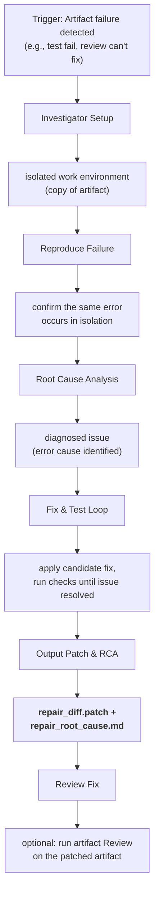

Once a failure trigger is received (for example, final verification reported a test failing, or an Audit recommended a repair), the Repair Orchestration begins by creating an isolated replica of the artifact's environment.

In software, this might be a `git worktree` or separate branch where the code can be modified freely without affecting the mainline. The **Investigator agent** then attempts to reproduce the failure in that environment - e.g., run the failing test or scenario to see the error occur, ensuring the issue is understood and real.

Next, the Investigator performs **Root Cause Analysis**: examining logs, error messages, or using debugging tools to pinpoint why the failure happened (e.g., a null pointer exception due to a missing check).

With a cause hypothesized, the orchestration enters a **Fix & Test loop**: the Investigator proposes a fix (edits the code or artifact), then reruns the relevant tests or checks to see if the failure is resolved. It iterates, trying adjustments, until the test passes and no new issues are introduced in that scope.

Once the artifact is working in isolation, the orchestration outputs a patch (for code, a diff file; for text, maybe a document of changes) along with a patch summary and the root cause analysis (RCA) document explaining the issue and the fix.

Importantly, before concluding, the Repair Orchestration can optionally call an **Artifact Review Orchestration** on the fixed artifact to ensure the fix meets quality standards and doesn't violate any patterns - essentially treating the fix like new content to be reviewed.

At the end, it returns the patch and analysis back to the caller (e.g., the main pipeline) rather than directly altering the main artifact.

### Canonical Failure Modes and Escalation Logic

Repair Orchestration itself can "fail" in the sense of not being able to find or implement a successful fix.

**Failure Modes:**

1. **Cannot Reproduce** - The failure cannot be reproduced in the isolated environment ("works on my machine" scenario). In this case, the orchestration might report `ALREADY_WORKING: no issues reproduced` and hand back control, possibly triggering an audit or human check because an inconsistency was detected (maybe an environmental issue).

2. **Unknown Root Cause** - The Investigator cannot pinpoint the cause of the failure within a reasonable time or attempts. After exhaustive debugging, it might give up and output that the cause is undetermined, leading to escalation to human developers for manual debugging.

3. **Patch Not Found** - Despite understanding the cause, the agent cannot generate a patch that passes all tests (every attempted fix fails in some way). The orchestration may have a retry limit, after which it will output a status like `CANNOT_FIX` with reasoning.

4. **Fix Causes Other Issues** - The fix might solve the immediate problem but break something else (a regression). If the Investigator ends up chasing new failures in a loop, it may eventually declare the fix attempt too risky or complex.

**Escalation Logic:**

The escalation logic for these scenarios is to involve humans or higher-level planning:

- For a `CANNOT_FIX`, the system escalates to a human engineer or strategy planner to decide next steps. This might mean re-thinking the approach (update the strategy or plan) or simplifying requirements.

- In some cases, a failure might trigger a Strategy-level change - e.g., "we can't fix this module, maybe we need to refactor or use a different library," which is beyond the scope of a quick repair and requires planner involvement.

- Another escalation is to feed the unresolved issue into an Audit (if patterns of failures are emerging that AI can't handle, an audit might classify it as needing a design change or tool improvement).

**Key Principles:**

Generally, the Repair Orchestration will not silently reintroduce the failing artifact into the pipeline; if it cannot fix it within its sandbox, it escalates the problem rather than, say, merging a half-fix.

One more built-in guard: because Repair works in isolation, the main artifact remains unchanged until a vetted patch is ready. This supports the principle of not directly patching artifacts in place. Only after repair produces a satisfactory patch (or fails trying) does the pipeline decide to apply a change or escalate.

Thus, in the event of repair failure, the artifact in the mainline is still the old failing one, and the pipeline likely halts awaiting human input.

### Composition (what it calls, what calls it)

**Repair Orchestration** is called by any orchestration that encounters a critical failure that automated patching within the loop couldn't resolve. Commonly, a **Verify Orchestration** triggers Repair when tests fail, or a **Create/Update Orchestration** routes to Repair if, say, a drift cannot be corrected by re-syncing implementation (in Implementation Stage 6 and 11, a plan vs. code drift fail could call Repair as a more in-depth fix approach).

Additionally, a **Process Audit Orchestration** can recommend a repair (with a suggested approach) for systemic issues, essentially handing that off to Repair to implement the actual changes. Repair itself will utilize sub-steps:

- It calls on an **Investigator agent** to do debugging and fixing
- It may invoke a **Review Orchestration** to validate its fix as mentioned

In some scenarios, after Repair produces a patch, the pipeline might invoke an **Integrate Orchestration** to merge that patch back into the main artifact (though in code, applying a patch is straightforward; in documents, integrating the diff might need a safe merge). However, often the Orchestration that called Repair will handle integration: e.g., the Implementation Orchestrator receives the patch diff and then applies it in the main branch, followed by re-running whatever stage failed.

So the composition is:

- **Verify/Integrate/Review orchestrations** call Repair on failure
- Repair uses **Investigator** and possibly **Review** internally
- Repair returns a patch and analysis

If successful, the calling orchestration (or its parent) then integrates that patch and resumes. If unsuccessful, the calling context escalates further (perhaps up to an Audit or human).

Repair is thus a specialized sub-orchestration focused on troubleshooting. Notably, from a governance perspective, it produces a clear record (root cause, diff, etc.) which is an input to artifact governance (e.g., the RCA can be later audited or used to update testing to cover this case in the future). This separation of concerns means the pipeline can treat repair outcomes in a consistent way: either a fix artifact to incorporate or a signal to escalate.

### Domain-Neutrality

Repair Orchestration is most clearly defined in software terms (debugging code), but the pattern of **isolate-diagnose-fix-validate** can apply to other domains.

For instance, consider a lengthy document that fails a final fact check - a Repair orchestration could create a copy of the document, try different ways to correct the misinformation by researching and rewriting a section (like a targeted mini-create for that section), and then verify the fact check passes. Or for a business process that fails an audit, a Repair could simulate changes to the process in a `sandbox` and see if that resolves the compliance issue.

The general mechanism is **domain-neutral**:

- Work in a `sandbox` to avoid collateral damage
- Use domain-specific strategies to find the cause of failure
- Iterate on fixes
- Output a clear description of what was done

The difference will be in tooling: for code we have `debuggers` and `tests`; for text we have grammar checkers and reference materials; for a plan we might have a plan simulator. But the orchestration flow doesn't change.

By keeping repair separate, the system ensures that any fixes come with context (why the fix) and are reviewed in isolation before being merged. This promotes **trust in automated fixes** across domains - whether it's a code patch or an edit to a legal document, the change is not simply applied; it's validated and explained.

It also feeds back into higher layers: for example, multiple similar repairs could indicate a pattern that strategy should address (which a Process Audit might notice). Thus, the repair process is both a **solution and a learning mechanism**, applicable to any domain where complex artifacts can fail and need non-trivial fixes.

Importantly, repair orchestrations maintain **artifact governance** by not letting spontaneous, unreviewed fixes slip into the main artifact. This holds true universally: even if an AI "fixes" a document's section, that fix would go through the same cycle of evidence and review as any code fix. In doing so, the repair stage upholds the system's integrity across all artifact types.

## Update Orchestration

### Intent and Definition

**Update Orchestration** coordinates the intentional modification of an existing artifact, leveraging the other orchestration types to ensure the change is implemented correctly, consistently, and with full traceability.

Unlike **Create Orchestration** (which starts from nothing) or **Repair** (which responds to an unexpected failure), an Update Orchestration is initiated by a deliberate intent to change something - for example, add a new feature to existing code, revise a section of a document, or refactor a component.

Its intent is to manage the end-to-end update process so that the artifact transitions from its current state to a new desired state without breaking and without deviating from strategic principles. Essentially, it treats an update as a mini-project: re-interpret the new requirement in context of what's there, plan the changes, apply them, and verify everything still works.

This orchestration ensures that updates are done in a controlled, repeatable manner, maintaining the strict quality gates and separation of concerns that a fresh implementation would, thereby preventing ad-hoc direct edits. It is often seen as a composite orchestration that calls `infer`, `analyze`, `plan`, `integrate`, `review`, `verify`, etc., specifically tailored to insertion or modification tasks.

### Control-Flow or Coordination Diagram (text-based)

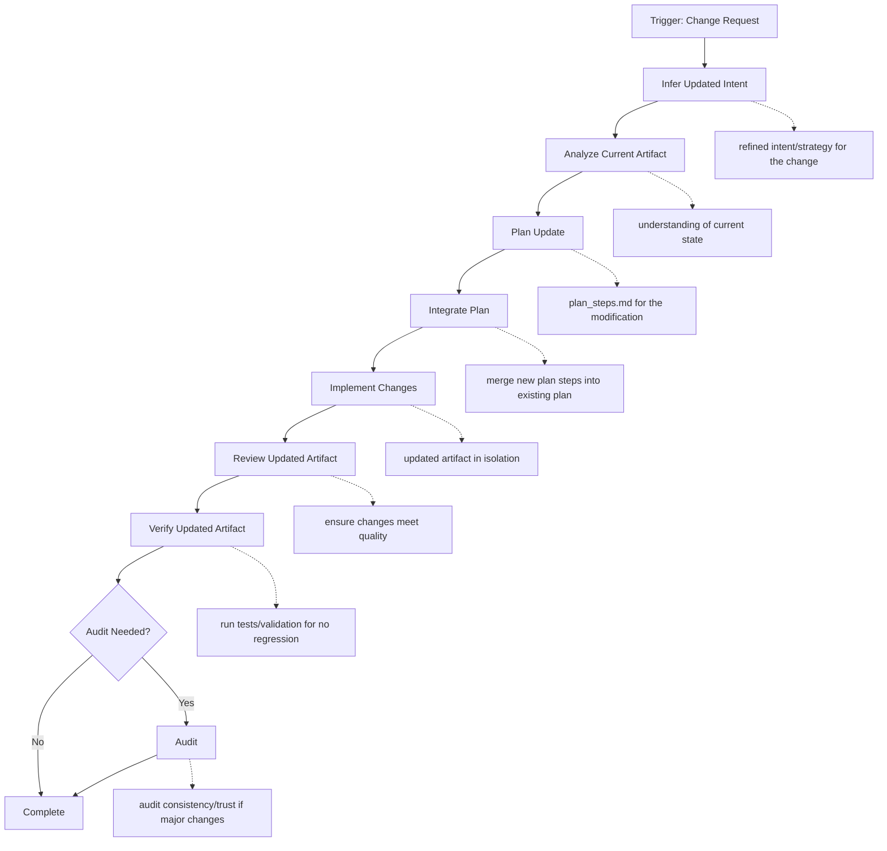

For example, suppose we have a codebase and we need to update a function to a new requirement. The **Update Orchestration** may first re-interpret the change request via an **Infer** step, especially if the request is high-level, to clarify the specific goals and constraints of the update (often, though, the intent is straightforward if it's a small change).

Next, it will **Analyze** the current artifact - read the relevant code or document sections, perhaps generate a summary of how the feature currently works, and identify where the changes will have impact (this could involve static analysis or search in the code) to avoid overlooking anything.

With that context, it goes into **Plan**: devising an Update Plan that describes what needs to be modified or added, broken down into steps. This might entail using the Plan Orchestration on a smaller scale: e.g., decomposing the change into sub-tasks like "modify function A, update related tests, adjust documentation" so nothing is missed. If the artifact had a formal plan (like an existing design document or test plan), the orchestration might integrate the new steps into that plan (ensuring the plan remains up to date).

Then comes execution: it delegates to an implementor agent to **Apply** the changes in a controlled environment (perhaps on a branch or in memory). Once changes are made, the orchestration runs a full **Review** of the updated artifact, just as in a create scenario, to catch any rule violations introduced by the update (for instance, new code following style, new text following style).

After addressing any review findings (possibly looping with a patcher), it performs a **Verify** step, rerunning relevant tests or validation suites to ensure the update didn't break existing functionality (regression testing) and that it fulfills the new acceptance criteria. If verification fails, it may go through **Repair** as discussed earlier.

Once everything passes, the updated artifact is ready to merge into the main line (if work was done on a branch, integration orchestration would merge it). The orchestrator might also trigger an **Audit** if the update process encountered anomalies (for example, if an update required an unusual number of fixes or deviated from plan, a process audit might log this for oversight).

Overall, the diagram shows the update orchestrator as essentially reusing the create pipeline steps but constrained to an existing artifact's context.

### Canonical Failure Modes and Escalation Logic

During an update, failures can occur at any sub-step, similar to a create. Typical failure modes include:

1. **Misinterpretation of Change** - If the initial understanding (`Infer`) was wrong, the plan and subsequent work might be off-target. This could surface later as verification failures (the updated artifact doesn't actually satisfy the real need). The escalation is to loop back: re-infer or ask for human clarification on the intent.

2. **Integration Conflict** - The update may conflict with other ongoing changes or the current artifact state (e.g., the plan says to add a section but that section exists differently now). This would appear in integration or drift checks. Escalation: possibly a human needs to reconcile the differences or rebase changes.

3. **Quality Regression** - The updated artifact might pass new criteria but inadvertently violate some existing quality (like performance or security). If reviews or tests catch this, the orchestration will likely branch into a `Repair` (to fix the regression) or adjust the plan to include mitigating steps.

4. **Loop Limits** - As with create, if the review of the updated artifact fails repeatedly or the tests keep failing despite attempted fixes, it escalates to either `Audit` or a human review to decide whether to proceed or roll back.

Essentially, the Update Orchestration inherits the escalation logic of each sub-orchestration it uses. A unique escalation for update specifically is **scope creep or design mismatch**: if implementing the update reveals that the required change is larger or fundamentally different than expected (for example, a "small tweak" actually requires a major redesign), the orchestrator might escalate to `Strategy` - meaning it pauses and says "this update request requires re-evaluating architecture or splitting into multiple updates." At that point, a human architect or strategic planner might need to intervene.

From a **pipeline governance perspective**, if an update fails in a way that two or three attempts can't fix (similar pattern failing), a `Process Audit` might trigger to see if there's a systemic issue (maybe the plan heuristics for updates are insufficient). The presence of the `Pipeline Oversight Enforcer` at each gate ensures that an update that's not meeting standards does not slip through: it either loops or escalates. In worst cases, the escalation might be to abort the update (leaving the artifact unchanged) and mark the task for manual handling.

### Composition (what it calls, what calls it)

**Update Orchestration** is typically invoked by an external trigger such as a user request for modification, a change in requirements, or possibly by an Audit that identified an artifact needing improvement (though audit might just recommend it, then a user triggers the update).

It acts as a wrapper that calls multiple orchestrations:

- `Infer` (if needed to clarify the change intent)
- `Analyze` (to examine current artifact)
- `Plan` (to design the change)
- `Create/Implement` (to perform the change, often using an Integrate orchestration if merging into existing content)
- `Review` (to critique the changed artifact)
- `Verify` (to test the changed artifact)
- `Repair` (if tests fail) in sequence

In effect, it can be seen as a variant of the Create pipeline tailored to starting with an existing artifact and focusing on the delta.

Importantly, it also leverages **Integrate Orchestration** heavily: after generating the new pieces (code or text), it must integrate them into the artifact (which might involve merging code or combining document sections) - this is a core difference from create, where the artifact started empty. So the update orchestrator often calls Integrate both at the planning stage (merging new plan steps) and at the implementation stage (merging the changes into the main artifact representation).

Once the process is done, the updated artifact is produced along with all the receipts and evidence of what was done. Because it composes many parts, no single sub-call does heavy lifting alone - it's the orchestrator's job to ensure the handoffs are smooth (the plan is based on current analysis, implementation follows the plan, etc.).

**Upstream:** The caller of Update is usually a human decision or a scheduling system that decided it's time to implement a certain change (one could imagine a backlog item triggers this orchestrator).

**Downstream:** After a successful update, the artifact might go to a human for final approval or directly into production, depending on governance rules. If the update orchestration fails or escalates, it returns control to a human operator or triggers an audit.

### Domain-Neutrality

The concept of an **Update Orchestration** is inherently domain-neutral - artifacts in any domain require updates over time, and the structured approach can be applied similarly. For software code, we described the typical scenario.

For a document, an update orchestration would similarly:

- Parse the document (`Analyze`) to understand where changes need to be made
- Plan the edits (maybe outline the new section to add)
- Execute them (perhaps using a writing agent)
- Review them (grammar/style review)
- Verify (maybe run a plagiarism check or confirm that all requested changes were indeed made and all references still consistent)

The same pattern emerges: don't just jump in and edit; treat it systematically with analysis and planning, then integration of the new content. This ensures, for example, that updating a policy doc to add a new rule goes through steps to verify the rule doesn't conflict with existing ones (analysis) and that all references to it are added (review/verify).

The **layering principle** is preserved - if an update reveals a pattern-level change (like a new architecture policy is needed), the orchestrator will escalate that to the Strategy layer rather than implementing it silently. Thus, the update process interfaces with strategy and plan layers as needed, keeping concerns separated.

Across domains, this yields more reliable and governable updates: every update has an audit trail of what was changed and why, and the final artifact remains consistent with both its historical state and new requirements.

**Pipeline governance**, such as oversight gates, apply equally: every update must have receipts and pass the same gates as initial creation did (for code, it must pass tests; for docs, pass reviews; etc.), reinforcing cross-domain trust in updated artifacts.

By using the existing orchestration toolkit in a modular way, the Update Orchestration achieves reusability and consistency: essentially, `Update = Infer/Analyze + Plan + (Create & Integrate) + Review + Verify`, which is a pattern that translates well to any artifact type with minor tooling swaps.

## Audit Orchestration

### Intent and Definition

**Audit Orchestration** serves as a governance-focused process that evaluates either artifacts or the development process itself for compliance, trustworthiness, and systemic issues.

Its intent is twofold:

1. **Perform an artifact-level trust validation** – examine an artifact (or set of artifacts) to ensure they meet certain trust criteria (e.g., no unexplained deviations, all changes are documented, security and compliance standards met)
2. **Detect systemic patterns of issues** that individual steps might miss – for example, patterns of repeated errors or process anomalies that hint at deeper problems

Unlike Review or Verify, which focus on a single artifact's quality or correctness, Audit takes a meta-level view: it might scan through the history of receipts, differences between plan and implementation, unusual agent behaviors, etc., to identify things like unapproved strategy changes, missing documentation, or recurring review failures.

There are two flavors of Audit in this context:

- **Artifact Audit** – checking the integrity and consistency of artifacts themselves
- **Process Audit** – checking the pipeline process

The orchestrator we design can often cover both by adjusting scope. For instance, an artifact audit might verify that every code change has an associated requirement and test (traceability audit), or that a document's final content matches the approved outline (no sneaky additions). A process audit might compile logs to find if any step skipped a gate or if an agent frequently needed manual overrides.

In summary, **Audit Orchestration is about ensuring trust** – trust in artifacts and trust in the pipeline – by systematically analyzing evidence (receipts, artifacts, logs) after or during the development cycles.

### Control-Flow or Coordination Diagram (text-based)

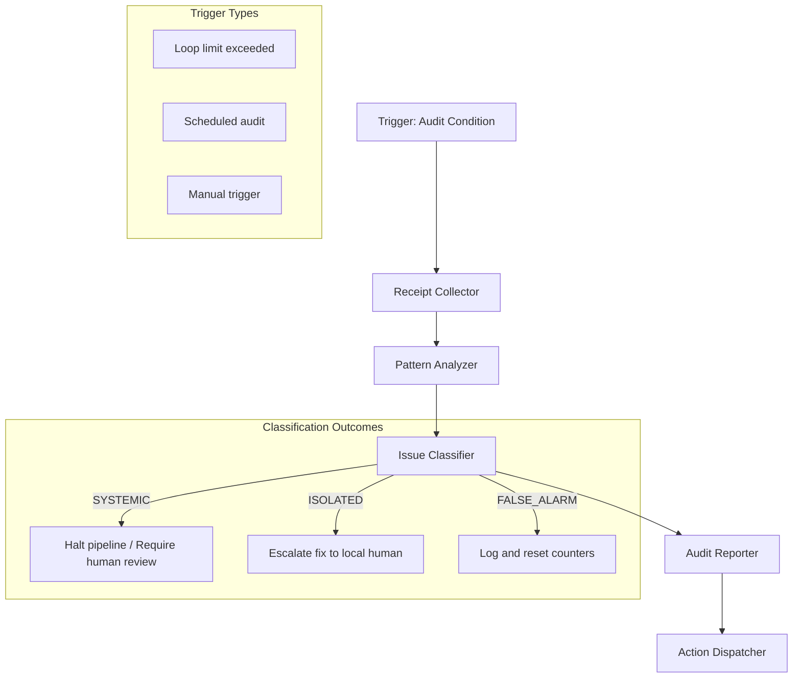

**Agent Responsibilities:**

- **Receipt Collector** - Gathers all relevant receipts and logs for scope
- **Pattern Analyzer** - Scans history for failure patterns or anomalies
- **Issue Classifier** - Classifies findings as `SYSTEMIC`, `ISOLATED`, or `FALSE_ALARM`
- **Audit Reporter** - Generates `audit_report.md` summarizing findings and recommendations
- **Action Dispatcher** - Takes appropriate action based on classification

**Example Walkthrough:**

For example, suppose a code review orchestration hit its loop limit 3 times on a particular PR. This could trigger a **Process Audit Orchestration**. The **Receipt Collector** agent will pull together all receipts from those review attempts, plus any related drift reports or test results, and maybe the diff of code changes.

Next, the **Pattern Analyzer** agent crunches this data: it might find that each time, the failure was due to the same rule (say, a particular static analysis rule). It might also check if this pattern appears across other artifacts (maybe this rule fails often in many PRs).

Then the **Issue Classifier** agent looks at the pattern analysis and decides whether the problem is:

- **SYSTEMIC** - Indicative of a rule or process that might need changing
- **ISOLATED** - Just this artifact or edge case
- **FALSE_ALARM** - Perhaps the rule is fine and just needs one more iteration

Based on that, the **Audit Reporter** composes an `audit_report.md` documenting what was analyzed, what pattern was found, the classification, and recommended actions. For instance, it may say: "Pattern identified: 3 failures due to overly strict line-length rule. Classified SYSTEMIC. Recommendation: adjust coding standard or improve code generator prompt to produce shorter lines."

Finally, the **Action Dispatcher** step takes an appropriate action:

- In a **systemic case**, it might halt the pipeline for this PR until the team addresses the underlying issue (and notify administrators)
- For an **isolated case**, it might just escalate that artifact to a human to fix manually without stopping all work
- If it was a **false alarm**, it might simply log it and reset any counters (maybe the next run can proceed)

In an artifact-focused audit (say a scheduled quarterly code audit), the pattern analyzer might be looking for things like functions that have no tests, or stale to-dos, etc., with similar classify/report steps.

The diagram covers the generic flow of scanning evidence -> analyzing -> categorizing -> reporting -> acting.

### Canonical Failure Modes and Escalation Logic

Audit orchestrations themselves might "fail" if they cannot draw a conclusion or encounter incomplete data. Failure modes include:

1. **Insufficient Data** - If receipts or logs are missing (which is itself a problem to flag), the audit might not be able to complete its analysis. The response is to note this (e.g., "audit incomplete due to missing data from Stage 7") and often escalate to a manual process check.

2. **Ambiguous Patterns** - The analysis might find anomalies but not be sure if they are truly problematic. By design, the classifier would err on the side of caution: label it isolated (needing human review) rather than systemic if unsure.

3. **Audit Itself Fails** - If the audit agent or process encounters an error (like the analyzer crashed on large logs), then immediate human escalation is warranted because audit is a safety net - if it fails, we want humans to inspect that scenario. It's rare to have automated recovery for an audit, because it's the backstop. Instead, an audit failure triggers an alert.

In terms of escalation logic, the outcomes of audit classification are themselves escalations:

- **SYSTEMIC** classification is an escalation to organizational response (halt pipeline, maybe convene a review board to update guidelines).
- **ISOLATED** is an escalation to the local human (developer or domain expert) to fix a specific artifact outside normal automation.
- **FALSE_ALARM** is essentially a no-escalation case, but even there the audit might reset some counters or monitoring so that the system knows this incident was accounted for.

If an audit was manually triggered or scheduled and finds nothing serious, it just produces a report for record (maybe noting small suggestions).

One key point: audit orchestrations must themselves be governed to avoid conflict of interest - often the Pipeline Oversight Enforcer monitors the audit too (ensuring, for example, the audit report isn't tampered with and that if audit says halt, the pipeline indeed halts).

If an audit identifies a possible tampering (like receipts not matching artifact), that is a critical artifact-level trust issue; escalation could involve security incident procedures beyond the scope of automation (i.e., notify system admin immediately).

In summary, audit orchestrations escalate findings to the appropriate level of intervention: process changes for systemic issues, human fixes for isolated ones, and ensure nothing slips through silently.

### Composition (what it calls, what calls it)

**Audit Orchestration** can be triggered by specific events or thresholds (loop limits, drift score too high, etc.) in the pipeline by the **Pipeline Oversight** (this is the automated trigger). It can also be scheduled or manually invoked for periodic checks.

In terms of composition, Audit orchestrations often call on analysis tools:

- Static analyzers
- Log scanners
- Diff tools

These are usually encapsulated in the **Pattern Analyzer** logic. Audit orchestrations generally do not call other main orchestrations except possibly to consult an Investigator or repair process for follow-up.

However, we saw in the **Repair Orchestration** context that a Process Audit can produce recommendations consumed by a Repair Orchestration - that implies the chain:

1. Audit identifies a systemic issue and suggests a fix
2. Triggers a Repair orchestration to implement remediation steps

For example, if audit finds a systemic code style problem, it might trigger an automated refactoring (under an Update orchestration) across the codebase to fix it. But those would be separate orchestrations initiated as a result of audit, not sub-called by audit.

**Upstream triggers:**

- Various orchestrations like Review or Verify will call Audit when their own escalation conditions hit (like the loop limit)
- The pipeline oversight might also call an audit after a sequence of orchestrations completes, as a final assurance check (like auditing a release candidate artifact for any issues not caught)
- **Artifact Audit** might be invoked at the end of a Create/Update to double-check trust (for instance, verifying that all receipts are present and every deviation was justified)

In doing so, it differentiates from the process triggers: an artifact audit could be triggered by a policy like "audit any artifact of high criticality before deployment." In both cases, the Audit Orchestration uses similar mechanisms (collect data, analyze, report).

After an audit runs, it typically doesn't directly modify anything; instead it outputs recommendations or actions for others. It's the governance eyes and ears. Because audit is about oversight, it sits somewhat above the regular flow: often triggered by the oversight agent or on schedule, and its "customers" are either human overseers or orchestrations like Repair that handle what audit finds.

### Domain-Neutrality

Audit orchestration is **domain-neutral** in principle because governance and compliance checking apply everywhere, but the specifics vary by domain. The pattern of scanning for deviations or issues is universal: whether it's code (did we follow all coding standards? any un-reviewed changes?), text (did all references get updated? any sections added without review?), or even a pipeline of tasks (were any steps skipped or done out of order?), the audit process systematically goes through logs and artifacts to find anomalies.

**Domain-Specific Analyzers:**

We simply plug in different analyzers depending on what we're auditing:

- **Process audits** - Analyze receipts and logs
- **Code artifact audits** - Analyze commit history, test coverage, security scan results
- **Document audits** - Analyze revision history, citations, consistency of terminology

**Classification Applicability:**

The classification of `SYSTEMIC` vs `ISOLATED` is a generally useful concept in any domain:

- **Systemic** - Our patterns or process need improvement
- **Isolated** - Just fix this instance

The actions might differ: halting a software pipeline vs. flagging a document as "do not publish" until fixed. But in all cases, the Audit Orchestration doesn't fix things itself - it raises flags and provides evidence.

**Separation of Concerns:**

This aligns with the separation of concerns: audit identifies issues, but remediation is separate (often via Repair orchestration or human). This clean separation is a known governance best practice, and we maintain it across domains. For example, an audit of a financial report might find a compliance issue but then a human or separate process must correct the report; the audit just documents it.

**Cross-Cutting View:**

Additionally, audit ensures a cross-cutting view - it can look at patterns across multiple artifacts or across time, something individual creation processes can't do. This makes it inherently domain-agnostic because it's not tied to the minutiae of creating code or text, but to the consistency and reliability of either the artifact or process as a whole.

**Guardian of the Truth Hierarchy:**

Overall, Audit Orchestration acts as the guardian of the truth hierarchy's integrity. It checks that:

- **Strategy decisions** were actually respected (no one changed architecture without approval)
- **Plan** was followed (no drift unaccounted)
- **Artifact** is sound and untampered

By isolating this role into its own orchestration, we ensure that artifact governance (validating artifacts) and pipeline governance (validating the process) are explicitly handled and not conflated with productive work, yet their findings feed back into improving both artifact quality and process reliability.
