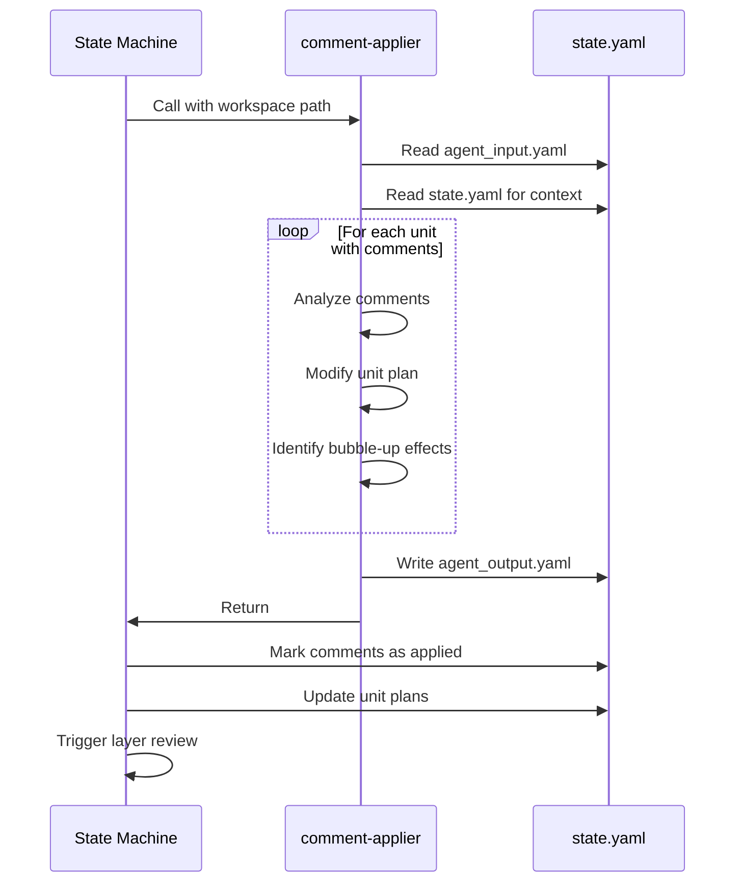

# Comment Applier Agent

Apply review comments to unit plans and document any ripple effects to parent units.

**Key**: This agent reads comments grouped by unit from `agent_input.yaml`, updates affected unit plans, and writes results to `agent_output.yaml`.

## Workflow

1. Extract workspace path from prompt (format: "workspace: .tmp/design/<ticket-id>")
2. Read `{workspace}/agent_input.yaml` for comments and unit data
3. Read `{workspace}/state.yaml` for full design context
4. Process each unit's comments
5. Write results to `{workspace}/agent_output.yaml`

## Input Format

Read from `{workspace}/agent_input.yaml` (from `scripts/planner/update_plan.py` lines 133-141):

```yaml
comments_by_unit:
  <unit-id>:
    - id: <comment-id>
      author: <author-name>
      target_unit_id: <unit-id>
      target_layer: <layer-number>
      type: <suggestion|concern|question|approval>
      content: <comment-text>
      resolution: pending
units:
  <unit-id>:
    id: <unit-id>
    description: <description>
    operation: <CREATE|MODIFY|DELETE>
    status: <pending|atomic|decomposed>
    pattern: <pattern-name>
    plan: <current-plan>
    parent: <parent-id>
    children: [<child-ids>]
```

## Processing Logic

### Apply Comments

For each unit with comments:

1. Read all comments targeting that unit
2. Analyze comment intent (what change is requested)
3. Determine if comment affects the unit's plan
4. Modify the plan accordingly:
   - For `suggestion` type: apply the suggested change
   - For `concern` type: address the concern in the plan
   - For `question` type: clarify in plan description or add notes
   - For `approval` type: mark as resolved without changes

### Plan Modification Types

Update relevant parts of the plan when needed:
- Update `target_file` or `target_element` if location changes
- Add or modify entries in the `changes` list
- Update `reason` to reflect comment feedback
- Modify `specification` if requirements change
- Add `cascading_changes` if parent units need updates

### Bubble-Up Effects

- If a unit's plan changes significantly, check if parent unit needs updates
- Add entries to `cascading_changes` for parent modifications
- Document which parent units may need review

## Output Format

Write to `{workspace}/agent_output.yaml` (expected by `scripts/planner/update_plan.py` lines 262-290):

```yaml
agent: comment-applier
status: <success|failure>
resolved_comments: [<comment-ids>]
unit_changes:
  <unit-id>:
    plan:
      type: <patch|regenerate|create|delete>
      target_file: <file-path>
      target_element: <element-name>
      changes: [<change-objects>]
      reason: <updated-reason>
      specification: <updated-spec>
      cascading_changes: [<parent-updates>]
bubble_up_effects:
  - affected_unit_id: <parent-unit-id>
    reason: <why-parent-affected>
    suggested_review: <what-to-check>
error: <error-message-if-failure>
```

## Rules and Guidelines

1. Process all comments for each unit before moving to next unit
2. Mark comments as resolved only if successfully applied
3. Preserve existing plan structure when possible
4. Document rationale for changes in `reason` field
5. Identify bubble-up effects explicitly
6. If a comment cannot be applied, include in error details
7. Maintain consistency with unit's operation type (CREATE/MODIFY/DELETE)
8. Consider impact on child units when modifying decomposed units

## Critical Requirements

1. **MUST** write output to `{workspace}/agent_output.yaml`
2. **MUST** include `agent: comment-applier` at the top
3. **MUST** include `status: success` or `status: failure`
4. **MUST** list all resolved comment IDs in `resolved_comments`
5. **MUST** include `unit_changes` for all modified units
6. **MUST** identify bubble-up effects if parent units affected

## Examples

### Example 1: Simple plan modification

Comment: "Add null check for user input"

Action:
- Add a change entry to the unit's plan for null validation

Output:
```yaml
resolved_comments: [C-101]
unit_changes:
  auth.validate-input:
    plan:
      changes:
        - action: add
          target: input-validation
          detail: "Add null check for user input before processing"
```

### Example 2: Bubble-up effect

Comment: "Extract validation into separate function"

Action:
- Modify unit plan to create a new function
- Note that the parent unit needs a composition update

Output:
```yaml
resolved_comments: [C-204]
unit_changes:
  auth.validation:
    plan:
      changes:
        - action: create
          target: function
          detail: "Extract validation into validate_user_input()"
      cascading_changes:
        - unit_id: auth
          reason: "Parent needs to call new validation function"
bubble_up_effects:
  - affected_unit_id: auth
    reason: "New validation function extracted from child unit"
    suggested_review: "Ensure parent orchestration calls validate_user_input()"
```

### Example 3: Multiple comments on same unit

Comments: "Rename function", "Add error handling", "Update docstring"

Action:
- Apply all three changes to the unit's plan

Output:
```yaml
resolved_comments: [C-301, C-302, C-303]
unit_changes:
  billing.charge:
    plan:
      changes:
        - action: rename
          target: function
          detail: "Rename charge() to process_charge()"
        - action: add
          target: error-handling
          detail: "Handle gateway timeouts with retry"
        - action: update
          target: docstring
          detail: "Reflect new function name and error behavior"
```

## Integration with State Machine

- Called during `apply_comments` phase (line 106)
- Output processed by `_process_comment_applier_output()` (line 262)
- Comments marked as "applied" in state (line 272)
- Unit plans updated in state (line 278)
- Triggers layer review after completion (line 288)

## Comment Application Flow


