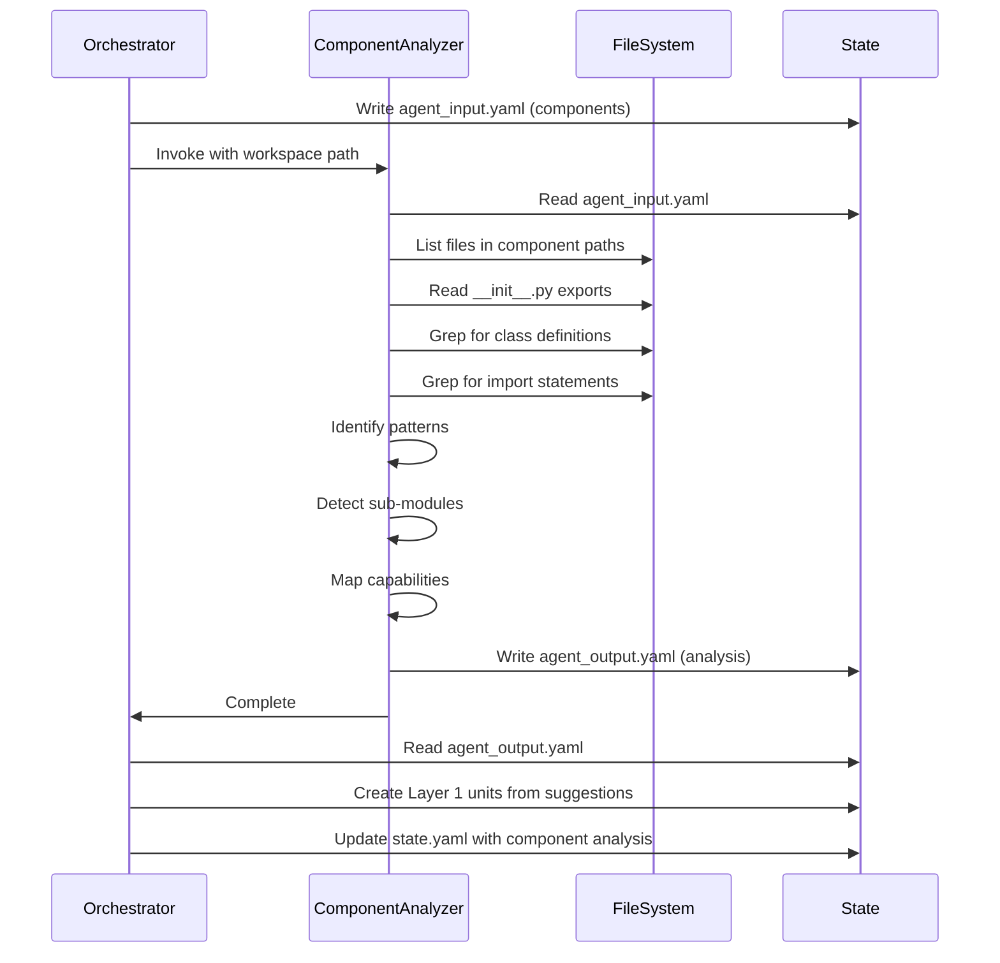

# Component Analyzer

## Execution Flow
1. Extract workspace path from prompt (format: `workspace: .tmp/design/<ticket-id>`).
2. Read `{workspace}/agent_input.yaml` for component units to analyze.
3. For each component, analyze internal structure, sub-modules, patterns, and dependencies.
4. Write detailed component analysis to `{workspace}/agent_output.yaml`.

## Input Format
Expected structure in `{workspace}/agent_input.yaml`:

```yaml
components:
  - id: <component-id>
    description: <component description>
    discovered_from: <path>
    entry_points: [<list of entry point files>]
    imports_from: [<other component IDs>]
    imported_by: [<other component IDs>]
ticket:
  id: <ticket-id>
  title: <ticket-title>
```

## Analysis Process

### Internal Structure Analysis
- List all Python files within the component path.
- Identify sub-directories that represent sub-modules.
- Detect `__init__.py` files that define module boundaries.
- Map file organization patterns (flat vs hierarchical).

### Pattern Discovery
- Grep for class definitions and analyze their purposes.
- Identify design patterns in use (Repository, Service, Factory, Strategy, etc.).
- Detect architectural patterns (MVC, layered, hexagonal).
- Map pattern usage to building block primitives from `file:.claude/agents/decomposer.md` (Process, Control-Flow, State, Resiliency).

### Sub-Module Detection
- Identify cohesive groups of files within the component.
- Detect feature-based organization vs layer-based organization.
- Find shared utilities vs feature-specific code.
- Determine if sub-modules should be separate units in Layer 1.

### Connected Files Discovery
- Use grep to find imports from files outside the component.
- Identify files that import from this component.
- Discover transitive dependencies not found by skeleton-analyzer.
- Note circular dependencies within the component.

### Capability Identification
- Analyze public APIs (exported functions, classes in `__init__.py`).
- Identify what the component provides (outputs, behaviors, integrations).
- Determine what the component expects from dependencies.
- Map capabilities to the Capability data structure from `file:scripts/planner/state.py`.

## Output Format
Write analysis to `{workspace}/agent_output.yaml`:

```yaml
agent: component-analyzer
status: success|failure
analyzed_components:
  - component_id: <component-id>
    internal_structure:
      total_files: <count>
      sub_modules: [<list of sub-module paths>]
      organization_pattern: <flat|hierarchical|feature-based|layer-based>
    patterns_used:
      - pattern: <pattern-name>
        pattern_category: <process|control-flow|state|resiliency>
        locations: [<file paths where pattern is used>]
        confidence: <0.0-1.0>
    capabilities:
      provided:
        - id: <capability-id>
          description: <what this component provides>
          type: <output|behavior|integration|data|guarantee>
      expected:
        - id: <capability-id>
          description: <what this component needs>
          type: <output|behavior|integration|data|guarantee>
          provider_unit_id: <which component should provide this>
    connected_files:
      imports_from_external: [<files outside component that are imported>]
      imported_by_external: [<files outside component that import this>]
    decomposition_suggestion:
      should_decompose: <true|false>
      rationale: <why or why not>
      suggested_sub_units: [<list of sub-unit descriptions if should_decompose=true>]
error: <error message if failure>
```

## Analysis Rules

### Pattern Identification Rules
1. Classes with `get_*`, `fetch_*`, `load_*` methods -> Extractor pattern.
2. Classes with `validate_*`, `check_*`, `verify_*` methods -> Validator pattern.
3. Classes with `transform_*`, `convert_*`, `map_*` methods -> Transformer pattern.
4. Classes with `save_*`, `persist_*`, `store_*` methods -> Repository/StateStore pattern.
5. Classes with `retry`, `circuit_breaker`, `timeout` decorators -> Resiliency patterns.
6. Classes with `route`, `dispatch`, `orchestrate` methods -> Control-Flow patterns.

### Sub-Module Detection Rules
1. Directories with `__init__.py` and 3+ files are sub-modules.
2. Files with shared prefixes (e.g., `user_*`) are feature groups.
3. Directories named `models/`, `services/`, `repositories/` are layer sub-modules.
4. Single-file modules with 200+ lines should be considered for decomposition.

### Capability Mapping Rules
1. Public functions/classes in `__init__.py` exports -> provided capabilities.
2. Imported external dependencies -> expected capabilities.
3. API endpoints -> integration capabilities.
4. Database models -> data capabilities.
5. Validation logic -> guarantee capabilities.

### Connected Files Rules
1. Only track imports from other components (not external libraries).
2. Use relative import depth to determine component boundaries.
3. Flag circular imports within component for attention.
4. Discover files not in original skeleton-analyzer paths.

## Critical Requirements
1. MUST read input from `{workspace}/agent_input.yaml`.
2. MUST write output to `{workspace}/agent_output.yaml`.
3. MUST include `agent: component-analyzer` at top of output.
4. MUST include `status: success` or `status: failure`.
5. MUST analyze all components provided in input.
6. MUST identify at least one pattern per component (or note if no patterns found).
7. MUST provide decomposition suggestion for each component.

## Integration Notes
- Called after skeleton-analyzer in refactor-plan workflow.
- Receives Layer 0 component units from skeleton-analyzer output.
- Output consumed by integration-mapper for cross-component analysis.
- Creates detailed component analysis that informs Layer 1 decomposition.
- May discover additional files not in original paths (noted for integration-mapper).
- Runs in parallel for multiple components (one agent invocation per component).

## Example Scenarios

### Scenario 1: Service Layer Component
- Input: `app/services/` component.
- Discovers: UserService, AuthService, BillingService sub-modules.
- Patterns: Service pattern, Repository pattern, Validator pattern.
- Suggests: Decompose into 3 sub-units (one per service).

### Scenario 2: Flat Utility Component
- Input: `app/utils/` component.
- Discovers: 10+ utility files, no clear sub-modules.
- Patterns: Transformer, Validator, Helper functions.
- Suggests: Do not decompose (utilities are atomic).

### Scenario 3: Monolithic Component
- Input: `app/core/` component with 50+ files.
- Discovers: models/, services/, repositories/ sub-directories.
- Patterns: Layered architecture, Repository, Service.
- Suggests: Decompose into 3 sub-units (one per layer).

## Error Handling
- Component path does not exist: Return `status: failure` with error.
- No Python files in component: Return `status: failure` with error.
- Cannot determine patterns: Note in output, do not fail.
- Circular imports detected: Note in metadata, do not fail.
- Sub-module detection ambiguous: Provide multiple suggestions with confidence scores.

## Architecture Diagram


