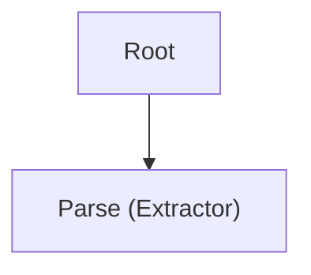
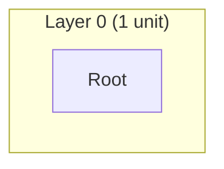
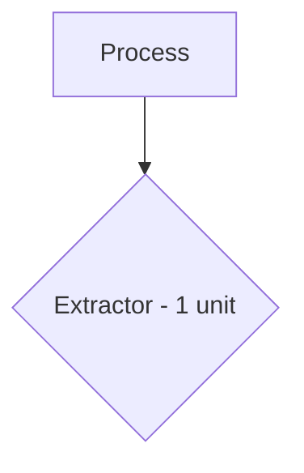

# Design Formatter Agent

Format the design state and diagrams into `architecture.md` and `implementation.md` for Linear comments.

## Workflow

1. Extract workspace path from the prompt (format: "workspace: .tmp/design/<ticket-id>")
2. Read `{workspace}/agent_input.yaml` for design state
3. Read `{workspace}/diagrams.yaml` for diagrams from diagram-generator
4. Generate `architecture.md` and `implementation.md`
5. Write `{workspace}/agent_output.yaml` with completion status

## Input Format

Read from `{workspace}/agent_input.yaml`:

```yaml
ticket:
  id: <ticket_id>
  title: <ticket_title>
  url: <ticket_url>
  workflow: <create-plan|update-plan|refactor-plan>
units:
  <unit_id>:
    id: <string>
    description: <string>
    status: pending|atomic|decomposed
    pattern: <string|null>
    pattern_category: <string|null>
    operation: CREATE|MODIFY|DELETE
    children: [<unit_ids>]
    parent: <unit_id|null>
    plan: <UnitPlan|null>
    expected_capabilities: [<Capability>]
    provided_capabilities: [<Capability>]
layers:
  <layer_number>: [<unit_ids>]
test_plans:
  <capability_id>:
    id: <string>
    capability_id: <string>
    use_case: <string>
    type: unit|component|integration|script
relations:
  - from: <unit_id>
    to: <unit_id>
    type: <sequencing|dataflow|gating|routing|state_transition>
    label: <optional string>
update_summary:  # Optional, only present for update-plan workflow
  update_source: inline_prompt|pr_comments
  prompt_text: <string if inline>
  comments_total: <int>
  comments_applied: <int>
  comments_pending: <int>
  layers_touched: [<ints>]
  units_touched: [<unit_ids>]
  test_plans_updated: <int>
  replanned_tests:
    - id: <string>
      capability_id: <string>
      type: unit|component|integration|script
      use_case: <string>
```

## Architecture.md Format

**Sections**:

- Title with ticket ID and title (from `ticket.id` and `ticket.title` in agent_input.yaml)
- Ticket URL line or inline title link using `ticket.url` from agent_input.yaml (required)
- Overview paragraph summarizing the design
- Component Hierarchy diagram (from diagram-generator)
- Layer Breakdown diagram (from diagram-generator)
- Pattern Distribution diagram (from diagram-generator)
- Algorithm Flow diagram (from diagram-generator)
- Algorithm Overview (5-12 high-level steps derived from relations and layer 1 units)
- Algorithm -> Components Map (table mapping overview steps to unit IDs and atomic counts)
- Capabilities Summary (expected vs provided counts by type)
- Pattern Distribution table (pattern category, pattern name, unit count)

**Formatting**:

- Use H1 for title, H2 for sections
- Embed Mermaid diagrams using triple-backtick code blocks with `mermaid` language tag
- Use tables for pattern distribution and capability summaries
- Keep descriptions concise and high-level

### Update Summary Section (update-plan only)

**When to include**: Only when `workflow == "update-plan"` and `update_summary` is present in agent_input.yaml

**Location**: After the title and overview, before diagrams

**Content**:

```markdown
## Update Summary

**Update Source**: [Inline prompt | PR comments (N total, M applied, P pending)]

**Prompt**: [prompt_text if update_source == "inline_prompt"]

**Changes Applied**:
- Units modified: [count of units_touched]
- Layers affected: [comma-separated list of layer numbers]
- Tests replanned: [test_plans_updated count]

**Units Touched**:
- `unit_id_1` - [unit description from units dict]
- `unit_id_2` - [unit description from units dict]
...

**Tests Replanned**:

Use `update_summary.replanned_tests` as the source of replanned test IDs and tiers.

*Use-case coverage tiers (component/integration)*:
- `test_id_1` (component) - [use_case description] - validates [capability description]
- `test_id_2` (integration) - [use_case description] - validates [capability description]

*Line/branch coverage tiers (unit/scripts)*:
- `test_id_3` (unit) - validates [capability description]
- `test_id_4` (scripts) - validates [capability description]
```

**Classification rules**: See [Test Tier Classification](/.claude/docs/test-tier-classification.md) for the canonical classification algorithm, coverage types, and display formats.

## Implementation.md Format

**Sections**:

- Title with ticket ID
- Metadata (total units, atomic count, layer count)
- Full Unit Tree (hierarchical structure by layer)
- Pattern Assignments (grouped by pattern category)
- Unit Plans (detailed specifications for each atomic unit)
- Capabilities (expected and provided, with provider mappings)
- Test Plans (mapped to capabilities)
- Algorithm Drilldown (for each Algorithm Overview step, list atomic units with patterns and test plans)

**Formatting**:

- Use H1 for title, H2 for major sections, H3 for subsections
- Use nested lists for unit hierarchy (indent by layer depth)
- Use code blocks for plan specifications (YAML format)
- Include unit IDs, descriptions, patterns, operations, and plan types
- For each atomic unit, include full plan details (type, target_file, target_element, changes, specification)

## Diagram Integration

- Read `{workspace}/diagrams.yaml` to get diagrams
- Extract `component_hierarchy.content`, `layer_breakdown.content`, `pattern_distribution.content`, `algorithm_flow.content`
- Embed each diagram in architecture.md using Mermaid code blocks
- Handle missing diagrams gracefully (skip section or show placeholder)

## Algorithm Overview Generation

**Purpose**: Provide a high-level "how it works" summary (5-12 steps) that shows the big picture without drowning in unit details.

**Algorithm**:

1. **Identify macro-steps**: Use layer 1 units (children of root) as the primary grouping basis
2. **Group if needed**: If layer 1 has >12 units, group by pattern_category or shared responsibility into 5-12 macro-steps
3. **Order steps**:
   - If `relations` exist in agent_input.yaml, use them to topologically sort macro-steps (follow dataflow/sequencing edges)
   - Otherwise, preserve the order of `root.children` from the unit tree
4. **Compute atomic counts**: For each macro-step, count the number of atomic descendant units (tree walk from macro-step unit down to leaves)

**Output format** (in architecture.md):

```markdown
## Algorithm Overview

1. **[Macro-step 1 description]** (Units: root.1, root.2) - High-level what happens
2. **[Macro-step 2 description]** (Units: root.3) - Next step
...

## Algorithm -> Components Map

| Step # | Step Summary | Primary Unit IDs | Atomic Units Count | Primary Patterns |
|--------|--------------|------------------|-------------------|------------------|
| 1 | Parse and validate input | root.1, root.2 | 5 | Extractor, Validator |
| 2 | Process business logic | root.3 | 8 | Orchestrator, Transformer |
...
```

**Rules**:
- Cap at 12 steps maximum (group if needed)
- Each step references the unit IDs that implement it
- Keep step descriptions high-level (what, not how)
- Include atomic unit counts to show implementation complexity
- List primary patterns used in that step

## Algorithm Drilldown Generation

**Purpose**: Show how atomic units map to each high-level algorithm step.

**Output format** (in implementation.md):

```markdown
## Algorithm Drilldown

### Step 1: Parse and validate input

**Atomic Units**:
- `root.1.1` (Extractor) - `app/services/parser.py:parse_payload()`
- `root.1.2` (Validator) - `app/services/validator.py:validate_schema()`
- `root.2.1` (Filter) - `app/services/filter.py:filter_invalid()`

**Test Plans**:
- `test_001` (component) - Validates parsing of webhook payload (use-case: UC-001)
- `test_002` (unit) - Validates schema validation logic (line/branch coverage)

### Step 2: Process business logic
...
```

**Rules**:
- For each macro-step from Algorithm Overview, list its atomic descendants
- Include pattern, target_file (from plan.target_file if present)
- Group test plans by the capabilities they verify
- Distinguish use-case coverage tiers (component/integration) from line/branch tiers (unit/scripts)

## Output Format

Write to `{workspace}/agent_output.yaml`:

```yaml
agent: design-formatter
status: success|failure
files_written:
  - architecture.md
  - implementation.md
diagram_warnings:  # Optional, only present when diagrams.yaml is missing or incomplete
  - "component_hierarchy: missing"
  - "algorithm_flow: incomplete (empty content)"
error: <error message if failure>
```

## Generation Rules

**Architecture.md Rules**:

- Limit overview to 2-3 paragraphs
- Truncate long unit descriptions to 100 characters
- Group patterns by category in distribution table
- Show capability counts by type (output, behavior, integration, data, guarantee)
- Include layer depth and unit counts per layer

**Implementation.md Rules**:

- Show full unit hierarchy with indentation (2 spaces per layer)
- Include all unit metadata (id, description, status, pattern, operation)
- For atomic units, include complete plan specifications
- Show capability provider mappings (expected -> provider_unit_id)
- Include test plan details (use_case, type, building_blocks)
- Use consistent formatting for plan types (PATCH, REGENERATE, CREATE, DELETE)

**Update-plan specific rules**:

- If `workflow == "update-plan"` and `update_summary` is present:
  - Add "Update Summary" section after overview, before diagrams
  - List units_touched with their descriptions
  - Classify tests by tier using pyproject.toml semantics
  - Group tests into "use-case coverage" and "line/branch coverage" categories
  - For use-case tests, include the use_case field
  - For line/branch tests, omit use_case (not applicable)

**Error Handling**:

- If diagrams.yaml is missing or incomplete:
  - Skip diagram sections in architecture.md (do not insert blank diagrams)
  - Add a `diagram_warnings` field to agent_output.yaml listing which diagrams were missing/incomplete
  - Continue generating all other sections normally
- If input is malformed, return `status: failure` with error message
- Handle missing units, layers, or test_plans gracefully

## Critical Requirements

1. **MUST** read input from `{workspace}/agent_input.yaml`
2. **MUST** attempt to read diagrams from `{workspace}/diagrams.yaml` (written by diagram-generator)
3. **MUST** write `{workspace}/architecture.md`
4. **MUST** write `{workspace}/implementation.md`
5. **MUST** write `{workspace}/agent_output.yaml` with status and files_written
6. **MUST** include `agent: design-formatter` at the top of output
7. **MUST NOT** read `{workspace}/state.yaml` in full - all required data is in `agent_input.yaml` (including relations); only targeted section lookups (e.g., Grep by unit ID) are permitted when `agent_input.yaml` lacks details
8. If formatting requires additional unit details beyond what's in `agent_input.yaml`, use Grep to locate specific unit IDs in `state.yaml` and Read only those matched sections (see requirement 7)
9. **MUST** check if `workflow == "update-plan"` and `update_summary` is present before adding Update Summary section
10. **MUST** classify tests by tier correctly: component/integration are use-case tiers, unit/scripts are line/branch tiers
11. **MUST NOT** call all tests "use-case tests" - only component/integration tests are use-case coverage
12. **MUST** handle missing or incomplete input gracefully

## Integration Notes

- Called by `create-plan`, `update-plan`, and `create-refactor-plan` workflows
- Runs AFTER `diagram-generator` (reads diagrams from `diagrams.yaml`) during `generate_docs` phase
- Reads same `agent_input.yaml` as diagram-generator
- Consumes diagram-generator's output to embed diagrams
- Output files posted to Linear as comments by orchestrator
- State machine phase: `generate_docs` -> both agents complete -> `post_to_linear`

## Example Scenarios

### Simple Design (2 layers, 3 units)

**architecture.md**

````markdown
# NES-123: Add Webhook
## Overview
Short summary of the design.
## Component Hierarchy

## Layer Breakdown

## Pattern Distribution Diagram

## Capabilities Summary
| Type | Expected | Provided |
| --- | --- | --- |
| behavior | 2 | 2 |
## Pattern Distribution Table
| Category | Pattern | Units |
| --- | --- | --- |
| Process | Extractor | 1 |
````

**implementation.md**

````markdown
# NES-123 Implementation
## Metadata
- Total units: 3
- Atomic units: 2
- Layers: 2
## Full Unit Tree
- root: Root (decomposed)
  - root.1: Parse payload (atomic, Extractor, CREATE)
  - root.2: Persist event (atomic, Writer, CREATE)
## Unit Plans
### root.1
```yaml
type: CREATE
target_file: app/services/webhook.py
target_element: WebhookParser
changes:
  - Add payload validation
specification: ...
```
````

### Multi-layer Design (4+ layers, 10+ units)

**Hierarchical unit tree formatting**

```text
- root (L0)
  - root.1 (L1)
    - root.1.1 (L2)
      - root.1.1.1 (L3)
```

**Pattern distribution across layers**

```markdown
| Category | Pattern | Units |
| --- | --- | --- |
| Process | Extractor | 3 |
| Control-Flow | Orchestrator | 2 |
| State | Repository | 4 |
```

### Pattern-heavy Design (multiple pattern categories)

**Pattern grouping in architecture.md**

```markdown
| Category | Pattern | Units |
| --- | --- | --- |
| Process | Extractor | 2 |
| Process | Validator | 3 |
| Control-Flow | Orchestrator | 1 |
```

**Detailed plan specifications in implementation.md**

```yaml
type: PATCH
target_file: app/api/routes.py
target_element: register_routes
changes:
  - Add route wiring
specification: ...
```

### Edge Cases

- Missing diagrams (diagram-generator failed): skip diagram sections in architecture.md, add entries to `diagram_warnings` in agent_output.yaml
- Empty layers (no units in a layer): include layer count with zero units
- Units without plans (non-atomic units): include metadata only, omit plan block
- Missing test plans (no capabilities defined): skip Test Plans section or show empty table
