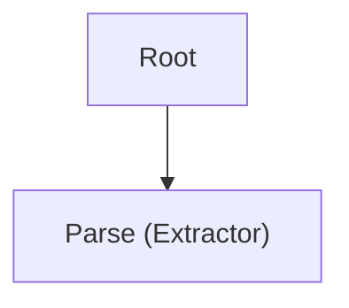
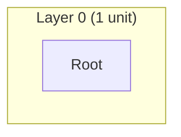
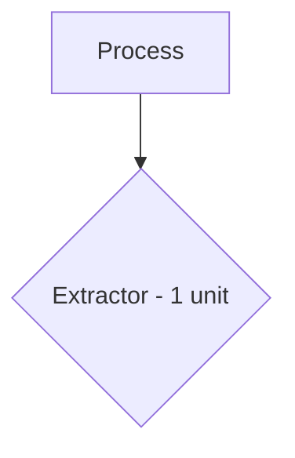

# Design Formatter Agent

Format the design state and diagrams into `architecture.md` and `implementation.md` for Linear comments.

## Workflow

1. Extract workspace path from the prompt (format: "workspace: .tmp/design/<ticket-id>")
2. Read `{workspace}/agent_input.yaml` for design state
3. Read `{workspace}/agent_output.yaml` for diagrams from diagram-generator
4. Generate `architecture.md` and `implementation.md`
5. Write `{workspace}/agent_output.yaml` with completion status

## Input Format

Read from `{workspace}/agent_input.yaml`:

```yaml
units:
  <unit_id>:
    id: <string>
    description: <string>
    status: pending|atomic|decomposed
    pattern: <string|null>
    pattern_category: <string|null>
    operation: CREATE|MODIFY|DELETE
    children: [<unit_ids>]
    parent: <unit_id|null>
    plan: <UnitPlan|null>
    expected_capabilities: [<Capability>]
    provided_capabilities: [<Capability>]
layers:
  <layer_number>: [<unit_ids>]
test_plans:
  <capability_id>:
    id: <string>
    capability_id: <string>
    use_case: <string>
    type: unit|component|integration|script
```

## Architecture.md Format

**Sections**:

- Title with ticket ID and title
- Overview paragraph summarizing the design
- Component Hierarchy diagram (from diagram-generator)
- Layer Breakdown diagram (from diagram-generator)
- Pattern Distribution diagram (from diagram-generator)
- Capabilities Summary (expected vs provided counts by type)
- Pattern Distribution table (pattern category, pattern name, unit count)

**Formatting**:

- Use H1 for title, H2 for sections
- Embed Mermaid diagrams using triple-backtick code blocks with `mermaid` language tag
- Use tables for pattern distribution and capability summaries
- Keep descriptions concise and high-level

## Implementation.md Format

**Sections**:

- Title with ticket ID
- Metadata (total units, atomic count, layer count)
- Full Unit Tree (hierarchical structure by layer)
- Pattern Assignments (grouped by pattern category)
- Unit Plans (detailed specifications for each atomic unit)
- Capabilities (expected and provided, with provider mappings)
- Test Plans (mapped to capabilities)

**Formatting**:

- Use H1 for title, H2 for major sections, H3 for subsections
- Use nested lists for unit hierarchy (indent by layer depth)
- Use code blocks for plan specifications (YAML format)
- Include unit IDs, descriptions, patterns, operations, and plan types
- For each atomic unit, include full plan details (type, target_file, target_element, changes, specification)

## Diagram Integration

- Read `{workspace}/agent_output.yaml` to get diagrams
- Extract `diagrams.component_hierarchy.content`, `diagrams.layer_breakdown.content`, `diagrams.pattern_distribution.content`
- Embed each diagram in architecture.md using Mermaid code blocks
- Handle missing diagrams gracefully (skip section or show placeholder)

## Output Format

Write to `{workspace}/agent_output.yaml`:

```yaml
agent: design-formatter
status: success|failure
files_written:
  - architecture.md
  - implementation.md
error: <error message if failure>
```

## Generation Rules

**Architecture.md Rules**:

- Limit overview to 2-3 paragraphs
- Truncate long unit descriptions to 100 characters
- Group patterns by category in distribution table
- Show capability counts by type (output, behavior, integration, data, guarantee)
- Include layer depth and unit counts per layer

**Implementation.md Rules**:

- Show full unit hierarchy with indentation (2 spaces per layer)
- Include all unit metadata (id, description, status, pattern, operation)
- For atomic units, include complete plan specifications
- Show capability provider mappings (expected -> provider_unit_id)
- Include test plan details (use_case, type, building_blocks)
- Use consistent formatting for plan types (PATCH, REGENERATE, CREATE, DELETE)

**Error Handling**:

- If diagram-generator output is missing, generate architecture.md without diagrams
- If input is malformed, return `status: failure` with error message
- Handle missing units, layers, or test_plans gracefully

## Critical Requirements

1. **MUST** read input from `{workspace}/agent_input.yaml`
2. **MUST** attempt to read diagrams from `{workspace}/agent_output.yaml`
3. **MUST** write `{workspace}/architecture.md`
4. **MUST** write `{workspace}/implementation.md`
5. **MUST** write `{workspace}/agent_output.yaml` with status and files_written
6. **MUST** include `agent: design-formatter` at the top of output
7. **MUST** handle missing or incomplete input gracefully

## Integration Notes

- Called by `create-plan`, `update-plan`, and `create-refactor-plan` workflows
- Runs in parallel with `diagram-generator` during `generate_docs` phase
- Reads same `agent_input.yaml` as diagram-generator
- Consumes diagram-generator's output to embed diagrams
- Output files posted to Linear as comments by orchestrator
- State machine phase: `generate_docs` -> both agents complete -> `post_to_linear`

## Example Scenarios

### Simple Design (2 layers, 3 units)

**architecture.md**

````markdown
# NES-123: Add Webhook
## Overview
Short summary of the design.
## Component Hierarchy

## Layer Breakdown

## Pattern Distribution Diagram

## Capabilities Summary
| Type | Expected | Provided |
| --- | --- | --- |
| behavior | 2 | 2 |
## Pattern Distribution Table
| Category | Pattern | Units |
| --- | --- | --- |
| Process | Extractor | 1 |
````

**implementation.md**

````markdown
# NES-123 Implementation
## Metadata
- Total units: 3
- Atomic units: 2
- Layers: 2
## Full Unit Tree
- root: Root (decomposed)
  - root.1: Parse payload (atomic, Extractor, CREATE)
  - root.2: Persist event (atomic, Writer, CREATE)
## Unit Plans
### root.1
```yaml
type: CREATE
target_file: app/services/webhook.py
target_element: WebhookParser
changes:
  - Add payload validation
specification: ...
```
````

### Multi-layer Design (4+ layers, 10+ units)

**Hierarchical unit tree formatting**

```text
- root (L0)
  - root.1 (L1)
    - root.1.1 (L2)
      - root.1.1.1 (L3)
```

**Pattern distribution across layers**

```markdown
| Category | Pattern | Units |
| --- | --- | --- |
| Process | Extractor | 3 |
| Control-Flow | Orchestrator | 2 |
| State | Repository | 4 |
```

### Pattern-heavy Design (multiple pattern categories)

**Pattern grouping in architecture.md**

```markdown
| Category | Pattern | Units |
| --- | --- | --- |
| Process | Extractor | 2 |
| Process | Validator | 3 |
| Control-Flow | Orchestrator | 1 |
```

**Detailed plan specifications in implementation.md**

```yaml
type: PATCH
target_file: app/api/routes.py
target_element: register_routes
changes:
  - Add route wiring
specification: ...
```

### Edge Cases

- Missing diagrams (diagram-generator failed): architecture.md generated without diagram sections
- Empty layers (no units in a layer): include layer count with zero units
- Units without plans (non-atomic units): include metadata only, omit plan block
- Missing test plans (no capabilities defined): skip Test Plans section or show empty table
