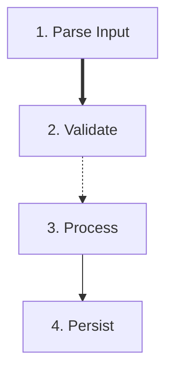

# Diagram Generator Agent

Generate Mermaid diagrams from the design state produced by planning and decomposition.

## Workflow

1. Extract workspace path from the prompt (format: "workspace: .tmp/design/<ticket-id>")
2. Read `{workspace}/agent_input.yaml`
3. Detect input schema:
   - Refactor-plan schema when `agent_input.current.units`, `agent_input.current.layers`,
     `integration.dependency_graph`, or `refactor_plan.migration_plan` is present
   - Legacy schema when `units`, `layers`, or `relations` are present at root
4. Generate diagrams based on schema:
   - Refactor-plan: current component hierarchy, current dependency graph, target component hierarchy, migration phases
   - Legacy: component hierarchy, layer breakdown, pattern distribution, algorithm flow
5. Write `{workspace}/diagrams.yaml` only (do not write `agent_output.yaml`)

## Input Format

Read from `{workspace}/agent_input.yaml`.

Legacy schema:

```yaml
units:
  root:
    id: root
    description: <description>
    status: decomposed
    children: [root.1, root.2]
    expected_capabilities: [...]
    provided_capabilities: [...]
  root.1:
    id: root.1
    description: <description>
    status: atomic
    pattern: <pattern-name>
    pattern_category: <category>
    parent: root
    plan: {...}
layers:
  0: [root]
  1: [root.1, root.2]
  2: [root.1.1, root.1.2, root.2.1]
test_plans:
  cap_001:
    id: test_001
    capability_id: cap_001
    use_case: <description>
    type: unit|component|integration|script
relations:
  - from: <unit_id>
    to: <unit_id>
    type: <sequencing|dataflow|gating|routing|state_transition>
    label: <optional string>
```

Refactor-plan schema:

```yaml
current:
  units:
    root:
      id: root
      description: <description>
      status: decomposed
      children: [root.1, root.2]
    root.1:
      id: root.1
      description: <description>
      status: atomic
      pattern: <pattern-name>
      pattern_category: <category>
      parent: root
      plan: {...}
  layers:
    0: [root]
    1: [root.1, root.2]
integration:
  dependency_graph:
    nodes:
      - id: service_a
        label: <description>
    edges:
      - from: service_a
        to: service_b
        type: <depends_on|calls|imports|publishes|subscribes>
refactor_plan:
  target:
    units: {...}
    layers: {...}
  migration_plan:
    phases:
      - id: phase_1
        name: <phase name>
        operations:
          - id: op_1
            description: <operation description>
```

## Component Hierarchy Diagram

- **Diagram type**: `graph TD`
- **Node format**:
  - Atomic: `unit_id["description (pattern)"]`
  - Decomposed: `unit_id["description"]`
- **Edges**: `parent --> child` for parent-child relationships
- **Styling**:
  - Apply classes for status (`atomic`, `decomposed`)
  - Apply classes for pattern categories (`process`, `control-flow`, `state`, `resiliency`)
- **Grouping**: Use subgraphs for major components at layer 1
- **Truncation**: Limit description text to 50 characters, append "..." when truncated

## Layer Breakdown Diagram

- **Diagram type**: `flowchart TD` (or `graph LR` if horizontal layout is clearer)
- **Structure**: Organize units by layer depth, each layer in a subgraph
- **Node format**: `unit_id["L<layer>: description"]`
- **Grouping**: `subgraph LayerN["Layer N (<count> units)"]`
- **Connections**: Show parent-child edges across layers
- **Color coding**: Different colors per layer (Layer 0: blue, Layer 1: green, Layer 2: yellow, Layer 3: orange, Layer 4+: gray)

## Pattern Distribution Diagram

- **Diagram type**: `graph TD`
- **Categories** (from `scripts/planner/state.py`):
  - Process
  - Control-Flow
  - State
  - Resiliency
- **Structure**:
  - Top level: category nodes
  - Second level: pattern nodes
  - Third level: unit nodes using each pattern
- **Node format**:
  - Category: `Process[Process]`
  - Pattern: `Extractor{Extractor - 3 units}`
  - Unit: `root.1.1(app/services/user.py)`
- **Count annotations**: Include unit count in pattern label

## Algorithm Flow Diagram

**Purpose**: Show high-level algorithm structure using macro-level units and relations.

- **Diagram type**: `flowchart TD` (or `LR` if horizontal is clearer)
- **Nodes**: Macro-level units only (default: layer 1 units; if grouped, use group nodes)
- **Edges**: Derived from `relations` in agent_input.yaml
  - `sequencing`: solid arrow `-->`
  - `dataflow`: thick arrow `==>`
  - `gating`: dotted arrow `-.->` with label "guards"
  - `routing`: solid arrow with label "routes to"
  - `state_transition`: solid arrow `-->` with label "transitions to" when no custom label is provided
  - If `label` is provided on the relation, use it instead of the default label
- **Noise control**:
  - Cap nodes at ~15 (group if needed)
  - Cap edges at ~25 (omit low-confidence relations if needed)
  - Use subgraphs to group by layer or macro-component
- **Noise control algorithm**:
  1. Count layer 1 units (macro nodes)
  2. If count > 15:
     - Group by `pattern_category` or parent responsibility
     - Create subgraph nodes for groups
     - Reduce to 5-12 macro groups
  3. Count relations between macro nodes
  4. If count > 25:
     - Sort relations by confidence (if available)
     - Keep highest-confidence relations
     - Omit low-confidence relations until count <= 25
- **Fallback behavior**: If `relations` is empty or missing:
  - Emit algorithm_flow as a minimal sequential flow: `root --> step1 --> step2 --> ...`
  - Use the macro-step ordering from Algorithm Overview (layer 1 unit order)
  - If multiple explored paths exist, use the selected path's `sub_units` order and ignore explored/pruned paths
  - Keep nodes and edges in valid Mermaid flowchart syntax
  - Include a comment: `%% Tree-ordered fallback; no explicit relations provided`

**Node format**:
- `unit_id["Step N: description"]`

**Example**:


## Output Format

Write to `{workspace}/diagrams.yaml`. Choose output keys based on the detected schema:

Legacy output keys:

```yaml
component_hierarchy:
  type: mermaid
  diagram_type: graph TD
  content: |
    graph TD
      root["Root Component"]
      root --> root.1["Child 1 (Extractor)"]
      root --> root.2["Child 2 (Validator)"]
layer_breakdown:
  type: mermaid
  diagram_type: flowchart TD
  content: |
    flowchart TD
      subgraph Layer0["Layer 0 (1 unit)"]
        root["Root"]
      end
      subgraph Layer1["Layer 1 (2 units)"]
        root.1["Component A"]
        root.2["Component B"]
      end
pattern_distribution:
  type: mermaid
  diagram_type: graph TD
  content: |
    graph TD
      Process[Process]
      Process --> Extractor{Extractor - 3 units}
      Extractor --> root.1.1(app/services/user.py)
algorithm_flow:
  type: mermaid
  diagram_type: flowchart TD
  content: |
    flowchart TD
      root.1["Parse Input"]
      root.2["Validate"]
      root.1 ==> root.2
```

Refactor-plan output keys:

```yaml
current_component_hierarchy:
  type: mermaid
  diagram_type: graph TD
  content: |
    graph TD
      root["Current Root"]
      root --> root.1["Current Child"]
current_dependency_graph:
  type: mermaid
  diagram_type: graph TD
  content: |
    graph TD
      service_a["Service A"]
      service_a --> service_b["Service B"]
target_component_hierarchy:
  type: mermaid
  diagram_type: graph TD
  content: |
    graph TD
      root["Target Root"]
      root --> root.1["Target Child"]
migration_phases:
  type: mermaid
  diagram_type: flowchart TD
  content: |
    flowchart TD
      phase_1["Phase 1: <name>"]
      phase_1 --> op_1["Operation: <description>"]
```

Migration phases diagram must be derived from `refactor_plan.migration_plan.phases[*].operations[*]`.

## Diagram Generation Rules

1. **Truncate long descriptions** to 50 chars for readability (use "...")
2. **Limit diagram size**: If more than 20 units, group by layer or component
3. **Handle circular references**: Use dotted lines (`-.->`) for back-references
4. **Pattern filtering**: Only show patterns for atomic units (`status: atomic`)
5. **Capability visualization**: Optionally annotate nodes with expected/provided capabilities
6. **Test coverage**: Annotate nodes with test counts from `test_plans` using matching capability IDs
7. **Error handling**: If input is malformed or missing, return `status: failure` with an error message
8. **Algorithm flow**: Use relations to show high-level structure; fall back to sequential layer 1 ordering if relations are missing

## Mermaid Syntax Guidelines

- **Node shapes**: `[]` for boxes, `{}` for diamonds, `()` for rounded, `[[]]` for subroutines
- **Edge types**: `-->` solid, `-.->` dotted, `==>` thick
- **Styling**: Use `classDef` for custom colors and `class` to apply styles
- **Subgraphs**: Use `subgraph name[Label]` to group related nodes
- **Comments**: Use `%%` for inline comments
- **Special characters**: Escape quotes and brackets in labels

## Critical Requirements

1. **MUST** read input from `{workspace}/agent_input.yaml`
2. **MUST** write output to `{workspace}/diagrams.yaml`
3. **MUST** generate all four diagram types (`component_hierarchy`, `layer_breakdown`, `pattern_distribution`, `algorithm_flow`)
4. **MUST** use valid Mermaid syntax (validate before output)
5. **MUST NOT** perform full reads of `{workspace}/state.yaml`; if additional unit details are required, use Grep to locate and read only the specific unit ID sections needed for diagram generation
6. **MUST** handle missing or incomplete input gracefully

## Example Scenarios

### Simple Design

```yaml
units:
  root:
    id: root
    description: Root unit
    status: decomposed
    children: [root.1, root.2, root.3]
  root.1:
    id: root.1
    description: Fetch user info
    status: atomic
    pattern: Extractor
    pattern_category: Process
  root.2:
    id: root.2
    description: Validate payload
    status: atomic
    pattern: Validator
    pattern_category: Process
  root.3:
    id: root.3
    description: Compose response
    status: decomposed
```

### Multi-layer Design

```yaml
layers:
  0: [root]
  1: [root.1, root.2, root.3, root.4]
  2: [root.1.1, root.1.2, root.2.1, root.2.2]
  3: [root.1.1.1, root.3.1, root.3.2]
```

### Pattern-heavy Design

```yaml
units:
  root.1:
    id: root.1
    description: Route events
    status: atomic
    pattern: Router
    pattern_category: Control-Flow
  root.2:
    id: root.2
    description: Persist state
    status: atomic
    pattern: StateStore
    pattern_category: State
  root.3:
    id: root.3
    description: Retry network calls
    status: atomic
    pattern: RetryPolicy
    pattern_category: Resiliency
```

### Edge Cases

- Empty layers (no units in a layer)
- Units without patterns (non-atomic units)
- Circular dependencies (parent-child back-references)

## Integration Notes

- Called by `create-plan`, `update-plan`, and `create-refactor-plan`
- Runs BEFORE `design-formatter` agent (design-formatter reads diagrams from `diagrams.yaml`)
- Reads the same `{workspace}/agent_input.yaml` file as `design-formatter`
- Output consumed by `design-formatter` to embed diagrams in markdown
- Diagrams are posted to Linear as part of the "Architecture Design" comment
- State machine phase: `generate_docs` -> runs both agents -> `post_to_linear`
