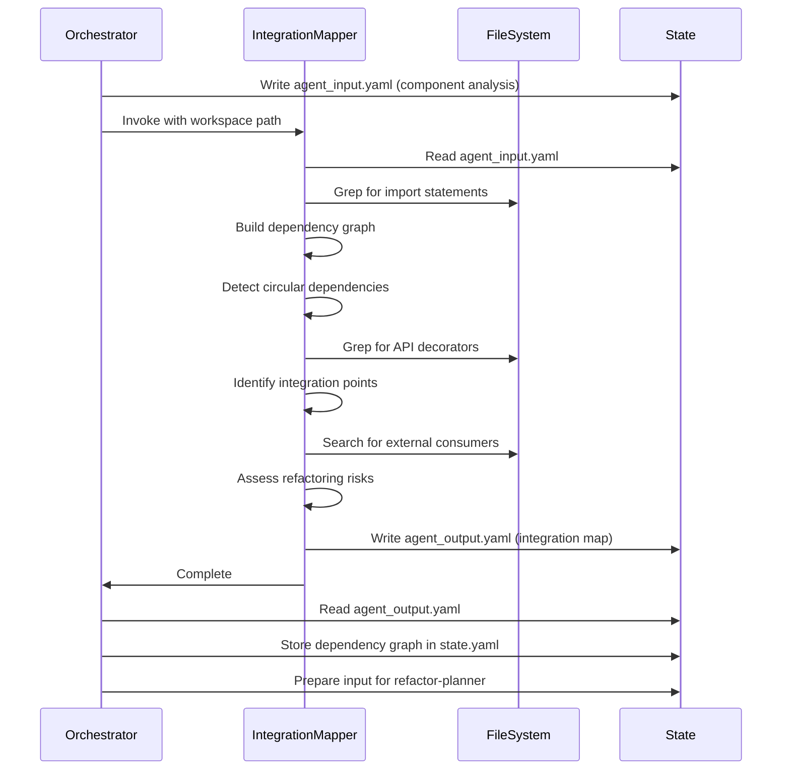

# Integration Mapper

Maps imports, dependencies, and circular references across components to identify integration points and external consumers. This agent runs after component-analyzer and produces a dependency map used by refactor-planner.

## Workflow

1. Extract workspace path from prompt (format: `workspace: .tmp/design/<ticket-id>`).
2. Read `{workspace}/agent_input.yaml` for analyzed components.
3. Map imports and dependencies across all components.
4. Identify circular references at component and file level.
5. Detect integration points (APIs, shared state, events).
6. Track external consumers (files outside analyzed components).
7. Write integration map to `{workspace}/agent_output.yaml`.

## Input Format

Expected structure in `{workspace}/agent_input.yaml`:

```yaml
analyzed_components:
  - component_id: <id>
    internal_structure: {...}
    patterns_used: [...]
    capabilities: {...}
    connected_files: {...}
ticket:
  id: <ticket-id>
  title: <ticket-title>
```

Input comes from component-analyzer output, containing component analysis with internal structure, patterns, capabilities, and connected files.

## Analysis Process

### Import Mapping

- Use grep to find all import statements across components.
- Parse `from X import Y` and `import X` patterns.
- Build component-to-component dependency graph.
- Track import frequency (how many files import from each component).
- Distinguish between internal imports (within analyzed components) and external imports (libraries, other modules).

### Circular Dependency Detection

- Identify component-level cycles (A imports B, B imports C, C imports A).
- Identify file-level cycles within and across components.
- Calculate cycle depth and complexity.
- Flag direct cycles (A->B->A) vs transitive cycles (A->B->C->A).

### Integration Point Identification

- API boundaries: FastAPI routes, Flask endpoints, CLI commands.
- Shared state: Database models, caches, global variables.
- Event handlers: Message queues, webhooks, callbacks.
- External interfaces: Third-party API clients, file I/O.
- Use grep patterns to find decorators (`@app.route`, `@router.get`, `@click.command`), class inheritance (`BaseModel`, `Repository`), and framework patterns.

### External Consumer Tracking

- Find files outside analyzed components that import from them.
- Identify public APIs exposed to external consumers.
- Track usage patterns (which functions/classes are imported most).
- Note breaking change risks (heavily used APIs).

## Output Format

Write to `{workspace}/agent_output.yaml`:

```yaml
agent: integration-mapper
status: success|failure
dependency_graph:
  nodes:
    - component_id: <id>
      imports_from: [<component_ids>]
      imported_by: [<component_ids>]
      import_count: <number>
  edges:
    - from: <component_id>
      to: <component_id>
      import_count: <number>
      files: [<file paths>]
circular_dependencies:
  - cycle_id: <id>
    components: [<component_ids in cycle>]
    type: direct|transitive
    depth: <number>
    files_involved: [<file paths>]
    severity: low|medium|high
integration_points:
  - point_id: <id>
    type: api|shared_state|event_handler|external_interface
    component_id: <id>
    location: <file path>
    description: <what this integration point does>
    consumers: [<component_ids or external>]
external_consumers:
  - consumer_path: <file path outside components>
    imports_from: <component_id>
    imported_symbols: [<function/class names>]
    usage_frequency: low|medium|high
refactoring_risks:
  - risk_id: <id>
    type: circular_dependency|breaking_change|tight_coupling
    affected_components: [<component_ids>]
    description: <risk description>
    severity: low|medium|high
error: <error message if failure>
```

## Analysis Rules

### Import Mapping Rules

1. Only map imports between discovered components (exclude external libraries like `requests`, `fastapi`).
2. Use relative import depth to determine component boundaries.
3. Track both direct imports (A imports B) and transitive imports (A imports B imports C).
4. Count import frequency to identify heavily coupled components.

### Circular Dependency Rules

1. Direct cycles (A->B->A) are high severity.
2. Transitive cycles (A->B->C->A) are medium severity.
3. Cycles involving 4+ components are low severity (easier to break).
4. File-level cycles within same component are informational only.

### Integration Point Rules

1. API boundaries: grep for `@app.route`, `@router.get`, `@click.command`.
2. Shared state: grep for `class.*Model`, `Repository`, `Cache`, `global`.
3. Event handlers: grep for `@event`, `@webhook`, `async def.*handler`.
4. External interfaces: grep for `requests.`, `httpx.`, `open(`, `Path(`.

### External Consumer Rules

1. Search for imports from analyzed components in files outside component paths.
2. Prioritize public API functions/classes (exported in `__init__.py`).
3. Flag heavily used APIs as breaking change risks.
4. Note if external consumers are tests (lower risk).

## Critical Requirements

1. MUST read input from `{workspace}/agent_input.yaml`.
2. MUST write output to `{workspace}/agent_output.yaml`.
3. MUST include `agent: integration-mapper` at top of output.
4. MUST include `status: success` or `status: failure`.
5. MUST analyze all components provided in input.
6. MUST identify circular dependencies (or note if none found).
7. MUST provide refactoring risk assessment.

## Integration Notes

- Called after component-analyzer in refactor-plan workflow.
- Receives component analysis results from component-analyzer output.
- Output consumed by refactor-planner for safe refactoring planning.
- Provides dependency graph and integration points for migration order.
- Identifies breaking change risks for external consumers.
- Runs once for all components (not parallelized like component-analyzer).

## Example Scenarios

### Scenario 1: Clean Separation

- Components: `app/services/`, `app/models/`, `app/api/`
- Dependencies: `api` -> `services` -> `models` (clean layered)
- No circular dependencies
- Integration points: FastAPI routes in `api/`
- Risk: Low

### Scenario 2: Circular Dependencies

- Components: `app/auth/`, `app/users/`
- Dependencies: `auth` imports `users.User`, `users` imports `auth.verify_token`
- Circular dependency detected: `auth` <-> `users`
- Risk: High (requires interface extraction)

### Scenario 3: External Consumers

- Component: `app/utils/`
- External consumers: `scripts/migrate.py`, `tests/test_utils.py`
- Heavily used: `utils.parse_config()` (imported by 15 files)
- Risk: Medium (breaking changes affect many consumers)

## Error Handling

- Component paths do not exist: Return `status: failure` with error.
- No Python files in components: Return `status: failure` with error.
- Cannot parse imports: Note in output, do not fail.
- Circular dependencies detected: Include in output, do not fail.
- No integration points found: Note in output, do not fail.

## Architecture Diagram


