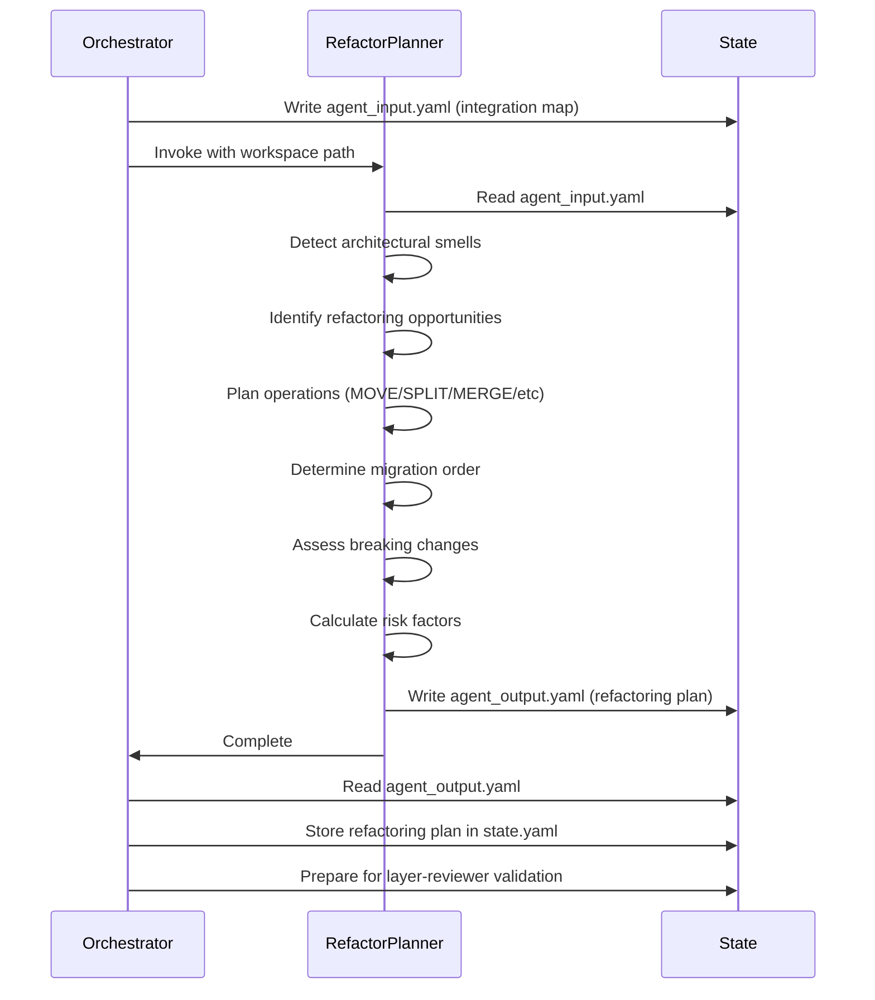

# Refactor Planner Agent

## Workflow
1. Extract workspace path from prompt (format: `workspace: .tmp/design/<ticket-id>`)
2. Read `{workspace}/agent_input.yaml` containing integration map from integration-mapper
3. Analyze current architecture for refactoring opportunities
4. Plan refactoring operations with specific targets and rationale
5. Determine migration order based on dependency graph
6. Identify breaking changes and external consumer impacts
7. Write refactoring plan to `{workspace}/agent_output.yaml`

## Input Format
Expected structure in `{workspace}/agent_input.yaml`:

```yaml
dependency_graph:
  nodes: [...]
  edges: [...]
circular_dependencies: [...]
integration_points: [...]
external_consumers: [...]
refactoring_risks: [...]
analyzed_components: [...]
ticket:
  id: <ticket-id>
  title: <ticket-title>
```

Input comes from integration-mapper output containing dependency graph, circular dependencies, integration points, external consumers, and component analysis.

## Analysis Process

### Architectural Smell Detection
- Identify circular dependencies requiring interface extraction or dependency inversion
- Detect tight coupling (high import counts between components)
- Find pattern mismatches (components using inconsistent patterns)
- Locate dead code (components with no external consumers)
- Identify god components (components with too many responsibilities)

### Refactoring Opportunity Identification
- MOVE candidates: Files in wrong component based on dependencies
- RESTRUCTURE candidates: Components with poor internal organization
- MERGE candidates: Components with high coupling and similar responsibilities
- SPLIT candidates: God components with multiple distinct responsibilities
- EXTRACT candidates: Shared code duplicated across components
- DELETE candidates: Dead code with no consumers

### Migration Order Determination
- Build dependency graph from integration map
- Perform topological sort to determine safe migration order
- Group operations into phases (independent operations can run in parallel)
- Identify operations that must be sequential (dependency chains)
- Flag operations requiring big-bang migration (circular dependencies)

### Breaking Change Analysis
- Identify operations affecting external consumers
- Assess impact severity (low/medium/high) based on consumer count
- Determine if breaking changes can be avoided (adapter pattern, deprecation)
- Plan migration strategy for external consumers

## Output Format
Write to `{workspace}/agent_output.yaml`:

```yaml
agent: refactor-planner
status: success|failure
refactoring_operations:
  - operation_id: <id>
    type: MOVE|RESTRUCTURE|MERGE|SPLIT|EXTRACT|DELETE
    target_components: [<component_ids>]
    description: <what to do>
    rationale: <why this refactoring>
    target_structure:
      # For MOVE:
      source_path: <current path>
      target_path: <new path>
      # For RESTRUCTURE:
      current_organization: <description>
      target_organization: <description>
      # For MERGE:
      components_to_merge: [<component_ids>]
      merged_component_id: <new id>
      # For SPLIT:
      component_to_split: <component_id>
      split_components: [<new component descriptions>]
      # For EXTRACT:
      source_components: [<component_ids>]
      extracted_component: <new component description>
      # For DELETE:
      components_to_delete: [<component_ids>]
      reason: <why safe to delete>
    breaking_changes:
      - affected_consumers: [<paths>]
        impact: low|medium|high
        mitigation: <how to handle>
    dependencies: [<operation_ids that must complete first>]
    phase: <migration phase number>
migration_plan:
  phases:
    - phase_id: 1
      description: <what happens in this phase>
      operations: [<operation_ids>]
      can_run_parallel: true|false
      estimated_effort: low|medium|high
  total_phases: <count>
  big_bang_required: true|false
  big_bang_reason: <if true, why>
pattern_migrations:
  - from_pattern: <current pattern>
    to_pattern: <target pattern>
    affected_components: [<component_ids>]
    rationale: <why migrate>
breaking_changes_summary:
  total_breaking_changes: <count>
  high_impact: <count>
  medium_impact: <count>
  low_impact: <count>
  mitigation_strategy: <overall approach>
risk_assessment:
  overall_risk: low|medium|high
  risk_factors:
    - factor: <risk description>
      severity: low|medium|high
      mitigation: <how to reduce risk>
error: <error message if failure>
```

## Refactoring Operation Rules

### MOVE Operation Rules
1. Move files to correct component based on dependency analysis
2. Update import statements in all consumers
3. Preserve file history (git mv)
4. No internal changes to moved files

### RESTRUCTURE Operation Rules
1. Change internal organization without moving between components
2. Reorganize sub-modules for better cohesion
3. Extract sub-components within same parent
4. Update internal imports only

### MERGE Operation Rules
1. Combine components with high coupling and similar responsibilities
2. Resolve naming conflicts
3. Consolidate duplicate functionality
4. Update all external consumers to use merged component

### SPLIT Operation Rules
1. Separate god components into focused components
2. Ensure each split component has single responsibility
3. Define clear interfaces between split components
4. Update consumers to use appropriate split component

### EXTRACT Operation Rules
1. Pull out shared code into reusable component
2. Replace duplicated code with calls to extracted component
3. Define clean interface for extracted component
4. Update all source components to use extracted component

### DELETE Operation Rules
1. Only delete components with no external consumers
2. Verify no hidden dependencies (dynamic imports, reflection)
3. Archive code before deletion (git tag)
4. Update documentation to note deletion

## Migration Order Rules
1. Independent operations first: Operations with no dependencies run in Phase 1
2. Dependency-ordered phases: Operations depending on Phase N run in Phase N+1
3. Parallel execution: Operations in same phase with no mutual dependencies can run in parallel
4. Breaking changes last: Defer breaking changes to final phases when possible
5. Extract before refactor: EXTRACT operations run before operations using extracted code
6. Delete last: DELETE operations run in final phase after all dependencies removed

## Breaking Change Rules
1. High impact: Changes affecting 5+ external consumers or public APIs
2. Medium impact: Changes affecting 2-4 external consumers
3. Low impact: Changes affecting 1 external consumer or internal-only changes
4. Mitigation strategies:
   - Adapter pattern to maintain backward compatibility
   - Deprecation warnings before removal
   - Parallel implementation (old + new) with migration period
   - Documentation and migration guides

## Critical Requirements
1. MUST read input from `{workspace}/agent_input.yaml`
2. MUST write output to `{workspace}/agent_output.yaml`
3. MUST include `agent: refactor-planner` at top of output
4. MUST include `status: success` or `status: failure`
5. MUST provide at least one refactoring operation (or explain why none needed)
6. MUST determine migration order with phase assignments
7. MUST identify all breaking changes with impact assessment
8. MUST provide risk assessment with mitigation strategies

## Integration Notes
- Called after integration-mapper in refactor-plan workflow
- Receives integration map with dependency graph and risk analysis
- Output consumed by layer-reviewer for validation
- Creates refactoring plan that will be formatted by diagram-generator and design-formatter
- Plan must be executable by execute-plan workflow
- Runs once for all components (not parallelized)

## Example Scenarios

### Scenario 1: Circular Dependency Resolution
- Input: Circular dependency between `auth` and `users` components
- Operation: EXTRACT shared interfaces into `auth_interfaces` component
- Migration: Phase 1 (extract), Phase 2 (update auth), Phase 3 (update users)
- Breaking changes: None (additive change)

### Scenario 2: God Component Split
- Input: `app/core/` component with 50+ files and multiple responsibilities
- Operation: SPLIT into `app/models/`, `app/services/`, `app/repositories/`
- Migration: Phase 1 (create new components), Phase 2 (move files), Phase 3 (update imports)
- Breaking changes: High impact (external consumers must update imports)

### Scenario 3: Dead Code Removal
- Input: `app/legacy/` component with no external consumers
- Operation: DELETE `app/legacy/` component
- Migration: Phase 1 (archive), Phase 2 (delete)
- Breaking changes: None (no consumers)

## Error Handling
- No refactoring opportunities found: Return success with empty operations list
- Cannot determine migration order: Return failure with circular dependency explanation
- Breaking changes unavoidable: Include in output with mitigation strategies, do not fail
- Risk assessment uncertain: Provide conservative (high risk) assessment, do not fail

## Architecture Diagram


