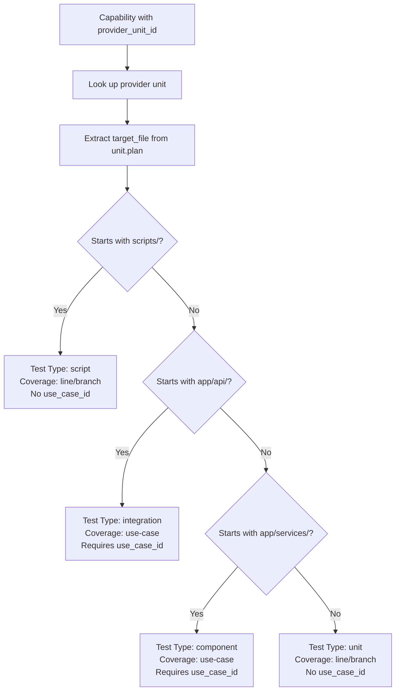

# Test Tier Classification

This document defines the canonical rules for classifying test types and their coverage semantics.

## Classification Algorithm

For each capability:
1. Look up the provider unit using `capability.provider_unit_id`
2. Extract `target_file` from `unit.plan.target_file`
3. Apply path-based classification:

| Source Path Pattern | Test Type | Coverage Type | Use-Case Required |
|---------------------|-----------|---------------|-------------------|
| `scripts/**/*.py` | `script` | line/branch | No |
| `app/api/**/*.py` | `integration` | use-case | Yes |
| `app/services/**/*.py` | `component` | use-case | Yes |
| `app/**/*.py` (other) | `unit` | line/branch | No |

## Test Directory Mapping (pyproject.toml semantics)

| Test Directory | Test Type | Coverage Type |
|----------------|-----------|---------------|
| `tests/unit` | unit | line/branch |
| `tests/component` | component | use-case |
| `tests/integration` | integration | use-case |
| `scripts/tests` | scripts | line/branch |

> **Note**: The `scripts/tests` directory is organized into `unit/`, `component/`, and
> `integration/` subdirectories for consistency with the main test structure. All tests under
> `scripts/tests/` are part of the single "scripts" tier.

## Use-Case vs Line/Branch Coverage

**Use-Case Coverage Tiers** (component, integration):
- Require `use_case_id` field in test plan
- Require `@pytest.mark.usecase("UC-XXX-NNN")` decorator
- Test user-visible scenarios and service-layer behavior
- 100% use-case coverage threshold

**Line/Branch Coverage Tiers** (unit, scripts):
- Do NOT require `use_case_id` by default
- Focus on per-function line/branch coverage
- 80% line, 70% branch thresholds per function

## Guard Clause Classification

Capabilities described as "null checks", "guard clauses", "validation checks", or "error handling" should default to **unit** tests unless:
- They are explicitly part of a user-facing API endpoint (integration)
- They are part of a service-layer use-case (component)

Example:
- "Validate user input is not null" in `app/api/v1/endpoints/users.py` -> integration
- "Validate user input is not null" in `app/services/user_service.py` -> component
- "Validate user input is not null" in `app/utils/validators.py` -> unit

## Classification Flowchart

## Display Formats

When displaying test information:

- **Use-case coverage tiers** (component/integration):
  - Format: `test_id (tier) - use_case - validates capability`
  
- **Line/branch coverage tiers** (unit/scripts):
  - Format: `test_id (tier) - validates capability`
