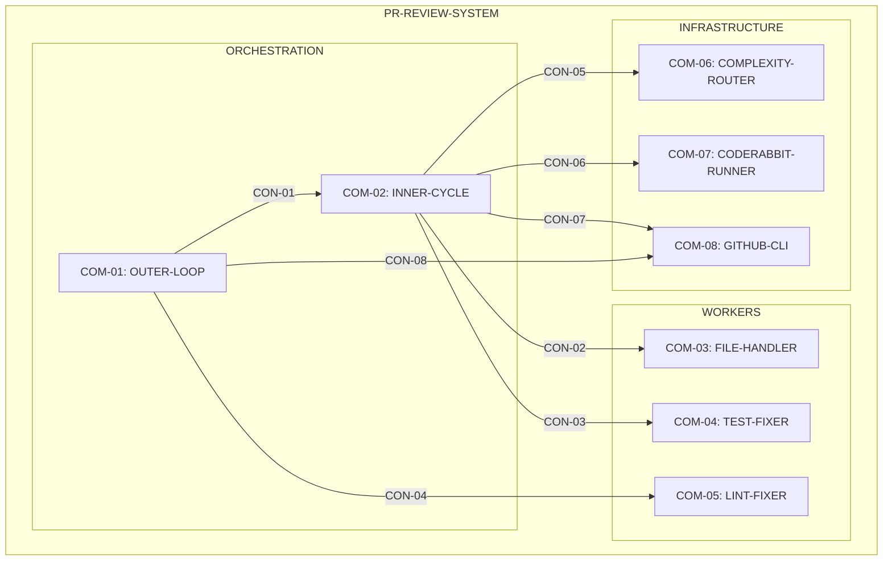
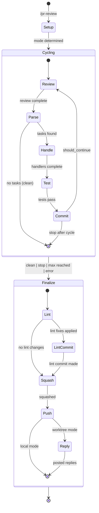

# PR Review Agent Design Map

Sources: [requirements.md](requirements.md) | [prd structure.md](../../processes/prd%20structure.md) | [design map structure.md](../../processes/design%20map%20structure.md)

---

## System Hierarchy



---

## Model Map

Pinned model configs per [ROUTE-02..ROUTE-08](requirements.md#model-routing-rules):

| Concern | Component | Model Config | Resource |
|---------|-----------|--------------|----------|
| Outer orchestration | COM-01 | `.agents/models/gpt-5.2-none.toml` | RES-05 |
| Inner orchestration | COM-02 | `.agents/models/gpt-5.2-medium.toml` | RES-06 |
| Complexity classification (<=2500 chars) | COM-06 | `.agents/models/ministral-3b.toml` | RES-04 |
| Complexity classification (>2500 chars) | COM-06 | `.agents/models/opencode-glm.toml` | RES-03 |
| Simple file tasks | COM-03 | `.agents/models/minimax.toml` | RES-10 |
| Complex file tasks | COM-03 | `.agents/models/gpt-5.2-codex-medium.toml` | RES-07 |
| Lint fixing | COM-05 | `.agents/models/minimax.toml` | RES-10 |
| Test fixes (low) | COM-04 | `.agents/models/gpt-5.2-codex-medium.toml` | RES-07 |
| Test fixes (medium) | COM-04 | `.agents/models/gpt-5.2-codex-high.toml` | RES-08 |
| Test fixes (high) | COM-04 | `.agents/models/gpt-5.2-codex-xhigh.toml` | RES-09 |

Agent execution: `uv run python -m scripts.agents <agent_name> "<prompt>"`

Cross-references: (decided-by: ADR-001)

---

## Component: COM-01 (OUTER-LOOP)

Pattern: orchestrator
Implements: (ALG-OUTER-ROOT, ALG-OUTER-00, ALG-OUTER-01, ALG-OUTER-02, ALG-OUTER-03, ALG-OUTER-04, ALG-LOCAL-01)
Cross-references: (requires: INV-05, INV-09; uses: RES-01, RES-05; satisfies: GOAL-07, GOAL-08)
Consumes: (ART-args)
Produces: (IAR-01, IAR-02)

### Capabilities

| ID | Description |
|----|-------------|
| CAP-01-01 | Parse arguments, detect mode and flags (`--loop`) |
| CAP-01-02 | Setup working directory/worktree and initialize session state |
| CAP-01-03 | Run cycles (worktree always; local only if `--loop`) |
| CAP-01-04 | Finalize: lint, commit, squash, push, post deferred replies |

### Contracts (boundaries)

- CON-01: spawns COM-02 (INNER-CYCLE)
  Cross-references: (requires: INV-09)
- CON-04: spawns COM-05 (LINT-FIXER) for finalization
  Cross-references: (requires: INV-01)
- CON-08: uses COM-08 (GITHUB-CLI) for posting replies
  Cross-references: (requires: MODE-02)

---

## Component: COM-02 (INNER-CYCLE)

Pattern: orchestrator
Implements: (ALG-INNER-ROOT, ALG-INNER-00, ALG-INNER-01, ALG-INNER-02, ALG-INNER-03, ALG-INNER-04, ALG-INNER-05, ALG-INNER-06)
Cross-references: (requires: INV-05, INV-09; uses: RES-01, RES-06; satisfies: GOAL-03, GOAL-04)
Consumes: (IAR-01, IAR-03)
Produces: (IAR-02, IAR-04)

### Capabilities

| ID | Description |
|----|-------------|
| CAP-02-01 | Run CodeRabbit review |
| CAP-02-02 | Collect and aggregate tasks (CodeRabbit + PR threads + local tasks) |
| CAP-02-03 | Dispatch file tasks in parallel; process `__global__` tasks sequentially |
| CAP-02-04 | Run tests on changed files |
| CAP-02-05 | Commit changes if any |

### Contracts (boundaries)

- CON-02: spawns COM-03 (FILE-HANDLER) per file
  Cross-references: (requires: INV-02, PAR-01)
- CON-03: spawns COM-04 (TEST-FIXER) per changed .py file
  Cross-references: (requires: PAR-02)
- CON-05: queries COM-06 (COMPLEXITY-ROUTER) for task routing
  Cross-references: (requires: ROUTE-06, ROUTE-07)
- CON-06: spawns COM-07 (CODERABBIT-RUNNER) for reviews
- CON-07: uses COM-08 (GITHUB-CLI) for fetching threads

---

## Component: COM-03 (FILE-HANDLER)

Pattern: worker
Implements: (ALG-FILE-01, ALG-FILE-02, ALG-FILE-03)
Cross-references: (requires: INV-02; uses: RES-10, RES-07; satisfies: GOAL-02)
Consumes: (IAR-04)
Produces: (IAR-05)

### Capabilities

| ID | Description |
|----|-------------|
| CAP-03-01 | Read and understand review comments |
| CAP-03-02 | Apply changes to file |
| CAP-03-03 | Store deferred reply to PR thread (worktree mode only) |

### Contracts (boundaries)

- CON-09: file isolation contract
  Cross-references: (requires: INV-02)

Boundary obligations:
- OBL-01 — Only modify files listed in `allowed_files`
  Cross-references: (requires: INV-02)

---

## Component: COM-04 (TEST-FIXER)

Pattern: worker
Implements: (ALG-TEST-01, ALG-TEST-02, ALG-TEST-03)
Cross-references: (uses: RES-07, RES-08, RES-09; satisfies: GOAL-02)
Consumes: (IAR-05)
Produces: (IAR-05)

### Capabilities

| ID | Description |
|----|-------------|
| CAP-04-01 | Run tests for changed file |
| CAP-04-02 | Classify failure severity (low/medium/high) |
| CAP-04-03 | Apply fix using routed Codex model |

### Contracts (boundaries)

- CON-10: severity-based model routing
  Cross-references: (requires: ROUTE-08)

---

## Component: COM-05 (LINT-FIXER)

Pattern: worker
Implements: (ALG-LINT-01, ALG-LINT-02)
Cross-references: (requires: INV-01; uses: RES-10; satisfies: GOAL-01)
Consumes: (IAR-05)
Produces: (IAR-05)

### Capabilities

| ID | Description |
|----|-------------|
| CAP-05-01 | Run linters on file |
| CAP-05-02 | Apply auto-fixes |

### Contracts (boundaries)

- CON-11: always uses Minimax
  Cross-references: (requires: ROUTE-05, INV-01)

---

## Component: COM-06 (COMPLEXITY-ROUTER)

Pattern: classifier
Implements: (ALG-ROUTE-01, ALG-ROUTE-02, ALG-ROUTE-03)
Cross-references: (uses: RES-02, RES-03, RES-04; satisfies: GOAL-04; decided-by: ADR-001)
Consumes: (task_text)
Produces: (model_id)

### Capabilities

| ID | Description |
|----|-------------|
| CAP-06-01 | Calculate ambiguity score (1-5) |
| CAP-06-02 | Calculate character count |
| CAP-06-03 | Make routing decision |

### Contracts (boundaries)

- CON-05: receives task_text from COM-02, returns model_id
  Cross-references: (requires: CLASS-01, CLASS-02, CLASS-03)

Boundary obligations:
- OBL-02 — Use Ministral 3B for prompts <=2500 chars, GLM 4.7 for larger
  Cross-references: (requires: ROUTE-02; decided-by: ADR-001)

---

## Component: COM-07 (CODERABBIT-RUNNER)

Pattern: adapter
Implements: (ALG-CR-01, ALG-CR-02)
Cross-references: (uses: RES-11; satisfies: GOAL-02)
Consumes: (review_args)
Produces: (IAR-03)

### Capabilities

| ID | Description |
|----|-------------|
| CAP-07-01 | Build CodeRabbit command |
| CAP-07-02 | Execute and monitor |

### Contracts (boundaries)

- CON-06: receives review_args from COM-02, produces review_file
- CON-12: timeout contract
  Cross-references: (requires: TIMEOUT-HONOR)

---

## Component: COM-08 (GITHUB-CLI)

Pattern: adapter
Implements: (none - external tool wrapper)
Cross-references: (uses: RES-12; satisfies: GOAL-02)
Consumes: (pr_number, threads_dir)
Produces: (IAR-04)

### Capabilities

| ID | Description |
|----|-------------|
| CAP-08-01 | Fetch unresolved PR threads into `thread_*.json` files |
| CAP-08-02 | Store deferred reply text in a thread file |
| CAP-08-03 | Post deferred replies back to PR |

### Contracts (boundaries)

- CON-07: fetch threads for COM-02
- CON-08: post replies for COM-01

---

## Internal Artifact / Boundary: IAR-01 (Session State)

Pattern: state-object
Kind: internal-api
Schema IDs: SESSION-STATE-SCHEMA
Owned-by: (COM-01)
Implements: (STATE-01, STATE-03, STATE-05, STATE-06, STATE-08)
Cross-references: (requires: INV-04)

### Schema

```json
{
  "mode": "local | worktree",
  "working_dir": "string",
  "initial_commit": "string",
  "commits_made": "number",
  "all_modified_files": "string[]",
  "cycle_summaries": "object[]",
  "loop_start_time": "string",
  "pr_number": "number | null",
  "base_branch": "string",
  "local_tasks_imported": "boolean",
  "local_task_responses": "object[]"
}
```

---

## Internal Artifact / Boundary: IAR-02 (Cycle State)

Pattern: state-object
Kind: internal-api
Schema IDs: CYCLE-STATE-SCHEMA
Owned-by: (COM-02)
Implements: (STATE-02)
Cross-references: (requires: INV-04)

### Schema

```json
{
  "cycle": "number",
  "cycle_start_time": "string",
  "files": "string[]",
  "tasks_count": "number",
  "status": "in_progress | complete | error"
}
```

---

## Internal Artifact / Boundary: IAR-03 (Review Artifacts)

Pattern: file-artifact
Kind: filesystem
Schema IDs: REVIEW-FILE-SCHEMA
Owned-by: (COM-07)
Implements: (FILE-08)
Cross-references: (requires: FILE-09)

Path: `{review_dir}/review_*.json`

---

## Internal Artifact / Boundary: IAR-04 (Task Artifacts)

Pattern: file-artifact
Kind: filesystem
Schema IDs: THREAD-SCHEMA, LOCAL-SCHEMA, CODERABBIT-SCHEMA, AGGREGATED-SCHEMA
Owned-by: (COM-02)
Implements: (FILE-05, FILE-06, FILE-07, FILE-11, FILE-12)
Cross-references: (requires: FILE-09, FILE-10)

Paths:
- `{tmp_folder}/thread_*.json`
- `{tmp_folder}/local_*.json`
- `{tmp_folder}/coderabbit_*.json`
- `{tmp_folder}/aggregated.json`

---

## Internal Artifact / Boundary: IAR-05 (File State)

Pattern: state-object
Kind: internal-api
Schema IDs: FILE-STATE-SCHEMA
Owned-by: (COM-03)
Implements: (STATE-04)
Cross-references: (requires: INV-02, INV-04)

### Schema

```json
{
  "file_path": "string",
  "tasks": "object[]",
  "changes_made": "boolean",
  "deferred_reply": "string | null"
}
```

---

## Contract: CON-01 (SPAWN-CYCLE)

Pattern: spawn-agent
Between: (COM-01, COM-02)
For: (IAR-02)
Message types: SPAWN, RESULT
Implements: (CYCLE-01, CYCLE-02, CYCLE-03, CYCLE-04)
Cross-references: (requires: INV-09)

Boundary obligations:
- OBL-03 — Returns status: `clean`, `tasks_handled`, `error`
  Cross-references: (requires: CYCLE-02)
- OBL-04 — Never exits without returning status

---

## Contract: CON-09 (FILE-ISOLATION)

Pattern: isolation-contract
Between: (COM-02, COM-03)
For: (IAR-05)
Implements: (INV-02)
Cross-references: (requires: INV-02)

Boundary obligations:
- OBL-01 — Only assigned file modified
- OBL-05 — Other files unchanged

---

## Contract: CON-12 (TIMEOUT-HONOR)

Pattern: timeout-contract
Between: (COM-02, COM-07)
For: (IAR-03)
Implements: (TIMEOUT-HONOR)

Boundary obligations:
- OBL-06 — Returns within timeout (default 2 hours)
- OBL-07 — Never blocks indefinitely

---

## State Diagram


