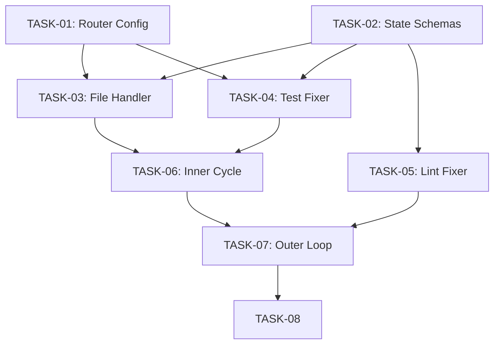

# PR Review Agent Execution Plan

Sources: [requirements.md](requirements.md) | [design-map.md](design-map.md) | [plan structure](../../processes/plan.md)

This document is an execution plan (work ordering only). Design topology (components, contracts, protocols) is defined in [design-map.md](design-map.md).

---

## PHASE-01 — Infrastructure Setup

Goal: (GOAL-04, GOAL-05)
Scope: (ALG-ROUTE-01, ALG-ROUTE-02, ALG-ROUTE-03, STATE-01, STATE-02, STATE-04)
Depends-on: None
Decisions: (decided-by: ADR-001)

### MILE-01 — Model Routing Infrastructure

Produces: (COM-06)
Validated-by: (MET-04)
Implements: (COM-06, CON-05)
Decisions: (decided-by: ADR-001)

#### TASK-01 — Configure complexity router models

Implements: (COM-06, ALG-ROUTE-01)
Satisfies: (ROUTE-02, CLASS-04)
Validated-by: (MET-04)
Depends-on: None
Decisions: (decided-by: ADR-001)

##### Files

| Action | Path |
|--------|------|
| modify | `.agents/agents/router.md` |
| verify | `.agents/models/ministral-3b.toml` |
| verify | `.agents/models/opencode-glm.toml` |

##### Acceptance Criteria

- [ ] Ministral 3B configured for prompts <=2500 chars
- [ ] GLM 4.7 configured as fallback for larger prompts
- [ ] Router agent returns ambiguity score 1-5
- [ ] Decision link: (decided-by: ADR-001)

---

### MILE-02 — State Management

Produces: (IAR-01, IAR-02, IAR-05)
Validated-by: (MET-06)
Implements: (IAR-01, IAR-02, IAR-05)

#### TASK-02 — Define state schemas

Implements: (IAR-01, IAR-02, IAR-05)
Satisfies: (INV-04, STATE-01, STATE-02, STATE-04)
Validated-by: (MET-06)
Depends-on: None

##### Files

| Action | Path |
|--------|------|
| create | `.agents/agents/pr-review-state.md` |

##### Acceptance Criteria

- [ ] SESSION-STATE schema documented
- [ ] CYCLE-STATE schema documented
- [ ] FILE-STATE schema documented
- [ ] Context JSON passing format specified

**Detailed spec:** [ticket-4-state-management.md](ticket-4-state-management.md)

---

## PHASE-02 — Worker Implementation

Goal: (GOAL-01, GOAL-02, GOAL-06)
Scope: (ALG-FILE-01, ALG-FILE-02, ALG-FILE-03, ALG-TEST-01, ALG-TEST-02, ALG-TEST-03, ALG-LINT-01, ALG-LINT-02)
Depends-on: (PHASE-01)

### MILE-03 — File Handler Agent

Produces: (COM-03)
Validated-by: (MET-02, MET-06)
Implements: (COM-03, CON-09)

#### TASK-03 — Implement file handler agent

Implements: (COM-03, ALG-FILE-01, ALG-FILE-02, ALG-FILE-03)
Satisfies: (INV-02, ROUTE-06, ROUTE-07)
Validated-by: (MET-02, MET-06)
Depends-on: (TASK-01, TASK-02)

##### Files

| Action | Path |
|--------|------|
| create | `.agents/agents/pr-file-handler.md` |

##### Acceptance Criteria

- [ ] Agent reads tasks from context JSON
- [ ] Modifies ONLY assigned file (INV-02)
- [ ] Uses routed model (Minimax or Codex)
- [ ] Returns result with status and changes
- [ ] Writes deferred reply if PR thread exists

**Detailed spec:** [ticket-5-file-handler.md](ticket-5-file-handler.md)

---

### MILE-04 — Test Fixer Agent

Produces: (COM-04)
Validated-by: (MET-02)
Implements: (COM-04, CON-10)

#### TASK-04 — Implement test fixer agent

Implements: (COM-04, ALG-TEST-01, ALG-TEST-02, ALG-TEST-03)
Satisfies: (ROUTE-08)
Validated-by: (MET-02)
Depends-on: (TASK-01, TASK-02)

##### Files

| Action | Path |
|--------|------|
| create | `.agents/agents/pr-test-fixer.md` |

##### Acceptance Criteria

- [ ] Runs pytest for specific file
- [ ] Classifies failure severity (low/medium/high)
- [ ] Routes to appropriate Codex model (ROUTE-08)
- [ ] Applies fixes using selected model
- [ ] Returns result with status

**Detailed spec:** [ticket-6-test-fixer.md](ticket-6-test-fixer.md)

---

### MILE-05 — Lint Fixer Agent

Produces: (COM-05)
Validated-by: (MET-01)
Implements: (COM-05, CON-11)

#### TASK-05 — Implement lint fixer agent

Implements: (COM-05, ALG-LINT-01, ALG-LINT-02)
Satisfies: (INV-01, ROUTE-05)
Validated-by: (MET-01)
Depends-on: (TASK-02)

##### Files

| Action | Path |
|--------|------|
| create | `.agents/agents/pr-lint-fixer.md` |

##### Acceptance Criteria

- [ ] Always uses Minimax model (ROUTE-05, INV-01)
- [ ] Runs project linters via `uv run lint`
- [ ] Applies fixes for ruff, mypy, shellcheck
- [ ] Returns result with status and fixes applied

**Detailed spec:** [ticket-7-lint-fixer.md](ticket-7-lint-fixer.md)

---

## PHASE-03 — Orchestration Implementation

Goal: (GOAL-03, GOAL-07, GOAL-08)
Scope: (ALG-OUTER-ROOT, ALG-INNER-ROOT, MODE-01, MODE-02, CYCLE-01, CYCLE-02, CYCLE-03)
Depends-on: (PHASE-02)

### MILE-06 — Inner Cycle Orchestrator

Produces: (COM-02)
Validated-by: (MET-03)
Implements: (COM-02, CON-01)

#### TASK-06 — Implement inner cycle orchestrator

Implements: (COM-02, ALG-INNER-ROOT, ALG-INNER-00, ALG-INNER-01, ALG-INNER-02, ALG-INNER-03, ALG-INNER-04, ALG-INNER-05, ALG-INNER-06)
Satisfies: (INV-05, INV-09, CYCLE-03, CYCLE-05, CYCLE-06)
Validated-by: (MET-03)
Depends-on: (TASK-03, TASK-04)

##### Files

| Action | Path |
|--------|------|
| create | `.agents/agents/pr-inner-cycle.md` |

##### Acceptance Criteria

- [ ] Runs CodeRabbit review (threads-first on cycle 1)
- [ ] Aggregates tasks from threads + CodeRabbit + local
- [ ] Dispatches file tasks in parallel
- [ ] Runs tests on changed files
- [ ] Commits changes if any
- [ ] Cleans up per-cycle artifacts

**Detailed spec:** [ticket-8-inner-cycle.md](ticket-8-inner-cycle.md)

---

### MILE-07 — Outer Loop Orchestrator

Produces: (COM-01)
Validated-by: (MET-01, MET-03)
Implements: (COM-01, CON-01, CON-04, CON-08)

#### TASK-07 — Implement outer loop orchestrator

Implements: (COM-01, ALG-OUTER-ROOT, ALG-OUTER-00, ALG-OUTER-01, ALG-OUTER-02, ALG-OUTER-03, ALG-OUTER-04, ALG-LOCAL-01)
Satisfies: (INV-03, INV-05, INV-06, INV-09, MODE-01, MODE-02, CYCLE-01, CYCLE-02, FIN-01, FIN-02, FIN-03, FIN-04, FIN-05, FIN-06, FIN-07)
Validated-by: (MET-01, MET-03)
Depends-on: (TASK-05, TASK-06)

##### Files

| Action | Path |
|--------|------|
| create | `.agents/agents/pr-outer-loop.md` |

##### Acceptance Criteria

- [ ] Parses arguments (--loop, ticket ID, local tasks)
- [ ] Detects mode (local vs worktree)
- [ ] Sets up worktree if needed
- [ ] Runs cycles with proper limits
- [ ] Finalizes: lint, squash, push, post replies
- [ ] Never adds AI co-authorship (INV-06)

**Detailed spec:** [ticket-9-outer-loop.md](ticket-9-outer-loop.md)

## Success Metrics

| ID | Metric | Target | Measurement | Goals |
|----|--------|--------|-------------|-------|
| MET-01 | Expensive model usage reduction | < 10% of tokens | Token count before/after | GOAL-01 |
| MET-02 | Review quality | No regression | Manual review of 10 PRs | GOAL-02 |
| MET-03 | Parallel speedup | 2x faster | Wall clock time comparison | GOAL-03 |
| MET-04 | Routing accuracy | > 90% appropriate | Audit 50 routed tasks | GOAL-04 |
| MET-05 | Config size | < 100 lines | Line count of config.toml | GOAL-05 |
| MET-06 | Cross-file edits | 0 violations | Audit worker outputs | GOAL-06 |

---

## Dependency Graph

