# PR Review Agent Requirements

Sources: [prd structure.md](../../processes/prd%20structure.md), [AGENTS.md](../../../AGENTS.md), [design-map.md](design-map.md), [plan.md](plan.md)

## Resources

| ID | Resource | Description |
|----|----------|-------------|
| RES-01 | OpenCode | Orchestration CLI (opencode v1.0.218+); runs models via `opencode run -m <model>` |
| RES-02 | Ollama | Local inference server for Ministral 3B; wrapper: `ollama-ministral-3b` |
| RES-03 | GLM 4.7 | Routing fallback for larger prompts; model config: `opencode-glm.toml` |
| RES-04 | Ministral 3B | Complexity classifier; model config: `.agents/models/ministral-3b.toml` |
| RES-05 | GPT 5.2 None | Outer loop orchestration; model config: `.agents/models/gpt-5.2-none.toml` |
| RES-06 | GPT 5.2 Medium | Inner cycle orchestration; model config: `.agents/models/gpt-5.2-medium.toml` |
| RES-07 | GPT 5.2 Codex Medium | Complex PR comment handling; model config: `.agents/models/gpt-5.2-codex-medium.toml` |
| RES-08 | GPT 5.2 Codex High | Difficult test fixing; model config: `.agents/models/gpt-5.2-codex-high.toml` |
| RES-09 | GPT 5.2 Codex XHigh | Very difficult test fixing; model config: `.agents/models/gpt-5.2-codex-xhigh.toml` |
| RES-10 | Minimax M2.1 | Simple PR comment handling, linting; model config: `.agents/models/minimax.toml` |
| RES-11 | CodeRabbit | Code review service |
| RES-12 | GitHub CLI | PR comment fetching, deferred replies |
| RES-13 | Agent Runner | Python module `scripts.agents`; executes agents via `uv run python -m scripts.agents` |

## Problem Statement

The current update-pr.md command is too large and complex, putting excessive
load on expensive models (especially RES-07/RES-08/RES-09). Many subtasks
(linting, simple fixes) can be handled by cheaper models.
We need a hierarchical agent system that
routes work to appropriate models based on task complexity, reducing cost
while maintaining quality.

## Goal List

| ID | Goal | Description |
|----|------|-------------|
| GOAL-01 | Cost reduction | Offload work from expensive models to cheaper models |
| GOAL-02 | Quality maintenance | No degradation in review/fix quality |
| GOAL-03 | Parallel execution | Maximize throughput via parallel workers |
| GOAL-04 | Complexity routing | Smart routing based on task difficulty |
| GOAL-05 | File-based config | Minimal config.toml, instruction files at runtime |
| GOAL-06 | State isolation | Workers operate only on files explicitly listed in their context |
| GOAL-07 | Cycle management | Controlled iteration with clean exit conditions |
| GOAL-08 | Unified workflow | Single command handles local and worktree modes |

---

## Indexed Rule List

### Invariants

* **Precedence:** Invariants apply globally and override conflicting requirements.

| ID | Name | Description |
|----|------|-------------|
| INV-01 | No expensive models for simple tasks | Linting and simple fixes never use RES-07/RES-08/RES-09 |
| INV-02 | File isolation | Workers may modify only files explicitly listed in their context (`allowed_files`) |
| INV-03 | Commit squashing | All commits since `{initial_commit}` squash before push |
| INV-04 | No implicit state | State passed explicitly via context JSON |
| INV-05 | Metadata-only orchestration | OUTER-LOOP and INNER-CYCLE never read working tree source code contents or diff hunks; they may use only file paths + metadata and task artifacts (see ACCESS-01/ACCESS-02), while FILE/TEST/LINT workers read file contents |
| INV-06 | No AI co-authors | Never add AI/tool authorship metadata (no `Co-Authored-By` or "generated by" footers); use only the repo-configured git identity |
| INV-07 | Never defer implementation | Do not create placeholder stubs/TODOs; implement the requirement now or explicitly raise a blocker/clarification; deferral is allowed only when the current plan/task file explicitly authorizes it |
| INV-08 | Minimize orchestration context | Orchestrators store only paths, counts, and brief summaries; never embed raw file contents or diff hunks in prompts/artifacts; persist large inputs/outputs as files and pass references |
| INV-09 | Mandatory worker delegation | OUTER-LOOP and INNER-CYCLE never directly handle comment resolution, code edits, tests, or lint fixes; they always spawn FILE/TEST/LINT workers and aggregate results |
| INV-10 | No concurrent sessions per working_dir | Concurrent `/update-pr` sessions in the same `working_dir` are not supported (shared `tmp_folder`/`review_dir`); session start cleanup assumes exclusive access |

### Orchestration Access Rules

| ID | Name | Description |
|----|------|-------------|
| ACCESS-01 | Allowlist | Explicitly allowed operations for OUTER-LOOP and INNER-CYCLE |
| ACCESS-02 | Denylist | Explicitly prohibited operations for OUTER-LOOP and INNER-CYCLE |

**ACCESS-01 — Allowed operations (OUTER-LOOP, INNER-CYCLE)**

* File system metadata and artifact management only:
  * `ls/find/stat/wc` scoped to `{tmp_folder}` and `{review_dir}`
  * Read/parse JSON/text artifacts under `{tmp_folder}` and `{review_dir}` (e.g., `thread_*.json`, `local_*.json`, `coderabbit_*.json`, `aggregated.json`)
  * Use `jq` to extract keys/paths from artifact JSON
  * Delete artifacts under `{tmp_folder}` and `{review_dir}` per FILE-10/13/15
* Git metadata only (no source/diff hunks):
  * `git status --porcelain`
  * `git diff --stat ...`, `git diff --name-only ...`
  * `git ls-files` (filenames only)
  * `git rev-parse ...`, `git branch --show-current`
* Orchestration-related entrypoints that operate on artifacts/metadata:
  * `uv run pr get-pr`, `uv run pr setup-worktree`, `uv run pr fetch-threads`
  * `uv run review.coderabbit` (writes review artifacts to `{review_dir}`)
  * `uv run pr parse-coderabbit`, `uv run pr aggregate-tasks`
  * `uv run pr post-deferred-replies`

**ACCESS-02 — Prohibited operations (OUTER-LOOP, INNER-CYCLE)**

* Any direct read/parse of working tree source code files outside `{tmp_folder}`/`{review_dir}` (delegate to FILE/TEST/LINT workers instead).
* Any diff-hunk or file-content commands, including but not limited to:
  * `git diff` without `--stat`/`--name-only`
  * `git show`/`git blame` (content-bearing)
  * `cat/less/head/tail`, `rg/grep`, `sed/awk` on repo source files
* Any inclusion of raw file contents or diff hunks in orchestration prompts/artifacts (see INV-08).

### Model Routing Rules

| ID | Name | Description |
|----|------|-------------|
| ROUTE-02 | Classifier model | Complexity classification uses Ministral 3B (RES-04) for prompts ≤2500 chars, GLM 4.7 (RES-03) fallback for larger prompts |
| ROUTE-03 | Outer loop model | Orchestration uses GPT 5.2 None (RES-05) |
| ROUTE-04 | Inner cycle model | Cycle management uses GPT 5.2 Medium (RES-06) |
| ROUTE-05 | Lint model | Linting always uses Minimax (RES-10) |
| ROUTE-06 | Simple handler | Low-ambiguity short tasks use Minimax (RES-10) |
| ROUTE-07 | Complex handler | High-ambiguity or long tasks use Codex Medium (RES-07) |
| ROUTE-08 | Test fix routing | Test fixes route by failure severity to RES-07/08/09 |

Rationale: use local Ministral 3B (with GLM 4.7 fallback) + Minimax for cheap routing and simple edits; reserve Codex models for ambiguity-heavy comment handling and test fixing to control cost.

Cross-references: (decided-by: ADR-001)

### Complexity Classification Rules

| ID | Name | Description |
|----|------|-------------|
| CLASS-01 | Ambiguity score | Rate 1-5: 1-2 = precise, 3-5 = general |
| CLASS-02 | Character threshold | < 500 chars = short, >= 500 chars = long |
| CLASS-03 | Combined routing | `if ambiguity <= 2 AND chars < 500 then simple else complex` |
| CLASS-04 | Classifier prompt | Ministral 3B scores ambiguity from task text (GLM 4.7 fallback for >2500 chars) |

### Workflow Mode Rules

| ID | Name | Description |
|----|------|-------------|
| MODE-01 | Local mode | No ticket ID: review uncommitted or HEAD~1 |
| MODE-02 | Worktree mode | With ticket ID: setup worktree; cycle 1 uses threads-first review source |
| MODE-03 | Mode detection | First **non-flag** argument matching `[A-Z]+-\d+` indicates worktree |
| MODE-04 | Loop flag | If the first argument is `--loop`, enable continuous cycles |
| MODE-05 | Argument parsing | Parse args into `has_loop`, `ticket_id`, and `local_tasks_text` (text after parsed flag/id) |
| MODE-06 | Single-cycle default | Run exactly one cycle unless `has_loop=true` |
| MODE-07 | Argument grammar | `update-pr [--loop] [TICKET-ID] [local_tasks_text...]` where `local_tasks_text` preserves spaces |
| MODE-08 | Threads-first (cycle 1) | In worktree mode on cycle 1, fetch PR threads; because `tmp_folder` is session-cleaned (FILE-13) and `fetch-threads` clears `thread_*.json`, the thread existence check cannot be satisfied by stale artifacts; if any `thread_*.json` exist after fetch, skip CodeRabbit and treat them as tasks |
| MODE-09 | CodeRabbit fallback | In worktree mode on cycle 1, run CodeRabbit with `--base {base_branch}` only when no threads exist; on cycles > 1, always use `--base-commit HEAD~1` |
| MODE-10 | Local CodeRabbit target (cycle 1) | In local mode on cycle 1, use `--type uncommitted` only when uncommitted changes exist; otherwise use `--base-commit HEAD~1` |

### Worktree Setup Rules

| ID | Name | Description |
|----|------|-------------|
| WT-01 | Get PR metadata | In worktree mode, call `uv run pr get-pr {ticket_id}` and require `{worktree_path, pr_number, base_branch, branch_name}` in the response |
| WT-02 | Setup worktree | If the current directory is not already the expected worktree, call `uv run pr setup-worktree {ticket_id}` and `cd` into `worktree_path` |
| WT-03 | Validate worktree context | Validate `{worktree_path}` exists and is a git worktree; validate `pr_number` is an integer and `base_branch` is non-empty before entering cycles |

### Cycle Management Rules

| ID | Name | Description |
|----|------|-------------|
| CYCLE-01 | Max cycles | Hard limit of 10 cycles per run |
| CYCLE-02 | Clean exit | Exit when no tasks remain after aggregation |
| CYCLE-03 | Cycle sequence | review → parse → handle → test → commit → (post replies + collect local replies) → cleanup |
| CYCLE-04 | State tracking | Track modified files, cycle summaries across cycles |
| CYCLE-05 | Cycle cleanup | Reset `{tmp_folder}` per FILE-10 so later cycles do not see stale tasks |
| CYCLE-06 | Cleanup on all exits | INNER-CYCLE must run cycle cleanup (ALG-INNER-06) even when exiting `clean` or `error` (e.g., `finally` semantics) |

### Parallel Execution Rules

| ID | Name | Description |
|----|------|-------------|
| PAR-01 | File handlers | Spawn one handler per file, run in parallel |
| PAR-02 | Test runners | Spawn one runner per changed .py file, run in parallel |
| PAR-03 | Lint fixers | Spawn one fixer per file, run in parallel |
| PAR-04 | Global tasks | `__global__` tasks process sequentially after file tasks |
| PAR-05 | Multi-file tasks (known files) | If a task requires edits across multiple known files, schedule a single worker with `allowed_files` covering the full set and ensure no other worker touches any of those files in the same cycle |
| PAR-06 | Scope expansion (unknown files) | If a worker discovers additional required files not present in `allowed_files`, it must return `required_files[]`; INNER-CYCLE schedules follow-up work sequentially (like `__global__`) with expanded `allowed_files` and without parallel overlap |

### State Management Rules

| ID | Name | Description |
|----|------|-------------|
| STATE-01 | Session state | `initial_commit`, `commits_made`, `loop_start_time` |
| STATE-02 | Cycle state | `cycle`, `cycle_start_time`, `files` |
| STATE-03 | Aggregate state | `all_modified_files`, `cycle_summaries` |
| STATE-04 | Context passing | State passed via JSON in agent prompts (includes per-worker `allowed_files`) |
| STATE-05 | PR metadata | In worktree mode, store `pr_number` and `base_branch` for MODE-08..MODE-09 |
| STATE-06 | Local tasks | Store `local_tasks_text` and whether local tasks were imported |
| STATE-08 | Local task responses | Track `local_task_responses[]` extracted from `local_*.json` before FILE-10 cleanup; truncate any stored response text to satisfy INV-08 |

### Finalization Rules

| ID | Name | Description |
|----|------|-------------|
| FIN-01 | Final lint | Run lint on all files in `all_modified_files` |
| FIN-02 | Commit lint | Commit any lint fixes as separate commit and increment `commits_made` |
| FIN-03 | Squash condition | If `commits_made > 1`, squash all commits from `{initial_commit}` into a single commit (INV-03) |
| FIN-04 | Push | Push to origin after squashing; if no upstream is configured, the first push must set upstream (e.g., `git push -u origin HEAD`) |
| FIN-05 | Deferred replies | In worktree mode, post replies only for PR comment threads (including pathless/global PR threads) from `thread_*.json` artifacts in `{tmp_folder}` by running `uv run pr post-deferred-replies --pr {pr_number} --threads-dir {tmp_folder}` **before** per-cycle cleanup deletes `{tmp_folder}` (FILE-10); do not post replies for local tasks (`local_*.json`) or CodeRabbit tasks (`coderabbit_*.json`) |
| FIN-06 | Local replies | Collect `deferred_reply` from `local_*.json` in `{tmp_folder}` into session state **before** per-cycle cleanup deletes `{tmp_folder}` (FILE-10), for inclusion in the final output summary |
| FIN-07 | Final cleanup | After FIN-05/FIN-06 (or on early termination), delete remaining session artifacts per FILE-15 |

### File-Based Configuration Rules

| ID | Name | Description |
|----|------|-------------|
| FILE-01 | Agent files | Agents defined in `.agents/agents/*.md` with YAML frontmatter routing rules |
| FILE-02 | Model configs | Model backends defined in `.agents/models/*.toml` |
| FILE-03 | Context JSON | Pass file path + context JSON to spawn agents |
| FILE-04 | No hardcoded prompts | All prompts in external markdown files |
| FILE-05 | Task artifact dir | `tmp_folder={working_dir}/.tmp/pr-review/` and all session task artifacts are written here |
| FILE-06 | PR thread task schema | `thread_*.json` includes `index`, `thread_id`, optional `path`, optional `line`/`start_line`/`end_line` (plus optional original line fields), `first_author`, `comments[]` with `body`, `author`, `reactions[]`, plus optional `deferred_reply`; when `path` is absent the thread is a global/PR-level comment and still eligible for FIN-05 |
| FILE-07 | Local task schema | `local_*.json` includes `index`, `origin=LOCAL`, `content`, `comments[]` with `body`/`author`, plus optional `deferred_reply` |
| FILE-08 | Review artifact dir | `review_dir={working_dir}/.review/`; `uv run review.coderabbit --output-dir {review_dir} -- ...` runs synchronously and writes a timestamped `review_file` under `{review_dir}`; the caller extracts the `review_file` path from stdout using `uv run pr extract-review-path` |
| FILE-09 | Parallel-safe paths | All artifact paths (`tmp_folder`, `review_dir`, `review_file`) resolve relative to `working_dir` to avoid cross-worktree collisions |
| FILE-10 | Per-cycle cleanup (full reset) | After each cycle, delete `review_file` (if present), then delete and recreate `{tmp_folder}` (`rm -rf {tmp_folder}; mkdir -p {tmp_folder}`); this guarantees no stale artifacts of any kind (including `thread_*.json` / `local_*.json` / unexpected files) persist across cycles |
| FILE-11 | CodeRabbit task schema | `coderabbit_*.json` includes `index`, `origin=CODERABBIT`, `path`, `line`/`start_line`/`end_line`, optional `type`, `content`, and `comments[]` with `body`/`author` |
| FILE-12 | Aggregated task schema | `aggregated.json` includes `{ files: string[], tasks_by_file: { [path]: string[] }, task_count: number }` where `tasks_by_file[path]` is a list of task filenames and `tasks_by_file.__global__` holds tasks with no `path` |
| FILE-13 | Session start cleanup | Before cycle 1, delete stale session artifacts by removing and recreating `{tmp_folder}`; this prevents `thread_*.json`/`local_*.json` leakage across runs |
| FILE-14 | No retained task artifacts | Do not keep an archive directory or preserve task artifacts across cycles; any data needed for final output must be extracted into session state before FILE-10 deletes `{tmp_folder}` |
| FILE-15 | Final cleanup | After FIN-05/FIN-06 (or on early termination), delete `{tmp_folder}` and any remaining `review_file` to guarantee clean runs |

## Component diagrams

### Component diagram: PR review workflow system

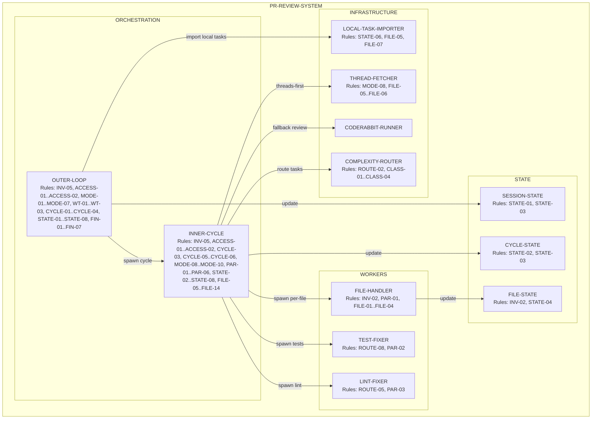
```mermaid
flowchart TD
  %% Rules: INV-01..INV-10, ACCESS-01..ACCESS-02, ROUTE-02..ROUTE-08, MODE-01..MODE-10, WT-01..WT-03, CYCLE-01..CYCLE-06, PAR-01..PAR-06, STATE-01..STATE-08, FIN-01..FIN-07, FILE-01..FILE-15, CLASS-01..CLASS-04
  subgraph PRSYS["PR-REVIEW-SYSTEM"]
    subgraph ORCH["ORCHESTRATION"]
      OUTER["OUTER-LOOP<br/>Rules: INV-05, ACCESS-01..ACCESS-02, MODE-01..MODE-07, WT-01..WT-03, CYCLE-01..CYCLE-04, STATE-01..STATE-08, FIN-01..FIN-07"]
      INNER["INNER-CYCLE<br/>Rules: INV-05, ACCESS-01..ACCESS-02, CYCLE-03, CYCLE-05..CYCLE-06, MODE-08..MODE-10, PAR-01..PAR-06, STATE-02..STATE-08, FILE-05..FILE-14"]
    end

    subgraph WORK["WORKERS"]
      FILE["FILE-HANDLER<br/>Rules: INV-02, PAR-01, FILE-01..FILE-04"]
      TEST["TEST-FIXER<br/>Rules: ROUTE-08, PAR-02"]
      LINT["LINT-FIXER<br/>Rules: ROUTE-05, PAR-03"]
    end

    subgraph INF["INFRASTRUCTURE"]
      ROUTE["COMPLEXITY-ROUTER<br/>Rules: ROUTE-02, CLASS-01..CLASS-04"]
      THR["THREAD-FETCHER<br/>Rules: MODE-08, FILE-05..FILE-06"]
      LCL["LOCAL-TASK-IMPORTER<br/>Rules: STATE-06, FILE-05, FILE-07"]
      CR["CODERABBIT-RUNNER"]
    end

    subgraph ST["STATE"]
      SESS["SESSION-STATE<br/>Rules: STATE-01, STATE-03"]
      CYCS["CYCLE-STATE<br/>Rules: STATE-02, STATE-03"]
      FILES["FILE-STATE<br/>Rules: INV-02, STATE-04"]
    end
  end

  OUTER -->|spawn cycle| INNER
  OUTER -->|import local tasks| LCL
  INNER -->|threads-first| THR
  INNER -->|fallback review| CR

  INNER -->|route tasks| ROUTE
  INNER -->|spawn per-file| FILE
  INNER -->|spawn tests| TEST
  INNER -->|spawn lint| LINT

  OUTER -->|update| SESS
  INNER -->|update| CYCS
  FILE -->|update| FILES
```

## Algorithms as Mermaid flowcharts

### ALG-OUTER-ROOT: Command entrypoint (parse args → mode → setup → cycles → finalize)

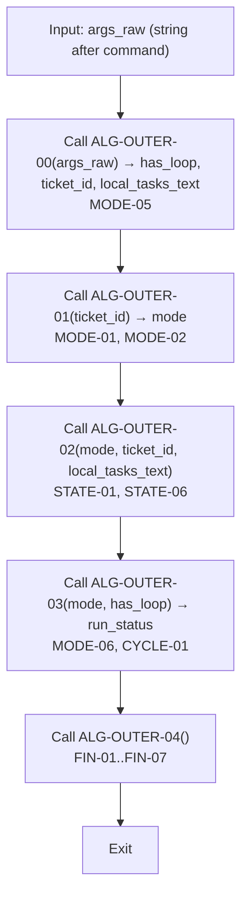
```mermaid
flowchart TD
  %% Rules: MODE-01..MODE-07, WT-01..WT-03, STATE-01, STATE-06..STATE-08, CYCLE-01..CYCLE-04, FIN-01..FIN-07, FILE-13..FILE-15
  A["Input: args_raw (string after command)"] --> B["Call ALG-OUTER-00(args_raw) → has_loop, ticket_id, local_tasks_text<br/>MODE-05"]
  B --> C["Call ALG-OUTER-01(ticket_id) → mode<br/>MODE-01, MODE-02"]
  C --> D["Call ALG-OUTER-02(mode, ticket_id, local_tasks_text)<br/>STATE-01, STATE-06"]
  D --> E["Call ALG-OUTER-03(mode, has_loop) → run_status<br/>MODE-06, CYCLE-01"]
  E --> F["Call ALG-OUTER-04()<br/>FIN-01..FIN-07"]
  F --> G["Exit"]
```

### ALG-OUTER-00: Argument parsing (loop flag, ticket id, local tasks text)

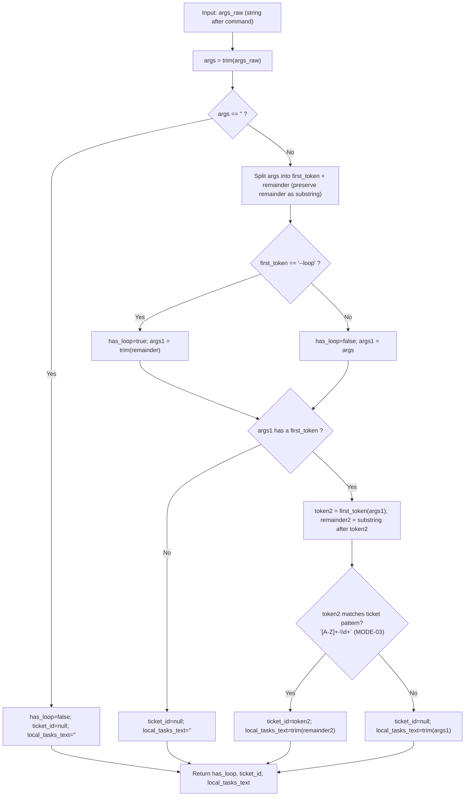
```mermaid
flowchart TD
  %% Rules: MODE-03..MODE-07
  A["Input: args_raw (string after command)"] --> B["args = trim(args_raw)"]
  B --> C{"args == '' ?"}
  C -->|Yes| D["has_loop=false; ticket_id=null; local_tasks_text=''"]
  C -->|No| E["Split args into first_token + remainder (preserve remainder as substring)"]

  E --> F{"first_token == '--loop' ?"}
  F -->|Yes| G["has_loop=true; args1 = trim(remainder)"]
  F -->|No| H["has_loop=false; args1 = args"]

  G --> I{"args1 has a first_token ?"}
  H --> I
  I -->|No| J["ticket_id=null; local_tasks_text=''"]
  I -->|Yes| K["token2 = first_token(args1); remainder2 = substring after token2"]

  K --> L{"token2 matches ticket pattern?\n`[A-Z]+-\\d+` (MODE-03)"}
  L -->|Yes| M["ticket_id=token2; local_tasks_text=trim(remainder2)"]
  L -->|No| N["ticket_id=null; local_tasks_text=trim(args1)"]

  D --> O["Return has_loop, ticket_id, local_tasks_text"]
  J --> O
  M --> O
  N --> O
```

### ALG-OUTER-01: Mode detection (local vs worktree)

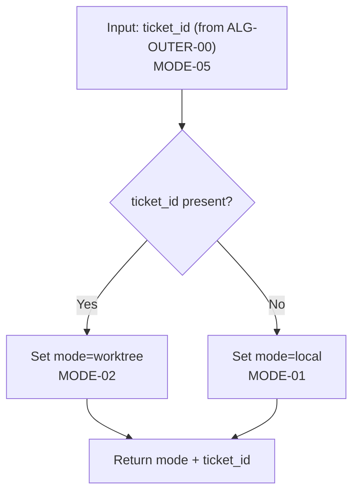
```mermaid
flowchart TD
  %% Rules: MODE-01, MODE-02, MODE-05
  A["Input: ticket_id (from ALG-OUTER-00)<br/>MODE-05"] --> B{"ticket_id present?"}
  B -->|Yes| C["Set mode=worktree<br/>MODE-02"]
  B -->|No| D["Set mode=local<br/>MODE-01"]
  C --> E["Return mode + ticket_id"]
  D --> E
```

### ALG-OUTER-02: Setup working directory + session state

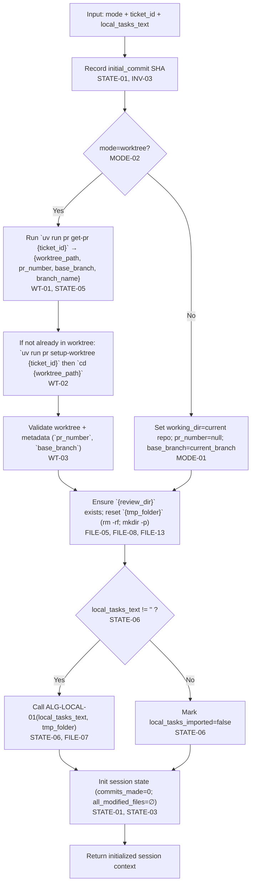
```mermaid
flowchart TD
  %% Rules: MODE-01, MODE-02, WT-01..WT-03, STATE-01, STATE-03, STATE-05, STATE-06, STATE-08, FILE-05, FILE-08, FILE-13, INV-03
  A["Input: mode + ticket_id + local_tasks_text"] --> B["Record initial_commit SHA<br/>STATE-01, INV-03"]
  B --> C{"mode=worktree?<br/>MODE-02"}
  C -->|Yes| D["Run `uv run pr get-pr {ticket_id}` → {worktree_path, pr_number, base_branch, branch_name}<br/>WT-01, STATE-05"]
  D --> D1["If not already in worktree: `uv run pr setup-worktree {ticket_id}` then `cd {worktree_path}`<br/>WT-02"]
  D1 --> D2["Validate worktree + metadata (`pr_number`, `base_branch`)<br/>WT-03"]
  C -->|No| E["Set working_dir=current repo; pr_number=null; base_branch=current_branch<br/>MODE-01"]
  D2 --> F["Ensure `{review_dir}` exists; reset `{tmp_folder}` (rm -rf; mkdir -p)<br/>FILE-05, FILE-08, FILE-13"]
  E --> F
  F --> G{"local_tasks_text != '' ?<br/>STATE-06"}
  G -->|Yes| H["Call ALG-LOCAL-01(local_tasks_text, tmp_folder)<br/>STATE-06, FILE-07"]
  G -->|No| I["Mark local_tasks_imported=false<br/>STATE-06"]
  H --> J["Init session state (commits_made=0; all_modified_files=∅)<br/>STATE-01, STATE-03"]
  I --> J
  J --> K["Return initialized session context"]
```

### ALG-LOCAL-01: Import local tasks text into `local_*.json`

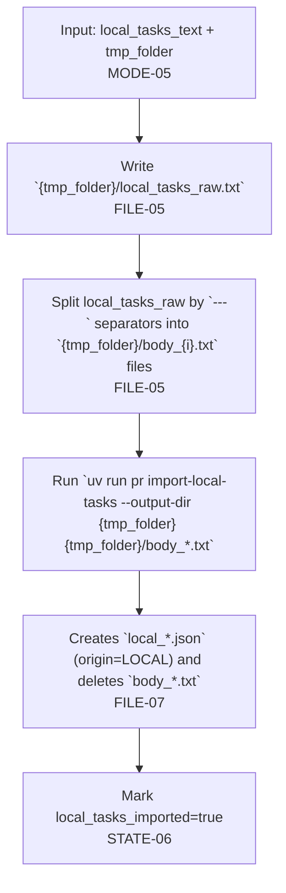
```mermaid
flowchart TD
  %% Rules: MODE-05, STATE-06, FILE-05, FILE-07
  A["Input: local_tasks_text + tmp_folder<br/>MODE-05"] --> B["Write `{tmp_folder}/local_tasks_raw.txt`<br/>FILE-05"]
  B --> C["Split local_tasks_raw by `---` separators into `{tmp_folder}/body_{i}.txt` files<br/>FILE-05"]
  C --> D["Run `uv run pr import-local-tasks --output-dir {tmp_folder} {tmp_folder}/body_*.txt`"]
  D --> E["Creates `local_*.json` (origin=LOCAL) and deletes `body_*.txt`<br/>FILE-07"]
  E --> F["Mark local_tasks_imported=true<br/>STATE-06"]
```

### ALG-OUTER-03: Outer loop cycle controller

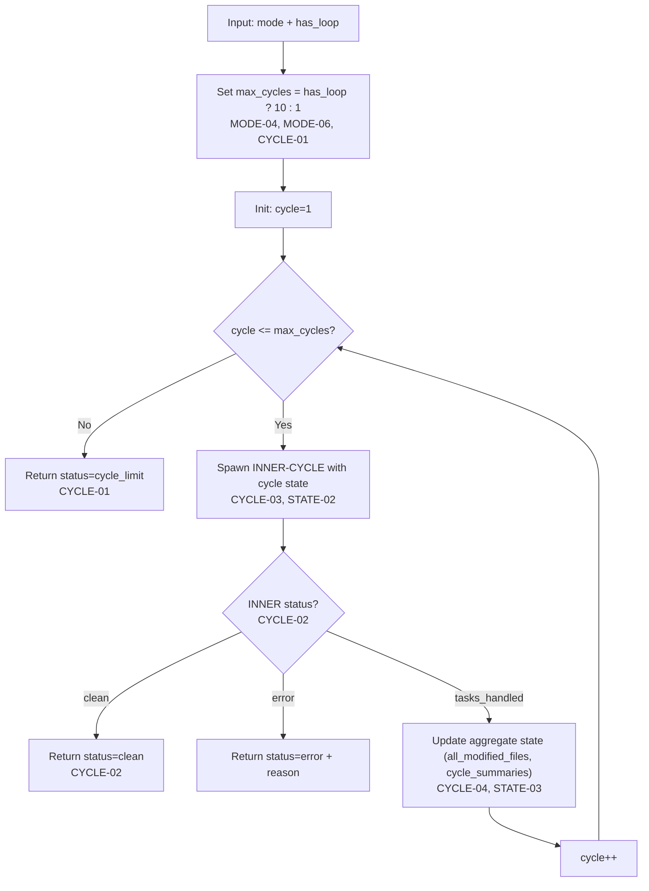
```mermaid
flowchart TD
  %% Rules: CYCLE-01..CYCLE-04, MODE-04, MODE-06, STATE-02..STATE-03
  A["Input: mode + has_loop"] --> A1["Set max_cycles = has_loop ? 10 : 1<br/>MODE-04, MODE-06, CYCLE-01"]
  A1 --> B0["Init: cycle=1"] --> B{"cycle <= max_cycles?"}
  B -->|No| Z["Return status=cycle_limit<br/>CYCLE-01"]
  B -->|Yes| C["Spawn INNER-CYCLE with cycle state<br/>CYCLE-03, STATE-02"]
  C --> D{"INNER status?<br/>CYCLE-02"}
  D -->|clean| Y["Return status=clean<br/>CYCLE-02"]
  D -->|error| X["Return status=error + reason"]
  D -->|tasks_handled| E["Update aggregate state (all_modified_files, cycle_summaries)<br/>CYCLE-04, STATE-03"]
  E --> F["cycle++"] --> B
```

### ALG-OUTER-04: Finalization sequence (lint → squash → push → replies)

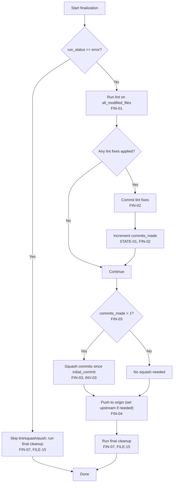
```mermaid
flowchart TD
  %% Rules: FIN-01..FIN-07, INV-03, MODE-01..MODE-02, STATE-01, STATE-06..STATE-08, FILE-08, FILE-15
  A["Start finalization"] --> A0{"run_status == error?"}
  A0 -->|Yes| Z["Skip lint/squash/push; run final cleanup<br/>FIN-07, FILE-15"] --> P["Done"]
  A0 -->|No| B["Run lint on all_modified_files<br/>FIN-01"]
  B --> C{"Any lint fixes applied?"}
  C -->|Yes| D["Commit lint fixes<br/>FIN-02"]
  C -->|No| E["Continue"]
  D --> D1["Increment commits_made<br/>STATE-01, FIN-02"]
  D1 --> E

  E --> F{"commits_made > 1?<br/>FIN-03"}
  F -->|Yes| G["Squash commits since initial_commit<br/>FIN-03, INV-03"]
  F -->|No| H["No squash needed"]
  G --> I["Push to origin (set upstream if needed)<br/>FIN-04"]
  H --> I
  I --> Q["Run final cleanup<br/>FIN-07, FILE-15"] --> P
```

### ALG-INNER-ROOT: One complete inner cycle (review → parse → handle → test → commit → cleanup)

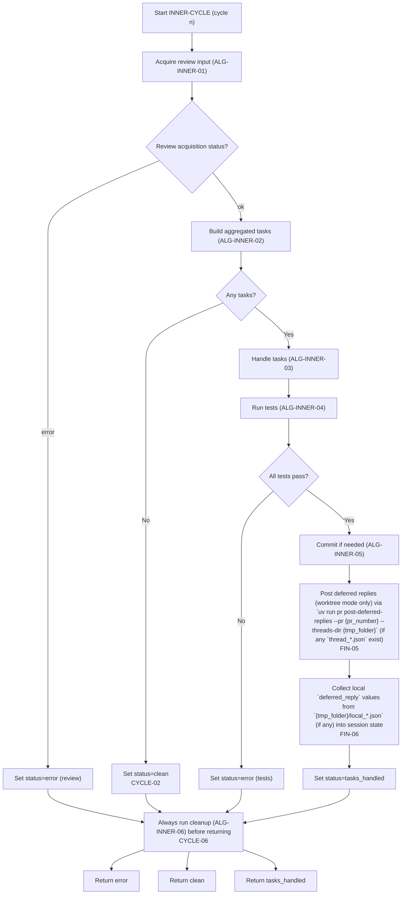
```mermaid
flowchart TD
  %% Rules: CYCLE-02..CYCLE-06, MODE-08..MODE-10, PAR-01..PAR-06, STATE-01..STATE-04, FILE-05, FILE-10, FIN-05..FIN-06
  A["Start INNER-CYCLE (cycle n)"] --> B["Acquire review input (ALG-INNER-01)"]
  B --> C{"Review acquisition status?"}
  C -->|error| X["Set status=error (review)"]
  C -->|ok| D["Build aggregated tasks (ALG-INNER-02)"]

  D --> E{"Any tasks?"}
  E -->|No| Y["Set status=clean<br/>CYCLE-02"]
  E -->|Yes| F["Handle tasks (ALG-INNER-03)"]
  F --> G["Run tests (ALG-INNER-04)"]
  G --> H{"All tests pass?"}
  H -->|No| X2["Set status=error (tests)"]
  H -->|Yes| I["Commit if needed (ALG-INNER-05)"]
  I --> J["Post deferred replies (worktree mode only) via `uv run pr post-deferred-replies --pr {pr_number} --threads-dir {tmp_folder}` (if any `thread_*.json` exist)<br/>FIN-05"]
  J --> J1["Collect local `deferred_reply` values from `{tmp_folder}/local_*.json` (if any) into session state<br/>FIN-06"]
  J1 --> K["Set status=tasks_handled"]

  %% finally / cleanup-on-exit
  X --> Z["Always run cleanup (ALG-INNER-06) before returning<br/>CYCLE-06"] --> R["Return error"]
  X2 --> Z
  Y --> Z --> S["Return clean"]
  K --> Z --> T["Return tasks_handled"]
```

### ALG-INNER-00: Determine review source (threads-first, cycle-1 only)

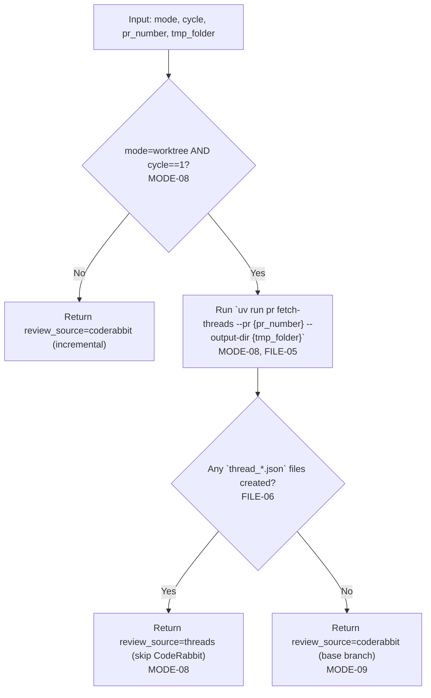
```mermaid
flowchart TD
  %% Rules: MODE-08..MODE-09, FILE-05..FILE-07
  A["Input: mode, cycle, pr_number, tmp_folder"] --> B{"mode=worktree AND cycle==1?<br/>MODE-08"}
  B -->|No| C["Return review_source=coderabbit (incremental)"]
  B -->|Yes| D["Run `uv run pr fetch-threads --pr {pr_number} --output-dir {tmp_folder}`<br/>MODE-08, FILE-05"]
  D --> E{"Any `thread_*.json` files created?<br/>FILE-06"}
  E -->|Yes| F["Return review_source=threads (skip CodeRabbit)<br/>MODE-08"]
  E -->|No| G["Return review_source=coderabbit (base branch)<br/>MODE-09"]
```

### ALG-INNER-01: Acquire review input (threads-first)

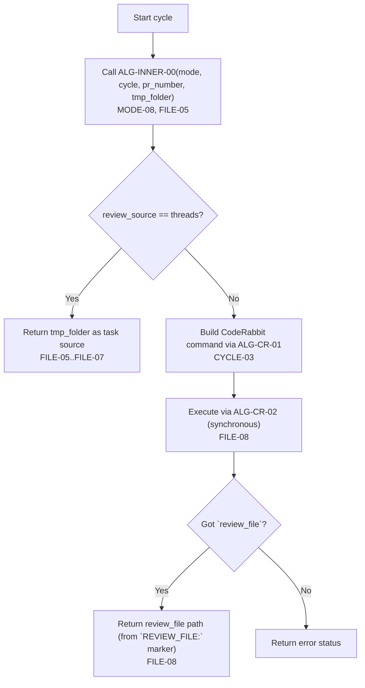
```mermaid
flowchart TD
  %% Rules: CYCLE-03, MODE-08..MODE-09, FILE-05..FILE-08
  A["Start cycle"] --> A0["Call ALG-INNER-00(mode, cycle, pr_number, tmp_folder)<br/>MODE-08, FILE-05"]
  A0 --> B{"review_source == threads?"}
  B -->|Yes| C["Return tmp_folder as task source<br/>FILE-05..FILE-07"]
  B -->|No| D["Build CodeRabbit command via ALG-CR-01<br/>CYCLE-03"]
  D --> E["Execute via ALG-CR-02 (synchronous)<br/>FILE-08"]
  E --> F{"Got `review_file`?"}
  F -->|Yes| G["Return review_file path (from `REVIEW_FILE:` marker)<br/>FILE-08"]
  F -->|No| H["Return error status"]
```

### ALG-INNER-02: Build aggregated tasks (threads/local/coderabbit)

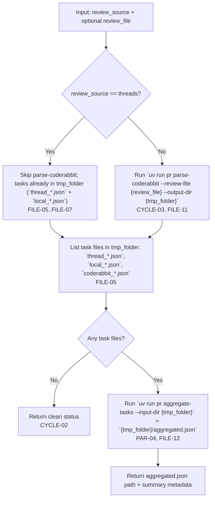
```mermaid
flowchart TD
  %% Rules: CYCLE-02, CYCLE-03, PAR-04, FILE-05..FILE-07, FILE-11..FILE-12
  A["Input: review_source + optional review_file"] --> B{"review_source == threads?"}
  B -->|Yes| C["Skip parse-coderabbit; tasks already in tmp_folder (`thread_*.json` + `local_*.json`)<br/>FILE-05..FILE-07"]
  B -->|No| D["Run `uv run pr parse-coderabbit --review-file {review_file} --output-dir {tmp_folder}`<br/>CYCLE-03, FILE-11"]
  C --> E["List task files in tmp_folder: `thread_*.json`, `local_*.json`, `coderabbit_*.json`<br/>FILE-05"]
  D --> E
  E --> F{"Any task files?"}
  F -->|No| G["Return clean status<br/>CYCLE-02"]
  F -->|Yes| H["Run `uv run pr aggregate-tasks --input-dir {tmp_folder}` > `{tmp_folder}/aggregated.json`<br/>PAR-04, FILE-12"]
  H --> I["Return aggregated.json path + summary metadata"]
```

### ALG-INNER-03: Route tasks and spawn file handlers

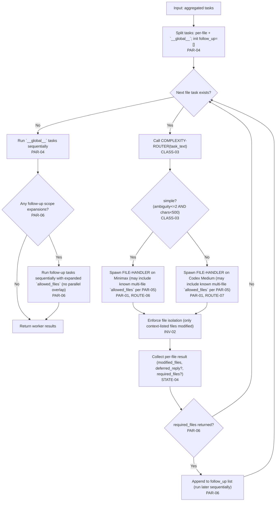
```mermaid
flowchart TD
  %% Rules: PAR-01..PAR-06, INV-02, ROUTE-06..ROUTE-07, CLASS-03, STATE-04
  A["Input: aggregated tasks"] --> B["Split tasks: per-file + `__global__`; init follow_up=[]<br/>PAR-04"]
  B --> C{"Next file task exists?"}
  C -->|No| J["Run `__global__` tasks sequentially<br/>PAR-04"]
  J --> J1{"Any follow-up scope expansions?<br/>PAR-06"}
  J1 -->|Yes| J2["Run follow-up tasks sequentially with expanded `allowed_files` (no parallel overlap)<br/>PAR-06"]
  J1 -->|No| K["Return worker results"]
  J2 --> K
  C -->|Yes| D["Call COMPLEXITY-ROUTER(task_text)<br/>CLASS-03"]
  D --> E{"simple?<br/>(ambiguity<=2 AND chars<500)<br/>CLASS-03"}
  E -->|Yes| F["Spawn FILE-HANDLER on Minimax (may include known multi-file `allowed_files` per PAR-05)<br/>PAR-01, ROUTE-06"]
  E -->|No| G["Spawn FILE-HANDLER on Codex Medium (may include known multi-file `allowed_files` per PAR-05)<br/>PAR-01, ROUTE-07"]
  F --> H["Enforce file isolation (only context-listed files modified)<br/>INV-02"]
  G --> H
  H --> I["Collect per-file result (modified_files, deferred_reply?, required_files?)<br/>STATE-04"]
  I --> I1{"required_files returned?<br/>PAR-06"}
  I1 -->|Yes| I2["Append to follow_up list (run later sequentially)<br/>PAR-06"] --> C
  I1 -->|No| C
```

### ALG-INNER-04: Run tests on changed files (parallel)

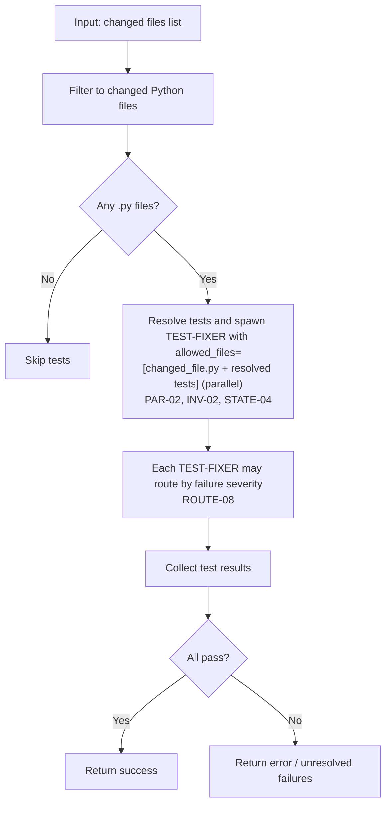
```mermaid
flowchart TD
  %% Rules: PAR-02, ROUTE-08, INV-02, STATE-04
  A["Input: changed files list"] --> B["Filter to changed Python files"] --> C{"Any .py files?"}
  C -->|No| Z["Skip tests"]
  C -->|Yes| D["Resolve tests and spawn TEST-FIXER with allowed_files=[changed_file.py + resolved tests] (parallel)<br/>PAR-02, INV-02, STATE-04"]
  D --> E["Each TEST-FIXER may route by failure severity<br/>ROUTE-08"]
  E --> F["Collect test results"] --> G{"All pass?"}
  G -->|Yes| H["Return success"]
  G -->|No| I["Return error / unresolved failures"]
```

### ALG-INNER-05: Commit changes if any

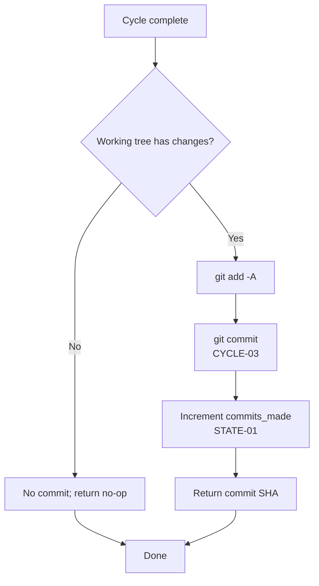
```mermaid
flowchart TD
  %% Rules: CYCLE-03, STATE-01
  A["Cycle complete"] --> B{"Working tree has changes?"}
  B -->|No| C["No commit; return no-op"]
  B -->|Yes| D["git add -A"] --> E["git commit<br/>CYCLE-03"] --> F["Increment commits_made<br/>STATE-01"] --> G["Return commit SHA"]
  C --> H["Done"]
  G --> H
```

### ALG-INNER-06: Cleanup cycle artifacts

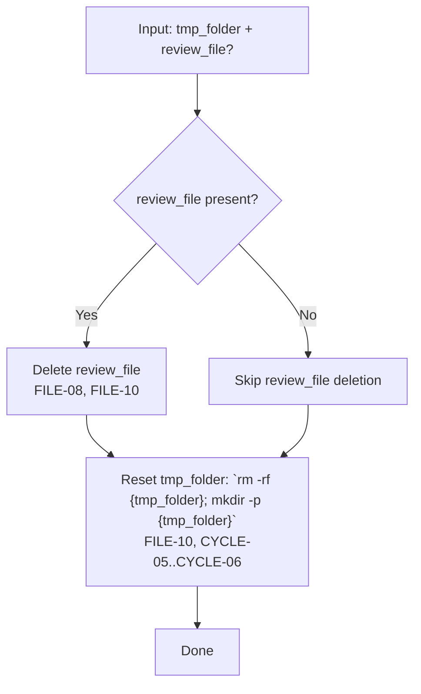
```mermaid
flowchart TD
  %% Rules: CYCLE-05..CYCLE-06, FILE-05, FILE-08, FILE-10
  A["Input: tmp_folder + review_file?"] --> B{"review_file present?"}
  B -->|Yes| C["Delete review_file<br/>FILE-08, FILE-10"]
  B -->|No| D["Skip review_file deletion"]
  C --> E["Reset tmp_folder: `rm -rf {tmp_folder}; mkdir -p {tmp_folder}`<br/>FILE-10, CYCLE-05..CYCLE-06"]
  D --> E
  E --> F["Done"]
```

### ALG-FILE-01: Resolve file tasks from aggregated task list

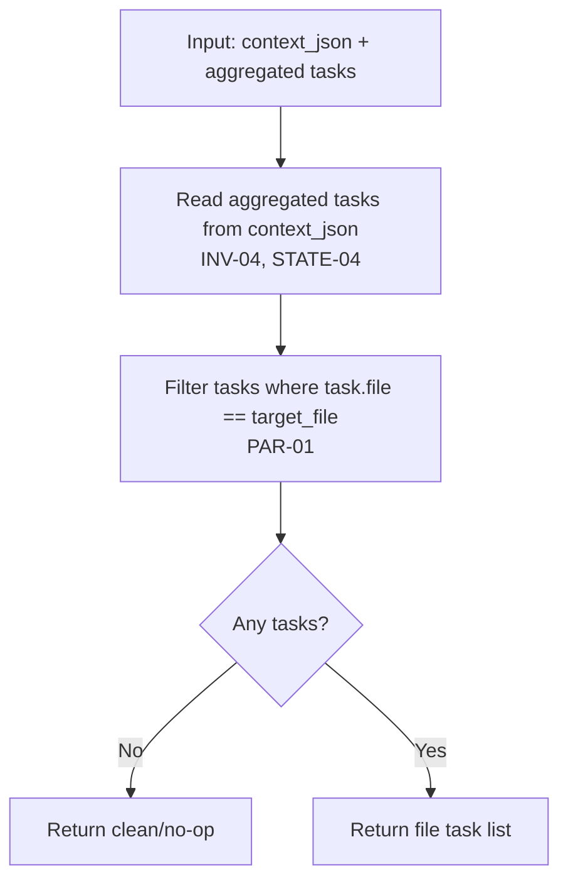
```mermaid
flowchart TD
  %% Rules: INV-04, PAR-01, STATE-04
  A["Input: context_json + aggregated tasks"] --> B["Read aggregated tasks from context_json<br/>INV-04, STATE-04"]
  B --> C["Filter tasks where task.file == target_file<br/>PAR-01"]
  C --> D{"Any tasks?"}
  D -->|No| E["Return clean/no-op"]
  D -->|Yes| F["Return file task list"]
```

### ALG-FILE-02: Apply edits for a single file

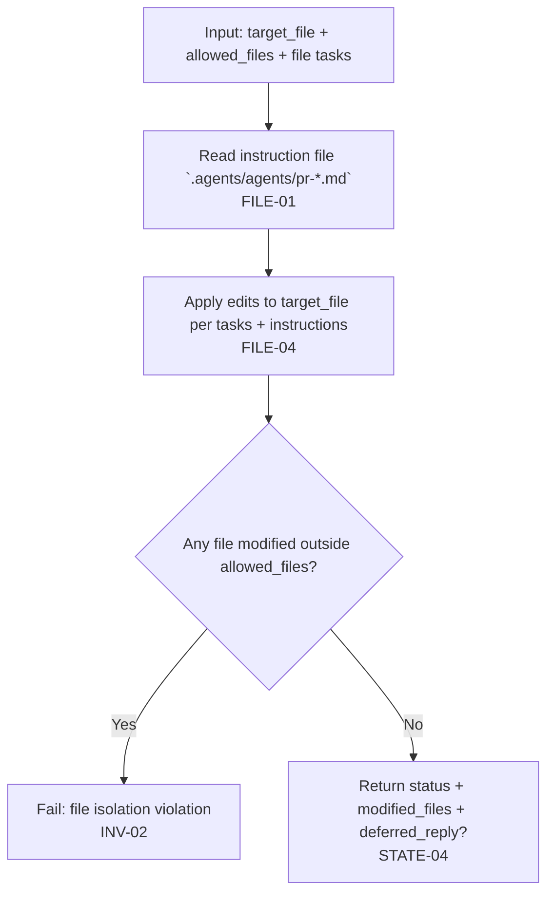
```mermaid
flowchart TD
  %% Rules: INV-02, FILE-01..FILE-04, STATE-04
  A["Input: target_file + allowed_files + file tasks"] --> B["Read instruction file `.agents/agents/pr-*.md`<br/>FILE-01"]
  B --> C["Apply edits to target_file per tasks + instructions<br/>FILE-04"]
  C --> D{"Any file modified outside allowed_files?"}
  D -->|Yes| E["Fail: file isolation violation<br/>INV-02"]
  D -->|No| F["Return status + modified_files + deferred_reply?<br/>STATE-04"]
```

### ALG-FILE-03: Write deferred reply for PR thread tasks

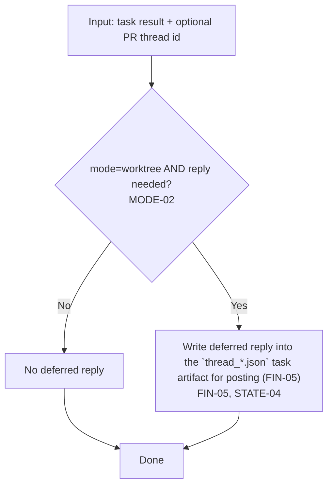
```mermaid
flowchart TD
  %% Rules: FIN-05, MODE-02, STATE-04
  A["Input: task result + optional PR thread id"] --> B{"mode=worktree AND reply needed?<br/>MODE-02"}
  B -->|No| C["No deferred reply"]
  B -->|Yes| D["Write deferred reply into the `thread_*.json` task artifact for posting (FIN-05)<br/>FIN-05, STATE-04"]
  C --> E["Done"]
  D --> E
```

### ALG-TEST-01: Run tests for a changed file

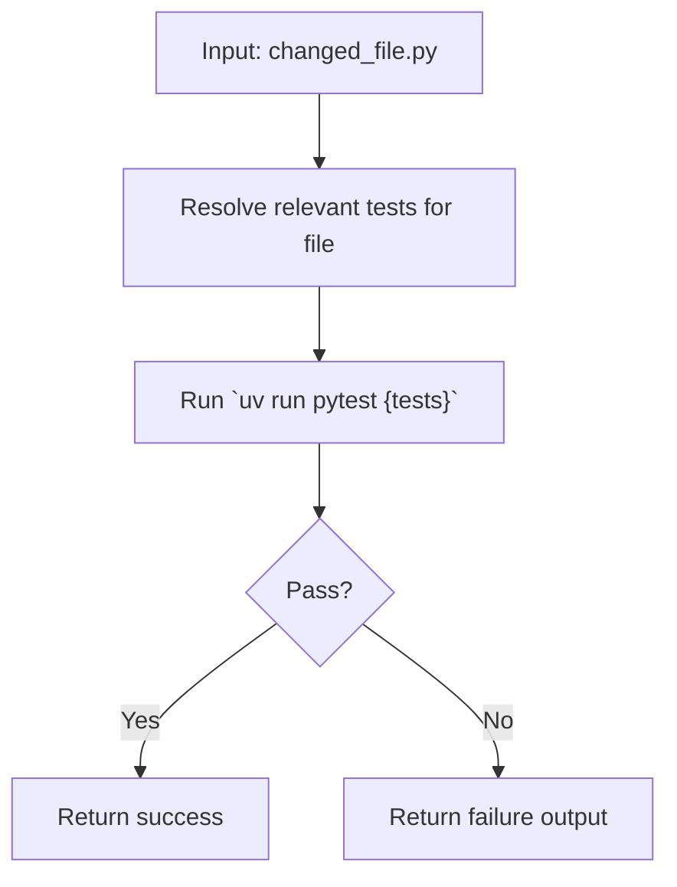
```mermaid
flowchart TD
  %% Rules: PAR-02
  A["Input: changed_file.py"] --> B["Resolve relevant tests for file"] --> C["Run `uv run pytest {tests}`"] --> D{"Pass?"}
  D -->|Yes| E["Return success"]
  D -->|No| F["Return failure output"]
```

### ALG-TEST-02: Classify test failure severity

```mermaid
  flowchart TD
  %% Rules: ROUTE-08
  A["Input: pytest failure output"] --> B["Classify severity per ROUTE-08"] --> C{"Severity?"}
  C -->|low| D["Route to Codex Medium<br/>ROUTE-08"]
  C -->|medium| E["Route to Codex High<br/>ROUTE-08"]
  C -->|high| F["Route to Codex XHigh<br/>ROUTE-08"]
  D --> G["Return chosen model + failure context"]
  E --> G
  F --> G
```

### ALG-TEST-03: Apply fix based on routed test-fix model

```mermaid
flowchart TD
  %% Rules: ROUTE-08
  A["Input: chosen model + failure context"] --> B["Propose fix with routed model<br/>ROUTE-08"]
  B --> C["Apply fix within allowed_files (source file + resolved tests)<br/>INV-02"]
  C --> D["Re-run relevant tests (ALG-TEST-01)"] --> E{"Pass?"}
  E -->|Yes| F["Return success"]
  E -->|No| G["Return unresolved failure"]
```

### ALG-LINT-01: Run lint on a single file

```mermaid
flowchart TD
  %% Rules: ROUTE-05, PAR-03
  A["Input: file path"] --> B["Run `uv run lint --files {path}`<br/>ROUTE-05"]
  B --> C{"Any issues?"}
  C -->|No| D["Return clean"]
  C -->|Yes| E["Return lint output"]
```

### ALG-LINT-02: Apply lint fixes

```mermaid
flowchart TD
  %% Rules: ROUTE-05
  A["Input: lint output"] --> B["Apply edits per lint findings<br/>ROUTE-05"]
  B --> C["Re-run lint (ALG-LINT-01)"] --> D{"Clean?"}
  D -->|Yes| E["Return success"]
  D -->|No| F["Return unresolved lint issues"]
```

### ALG-ROUTE-01: Score ambiguity (1-5) with Ministral 3B / GLM 4.7

```mermaid
flowchart TD
  %% Rules: ROUTE-02, CLASS-01, CLASS-04
  A["Input: task_text"] --> A1{"len(task_text) <= 2500?"}
  A1 -->|Yes| B["Prompt Ministral 3B to score ambiguity<br/>ROUTE-02, CLASS-04"]
  A1 -->|No| B2["Prompt GLM 4.7 to score ambiguity (fallback)<br/>ROUTE-02, CLASS-04"]
  B --> C["Parse numeric score (1-5)<br/>CLASS-01"]
  B2 --> C
  C --> D["Return ambiguity_score"]
```

### ALG-ROUTE-02: Count characters

```mermaid
flowchart TD
  %% Rules: CLASS-02
  A["Input: task_text"] --> B["chars = len(task_text)<br/>CLASS-02"] --> C["Return chars"]
```

### ALG-ROUTE-03: Combined routing decision

```mermaid
flowchart TD
  %% Rules: CLASS-03, ROUTE-06, ROUTE-07
  A["Input: ambiguity_score + chars"] --> B{"ambiguity<=2 AND chars<500?<br/>CLASS-03"}
  B -->|Yes| C["Route to Minimax (simple)<br/>ROUTE-06"]
  B -->|No| D["Route to Codex Medium (complex)<br/>ROUTE-07"]
  C --> E["Return model_id"]
  D --> E
```

### ALG-CR-01: Build CodeRabbit command (local vs worktree)

```mermaid
flowchart TD
  %% Rules: MODE-01..MODE-02, MODE-08..MODE-10, FILE-08
  A["Input: mode + cycle + working_dir + review_dir + base_branch?"] --> B{"mode=local?<br/>MODE-01"}
  B -->|Yes| C{"cycle==1?<br/>MODE-10"}
  C -->|No| D["Set review_args=`--base-commit HEAD~1`<br/>MODE-10"]
  C -->|Yes| E["Run `cd {working_dir} && git status --porcelain`"]
  E --> F{"Any output?"}
  F -->|Yes| G["Set review_args=`--type uncommitted`<br/>MODE-10"]
  F -->|No| H["Set review_args=`--base-commit HEAD~1`<br/>MODE-10"]
  B -->|No| I{"cycle==1?<br/>MODE-09"}
  I -->|Yes| J["Set review_args=`--base {base_branch}`<br/>MODE-09"]
  I -->|No| K["Set review_args=`--base-commit HEAD~1`<br/>MODE-09"]

  D --> L["Return command: `uv run review.coderabbit --output-dir {review_dir} -- {review_args}`<br/>FILE-08"]
  G --> L
  H --> L
  J --> L
  K --> L
```

### ALG-CR-02: Execute CodeRabbit review (synchronous)

```mermaid
flowchart TD
  %% Rules: FILE-08
  A["Input: CodeRabbit command"] --> B["Run command synchronously (blocking)"]
  B --> C["Extract `review_file` from stdout using `uv run pr extract-review-path`<br/>FILE-08"]
  C --> D{"Got `REVIEW_FILE:`?"}
  D -->|Yes| E["Return `review_file` path"]
  D -->|No| F["Return error"]
```

---

## Success Metrics

| ID | Metric | Target | Measurement | Goals |
|----|--------|--------|-------------|-------|
| MET-01 | Expensive model usage reduction | < 10% of tokens | Token count before/after | GOAL-01 |
| MET-02 | Review quality | No regression | Manual review of 10 PRs | GOAL-02 |
| MET-03 | Parallel speedup | 2x faster | Wall clock time comparison | GOAL-03 |
| MET-04 | Routing accuracy | > 90% appropriate | Audit 50 routed tasks | GOAL-04 |
| MET-05 | Config size | < 100 lines | Line count of config.toml | GOAL-05 |
| MET-06 | Cross-file edits | 0 violations | Audit worker outputs | GOAL-06 |
