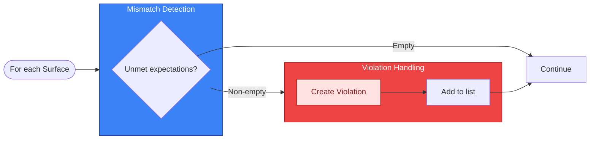
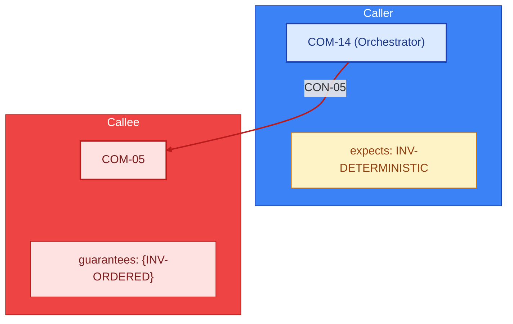
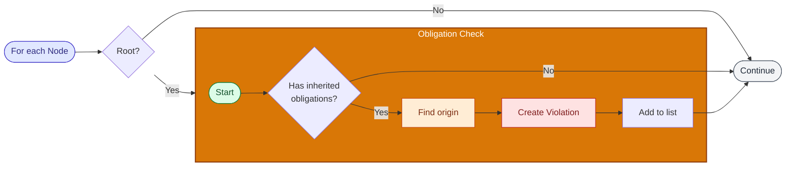
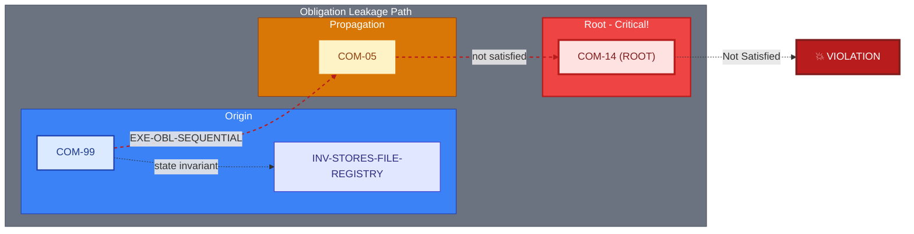
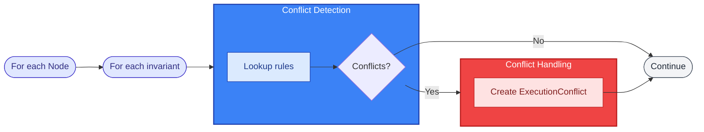
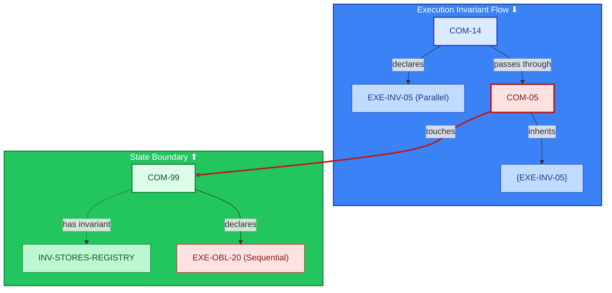
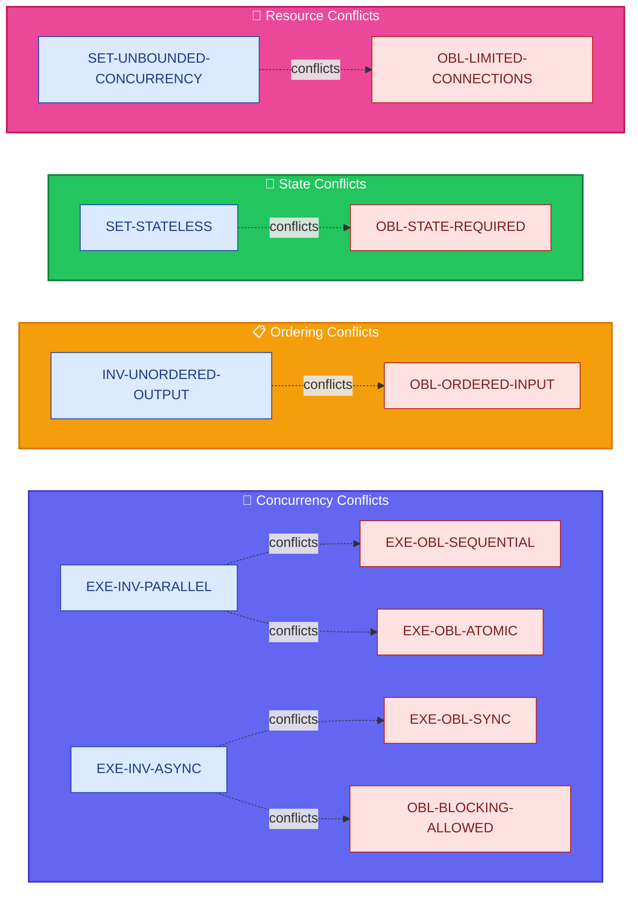
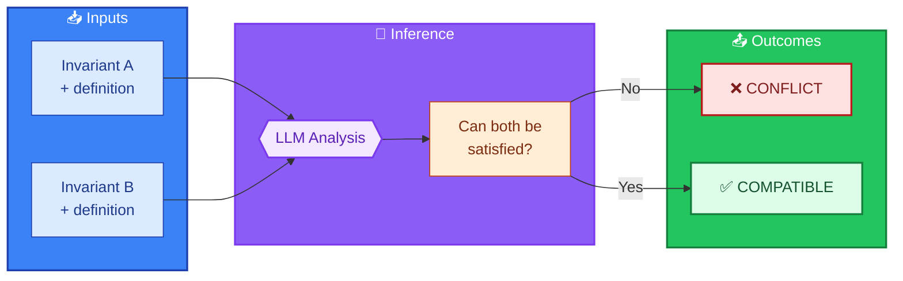
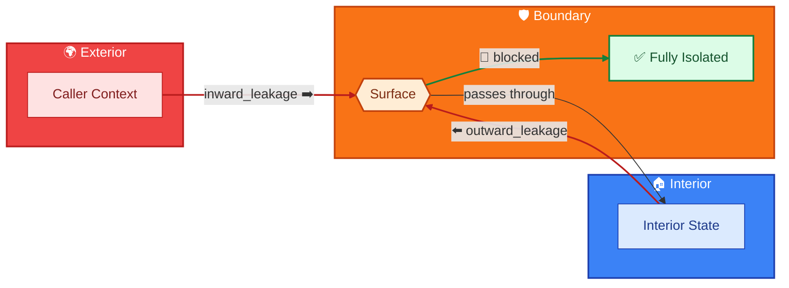
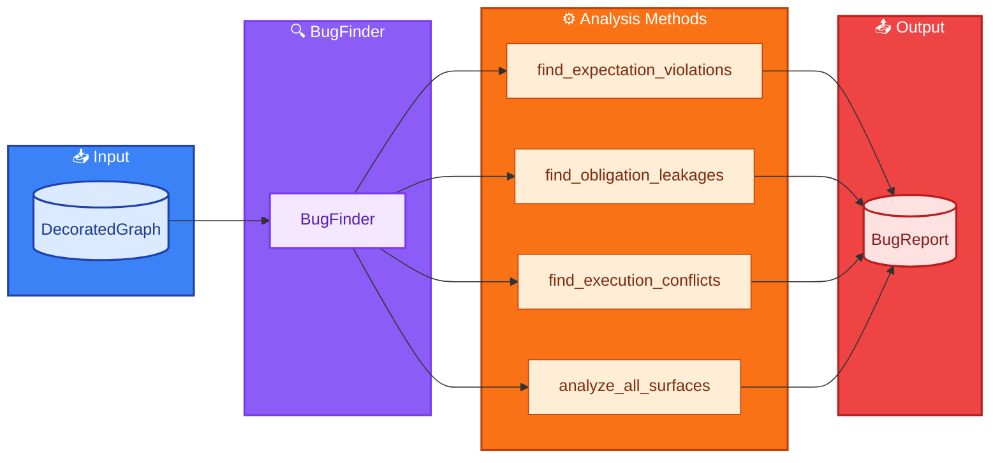

# Algorithm Bug Finder

## Purpose

Detects constraint violations in distributed algorithms by analyzing the decorated
graph from the [Algorithm Graph Creator](../algorithm%20graph%20creator/feedback.md).
This system finds bugs through **invariant collision detection**—identifying
mismatches between what components expect and what they receive.

This is a **verification tool**, not an enhancement tool. It answers: "Is the
algorithm internally consistent with its declared constraints?"

---

## Input

The bug finder consumes a `DecoratedGraph` from the graph creator, which contains:

* Nodes with active invariants and inherited obligations
* Surfaces with expectations, guarantees, and barrier analysis
* Leakage analysis for each boundary

---

## Violation Types

### Type 1: Expectation/Guarantee Mismatch

A caller expects something that the callee does not guarantee.

### ExpectationViolation

* The surface where mismatch occurred
* The caller and callee involved
* The set of unmet expectations

**Detection Flow:**

**Example:**

> **VIOLATION:** COM-14 expects `INV-DETERMINISTIC` from COM-05 via CON-05, but
> COM-05 does not guarantee it.

---

### Type 2: Unsatisfied Obligation Leakage

An obligation from a leaf component bubbles up without ever being satisfied.

### ObligationLeakageViolation

* The unsatisfied obligation
* Where it originated
* How far up it leaked (root = critical)
* The path of surfaces it passed through

**Detection Flow:**

**Example:**

> **VIOLATION:** `EXE-OBL-SEQUENTIAL` from COM-99 (which has invariant
> INV-STORES-FILE-REGISTRY) leaked to root COM-14. No component in the path
> provides serialization.

---

### Type 3: Execution Invariant/Obligation Conflict

An execution invariant from the calling context conflicts with an execution
obligation from a component (often one with state storage invariants).

### ExecutionConflict

* The execution invariant (top-down, e.g., EXE-INV-PARALLEL)
* The execution obligation (bottom-up, e.g., EXE-OBL-SEQUENTIAL)
* Where the conflict occurs
* Sources of both the invariant and obligation

**Detection Flow:**

**Example:**

> **CONFLICT at COM-05:**
>
> * **Execution Invariant:** EXE-INV-05 (Parallel) from COM-14
> * **Execution Obligation:** EXE-OBL-20 (Sequential) from COM-99 (state invariant
>   INV-STORES-REGISTRY)
> * These are incompatible—COM-05 must implement synchronization.

---

## The Execution Conflict Prompt

When a conflict is detected, generate a focused prompt for LLM analysis:

| Section | Content |
|---------|---------|
| 1: Operating Environment | Component X called by Y; Active Execution Invariants |
| 2: Deep State Boundary | Component X touches Z; Active Execution Obligations |
| 3: The Conflict | Running with invariants A but touching resource with obligations B |
| 4: Analysis Required | Real conflict; What mechanism needed; Where to implement |

---

## Conflict Rules

The bug finder needs rules defining which invariants conflict:

### Option: LLM-Inferred Conflicts

When conflict rules aren't predefined:

---

## Surface Isolation Analysis

Beyond finding violations, analyze what each surface isolates:

### IsolationReport

* The surface being analyzed
* What is fully isolated (doesn't leak)
* Inward leakage (context entering interior)
* Outward leakage (demands escaping interior)

**Use Case:** Understanding which components are truly isolated (safe to reason
about independently) vs. which are coupled through leaked constraints.

---

## Full Bug Finding Pipeline

**BugReport Methods:**

| Method | Description |
|--------|-------------|
| `to_markdown()` | Human-readable report |
| `get_critical()` | Root-leaked violations only |
| `get_by_component(id)` | Violations for specific component |

---

## Scope

The bug finder handles **correctness** (constraint violations).

The [Algorithm Enhancer](../algorithm%20enhancer/feedback.md) handles **quality** (performance, simplification, optimization).

These are complementary tools with distinct purposes:

| Tool | Question | Domain |
|------|----------|--------|
| Bug Finder | "Is this correct?" | Constraint satisfaction |
| Enhancer | "Can this be better?" | Performance, clarity, efficiency |

Note on "logic bugs": If behavior is incorrect, it violates some expectation—which
is an invariant. The system catches this through:

* **Inherited invariants** (from parents) vs **inferred behavior** (from code)
  mismatches
* Parent says "output must be sorted" → code produces unsorted → violation detected

Note on "missing constraints": The [Graph Creator](../algorithm%20graph%20creator/feedback.md)
infers implicit invariants from algorithm content. You don't have to manually
declare every invariant—the LLM expands the invariant set by analyzing what the
code actually assumes and requires.

The bug finder answers: "Given the constraints (declared + inferred + inherited),
is the system internally consistent?"
