# Algorithm Decomposition

## Purpose

Analyzes capability (responsibility) distribution across components to guide architecture evolution. This is distinct from bug finding (correctness) and component optimization (performance within fixed contracts).

Decomposition enables:
1. **Detecting capability overlaps** → merge candidates
2. **Detecting capability divergence** → split candidates
3. **Finding capability patterns** → new component opportunities
4. **Recomposing the system** based on responsibility groupings

---

## The Capability Model

Each component has capabilities (CAP-XX) representing what it does:

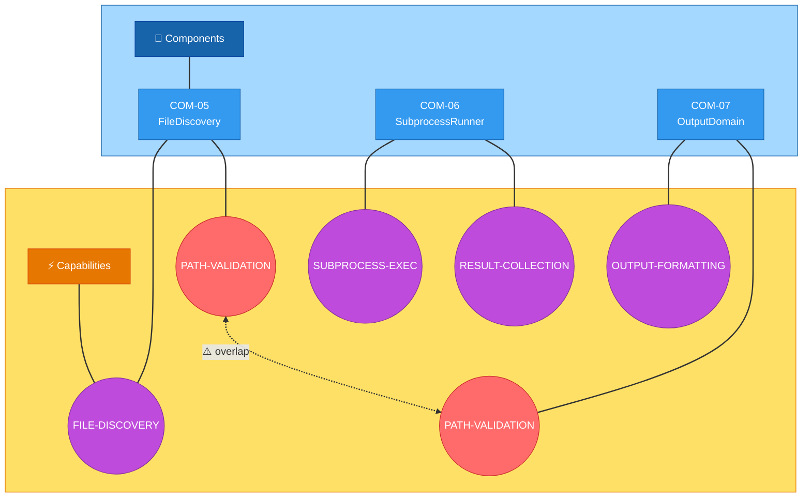
```mermaid
graph TB
    subgraph Components[" "]
        CT[🧩 Components]
        COM05[COM-05<br/>FileDiscovery]
        COM06[COM-06<br/>SubprocessRunner]
        COM07[COM-07<br/>OutputDomain]
        CT ~~~ COM05
    end

    subgraph Capabilities[" "]
        CP[⚡ Capabilities]
        CAP_FD((FILE-DISCOVERY))
        CAP_PV1((PATH-VALIDATION))
        CAP_SE((SUBPROCESS-EXEC))
        CAP_RC((RESULT-COLLECTION))
        CAP_OF((OUTPUT-FORMATTING))
        CAP_PV2((PATH-VALIDATION))
        CP ~~~ CAP_FD
    end

    COM05 --- CAP_FD
    COM05 --- CAP_PV1
    COM06 --- CAP_SE
    COM06 --- CAP_RC
    COM07 --- CAP_OF
    COM07 --- CAP_PV2

    CAP_PV1 <-.->|⚠️ overlap| CAP_PV2

    style CT fill:#1864ab,stroke:#0d47a1,color:#fff
    style CP fill:#e67700,stroke:#d9480f,color:#fff
    style COM05 fill:#339af0,stroke:#1864ab,color:#fff
    style COM06 fill:#339af0,stroke:#1864ab,color:#fff
    style COM07 fill:#339af0,stroke:#1864ab,color:#fff
    style CAP_FD fill:#be4bdb,stroke:#862e9c,color:#fff
    style CAP_SE fill:#be4bdb,stroke:#862e9c,color:#fff
    style CAP_RC fill:#be4bdb,stroke:#862e9c,color:#fff
    style CAP_OF fill:#be4bdb,stroke:#862e9c,color:#fff
    style CAP_PV1 fill:#ff6b6b,stroke:#c92a2a,color:#fff
    style CAP_PV2 fill:#ff6b6b,stroke:#c92a2a,color:#fff
    style Components fill:#a5d8ff,stroke:#1864ab
    style Capabilities fill:#ffe066,stroke:#e67700
    linkStyle default stroke:#333,stroke-width:2px
```

Capabilities are:
- **Declared** explicitly in component documents
- **Inferred** by LLM from algorithm content
- **Tracked** as algorithms evolve

---

## Decomposition Framework

### Hierarchy

```
Responsibilities (atomic) → Capabilities (algorithmic) → Components (system)
```

### Atomic Responsibilities

| Pattern | Description |
|---------|-------------|
| Guard | Early return on condition |
| Classifier | Boolean predicate check |
| Validator | Validate data, throw on failure |
| Getter | Return a private field |
| Setter | Set a private field |
| Mutator | Modify one piece of data |
| Mapper | Transform data between formats |
| Extractor | Get specific data from source |
| Filter | Yield elements passing predicate |
| Collector | Build collection from iterable |
| Reducer | Aggregate data to single value |
| Builder | Construct data from parts |
| Walker | Yield individual elements |
| Visitor | Accept callback for each element |
| Splitter | Fan-out one stream to many |
| Zip | Combine streams index-by-index |
| Router | Route to N functions via conditions |
| Orchestrator | Sequential integration, no logic |
| Projection | Derived view for transmission |
| Entity | Domain class with fields |

---

## Events

Events trigger evaluation of the capability graph.

| Event | Description | What to evaluate |
|-------|-------------|------------------|
| Algorithm changed | Algorithm modified or created | Does capability exist elsewhere? Is responsibility count too high? |
| Capability added | New capability introduced to component | Does capability exist elsewhere? Is capability more cohesive with another component's capabilities? |
| Component created | New component added to system | Should this component absorb related capabilities from other components? |
| Constraint violation resolved | Fix applied to satisfy invariant | Did fix increase responsibility count? Are there now too many capabilities? |

---

## States

States are detected conditions that require action.

### Overlap

Capability exists in multiple components.

**Detection**: Same capability provided by more than one component.

**Independent of complexity** - always deduplicate regardless of how simple the capability is.

### Divergence

Component has too many unrelated capabilities.

**Detection**: High count of capabilities with low cohesion.

**Complexity dimension**: Breadth - many simple, unrelated things.

### Responsibility Overload

Capability or capability suite has too many responsibilities.

**Detection**: High responsibility count per capability.

**Complexity dimension**: Depth - few complex things.

---

## Complexity

Complexity is evaluated when no existing component handles a capability.

| Dimension | Measures | Signal | Action |
|-----------|----------|--------|--------|
| **Divergence** | Capability count | Many capabilities, low cohesion | Group related capabilities → new component |
| **Responsibility Overload** | Responsibility count per capability | Few capabilities, each complex | Decompose capability into sub-capabilities |

After decomposing a complex capability:
- Sub-capabilities may stay in same component (internal decomposition)
- Or sub-capabilities may belong in different components (external decomposition)

---

## Actions

| Action | When | Result |
|--------|------|--------|
| Ship to existing component | Overlap detected | Deduplicate capability |
| Absorb capabilities | New component created | Pull related capabilities from other components |
| Group capabilities | Divergence detected | New component for cohesive capability group |
| Decompose capability | Responsibility overload | Split into sub-capabilities |
| Ship sub-capabilities | After decomposition, sub-capabilities don't belong together | Move sub-capabilities to appropriate components |

---

## Evaluation Flow

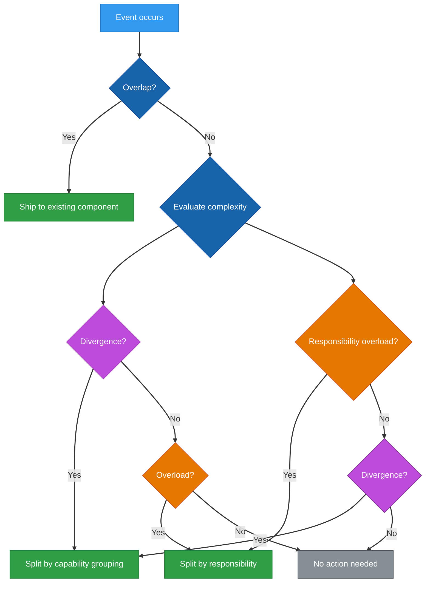
```mermaid
flowchart TD
    E[Event occurs] --> O{Overlap?}

    O -->|Yes| A1[Ship to existing component]

    O -->|No| C{Evaluate complexity}

    C --> D{Divergence?}
    C --> R{Responsibility overload?}

    D -->|Yes| A2[Split by capability grouping]
    R -->|Yes| A3[Split by responsibility]

    D -->|No| R2{Overload?}
    R -->|No| D2{Divergence?}

    R2 -->|Yes| A3
    R2 -->|No| A4[No action needed]

    D2 -->|Yes| A2
    D2 -->|No| A4

    style E fill:#339af0,stroke:#1864ab,color:#fff
    style O fill:#1864ab,stroke:#0d47a1,color:#fff
    style C fill:#1864ab,stroke:#0d47a1,color:#fff
    style D fill:#be4bdb,stroke:#862e9c,color:#fff
    style R fill:#e67700,stroke:#d9480f,color:#fff
    style D2 fill:#be4bdb,stroke:#862e9c,color:#fff
    style R2 fill:#e67700,stroke:#d9480f,color:#fff
    style A1 fill:#2f9e44,stroke:#1e7e34,color:#fff
    style A2 fill:#2f9e44,stroke:#1e7e34,color:#fff
    style A3 fill:#2f9e44,stroke:#1e7e34,color:#fff
    style A4 fill:#868e96,stroke:#495057,color:#fff
    linkStyle default stroke:#333,stroke-width:2px
```

---

## Detailed Triggers

### Trigger 1: Capability Overlap Detection

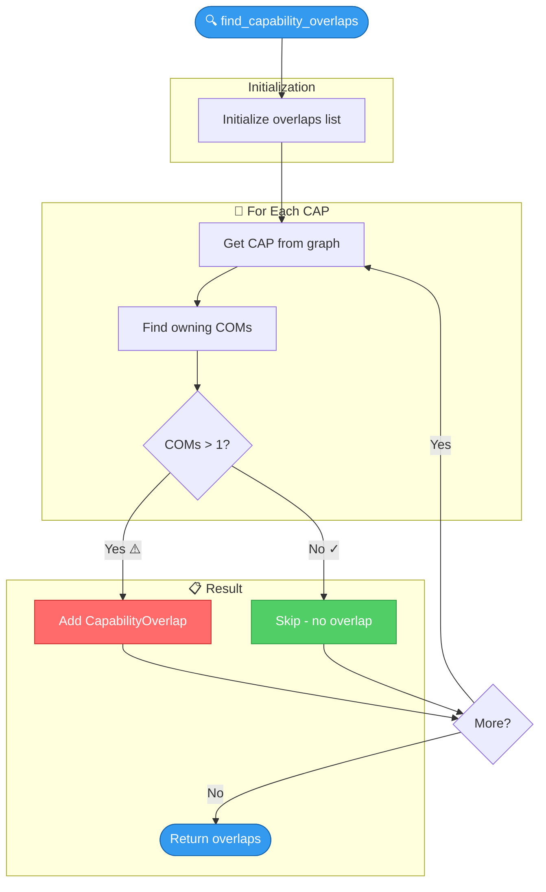
```mermaid
flowchart TD
    A([🔍 find_capability_overlaps])

    subgraph Init["Initialization"]
        B[Initialize overlaps list]
    end

    subgraph Loop["🔄 For Each CAP"]
        C[Get CAP from graph]
        D[Find owning COMs]
        E{COMs > 1?}
    end

    subgraph Result["📋 Result"]
        F[Add CapabilityOverlap]
        G[Skip - no overlap]
        I([Return overlaps])
    end

    A --> B --> C
    C --> D --> E
    E -->|Yes ⚠️| F
    E -->|No ✓| G
    F & G --> H{More?}
    H -->|Yes| C
    H -->|No| I

    style A fill:#339af0,stroke:#1864ab,color:#fff
    style F fill:#ff6b6b,stroke:#c92a2a,color:#fff
    style G fill:#51cf66,stroke:#2f9e44,color:#fff
    style I fill:#339af0,stroke:#1864ab,color:#fff
```

**Example:**

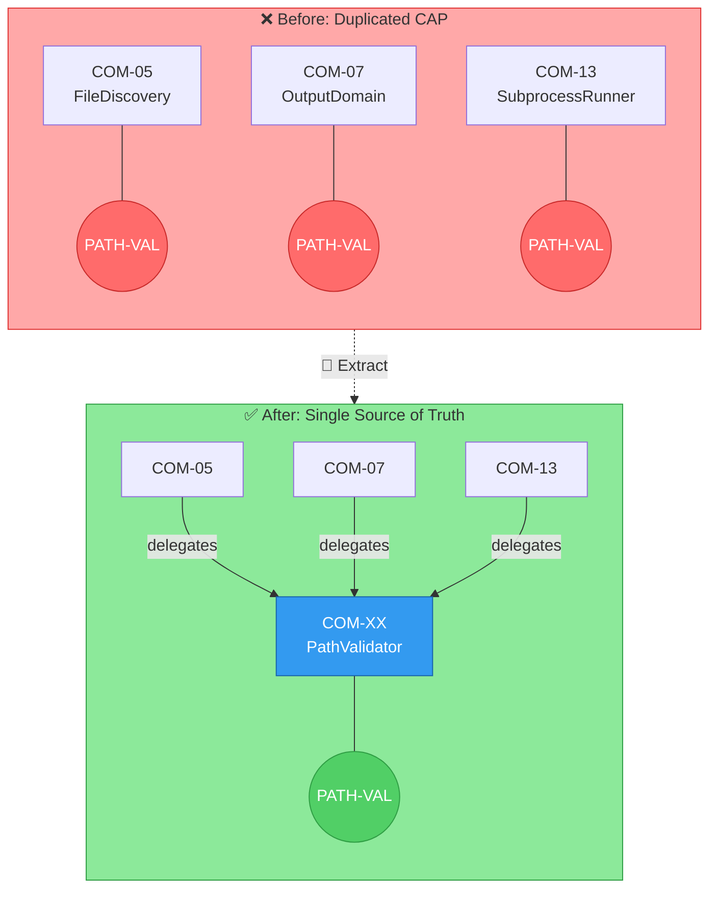
```mermaid
flowchart TD
    subgraph BEFORE["❌ Before: Duplicated CAP"]
        direction TB
        COM05[COM-05<br/>FileDiscovery]
        COM07[COM-07<br/>OutputDomain]
        COM13[COM-13<br/>SubprocessRunner]
        CAP1((PATH-VAL))
        CAP2((PATH-VAL))
        CAP3((PATH-VAL))
        COM05 --- CAP1
        COM07 --- CAP2
        COM13 --- CAP3
    end

    BEFORE -.->|🔧 Extract| AFTER

    subgraph AFTER["✅ After: Single Source of Truth"]
        direction TB
        COMXX[COM-XX<br/>PathValidator]
        CAPX((PATH-VAL))
        COM05B[COM-05]
        COM07B[COM-07]
        COM13B[COM-13]
        COMXX --- CAPX
        COM05B -->|delegates| COMXX
        COM07B -->|delegates| COMXX
        COM13B -->|delegates| COMXX
    end

    style BEFORE fill:#ffa8a8,stroke:#e03131
    style AFTER fill:#8ce99a,stroke:#2f9e44
    style CAP1 fill:#ff6b6b,stroke:#c92a2a,color:#fff
    style CAP2 fill:#ff6b6b,stroke:#c92a2a,color:#fff
    style CAP3 fill:#ff6b6b,stroke:#c92a2a,color:#fff
    style CAPX fill:#51cf66,stroke:#2f9e44,color:#fff
    style COMXX fill:#339af0,stroke:#1864ab,color:#fff
```

### Trigger 3: Capability Divergence Detection

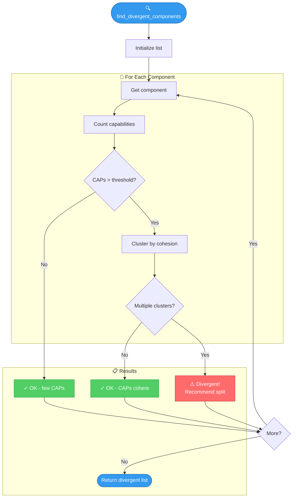
```mermaid
flowchart TD
    A([🔍 find_divergent_components])

    subgraph Analysis["🔄 For Each Component"]
        C[Get component]
        D[Count capabilities]
        E{CAPs > threshold?}
        G[Cluster by cohesion]
        H{Multiple clusters?}
    end

    subgraph Results["📋 Results"]
        F[✓ OK - few CAPs]
        I[✓ OK - CAPs cohere]
        J[⚠️ Divergent!<br/>Recommend split]
        L([Return divergent list])
    end

    A --> B[Initialize list] --> C
    C --> D --> E
    E -->|No| F
    E -->|Yes| G --> H
    H -->|No| I
    H -->|Yes| J
    F & I & J --> K{More?}
    K -->|Yes| C
    K -->|No| L

    style A fill:#339af0,stroke:#1864ab,color:#fff
    style J fill:#ff6b6b,stroke:#c92a2a,color:#fff
    style F fill:#51cf66,stroke:#2f9e44,color:#fff
    style I fill:#51cf66,stroke:#2f9e44,color:#fff
    style L fill:#339af0,stroke:#1864ab,color:#fff
```

**Example:**

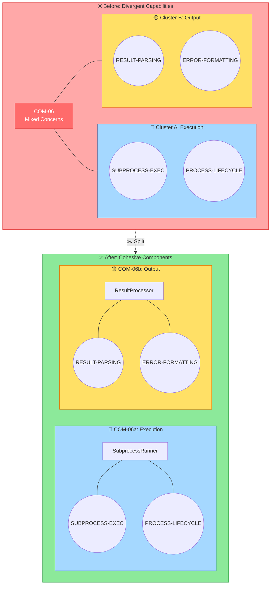
```mermaid
flowchart TD
    subgraph BEFORE["❌ Before: Divergent Capabilities"]
        COM06[COM-06<br/>Mixed Concerns]
        subgraph ClusterA["🔵 Cluster A: Execution"]
            CAPA1((SUBPROCESS-EXEC))
            CAPA2((PROCESS-LIFECYCLE))
        end
        subgraph ClusterB["🟡 Cluster B: Output"]
            CAPB1((RESULT-PARSING))
            CAPB2((ERROR-FORMATTING))
        end
        COM06 --- ClusterA
        COM06 --- ClusterB
    end

    BEFORE -.->|✂️ Split| AFTER

    subgraph AFTER["✅ After: Cohesive Components"]
        subgraph NewA["🔵 COM-06a: Execution"]
            COM06A[SubprocessRunner]
            CAPA1B((SUBPROCESS-EXEC))
            CAPA2B((PROCESS-LIFECYCLE))
            COM06A --- CAPA1B & CAPA2B
        end
        subgraph NewB["🟡 COM-06b: Output"]
            COM06B[ResultProcessor]
            CAPB1B((RESULT-PARSING))
            CAPB2B((ERROR-FORMATTING))
            COM06B --- CAPB1B & CAPB2B
        end
    end

    style BEFORE fill:#ffa8a8,stroke:#e03131
    style AFTER fill:#8ce99a,stroke:#2f9e44
    style COM06 fill:#ff6b6b,stroke:#c92a2a,color:#fff
    style ClusterA fill:#a5d8ff,stroke:#1864ab
    style ClusterB fill:#ffe066,stroke:#e67700
    style NewA fill:#a5d8ff,stroke:#1864ab
    style NewB fill:#ffe066,stroke:#e67700
```

### Trigger 4: Capability Pattern Detection

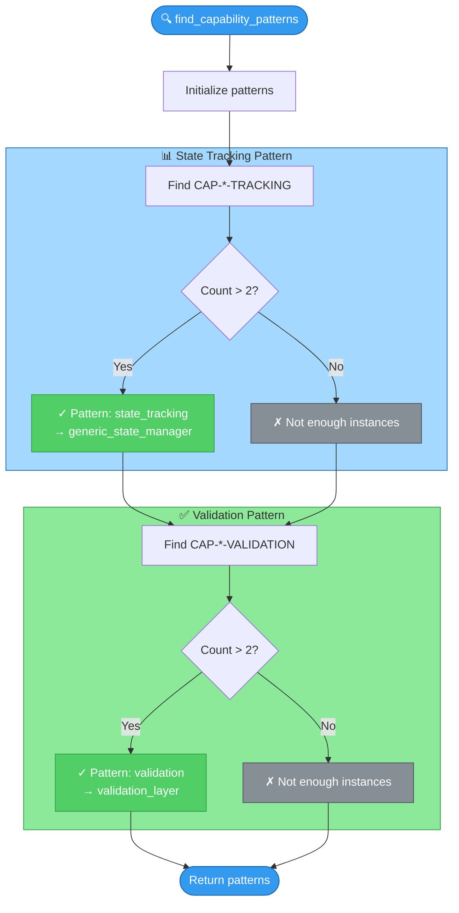
```mermaid
flowchart TD
    A([🔍 find_capability_patterns])
    B[Initialize patterns]

    subgraph StateCheck["📊 State Tracking Pattern"]
        C[Find CAP-*-TRACKING]
        D{Count > 2?}
        E[✓ Pattern: state_tracking<br/>→ generic_state_manager]
        F[✗ Not enough instances]
    end

    subgraph ValidationCheck["✅ Validation Pattern"]
        G[Find CAP-*-VALIDATION]
        H{Count > 2?}
        I[✓ Pattern: validation<br/>→ validation_layer]
        J[✗ Not enough instances]
    end

    A --> B --> C
    C --> D
    D -->|Yes| E --> G
    D -->|No| F --> G
    G --> H
    H -->|Yes| I --> K
    H -->|No| J --> K

    K([Return patterns])

    style A fill:#339af0,stroke:#1864ab,color:#fff
    style E fill:#51cf66,stroke:#2f9e44,color:#fff
    style I fill:#51cf66,stroke:#2f9e44,color:#fff
    style F fill:#868e96,stroke:#495057,color:#fff
    style J fill:#868e96,stroke:#495057,color:#fff
    style K fill:#339af0,stroke:#1864ab,color:#fff
    style StateCheck fill:#a5d8ff,stroke:#1864ab
    style ValidationCheck fill:#8ce99a,stroke:#2f9e44
```

---

## Decomposition Decisions

When decomposition is triggered, decide:

| Question | Internal Decomposition | External Decomposition |
|----------|------------------------|------------------------|
| Who owns the capability? | Same component | New/different component |
| Contract changes? | No | Possibly |
| Architecture changes? | No | Yes |
| Cascade effects? | None | Possible |

**Decision factors:**

1. **Cohesion**: Does this capability belong with the others in this component?
2. **Reuse**: Would other components benefit from this capability?
3. **Complexity**: Is internal decomposition sufficient, or is separation needed?
4. **Contract stability**: Can we avoid changing contracts?

---

## Recomposition

Capabilities can be viewed across the entire system to recompose:

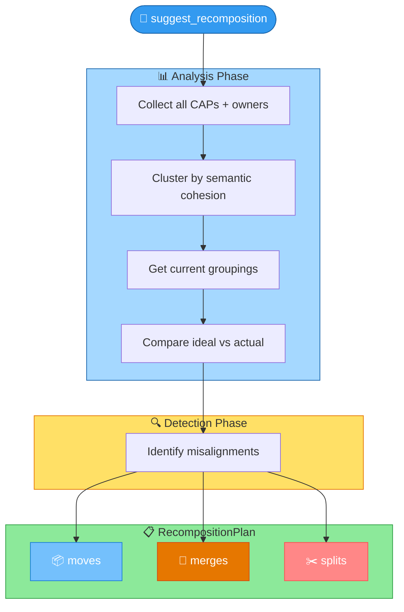
```mermaid
flowchart TD
    A([🔄 suggest_recomposition])

    subgraph Analysis["📊 Analysis Phase"]
        B[Collect all CAPs + owners]
        C[Cluster by semantic cohesion]
        D[Get current groupings]
        E[Compare ideal vs actual]
    end

    subgraph Detection["🔍 Detection Phase"]
        F[Identify misalignments]
    end

    subgraph Output["📋 RecompositionPlan"]
        H[📦 moves]
        I[🔗 merges]
        J[✂️ splits]
    end

    A --> B --> C --> D --> E --> F
    F --> H & I & J

    style A fill:#339af0,stroke:#1864ab,color:#fff
    style Analysis fill:#a5d8ff,stroke:#1864ab
    style Detection fill:#ffe066,stroke:#e67700
    style Output fill:#8ce99a,stroke:#2f9e44
    style H fill:#74c0fc,stroke:#1c7ed6,color:#fff
    style I fill:#e67700,stroke:#d9480f,color:#fff
    style J fill:#ff8787,stroke:#fa5252,color:#fff
```

**Example recomposition:**

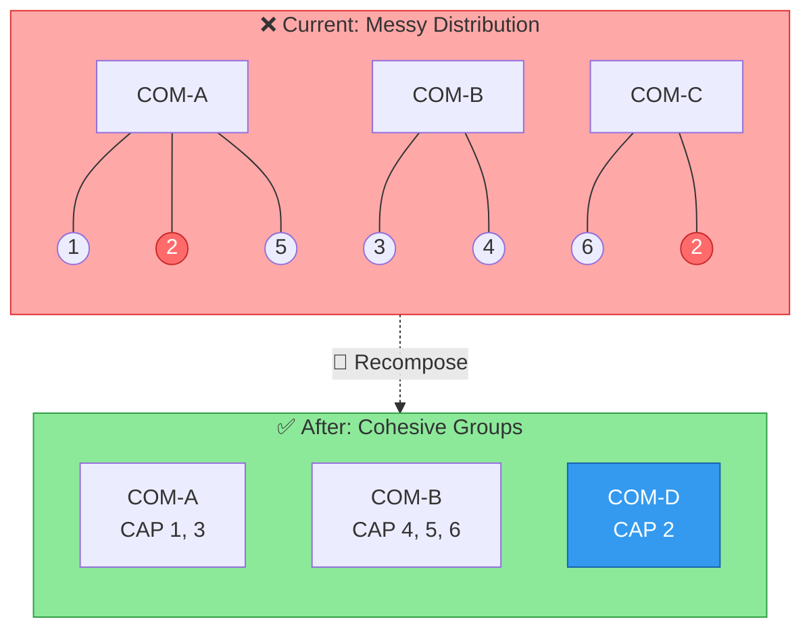
```mermaid
flowchart TD
    subgraph CURRENT["❌ Current: Messy Distribution"]
        direction TB
        COMA[COM-A]
        COMB[COM-B]
        COMC[COM-C]
        CAP1A((1))
        CAP2A((2))
        CAP5A((5))
        CAP3B((3))
        CAP4B((4))
        CAP6C((6))
        CAP2C((2))
        COMA --- CAP1A & CAP2A & CAP5A
        COMB --- CAP3B & CAP4B
        COMC --- CAP6C & CAP2C
    end

    CURRENT -.->|🔄 Recompose| RECOMPOSED

    subgraph RECOMPOSED["✅ After: Cohesive Groups"]
        direction TB
        COMA2[COM-A<br/>CAP 1, 3]
        COMB2[COM-B<br/>CAP 4, 5, 6]
        COMD[COM-D<br/>CAP 2]
    end

    style CURRENT fill:#ffa8a8,stroke:#e03131
    style RECOMPOSED fill:#8ce99a,stroke:#2f9e44
    style CAP2A fill:#ff6b6b,stroke:#c92a2a,color:#fff
    style CAP2C fill:#ff6b6b,stroke:#c92a2a,color:#fff
    style COMD fill:#339af0,stroke:#1864ab,color:#fff
```

**Recomposition steps:**
| Step | Action | Reason |
|------|--------|--------|
| 1 | Extract CAP-2 → COM-D | Overlap resolution |
| 2 | Move CAP-3: B → A | Cohesion |
| 3 | Move CAP-5: A → B | Cohesion |
| 4 | Move CAP-6: C → B | Cohesion |

---

## Decomposition vs. Other Tools

| Tool | Question | Uses |
|------|----------|------|
| Bug Finder | "Is this correct?" | Invariants, obligations |
| Component Optimizer | "Can this be faster?" | Contract, implementation |
| **Decomposition** | "Is this well-structured?" | Capabilities, responsibilities |

Decomposition is **architecture enhancement**—changing structure based on responsibility analysis.

---

## Workflow Integration

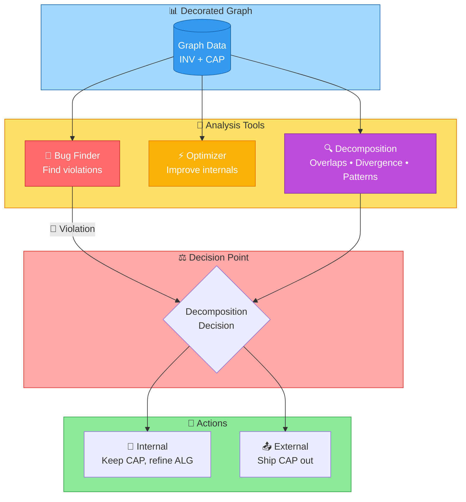
```mermaid
flowchart TD
    subgraph Input["📊 Decorated Graph"]
        G[(Graph Data<br/>INV + CAP)]
    end

    subgraph Tools["🔧 Analysis Tools"]
        BF[🐛 Bug Finder<br/>Find violations]
        CO[⚡ Optimizer<br/>Improve internals]
        DA[🔍 Decomposition<br/>Overlaps • Divergence • Patterns]
    end

    subgraph Decision["⚖️ Decision Point"]
        DD{Decomposition<br/>Decision}
    end

    subgraph Actions["🎯 Actions"]
        ID[🔧 Internal<br/>Keep CAP, refine ALG]
        ED[📤 External<br/>Ship CAP out]
    end

    G --> BF & CO & DA
    BF -->|🚨 Violation| DD
    DA --> DD
    DD --> ID & ED

    style Input fill:#a5d8ff,stroke:#1864ab
    style Tools fill:#ffe066,stroke:#e67700
    style Decision fill:#ffa8a8,stroke:#e03131
    style Actions fill:#8ce99a,stroke:#2f9e44
    style G fill:#339af0,stroke:#1864ab,color:#fff
    style BF fill:#ff6b6b,stroke:#c92a2a,color:#fff
    style DA fill:#be4bdb,stroke:#862e9c,color:#fff
    style CO fill:#fab005,stroke:#e67700,color:#fff
```

---

## Capability Tracking During Algorithm Updates

When algorithms change, capabilities must be re-evaluated:

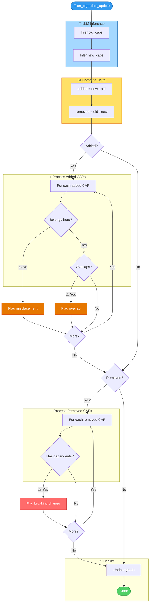
```mermaid
flowchart TD
    A([🔄 on_algorithm_update])

    subgraph Inference["🤖 LLM Inference"]
        B[Infer old_caps]
        C[Infer new_caps]
    end

    subgraph Delta["📊 Compute Delta"]
        D[added = new - old]
        E[removed = old - new]
    end

    subgraph AddedCheck["➕ Process Added CAPs"]
        G[For each added CAP]
        G1{Belongs here?}
        G2{Overlaps?}
    end

    subgraph RemovedCheck["➖ Process Removed CAPs"]
        J[For each removed CAP]
        J1{Has dependents?}
    end

    subgraph Finalize["✅ Finalize"]
        L[Update graph]
        M([Done])
    end

    A --> B --> C --> D --> E

    E --> F{Added?}
    F -->|Yes| G --> G1
    G1 -->|⚠️ No| WARN1[Flag misplacement]
    G1 -->|Yes| G2
    G2 -->|⚠️ Yes| WARN2[Flag overlap]
    G2 -->|No| H{More?}
    WARN1 & WARN2 --> H
    H -->|Yes| G
    H -->|No| I
    F -->|No| I

    I{Removed?}
    I -->|Yes| J --> J1
    J1 -->|⚠️ Yes| WARN3[Flag breaking change]
    J1 -->|No| K{More?}
    WARN3 --> K
    K -->|Yes| J
    K -->|No| L
    I -->|No| L
    L --> M

    style A fill:#339af0,stroke:#1864ab,color:#fff
    style M fill:#51cf66,stroke:#2f9e44,color:#fff
    style WARN1 fill:#e67700,stroke:#d9480f,color:#fff
    style WARN2 fill:#e67700,stroke:#d9480f,color:#fff
    style WARN3 fill:#ff6b6b,stroke:#c92a2a,color:#fff
    style Inference fill:#a5d8ff,stroke:#1864ab
    style Delta fill:#ffe066,stroke:#e67700
```

---

## Two Decomposition Drivers

| Driver | Trigger | Action |
|--------|---------|--------|
| Cognitive complexity | "Too complex to understand" | Split for clarity |
| Responsibility divergence | "Doing too many things" | Split by capability cluster |

Both are valid and often correlate. Complex components usually have too many responsibilities.

**You don't need to defer decomposition.** Track capabilities, and recompose when patterns emerge. Early decomposition with good capability tracking enables later recomposition.

---

---

# Part II: Operations Specification

The analysis sections above detect **when** decomposition is needed. This part specifies **how** to execute the actual operations that create, modify, and restructure components and algorithms.

---

## Section 5: Operation Fundamentals

### 5.1 Operation Invariants

Every operation MUST preserve these invariants:

| ID | Invariant |
|----|-----------|
| INV-OP-01 | Every COM-XX has exactly one SUR-XX (1:1 relationship) |
| INV-OP-02 | Every node has a valid owner reference |
| INV-OP-03 | No orphaned edges after operation completion |
| INV-OP-04 | CAP distribution is tracked before and after every operation |
| INV-OP-05 | ALG guarantees must be re-validated against CON after any ALG operation |
| INV-OP-06 | Operations are atomic—either fully complete or fully rolled back |

### 5.2 Operation Classification

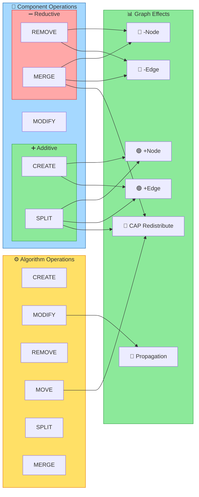
```mermaid
flowchart LR
    subgraph COM["🧩 Component Operations"]
        direction TB
        subgraph ComAdd["➕ Additive"]
            C1[CREATE]
            C3[SPLIT]
        end
        subgraph ComRem["➖ Reductive"]
            C2[REMOVE]
            C4[MERGE]
        end
        C5[MODIFY]
    end

    subgraph ALG["⚙️ Algorithm Operations"]
        direction TB
        A1[CREATE]
        A2[MODIFY]
        A3[REMOVE]
        A4[MOVE]
        A5[SPLIT]
        A6[MERGE]
    end

    subgraph Effects["📊 Graph Effects"]
        direction TB
        E1[🟢 +Node]
        E2[🔴 -Node]
        E3[🟢 +Edge]
        E4[🔴 -Edge]
        E5[🔄 CAP Redistribute]
        E6[📡 Propagation]
    end

    C1 & C3 --> E1 & E3
    C2 & C4 --> E2 & E4
    C3 & C4 --> E5
    A4 --> E5
    A2 --> E6

    style COM fill:#a5d8ff,stroke:#1864ab
    style ALG fill:#ffe066,stroke:#e67700
    style Effects fill:#8ce99a,stroke:#2f9e44
    style ComAdd fill:#8ce99a,stroke:#2f9e44
    style ComRem fill:#ffa8a8,stroke:#e03131
```

### 5.3 Operation State Model

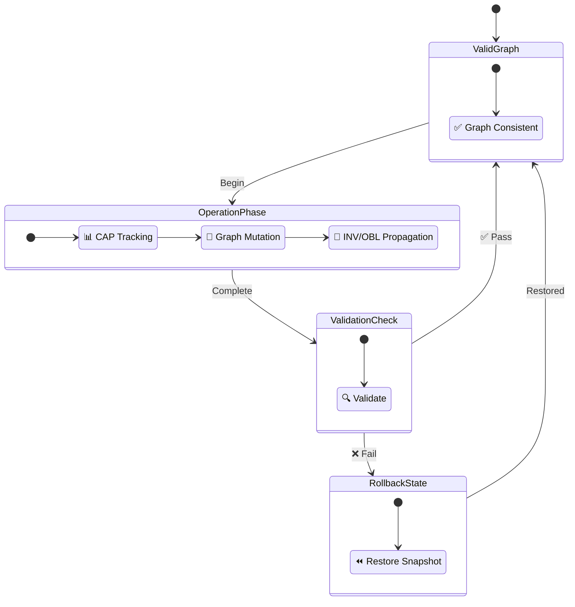
```mermaid
stateDiagram-v2
    direction TB

    [*] --> ValidGraph

    state ValidGraph {
        [*] --> Ready
        Ready: ✅ Graph Consistent
    }

    state OperationPhase {
        direction LR
        [*] --> Tracking
        Tracking: 📊 CAP Tracking
        Tracking --> Mutation
        Mutation: 🔧 Graph Mutation
        Mutation --> Propagation
        Propagation: 📡 INV/OBL Propagation
    }

    state ValidationCheck {
        [*] --> Checking
        Checking: 🔍 Validate
    }

    state RollbackState {
        [*] --> Restoring
        Restoring: ⏪ Restore Snapshot
    }

    ValidGraph --> OperationPhase: Begin
    OperationPhase --> ValidationCheck: Complete
    ValidationCheck --> ValidGraph: ✅ Pass
    ValidationCheck --> RollbackState: ❌ Fail
    RollbackState --> ValidGraph: Restored
```

### 5.4 Capability Tracking Protocol

Before and after every operation:

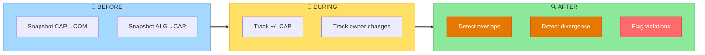
```mermaid
flowchart LR
    subgraph BEFORE["📸 BEFORE"]
        direction TB
        B1[Snapshot CAP→COM]
        B2[Snapshot ALG→CAP]
    end

    subgraph DURING["🔧 DURING"]
        direction TB
        D1[Track +/- CAP]
        D2[Track owner changes]
    end

    subgraph AFTER["🔍 AFTER"]
        direction TB
        A1[Detect overlaps]
        A2[Detect divergence]
        A3[Flag violations]
    end

    BEFORE ==> DURING ==> AFTER

    style BEFORE fill:#a5d8ff,stroke:#1864ab
    style DURING fill:#ffe066,stroke:#e67700
    style AFTER fill:#8ce99a,stroke:#2f9e44
    style A1 fill:#e67700,stroke:#d9480f,color:#fff
    style A2 fill:#e67700,stroke:#d9480f,color:#fff
    style A3 fill:#ff6b6b,stroke:#c92a2a,color:#fff
```

### 5.5 Node Type Relationships

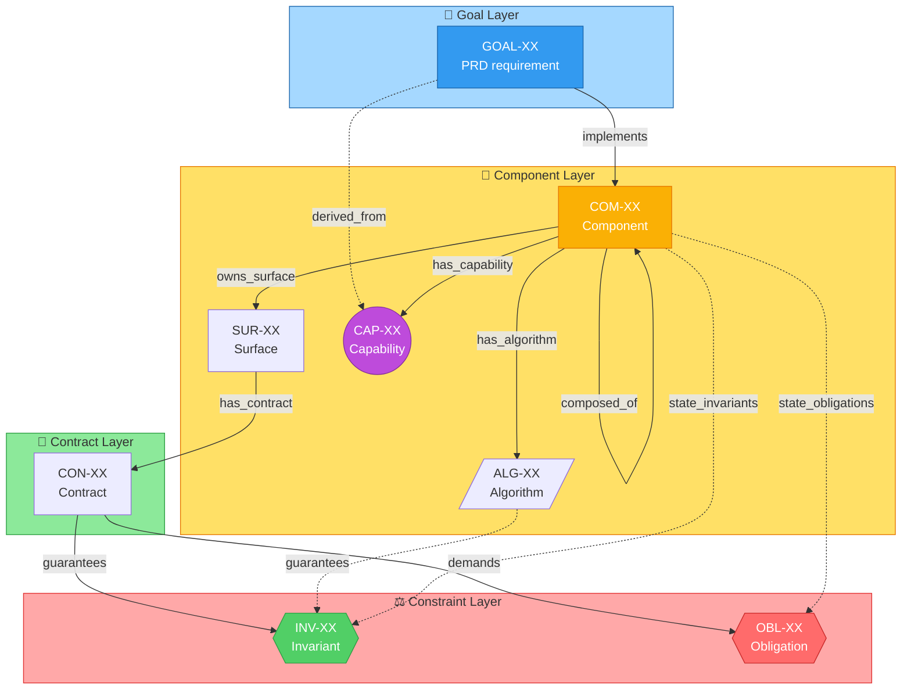
```mermaid
graph TB
    subgraph GOAL_LAYER["🎯 Goal Layer"]
        GOAL[GOAL-XX<br/>PRD requirement]
    end

    subgraph COMPONENT_LAYER["🧩 Component Layer"]
        COM[COM-XX<br/>Component]
        SUR[SUR-XX<br/>Surface]
        CAP((CAP-XX<br/>Capability))
        ALG[/ALG-XX<br/>Algorithm/]
    end

    subgraph CONTRACT_LAYER["📜 Contract Layer"]
        CON[CON-XX<br/>Contract]
    end

    subgraph CONSTRAINT_LAYER["⚖️ Constraint Layer"]
        INV{{INV-XX<br/>Invariant}}
        OBL{{OBL-XX<br/>Obligation}}
    end

    GOAL -->|implements| COM
    GOAL -.->|derived_from| CAP

    COM -->|owns_surface| SUR
    COM -->|has_capability| CAP
    COM -->|has_algorithm| ALG
    COM -->|composed_of| COM

    SUR -->|has_contract| CON

    CON -->|guarantees| INV
    CON -->|demands| OBL

    ALG -.->|guarantees| INV

    COM -.->|state_invariants| INV
    COM -.->|state_obligations| OBL

    style GOAL_LAYER fill:#a5d8ff,stroke:#1864ab
    style COMPONENT_LAYER fill:#ffe066,stroke:#e67700
    style CONTRACT_LAYER fill:#8ce99a,stroke:#2f9e44
    style CONSTRAINT_LAYER fill:#ffa8a8,stroke:#e03131
    style GOAL fill:#339af0,stroke:#1864ab,color:#fff
    style COM fill:#fab005,stroke:#e67700,color:#fff
    style CAP fill:#be4bdb,stroke:#862e9c,color:#fff
    style INV fill:#51cf66,stroke:#2f9e44,color:#fff
    style OBL fill:#ff6b6b,stroke:#c92a2a,color:#fff
```

---

## Section 6: Component Operations (COM-XX)

### 6.1 CREATE Component

**Preconditions:**
- Valid parent COM (if not root)
- Unique COM-XX ID

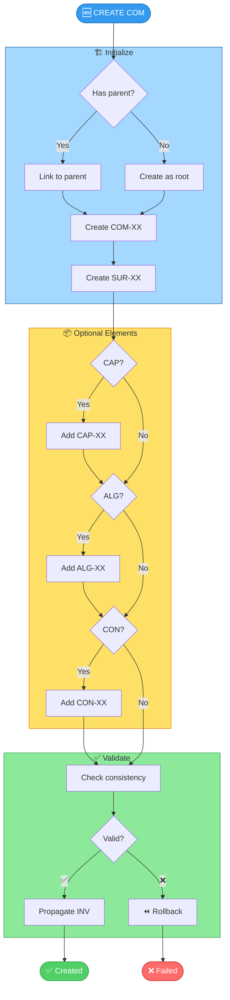
```mermaid
flowchart TD
    A([🆕 CREATE COM])

    subgraph Init["🏗️ Initialize"]
        B{Has parent?}
        C[Link to parent]
        D[Create as root]
        E[Create COM-XX]
        F[Create SUR-XX]
    end

    subgraph Optional["📦 Optional Elements"]
        H{CAP?}
        I[Add CAP-XX]
        J{ALG?}
        K[Add ALG-XX]
        L{CON?}
        M[Add CON-XX]
    end

    subgraph Validate["✅ Validate"]
        N[Check consistency]
        O{Valid?}
        P[Propagate INV]
        Q[⏪ Rollback]
    end

    A --> B
    B -->|Yes| C --> E
    B -->|No| D --> E
    E --> F --> H
    H -->|Yes| I --> J
    H -->|No| J
    J -->|Yes| K --> L
    J -->|No| L
    L -->|Yes| M --> N
    L -->|No| N
    N --> O
    O -->|✅| P --> R([✅ Created])
    O -->|❌| Q --> S([❌ Failed])

    style A fill:#339af0,stroke:#1864ab,color:#fff
    style R fill:#51cf66,stroke:#2f9e44,color:#fff
    style S fill:#ff6b6b,stroke:#c92a2a,color:#fff
    style Init fill:#a5d8ff,stroke:#1864ab
    style Optional fill:#ffe066,stroke:#e67700
    style Validate fill:#8ce99a,stroke:#2f9e44
```

### 6.2 MODIFY Component

**Preconditions:**
- COM-XX exists
- No in-flight operations on this component

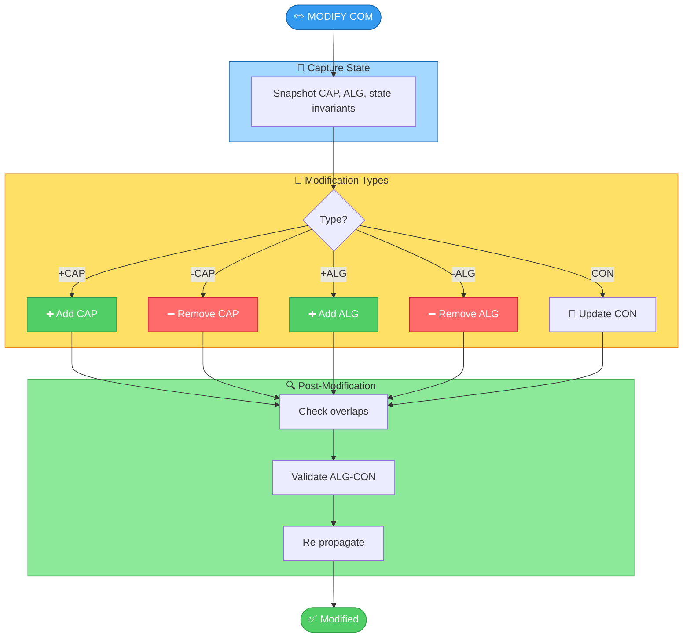
```mermaid
flowchart TD
    A([✏️ MODIFY COM])

    subgraph Snapshot["📸 Capture State"]
        B[Snapshot CAP, ALG, state invariants]
    end

    subgraph Operations["🔧 Modification Types"]
        C{Type?}
        D[➕ Add CAP]
        E[➖ Remove CAP]
        F[➕ Add ALG]
        G[➖ Remove ALG]
        H[📜 Update CON]
    end

    subgraph PostCheck["🔍 Post-Modification"]
        I[Check overlaps]
        J[Validate ALG-CON]
        K[Re-propagate]
    end

    A --> B --> C
    C -->|+CAP| D --> I
    C -->|-CAP| E --> I
    C -->|+ALG| F --> I
    C -->|-ALG| G --> I
    C -->|CON| H --> I
    I --> J --> K --> L([✅ Modified])

    style A fill:#339af0,stroke:#1864ab,color:#fff
    style L fill:#51cf66,stroke:#2f9e44,color:#fff
    style Snapshot fill:#a5d8ff,stroke:#1864ab
    style Operations fill:#ffe066,stroke:#e67700
    style PostCheck fill:#8ce99a,stroke:#2f9e44
    style D fill:#51cf66,stroke:#2f9e44,color:#fff
    style E fill:#ff6b6b,stroke:#c92a2a,color:#fff
    style F fill:#51cf66,stroke:#2f9e44,color:#fff
    style G fill:#ff6b6b,stroke:#c92a2a,color:#fff
```

**Branch details:**
| Operation | Action | Side Effect |
|-----------|--------|-------------|
| +CAP | Add edge | Check overlaps |
| -CAP | Remove edge/node | Check if shared |
| +ALG | Add edge | Infer CAP |
| -ALG | Remove edge | Flag if sole CAP provider |
| CON | Update guarantees | Re-validate |

### 6.3 REMOVE Component

**Preconditions:**
- All CAP redistributed or confirmed deletable
- No incoming edges from active COMs

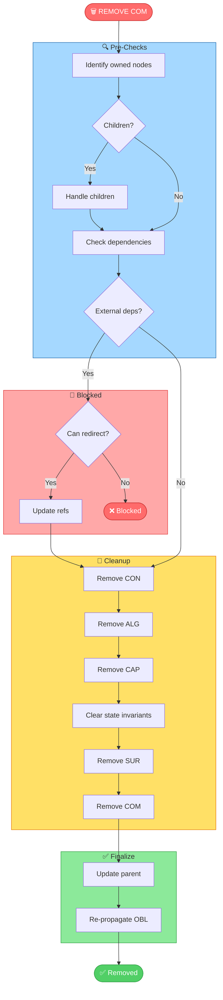
```mermaid
flowchart TD
    A([🗑️ REMOVE COM])

    subgraph Check["🔍 Pre-Checks"]
        B[Identify owned nodes]
        C{Children?}
        D[Handle children]
        E[Check dependencies]
        F{External deps?}
    end

    subgraph Block["🚫 Blocked"]
        G{Can redirect?}
        G2[Update refs]
        G3([❌ Blocked])
    end

    subgraph Cleanup["🧹 Cleanup"]
        H[Remove CON]
        I[Remove ALG]
        J[Remove CAP]
        K[Clear state invariants]
        L[Remove SUR]
        M[Remove COM]
    end

    subgraph Finalize["✅ Finalize"]
        N[Update parent]
        O[Re-propagate OBL]
    end

    A --> B --> C
    C -->|Yes| D --> E
    C -->|No| E
    E --> F
    F -->|Yes| G
    G -->|No| G3
    G -->|Yes| G2 --> H
    F -->|No| H
    H --> I --> J --> K --> L --> M --> N --> O --> P([✅ Removed])

    style A fill:#ff6b6b,stroke:#c92a2a,color:#fff
    style P fill:#51cf66,stroke:#2f9e44,color:#fff
    style G3 fill:#ff6b6b,stroke:#c92a2a,color:#fff
    style Check fill:#a5d8ff,stroke:#1864ab
    style Block fill:#ffa8a8,stroke:#e03131
    style Cleanup fill:#ffe066,stroke:#e67700
    style Finalize fill:#8ce99a,stroke:#2f9e44
```

### 6.4 SPLIT Component

**Preconditions:**
- Multiple CAP clusters detected
- At least 2 distinct clusters

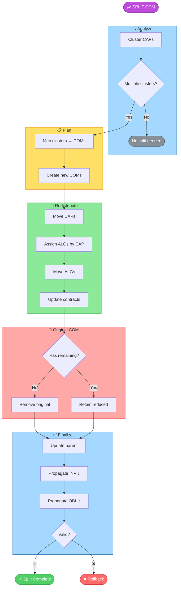
```mermaid
flowchart TD
    A([✂️ SPLIT COM])

    subgraph Analysis["🔍 Analyze"]
        B[Cluster CAPs]
        C{Multiple clusters?}
        D([No split needed])
    end

    subgraph Planning["📋 Plan"]
        E[Map clusters → COMs]
        F[Create new COMs]
    end

    subgraph Redistribution["🔄 Redistribute"]
        G[Move CAPs]
        H[Assign ALGs by CAP]
        I[Move ALGs]
        J[Update contracts]
    end

    subgraph Cleanup["🧹 Original COM"]
        K{Has remaining?}
        L[Remove original]
        M[Retain reduced]
    end

    subgraph Validate["✅ Finalize"]
        N[Update parent]
        O[Propagate INV ↓]
        P[Propagate OBL ↑]
        Q{Valid?}
    end

    A --> B --> C
    C -->|No| D
    C -->|Yes| E --> F --> G --> H --> I --> J --> K
    K -->|No| L --> N
    K -->|Yes| M --> N
    N --> O --> P --> Q
    Q -->|✅| S([✅ Split Complete])
    Q -->|❌| T([❌ Rollback])

    style A fill:#be4bdb,stroke:#862e9c,color:#fff
    style S fill:#51cf66,stroke:#2f9e44,color:#fff
    style T fill:#ff6b6b,stroke:#c92a2a,color:#fff
    style D fill:#868e96,stroke:#495057,color:#fff
    style Analysis fill:#a5d8ff,stroke:#1864ab
    style Planning fill:#ffe066,stroke:#e67700
    style Redistribution fill:#8ce99a,stroke:#2f9e44
    style Cleanup fill:#ffa8a8,stroke:#e03131
    style Validate fill:#a5d8ff,stroke:#1864ab
```

### 6.5 MERGE Components

**Preconditions:**
- Overlapping CAP detected
- Both COMs exist

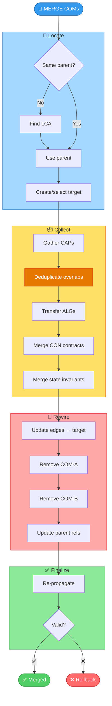
```mermaid
flowchart TD
    A([🔗 MERGE COMs])

    subgraph Locate["📍 Locate"]
        B{Same parent?}
        C[Find LCA]
        D[Use parent]
        E[Create/select target]
    end

    subgraph Collect["📦 Collect"]
        F[Gather CAPs]
        G[Deduplicate overlaps]
        H[Transfer ALGs]
        I[Merge CON contracts]
        J[Merge state invariants]
    end

    subgraph Rewire["🔌 Rewire"]
        K[Update edges → target]
        L[Remove COM-A]
        M[Remove COM-B]
        N[Update parent refs]
    end

    subgraph Validate["✅ Finalize"]
        O[Re-propagate]
        P{Valid?}
    end

    A --> B
    B -->|No| C --> D
    B -->|Yes| D
    D --> E --> F --> G --> H --> I --> J --> K --> L --> M --> N --> O --> P
    P -->|✅| R([✅ Merged])
    P -->|❌| S([❌ Rollback])

    style A fill:#339af0,stroke:#1864ab,color:#fff
    style R fill:#51cf66,stroke:#2f9e44,color:#fff
    style S fill:#ff6b6b,stroke:#c92a2a,color:#fff
    style G fill:#e67700,stroke:#d9480f,color:#fff
    style Locate fill:#a5d8ff,stroke:#1864ab
    style Collect fill:#ffe066,stroke:#e67700
    style Rewire fill:#ffa8a8,stroke:#e03131
    style Validate fill:#8ce99a,stroke:#2f9e44
```

---

## Section 7: Algorithm Operations (ALG-XX)

### 7.1 CREATE Algorithm

**Preconditions:**
- Owner COM-XX exists

```mermaid
flowchart TD
    A([🆕 CREATE ALG])

    subgraph Setup["🏗️ Setup"]
        B[Identify owner COM]
        C[Create ALG node]
        D[Add has_algorithm edge]
    end

    subgraph Inference["🤖 LLM Inference"]
        E[Infer CAPs from content]
        F{New CAP?}
        G[Create CAP nodes]
        H[Link to existing CAP]
    end

    subgraph Validate["✅ Validate"]
        I[Check ALG vs CON]
        J{Aligned?}
        K[⚠️ Flag violation]
        L[Validate graph]
    end

    A --> B --> C --> D --> E --> F
    F -->|Yes| G --> H
    F -->|No| H
    H --> I --> J
    J -->|No| K --> L
    J -->|Yes| L
    L --> M([✅ Created])

    style A fill:#339af0,stroke:#1864ab,color:#fff
    style M fill:#51cf66,stroke:#2f9e44,color:#fff
    style K fill:#e67700,stroke:#d9480f,color:#fff
    style Setup fill:#a5d8ff,stroke:#1864ab
    style Inference fill:#ffe066,stroke:#e67700
    style Validate fill:#8ce99a,stroke:#2f9e44
```

### 7.2 MODIFY Algorithm

**Preconditions:**
- ALG-XX exists

```mermaid
flowchart TD
    A([✏️ MODIFY ALG])

    subgraph Capture["📸 Capture"]
        B[Snapshot old code]
        C[Apply changes]
    end

    subgraph Inference["🤖 LLM Analysis"]
        D[Infer old CAPs]
        E[Infer new CAPs]
        F[Compute delta]
    end

    subgraph ProcessAdded["➕ Added CAPs"]
        G{Any added?}
        H{Belongs here?}
        H3[⚠️ Consider MOVE]
        H4[Add edge]
    end

    subgraph ProcessRemoved["➖ Removed CAPs"]
        I{Any removed?}
        J{Has dependents?}
        J3[🚨 Breaking change]
        J4[Remove edge]
    end

    subgraph Finalize["✅ Finalize"]
        K[Update guarantees]
        L[Check ALG-CON]
        M{Violations?}
        N[⚠️ Unbacked CON]
        O[Validate]
    end

    A --> B --> C --> D --> E --> F --> G
    G -->|Yes| H
    H -->|No| H3 --> I
    H -->|Yes| H4 --> I
    G -->|No| I
    I -->|Yes| J
    J -->|Yes| J3 --> K
    J -->|No| J4 --> K
    I -->|No| K
    K --> L --> M
    M -->|Yes| N --> O
    M -->|No| O
    O --> P([✅ Modified])

    style A fill:#339af0,stroke:#1864ab,color:#fff
    style P fill:#51cf66,stroke:#2f9e44,color:#fff
    style H3 fill:#e67700,stroke:#d9480f,color:#fff
    style J3 fill:#ff6b6b,stroke:#c92a2a,color:#fff
    style N fill:#e67700,stroke:#d9480f,color:#fff
    style Capture fill:#a5d8ff,stroke:#1864ab
    style Inference fill:#ffe066,stroke:#e67700
    style ProcessAdded fill:#8ce99a,stroke:#2f9e44
    style ProcessRemoved fill:#ffa8a8,stroke:#e03131
```

### 7.3 REMOVE Algorithm

**Preconditions:**
- ALG-XX exists
- Not sole provider of required CAP (or CAP deletion approved)

```mermaid
flowchart TD
    A([🗑️ REMOVE ALG])

    subgraph Check["🔍 Check Coverage"]
        B[Find owner COM]
        C[Get ALG's CAPs]
        D{All CAPs covered<br/>by other ALGs?}
    end

    subgraph Block["🚫 Potential Block"]
        F[⚠️ CAP will be lost]
        F2{Proceed?}
        F3([❌ Blocked])
        G[Remove orphaned CAPs]
    end

    subgraph Remove["🧹 Remove"]
        E[Safe path]
        H[Remove has_algorithm edge]
        I[Remove ALG node]
    end

    subgraph Validate["✅ Validate"]
        J[Check CON still backed]
        K{CON valid?}
        L[⚠️ Unbacked CON]
        M[Validate graph]
    end

    A --> B --> C --> D
    D -->|All covered| E --> H
    D -->|Some not| F --> F2
    F2 -->|No| F3
    F2 -->|Yes| G --> H
    H --> I --> J --> K
    K -->|No| L --> M
    K -->|Yes| M
    M --> N([✅ Removed])

    style A fill:#ff6b6b,stroke:#c92a2a,color:#fff
    style N fill:#51cf66,stroke:#2f9e44,color:#fff
    style F3 fill:#ff6b6b,stroke:#c92a2a,color:#fff
    style F fill:#e67700,stroke:#d9480f,color:#fff
    style L fill:#e67700,stroke:#d9480f,color:#fff
    style Check fill:#a5d8ff,stroke:#1864ab
    style Block fill:#ffa8a8,stroke:#e03131
    style Remove fill:#ffe066,stroke:#e67700
    style Validate fill:#8ce99a,stroke:#2f9e44
```

### 7.4 MOVE Algorithm

**Preconditions:**
- Source COM-XX exists
- Target COM-XX exists
- ALG-XX exists in source

```mermaid
flowchart TD
    A([📦 MOVE ALG<br/>A → B])

    subgraph Relocate["🔄 Relocate"]
        B[Get ALG's CAPs]
        C[Remove edge A→ALG]
        D[Add edge B→ALG]
        E[Update owner]
    end

    subgraph CAPs["⚡ Handle CAPs"]
        F{CAP only used by<br/>this ALG in A?}
        G[Move CAP → B]
        H[CAP stays in A]
        I[Update CAP owner]
        J{CAP in both?}
        J2[⚠️ Overlap created]
    end

    subgraph Contracts["📜 Contracts"]
        K[Check B's CON]
        L{Update needed?}
        M[Add guarantees to B]
        N[Check A's CON]
        O{A broken?}
        P[⚠️ A unbacked]
    end

    subgraph Finalize["✅ Finalize"]
        Q[Re-propagate OBL]
        R[Validate]
    end

    A --> B --> C --> D --> E --> F
    F -->|Yes| G --> I --> K
    F -->|No| H --> J
    J -->|Yes| J2 --> K
    J -->|No| K
    K --> L
    L -->|Yes| M --> N
    L -->|No| N
    N --> O
    O -->|Yes| P --> Q
    O -->|No| Q
    Q --> R --> S([✅ Moved])

    style A fill:#339af0,stroke:#1864ab,color:#fff
    style S fill:#51cf66,stroke:#2f9e44,color:#fff
    style J2 fill:#e67700,stroke:#d9480f,color:#fff
    style P fill:#e67700,stroke:#d9480f,color:#fff
    style Relocate fill:#a5d8ff,stroke:#1864ab
    style CAPs fill:#ffe066,stroke:#e67700
    style Contracts fill:#8ce99a,stroke:#2f9e44
```

### 7.5 SPLIT Algorithm

**Preconditions:**
- ALG-XX exists
- Multiple separable concerns detected in ALG logic

```mermaid
flowchart TD
    A([✂️ SPLIT ALG])

    subgraph Analyze["🔍 Analyze"]
        B[Find separable concerns]
        C{Multiple?}
        D([No split needed])
        E[Identify clusters]
    end

    subgraph Create["🏗️ Create New ALGs"]
        F[Create ALG per cluster]
        G[Distribute logic]
        H[LLM infers CAPs]
        I[Redistribute CAPs]
    end

    subgraph Finalize["✅ Finalize"]
        J[Update edges]
        K[Remove original]
        L[Check vs CON]
        M{Aligned?}
        N[⚠️ CON update needed]
        O[Validate]
    end

    A --> B --> C
    C -->|No| D
    C -->|Yes| E --> F --> G --> H --> I --> J --> K --> L --> M
    M -->|No| N --> O
    M -->|Yes| O
    O --> P([✅ Split Complete])

    style A fill:#be4bdb,stroke:#862e9c,color:#fff
    style P fill:#51cf66,stroke:#2f9e44,color:#fff
    style D fill:#868e96,stroke:#495057,color:#fff
    style N fill:#e67700,stroke:#d9480f,color:#fff
    style Analyze fill:#a5d8ff,stroke:#1864ab
    style Create fill:#ffe066,stroke:#e67700
    style Finalize fill:#8ce99a,stroke:#2f9e44
```

### 7.6 MERGE Algorithms

**Preconditions:**
- Both ALGs exist
- Both in same COM-XX (or MOVE first)

```mermaid
flowchart TD
    A([🔗 MERGE ALGs])

    subgraph Check["🔍 Prerequisites"]
        B{Same owner?}
        C([❌ MOVE first])
    end

    subgraph Combine["🔧 Combine"]
        D[Merge logic]
        E[Union guarantees]
        F[Union CAPs]
    end

    subgraph Create["🏗️ Create Merged"]
        G[Create/modify ALG-M]
        H[Add edges to merged]
        I[Remove ALG-B]
        J[Consolidate CAP edges]
    end

    subgraph Validate["✅ Validate"]
        K[Check vs CON]
        L{Aligned?}
        M[⚠️ Over/under-promise]
        N[Validate graph]
    end

    A --> B
    B -->|No| C
    B -->|Yes| D --> E --> F --> G --> H --> I --> J --> K --> L
    L -->|No| M --> N
    L -->|Yes| N
    N --> O([✅ Merged])

    style A fill:#339af0,stroke:#1864ab,color:#fff
    style O fill:#51cf66,stroke:#2f9e44,color:#fff
    style C fill:#ff6b6b,stroke:#c92a2a,color:#fff
    style M fill:#e67700,stroke:#d9480f,color:#fff
    style Check fill:#a5d8ff,stroke:#1864ab
    style Combine fill:#ffe066,stroke:#e67700
    style Create fill:#8ce99a,stroke:#2f9e44
    style Validate fill:#a5d8ff,stroke:#1864ab
```

---

## Section 8: Cross-Cutting Concerns

### 8.1 Post-Operation Propagation Protocol

After any graph-modifying operation, re-propagation ensures consistency:

```mermaid
flowchart TD
    A([📡 Post-Op Propagation])

    subgraph OpType["🔧 Operation Type"]
        B{Type?}
        C[CREATE: INV ↓]
        D[REMOVE: Re-prop]
        E[SPLIT: INV → children]
        F[MERGE: Through surface]
        G[ALG: Check alignment]
    end

    subgraph Validate["🔍 Validate"]
        H[Check OBL leaks]
        I{OBL at root?}
        J[🚨 Obligation violation]
        K[Check CAP dist]
    end

    subgraph Detect["⚠️ Detect Issues"]
        L{Overlap?}
        M[→ Merge/Extract]
        N{Divergence?}
        P[→ Split]
        O[Log recommendations]
    end

    A --> B
    B -->|CREATE| C --> H
    B -->|REMOVE| D --> H
    B -->|SPLIT| E --> H
    B -->|MERGE| F --> H
    B -->|ALG| G --> H
    H --> I
    I -->|Yes| J --> K
    I -->|No| K
    K --> L
    L -->|Yes| M --> O
    L -->|No| N
    N -->|Yes| P --> O
    N -->|No| Q
    O --> Q([✅ Complete])

    style A fill:#339af0,stroke:#1864ab,color:#fff
    style Q fill:#51cf66,stroke:#2f9e44,color:#fff
    style J fill:#ff6b6b,stroke:#c92a2a,color:#fff
    style M fill:#e67700,stroke:#d9480f,color:#fff
    style P fill:#e67700,stroke:#d9480f,color:#fff
    style OpType fill:#a5d8ff,stroke:#1864ab
    style Validate fill:#ffe066,stroke:#e67700
    style Detect fill:#ffa8a8,stroke:#e03131
```

### 8.2 Validation Protocol

```mermaid
flowchart TD
    A([🔍 Validate Graph])

    subgraph Ownership["📋 Ownership Checks"]
        B{COM:SUR 1:1?}
        C{SUR owned?}
        D{CAP owned?}
        E{ALG owned?}
    end

    subgraph Refs["🔗 Reference Checks"]
        F{CON valid?}
        G{Edges valid?}
    end

    subgraph Alignment["⚖️ Alignment"]
        H{ALG-CON?}
        WARN[⚠️ Warning]
    end

    A --> B
    B -->|❌| FAIL
    B -->|✅| C
    C -->|❌| FAIL
    C -->|✅| D
    D -->|❌| FAIL
    D -->|✅| E
    E -->|❌| FAIL
    E -->|✅| F
    F -->|❌| FAIL
    F -->|✅| G
    G -->|❌| FAIL
    G -->|✅| H
    H -->|❌| WARN --> PASS
    H -->|✅| PASS

    FAIL([❌ FAIL])
    PASS([✅ PASS])

    style A fill:#339af0,stroke:#1864ab,color:#fff
    style PASS fill:#51cf66,stroke:#2f9e44,color:#fff
    style FAIL fill:#ff6b6b,stroke:#c92a2a,color:#fff
    style WARN fill:#e67700,stroke:#d9480f,color:#fff
    style Ownership fill:#a5d8ff,stroke:#1864ab
    style Refs fill:#ffe066,stroke:#e67700
    style Alignment fill:#8ce99a,stroke:#2f9e44
```

**Validation checks:**
| Check | Pass | Fail |
|-------|------|------|
| COM:SUR 1:1 | ✅ | ❌ Invariant violated |
| SUR ownership | ✅ | ❌ Orphaned SUR |
| CAP ownership | ✅ | ❌ Orphaned CAP |
| ALG ownership | ✅ | ❌ Orphaned ALG |
| CON-SUR ref | ✅ | ❌ Orphaned CON |
| Edge refs | ✅ | ❌ Dangling edges |
| ALG-CON align | ✅ | ⚠️ Mismatch (warning) |

### 8.3 Rollback Procedures

When validation fails, rollback restores the previous valid state:

1. **Snapshot before operation**: Capture all affected nodes and edges
2. **On failure**: Restore nodes and edges from snapshot
3. **Re-validate**: Ensure restored state is valid
4. **Report**: Log what failed and why

---

## Summary

Decomposition uses **capabilities** (CAP-XX) to:

1. Detect where responsibilities overlap (merge candidates)
2. Detect where responsibilities diverge (split candidates)
3. Find patterns suggesting new components
4. Guide recomposition of the entire system

**Operations** (Part II) enable executing these changes:

| Level | Operations |
|-------|------------|
| Component (COM-XX) | CREATE, MODIFY, REMOVE, SPLIT, MERGE |
| Algorithm (ALG-XX) | CREATE, MODIFY, REMOVE, MOVE, SPLIT, MERGE |

All operations preserve **graph invariants** (INV-OP-01 through INV-OP-06) and trigger **re-propagation** to maintain consistency.

This is architecture enhancement—evolving structure based on responsibility analysis, not just correctness or performance.
