# Algorithm Enhancer

## Purpose

Detects optimization opportunities in distributed algorithms by analyzing the
decorated graph from the [Algorithm Graph Creator](../algorithm%20graph%20creator/feedback.md).
This system finds **optimization violations**—mismatches between how capabilities
are used and their optimal execution patterns.

This is the **optimization counterpart** to the [Bug Finder](../algorithm%20bug%20finder/feedback.md).
While bug finder detects correctness violations, the enhancer detects performance
anti-patterns.

| Tool | Question | Domain |
|------|----------|--------|
| Bug Finder | "Is this correct?" | Constraint satisfaction |
| **Enhancer** | "Can this be faster?" | Execution invariants vs. capability obligations |

---

## Input

The enhancer consumes a `DecoratedGraph` from the graph creator, which contains:

* Nodes with execution invariants (`execution_invariants`) and capabilities
* Capability profiles (batchable, cacheable, execution_obligations)
* Surfaces with invariant transformations (`receives_invariants`, `emits_invariants`)

---

## Optimization Violation Types

### Type 1: Execution Invariant/Obligation Mismatch

A capability is invoked with invariants that don't satisfy its execution obligations.

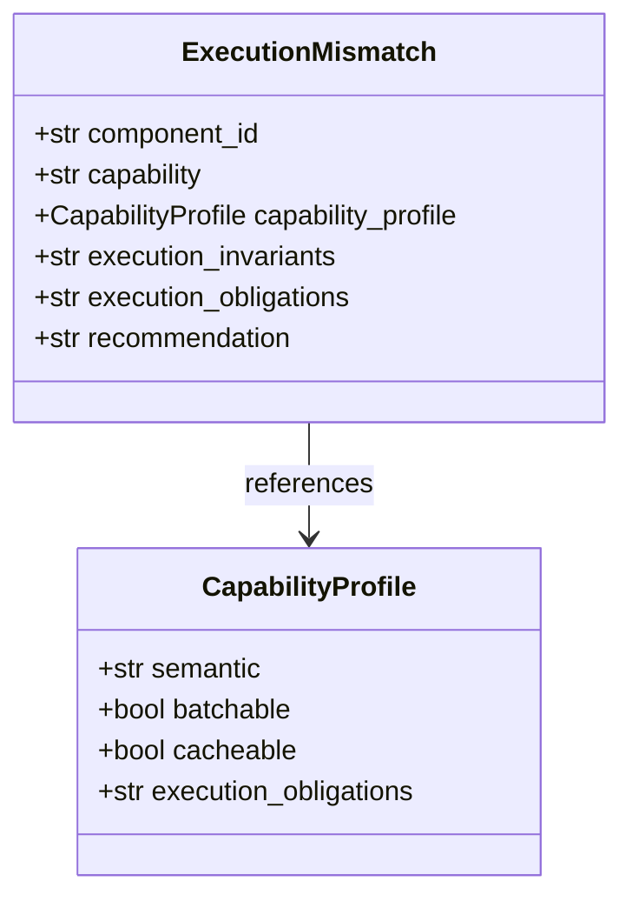
```mermaid
classDiagram
    class ExecutionMismatch {
        +str component_id
        +str capability
        +CapabilityProfile capability_profile
        +str execution_invariants
        +str execution_obligations
        +str recommendation
    }

    class CapabilityProfile {
        +str semantic
        +bool batchable
        +bool cacheable
        +str execution_obligations
    }

    ExecutionMismatch --> CapabilityProfile : references
```

**Detection:**

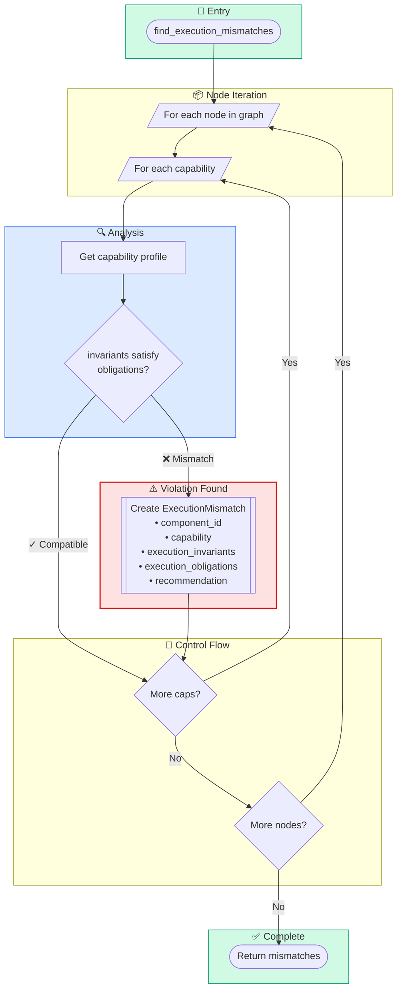
```mermaid
flowchart TB
    subgraph entrypoint["🚀 Entry"]
        start([find_execution_mismatches])
    end

    subgraph nodeLoop["📦 Node Iteration"]
        iterate[/"For each node in graph"/]
        getcap[/"For each capability"/]
    end

    subgraph analysis["🔍 Analysis"]
        getprofile["Get capability profile"]
        check{"invariants satisfy\nobligations?"}
    end

    subgraph violation["⚠️ Violation Found"]
        add[["Create ExecutionMismatch\n• component_id\n• capability\n• execution_invariants\n• execution_obligations\n• recommendation"]]
    end

    subgraph control["🔄 Control Flow"]
        nextcap{More caps?}
        nextnode{More nodes?}
    end

    subgraph exitpoint["✅ Complete"]
        return([Return mismatches])
    end

    start --> iterate
    iterate --> getcap
    getcap --> getprofile
    getprofile --> check
    check -->|"❌ Mismatch"| add
    check -->|"✓ Compatible"| nextcap
    add --> nextcap
    nextcap -->|Yes| getcap
    nextcap -->|No| nextnode
    nextnode -->|Yes| iterate
    nextnode -->|No| return

    style violation fill:#fee2e2,stroke:#dc2626,stroke-width:2px
    style analysis fill:#dbeafe,stroke:#2563eb
    style entrypoint fill:#d1fae5,stroke:#059669
    style exitpoint fill:#d1fae5,stroke:#059669
```

**Example:**

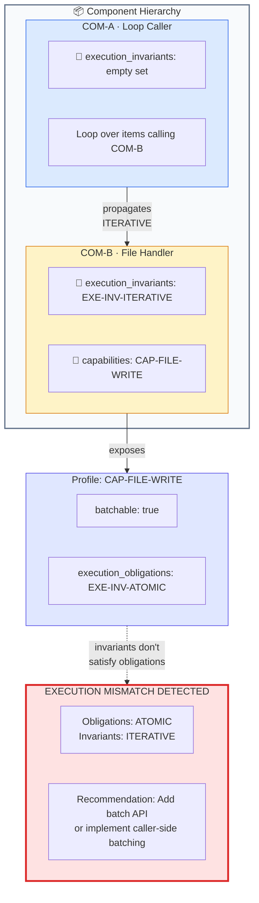
```mermaid
flowchart TB
    subgraph components["📦 Component Hierarchy"]
        direction TB
        subgraph caller["COM-A · Loop Caller"]
            ctx_a["📍 execution_invariants: empty set"]
            loop["Loop over items calling COM-B"]
        end

        subgraph callee["COM-B · File Handler"]
            ctx_b["📍 execution_invariants: EXE-INV-ITERATIVE"]
            cap["🔧 capabilities: CAP-FILE-WRITE"]
        end
    end

    subgraph profile["Profile: CAP-FILE-WRITE"]
        batch["batchable: true"]
        optimal["execution_obligations: EXE-INV-ATOMIC"]
    end

    subgraph mismatch["EXECUTION MISMATCH DETECTED"]
        issue["Obligations: ATOMIC\nInvariants: ITERATIVE"]
        rec["Recommendation: Add batch API\nor implement caller-side batching"]
    end

    caller -->|"propagates\nITERATIVE"| callee
    callee -->|"exposes"| profile
    profile -.->|"invariants don't\nsatisfy obligations"| mismatch

    style components fill:#f8fafc,stroke:#64748b,stroke-width:2px
    style caller fill:#dbeafe,stroke:#2563eb
    style callee fill:#fef3c7,stroke:#d97706
    style profile fill:#e0e7ff,stroke:#4f46e5
    style mismatch fill:#fee2e2,stroke:#dc2626,stroke-width:3px
```

---

### Type 2: Missing Execution Flattening

Iterative or parallel execution invariants reach a capability with atomic obligations, but no surface performs the transformation.

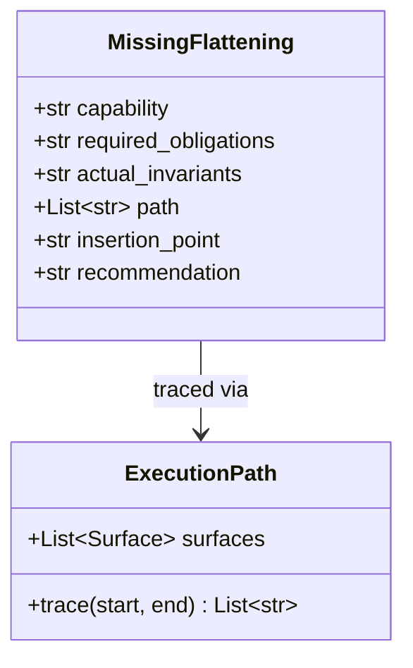
```mermaid
classDiagram
    class MissingFlattening {
        +str capability
        +str required_obligations
        +str actual_invariants
        +List~str~ path
        +str insertion_point
        +str recommendation
    }

    class ExecutionPath {
        +List~Surface~ surfaces
        +trace(start, end) List~str~
    }

    MissingFlattening --> ExecutionPath : traced via
```

**Detection:**

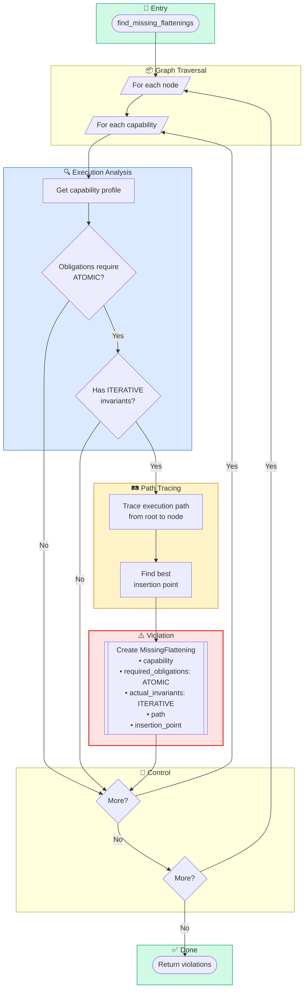
```mermaid
flowchart TB
    subgraph entry["🚀 Entry"]
        start([find_missing_flattenings])
    end

    subgraph iteration["📦 Graph Traversal"]
        iterate[/"For each node"/]
        getcap[/"For each capability"/]
    end

    subgraph checks["🔍 Execution Analysis"]
        getprofile["Get capability profile"]
        needsatomic{"Obligations require\nATOMIC?"}
        hasiterative{"Has ITERATIVE\ninvariants?"}
    end

    subgraph pathAnalysis["🛤️ Path Tracing"]
        trace["Trace execution path\nfrom root to node"]
        findpoint["Find best\ninsertion point"]
    end

    subgraph violation["⚠️ Violation"]
        add[["Create MissingFlattening\n• capability\n• required_obligations: ATOMIC\n• actual_invariants: ITERATIVE\n• path\n• insertion_point"]]
    end

    subgraph control["🔄 Control"]
        nextcap{More?}
        nextnode{More?}
    end

    subgraph exit["✅ Done"]
        return([Return violations])
    end

    start --> iterate --> getcap --> getprofile
    getprofile --> needsatomic
    needsatomic -->|"No"| nextcap
    needsatomic -->|"Yes"| hasiterative
    hasiterative -->|"No"| nextcap
    hasiterative -->|"Yes"| trace --> findpoint --> add --> nextcap
    nextcap -->|Yes| getcap
    nextcap -->|No| nextnode
    nextnode -->|Yes| iterate
    nextnode -->|No| return

    style checks fill:#dbeafe,stroke:#2563eb
    style pathAnalysis fill:#fef3c7,stroke:#d97706
    style violation fill:#fee2e2,stroke:#dc2626,stroke-width:2px
    style entry fill:#d1fae5,stroke:#059669
    style exit fill:#d1fae5,stroke:#059669
```

**Example:**

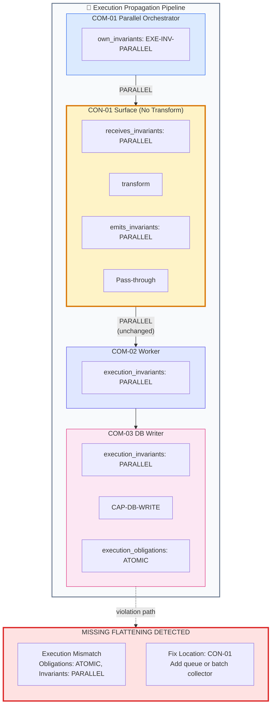
```mermaid
flowchart TB
    subgraph pipeline["🔀 Execution Propagation Pipeline"]
        direction TB

        subgraph orchestrator["COM-01 Parallel Orchestrator"]
            inv01["own_invariants: EXE-INV-PARALLEL"]
        end

        subgraph surface["CON-01 Surface (No Transform)"]
            direction LR
            receives["receives_invariants: PARALLEL"]
            arrow1["transform"]
            emits["emits_invariants: PARALLEL"]
            passthrough["Pass-through"]
        end

        subgraph worker["COM-02 Worker"]
            ctx02["execution_invariants: PARALLEL"]
        end

        subgraph dbwriter["COM-03 DB Writer"]
            ctx03["execution_invariants: PARALLEL"]
            cap03["CAP-DB-WRITE"]
            profile["execution_obligations: ATOMIC"]
        end
    end

    subgraph violation["MISSING FLATTENING DETECTED"]
        direction TB
        issue["Execution Mismatch\nObligations: ATOMIC, Invariants: PARALLEL"]
        insertion["Fix Location: CON-01\nAdd queue or batch collector"]
    end

    orchestrator -->|"PARALLEL"| surface
    surface -->|"PARALLEL\n(unchanged)"| worker
    worker --> dbwriter
    dbwriter -.->|"violation path"| violation

    style pipeline fill:#f8fafc,stroke:#64748b,stroke-width:2px
    style orchestrator fill:#dbeafe,stroke:#2563eb
    style surface fill:#fef3c7,stroke:#d97706,stroke-width:3px
    style worker fill:#e0e7ff,stroke:#4f46e5
    style dbwriter fill:#fce7f3,stroke:#db2777
    style violation fill:#fee2e2,stroke:#dc2626,stroke-width:3px
```

---

### Type 3: Batching Opportunity

A capability is batchable but is invoked in an iterative pattern without batching.

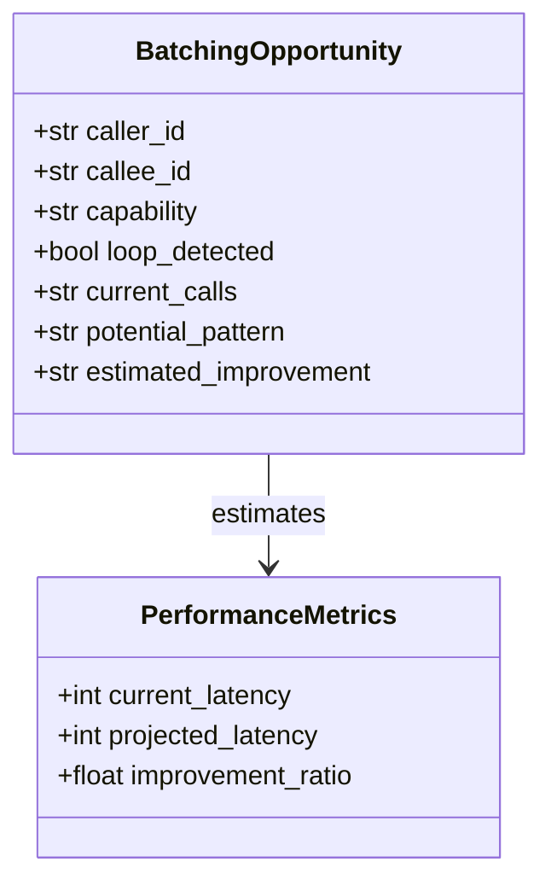
```mermaid
classDiagram
    class BatchingOpportunity {
        +str caller_id
        +str callee_id
        +str capability
        +bool loop_detected
        +str current_calls
        +str potential_pattern
        +str estimated_improvement
    }

    class PerformanceMetrics {
        +int current_latency
        +int projected_latency
        +float improvement_ratio
    }

    BatchingOpportunity --> PerformanceMetrics : estimates
```

**Detection:**

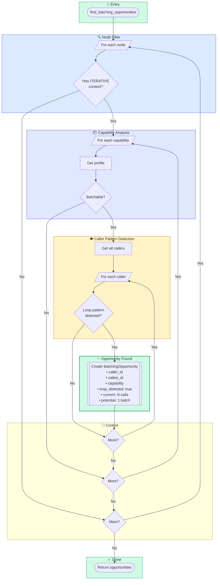
```mermaid
flowchart TB
    subgraph entry["🚀 Entry"]
        start([find_batching_opportunities])
    end

    subgraph nodeFilter["🔍 Node Filter"]
        iterate[/"For each node"/]
        checkctx{"Has ITERATIVE\ncontext?"}
    end

    subgraph capabilityCheck["📦 Capability Analysis"]
        getcap[/"For each capability"/]
        getprofile["Get profile"]
        batchable{"Batchable?"}
    end

    subgraph callerAnalysis["👁️ Caller Pattern Detection"]
        getcallers["Get all callers"]
        checkcaller[/"For each caller"/]
        hasloop{"Loop pattern\ndetected?"}
    end

    subgraph opportunity["✨ Opportunity Found"]
        add[["Create BatchingOpportunity\n• caller_id\n• callee_id\n• capability\n• loop_detected: true\n• current: N calls\n• potential: 1 batch"]]
    end

    subgraph control["🔄 Control"]
        nextcaller{More?}
        nextcap{More?}
        nextnode{More?}
    end

    subgraph exit["✅ Done"]
        return([Return opportunities])
    end

    start --> iterate --> checkctx
    checkctx -->|"No"| nextnode
    checkctx -->|"Yes"| getcap --> getprofile --> batchable
    batchable -->|"No"| nextcap
    batchable -->|"Yes"| getcallers --> checkcaller --> hasloop
    hasloop -->|"No"| nextcaller
    hasloop -->|"Yes"| add --> nextcaller
    nextcaller -->|Yes| checkcaller
    nextcaller -->|No| nextcap
    nextcap -->|Yes| getcap
    nextcap -->|No| nextnode
    nextnode -->|Yes| iterate
    nextnode -->|No| return

    style nodeFilter fill:#dbeafe,stroke:#2563eb
    style capabilityCheck fill:#e0e7ff,stroke:#4f46e5
    style callerAnalysis fill:#fef3c7,stroke:#d97706
    style opportunity fill:#d1fae5,stroke:#059669,stroke-width:2px
    style entry fill:#d1fae5,stroke:#059669
    style exit fill:#d1fae5,stroke:#059669
```

---

### Type 4: Cacheable Redundancy

A cacheable capability is invoked multiple times with the same inputs.

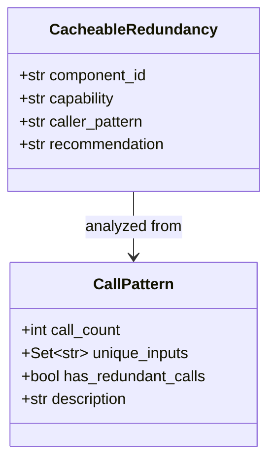
```mermaid
classDiagram
    class CacheableRedundancy {
        +str component_id
        +str capability
        +str caller_pattern
        +str recommendation
    }

    class CallPattern {
        +int call_count
        +Set~str~ unique_inputs
        +bool has_redundant_calls
        +str description
    }

    CacheableRedundancy --> CallPattern : analyzed from
```

**Detection:**

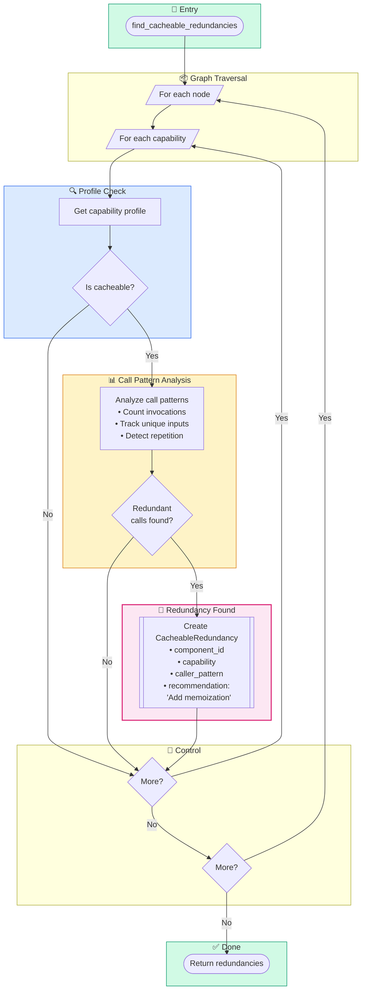
```mermaid
flowchart TB
    subgraph entry["🚀 Entry"]
        start([find_cacheable_redundancies])
    end

    subgraph iteration["📦 Graph Traversal"]
        iterate[/"For each node"/]
        getcap[/"For each capability"/]
    end

    subgraph profileCheck["🔍 Profile Check"]
        getprofile["Get capability profile"]
        cacheable{"Is cacheable?"}
    end

    subgraph patternAnalysis["📊 Call Pattern Analysis"]
        analyze["Analyze call patterns\n• Count invocations\n• Track unique inputs\n• Detect repetition"]
        redundant{"Redundant\ncalls found?"}
    end

    subgraph redundancy["💾 Redundancy Found"]
        add[["Create CacheableRedundancy\n• component_id\n• capability\n• caller_pattern\n• recommendation:\n  'Add memoization'"]]
    end

    subgraph control["🔄 Control"]
        nextcap{More?}
        nextnode{More?}
    end

    subgraph exit["✅ Done"]
        return([Return redundancies])
    end

    start --> iterate --> getcap --> getprofile --> cacheable
    cacheable -->|"No"| nextcap
    cacheable -->|"Yes"| analyze --> redundant
    redundant -->|"No"| nextcap
    redundant -->|"Yes"| add --> nextcap
    nextcap -->|Yes| getcap
    nextcap -->|No| nextnode
    nextnode -->|Yes| iterate
    nextnode -->|No| return

    style profileCheck fill:#dbeafe,stroke:#2563eb
    style patternAnalysis fill:#fef3c7,stroke:#d97706
    style redundancy fill:#fce7f3,stroke:#db2777,stroke-width:2px
    style entry fill:#d1fae5,stroke:#059669
    style exit fill:#d1fae5,stroke:#059669
```

---

## The Optimization Violation Prompt

When a mismatch is detected, generate a focused prompt for LLM analysis:

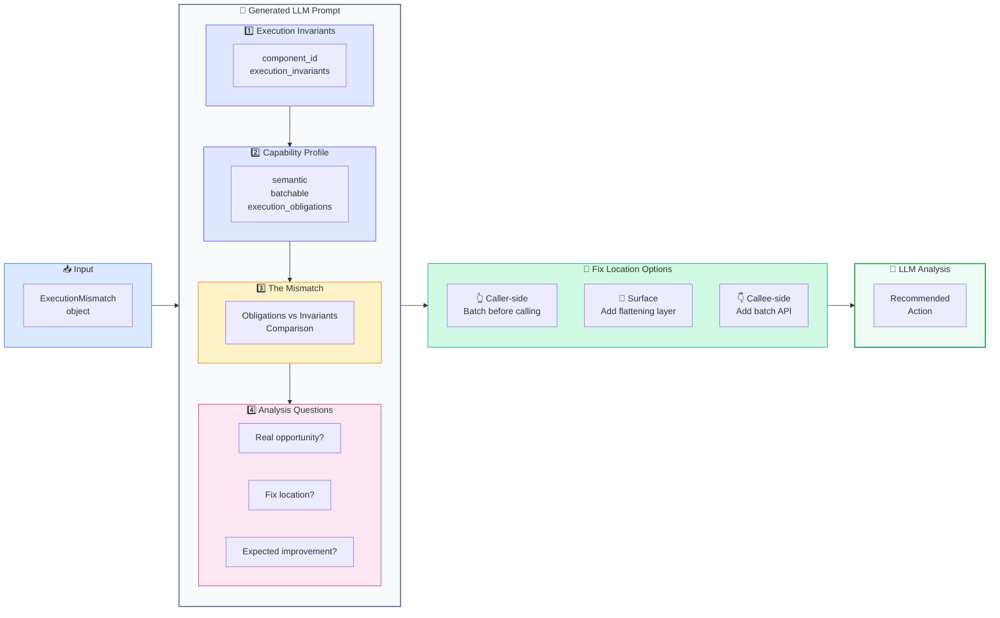
```mermaid
flowchart LR
    subgraph input["📥 Input"]
        mismatch["ExecutionMismatch\nobject"]
    end

    subgraph promptGen["📝 Generated LLM Prompt"]
        direction TB

        subgraph sec1["1️⃣ Execution Invariants"]
            ctx["component_id\nexecution_invariants"]
        end

        subgraph sec2["2️⃣ Capability Profile"]
            prof["semantic\nbatchable\nexecution_obligations"]
        end

        subgraph sec3["3️⃣ The Mismatch"]
            mis["Obligations vs Invariants\nComparison"]
        end

        subgraph sec4["4️⃣ Analysis Questions"]
            q1["Real opportunity?"]
            q2["Fix location?"]
            q3["Expected improvement?"]
        end
    end

    subgraph fixes["🔧 Fix Location Options"]
        direction TB
        caller["👆 Caller-side\nBatch before calling"]
        surface["🔀 Surface\nAdd flattening layer"]
        callee["👇 Callee-side\nAdd batch API"]
    end

    subgraph llmOutput["🤖 LLM Analysis"]
        decision["Recommended\nAction"]
    end

    input --> promptGen
    sec1 --> sec2 --> sec3 --> sec4
    promptGen --> fixes
    fixes --> llmOutput

    style input fill:#dbeafe,stroke:#2563eb
    style promptGen fill:#f8fafc,stroke:#64748b,stroke-width:2px
    style sec1 fill:#e0e7ff,stroke:#4f46e5
    style sec2 fill:#e0e7ff,stroke:#4f46e5
    style sec3 fill:#fef3c7,stroke:#d97706
    style sec4 fill:#fce7f3,stroke:#db2777
    style fixes fill:#d1fae5,stroke:#059669
    style llmOutput fill:#f0fdf4,stroke:#16a34a,stroke-width:2px
```

---

## Full Enhancement Pipeline

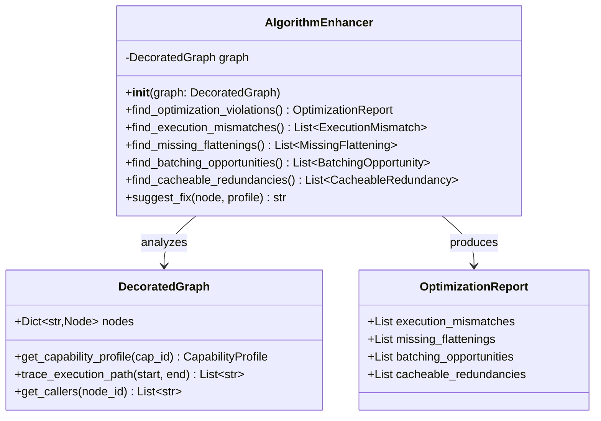
```mermaid
classDiagram
    class AlgorithmEnhancer {
        -DecoratedGraph graph
        +__init__(graph: DecoratedGraph)
        +find_optimization_violations() OptimizationReport
        +find_execution_mismatches() List~ExecutionMismatch~
        +find_missing_flattenings() List~MissingFlattening~
        +find_batching_opportunities() List~BatchingOpportunity~
        +find_cacheable_redundancies() List~CacheableRedundancy~
        +suggest_fix(node, profile) str
    }

    class DecoratedGraph {
        +Dict~str,Node~ nodes
        +get_capability_profile(cap_id) CapabilityProfile
        +trace_execution_path(start, end) List~str~
        +get_callers(node_id) List~str~
    }

    class OptimizationReport {
        +List execution_mismatches
        +List missing_flattenings
        +List batching_opportunities
        +List cacheable_redundancies
    }

    AlgorithmEnhancer --> DecoratedGraph : analyzes
    AlgorithmEnhancer --> OptimizationReport : produces
```

**Pipeline Flow:**

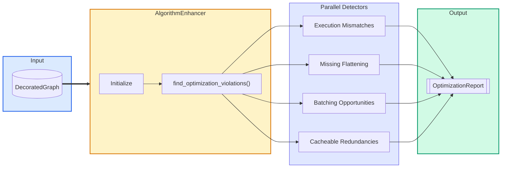
```mermaid
flowchart LR
    subgraph input["Input"]
        inputGraph[("DecoratedGraph")]
    end

    subgraph enhancer["AlgorithmEnhancer"]
        direction TB
        init["Initialize"]
        find["find_optimization_violations()"]
        init --> find
    end

    subgraph detectors["Parallel Detectors"]
        direction TB
        cm["Execution Mismatches"]
        mf["Missing Flattening"]
        bo["Batching Opportunities"]
        cr["Cacheable Redundancies"]
    end

    subgraph output["Output"]
        report[["OptimizationReport"]]
    end

    inputGraph ==> enhancer
    find --> cm & mf & bo & cr
    cm & mf & bo & cr --> report

    style input fill:#dbeafe,stroke:#2563eb,stroke-width:2px
    style enhancer fill:#fef3c7,stroke:#d97706,stroke-width:2px
    style detectors fill:#e0e7ff,stroke:#4f46e5
    style output fill:#d1fae5,stroke:#059669,stroke-width:2px
```

**suggest_fix Logic:**

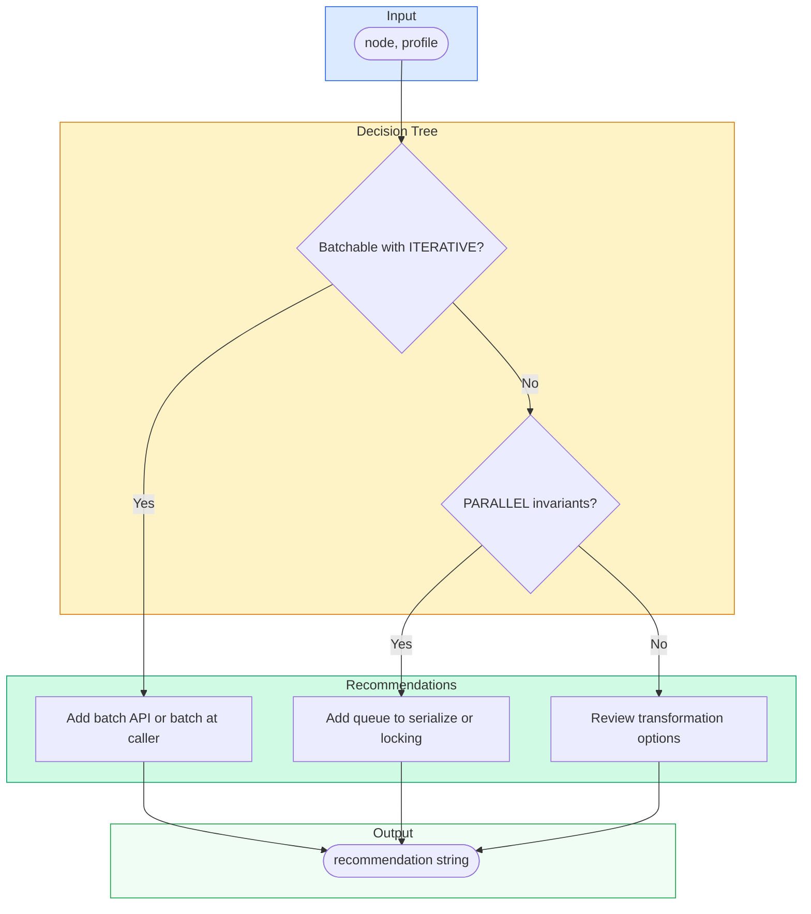
```mermaid
flowchart TB
    subgraph input["Input"]
        start(["node, profile"])
    end

    subgraph decision["Decision Tree"]
        check1{"Batchable with ITERATIVE?"}
        check2{"PARALLEL invariants?"}
    end

    subgraph recommendations["Recommendations"]
        fix1["Add batch API or batch at caller"]
        fix2["Add queue to serialize or locking"]
        fix3["Review transformation options"]
    end

    subgraph output["Output"]
        return([recommendation string])
    end

    start --> check1
    check1 -->|"Yes"| fix1
    check1 -->|"No"| check2
    check2 -->|"Yes"| fix2
    check2 -->|"No"| fix3
    fix1 & fix2 & fix3 --> return

    style input fill:#dbeafe,stroke:#2563eb
    style decision fill:#fef3c7,stroke:#d97706
    style recommendations fill:#d1fae5,stroke:#059669
    style output fill:#f0fdf4,stroke:#16a34a
```

---

## Output: Optimization Report

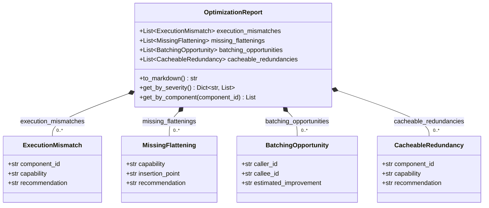
```mermaid
classDiagram
    class OptimizationReport {
        +List~ExecutionMismatch~ execution_mismatches
        +List~MissingFlattening~ missing_flattenings
        +List~BatchingOpportunity~ batching_opportunities
        +List~CacheableRedundancy~ cacheable_redundancies
        +to_markdown() str
        +get_by_severity() Dict~str, List~
        +get_by_component(component_id) List
    }

    class ExecutionMismatch {
        +str component_id
        +str capability
        +str recommendation
    }

    class MissingFlattening {
        +str capability
        +str insertion_point
        +str recommendation
    }

    class BatchingOpportunity {
        +str caller_id
        +str callee_id
        +str estimated_improvement
    }

    class CacheableRedundancy {
        +str component_id
        +str capability
        +str recommendation
    }

    OptimizationReport *-- "0..*" ExecutionMismatch : execution_mismatches
    OptimizationReport *-- "0..*" MissingFlattening : missing_flattenings
    OptimizationReport *-- "0..*" BatchingOpportunity : batching_opportunities
    OptimizationReport *-- "0..*" CacheableRedundancy : cacheable_redundancies
```

**Report Structure:**

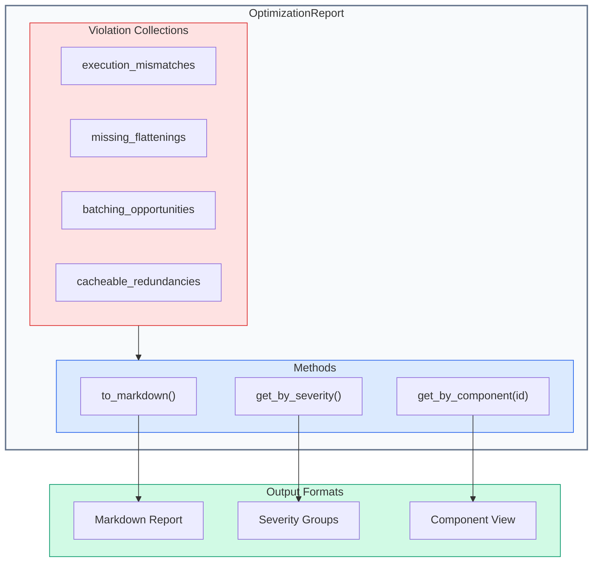
```mermaid
flowchart TB
    subgraph report["OptimizationReport"]
        direction TB

        subgraph violations["Violation Collections"]
            direction LR
            cm["execution_mismatches"]
            mf["missing_flattenings"]
            bo["batching_opportunities"]
            cr["cacheable_redundancies"]
        end

        subgraph methods["Methods"]
            direction LR
            md["to_markdown()"]
            sev["get_by_severity()"]
            comp["get_by_component(id)"]
        end
    end

    subgraph outputs["Output Formats"]
        direction LR
        markdown["Markdown Report"]
        severity["Severity Groups"]
        component["Component View"]
    end

    violations --> methods
    md --> markdown
    sev --> severity
    comp --> component

    style report fill:#f8fafc,stroke:#64748b,stroke-width:2px
    style violations fill:#fee2e2,stroke:#dc2626
    style methods fill:#dbeafe,stroke:#2563eb
    style outputs fill:#d1fae5,stroke:#059669
```

---

## Re-Architecture Triggers

When optimization violations cannot be fixed within existing surfaces, trigger re-architecture:

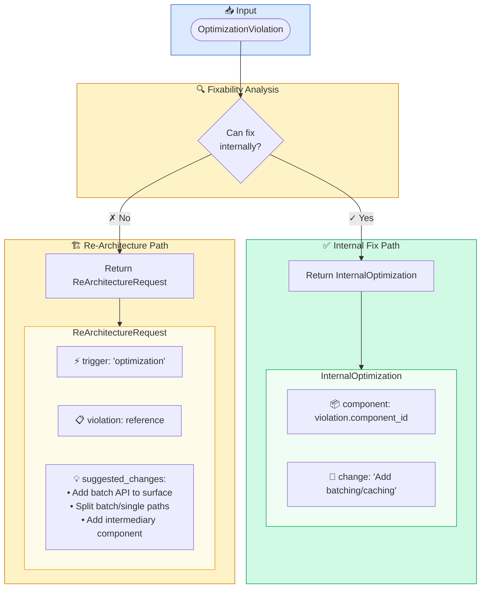
```mermaid
flowchart TB
    subgraph input["📥 Input"]
        start(["OptimizationViolation"])
    end

    subgraph analysis["🔍 Fixability Analysis"]
        check{"Can fix\ninternally?"}
    end

    subgraph internalPath["✅ Internal Fix Path"]
        direction TB
        internal["Return InternalOptimization"]

        subgraph internalopt["InternalOptimization"]
            comp["📦 component: violation.component_id"]
            change["🔧 change: 'Add batching/caching'"]
        end
    end

    subgraph externalPath["🏗️ Re-Architecture Path"]
        direction TB
        rearch["Return ReArchitectureRequest"]

        subgraph rearchreq["ReArchitectureRequest"]
            trigger["⚡ trigger: 'optimization'"]
            viol["📋 violation: reference"]
            suggestions["💡 suggested_changes:\n• Add batch API to surface\n• Split batch/single paths\n• Add intermediary component"]
        end
    end

    start --> check
    check -->|"✓ Yes"| internal --> internalopt
    check -->|"✗ No"| rearch --> rearchreq

    style input fill:#dbeafe,stroke:#2563eb
    style analysis fill:#fef3c7,stroke:#d97706
    style internalPath fill:#d1fae5,stroke:#059669
    style internalopt fill:#f0fdf4,stroke:#16a34a
    style externalPath fill:#fef3c7,stroke:#d97706
    style rearchreq fill:#fffbeb,stroke:#f59e0b
```

**Connection to Decomposition:**

When enhancer finds optimization violations requiring contract changes:

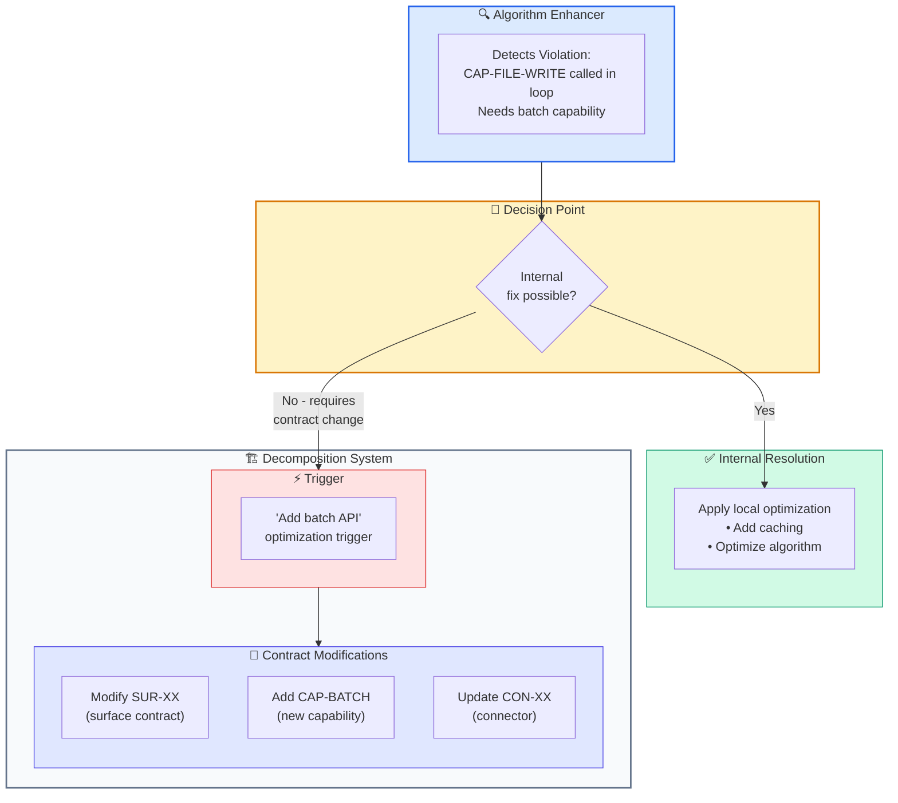
```mermaid
flowchart TB
    subgraph detection["🔍 Algorithm Enhancer"]
        finding["Detects Violation:\nCAP-FILE-WRITE called in loop\nNeeds batch capability"]
    end

    subgraph decision["🤔 Decision Point"]
        check{"Internal\nfix possible?"}
    end

    subgraph internal["✅ Internal Resolution"]
        direction TB
        localfix["Apply local optimization\n• Add caching\n• Optimize algorithm"]
    end

    subgraph external["🏗️ Decomposition System"]
        direction TB

        subgraph trigger["⚡ Trigger"]
            triggerMsg["'Add batch API'\noptimization trigger"]
        end

        subgraph actions["🔧 Contract Modifications"]
            direction TB
            sur["Modify SUR-XX\n(surface contract)"]
            cap["Add CAP-BATCH\n(new capability)"]
            con["Update CON-XX\n(connector)"]
        end
    end

    detection --> check
    check -->|"Yes"| localfix
    check -->|"No - requires\ncontract change"| trigger
    trigger --> actions

    style detection fill:#dbeafe,stroke:#2563eb,stroke-width:2px
    style decision fill:#fef3c7,stroke:#d97706,stroke-width:2px
    style internal fill:#d1fae5,stroke:#059669
    style external fill:#f8fafc,stroke:#64748b,stroke-width:2px
    style trigger fill:#fee2e2,stroke:#dc2626
    style actions fill:#e0e7ff,stroke:#4f46e5
```

---

## Relationship to Other Tools

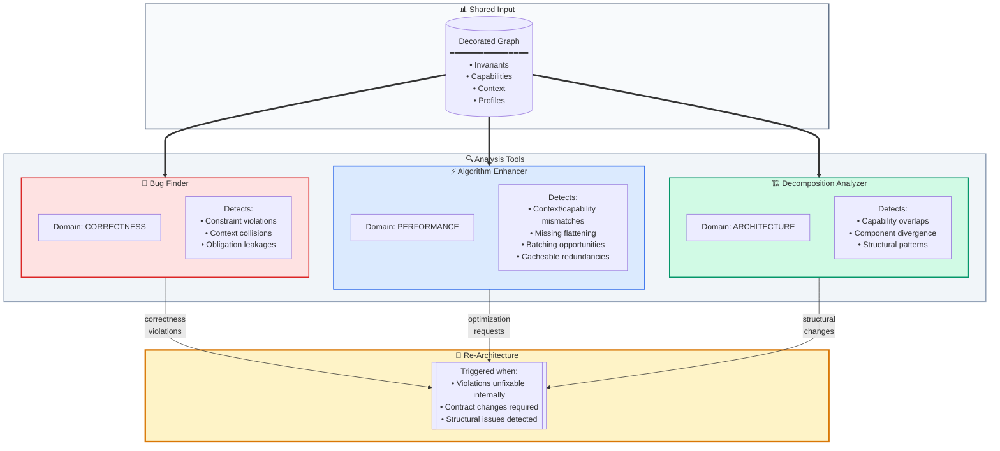
```mermaid
flowchart TB
    subgraph input["📊 Shared Input"]
        decoratedGraph[("Decorated Graph\n━━━━━━━━━━━━━━━━\n• Invariants\n• Capabilities\n• Context\n• Profiles")]
    end

    subgraph analyzers["🔍 Analysis Tools"]
        direction LR

        subgraph bugfinder["🐛 Bug Finder"]
            direction TB
            bf_icon["Domain: CORRECTNESS"]
            bf_detects["Detects:\n• Constraint violations\n• Context collisions\n• Obligation leakages"]
        end

        subgraph enhancer["⚡ Algorithm Enhancer"]
            direction TB
            ae_icon["Domain: PERFORMANCE"]
            ae_detects["Detects:\n• Context/capability mismatches\n• Missing flattening\n• Batching opportunities\n• Cacheable redundancies"]
        end

        subgraph decomp["🏗️ Decomposition Analyzer"]
            direction TB
            da_icon["Domain: ARCHITECTURE"]
            da_detects["Detects:\n• Capability overlaps\n• Component divergence\n• Structural patterns"]
        end
    end

    subgraph output["🔄 Re-Architecture"]
        rearch[["Triggered when:\n• Violations unfixable internally\n• Contract changes required\n• Structural issues detected"]]
    end

    decoratedGraph ==> bugfinder
    decoratedGraph ==> enhancer
    decoratedGraph ==> decomp

    bugfinder -->|"correctness\nviolations"| rearch
    enhancer -->|"optimization\nrequests"| rearch
    decomp -->|"structural\nchanges"| rearch

    style input fill:#f8fafc,stroke:#64748b,stroke-width:2px
    style analyzers fill:#f1f5f9,stroke:#94a3b8,stroke-width:2px
    style bugfinder fill:#fee2e2,stroke:#dc2626,stroke-width:2px
    style enhancer fill:#dbeafe,stroke:#2563eb,stroke-width:2px
    style decomp fill:#d1fae5,stroke:#059669,stroke-width:2px
    style output fill:#fef3c7,stroke:#d97706,stroke-width:3px
```

---

## Parallel Structure to Bug Finder

| Bug Finder Violation | Enhancer Violation |
|---------------------|-------------------|
| ExpectationViolation | ExecutionMismatch |
| ObligationLeakage | MissingFlattening |
| ContextCollision | BatchingOpportunity |
| IsolationReport | CacheableRedundancy |

Both tools:
1. Consume the decorated graph
2. Analyze invariants/execution propagation
3. Detect violations of declared constraints
4. Generate reports with recommendations
5. Trigger re-architecture when internal fixes are insufficient

The difference is **what** they check:

* Bug Finder: Correctness invariants (INV-ORDERED, OBL-SERIAL, etc.)
* Enhancer: Execution invariants (EXE-INV-*, capability profiles)

---

## Summary

The Algorithm Enhancer:

1. **Analyzes** execution invariant propagation through the graph
2. **Compares** execution invariants against capability obligations
3. **Detects** four types of optimization violations
4. **Recommends** fixes (internal optimization or re-architecture)
5. **Triggers** decomposition when contract changes are needed

Unlike simple single-component optimization, this approach:

* Sees cross-boundary patterns (loop-over-batchable)
* Traces execution transformations through surfaces
* Identifies where flattening should occur
* Connects performance issues to architectural decisions
