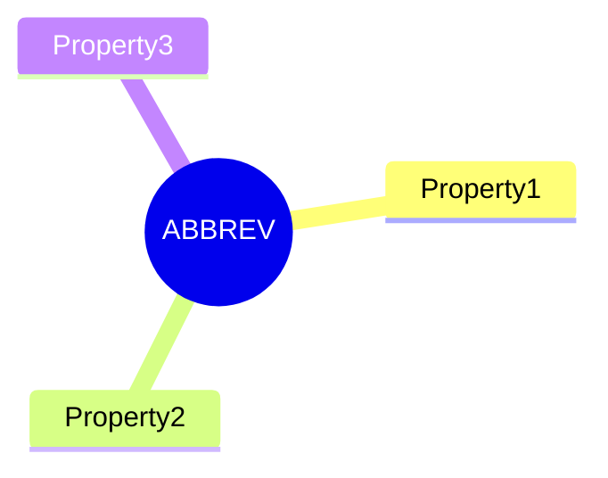
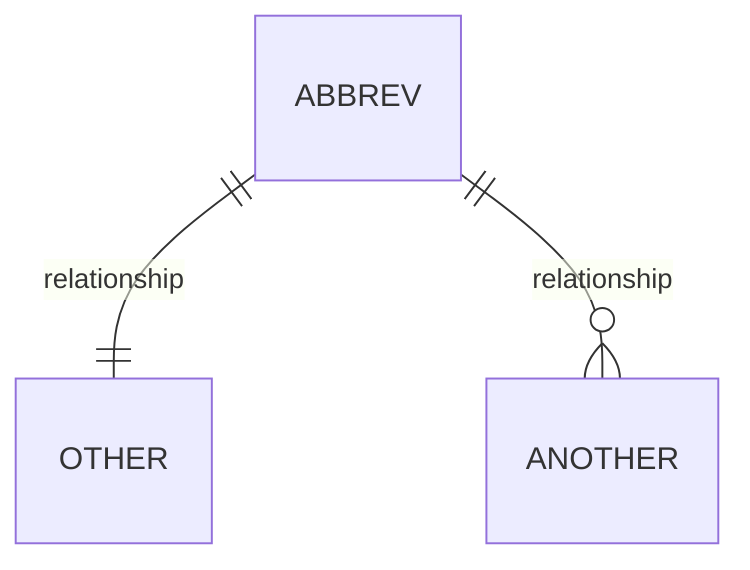

# Component Definitions

This folder contains definitions for each component type in the algorithm graph model.

## File Structure

Each component definition file follows this structure:

```
# Name (ABBREV)

## Definition
Brief description of what this component is.

## Properties
Mermaid mindmap showing the component's properties.

## Relationships
Mermaid erDiagram showing how this component relates to others.

## Identity
The ID format for this component (e.g., `COM-XX`).

## [Property Sections]
One section per property from the mindmap, explaining what it is.

## Example
ASCII tree showing a concrete instance of this component.
```

## Section Order

1. **Definition** - What the component is (1-2 sentences)
2. **Properties** - Mermaid mindmap diagram
3. **Relationships** - Mermaid erDiagram diagram
4. **Identity** - ID format specification
5. **[Domain Sections]** - One section per property, in mindmap order
6. **Example** - Concrete ASCII tree example (always last)

## Diagrams

### Properties Mindmap



### Relationships erDiagram



## Example Section Format

```
ABBREV-XX: Name
├── Property1: value
├── Property2:
│   └── nested value
└── Property3: value
```
