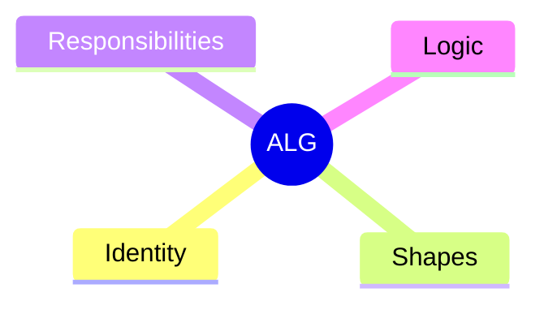
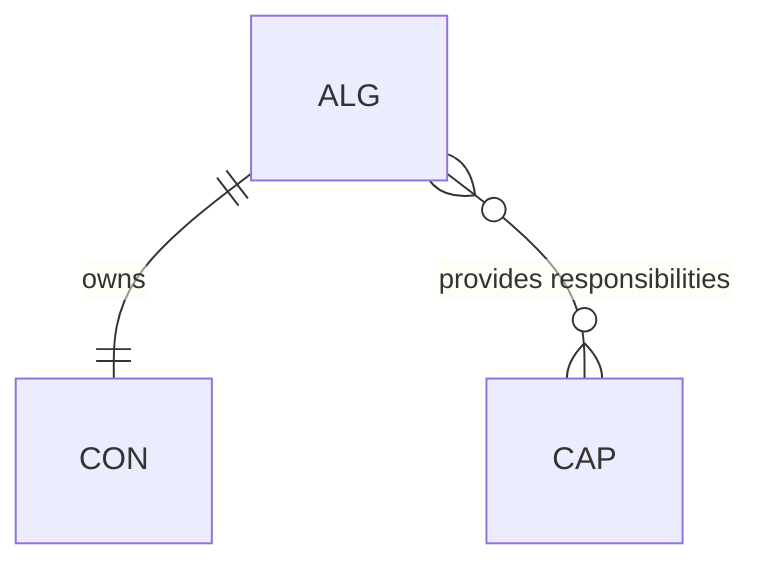

# Algorithm (ALG)

## Definition

An implementation unit. Made up of responsibilities that fulfill a contract's capabilities.

## Properties



## Relationships



## Identity

`ALG-XX` where XX is a unique identifier (globally unique).

## Shapes

Shapes that apply to the algorithm itself (internal constraints). Not exposed through the contract.

## Responsibilities

Algorithms provide responsibilities from a fixed vocabulary. See [definitions.md](../definitions.md) for the complete vocabulary.

## Logic

A flowchart composed of responsibilities. The body of the algorithm that satisfies its shapes.

## Example

```
ALG-05: FileWriter
├── Identity: ALG-05
├── Shapes:
│   └── SHP-BUFFERED-IO
├── Responsibilities:
│   ├── walker: 1
│   ├── validator: 1
│   └── mutator: 1
└── Logic: (flowchart)
```
