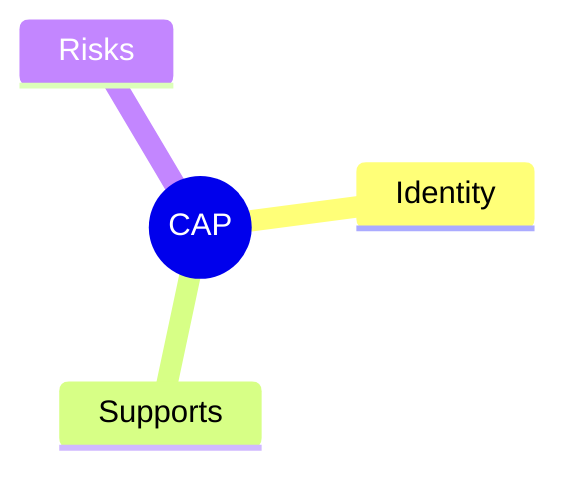
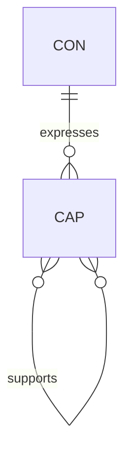

# Capability (CAP)

## Definition

An outcome of a contract. Represents what a contract achieves.

## Properties



## Relationships



## Identity

`CAP-XX` where XX is a unique identifier.

## Supports

Capabilities can support other capabilities (composition). This is a graph relation for composition/dependency, not containment.

## Risks

Capabilities carry inherent risks:

- **Latency**: Time cost to achieve the capability
- **Memory**: Memory consumption during execution
- **Processing**: CPU cycles required

Invariants provide evidence to calculate and mitigate these risks.

## Example

```
CAP-FILE-WRITE
├── Identity: CAP-FILE-WRITE
├── Supports:
│   └── CAP-DISK-ACCESS
└── Risks:
    ├── latency: high (disk I/O)
    ├── memory: low
    └── processing: low
```
