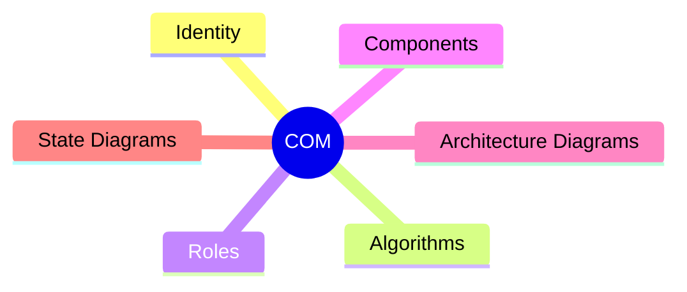
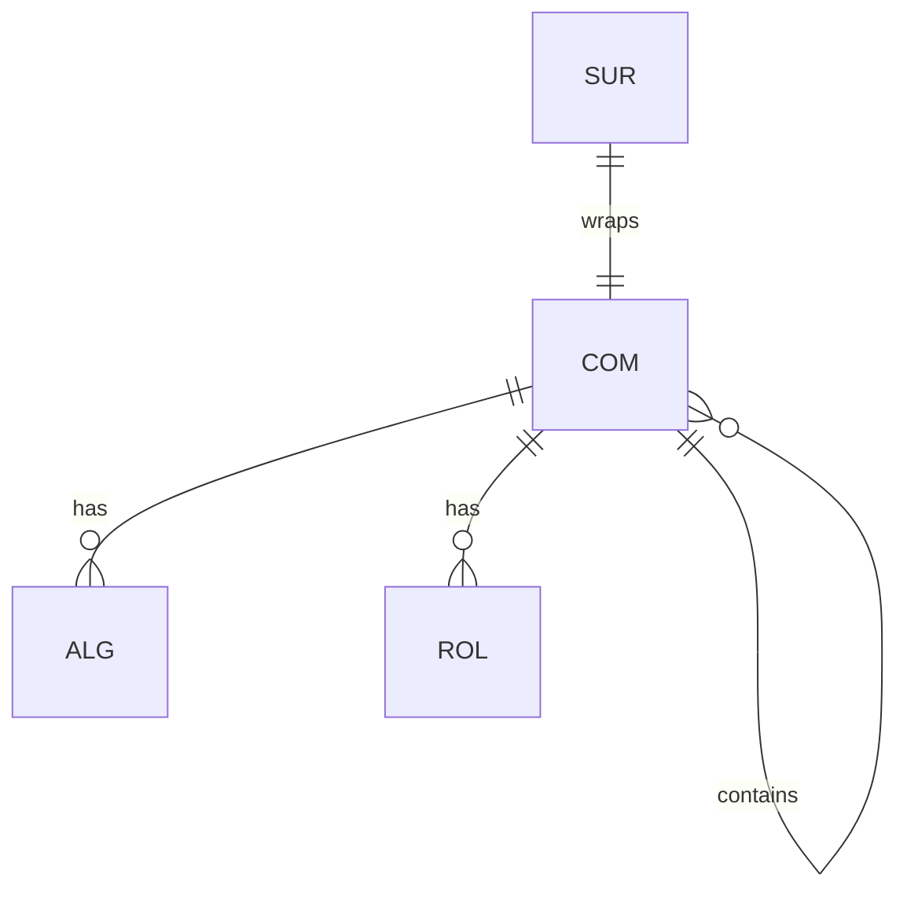

# Component (COM)

## Definition

A bounded unit of functionality. Composed of algorithms, roles, nested components, and diagrams.

## Properties



## Relationships



## Identity

`COM-XX` where XX is a unique identifier.

## Algorithms

The set of algorithms (ALG) that implement the component's functionality.

## Roles

The set of roles (ROL) that define constraints on the component and its interactions.

## Components

Nested components (COM) contained within this component. Enables hierarchical composition.

## Architecture Diagrams

Diagrams showing the structural organization and relationships within the component.

## State Diagrams

Diagrams showing the state transitions and lifecycle of the component.

## Example

```
COM-05: FileManager
├── Identity: COM-05
├── Algorithms:
│   ├── ALG-05 (FileWriter)
│   └── ALG-06 (FileReader)
├── Roles:
│   └── ROL-01 (Caller)
├── Components:
│   ├── COM-06 (CacheManager)
│   └── COM-07 (LockManager)
├── Architecture Diagrams: (diagrams)
└── State Diagrams: (diagrams)
```
