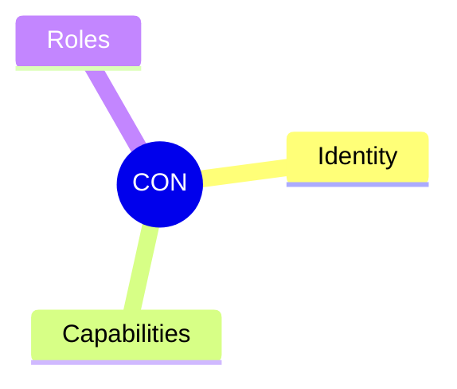
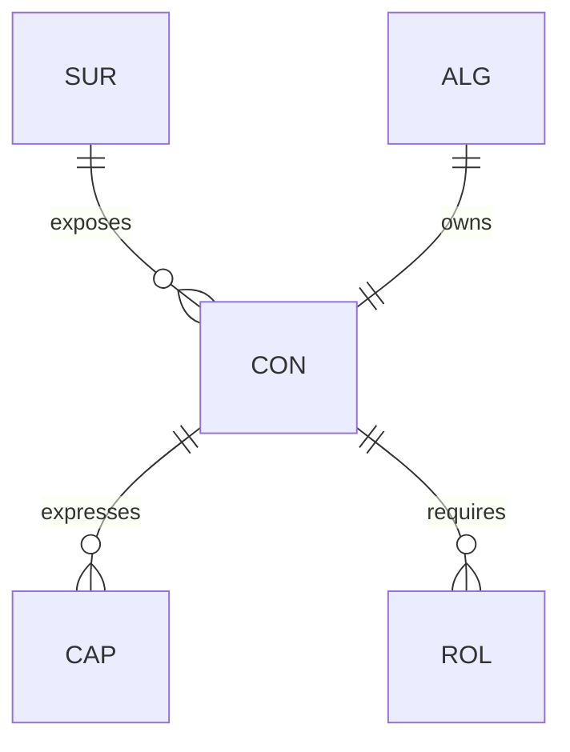

# Contract (CON)

## Definition

A single boundary inside a surface. The interface through which an algorithm's functionality is accessed. Declares what the contract offers (capabilities) and what roles must be satisfied.

## Properties



## Relationships



## Identity

`CON-XX` where XX is a unique identifier.

## Capabilities

The set of capabilities (CAP) this contract offers. What the contract achieves.

## Roles

The set of roles (ROL) that must be satisfied for the contract to be fulfillable.

## Fulfillment

A contract is **fulfillable** when all its roles are satisfied:
1. All roles have their members filled
2. All shapes in each role hold for those members

## Example

```
CON-05: FileWriteContract
├── Identity: CON-05
├── Capabilities:
│   └── CAP-FILE-WRITE
└── Roles:
    ├── ROL-01 (Caller)
    └── ROL-02 (ValidPath)
```
