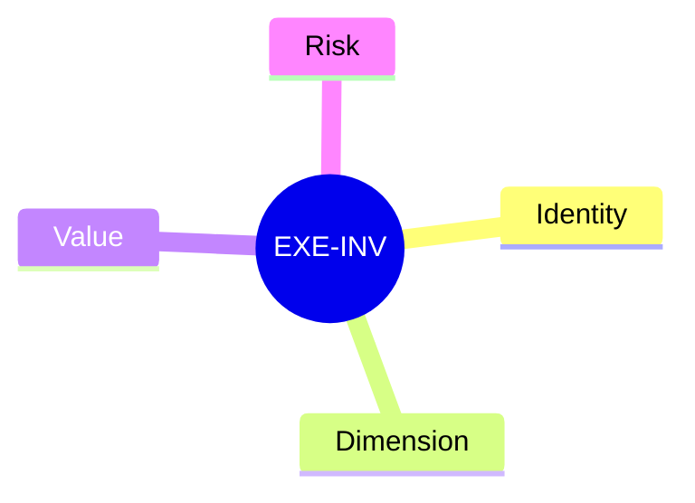
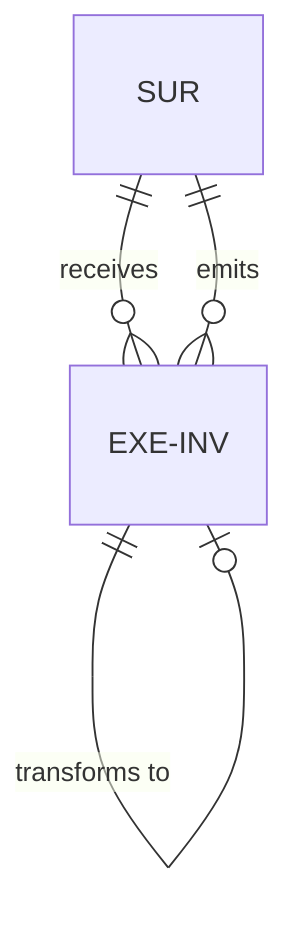
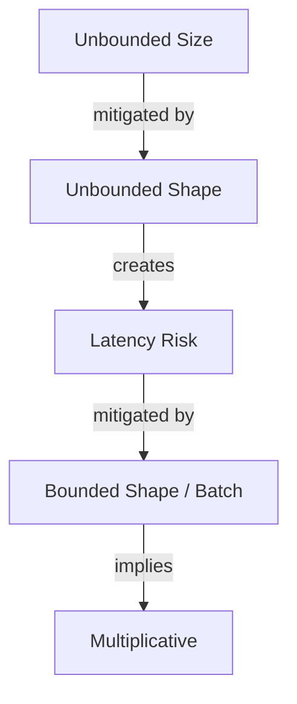
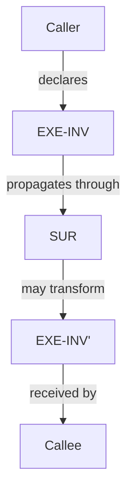

# Execution Invariant (EXE-INV)

## Definition

Describes how a caller is executing. Propagates top-down from caller to callee through surfaces.

## Properties



## Relationships



## Identity

`EXE-INV-XX` where XX describes the execution mode.

## Dimension

The category of execution characteristic being described.

- **Amount**: atomic, multiplicative (single call vs repeated calls)
- **Parallelism**: concurrent, serial
- **Shape**: bounded, unbounded (protocol - all at once vs stream)
- **Size**: bounded, unbounded (potential data volume)

## Value

The specific execution mode within a dimension.

## Risk

Execution invariants carry **memory** risk.

### Risk Interactions



- **Unbounded size** is a general memory risk mitigated by unbounded shape (streaming)
- **Unbounded shape** creates latency risk, mitigated by bounded shape (batching)
- **Bounded shape** implies multiplicative execution

## Propagation



## Example

```
EXE-INV-UNBOUNDED-SIZE
├── Identity: EXE-INV-UNBOUNDED-SIZE
├── Dimension: Size
├── Value: unbounded
└── Risk: memory
```
