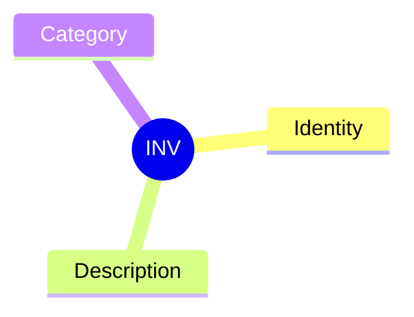
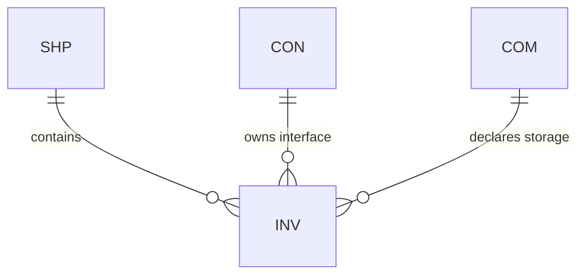

# Invariant (INV)

## Definition

A self-constraint owned by an entity and applied to itself. Declares "what must always be true" about the owning entity.

## Properties



## Relationships



## Identity

`INV-XX` where XX is a unique identifier.

## Description

Human-readable constraint statement describing what must always be true.

## Category

The type of constraint: Security, Execution, Correctness, Reliability, etc.

## Self-Application

Invariants apply to **self**. They are not requirements on others—that's handled by invariant aspects with roles.

## Example

```
INV-ORDERED
├── Identity: INV-ORDERED
├── Description: Output is always sorted
└── Category: Correctness
```
