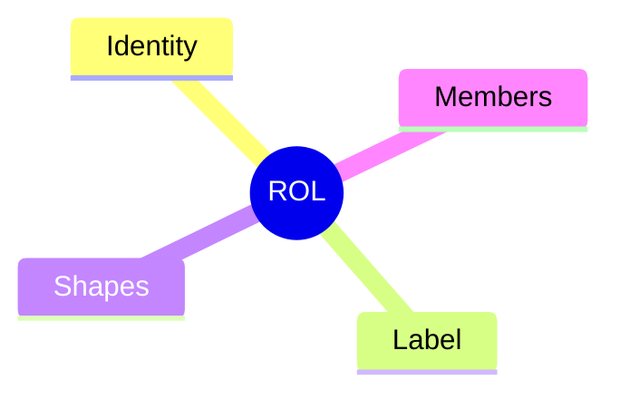
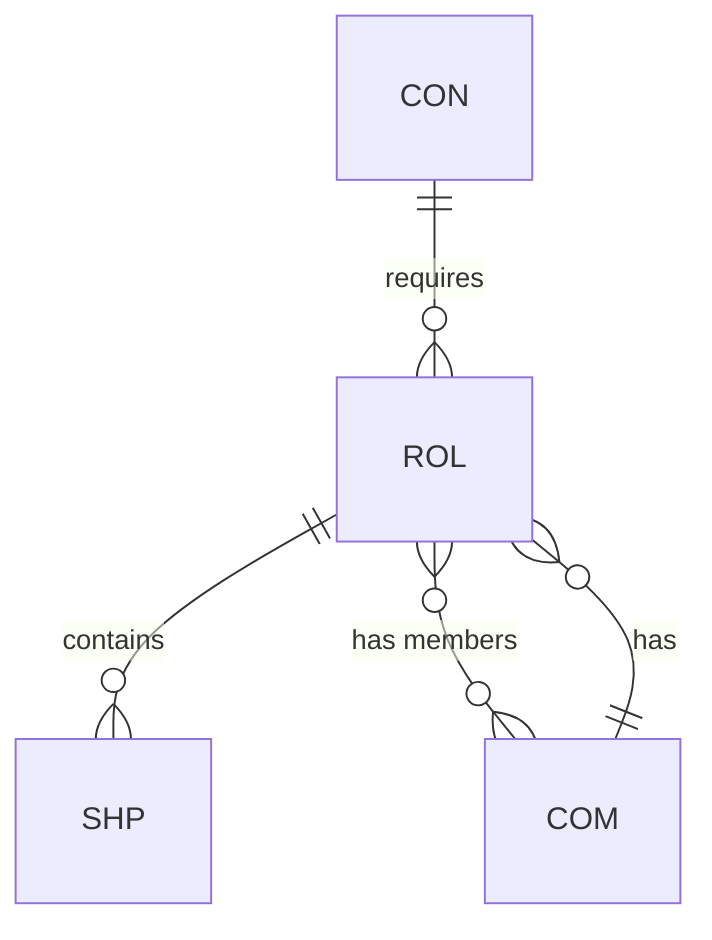

# Role (ROL)

## Definition

A semantic slot that binds shapes to members. Roles give meaning to participants in a constraint relationship.

## Properties



## Relationships



## Identity

`ROL-XX` where XX is a unique identifier.

## Label

A semantic identifier describing the role's purpose (e.g., "caller", "writer", "subscriber").

## Shapes

The set of shapes (SHP) that apply to this role's members. Defines the constraints that must hold.

## Members

The entities that fill this role. Can be:
- **Relative**: Determined at execution time (slot filled when contract invoked)
- **Constant**: Fixed, known entities

## Example

```
ROL-01: Caller
├── Identity: ROL-01
├── Label: caller
├── Shapes:
│   └── SHP-SECURE
│       ├── INV-AUTH
│       └── INV-AUTHZ
└── Members: (relative, single)
```
