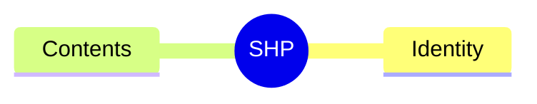
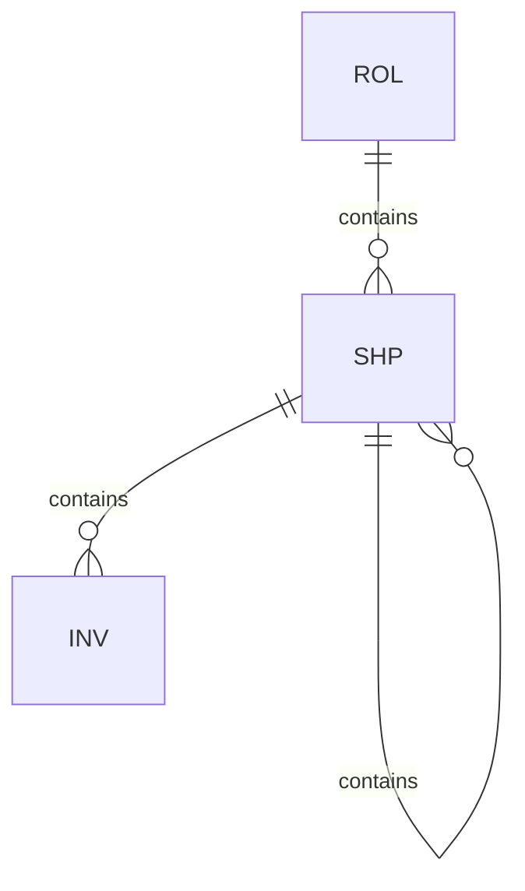

# Shape (SHP)

## Definition

A collection of invariants. Shapes organize related constraints into reusable units.

## Properties



## Relationships



## Identity

`SHP-XX` where XX is a unique identifier.

## Contents

A set of invariants (INV) and/or other shapes (SHP). Enables hierarchical composition of constraints.

## Example

```
SHP-01: TransactionalWrite
├── Identity: SHP-01
└── Contents:
    ├── INV-ATOMIC
    ├── INV-CONSISTENT
    └── SHP-02 (Auditable)
        ├── INV-LOGGED
        └── INV-TIMESTAMPED
```
