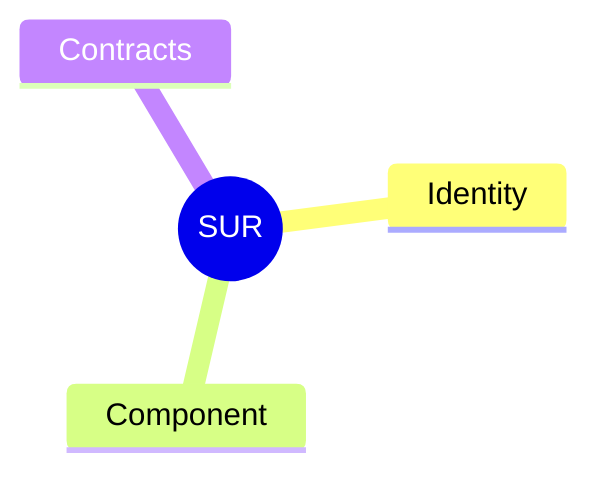
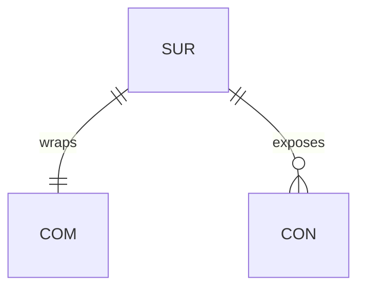
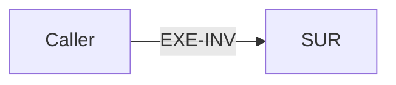
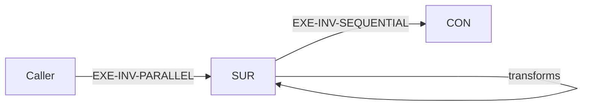

# Surface (SUR)

## Definition

Wraps a component and expresses it via contracts. The boundary through which external entities interact with the component.

## Properties



## Relationships



## Identity

`SUR-XX` where XX is a unique identifier.

## Component

The component (COM) this surface wraps.

## Contracts

The set of contracts (CON) that express the wrapped component's functionality.

## Receives Invariants

Execution invariants received from the caller flow into the surface.



## Emits Invariants

Execution invariants emitted from the surface flow to contracts/callees.


## Transformation

Surfaces may transform execution invariants between receiving and emitting.



## Example

```
SUR-05
├── Identity: SUR-05
├── Component: COM-05 (FileManager)
└── Contracts:
    ├── CON-05 (FileWriteContract)
    └── CON-06 (FileReadContract)
```
