# Algorithm Graph Creator

## Purpose

Creates a runtime graph representation of the distributed algorithm architecture.
This graph serves as the foundation for both **bug finding** (constraint violation
detection) and **algorithm enhancement** (meaningful slice extraction).

The graph is computed at analysis time from component documents. Runtime
decoration is in-memory; inference outputs are persisted back to docs under
AUTO-GENERATED blocks for incremental recomputation.

---

## System Overview

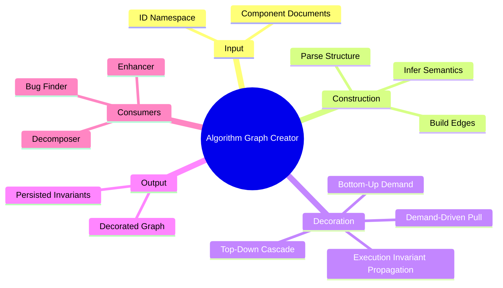

---

## Input: The ID System

The architecture uses a comprehensive ID system that the graph creator parses:

| ID Prefix | Meaning | Example |
|-----------|---------|---------|
| `COM-XX` | Component | `COM-05` (SchedulingDomain) |
| `SUR-XX` | Surface (owned by component; container of contracts) | `SUR-05` |
| `ALG-XX` | Algorithm (globally unique; owned by a COM) | `ALG-05` |
| `INV-STORES-XX` | Storage invariant (component persists data) | `INV-STORES-04` (FileRegistry) |
| `CTX-XX` | Context (transient data) | `CTX-03` (ScheduleRequest) |
| `ART-XX` | Artifact (operational metadata) | `ART-01` (CLI arguments) |
| `CON-XX` | Contract (one boundary inside a surface) | `CON-05` |
| `INV-XX` | Invariant (correctness constraint) | `INV-02` (deterministic ordering) |
| `OBL-XX` | Obligation (demanded behavior) | `OBL-20` (strict serial access) |
| `EXE-INV-XX` | Execution invariant (caller's execution mode) | `EXE-INV-PARALLEL` (parallel execution) |
| `EXE-OBL-XX` | Execution obligation (surface's execution requirement) | `EXE-OBL-ATOMIC` (requires atomic execution) |
| `CAP-XX` | Capability (feature/responsibility) | `CAP-03` (file discovery) |

All IDs are globally unique across the system.

**Note:** `ResponsibilityPattern` is not an ID but a string from a fixed vocabulary.
See [definitions.md](definitions.md) for the complete vocabulary.

**Note on Invariants vs Capabilities:**

| Aspect | Invariants (INV/OBL) | Capabilities (CAP) |
|--------|----------------------|-------------------|
| What | Behavioral constraints | Feature responsibilities |
| Question | "What must always be true?" | "What does this component do?" |
| Example | "Output must be sorted" | "Sorts input data" |
| Use | Bug finding, constraint preservation | Decomposition, architecture |

---

## Graph Construction

### Step 1: Parse All Component Documents

Each component document is parsed into a typed subgraph:

* `COM` node (the component)
* `SUR` node (exactly one per `COM`, references exposed contracts)
* `ALG` nodes (many, under `COM`)
* `CON` nodes (one per `ALG`, owned by the algorithm)

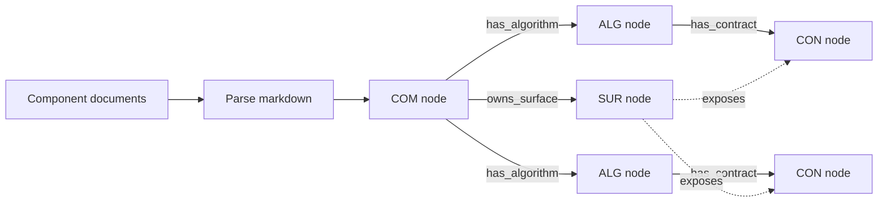

**IDs extracted during parsing (assigned to typed nodes):**

| Prefix | Stored On |
|--------|-----------|
| INV- | `ALG` (implementation invariants) and `CON` (interface invariants) |
| OBL- | `CON` (obligations demanded by contract) |
| CAP- | `CON` (capabilities offered by contract) |
| INV-STORES- | `COM` (storage_invariants) |
| CON- | `CON` nodes (contract identity + direction/signature) |

### Step 1.5: Infer Implicit Invariants, Capabilities, Responsibilities

The graph creator analyzes algorithm content and infers what the implementation
implies but wasn't explicitly declared. Inference populates both the ALG
(implementation details) and its CON (interface/contract).

```mermaid
flowchart LR
    IN[Graph from Step 1] --> LOOP

    subgraph LOOP[For Each Algorithm (ALG)]
        direction TB
        A[Read algorithm text] --> B[LLM infers outputs]:::llm
        B --> C[Store on ALG + CON]
    end

    LOOP --> MAT

    subgraph MAT[Materialize Capabilities]
        direction TB
        D[Create CAP nodes] --> E[Add expresses edges from CON]
    end

    MAT --> OUT[Enriched graph with CON → CAP edges]

    classDef llm fill:#2196f3,color:#fff
```

**Inference outputs per ALG:**

| Field | Type | Description |
|-------|---------|-----------|
| impl_invariants | Set[INV] | Implementation invariants |
| responsibilities | Multiset | Responsibility patterns |

**Inference outputs per CON (contract):**

| Field | Type | Description |
|-------|---------|-----------|
| interface_invariants | Set[INV] | Interface invariants |
| obligations | Set[OBL] | Contract demands from callers |
| capabilities | Set[CAP] | What contract offers |

For each CAP in CON.capabilities, a CAP node is created and an
edge is added.

**Derived fields on COM:**

| Field | Derivation |
|-------|------------|
| provided_capabilities | Union of CON.capabilities for all exposed CON in SUR |

**Example:** Given algorithm content like `discover_files → sort → validate`,
the LLM infers INV-ORDERED-OUTPUT, OBL-VALID-PATH, and CAP-FILE-DISCOVERY,
plus responsibility patterns and their mappings.

### Step 1.6: Baseline Invariant Checklist

To ensure critical invariants are never overlooked, the LLM uses a **baseline
checklist** during inference. This primes comprehensive analysis without
requiring exhaustive enumeration.

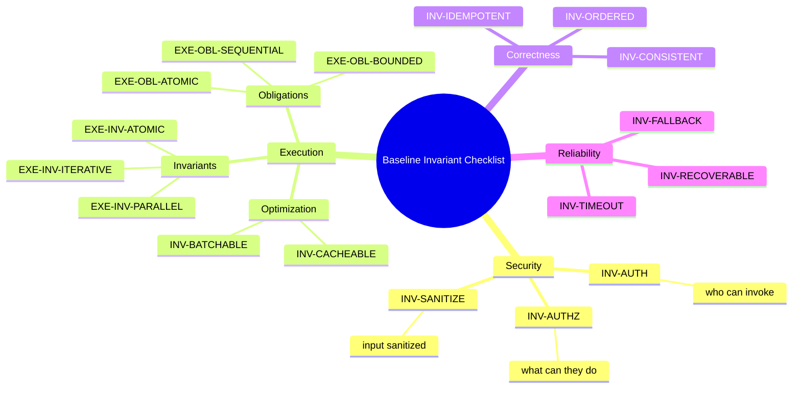

**Execution dimensions** (primes LLM to consider each):

| Dimension | Invariant Examples | Obligation Examples |
|-----------|-------------------|---------------------|
| Amount | atomic, iterative | atomic |
| Parallelism | parallel, sequential | sequential |
| Size | unbounded | bounded |
| Locality | in-memory, local-io, remote-io | (as applicable) |

**Usage during inference:**

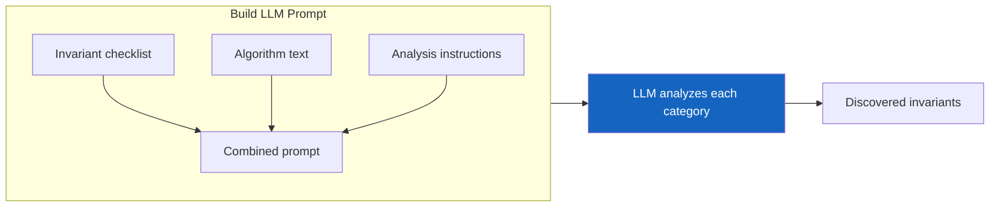

**Prompt includes:** checklist + algorithm content + instructions ("analyze for
invariants, consider each category, don't skip any")

**LLM responds with:** category name, applies (yes/no), invariants found, reasoning

**Why a checklist vs. exhaustive enumeration:**

The checklist contains **exemplar invariants** per category. These prime the LLM
to extend the pattern—seeing "Is input sanitized?" naturally leads to
considering output escaping, even if not listed.

The document grows only when the LLM consistently misses a specific invariant pattern. Start minimal, add when priming fails.

### Step 1.7: Infer Capability Profiles

Each capability (CAP) accumulates a profile through graph derivation and LLM inference.

#### Entity Relationships and Provider Terminology

Before inferring profiles, understand who provides what:

```mermaid
erDiagram
    COM ||--|| SUR : "owns"
    COM ||--o{ ALG : "has"
    ALG ||--|| CON : "has contract"
    SUR ||--o{ CON : "exposes"
    CON ||--o{ CAP : "expresses"
    CAP ||--o{ CAP : "supports"

    ALG {
        id "ALG-XX"
        _ "provides responsibilities (patterns from vocabulary)"
        _ "owns implementation invariants"
    }
    CON {
        id "CON-XX"
        _ "provides capabilities to callers"
        _ "owns obligations (requirements on callers)"
        _ "owns interface invariants"
    }
    CAP {
        id "CAP-XX"
        _ "accumulates findings from providers"
    }
```

**Provider terminology:**

| Entity | Provides | To |
|--------|----------|-----|
| ALG | Responsibilities (patterns from vocabulary) | CAP (via its CON) |
| CON | Capabilities | Callers (via SUR exposure) |

**Key distinction:**

* **Invariants** = self-constraints (owned by entity, applied to itself)
* **Obligations** = requirements on others (owned by entity, applied to
  foreign entities)
* Both live on CON (contracts)

#### How Step 1.6 Feeds Into Step 1.7

The baseline invariant checklist from Step 1.6 primes the LLM when analyzing each capability:

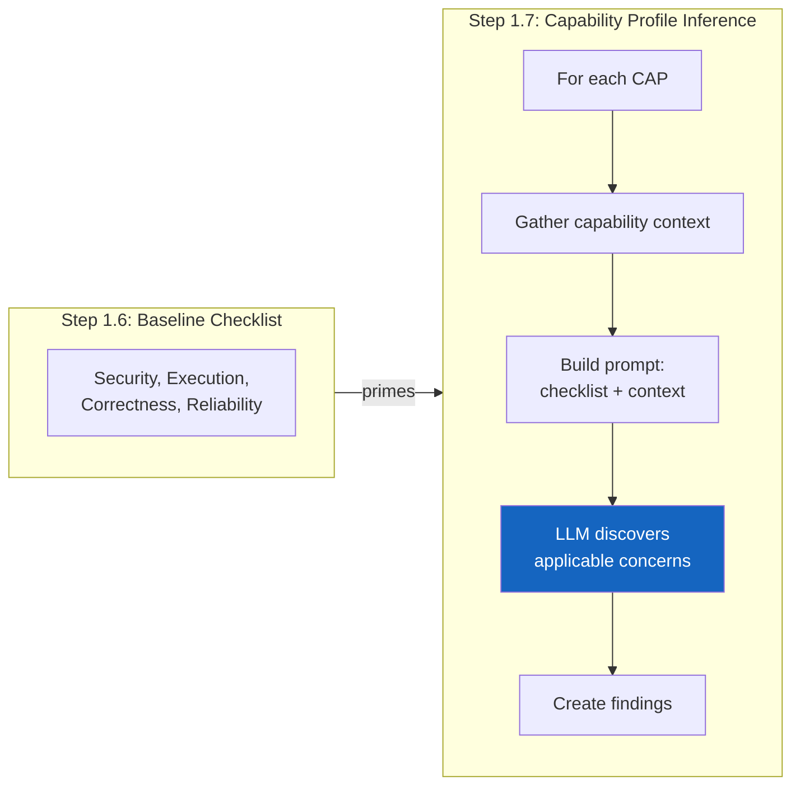

**What "capability context" means:**

* Which CONs express this capability (graph structure)
* Which ALGs own those CONs (ownership chain)
* What responsibilities those ALGs have (from Step 1.5)
* What obligations those CONs declare (from Step 1.5)

#### Capability Profile as Findings

A capability profile is **not a fixed schema**. It's a collection of
**findings**—each discovered property is its own record:

```mermaid
erDiagram
    CAP ||--o{ FINDING : "has"

    CAP {
        id "CAP-XX"
    }

    FINDING {
        source "derived or inferred"
        category "structure, responsibility, invariant, execution, optimization"
        key "what was found"
        value "the discovered property"
    }
```

**Derived findings** (from graph structure—deterministic):

| Key | How Derived |
|-----|-------------|
| expressed_by | Collect all CONs with `CON → CAP` edges |
| responsibility_signature | Union of patterns from ALGs that own those CONs |
| required_invariants | Union of invariants from those CONs |

**Inferred findings** (LLM discovers via checklist—open-ended):

| Key | What LLM Discovers |
|-----|-------------------|
| execution_obligations | EXE-OBL-* that apply (e.g., EXE-OBL-ATOMIC) |
| batchable | Whether INV-BATCHABLE applies |
| cacheable | Whether INV-CACHEABLE applies |
| (other) | Domain-specific concerns not predetermined |

#### The Inference Algorithm

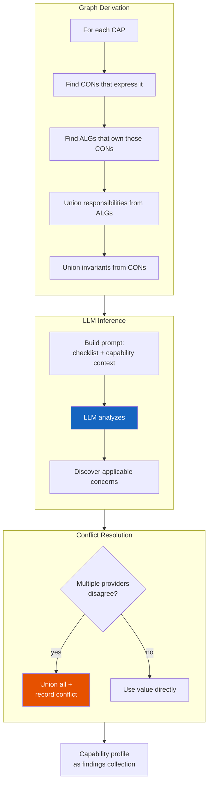

**What "providers disagree" means:**

Example: CAP-01 is expressed by CON-A (owned by ALG-A) and CON-B (owned by ALG-B)
* ALG-A has responsibility signature {walker: 2}
* ALG-B has responsibility signature {walker: 1, validator: 1}
* Resolution: Union all → {walker: 3, validator: 1} + record conflict for review

#### Examples

**File-reading capability (CAP-FILE-READ):**

| Finding | Source | Category | Value |
|---------|--------|----------|-------|
| expressed_by | derived | structure | [CON-05, CON-08] |
| responsibility_signature | derived | responsibility | {walker: 2, validator: 1} |
| required_invariants | derived | invariant | [INV-PATH-EXISTS] |
| batchable | inferred | optimization | true |
| cacheable | inferred | optimization | true |
| execution_obligations | inferred | execution | [EXE-OBL-ATOMIC] |

**Database-write capability (CAP-DB-WRITE):**

| Finding | Source | Category | Value |
|---------|--------|----------|-------|
| expressed_by | derived | structure | [CON-12] |
| responsibility_signature | derived | responsibility | {mutator: 1, validator: 1} |
| required_invariants | derived | invariant | [INV-TRANSACTIONAL] |
| batchable | inferred | optimization | true |
| cacheable | inferred | optimization | false |
| execution_obligations | inferred | execution | [EXE-OBL-ATOMIC, EXE-OBL-SEQUENTIAL] |

#### Capability Change Detection

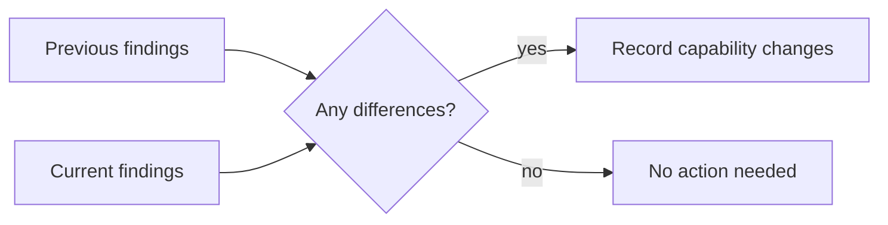

These profiles are used by the [Algorithm Enhancer](../algorithm%20enhancer/feedback.md)
to detect optimization opportunities.

### Step 2: Build Edge Types

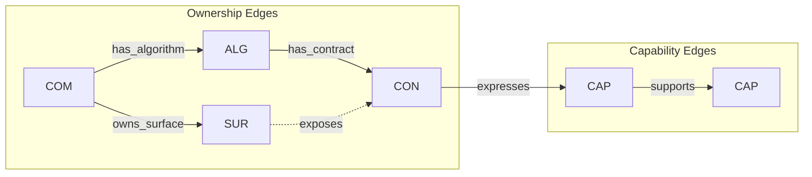

| Category | Edge Type | Description |
|----------|-----------|-------------|
| Structural | owns_surface | `COM → SUR` (component owns its surface) |
| Structural | has_algorithm | `COM → ALG` (component owns algorithms) |
| Structural | has_contract | `ALG → CON` (algorithm owns its contract, 1:1) |
| Structural | exposes | `SUR → CON` (surface exposes contracts, refs) |
| Capability | expresses | `CON → CAP` (contract exposes capability to callers) |
| Capability | supports | `CAP → CAP` (capability composition/dependency) |
| Relational | contract_edge | Interface boundary (contract_id, direction, signature) |
| Relational | storage_edge | Access to component with storage invariant (read/write/read_write) |
| Relational | composition_edge | Parent-child in hierarchy |
| Relational | call_edge | Direct invocation (not via contract) |

**Supports edge semantics:** `supports` edges represent capability composition or
dependency, not hierarchy. They do not imply transitive expression—if `CAP-A
supports CAP-B`, a contract expressing `CAP-A` does not automatically express
`CAP-B`.

### Step 3: Extract Contract Properties

For each contract (CON), extract or derive:

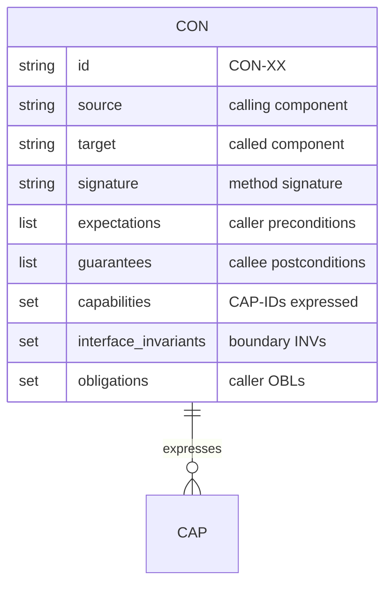

| Group | Fields | Source |
|-------|--------|--------|
| Identity | id, source, target, signature | Parsed |
| Contract | expectations, guarantees | Parsed |
| Capabilities | capabilities | Inferred (Step 1.5) |
| Constraints | interface_invariants, obligations | Inferred (Step 1.5) |
| Barrier | satisfies, passes, absorbs | Inferred (Pass 2) |

**Exposure semantics:** A capability is *exposed* if its contract is in
`SUR.exposed_contracts`. Internal-only capabilities exist on contracts not
referenced by any surface. This distinction enables ExposureLoad computation.

---

## Invariant Decoration

Once the structural graph exists, we decorate it with propagated invariants. This happens in two passes.

### Pass 1: Top-Down Cascade

Starting from root components, push invariants down through the graph:

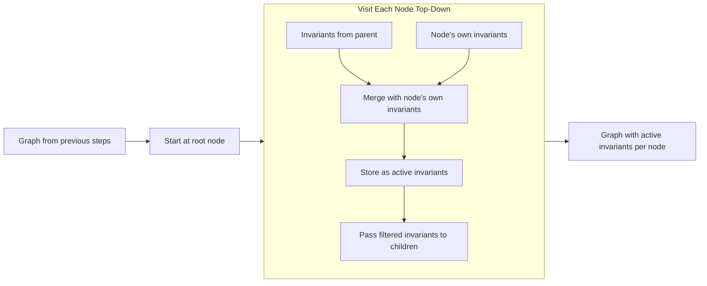

### Pass 2: Bottom-Up Demand Propagation

When a component demands something (via obligation), bubble up:

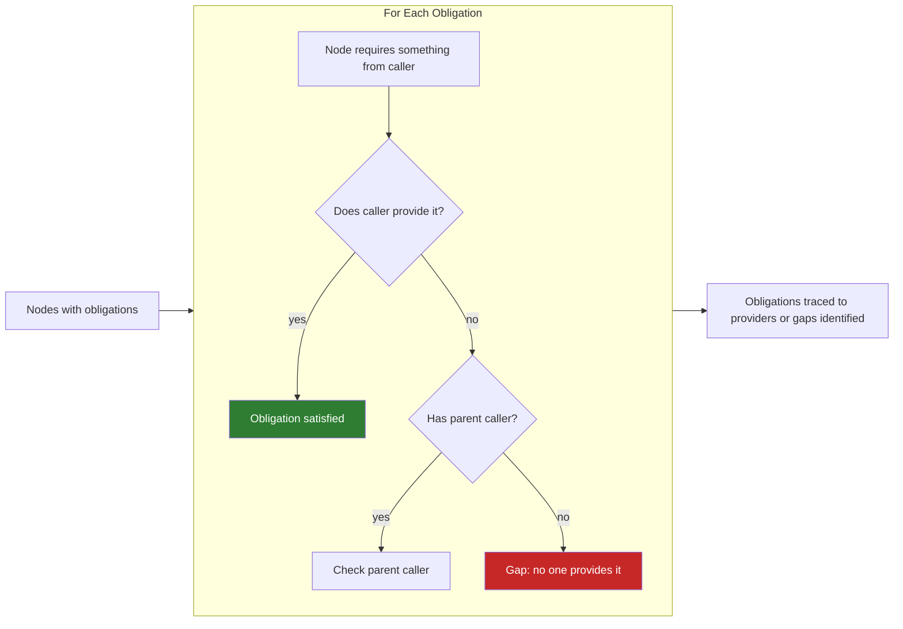

### Pass 3: Execution Invariant Propagation (Top-Down)

Execution invariants describe **how** a component is being called. This propagates
downward from callers to callees, and surfaces can transform the execution
context.

**Example Execution Invariants:**

| Execution Invariant | Meaning | Transforms To |
|---------------------|---------|---------------|
| `EXE-INV-PARALLEL` | Concurrent invocations | ITERATIVE (via queue) or ATOMIC (via lock) |
| `EXE-INV-ITERATIVE` | Sequential loop | ATOMIC (via batching) |
| `EXE-INV-ATOMIC` | Single isolated call | — (terminal) |

**Example Transformation Rules:**

| From | Via | To |
|------|-----|------|
| PARALLEL | queue, pool | ITERATIVE |
| PARALLEL | lock | ATOMIC |
| ITERATIVE | batch, collect | ATOMIC |
| ATOMIC | (none) | terminal |

**Propagation:**

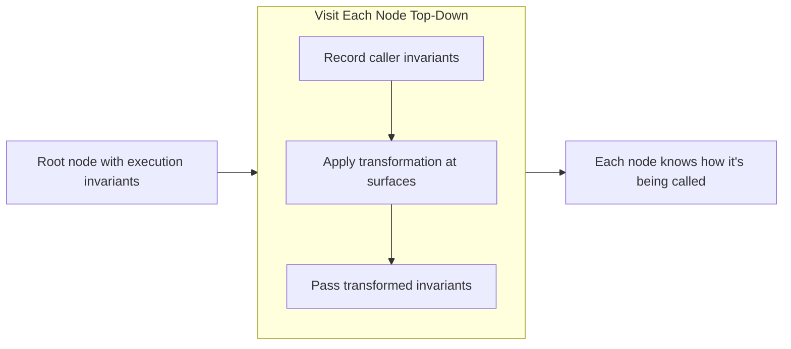

**Example flow:**

| Step | Component | Execution Invariant | Transforms Via |
|------|-----------|---------------------|----------------|
| 1 | COM-01 Orchestrator | EXE-INV-PARALLEL | — |
| 2 | CON-01 | receives EXE-INV-PARALLEL | queue |
| 3 | COM-02 Worker | EXE-INV-ITERATIVE | — |
| 4 | CON-02 | receives EXE-INV-ITERATIVE | batch |
| 5 | COM-03 FileWriter | EXE-INV-ATOMIC ✓ | — |

**Invariant collision detection:**

When a component receives execution invariants that don't match its requirements, this is flagged for the [Bug Finder](../algorithm%20bug%20finder/feedback.md):

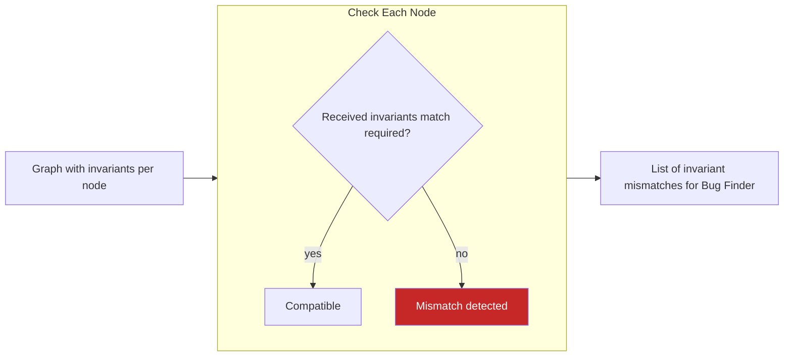

### Pass 4: Demand-Driven Invariant Collection (Bottom-Up Pull)

The baseline checklist and top-down cascade may not capture all invariants
needed. When a downstream component has **risk-inducing capabilities**, it may
need invariants that weren't previously collected.

This pass traces **back up** to collect missing invariants on demand.

**The Problem:**

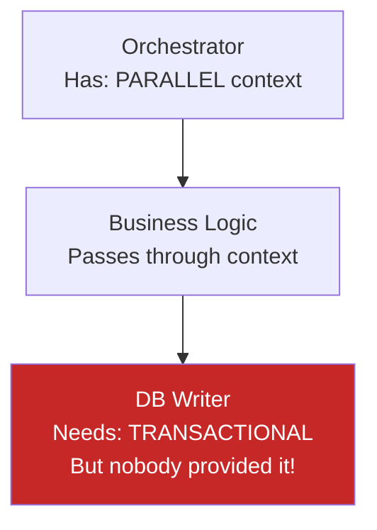

### The Solution: Demand-Driven Pull

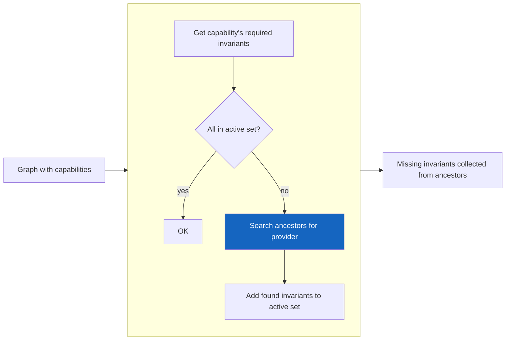

*Repeats for each CAP the current node expresses (for a COM, this is
COM.provided_capabilities, derived from edges).*

**trace_back function:**

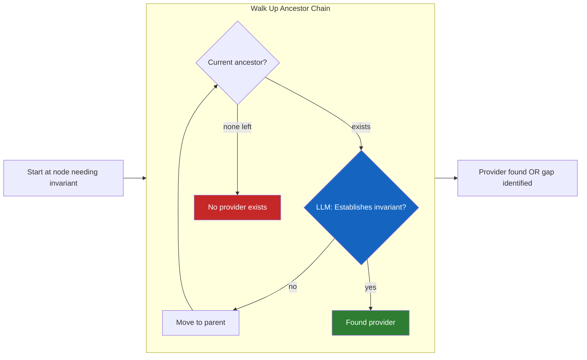

**LLM-Assisted Invariant Query:**

When tracing back, if an ancestor doesn't explicitly declare the invariant, the LLM can infer it:

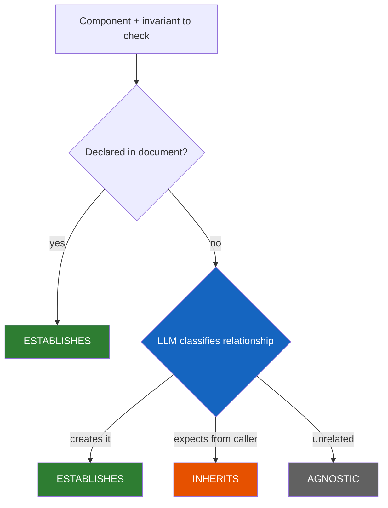

LLM determines if component: ESTABLISHES (creates invariant), INHERITS (expects
from callers), or AGNOSTIC (doesn't interact).

**Example Flow:**

```mermaid
flowchart LR
    subgraph TRACE[1. Search Up]
        direction TB
        C3["DB Writer needs TRANSACTIONAL"]:::need
        C3 -->|"inherits"| C2["Business Logic"]:::neutral
        C2 -->|"inherits"| C1["Orchestrator: ESTABLISHES ✓"]:::success
    end

    TRACE -.-> PROPAGATE

    subgraph PROPAGATE[2. Propagate Down]
        direction TB
        P1["Orchestrator"]:::success --> P2["Business Logic"] --> P3["DB Writer: satisfied ✓"]:::success
    end

    classDef need fill:#c62828,color:#fff
    classDef neutral fill:#616161,color:#fff
    classDef success fill:#2e7d32,color:#fff
```

**Invariant Gaps:**

After all trace_back attempts, some invariants may still be missing because no ancestor provides them:

```mermaid
flowchart LR
    IN[Graph after trace_back] --> SCAN

    subgraph SCAN[Check Each Capability]
        direction TB
        A[Compare: what capability needs vs what node has] --> B{Any unmet requirements?}
        B -->|no| C[Fully satisfied]
        B -->|yes| D[Create gap record]:::error
    end

    SCAN --> OUT[List of invariants no one provides]

    classDef error fill:#c62828,color:#fff
```

An `InvariantGap` contains: invariant type, demanding component, searched path, and recommendation.

**Connection to Capability Profiles:**

The `requires_invariants` field on `CapabilityProfile` (defined in Step 1.7)
drives this pass. When a capability declares required invariants, Pass 4 ensures
they're collected from ancestors.

See Step 1.7 for example profiles with `requires_invariants`.

**Feedback Loop:**

This creates a complete feedback system:

```mermaid
flowchart LR
    P1[Pass 1: Push invariants down]:::down --> P2[Pass 2: Bubble demands up]:::up
    P2 --> P3[Pass 3: Push context down]:::down
    P3 --> P4[Pass 4: Pull missing up]:::up
    P4 --> P5[Pass 5: Save to files]:::save

    classDef down fill:#2e7d32,color:#fff
    classDef up fill:#e65100,color:#fff
    classDef save fill:#1565c0,color:#fff
```

Capability profiles drive Pass 4: they declare what's needed, trace back to collect, and report gaps.

---

### Pass 5: Persistence & Incremental Recomputation

Discovered data must be **persisted back to source files**. This makes the graph
creator incremental — only recompute what changed.

```mermaid
flowchart TB
    subgraph PERSIST[What Gets Persisted]
        direction LR
        ALG_P[ALG: impl_invariants, responsibilities]
        CON_P[CON: interface_invariants, obligations, capabilities, barrier]
        SUR_P[SUR: exposed_contracts]
        CAP_P[CAP: profiles, supports edges]
    end

    subgraph DOCS[Document Structure]
        direction TB
        REQ[Requirements doc] --> COM_DOC[Component docs]
        COM_DOC --> ALG_DOC[Algorithm sections]
        ALG_DOC --> CON_DOC[Contract sections]
    end

    PERSIST --> DOCS
```

**Document Hierarchy:**

| Document | Contains | Review Level |
|----------|----------|--------------|
| Requirements doc | Canonical invariants, global IDs, system-level constraints | Tightly reviewed |
| Component docs | COM metadata, SUR.exposed_contracts | Standard review |
| Algorithm sections | ALG.impl_invariants, ALG.responsibilities | Standard review |
| Contract sections | CON.interface_invariants, CON.obligations, CAP | Standard review |
| Capability cache | CAP profiles, supports edges | Auto-generated |

**What Gets Persisted (by node type):**

| Node | Fields | Location |
|------|--------|----------|
| ALG | impl_invariants, responsibilities | Algorithm section in component doc |
| CON | interface_invariants, obligations, capabilities | Contract section in component doc |
| CON | satisfies, passes, absorbs | Contract section (barrier) |
| SUR | exposed_contracts | Component doc header |
| CAP | profiles (semantic, batchable, etc.) | Capability cache |
| CAP | supports edges | Capability cache |

**Algorithm Persistence Format:**

```markdown
## ALG-05: ScheduleFiles

<!-- AUTO-GENERATED -->
<!-- Hash: a3f2b1c... -->

### Implementation Invariants
- INV-48: Produces sorted results
- INV-49: Operates in loop context

### Responsibilities
- walker: 2
- validator: 1
```

**Contract Persistence Format:**

```markdown
## CON-05: ScheduleFiles Contract

<!-- AUTO-GENERATED -->
<!-- Hash: b4c3d2e... -->

### Interface
* CAP-12: File discovery
* CAP-13: Path validation
* OBL-05: Valid path input required
* INV-50: Returns normalized paths

### Barrier Properties
* SATISFIES: INV-07 (thread safety via internal lock)
* PASSES: INV-02, INV-48
* ABSORBS: INV-15 (async context not relevant here)
```

**Surface Persistence Format:**

```markdown
## SUR-05: SchedulingDomain Surface

### Exposed Contracts
* CON-05: ScheduleFiles
* CON-06: ValidatePaths
```

**Capability Cache Format:**

```yaml
# .tasks/cache/capabilities/CAP-12.yaml
id: CAP-12
semantic: file_io
batchable: true
cacheable: true
execution_obligations:
  - EXE-OBL-ATOMIC
requires_invariants:
  - INV-03
responsibility_signature:
  walker: 2
  validator: 1
expressed_on:
  - CON-05
  - CON-08
supports:
  - CAP-14
  - CAP-15
```

**Global ID Assignment:**

```mermaid
flowchart LR
    IN[Load all docs] --> COLLECT[Collect all existing IDs]
    COLLECT --> NEXT[Determine next available ID per type]
    NEXT --> ASSIGN[Assign IDs to new discoveries]
    ASSIGN --> PERSIST[Write back to docs/cache]
```

**Why Persist:**

| Without Persistence | With Persistence |
|-----|-----|
| Full recomputation every run | Recompute only changed elements |
| LLM inference repeated | LLM inference cached in files |
| Graph exists only in memory | Source of truth in version control |
| No history | Changes tracked in git |

**Change Detection:**

```mermaid
flowchart LR
    IN[All component documents] --> SCAN

    subgraph SCAN[Compare Each Document to Cache]
        direction TB
        A{Previously seen?}
        A -->|no| B[NEW: First time processing]:::new
        A -->|yes| C{Content hash changed?}
        C -->|yes| D[MODIFIED: Needs reprocessing]:::mod
        C -->|no| E[UNCHANGED: Skip]:::same
    end

    SCAN --> OUT[Set of new and modified documents]

    classDef new fill:#2e7d32,color:#fff
    classDef mod fill:#e65100,color:#fff
    classDef same fill:#616161,color:#fff
```

**Incremental Graph Construction:**

```mermaid
flowchart LR
    IN[ChangeSet from detection] --> A{Any changes?}
    A -->|no| B[Return cached graph]:::cache
    A -->|yes| WORK

    subgraph WORK[Process Changes]
        direction TB
        C[Load cached graph] --> D[Find affected nodes: changed + ancestors + descendants]
        D --> E[Re-run LLM inference on affected]:::llm
        E --> F[Re-run propagation passes]
        F --> G[Save updated invariants to files]
    end

    WORK --> OUT[Updated graph]

    classDef cache fill:#616161,color:#fff
    classDef llm fill:#1565c0,color:#fff
```

**recompute_algorithm:**

```mermaid
flowchart LR
    IN[Changed ALG] --> A[Read algorithm text]
    A --> B[LLM infers impl_invariants, responsibilities]:::llm
    B --> C[LLM infers CON: interface_invariants, obligations, capabilities]:::llm
    C --> D[Update CAP profiles for affected capabilities]:::llm
    D --> OUT[Updated ALG + CON + CAP data]

    classDef llm fill:#1565c0,color:#fff
```

**find_affected:**

```mermaid
flowchart LR
    IN[Changed ALG] --> EXPAND

    subgraph EXPAND[Expand to Related Nodes]
        direction TB
        A[ALG changed] --> B[Include owning COM]
        A --> C[Include owned CON]
        C --> D[Include expressed CAPs]
        D --> E[Include CAPs via supports edges]
        B --> F[Include SUR if CON is exposed]
    end

    EXPAND --> OUT[Full set of nodes needing update]
```

**Propagation on Change:**

When an algorithm changes, propagation updates the subgraph:

```mermaid
flowchart TB
    ALG[ALG changed] --> CON[Update CON barrier props]
    CON --> CAP[Update CAP profiles]
    CAP --> SUP[Follow supports edges]
    ALG --> COM[Recompute COM.provided_capabilities]
    COM --> SUR[Update SUR.exposed_contracts if needed]
```

**Cache Structure:**

```bash
.tasks/cache/
├── graph.json
├── hashes/
│   ├── ALG-05.hash
│   ├── CON-05.hash
└── capabilities/
    ├── CAP-12.yaml
```

**Benefits:**

1. **Performance**: Only LLM-infer for changed algorithms
2. **Consistency**: Discovered invariants become part of documentation
3. **Auditability**: Changes tracked in version control
4. **Correctness**: Hash-based detection ensures staleness is caught
5. **Collaboration**: Team sees inferred invariants in readable format

### The Decorated Graph

After all passes, each node type has:

**COM (Component):**

| Source | Field | Description |
|--------|-------|-------------|
| Identity | id, type | `COM` node |
| Derived | provided_capabilities | Union of `CON.capabilities` for exposed `CON` in `SUR` |
| Pass 1 | active_invariants | Inherited + own |

**SUR (Surface):**

| Source | Field | Description |
|--------|-------|-------------|
| Identity | id | `SUR` node |
| Structure | exposed_contracts | List of `CON` refs from component's algorithms |

**ALG (Algorithm):**

| Source | Field | Description |
|--------|-------|-------------|
| Identity | id, type | `ALG` node |
| Inference | impl_invariants | Implementation invariants (internal) |
| Inference | responsibilities | `Multiset[ResponsibilityPattern]` |

**CON (Contract):**

| Source | Field | Description |
|--------|-------|-------------|
| Identity | id, source, target, signature | Contract identity |
| Inference | interface_invariants | Interface invariants (boundary) |
| Inference | obligations | What contract demands from callers |
| Inference | capabilities | What contract offers |
| Barrier | satisfies | Obligations fulfilled here |
| Barrier | passes | Invariants that continue through |
| Barrier | absorbs | Invariants blocked here |
| Pass 3 | receives_invariants | Execution invariants from caller |
| Pass 3 | emits_invariants | Execution invariants after transformation |

**CAP (CapabilityProfile):**

| Source | Field | Description |
|--------|-------|-------------|
| Identity | id | CAP-XX |
| LLM | semantic | file_io, network_io, database_io, cpu_pure, memory_pure, security |
| LLM | batchable | Can multiple calls be combined |
| LLM | cacheable | Can results be reused |
| LLM | execution_obligations | List of EXE-OBL-* (e.g., [EXE-OBL-ATOMIC]) |
| LLM | requires_invariants | Invariants needed for safe operation |
| Derived | responsibility_signature | Union of responsibility patterns from providers |
| Derived | expressed_on | Set of CONs exposing this capability |

**Edges:**

```mermaid
erDiagram
    COM ||--|| SUR : "owns_surface"
    COM ||--o{ ALG : "has_algorithm"
    ALG ||--|| CON : "has_contract"
    SUR ||--o{ CON : "exposes"
    CON ||--o{ CAP : "expresses"
    CAP ||--o{ CAP : "supports"
```

**Derived Indices (computed once, cached):**

| Index | Type | Description |
|-------|------|-------------|
| capability_providers | `Map[CAP → Set[CON]]` | Which contracts express each capability |
| capability_exposure | `Map[CAP → Set[SUR]]` | Which surfaces expose each capability (via their contracts) |
| component_suite | `Map[COM → Set[CAP]]` | All capabilities a component provides (exposed + internal) |
| exposed_suite | `Map[COM → Set[CAP]]` | Only capabilities exposed via SUR |

These indices enable O(1) lookups for decomposition analysis.

---

## Surface Barrier Analysis

Each surface acts as a barrier that can:

1. **SATISFY** - Fulfill an invariant/obligation (stops propagation)
2. **PASS** - Allow invariant to continue to descendants
3. **ABSORB** - Block invariant (not relevant to subtree)

### Determining Barrier Behavior

### Option A: Explicit Declaration in Documents

```markdown
## CON-05 Surface Properties
- Satisfies: INV-THREAD-SAFE (internal lock)
- Passes: INV-DETERMINISTIC, INV-ORDERED
- Absorbs: INV-ASYNC-CONTEXT (this path is sync)
```

### Option B: LLM Inference

When barrier properties aren't explicit, use LLM to infer:

```mermaid
flowchart TB
    A[Surface contract definition] --> LLM{LLM classifies barrier behavior}:::llm
    B[Invariant to classify] --> LLM

    LLM -->|handles it| C[SATISFIES]:::success
    LLM -->|continues through| D[PASSES]:::warn
    LLM -->|blocked here| E[ABSORBS]:::neutral

    classDef llm fill:#1565c0,color:#fff
    classDef success fill:#2e7d32,color:#fff
    classDef warn fill:#e65100,color:#fff
    classDef neutral fill:#616161,color:#fff
```

For each invariant, LLM determines: SATISFIES (contract handles it), PASSES (applies to callees), or ABSORBS (not relevant).

### Option C: Invariant Metadata

Invariants declare their own propagation rules. Example for `INV-PARALLEL-EXEC`:

| Field | Value |
|-------|--------|
| category | concurrency |
| propagates | async_call, thread_spawn |
| absorbed | sync_barrier, sequential |
| satisfied | thread_safe_impl, locks |

---

### Leakage Analysis

For each surface, compute what "leaks" in each direction:

| Direction | Field | Calculation |
|-----------|-------|-------------|
| Outside → Inside | context_leakage | = surface.passes |
| Inside → Outside | demand_leakage | = interior_obligations - surface.satisfies |
| Contained | isolated | = surface.absorbs |

---

## Python/LLM Hybrid Architecture

The graph creator uses a hybrid approach:

| Operation | Handled By | Reason |
|-----------|------------|--------|
| Document parsing | Python | Mechanical, pattern-based |
| Graph construction | Python | Data structure operations |
| ID extraction | Python | Regex on known prefixes |
| Invariant set operations | Python | Set math |
| Propagation traversal | Python | Graph algorithms |
| "Does X satisfy Y?" | LLM | Semantic understanding |
| "What does this surface isolate?" | LLM | Requires understanding meaning |
| Surface barrier inference | LLM | When not explicitly declared |

```mermaid
flowchart LR
    subgraph PY[ ]
        direction TB
        A[Parse documents] --> B[Build graph structure]
        B --> C[Run propagation passes]
    end

    subgraph AI[ ]
        direction TB
        D[Infer implied invariants]:::llm
        E[Determine barrier behaviors]:::llm
        F[Query invariant relationships]:::llm
    end

    PY --> AI --> OUT[Decorated graph]

    classDef llm fill:#1565c0,color:#fff
```

*Left: Python (graph + set operations). Right: LLM (semantic understanding).*

---

## Output: The Decorated Graph

The final output is a fully decorated graph that can be:

1. **Queried** for constraint violations (bug finder)
2. **Sliced** for meaningful algorithm segments (enhancer)
3. **Visualized** for architecture understanding

**Data:** nodes (COM, SUR, ALG, CON, CAP), edges, derived indices, capability_profiles

**Query Methods:**

| Category | Methods |
|----------|---------|
| Invariants | get_active_invariants, get_inherited_obligations, leakage |
| Capabilities | get_capabilities, get_providers, get_exposure |
| Execution | get_execution_invariants, find_mismatches, trace_path |
| Pass 4 | get_invariant_gaps, trace_source |
| Load Metrics | compute_resp_load, compute_exposure_load, constraint_load |
| Overlap Detection | find_identity_overlap, find_semantic_overlap, suite_overlap |

**Load computation signatures:**

```python
compute_resp_load(CAP) -> int
  Returns sum of responsibility_signature counts

compute_exposure_load(CAP) -> int
  Returns: count of surfaces exposing capability

compute_constraint_load(CAP) -> int
  Returns: size of requires_invariants union
```

**Overlap detection signatures:**

```python
find_identity_overlap(COM, COM) -> Set[CAP]
  Returns: capabilities expressed by both

find_semantic_overlap(COM, COM) -> Map[semantic -> Set[CAP]]
  Returns: capabilities grouped by semantic type

find_suite_overlap(COM, COM) -> float
  Returns: Jaccard similarity of suites
```

---

## Usage

The bug finder, component optimizer, and decomposition analyzer all consume this graph:

```mermaid
flowchart LR
    IN[Component documents] --> GRAPH[Decorated Graph]

    GRAPH --> BUG[Bug Finder]:::consumer
    GRAPH --> ENH[Enhancer]:::consumer
    GRAPH --> DEC[Decomposer]:::consumer

    BUG --> V[Constraint violations]:::output
    ENH --> O[Optimization opportunities]:::output
    DEC --> P[Decomposition candidates]:::output

    classDef consumer fill:#1565c0,color:#fff
    classDef output fill:#7b1fa2,color:#fff
```

| Consumer | Uses | Output |
|----------|------|--------|
| BugFinder | get_active_invariants, get_invariant_gaps | List[Violation] |
| Enhancer | get_execution_invariants, find_mismatches | List[OptimizationOpportunity] |
| Decomposer | compute_*_load, find_*_overlap, component_suite | List[DecompositionCandidate] |
