# Algorithm Graph Creator

## Purpose

Creates a runtime graph representation of the distributed algorithm architecture. This graph serves as the foundation for both **bug finding** (constraint violation detection) and **algorithm enhancement** (meaningful slice extraction).

The graph is computed at analysis time from the component documents. It does not modify the source documents—invariant propagation and decoration exist only in the runtime environment.

---

## Input: The ID System

The architecture uses a comprehensive ID system that the graph creator parses:

| ID Prefix | Meaning | Example |
|-----------|---------|---------|
| `COM-XX` | Component | `COM-05` (SchedulingDomain) |
| `ALG-XX` | Algorithm (paired with COM) | `ALG-05` |
| `INV-STORES-XX` | Storage invariant (component persists data) | `INV-STORES-04` (FileRegistry) |
| `CTX-XX` | Context (transient data) | `CTX-03` (ScheduleRequest) |
| `ART-XX` | Artifact (operational metadata) | `ART-01` (CLI arguments) |
| `CON-XX` | Contract/Surface (boundary between components) | `CON-05` |
| `INV-XX` | Invariant (correctness constraint) | `INV-02` (deterministic ordering) |
| `OBL-XX` | Obligation (demanded behavior) | `OBL-20` (strict serial access) |
| `SET-XX` | Setting/Context (execution environment) | `SET-05` (parallel execution) |
| `CAP-XX` | Capability (feature/responsibility) | `CAP-03` (file discovery) |

**Note on Invariants vs Capabilities:**

| Aspect | Invariants (INV/OBL) | Capabilities (CAP) |
|--------|----------------------|-------------------|
| What | Behavioral constraints | Feature responsibilities |
| Question | "What must always be true?" | "What does this component do?" |
| Example | "Output must be sorted" | "Sorts input data" |
| Use | Bug finding, constraint preservation | Decomposition, architecture |

---

## Graph Construction

### Step 1: Parse All Component Documents

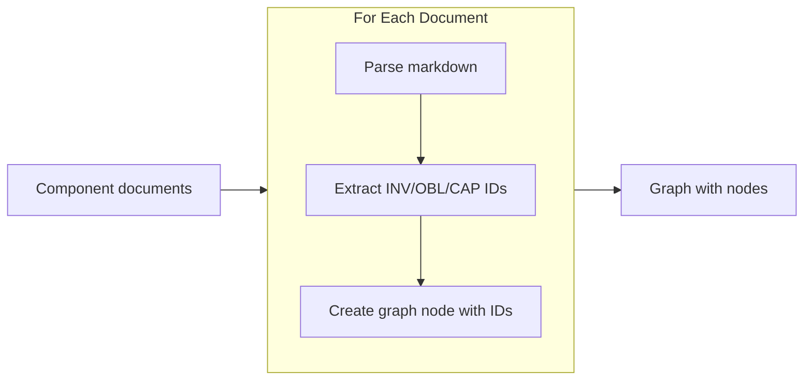

**IDs extracted from each document:**

| Prefix | Stored As |
|--------|-----------|
| INV- | declared_invariants |
| OBL- | declared_obligations |
| CAP- | declared_capabilities |
| INV-STORES- | storage_invariants |
| CON- (out) | contracts_provided |
| CON- (in) | contracts_consumed |

### Step 1.5: Infer Implicit Invariants and Capabilities

The graph creator does not rely solely on declared invariants and capabilities. The LLM analyzes algorithm content and **infers** what the code implies but wasn't explicitly declared.

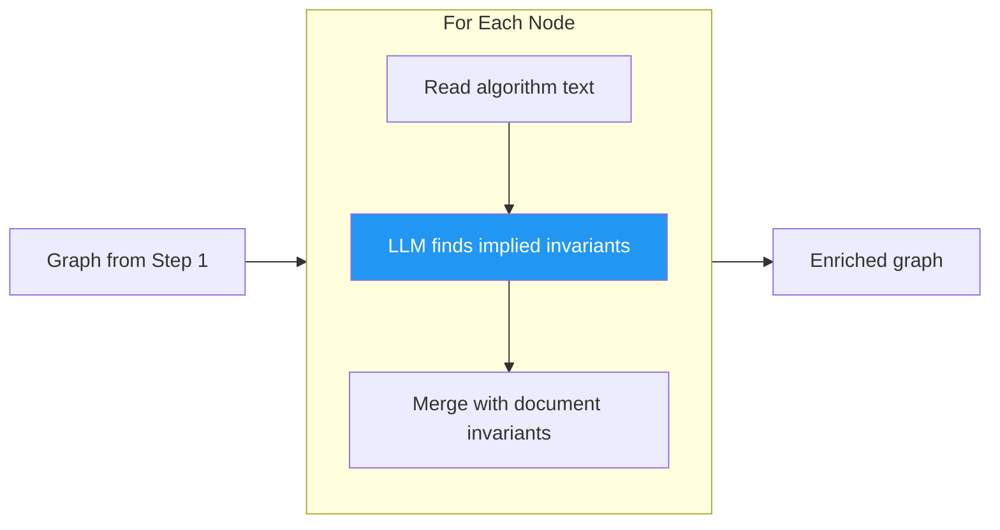

For each node, the LLM infers invariants, obligations, and capabilities from the algorithm content. These are unioned with declared values to produce `own_invariants`, `own_obligations`, and `own_capabilities`.

**Example:** Given algorithm content like `discover_files → sort results → validate each`, the LLM infers INV-ORDERED-OUTPUT, OBL-VALID-PATH, and CAP-FILE-DISCOVERY. These get added to own_invariants, own_obligations, and own_capabilities.

### Step 1.6: Baseline Invariant Checklist

To ensure critical invariants are never overlooked, the LLM uses a **baseline checklist** during inference. This primes comprehensive analysis without requiring exhaustive enumeration.

| Category | Invariants to Check |
|----------|---------------------|
| **security** | INV-AUTH (who can invoke), INV-AUTHZ (what can they do), INV-SANITIZE (input sanitized) |
| **optimization** | INV-CTX-PARALLEL, INV-CTX-ITERATIVE, INV-CTX-ATOMIC, INV-BATCHABLE, INV-CACHEABLE |
| **correctness** | INV-IDEMPOTENT, INV-CONSISTENT, INV-ORDERED |
| **reliability** | INV-TIMEOUT, INV-FALLBACK, INV-RECOVERABLE |

**Usage during inference:**

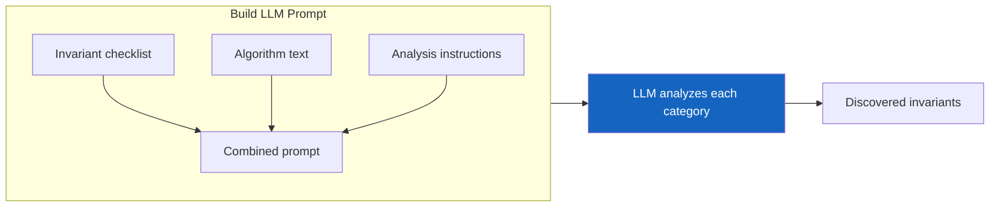

**Prompt includes:** checklist + algorithm content + instructions ("analyze for invariants, consider each category, don't skip any")

**LLM responds with:** category name, applies (yes/no), invariants found, reasoning

**Why a checklist vs. exhaustive enumeration:**

The checklist contains **exemplar invariants** per category. These prime the LLM to extend the pattern—seeing "Is input sanitized?" naturally leads to considering output escaping, even if not listed.

The document grows only when the LLM consistently misses a specific invariant pattern. Start minimal, add when priming fails.

### Step 1.7: Infer Capability Profiles

Each capability carries **optimization metadata** describing its performance characteristics:

| Field | Description |
|-------|-------------|
| id | CAP-XX identifier |
| semantic | file_io, network_io, database_io, cpu_pure, memory_pure |
| batchable | Can multiple calls be combined? |
| cacheable | Can results be reused? |
| optimal_context | ATOMIC, ITERATIVE, or PARALLEL |
| requires_invariants | Invariants needed for safe operation |

**Inference during graph construction:**

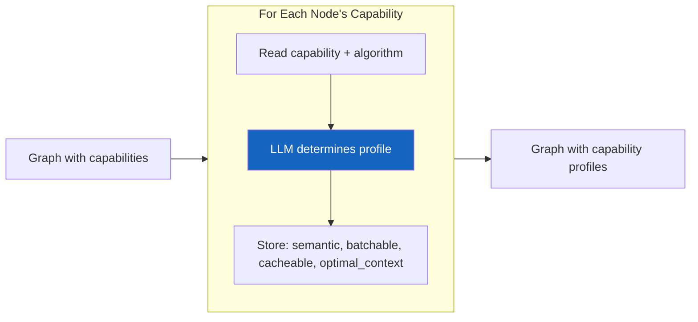

The LLM determines: semantic type, batchable, cacheable, and optimal context for each capability.

**Example profiles:**

| Capability | semantic | batch | cache | optimal | requires |
|------------|----------|-------|-------|---------|----------|
| CAP-FILE-READ | file_io | ✓ | ✓ | ATOMIC | INV-PATH-EXISTS |
| CAP-HASH-COMPUTE | cpu_pure | ✗ | ✓ | PARALLEL | — |
| CAP-DB-WRITE | database_io | ✓ | ✗ | ATOMIC | INV-TRANSACTIONAL |
| CAP-AUTH-CHECK | security | ✗ | ✓ | ATOMIC | INV-AUTH-CONTEXT |

These profiles are used by the [Algorithm Enhancer](../algorithm%20enhancer/feedback.md) to detect optimization opportunities.

**Capability inference during algorithm updates:**

When algorithms are modified, the LLM identifies NEW capabilities introduced:

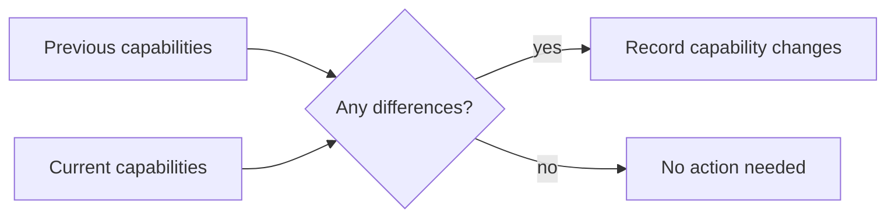

### Step 2: Build Edge Types

The graph has multiple edge types:

| Edge Type | Description |
|-----------|-------------|
| contract_edge | Interface boundary (contract_id, direction, signature) |
| storage_edge | Access to component with storage invariant (read/write/read_write) |
| composition_edge | Parent-child in hierarchy |
| call_edge | Direct invocation (not via contract) |

### Step 3: Extract Surface Properties

For each contract (surface), extract:

| Group | Fields |
|-------|--------|
| Identity | id (CON-XX), source, target, signature |
| Contract | expectations, guarantees |
| Barrier | satisfies, passes, absorbs |

---

## Invariant Decoration

Once the structural graph exists, we decorate it with propagated invariants. This happens in two passes.

### Pass 1: Top-Down Cascade

Starting from root components, push invariants down through the graph:

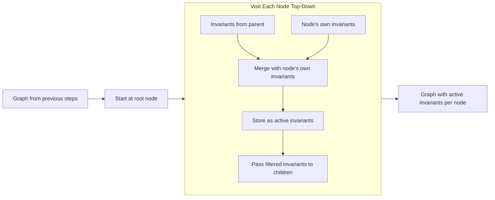

### Pass 2: Bottom-Up Demand Propagation

When a component DEMANDS something (via obligation), bubble up:

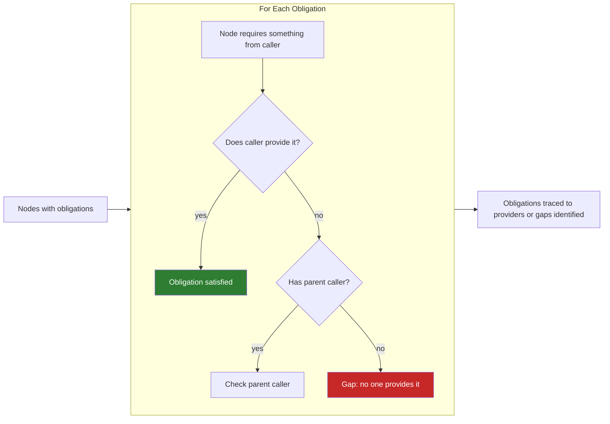

### Pass 3: Operational Context Propagation (Top-Down)

Operational context describes **how** a component is being called. This propagates downward from callers to callees, and surfaces can **flatten** the context.

**Example Context Types:**

| Context | Meaning | Flattens To |
|---------|---------|-------------|
| `INV-CTX-PARALLEL` | Concurrent invocations | ITERATIVE (via queue) or ATOMIC (via lock) |
| `INV-CTX-ITERATIVE` | Sequential loop | ATOMIC (via batching) |
| `INV-CTX-ATOMIC` | Single isolated call | — (terminal) |

**Example Flattening Rules:**

| From | Via | To |
|------|-----|-----|
| PARALLEL | queue, pool | ITERATIVE |
| PARALLEL | lock | ATOMIC |
| ITERATIVE | batch, collect | ATOMIC |
| ATOMIC | — | terminal |

**Propagation:**

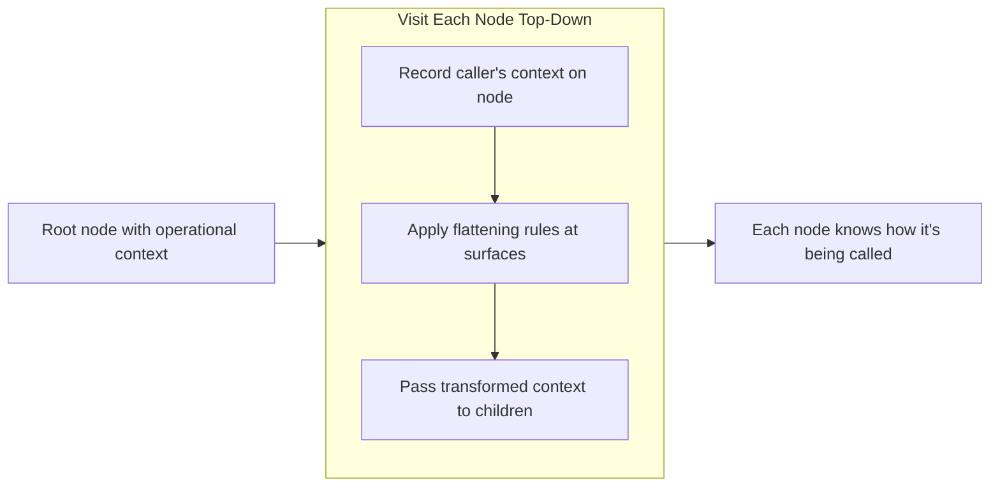

**Example flow:**

| Step | Component | Context | Flattens Via |
|------|-----------|---------|--------------|
| 1 | COM-01 Orchestrator | PARALLEL | — |
| 2 | CON-01 | receives PARALLEL | queue |
| 3 | COM-02 Worker | ITERATIVE | — |
| 4 | CON-02 | receives ITERATIVE | batch |
| 5 | COM-03 FileWriter | ATOMIC ✓ | — |

**Context collision detection:**

When a component receives context that doesn't match its requirements, this is flagged for the [Bug Finder](../algorithm%20bug%20finder/feedback.md):


### Pass 4: Demand-Driven Invariant Collection (Bottom-Up Pull)

The baseline checklist and top-down cascade may not capture all invariants needed. When a downstream component has **risk-inducing capabilities**, it may need invariants that weren't collected.

This pass traces **back up** to collect missing invariants on demand.

**The Problem:**

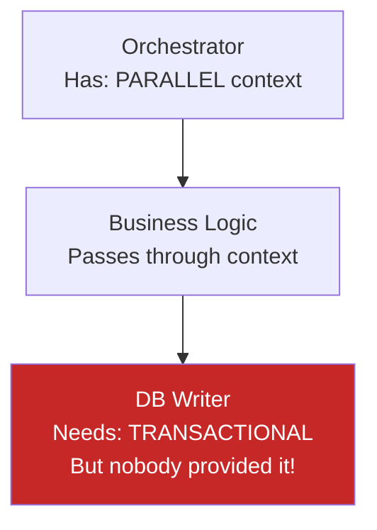

**The Solution: Demand-Driven Pull**

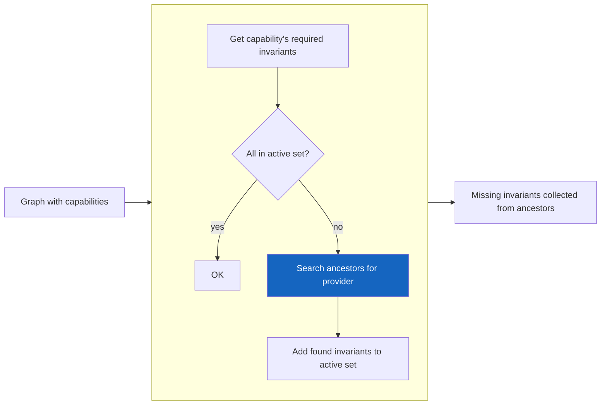

*Repeats for each capability on each node.*

**trace_back function:**

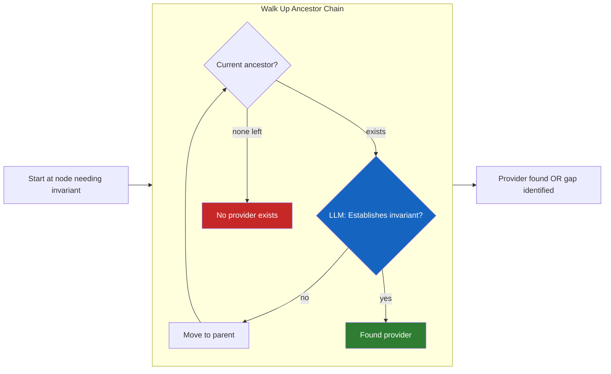

**LLM-Assisted Invariant Query:**

When tracing back, if an ancestor doesn't explicitly declare the invariant, the LLM can infer it:

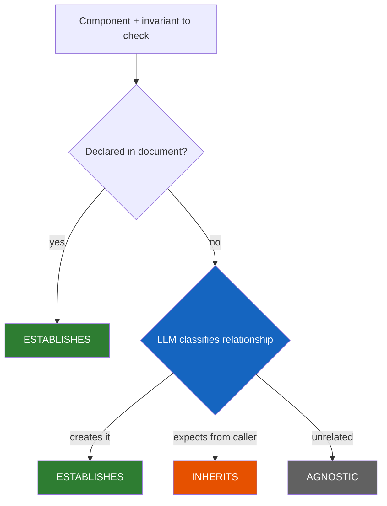

LLM determines if component: ESTABLISHES (creates invariant), INHERITS (expects from callers), or AGNOSTIC (doesn't interact).

**Example Flow:**

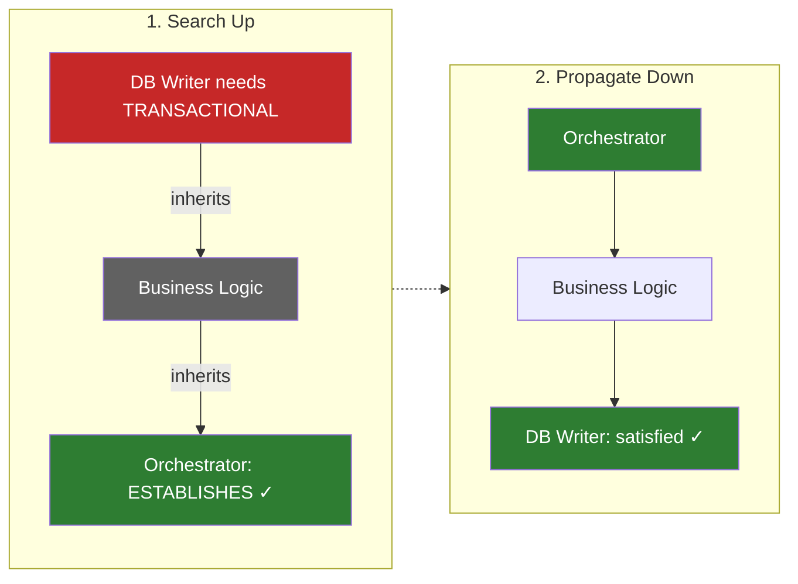

**Invariant Gaps:**

After all trace_back attempts, some invariants may still be missing because no ancestor provides them:

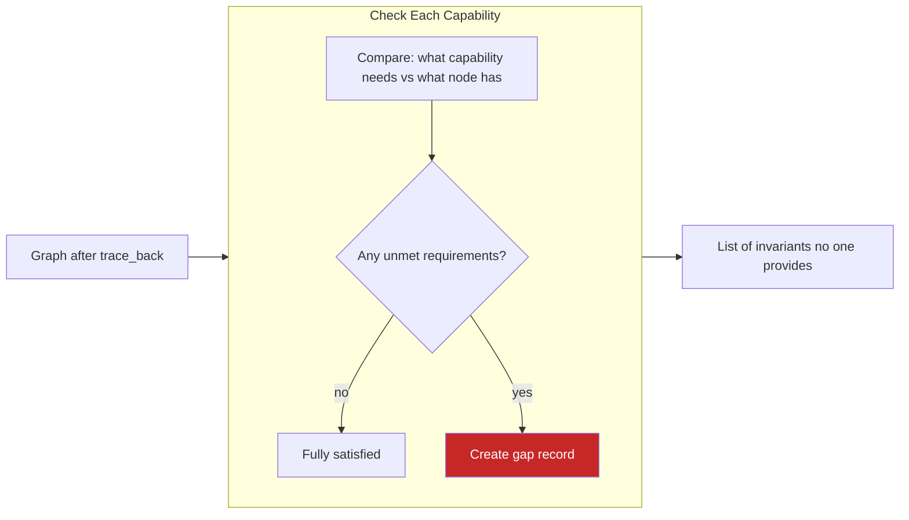

An `InvariantGap` contains: invariant type, demanding component, searched path, and recommendation.

**Connection to Capability Profiles:**

The `requires_invariants` field on `CapabilityProfile` (defined in Step 1.7) drives this pass. When a capability declares required invariants, Pass 4 ensures they're collected from ancestors.

See Step 1.7 for example profiles with `requires_invariants`.

**Feedback Loop:**

This creates a complete feedback system:


Capability profiles drive Pass 4: they declare what's needed, trace back to collect, and report gaps.

---

### Pass 5: Invariant Persistence & Incremental Recomputation

Discovered invariants must be **persisted back to source files**. This makes the graph creator incremental — only recompute what changed.

**Document Hierarchy:**

| Document | Contents | Review Level |
|----------|----------|--------------|
| Requirements doc | Canonical invariants, global IDs, system-level constraints | Tightly human-reviewed |
| Component docs | References to requirements + LLM-discovered invariants | Standard review |
| Surface docs | Contract properties (SATISFIES/PASSES/ABSORBS) | Standard review |

**Global ID Assignment:**

Since all documents are loaded into memory during graph construction, IDs are globally coordinated:


- Requirements doc invariants: Human-assigned IDs (INV-01, INV-02, etc.)
- Component discoveries: Get next sequential ID (if highest is INV-47, new gets INV-48)
- Surface properties: Reference existing invariant IDs

**Why Persist:**

| Without Persistence | With Persistence |
|---------------------|------------------|
| Full recomputation every run | Only recompute changed elements |
| LLM inference repeated for unchanged code | LLM inference cached in files |
| Invariants exist only in runtime graph | Invariants are source of truth |
| No history of discovered invariants | Changes tracked in version control |

**What Gets Persisted:**

| Location | Fields |
|----------|--------|
| Requirements doc | Canonical invariants with global IDs |
| Component docs | Referenced invariants, discovered invariants, capability profiles |
| Surface docs | SATISFIES, PASSES, ABSORBS classifications |
| Metadata | algorithm_hash, surface_hash, last_computed |

**Component Persistence Format:**

```markdown
## COM-05: SchedulingDomain

### References (from requirements)
- INV-02: Deterministic ordering
- OBL-05: Valid path input

### Discovered
<!-- AUTO-GENERATED -->
<!-- Algorithm hash: a3f2b1c... -->
- INV-48: Produces sorted results
- INV-49: Operates in loop context
- CAP-12: File discovery

### Capability Profiles
<!-- AUTO-GENERATED -->
CAP-12:
  semantic: file_io
  batchable: true
  optimal_context: ATOMIC
  requires_invariants: [INV-03]
```

**Surface Persistence Format:**

```markdown
## CON-05: SchedulingDomain → FileWriter

### Barrier Properties
<!-- AUTO-GENERATED -->
<!-- Surface hash: b4c3d2e... -->
- SATISFIES: INV-07 (thread safety via internal lock)
- PASSES: INV-02, INV-48
- ABSORBS: INV-15 (async context not relevant here)
```

**Change Detection:**

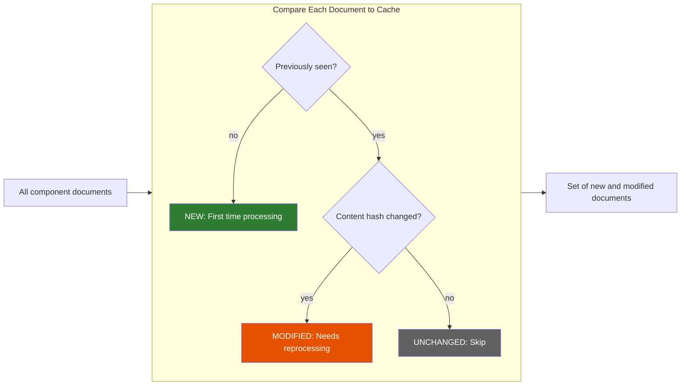

**Incremental Graph Construction:**

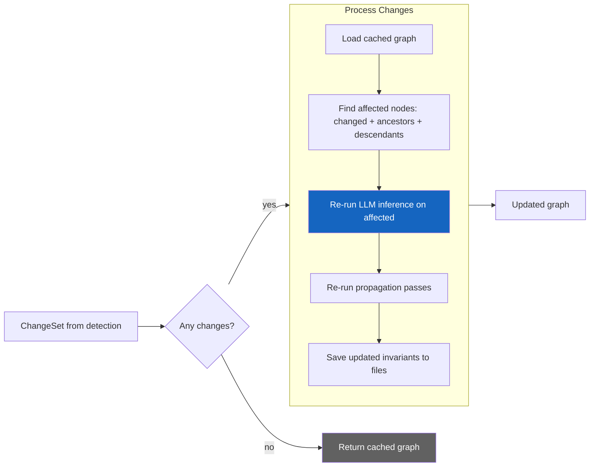

**recompute_component:**

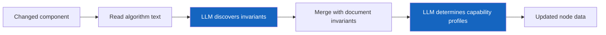

**find_affected:**

```mermaid
flowchart LR
    IN[Changed nodes] --> EXPAND

    subgraph EXPAND[Expand to Related Nodes]
        direction TB
        A[Each changed node] --> B[Add all ancestors above it]
        A --> C[Add all descendants below it]
    end

    EXPAND --> OUT[Full set of nodes needing update]
```

**Propagation on Change:**

When a component changes, propagation must update dependents:

```mermaid
flowchart LR
    IN[Affected node] --> A[Collect invariants from ancestors]
    A --> B[Merge with node's own invariants]
    B --> C[Collect context from callers]
    C --> OUT[Node updated with inherited + own invariants and caller context]
```

**Cache Structure:**

```
.tasks/cache/
├── graph.json          # Serialized DecoratedGraph
├── hashes.json         # Component → algorithm hash
└── profiles/
    ├── CAP-FILE-READ.json
    └── CAP-DB-WRITE.json
```

**Benefits:**

1. **Performance**: Only LLM-infer for changed algorithms
2. **Consistency**: Discovered invariants become part of documentation
3. **Auditability**: Changes tracked in version control
4. **Correctness**: Hash-based change detection ensures staleness is caught
5. **Collaboration**: Team sees inferred invariants in readable format

### The Decorated Graph

After all passes, each node has:

| Source | Field | Description |
|--------|-------|-------------|
| Identity | id, type | Component (may have storage invariants) |
| Document/Inference | own_invariants, own_obligations, own_capabilities | Declared + inferred |
| Pass 1 | active_invariants | inherited + own |
| Pass 2 | inherited_obligations | Demands from descendants |
| Pass 3 | caller_context, requires_context | PARALLEL/ITERATIVE/ATOMIC |

And each surface has a `DecoratedSurface`:

| Field | Description |
|-------|-------------|
| id, source, target | Identity |
| expectations | What caller expects |
| guarantees | What callee provides |
| satisfies | Obligations fulfilled here |
| passes | Invariants that continue through |
| absorbs | Invariants blocked here |
| receives_context | Context from caller |
| emits_context | Context after flattening |

And each capability has a `CapabilityProfile`:

| Field | Description |
|-------|-------------|
| id | CAP-XX |
| semantic | file_io, network_io, cpu_pure, etc. |
| batchable | Can multiple calls be combined |
| cacheable | Can results be reused |
| optimal_context | ATOMIC, ITERATIVE, or PARALLEL |

---

## Surface Barrier Analysis

Each surface acts as a barrier that can:

1. **SATISFY** - Fulfill an invariant/obligation (stops propagation)
2. **PASS** - Allow invariant to continue to descendants
3. **ABSORB** - Block invariant (not relevant to subtree)

### Determining Barrier Behavior

**Option A: Explicit Declaration in Documents**

```markdown
## CON-05 Surface Properties
- Satisfies: INV-THREAD-SAFE (internal lock)
- Passes: INV-DETERMINISTIC, INV-ORDERED
- Absorbs: INV-ASYNC-CONTEXT (this path is sync)
```

**Option B: LLM Inference**

When barrier properties aren't explicit, use LLM to infer:

```mermaid
flowchart TB
    A[Surface contract definition] --> LLM{LLM classifies barrier behavior}:::llm
    B[Invariant to classify] --> LLM

    LLM -->|handles it| C[SATISFIES]:::success
    LLM -->|continues through| D[PASSES]:::warn
    LLM -->|blocked here| E[ABSORBS]:::neutral

    classDef llm fill:#1565c0,color:#fff
    classDef success fill:#2e7d32,color:#fff
    classDef warn fill:#e65100,color:#fff
    classDef neutral fill:#616161,color:#fff
```

For each invariant, LLM determines: SATISFIES (contract handles it), PASSES (applies to callees), or ABSORBS (not relevant).

**Option C: Invariant Metadata**

Invariants declare their own propagation rules. Example for `INV-PARALLEL-EXEC`:

| Field | Value |
|-------|-------|
| category | concurrency |
| propagates_through | async_call, thread_spawn |
| absorbed_by | sync_barrier, sequential_composition |
| satisfied_by | thread_safe_impl, lock_acquisition |

---

## Leakage Analysis

For each surface, compute what "leaks" in each direction:

| Direction | Field | Calculation |
|-----------|-------|-------------|
| Outside → Inside | context_leakage | = surface.passes |
| Inside → Outside | demand_leakage | = interior_obligations - surface.satisfies |
| Contained | isolated | = surface.absorbs |

---

## Python/LLM Hybrid Architecture

The graph creator uses a hybrid approach:

| Operation | Handled By | Reason |
|-----------|------------|--------|
| Document parsing | Python | Mechanical, pattern-based |
| Graph construction | Python | Data structure operations |
| ID extraction | Python | Regex on known prefixes |
| Invariant set operations | Python | Set math |
| Propagation traversal | Python | Graph algorithms |
| "Does X satisfy Y?" | LLM | Semantic understanding |
| "What does this surface isolate?" | LLM | Requires understanding meaning |
| Surface barrier inference | LLM | When not explicitly declared |

```mermaid
flowchart LR
    subgraph PY[ ]
        direction TB
        A[Parse documents] --> B[Build graph structure]
        B --> C[Run propagation passes]
    end

    subgraph AI[ ]
        direction TB
        D[Infer implied invariants]:::llm
        E[Determine barrier behaviors]:::llm
        F[Query invariant relationships]:::llm
    end

    PY --> AI --> OUT[Decorated graph]

    classDef llm fill:#1565c0,color:#fff
```

*Left: Python (graph + set operations). Right: LLM (semantic understanding).*

---

## Output: The Decorated Graph

The final output is a fully decorated graph that can be:

1. **Queried** for constraint violations (bug finder)
2. **Sliced** for meaningful algorithm segments (enhancer)
3. **Visualized** for architecture understanding

**Data:** nodes, surfaces, edges, capability_profiles

**Query Methods:**

| Category | Methods |
|----------|---------|
| Invariants | get_active_invariants, get_inherited_obligations, get_surface_leakage |
| Capabilities | get_capabilities, find_overlaps, find_divergence |
| Context | get_caller_context, find_mismatches, trace_path |
| Pass 4 | get_invariant_gaps, trace_source |

---

## Usage

The bug finder, component optimizer, and decomposition analyzer all consume this graph:

```mermaid
flowchart LR
    IN[Component documents] --> GRAPH[Decorated Graph]

    GRAPH --> BUG[Bug Finder]:::consumer
    GRAPH --> ENH[Enhancer]:::consumer
    GRAPH --> DEC[Decomposer]:::consumer

    BUG --> V[Constraint violations]:::output
    ENH --> O[Optimization opportunities]:::output
    DEC --> P[Architecture patterns]:::output

    classDef consumer fill:#1565c0,color:#fff
    classDef output fill:#7b1fa2,color:#fff
```

| Consumer | Output |
|----------|--------|
| BugFinder | find_violations → List[Violation] |
| Enhancer | find_optimization_violations (context mismatches, batching, flattenings) |
| Decomposer | find_capability_overlaps, find_divergent_components, find_capability_patterns |
