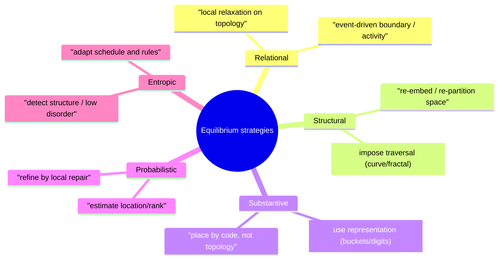

```mermaid
mindmap
  root((Equilibrium strategies))
    Relational
      "local relaxation on topology"
      "event-driven boundary / activity"
    Structural
      "re-embed / re-partition space"
      id1["impose traversal (curve/fractal)"]
    Substantive
      id2["use representation (buckets/digits)"]
      "place by code, not topology"
    Probabilistic
      "estimate location/rank"
      "refine by local repair"
    Entropic
      "detect structure / low disorder"
      "adapt schedule and rules"
```