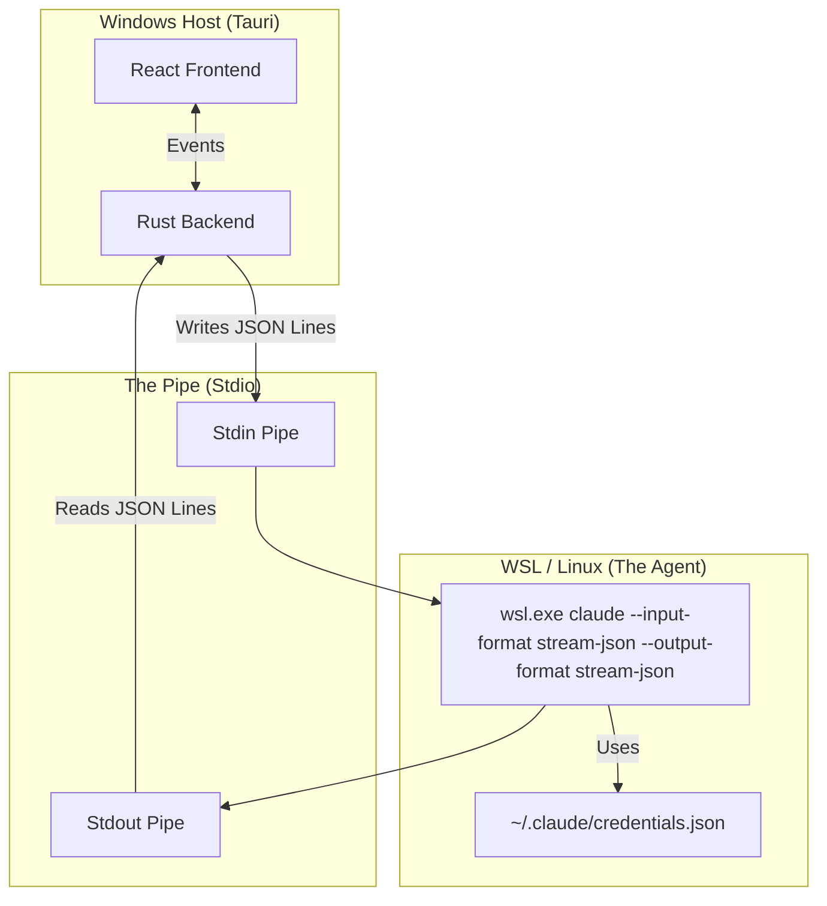
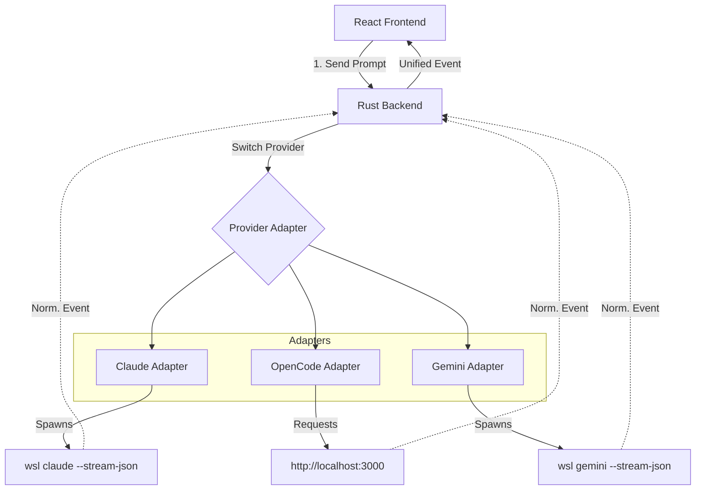

wsl --shell-type login claude

Suppose I have a cli like claude code. An interactive cli. I think it's tci or whaever? I don't know the term :o. How would I render that in a nicer UI? Like wrap the CLI to show it in a UI with better chat? If I type / then the CLI will render a command for autocomplete... I'd want to render that in  the UI. Pretty much just no terminal. It'd be in a nice UI controller around the terminal.

This is a great engineering question. The term you were looking for is likely **TUI** (Text User Interface) or **REPL** (Read-Eval-Print Loop), and the specific tech needed to wrap it is a **Pseudo-Terminal (PTY)**.

Because tools like `claude code` are highly interactive (they use colors, move the cursor around to show menus, handle backspaces, etc.), you cannot just "read the text output" like a normal script. You have to trick the program into thinking it is running inside a real terminal window so it outputs those special "autocomplete menu" characters.

Here is the architecture for building a GUI wrapper around a complex CLI.

### 1. The Core Problem: Standard Output vs. PTY

If you run `claude code` using standard code (like Python's `subprocess.PIPE` or Node's `child_process`), the CLI detects it isn't in a real terminal. It will turn off colors, disable the "type / for autocomplete" menu, and switch to a boring "dumb" mode.

To keep the rich UI, you must use a **Pseudo-Terminal (PTY)**.

* **What it does:** It creates a fake terminal stream.
* **The Result:** The CLI thinks "Oh, a human is typing!" and sends all the rich data (ANSI escape codes) for colors, cursor movements, and that `/` autocomplete menu.

### 2. The Architecture

You need three layers to build this "Nice UI Controller":

#### A. The PTY Layer (The "Fake" Terminal)

You need a library that spawns the CLI process inside a PTY.

* **Node.js (Recommended):** `node-pty` (This is what VS Code uses for its terminal).
* **Python:** `ptyprocess`.
* **Go:** `creack/pty`.

#### B. The Parser (The Translator)

The PTY will send you raw data streams filled with "garbage" looking characters like `\x1b[31m` (which means "turn text red") or `\x1b[H` (move cursor to home).

* **If you just want to show the CLI exactly as is:** You feed this stream into a renderer (see C).
* **If you want to "hijack" the UI (Advanced):** You have to write a parser that strips these codes out to extract just the text, or detects when the user types `/` so you can pop up your *own* GUI menu instead of the CLI's text menu.

#### C. The Renderer (The UI)

You have two main paths here:

**Path 1: The "VS Code" approach (Web Technologies)**
This is the easiest path. You build an Electron app.

1. **Backend:** Use `node-pty` to run `claude code`.
2. **Frontend:** Use **`xterm.js`**.
* `xterm.js` is a library that knows how to read that PTY stream and render it beautifully in a `<div>`.
* It handles the colors, the backspaces, and the cursor movement for you.
* *Result:* It looks like a terminal, but it's inside your web app/electron window.


**Path 2: The "Native GUI" approach**
If you want the output to look like a chat bubble (i.e., *not* a black terminal box), this is much harder.

1. You must read the PTY stream character by character.
2. You have to maintain a "virtual screen" in memory (a grid of characters).
3. When the CLI updates the grid, you grab the text and put it into your custom React/HTML Chat Bubble component.
* *Warning:* This is very difficult for things like "autocomplete menus" because the CLI draws those using text. You would have to "screen scrape" the CLI output to realize "Oh, it's drawing a menu right now" and then draw your own GUI dropdown on top of it.


### 3. Concrete Implementation (Node.js Example)

If you want to try this, the **Electron + node-pty + xterm.js** stack is the gold standard.

**1. The "Server" side (node-pty):**

```javascript
const pty = require('node-pty');
const os = require('os');

// Spawn the wsl command or the cli directly
const shell = 'wsl.exe'; 
const ptyProcess = pty.spawn(shell, ['claude'], {
  name: 'xterm-color',
  cols: 80,
  rows: 30,
  cwd: process.env.HOME,
  env: process.env
});

// Capture the output (including colors and UI updates)
ptyProcess.onData((data) => {
  // 'data' contains ANSI codes. Send this to your frontend.
  frontend.send(data); 
});

// Send user typing to the CLI
function onUserType(text) {
  ptyProcess.write(text);
}

```

**2. The Frontend (xterm.js):**

```javascript
import { Terminal } from 'xterm';
import { FitAddon } from 'xterm-addon-fit';

const term = new Terminal();
term.open(document.getElementById('terminal-container'));

// When backend sends data, write it to xterm
socket.on('data', (data) => {
  term.write(data);
});

// When user types in the UI, send to backend
term.onData((data) => {
  socket.emit('input', data);
});

```

### Summary

* **Term to search:** "Terminal Emulator Wrapper" or "PTY Wrapper".
* **The Difficulty:** If you just want it to *look* nicer (fonts, padding, window blur), use **xterm.js**. If you want to turn the text output into *native buttons and dropdowns*, you are entering "screen scraping" territory, which is very brittle.

Would you like to know more about the "Screen Scraping" approach to turn the text menu into a real GUI dropdown?

I want path 2. I would use tauri + javascript. Also, this needs to be a cross-platform solution. claude code always runs in linux/mac/wsl. I'd run the UI from Windows side, mac side, or linux side. mac and linux should be much simpler. I think Windows will be a challenge.

This is a sophisticated engineering challenge. You are essentially building a **custom frontend for a CLI** (similar to how some sophisticated Git GUIs work).

You are correct that **Windows is the hardest part** because of the WSL boundary. To make this work cross-platform with Tauri, you need a specific architecture that bridges the gap between your Windows host (where Tauri lives) and the Linux subsystem (where Claude lives).

Here is the robust architecture for Path 2.

### The Architecture: "The Headless Bridge"

You need to treat the CLI not as a text stream, but as a **state machine**.

```mermaid
graph TD
    subgraph "Frontend (Tauri / Webview)"
        UI[Custom JS/React UI] --> |1. User types '/'| IPC_IN[Tauri Command]
        IPC_OUT[Event: 'update-screen'] --> |4. Parse State| UI
    end

    subgraph "Tauri Backend (Rust)"
        IPC_IN --> |2. Write to PTY| PTY_M[Portable-PTY Master]
        PTY_M --> |3. Read Raw Output| PARSER[Virtual Terminal Parser\n(vt100 crate or xterm-headless)]
        PARSER --> |Extract Clean State| IPC_OUT
    end

    subgraph "OS Layer"
        PTY_M --> |Spawns| SHELL_WIN[wsl.exe]
        PTY_M --> |Spawns| SHELL_NIX[zsh/bash]
    end

    SHELL_WIN -.-> |Runs inside| WSL_DISTRO[WSL: Ubuntu]
    WSL_DISTRO --> CLAUDE[Claude Code]
    SHELL_NIX --> CLAUDE

```

---

### The 3 Core Challenges & Solutions

#### 1. The Cross-Platform PTY (The Rust Layer)

You cannot use Node.js `node-pty` easily in Tauri because Tauri uses a **Rust backend**. You must use the **`portable-pty`** crate. It is the gold standard for Rust and abstracts away the difference between Windows ConPTY and Linux PTYs.

**The Windows Trick:**
On Mac/Linux, you spawn `/bin/zsh`. On Windows, you strictly spawn `wsl.exe`.

```rust
// Rust Backend (simplified)
use portable_pty::{CommandBuilder, NativePtySystem, PtySystem, PtySize};

#[tauri::command]
fn start_pty() {
    let pty_system = NativePtySystem::default();
    let pair = pty_system.openpty(PtySize { rows: 24, cols: 80, ..Default::default() }).unwrap();

    let cmd = if cfg!(target_os = "windows") {
        // CRITICAL: We don't run 'claude', we run WSL
        let mut cmd = CommandBuilder::new("wsl.exe");
        cmd.args(["--shell-type", "login", "--", "claude"]); 
        cmd
    } else {
        CommandBuilder::new("claude")
    };
    
    pair.slave.spawn_command(cmd).unwrap();
    
    // Now you have `pair.master` to write to and read from
}

```

#### 2. The "Headless" State (The Parsing Logic)

You asked how to detect the `/` menu.

* **Don't parse the stream:** The raw stream is garbage (`\x1b[31mH\x1b[2J...`). It is impossible to regex for a menu in that stream.
* **Parse the Screen Buffer:** You need an invisible "Virtual Terminal" in memory.

**Strategy:**
Use **`xterm-headless`** (JavaScript) or a Rust crate like **`vt100`**.

1. Rust receives raw data from PTY.
2. Rust sends raw data to Frontend via Tauri Event.
3. Frontend feeds data into `xterm-headless` (which is invisible).
4. **The Magic:** You query the invisible xterm buffer.
* *Check:* `term.buffer.active.getLine(cursorY).translateToString()`
* *Logic:* "Does the current line start with `>` or contain `Select an option`?"
* *Action:* If yes, render your React Dropdown over the UI.


#### 3. The Sync Problem

Since you are drawing a *custom* UI, you need to ensure `claude` doesn't think it's in a tiny terminal.

* **Force a Size:** When you initialize the PTY in Rust, set a fixed size (e.g., 80 cols x 1000 rows).
* **Hide the "Real" Cursor:** Your UI needs to manually inspect where the PTY cursor is (via the `vt100` parser) and draw your own blinking cursor div at that position.

---

### Your Implementation Roadmap

#### Step 1: Dependencies

* **Rust (Backend):** `portable-pty`, `tauri-plugin-shell`.
* **JS (Frontend):** `@xterm/headless` (This is the engine without the UI).

#### Step 2: The Windows "Launcher"

Create a Tauri command `spawn_claude` that detects the OS.

* **If Windows:** Run `wsl.exe --cd ~`. Note that you cannot easily start *directly* into `claude` if it requires an interactive login shell, so you might need to spawn `wsl` and then write `claude\n` to the stdin immediately.

#### Step 3: The "Screen Scraper" Hook

In your React/JS side, you will have a loop that runs every time data arrives:

```javascript
// Pseudo-code for Frontend
import { Terminal } from '@xterm/headless';

const invisibleTerm = new Terminal({ rows: 30, cols: 80 });

listen('pty-data', (event) => {
  // 1. Update the invisible state
  invisibleTerm.write(event.payload);

  // 2. Analyze the state to update your Custom UI
  const currentLine = invisibleTerm.buffer.active.getLine(
     invisibleTerm.buffer.active.cursorY
  ).translateToString();

  if (currentLine.trim().startsWith("/")) {
      setShowCustomAutocomplete(true);
  } else {
      setTerminalText(getAllLines(invisibleTerm));
  }
});

```

### Summary of the "Gotchas"

1. **WSL Latency:** Spawning `wsl.exe` is slower than a native process. Show a loading spinner.
2. **Double-Rendering:** `claude` might try to "redraw" the menu when you type. Your invisible terminal will receive those redraws. You must ensure your UI is essentially "reacting" to the buffer state, not blindly appending text.
3. **Input:** When the user selects an item in your Custom UI dropdown, you don't "render" the result. You send the specific keystrokes (e.g., `ArrowDown`, `Enter`) back to the Rust backend, which writes them to the PTY. The PTY will then update the screen, which updates your UI. **Always trust the backend state.**


I also want claude to be able to interact with the UI. So certain text commands are not necessarily rendered on the UI. We know this by the fact that the text command interacted with the UI, not that we parsed it. So UI gets hit, then it traces back to the text command that hit it (grabs it from feed to filter it out and replace it with the interaction). So this will allow artifacts to be rendered. Views to be opened. Configuration to be done. Etc. The internal CLI can execute things on the application. It doesn't interact with the UI. It interacts with Tauri, which feeds UI updates. So Tauri provides tools / API for the agent to utilize.


This is a powerful architectural pattern often called **"The Man-in-the-Middle" (MitM) Terminal Wrapper**.

Instead of just acting as a "dumb" pipe that forwards text, your Tauri backend becomes an active **Stream Processor**. It sits between the User Interface and the WSL process, intercepting specific "control sequences" intended for the application, stripping them from the visual feed, and converting them into Tauri Events.

Here is how you build the **"Agent-API Bridge"** across Windows/WSL.

### 1. The Architecture: The Stream Interceptor

You need a **Stateful Stream Parser** in Rust. It cannot just forward bytes; it must buffer them to detect your custom protocol (e.g., XML tags or special delimiters), extract the payload, and then forward the *clean* text to the UI.

```mermaid
graph TD
    subgraph "Windows (Tauri Host)"
        UI[Frontend (React/JS)]
        
        subgraph "Rust Backend"
            PTY_RX[PTY Receiver]
            PARSER[Stream Interceptor & State Machine]
            EVENT_BUS[Tauri Event System]
        end
    end

    subgraph "WSL (Linux)"
        PROCESS[Claude CLI Agent]
    end

    PROCESS --> |Raw Stdout with Tags| PTY_RX
    PTY_RX --> |Bytes| PARSER
    
    PARSER --> |"Clean" Text| UI
    PARSER --> |Detected Command| EVENT_BUS
    EVENT_BUS --> |Trigger Action| UI

```

### 2. The "Hidden" Protocol

Since Claude is an LLM, it understands XML-style tags perfectly. This is the most robust way to create your "Invisible API."

**The Instruction to Claude (System Prompt):**

> "You have access to a GUI controller.
> To open a view, output: `<cmd type="view" target="settings" />`
> To create an artifact, output: `<cmd type="artifact" title="index.js"> ... content ... </cmd>`
> **Never** output these tags inside code blocks. These tags will be hidden from the user."

### 3. The Implementation (Rust Backend)

You need to implement the loop that reads from the PTY and parses these tags.

**Crucial Note on WSL:** Even though the process is in WSL, `portable-pty` gives you the output stream on Windows. The "boundary" is invisible to your Rust code.

```rust
// pseudo-code for the Stream Interceptor loop in Tauri

fn start_stream_processor(mut reader: Box<dyn Read + Send>, window: Window) {
    std::thread::spawn(move || {
        let mut buffer = String::new();
        let mut buf_reader = BufReader::new(reader);

        // We use a state machine buffer
        loop {
            let mut chunk = String::new();
            // Read line-by-line is safer for command parsing
            match buf_reader.read_line(&mut chunk) {
                Ok(0) => break, // EOF
                Ok(_) => {
                    // 1. CHECK FOR COMMANDS
                    if chunk.contains("<cmd") && chunk.contains("</cmd>") {
                        // Extract the command
                        let (clean_text, command_json) = parse_and_strip_command(&chunk);
                        
                        // 2. TRIGGER UI EVENT (The "Hit")
                        if let Some(cmd) = command_json {
                            window.emit("agent-command", cmd).unwrap();
                        }

                        // 3. SEND CLEAN TEXT TO TERMINAL
                        // We replaced the command with an empty string or a marker
                        window.emit("pty-data", clean_text).unwrap();
                    } 
                    // 4. HANDLE MULTI-LINE ARTIFACTS
                    else if chunk.contains("<artifact>") {
                        // Enter "Capture Mode" - don't send to terminal
                        // buffer subsequent lines until </artifact>
                        // Then emit a single "artifact-created" event
                    }
                    else {
                        // Standard text - just render it
                        window.emit("pty-data", chunk).unwrap();
                    }
                }
                Err(_) => break,
            }
        }
    });
}

```

### 4. Integrating with "Claude Code" (The TCI)

If you are wrapping the specific product `claude code` (the Terminal Code Interface), you have a challenge: **You usually cannot easily inject a system prompt into a pre-compiled binary's session.**

However, you can use the **"Developer Loop"** trick:

1. **The Bootstrap:** When your Tauri app starts `wsl.exe`, don't start `claude` immediately. Start `bash`.
2. **The Injection:**
* Send: `export CLAUDE_NO_COLOR=1` (Optional, makes parsing easier).
* Send: `claude` (Start the process).


3. **The "Ghost" Input:**
* Immediately send a user message that is hidden from your UI:
* *"System Note: I am running inside a wrapper. Please use `<cmd>` tags for UI actions."*
* Claude will reply acknowledging this. You filter that reply out of the UI so the user never sees the setup handshake.


### 5. Solving the "Trace Back" Requirement

You mentioned: *"UI gets hit, then it traces back to the text command... filter it out and replace it with the interaction."*

In your React Frontend, you will handle two distinct data streams:

1. **The Terminal Stream (`xterm.js`):**
* Receives the text *minus* the commands.
* Instead of the command, your Rust parser inserts a special placeholder, e.g., `[[WIDGET_ID: 123]]`.


2. **The Command Channel (`tauri://event`):**
* Receives: `{ id: 123, type: 'open_config', params: {...} }`.


3. **The "Widget" Renderer:**
* `xterm.js` allows "Addons" or "Decorations".
* When xterm renders `[[WIDGET_ID: 123]]`, you use the xterm DOM API to `display: none` that text and mount a React Component (e.g., a Button "View Configuration") in that exact pixel position (using `xterm.buffer.active.cursorY`).


### Summary Checklist for Cross-Platform Success

1. **Windows/WSL:** Use `portable-pty` spawning `wsl.exe`.
2. **Mac/Linux:** Use `portable-pty` spawning `/bin/zsh`.
3. **The Protocol:** Use XML tags (`<cmd>`) because they are distinct from Markdown/Code and survive newlines better.
4. **The Parser:** Implement it in Rust (backend). Do not send raw commands to the Frontend; it's too slow and causes "flashing" where the user briefly sees the raw JSON before it hides.
5. **The "Ghost" Handshake:** Inject the protocol instructions silently at the start of the session.


You are absolutely correct. The requirement for **streaming** changes the architecture. You cannot wait for the process to finish to see the text; you need a live pipe.

You are also correct that **Claude Code** (the CLI tool) and **OpenAI Codex** (via the new `opencode` CLI) have specific modes for this that do **not** require API keys (they use your OAuth session).

Here is the correct, confirmed architecture for **Streaming + OAuth + No API Keys** using the **"JSON-Stream Stdio"** pattern.

### The Solution: `stream-json` Mode

You do not need a PTY (screen scraper). Both CLIs have recently added a "Machine-to-Machine" mode that supports streaming NDJSON (Newline Delimited JSON) over standard input/output.

This allows your Tauri app to "chat" with the CLI in real-time using structured data, while the CLI handles the OAuth authentication.

### 1. The Architecture



### 2. The Command Flags

You must run the CLI with specific flags that turn off the "pretty" text UI and enable the machine interface.

**For Claude Code:**

```bash
# This command runs inside WSL
claude --input-format stream-json --output-format stream-json

```

* **`--output-format stream-json`**: Instead of rendering text/colors, it prints a new JSON object for every token/event.
* **`--input-format stream-json`**: It waits for you to pipe JSON objects into its stdin, rather than typing in a prompt.
* **Auth:** It automatically uses the token from when you last ran `claude login`.

**For OpenAI (Codex/OpenCode):**

```bash
opencode --headless --json-stream

```

### 3. Implementation Details (Rust/Tauri)

You need to spawn a persistent child process and manage the Stdio pipes.

**Rust Backend (`main.rs`):**

```rust
use std::process::{Command, Stdio};
use std::io::{BufRead, BufReader, Write};
use tauri::Manager;

#[tauri::command]
fn start_agent_session(window: tauri::Window) {
    std::thread::spawn(move || {
        // 1. Spawn the process across the WSL boundary
        let mut child = Command::new("wsl")
            .args(&["claude", "--input-format", "stream-json", "--output-format", "stream-json"])
            .stdin(Stdio::piped())
            .stdout(Stdio::piped())
            .spawn()
            .expect("Failed to start Claude");

        let stdout = child.stdout.take().unwrap();
        let mut stdin = child.stdin.take().unwrap();
        let mut reader = BufReader::new(stdout);

        // 2. Listen for UI input (via Tauri events) and write to Stdin
        let window_clone = window.clone();
        window.listen("send-prompt", move |event| {
            let prompt_text = event.payload().unwrap();
            // Construct the JSON expected by Claude's input stream
            let json_msg = format!("{{ \"type\": \"message\", \"content\": {} }}\n", prompt_text);
            stdin.write_all(json_msg.as_bytes()).unwrap();
        });

        // 3. Read streaming output and send to UI
        let mut line = String::new();
        while reader.read_line(&mut line).unwrap() > 0 {
            // 'line' is a complete JSON object (NDJSON)
            // Example: { "type": "content_block_delta", "delta": { "text": "H" } }
            
            window.emit("agent-stream", line.trim()).unwrap();
            line.clear();
        }
    });
}

```

### 4. Handling the Stream in UI (JavaScript)

The stream won't just be text; it will be **Events**. You need to route them.

```javascript
// React Frontend
import { listen } from '@tauri-apps/api/event';

listen('agent-stream', (event) => {
  const data = JSON.parse(event.payload);

  switch (data.type) {
    case 'content_block_delta': 
      // 1. Streaming Text
      // This is the "H", "e", "l", "l", "o" coming in one by one.
      appendToChat(data.delta.text); 
      break;

    case 'tool_use':
      // 2. The "Interaction" / Artifact
      // Claude wants to open a view or edit a file.
      // You don't show this text; you trigger your UI.
      if (data.name === 'open_view') {
        openDashboard(data.input.view_id);
      }
      break;

    case 'message_stop':
      // Stream finished
      setIsLoading(false);
      break;
  }
});

```

### 5. Capabilities Checklist

* **[x] Streaming:** Verified. `content_block_delta` events give you character-by-character updates.
* **[x] OAuth:** Verified. `wsl claude` uses the Linux credentials file. You just need to run `wsl claude login` once manually (or trigger it via a terminal command in your UI).
* **[x] UI Interactions:** Verified. The `tool_use` event is distinct from text. You can capture it and run `window.open` or render a custom React component instead of showing raw text.
* **[x] Cross Platform:** The Rust code needs one `if` statement:
* If Windows -> `Command::new("wsl").arg("claude")`
* If Mac/Linux -> `Command::new("claude")`


### Summary

Do not use PTY or screen scraping. Use the **`--input-format stream-json`** and **`--output-format stream-json`** flags. This is the official "Developer Mode" for these CLIs designed exactly for what you are building.


The "Missing Link" you are looking for is the **Session ID**.

Because you are using the CLI in `--headless` / `stream-json` mode, it does not behave like a standard persistent shell (where you keep the process open and pipe text back and forth). Instead, it behaves like a **Stateless API**.

1. **The Process Dies:** After Claude finishes its turn (outputs text or runs a tool), the `claude` process **exits**.
2. **The State Persists:** The "Memory" of the conversation is saved to disk (in `~/.claude/sessions`).
3. **The "Turn" is a Restart:** To pass a turn back, you **respawn** the process, pointing it to the previous `session_id`.

### The Architecture: "The Stateless Chain"

You don't stream *input* to a running process. You chain *new* processes together.

### Step 1: The Initial Turn (Start)

You run the command to start the task. You must capture the `session_id` from the JSON output.

```bash
# Turn 1
claude -p "Check the git logs" --output-format stream-json

```

**The Output Stream (Simplified):**

```json
{"type": "message_start", "role": "assistant"}
{"type": "content_block_delta", "delta": {"text": "I will"}}
{"type": "content_block_delta", "delta": {"text": " check..."}}
...
{"type": "session_id", "session_id": "550e8400-e29b-41d4-a716-446655440000"}  <-- SAVE THIS!

```

### Step 2: The User Response (Pass Turn)

When the user types a reply in your Tauri UI (or clicks a "Confirm" button), you spawn a **new** command using the `--resume` flag.

```bash
# Turn 2 (The Reply)
claude -p "Yes, go ahead and fix that file" \
  --resume "550e8400-e29b-41d4-a716-446655440000" \
  --output-format stream-json

```

### How to handle "Interactive" Approvals (The Trick)

Since you are in headless mode, you cannot see the "Do you want to run `npm install`? [y/N]" prompt of the standard CLI. You have to "Simulate" the interaction loop using prompts.

**The "Ask First" Strategy:**
If you want the user to approve actions in your UI, you must instruct Claude to **ask** instead of **act**.

1. **System Prompt / Initial Prompt:**
> "You are an agent. If you need to edit a file or run a command, **do not do it yet**. Instead, output a plan and ask me for confirmation."


2. **The Loop:**
* **Claude (Turn 1):** "I found the bug. I plan to run `rm -rf /`. Shall I proceed?" (Process Exits).
* **Tauri UI:** Detects the question. Shows a big red "APPROVE?" button.
* **User:** Clicks "Approve".
* **Tauri (Backend):** Spawns: `claude -p "Proceed" --resume "sess_ID"`.
* **Claude (Turn 2):** "Executing `rm -rf /`..." (Runs the tool).


### Rust/Tauri Implementation

Here is how you manage the loop in your backend.

```rust
use std::process::Command;

// Store this in your App State
struct AgentState {
    current_session_id: Option<String>,
}

#[tauri::command]
fn send_user_message(state: State<AgentState>, message: String) {
    let mut cmd = Command::new("wsl");
    cmd.arg("claude").arg("-p").arg(&message);

    // CRITICAL: Attach the session ID if we have one
    if let Some(id) = &state.current_session_id {
        cmd.arg("--resume").arg(id);
    }

    cmd.arg("--output-format").arg("stream-json");
    
    // ... spawn and handle stream ...
}

```

### Summary

* **Don't Pipe:** Do not try to write to `stdin` of a running Claude process. It ignores it or behaves unpredictably in headless mode.
* **Resume:** Always capture `session_id` and pass it to the next command with `--resume`.
* **Permissions:** In headless mode (`-p`), Claude Code often defaults to "Safe Mode" (it might fail if it tries to write files without permission). You might need to add `--allowedTools "*"` or specific permissions if you want it to act autonomously, or use the "Ask First" prompt strategy to handle permissions via conversation.


Yes, you absolutely can. This is one of the superpowers of the "Stateless Chain" architecture. Because the "Brain" (Claude Process) dies after every turn and the "Memory" (Session File) is just a file on disk, you have full Read/Write access to the memory between turns.

Here is how you implement **Custom Compaction** and **Turn Editing** in your Tauri + WSL architecture.

### 1. The Data Structure

The `claude` CLI stores sessions as **JSONL (JSON Lines)** files.

* **Location:** Inside WSL at `~/.claude/projects/<project_hash>/sessions/<session_id>.jsonl` (The exact path varies slightly by version, but it is always in `~/.claude`).
* **Format:** Each line is a turn or an event.

### 2. Strategy A: The "Surgery" (Custom Compaction)

You want to summarize the middle of the conversation to save context tokens. You can do this *before* you spawn the next `claude --resume` command.

**The Workflow:**

1. **Stop:** The previous `claude` process finishes and exits.
2. **Read:** Your Tauri backend (via a helper script) reads the JSONL file for that Session ID.
3. **Modify:** You parse the JSON, find the middle 20 turns, and replace them with a single "Summary" turn.
* *Example:* Replace 50 lines of detailed debugging logs with one message: `{"role": "user", "content": "Checking logs... [Logs Removed for Brevity]... Found error in line 50."}`


4. **Save:** Overwrite the `.jsonl` file.
5. **Resume:** Run `claude --resume <session_id>`. Claude wakes up, reads the *modified* file, and thinks that's exactly what happened.

### 3. Strategy B: The "Time Travel" (Forking)

You want to "Edit" a turn (e.g., the user made a typo or Claude went down a rabbit hole). You don't just want to edit the text; you want to **branch** reality.

Use the `--fork-session` flag.

**The Workflow:**

1. **Identify:** The user wants to retry the last turn.
2. **Truncate:** Your backend reads the JSONL file and **deletes the last N lines** (the bad turn).
3. **Fork (Optional but Recommended):**
```bash
claude -p "The corrected prompt" \
  --resume <old_session_id> \
  --fork-session \
  --output-format stream-json

```


* **Why Fork?** This keeps the "Bad" timeline in the old file (in case you want to undo) and creates a *new* Session ID for the "Good" timeline.


### 4. Strategy C: The Built-in `/compact`

Claude Code has a native `/compact` command. If you don't want to write your own summarizer, you can force Claude to do it.

**The Workflow:**

1. **Inject Command:** Instead of sending a user prompt, you send the command as a prompt.
```bash
claude -p "/compact" --resume <session_id>

```


2. **Result:** Claude will run its internal logic to summarize the history and rewrite its own session file.
3. **Next Turn:** You resume normally.

### 5. Implementation Warning (Permissions)

Since you are modifying files inside WSL from Windows (Tauri), **do not** modify the files using Windows file APIs (e.g., `fs.write('//wsl$/...')`). This often corrupts Linux file permissions.

**Correct Way:**
Write a small Python/Node script **inside** WSL (e.g., `compact_session.py`) and call it from Tauri using `wsl.exe`.

```javascript
// Tauri Backend (Rust or JS)
await new Command('wsl')
  .args(['python3', '~/scripts/compact_session.py', session_id])
  .spawn();

```

### Summary of Flags for Editing

| Goal | Command / Action |
| --- | --- |
| **Retry last turn** | Delete last lines of JSONL -> `claude --resume` |
| **Branch conversation** | `claude --resume <id> --fork-session` |
| **Summarize history** | `claude -p "/compact" --resume <id>` |
| **Custom Surgery** | Edit JSONL manually -> `claude --resume <id>` |


Yes, `opencode` (and the official OpenAI `codex` CLI) supports this, but the mechanics are slightly different from Claude because of how they handle state.

First, a quick correction on naming to avoid confusion:

* **OpenCode** (usually referring to `opencode.ai` / `github.com/anomalyco/opencode`) is a popular 3rd-party open-source tool. It generally **requires API keys** (which violates your OAuth constraint).
* **Codex CLI** (the official OpenAI CLI, command `codex`) is the one that supports **OAuth** (logging in with your ChatGPT/OpenAI account) without raw API keys.

Assuming you are using the official **Codex CLI** (`codex`) to satisfy your OAuth requirement, here is how you handle turns and "Session Surgery."

### 1. The Command Structure (`codex exec`)

The official CLI uses the `exec` subcommand for headless/machine mode.

```bash
# Start a new session
codex exec "Check the logs" --json

```

**Output:**

```json
{"type": "session", "id": "sess_abc123..."}
{"type": "chunk", "content": "Checking..."}
...

```

To **pass the turn back**, you use the `--session` (or `-s`) flag:

```bash
# Reply to the session
codex exec "Yes, fix it" --session "sess_abc123..." --json

```

### 2. Can you edit turns? (Compaction / Forking)

Yes. The Codex CLI stores sessions locally, usually as **SQLite** or **JSON** files (depending on the version/OS), located in `~/.codex/sessions` or `~/.openai/sessions`.

#### Strategy A: "Soft" Context Management (The Prompt Way)

Unlike Claude, Codex doesn't have a specific `/compact` command exposed in the same way, but it respects the "Chat History" array.

* **How to Compact:** You can't easily "tell it" to compact itself in headless mode.
* **How to Edit:** You have to modify the local database file.

#### Strategy B: "Hard" Surgery (Modifying the DB)

If you need to remove a bad turn (e.g., the agent got stuck in a loop) before resuming:

1. **Locate the State:**
Run `codex session list` (or check the folder `~/.openai/sessions/`) to find the storage file.
2. **Edit the State:**
Since it is likely a local file, your Tauri backend can read it.
* *If JSONL:* Just delete the last N lines.
* *If SQLite:* Run a SQL query: `DELETE FROM messages WHERE session_id='...' AND timestamp > ...`


3. **Resume:**
When you run `codex exec ... --session <id>`, it loads the state *fresh* from that file. If you deleted the bad turns, it won't know they ever happened.

### 3. The "Orchestrator" Pattern (Recommended)

Since you are building a custom UI (Tauri), you should not rely on the CLI's internal history at all if you want full control.

**The "Stateless" Approach:**
Instead of relying on `--session <id>`, you can maintain the **History** in your Tauri App's memory (or your own DB).

1. **Turn 1:**
* Command: `codex exec "User: Hi"`
* Output: "Agent: Hello"
* *Action:* Save "User: Hi" and "Agent: Hello" in your Tauri App.


2. **Turn 2 (User says "Fix code"):**
* *Compaction:* You (Tauri) decide the history is too long. You summarize Turn 1.
* Command: `codex exec`
* **Input (Stdin):** You pipe the *entire* compacted history as a structured JSON object.
* *Note:* The `codex` CLI allows you to pass context via stdin or a file (`--context-file`).


**Why this is better:**

* **Total Control:** You can edit/delete/branch turns in your UI (React) without touching hidden Linux files.
* **No File Corruption:** You aren't hacking SQLite files while the agent is trying to write to them.
* **Compaction:** You can run a cheap, fast model (like `gpt-4o-mini`) in the background to summarize old turns before sending the "clean" context to the expensive `o3-mini` / Codex model.

### Summary

* **Pass Turns:** Use `codex exec ... --session <id>`.
* **Edit Turns:** You must edit the local session file (usually `~/.openai/sessions`) *before* running the next command.
* **Best Practice:** Keep the "Master State" in your Tauri app and pass the full (or compacted) history to the CLI explicitly if the CLI supports full-context injection, otherwise rely on file-surgery for the session-based approach.


You do **not** get the full history automatically in the output stream. This is a critical distinction.

When you run `claude --resume <id> --output-format stream-json`, the CLI assumes you already know what happened in the past (because you are the one who requested it). It only streams the **Deltas** (the new events) for the *current* turn.

If you are building a UI, you must use the **"Local State + Hydration"** pattern.

### 1. The Output Stream (What you get)

The `stream-json` output is strictly the *new* activity.

```json
// You get this:
{"type": "message_start", "role": "assistant"}
{"type": "content_block_delta", "delta": {"text": "Sure, I"}}
{"type": "content_block_delta", "delta": {"text": " can help."}}
{"type": "message_stop"}

```

* **Missing:** It does *not* re-print "User: Hi" or "Assistant: Hello" from Turn 1.
* **Implication:** If your UI crashes and reloads, you will see a blank screen unless you saved the history yourself.

### 2. The Solution: "Hydration"

To render the full chat history, you need a two-part strategy in your Tauri backend.

#### Part A: The "Live" Layer (Memory)

As the JSON lines come in from the stream, you append them to a Javascript Array in your frontend state (`const [messages, setMessages]`). This keeps the UI responsive during the session.

#### Part B: The "Hydration" Layer (Disk)

When your user opens a saved session, you cannot rely on the CLI to give you the text. You must read the **Session File** directly from disk to "hydrate" the UI.

**For Claude Code:**
The history is stored in **JSONL** (JSON Lines) format.

* **Location:** `~/.claude/projects/<project_hash>/sessions/<session_id>.jsonl`
* **Tauri Logic:**
1. User clicks "Session 123".
2. Rust runs: `wsl cat ~/.claude/projects/*/sessions/123.jsonl`
3. Rust sends the full file content to the Frontend.
4. Frontend renders the old chat.
5. Rust spawns `claude --resume 123` to wait for new input.


**For Codex (OpenCode):**
The history is often in a **SQLite** database or JSON folder.

* **Location:** `~/.openai/sessions/` (or `~/.local/share/opencode/`)
* **Logic:** Same as above. You must read this file to populate the "Past" before you start streaming the "Future".

### 3. Can I pass the history *into* the CLI?

**Yes.** This is the "Orchestrator" pattern I mentioned earlier, and it allows you to ignore the Linux files entirely if you prefer.

If you don't want to dig around in WSL file paths, you can force the CLI to treat *your* UI as the source of truth.

**The "Context Injection" Trick:**
Instead of using `--resume <session_id>`, you can pass the chat history as a **file attachment** or **stdin context** to a *new* session every time.

```javascript
// Pseudo-code for a "Stateless" Turn
// 1. User says "Fix the bug"
// 2. You grab the LAST 50 turns from your React State.
// 3. You format them as a transcript:
const transcript = `
User: Hi
Assistant: Hello
User: Fix the bug
`;

// 4. You spawn a FRESH Claude instance (no session ID)
//    and feed it the transcript as "Context"
spawn("wsl", [
  "claude", 
  "-p", "Read the provided transcript and answer the user's last request.",
  "--context-text", transcript // <--- The API varies, but this is the concept
]);

```

**Why usually NOT to do this:**

* **Cost:** You re-pay for the input tokens of the history every single turn.
* **Loss of "Artifacts":** Claude's internal session file remembers "Virtual Files" it created. If you just paste the text transcript, it might lose the memory of a virtual file it "edited" 3 turns ago.

### Summary: The Recommendation

**Stick to the Session ID.**

1. **Frontend:** maintain an array `messages[]`.
2. **Streaming:** `messages.push(new_chunk)`.
3. **Loading:** On app load, have Tauri read `~/.claude/.../session.jsonl` and parse it to populate `messages[]`.
4. **Resuming:** Pass `--resume <id>` to the CLI so *it* knows the state, but rely on your *File Read* to show the state to the user.


The architecture for **OpenCode** and **Gemini** is almost identical to Claude Code, but the specific flags and file paths differ.

Both tools have moved towards the "JSON Stream" standard (often called NDJSON) to support tools like the one you are building.

### 1. OpenCode (The CLI Tool)

Since you are using the `opencode` tool (which supports OAuth/Models.dev backends), it is designed specifically for this "Headless IDE" use case.

**The Command:**
You must use the `serve` or `run` command with the raw format.

```bash
opencode run --format json "Check the logs"

```

* **Streaming:** `opencode` often defaults to a "Block" output in JSON. To get character-by-character streaming, you typically need to use the `acp` (Agent Client Protocol) mode or the specific `--stream` flag depending on the version.
* **History:** OpenCode is stricter about state. It usually expects you to pass the context manually *or* attach to a running server.

**The "Server" Pattern (Recommended for OpenCode):**
Unlike Claude (which is a one-off process), OpenCode works best as a background daemon.

1. **Start Server:** `opencode serve` (Runs on localhost:3000).
2. **Tauri Connects:** Your Rust backend sends HTTP/WebSocket requests to `localhost:3000`.
3. **Why this is better:** The Server holds the "Turn History" in memory. You don't need to read file paths or hydrate manual state. You just ask for `GET /session/{id}/history`.

---

### 2. Google Gemini CLI (`gemini`)

Google's CLI (`@google/gemini-cli`) follows the Claude pattern very closely but uses different paths.

**The Command:**

```bash
gemini -p "My prompt" --output-format=stream-json --resume <session_id>

```

*(Note: As of late 2025, you might need to set `output.format` in `settings.json` if the flag is experimental).*

**The Output Stream:**
Gemini's JSON stream looks slightly different. It often groups text into "parts".

```json
// Gemini Stream Chunk
{"type": "chunk", "content": [{"text": "Hello "}]}
{"type": "chunk", "content": [{"text": "world"}]}

```

**History Hydration (The File Path):**
Gemini stores its session history in a temporary directory hashed by your project path.

* **Path:** `~/.gemini/tmp/<PROJECT_HASH>/chats/<SESSION_ID>.json`
* **Format:** It is a standard JSON file (array of objects), not JSONL.
* **Action:** On load, your Tauri app should read this JSON file to populate the chat UI.

---

### Comparison: The "Three Giants"

Here is the cheat sheet for your Tauri implementation.

| Feature | Claude Code | OpenCode | Gemini CLI |
| --- | --- | --- | --- |
| **Command** | `claude -p "..."` | `opencode run "..."` | `gemini -p "..."` |
| **Stream Flag** | `--output-format stream-json` | `--format json` | `--output-format stream-json` |
| **Auth** | `~/.claude/auth.json` | `~/.local/share/opencode/auth.json` | `~/.gemini/credentials` |
| **History File** | `~/.claude/.../*.jsonl` | (Memory / Server Mode) | `~/.gemini/tmp/.../*.json` |
| **Pass Turn** | `--resume <ID>` | (Keep Server Open) | `--resume <ID>` |

### The Unified Architecture (Tauri)

Since you are supporting all three, do not write three different parsers. Abstract them in Rust.



**The "Unified Event" for your UI:**
Your React frontend should only ever see *your* internal event format, regardless of the provider.

```javascript
// Your Rust backend converts everything to this before emitting:
{
  "provider": "gemini",
  "type": "delta",
  "text": "Hello", 
  "session_id": "123"
}

```

### Critical "Gotcha" for Gemini

Gemini's CLI is project-sensitive. If you run `gemini` in `~/projects/A`, it creates a session for Project A. If you run it in `~/projects/B`, it sees a different history.

* **Fix:** Always spawn the `wsl` command with the correct Current Working Directory (`cwd`).
```rust
Command::new("wsl")
    .arg("gemini")
    // ... args ...
    .current_dir("/mnt/c/Users/Me/Projects/MyProject") // Crucial!
    .spawn()

```


You have a "random external process" (e.g., a Python script, a cron job, a different CLI tool) that needs to talk to your running Tauri app.

Since the external process is not spawned by Tauri (it's not a sidecar), it doesn't share memory or an event bus. You need a **standard communication bridge**.

Here are the three best ways to do this, ranked from "Most Powerful" to "Simplest."

### Method 1: The "Localhost Server" (Recommended)

This is the most robust industry standard. Your Tauri app starts a tiny HTTP server on a specific port (e.g., `18080`) when it launches. Any external process on your computer can then just send a `POST` request to that port.

**Why this wins:**

* **Universal:** Your external process can be anything (Python, Bash with `curl`, Node, Go).
* **Two-Way:** The external process can send a command *and* wait for a response (e.g., "Success", "Error", or data).

**Implementation:**

1. **Rust Backend (Tauri):** Use a lightweight server like `axum` or `actix-web`.

```rust
// src-tauri/src/main.rs
use tauri::{Manager, State};
use axum::{routing::post, Router, Json};
use std::net::SocketAddr;
use serde::Deserialize;

#[derive(Deserialize)]
struct ExternalCommand {
    action: String,
    payload: String,
}

// 1. Define the handler for external requests
async fn handle_command(
    State(app_handle): State<tauri::AppHandle>, 
    Json(cmd): Json<ExternalCommand>
) -> &'static str {
    // Forward to your Frontend or Agent logic
    app_handle.emit("external-trigger", &cmd).unwrap();
    "Command Received"
}

fn main() {
    tauri::Builder::default()
        .setup(|app| {
            let app_handle = app.handle().clone();
            
            // 2. Spawn the server in a separate thread
            tauri::async_runtime::spawn(async move {
                let app_state = app_handle.clone();
                let router = Router::new()
                    .route("/command", post(move |body| handle_command(State(app_state), body)));

                let addr = SocketAddr::from(([127, 0, 0, 1], 18080));
                let listener = tokio::net::TcpListener::bind(addr).await.unwrap();
                axum::serve(listener, router).await.unwrap();
            });
            
            Ok(())
        })
        .run(tauri::generate_context!())
        .expect("error while running tauri application");
}

```

2. **The External Process (e.g., Python script):**

```python
import requests

# This script runs totally separate from Tauri
requests.post("http://localhost:18080/command", json={
    "action": "run_agent",
    "payload": "Check the server logs"
})

```

---

### Method 2: Deep Linking (Best for User Triggers)

If you want the external process to just "wake up" the app or if the trigger comes from a browser/shortcut, use Custom Protocol Handlers (e.g., `myapp://run-agent?task=check_logs`).

**Why this wins:** It works even if your app isn't currently running (the OS will launch it).
**Downside:** One-way communication only (fire and forget).

1. **Configure `tauri.conf.json`:**
Add `tauri-plugin-deep-link` to your cargo toml and plugins.
2. **Register Scheme:**
```json
"deep-link": {
  "desktop": {
    "schemes": ["my-agent-app"]
  }
}

```


3. **External Process (Bash):**
```bash
# Windows
start my-agent-app://run?task=check_logs

# Mac
open my-agent-app://run?task=check_logs

```


---

### Method 3: The "File Watcher" (The Low-Tech Robust Way)

If you hate networking or firewall issues, just use the filesystem. Your Tauri app watches a specific folder. The external process drops a file into it.

1. **Tauri:** Uses `notify` crate to watch `~/.myagent/inbox/`.
2. **External Process:** Writes a JSON file to that folder.
3. **Tauri:** Detects the file creation, reads it, executes the agent command, and deletes the file.

**Why this wins:** It is extremely easy to debug (you can just look in the folder to see if the message arrived) and works perfectly across Docker/WSL boundaries if volumes are mounted.


This is a highly sophisticated architectural pattern, often called a **"Virtual Operating System" (VOS)** or **"Synthetic Runtime"**.

It perfectly solves your constraints:

1. **No Leaks:** The "filesystem" is just a SQLite DB or Hash Map in your Tauri app's RAM.
2. **No Docker:** You use the host's interpreters (Python, Node) but pipe code directly into them via `stdin`, so no `.py` or `.js` files ever touch the user's SSD.
3. **Single Bridge:** The Agent sees one "God Tool" (or a small set of primitives) that lets it manipulate this virtual world.

Here is how to structure this **"In-Memory Bridge"** architecture for your `feedback.md`.

### The Architecture: "The Synthetic Runtime"

Instead of giving the agent a folder on the hard drive, you give it a **Virtual Environment** that exists entirely inside your application's state.

#### 1. The Data Structure (The "Disk")

Your Tauri Backend holds a `HashMap<Path, Content>` or an in-memory SQLite instance.

* **Virtual Path:** `/scripts/analyze.py`
* **Actual Location:** `RAM (Variable)`
* **Persistence:** When the app closes, the "disk" vanishes (or you serialize it to a single `session.json` file if you want save states).

#### 2. The Bridge (The Single MCP)

You expose a single MCP Server with **three primitive tools** that act as the "Bash" replacement.

**Tool A: `virtual_fs**`

* **Action:** `read`, `write`, `list`.
* **Logic:** Manipulates the in-memory HashMap.
* **Agent Usage:** "I will save this code to `temp_script.py`." (Tauri saves string to memory).

**Tool B: `virtual_exec**`

* **Input:** `{ script_path: "/scripts/test.py", interpreter: "python3" }`
* **Logic (The Magic):**
1. Tauri looks up the content of `/scripts/test.py` from memory.
2. Tauri spawns a generic process: `python3 -` (The dash tells Python to read code from stdin).
3. Tauri **pipes** the in-memory string into the process's `stdin`.
4. Tauri captures `stdout` and returns it to the agent.


* **Result:** The code runs on the host CPU, but **no file was ever created on the host OS**.

**Tool C: `bridge_action` (UI Control)**

* **Input:** `{ action: "open_view", payload: "dashboard" }`
* **Logic:** Direct function call to your Frontend.

### Why this is better than your previous ideas

| Feature | Real Filesystem | Docker | **In-Memory Bridge** |
| --- | --- | --- | --- |
| **Cleanup** | Messy (leaves `tmp` files) | Heavy (containers) | **Instant** (Drop the HashMap) |
| **Performance** | High | Low (Virtualization) | **Native** (Runs on Host CPU) |
| **Security** | Low (Agent can `rm -rf`) | High | **Medium/High** (Agent can only run code you pipe) |
| **Complexity** | Low | High | **Medium** (Requires piping logic) |

### Refined `feedback.md` Section

Here is the concrete implementation advice for the feedback file.

#### The "In-Memory Bridge" Pattern

**Goal:** Give the agent a "playground" that feels like Linux but runs entirely in RAM to prevent filesystem pollution.

**1. The Virtual Filesystem (VFS) Layer**
Implement a simple VFS in your Tauri Backend (Rust).

```rust
// Rust Backend
struct VirtualFile {
    content: String,
    created_at: u64,
}

// The "Disk"
struct AgentRuntime {
    files: HashMap<String, VirtualFile>, // e.g. "/src/main.py" -> content
}

```

**2. The Execution Layer (Stdin Piping)**
Never write the script to disk. Use the interpreter's standard input mode.

```rust
// When Agent calls tool: "run_script" with path "/src/main.py"
fn execute_virtual_script(script_content: &str, interpreter: &str) -> String {
    let mut child = Command::new(interpreter) // e.g. "python3" or "node"
        .arg("-") // Critical: Tells interpreter to read code from Stdin
        .stdin(Stdio::piped())
        .stdout(Stdio::piped())
        .spawn()
        .expect("Failed to spawn interpreter");

    // Write the in-memory code directly to the process pipe
    if let Some(mut stdin) = child.stdin.take() {
        stdin.write_all(script_content.as_bytes()).unwrap();
    }

    // Capture output
    let output = child.wait_with_output().unwrap();
    String::from_utf8_lossy(&output.stdout).to_string()
}

```

**3. The MCP Definition**
Expose this capabilities via one MCP server.

* `vfs_write(path, content)`: "Save" a script (to memory).
* `vfs_exec(path, interpreter)`: Run the script from memory.
* `ui_emit(event)`: Send data to the frontend.

**4. The Agent's Mental Model (System Prompt)**

> "You are running in a **Ephemeral Runtime**. You have a virtual filesystem.
> You cannot see the user's real files.
> To run code: Write it to a virtual file first, then execute it.
> Files you create here vanish when the session ends."

### Summary

This effectively turns the Agent into a **Kernel**. It manages its own processes and memory, and your Tauri app acts as the **Hardware**. This is the cleanest architecture for a privacy-focused, zero-trace desktop agent.