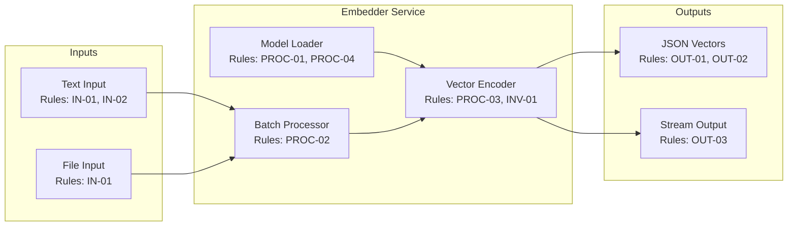

# Embedder Service PRD

Sources: AGENTS.md

## Resources

- `RES-01` Python 3.12+ — runtime environment
- `RES-02` PyTorch — tensor computation and model inference
- `RES-03` Qwen3 Embedding Model — text-to-vector transformation
- `RES-04` Sentence Transformers — embedding model wrapper (optional)
- `RES-05` NumPy — vector operations
- `RES-06` Every Code — orchestration harness (consumer)

## Problem Statement

AI agents need to convert text into dense vector representations for semantic similarity
search, clustering, and retrieval-augmented generation. The Qwen3 embedder model provides
high-quality embeddings but requires a Python/PyTorch runtime. This service wraps the
model in a CLI-invocable script that agents can call for batch or single-text embedding.

## Goal List

* **GOAL-01 — CLI-invocable embedding:** Provide a command-line interface that accepts
  text input and returns vector embeddings in a standard format.
* **GOAL-02 — Batch processing:** Support embedding multiple texts in a single invocation
  for efficiency.
* **GOAL-03 — Deterministic output:** Same input text always produces identical embedding
  vectors (no randomness in inference).
* **GOAL-04 — Workspace isolation:** Support embedding within named workspaces for
  organizational separation.
* **GOAL-05 — Streaming output:** Support streaming embeddings for large batches to avoid
  memory accumulation.

## Indexed Rule List

### Invariants

* **Precedence:** Invariants apply globally and override any conflicting requirements.
* **INV-01 — Determinism:** Embedding the same text must always produce the identical vector.
* **INV-02 — No side effects:** Embedding operation must not modify any external state.

### Input Rules

* **IN-01 — Text input formats:** Accept text via stdin (one per line), file path argument,
  or JSON array argument.
* **IN-02 — Encoding:** All text input must be UTF-8 encoded.
* **IN-03 — Max length handling:** Texts exceeding model max tokens are truncated with
  warning to stderr.

### Processing Rules

* **PROC-01 — Model loading:** Load Qwen3 embedding model on first invocation; cache for
  subsequent calls within same process.
* **PROC-02 — Batching:** Process texts in configurable batch sizes (default: 32) for
  GPU efficiency.
* **PROC-03 — Normalization:** Output vectors are L2-normalized by default (configurable).
* **PROC-04 — Device selection:** Auto-detect GPU availability; fall back to CPU.

### Output Rules

* **OUT-01 — Vector format:** Output embeddings as JSON array of float arrays.
* **OUT-02 — Metadata inclusion:** Include input text hash and vector dimension in output.
* **OUT-03 — Streaming mode:** With `--stream` flag, output one JSON object per line.
* **OUT-04 — Error reporting:** Errors written to stderr; non-zero exit code on failure.

### CLI Rules

* **CLI-01 — Basic invocation:** `python -m scripts.embedder embed "text to embed"`
* **CLI-02 — File input:** `python -m scripts.embedder embed --file texts.txt`
* **CLI-03 — Batch stdin:** `cat texts.txt | python -m scripts.embedder embed --stdin`
* **CLI-04 — Workspace flag:** `--workspace <name>` for workspace isolation (future use).
* **CLI-05 — Dimension flag:** `--dim <int>` to truncate output dimension (if supported).

## Component Diagrams

### Component Diagram: Embedder Service

## Success Metrics

| ID | Metric | Target | Measurement | Goals |
|----|--------|--------|-------------|-------|
| `MET-01` | Embedding latency (single) | <100ms | Benchmark on 100 texts | GOAL-01 |
| `MET-02` | Batch throughput | >1000 texts/sec | Benchmark batch of 10k | GOAL-02 |
| `MET-03` | Determinism validation | 100% | Hash comparison of 1000 re-embeddings | GOAL-03, INV-01 |
| `MET-04` | Memory stability | <4GB peak | Monitor during 100k text batch | GOAL-05 |
