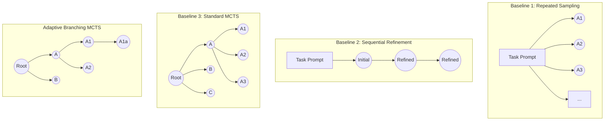

## ID Index

This document will gradually migrate to PRD-style IDs with the following prefixes:

- `GOAL-*` — goals/outcomes
- `INV-*` — invariants/constraints
- `ALG-*` — algorithms/procedures
- `SET-*` — settings/configuration requirements
- `ART-*` — artifacts and contracts
- `MET-*` — metrics/scoring
- `TEST-*` — test/coverage requirements
- `REQ-GAP-*` — missing requirement inputs needed to derive a decision
- Domain prefixes — `PROD-*`, `UX-*`, `UI-*`, `TECH-*`

## Artifacts produced

- `ART-PLN-01` — Design Map (instance)
  - Must conform to `.tasks/processes/design map structure.md`.
  - Must be sufficient (with PRD IDs) to deterministically derive implementation artifacts.
- `ART-PLN-02` — ADR set
  - Must conform to `.tasks/processes/adr/ADR-000-template.md`.
  - Must be emitted for any non-trivial choice actually made.
- `ART-PLN-03` — Execution plan
  - Must conform to `.tasks/processes/plan.md`.

## 1) Scope definition

“The system” refers to this corpus only:

* **Command orchestrators**: `.claude/commands/*.md`

  * `create-plan.md`, `update-plan.md`, `execute-plan.md`, `create-refactor-plan.md`
  * (optional) `refactor.md` only if it is not redundant with execute-plan
  * (new) `analyze.md`
* **Agents**: `.claude/agents/**`

  * decomposer/layer-reviewer/design-refactorer/comment-applier
  * diagram-generator/design-formatter (+ refactor-formatters)
  * skeleton-analyzer/component-analyzer/integration-mapper/refactor-planner
  * test-planner/test-implementor/test-impl building blocks, impl agents, composer, debug agents
* **Python state machines**:

  * `scripts/planner/**`
  * `scripts/codegen/**`
* **Reference docs/algorithms**:

  * `.ai/docs/**`
  * `.ai/agents/10-research/**` (if used)

Everything else in the repo is out of scope for this definition.

### 1.1 Scope maintenance requirement

Whenever new modules or workflows are added to the system, this scope section must be updated to classify them as in-scope or out-of-scope. This ensures clarity and traceability about which parts of the codebase the requirements apply to, preventing any ambiguity in future extensions.

---

## 2) Workspace model and scoping

### 2.1 No ticket-scoped filesystem layout (worktree-scoped instead)

The system should run **inside whatever repo tree/worktree it is executed from**, and all artifacts should be local to that tree.

* A ticket ID may still exist for Linear, but it should be **metadata**, not the filesystem namespace.
* **No ticket-named folders**: The system MUST NOT use ticket-specific subfolders in any file path. The design output location is always `.tmp/design/` in the current repo/worktree, with a single unified state (as opposed to per-ticket directories).
* Instead of `.tmp/design/<ticket_id>/...`, expected layout is:

```
<repo-root>/
  .tmp/design/
    state.yaml
    agent_input.yaml
    agent_output.yaml
    diagrams.yaml
    architecture.md
    implementation.md
    ... (refactor/analyze outputs)
```

**Isolation model**:

* Concurrency/isolation is achieved by running workflows in different **git worktrees** (or different directories), not by ticket subfolders.

### 2.2 Worktree-local artifacts enforcement

**The system MUST enforce that all temporary design artifacts are stored in the local repository's working directory (worktree) and nowhere else.**

This rule guarantees:

* **Isolation between parallel runs**: Each run in a separate Git worktree has its own `.tmp/design/` space, preventing any cross-run file collisions.
* **Maintainability**: Avoids cross-ticket or cross-run file conflicts by ensuring complete isolation at the worktree level.
* **Simplicity**: A single, consistent file structure (`.tmp/design/`) across all runs eliminates confusion about artifact locations.

**Artifacts covered by this requirement**:

* All state files (`.tmp/design/state.yaml`)
* All agent I/O files (`agent_input.yaml`, `agent_output.yaml`, or namespaced variants in `inputs/` and `outputs/`)
* All diagram files (`diagrams.yaml`)
* All documentation files (`architecture.md`, `implementation.md`, etc.)
* Any other intermediate or temporary files generated during planning, analysis, or refactoring workflows

**No exceptions**: There are no circumstances under which design artifacts should be written outside the current worktree's `.tmp/design/` directory (or subdirectories thereof, such as `.tmp/design/inputs/` or `.tmp/design/outputs/`).

### 2.3 diagrams.yaml scope

* `diagrams.yaml` is scoped to the **current workspace/run** (i.e., the directory/worktree the command is executed in).
* With no ticket scoping, it is still unambiguous because each worktree has its own `.tmp/`.

---

## 3) Agent file collision requirements (parallel I/O isolation)

### 3.1 Collision risk

Yes: **`agent_input.yaml` and `agent_output.yaml` collide** if multiple agents write them concurrently in the same workspace.

This is acceptable only if the workflow guarantees **sequential** execution for any step that reads/writes those shared filenames.

### 3.2 General isolation rule

**Parallel steps must not share single fixed filenames for reading or writing unless the content is read-only and identical across all parallel agents.**

This applies to:

* `agent_input.yaml` / `agent_output.yaml` (per-agent I/O)
* `state.yaml` aggregation writes (if multiple workers write concurrently)
* `diagrams.yaml` (if parallel diagram generation ever happens)
* Any per-phase documentation or intermediate files written by parallel workers

### 3.3 Namespaced I/O for parallel fan-out

**Unique namespaced I/O requirement**: All parallel agents MUST use namespaced input/output filenames to avoid collisions. For any fan-out of parallel tasks, the system MUST NOT write to a shared `agent_input.yaml` or `agent_output.yaml` for multiple agents.

When parallel agents require different inputs or produce different outputs:

* **Inputs**: Use namespaced input files or an equivalent isolated input channel:
  * `inputs/<unit_id>.yaml` (already implemented in `state.py`)
  * `agent_input.<unit_id>.yaml`
  * Direct parameter passing (no shared file at all)

* **Outputs**: Use namespaced output files:
  * `outputs/<unit_id>.yaml` (already implemented in `state.py`)
  * `agent_output.<unit_id>.yaml`
  * `agent_output.<branch_id>.<unit_id>.yaml`
  * or a dedicated folder like `.tmp/design/outputs/<action>/<unit_id>.yaml`

**Benefits of namespaced I/O**:

* **System resilience**: Prevents file overwrite races that could cause data loss or corruption when multiple agents execute concurrently
* **Traceability**: File names encode the origin of each agent's data, making it clear which output came from which unit or branch, improving debugging and audit capabilities

The Python state machine (or an orchestrator agent) aggregates namespaced outputs into state after all parallel agents complete.

### 3.4 Expected behavior by phase type

* **Sequential phases** (most phases): shared `agent_input.yaml` + `agent_output.yaml` is fine.
* **Parallel decomposition** (e.g., "spawn one decomposer per unit in parallel"):
  * **MUST** use namespaced inputs (`inputs/<unit_id>.yaml`) when per-agent inputs differ
  * **MUST** use namespaced outputs (`outputs/<unit_id>.yaml`)
* **Building-block composition** (e.g., test-implementor calling 14 blocks): may be sequential, but if parallelized later, must also use namespaced I/O.
* **Aggregation phases**: When multiple parallel agents complete, a single orchestrator aggregates their outputs into `state.yaml`. This aggregation itself is sequential (no concurrent writes to `state.yaml`).

### 3.5 Sequential aggregation with traceability

**Controlled aggregation requirement**: Shared artifacts like the aggregated `state.yaml` MUST only be written in a controlled, sequential manner after parallel agents complete.

**Traceability in aggregation**: The aggregation process MUST tag or partition the combined results such that each piece can be traced back to its producing agent.

**Implementation requirements**:

* A supervising orchestrator MUST merge outputs in sequence (not concurrently)
* When merging data from parallel outputs, the orchestrator MUST include identifiers within `state.yaml` entries to indicate their source branch/unit
* Each state entry should contain metadata linking it to the agent, unit ID, or branch that created it

**Benefits of traceable aggregation**:

* **Correctness under parallelism**: Sequential writes prevent race conditions and ensure state consistency
* **Debugging support**: Linking state entries to their creation source aids in troubleshooting and understanding the provenance of design decisions
* **Audit trail**: Clear attribution of which agent produced which output enables verification and quality control

---

## 4) Layer review input requirements

### 4.1 Complete two-layer context requirement

The layer reviewer must have **comprehensive and complete** context for the layer under review. The system must provide the reviewer with the full parent unit context, all newly generated child units for that parent, and the relationships between those children. No relevant information should be omitted from this two-layer slice.

**Required context elements**:

* the **parent unit** being reviewed (full specification, constraints, capabilities)
* the **entire set of newly generated children** for that parent (the "new layer")
* the **relationships among those children** (relations/edges, expected/provided capabilities, inter-child dependencies)
* **all constraints and configurations** that affect the parent or its children at this layer
* **any interfaces or contracts** that children are expected to implement or provide

**Completeness is critical for correctness**: The reviewer cannot make valid judgments if any part of the picture is missing. Every constraint or configuration affecting that layer and each inter-child relationship must be included in the review input.

This is effectively a "two-layer slice": **parent + its children** (plus all relevant metadata, constraints, and relationships).

### 4.2 Multi-parent visibility and traceability

**Shared unit detection requirement**: If any child unit is shared (has multiple parent links), the layer-reviewer input MUST explicitly indicate that fact.

**Cross-cutting relationship disclosure**: For each shared unit, the system must list the other parent(s) or contexts in which it appears. This allows the reviewer to understand the full scope of the unit's usage.

**Traceability benefits**:

* **Cross-cutting impact awareness**: The reviewer needs to know if a child is reused elsewhere. Changes to a shared unit may affect other parents, so the fact of sharing must be visible during review.
* **Correctness under sharing**: Without multi-parent visibility, a reviewer might approve changes that break other contexts where the shared unit is used.
* **Design coherence**: Understanding shared units helps ensure that modifications maintain coherence across all usage contexts.

**Implementation**: The input slice should include metadata for shared children indicating all parent links or at least a summary of impacted parents.

### 4.3 No global state needed (focused and efficient review)

The layer reviewer should **not** require full-state reading. The design of the input slice (parent + children) correctly avoids global state.

**What to provide**:

* parent context (complete specification for that unit)
* children set (all children of that parent)
* local constraints and relations (only those affecting this layer)
* multi-parent links for shared children (per Section 4.2)

**What to exclude**:

* the entire global design state
* unrelated units or layers
* constraints/configs that do not affect the reviewed layer

**Benefits of localized input**:

* **Review efficiency**: The reviewer receives exactly what is needed for a thorough assessment of fit at that layer, without extraneous information.
* **Focus**: Limiting the scope to the two-layer slice keeps the review focused on the relevant relationships and constraints.
* **Scalability**: As the design grows, avoiding full-state reads prevents input size from becoming unwieldy.

The system should continue to avoid sending the entire design state to the layer-reviewer. The slice must include all necessary local information and nothing extraneous.

---

## 5) Planning workflow requirements (create-plan / update-plan / create-refactor-plan)

### 5.1 Core output requirement: docs generated during planning

The primary deliverables of planning workflows (create-plan, update-plan, and create-refactor-plan) are:

* a structured plan (unit graph, patterns, capabilities)

  **Note**: While the final delivered design may be presented as a hierarchy, internally the planning process can maintain a **directed acyclic graph (DAG)** of units when exploring alternatives. This allows shared units to be referenced once rather than duplicated per alternative.

* **planning-time documentation** that expresses:

  1. a high-level algorithm overview
  2. how atomic/tiny components fit into that overview
  3. diagrams (Mermaid) for structure and flow
  4. debugging guidance section (detailed requirements in Section 5.6)

No "guides about the planning system" are required.

### 5.2 Documentation must leverage the plan's building-block hierarchy

**Direct use of plan structure requirement**: The documentor agent MUST use the building-block hierarchy directly from the plan's internal representation (unit graph/DAG) rather than attempting to re-derive structure from raw code or implementation details.

**Applies to**: This requirement applies equally to all planning workflows that produce planning-time documentation: `create-plan`, `update-plan`, and `create-refactor-plan`.

**Rationale**: The system already knows the "skeleton" and components of the design from the planning process. The documentation generator should work with those blocks—the units, their patterns, and their relationships—instead of analyzing lines of code. This makes patterns and architecture immediately visible in documentation, giving readers a clear view of how the solution is organized.

### 5.3 Block-level documentation requirements

**Architecture-first documentation**: The documentation produced during planning MUST present the solution as a hierarchy of blocks (modules, components, integrations) showing how the largest building blocks define the system's structure.

**Applies to**: This requirement applies equally to all planning workflows that produce planning-time documentation: `create-plan`, `update-plan`, and `create-refactor-plan`.

**Required documentation elements**:

* **Highest-level blocks**: Clearly convey the major patterns/systems and their organization, providing insight into design intent
* **Block roles and relationships**: For each block, describe:
  * What the block is (its purpose and responsibility)
  * How it interacts with other blocks (dependencies, interfaces, data flow)
  * What constraints or capabilities it provides or requires
* **Behavioral understanding without implementation details**: By documenting what each block is and how it interacts with others, the system's behavior can be understood without examining implementation details
* **Debugging guidance**: Include debugging guidance as specified in Section 5.6, covering potential points of failure, known pitfalls, and diagnostic approaches for each block or component

**Benefits**: This ensures clarity and maintainability—future readers will understand the design from the top down, comprehending the architecture through composed blocks and their interactions.

### 5.4 Avoid code-centric descriptions

**Abstraction-based documentation requirement**: The documentor MUST NOT list or narrate line-by-line code in the planning documentation. Instead, it should describe what the code is supposed to do by using the plan's abstractions.

**Applies to**: This requirement applies equally to all planning workflows that produce planning-time documentation: `create-plan`, `update-plan`, and `create-refactor-plan`.

**Implementation**:

* Rather than showing code snippets, explain the block or function's purpose and its expected constraints/behavior
* Derive behavioral descriptions from test intent when available
* Explain algorithms and structure using the block model (as specified in 5.1: algorithm overview and how tiny components fit)

**Rationale**: This approach provides insight into the system by focusing on composed blocks and their interactions, making the design comprehensible at the architectural level rather than forcing readers to infer structure from implementation details.

### 5.5 Test planning belongs in the design phase (system-wide rule)

**Integrated test planning requirement**: Any plan that produces code changes MUST include test intent. The design phase must produce corresponding test plans alongside the design. Every planned feature or component must have associated tests defined at design time.

**Coupling of planning and testing**: This requirement ensures functional correctness is built into the design. No code implementation should proceed without an accompanying idea of how it will be verified. Test plans and design plans are created together, not sequentially.

This is a system-wide requirement that applies to all planning workflows, not just create-plan and update-plan. Whenever a workflow leads to code changes that need tests, test planning must be part of the design phase.

**Defaults by workflow:**

* **create-plan**: expected default = yes, generate test plans.
* **update-plan**: expected default = yes, update/regen test plans as needed.
* **create-refactor-plan**: expected default = yes, generate/update test plans when the refactor affects behavior or needs regression protection.

**Exceptions** (apply to all workflows):

* If the design is purely documentation-only (analyze) or purely discovery-only.
* If the plan is "no-op" / no executable change / only deletes (policy decision), but default is still "design includes test intent."

**Reference**: See Section 11 for test coverage expectations and tier requirements.

### 5.6 Debugging guidance documentation requirements

**Debugging section requirement**: The planning-time documentation MUST include a comprehensive debugging guidance section that helps future maintainers diagnose and resolve issues in the designed system.

**Applies to**: This requirement applies to all planning workflows that produce planning-time documentation: `create-plan`, `update-plan`, and `create-refactor-plan`.

**Required debugging documentation elements**:

* **Potential points of failure**: For each component or integration point, identify and document:
  * Where failures are most likely to occur
  * What symptoms or error messages indicate specific types of failures
  * Which external dependencies or integrations are potential failure sources

* **Known pitfalls and edge cases**: Document known issues, gotchas, or edge cases:
  * Components that rely on external systems (APIs, databases, services)
  * Known race conditions or timing-sensitive operations
  * Boundary conditions that may cause unexpected behavior
  * Common misconfigurations or misuses

* **Diagnostic approaches**: For each potential failure point, provide guidance on how to investigate:
  * Which logs to examine and what to look for
  * How to enable verbose logging or debug modes for specific components
  * Step-by-step diagnostic procedures for common failure scenarios
  * Where to look in the codebase when specific symptoms arise

* **Block-based debugging strategy**: Leverage the architectural documentation (block model) to guide debugging:
  * Map failing behaviors to the high-level blocks or components responsible
  * Explain how to use the block structure to narrow down fault locations
  * Describe how to start debugging at the design level before diving into code details
  * Guide debuggers to use test blocks as documentation of expected behavior for diagnosis

* **Test blocks as diagnostic tools**: Explain how to use unit test plan blocks for debugging:
  * Test blocks represent expected behavior of tiny details and edge cases
  * Compare actual behavior against expected behavior described by test blocks
  * Use test specifications to understand intent without reading implementation code
  * Identify which test covers specific edge cases or failure scenarios

* **External system information**: For components with external dependencies:
  * Document which external systems each component depends on
  * List known limitations or quirks of external systems
  * Provide contacts or ownership info (e.g., "Module B (owned by Team X) – if experiencing issues with its external API, reach out to Team X or open a ticket in their queue")
  * Suggest where to find external system documentation or support resources

* **Troubleshooting starting points**: Provide actionable starting points for common scenarios:
  * "If you see error X, check component Y's connection to service Z"
  * "For timeout issues in module A, review the timeout configuration in file B and consider external service latency"
  * "If integration tests fail but unit tests pass, examine the integration contracts between blocks X and Y"

**Integration with block documentation**: Debugging guidance should be woven into the block-level documentation (per Section 5.3). For each significant block or component, include inline debugging notes about:
* Its potential failure modes
* How to diagnose issues specific to that block
* What to check if that block's behavior deviates from expectations

**Rationale**: Providing comprehensive debugging guidance in planning documentation enhances system maintainability and helps manage "unknown unknowns" by giving future debuggers a structured starting point. It ensures that debugging is approached systematically using the architectural knowledge already captured in the plan, rather than requiring debuggers to reverse-engineer the system's structure.

**Cross-reference**: See Section 9.7 for additional requirements on debugging workflows during execution, and Section 10.3 for debugging documentation requirements in analysis outputs.

### 5.7 ALG-PLN-01 Parallel top-down + bottom-up planning with scoring

The planning workflow MUST run as a parallel top-down + bottom-up algorithm with a scorecard that is **traceable to evidence**:

1. **Top-down pass (skeleton → components → contracts)**: Propose a candidate architecture skeleton, then decompose into components and explicit contracts/interfaces. Each top-down branch/option MUST have a scorecard initialized with the current best-known assessment.
2. **Bottom-up pass (leaf implications → evidence)**: Explore leaf-level implications (ecosystem quirks, boundary obligations, testability constraints, drift risks) and emit **evidence items** that each include (at minimum) a short claim, a concrete source reference (e.g., file path, doc reference, command output), and the impacted top-down branch/option(s).
3. **Reconciliation (evidence → scorecard update)**: Apply bottom-up evidence to update each impacted branch/option scorecard. Every scorecard field change MUST record the evidence item IDs that caused the update, so the scorecard is reviewable and auditable back to sources.
4. **Scheduling (frontier selection)**: Use the existing frontier scheduling strategy (MCTS-like; see Section 7.6) to select which node/branch to expand next, using the **updated** scorecards as the primary scoring signal.

#### Decision vs requirement-gap gating (hard rule)

- If a choice is fully determined by existing `INV-*` / `SET-*` / `RULE-*` and explored evidence items → the system MUST select the choice and emit an ADR that references the determining IDs and the supporting evidence.
- If a choice depends on an unspecified tradeoff/weight → the system MUST NOT decide; it MUST emit a `REQ-GAP-*` describing the missing inputs required to derive the decision (and defer the ADR until the choice can be derived).

---

## 6) Patch vs Regenerate semantics and cascading effects

### 6.1 Unit stability rule (strict pattern stability enforcement)

A unit can be:

* **patched**: changes within the same pattern/type (the unit's pattern remains the same)
* **regenerated**: the unit's pattern/type changes

A pattern may be patched, but not patched *into a different pattern*.

**Strict enforcement**: A unit MUST only be patched if its fundamental pattern/type remains the same. If a change would alter the unit's classification or design pattern, the system MUST treat it as a regeneration (decomposition of a new structure), not a patch. This rule guards correctness by preventing subtle pattern drift—it is crucial for system consistency that we do not, for example, "patch" a simple validator unit into behaving like a coordinator; such a shift requires a redesign via the decomposer.

### 6.2 Orphaning and child handling (orphan reuse and reassignment)

**Orphan definition (DAG semantics):** A unit is orphaned only if it has **zero parent links** after edge updates. When removing a parent relationship, the system MUST NOT delete a shared node that is still referenced by other parents.

If a parent is **regenerated**, some children may become orphaned because:

* the new parent structure has different boundaries and/or a different decomposition.

Expected behavior:

* Do **not** automatically discard all children.
* First attempt **reassignment/movement**:

  * if a child fits under another unit in the new structure, move it
  * if a shared child still has other parent links, it is not orphaned—only the removed edge is deleted
  * if multiple fits exist, treat as an ambiguity to be resolved via review/pruning
* Only discard/regenerate children if:

  * there is no fit in the revised structure, or
  * their semantics are no longer needed, or
  * they were artifacts of an abandoned structure, AND
  * **they have zero remaining parent links** (true orphan status)

**Reinforced reuse requirement**: When a parent is regenerated, the system MUST attempt to reassign or reuse existing children in the new structure whenever possible, instead of blindly discarding them. Children that still fit logically under some part of the new parent or elsewhere in the design should be moved there. Only truly orphaned units (no remaining parent and no place in the new design) may be removed. This approach improves resilience and maintainability by salvaging work (existing sub-solutions) and avoiding unnecessary re-generation of components that already satisfy requirements.

### 6.3 Review after modification

Whenever a layer changes:

* its **parent** becomes reviewable again, because the parent's fit/wiring may now be wrong.
* This is not a simple "bubble-up only" rule (see Section 7).

### 6.4 Identity preservation for patches

**Identity preservation requirement**: When applying a patch (design-refactorer), the system MUST preserve the unit's identity and metadata. The original unit's unique ID, its links, and any accumulated documentation or rationale should remain intact. Only its internal content or minor structure changes are updated.

**Rationale**: Preserving identity ensures traceability: one can track the same logical component through multiple refactorings. Conversely, for regenerations, a new unit identity is expected (since the old concept is replaced with a new pattern)—this should be clearly logged and documented as a replaced entity.

**What must be preserved during patches**:
* Unit unique identifier (ID)
* Parent-child relationship links
* Accumulated documentation, rationale, and metadata
* Pattern/type classification

**What may change during patches**:
* Internal content (implementation details, specifications)
* Minor structural refinements within the same pattern
* Non-breaking updates to constraints or capabilities

### 6.5 Agent responsibilities for patch vs regenerate

The system must route modifications to the appropriate agent based on whether the unit's pattern/type is stable:

**Patching (design-refactorer)**:

* When a unit's pattern/type remains stable (the unit keeps its building block classification), the system uses **design-refactorer** to execute restructuring actions.
* Restructuring actions include: merge, split, move, remove, add, and recompose.
* The design-refactorer preserves unit metadata, updates parent-child relationships, and maintains ID consistency without changing the fundamental pattern classification.
* Example: A "Validator" unit that needs to be split into two validators is handled by design-refactorer because the pattern category (process primitive) remains stable.

**Regeneration (decomposer)**:

* When a unit's pattern/type changes (the unit needs a different building block or design pattern), the system uses **decomposer** to regenerate the unit's structure.
* Decomposer analyzes the unit fresh and produces either an atomic specification OR new decomposition paths.
* Children of the regenerated unit are handled per the orphaning rules in Section 6.2 (attempt reassignment before discard).
* Example: A unit originally classified as a "Guard" that actually needs to become an "Orchestrator" is regenerated via decomposer.

**Decision flow**:

1. **layer-reviewer** analyzes the design and identifies issues (observations, refactoring actions).
2. If the recommended action preserves pattern stability (merge, split, move, recompose), route to **design-refactorer**.
3. If the recommended action requires pattern/type change or fundamental re-decomposition, route to **decomposer**.
4. After either agent completes, the parent layer becomes reviewable again per Section 6.3.

**Boundary cases**:

* If the layer-reviewer is uncertain whether a restructuring changes the pattern, it should flag the case for explicit decision before routing.
* Split operations that result in units with different pattern categories than the original trigger decomposer for the new sub-units (they start as `pending`).

### 6.6 Copy-on-write for shared nodes (fork-on-write with logging)

When a unit is canonicalized/shared across multiple branches or parents (per Section 7.5), modifications require special handling:

* If a shared node must diverge for one branch/context, the system MUST **fork** the unit (copy-on-write) to a new node identity for that branch.
* The original canonical node remains unchanged for other branches/parents that still reference it.
* The forked node receives a new unique identifier and is no longer considered equivalent to the original.

**When forking is required:**

* A patch or regeneration is requested that would break equivalence with other uses of the shared node.
* A branch-specific modification conflicts with the semantics expected by other parents.

**When forking is NOT required:**

* All parents/branches agree the modification is acceptable (unanimous consent).
* The modification is additive and does not break existing contracts (e.g., adding optional metadata).

**Fork logging requirement**: The system MUST log fork events for traceability. Each time a shared unit is forked, the system should record:
* The original unit ID and the new forked unit ID
* Which branch triggered the fork
* The reason for forking (what modification required divergence)
* Which other branches/parents continue to use the original unit

**Example log entry**: "Unit X forked to X' for branch B because a branch-specific modification was required [description of change]. Original unit X remains in use by branches A and C."

**Rationale**: Fork logging ensures traceability, allowing later analysis to trace how divergent versions of a component came to be and understand the evolution of shared components across different solution paths.

---

## 7) Solution-space / branch exploration and pruning requirements

### 7.1 Multiple alternatives across many layers

The system must support multiple alternative solutions simultaneously:

* alternatives can exist at multiple layers at once
* a “final solution” exists only when there are **no remaining alternatives across the entire output**

This implies a branch model that can represent:

* sibling solution spaces
* relationships between solution spaces
* the current “active set” under exploration

### 7.2 Sibling comparison and pruning

When multiple sibling solutions exist and are expanded:

* the system must compare them and attempt pruning
* pruning is allowed only when the system is confident the solution is weak/unfit
* if unsure (or lacking info), continue exploration

Pruning is not "choose one quickly"; it is "discard only when clearly inferior."

**Cautious pruning principle**: The system MUST maintain multiple alternatives and never prune prematurely. Pruning should be highly evidence-based and a branch may only be eliminated if it is clearly inferior in nearly all objectives or has a definite fatal flaw. In uncertain cases, the system MUST continue exploration or gather more information rather than eliminating alternatives. This ensures the solution space exploration is resilient and does not cut off potentially viable paths too early.

### 7.3 Non-monotonic exploration (reintroducing branches)

Because deeper exploration produces new facts, it must be possible for:

* previously pruned branches to become viable again if **new information** changes the evaluation

Therefore:

* pruning must record "why" (criteria/evidence) so later it can be reconsidered.
* "we already looked at this" is not sufficient to discard a branch if new facts exist.

**Recorded rationale for pruning**: For every branch the system prunes, it MUST attach a detailed rationale in the state, including references to the specific objectives or tests where the branch failed. The justification should cite concrete evidence such as "failed requirement X" or "test case Y failure" or a metric comparison (e.g., "20% lower performance"). Each rationale entry MUST be traceable to concrete evidence with links to requirement IDs, test names, or metric thresholds. This explicit provenance is essential for traceability, later review, and enabling the branch resurrection logic (Section 7.9) to check if those specific reasons are no longer valid.

### 7.4 Infinite loop risk

Regeneration + multi-branch exploration can cause infinite loops.

Expected behavior:

* the system needs explicit loop control rules:

  * detect "no-new-information" revisits
  * detect "same fit metrics with same inputs" cycles
  * bound repeated regenerate/refactor cycles unless evidence changed

**Configurable loop control parameters**: The system MUST implement configurable limits and thresholds to prevent infinite loops while remaining tunable. These parameters should include:

* Maximum number of regenerate-refactor cycles per unit (recommended default: 2 cycles before escalation)
* Thresholds for detecting stagnation (e.g., repeated state signatures)
* Time or iteration budgets for exploration phases

These limits MUST be configurable for tuning but have safe defaults. When a loop is detected, the system MUST clearly log the event (e.g., "Loop detected in component A between pattern redesign and refactor") and then change strategy or seek external input.

(Exact mechanisms are implementation choices; the requirement is that loops are prevented without blocking valid reconsideration driven by new information.)

### 7.5 Graph-based solution graph

The system's search space is a graph of units and decisions rather than purely separate trees per alternative.

**Directed acyclic structure**:

* The overall reasoning or design space must form a DAG where nodes represent units, intermediate solutions, or reasoning steps, and edges represent parent-child or dependency relationships.
* This allows arbitrary branching and merging of solution paths.
* Each unit or subproblem should be identified such that if the same subproblem appears in multiple branches, it is represented by one node (with multiple parent links) instead of duplicated sub-nodes.

**Unit canonicalization**:

* The system MUST detect and unify identical sub-units across different branches.
* If two alternative designs produce an equivalent component or identical intermediate result, the framework should treat them as a single node in the graph (to be reused) rather than two redundant copies.
* Canonicalization can be based on unique unit identifiers or content hashes to ensure structurally identical units converge to one representation.

**Typed operator nodes**:

* The graph may include different types of nodes beyond design units—for example, nodes representing operations or reasoning steps (like an evaluation, test execution, or transformation).
* This creates a typed operator graph where generation steps, scoring/evaluation steps, and solution states are all nodes in the network.
* The architecture must support marking nodes with their role (e.g., "question decomposition" node vs. "code generation" node vs. "test evaluation" node) and directed edges to capture the flow (which step's output feeds into which next step).
* This design makes the reasoning process explicit and allows integration of evaluation operations into the search graph itself.

**State sharing and memory reuse**:

* Because of the DAG structure, the system MUST reuse prior results for repeated subproblems.
* When a node has already been expanded (i.e., a subproblem solved or a unit designed) in one branch, and another branch reaches the same node, the prior results (children or solution content) should be available without re-computation.
* The graph acts as a memory: exploration should never recompute an identical node twice, unless a change in context invalidates the previous result.
* This improves efficiency and consistency across branches.

### 7.6 Heuristic frontier expansion strategy

The system must use adaptive, heuristic-guided expansion of the solution graph, rather than a fixed expansion pattern. The system should intelligently choose which part of the graph to expand next (which "frontier" node) by evaluating partial solutions.



*The diagram illustrates search strategies: Repeated Sampling explores many shallow alternatives (pure exploration), Sequential Refinement focuses on one deep path (pure exploitation), Standard MCTS uses fixed branching factor, and Adaptive Branching MCTS dynamically decides whether to broaden or deepen based on heuristics and feedback.*

**Selective DAG expansion**:

* The system MUST NOT expand all branches uniformly.
* Instead, it should selectively expand only those subproblems or frontier nodes that appear promising or unresolved, allocating computation to areas with the highest potential impact or uncertainty.
* This entails a cycle of generating new nodes, evaluating their provisional outcomes, and deciding which nodes merit further refinement.
* For example, if one branch of the design clearly satisfies requirements at a layer, while another branch is ambiguous or under-specified, the ambiguous branch should be expanded next while the satisfied branch can be left as-is.

**Frontier scheduling via MCTS**:

* Incorporate a Monte Carlo Tree Search (MCTS)-like strategy (or a similar search heuristic) to guide this expansion.
* At each decision point, the system should adaptively decide whether to "go wide" (explore a new alternative branch) or "go deep" (refine an existing branch) for the next step.
* The decision can be based on heuristic evaluations of nodes—e.g., an estimate of a branch's solution quality or information gain.
* MCTS provides a principled way to balance exploration and exploitation: the system can simulate outcomes of expanding certain nodes (e.g., via lightweight evaluations or random rollouts of what might happen if that path is pursued) and use those simulations to prioritize the most promising frontier.
* This means the branch selection is dynamic and data-driven, not hard-coded (unlike always depth-first or always breadth-first).

**Complexity-based allocation**:

* Define a heuristic complexity or uncertainty measure for each node (e.g., a score indicating how "difficult" or unresolved that subproblem is).
* The system should focus expansion on nodes with high complexity/uncertainty, as suggested by frameworks like Adaptive Graph of Thoughts.
* For instance, a subproblem that the model finds confusing (or that has multiple competing child solutions) would get more attention (expanded further or branched out) than a subproblem that is straightforward.
* This ensures compute is spent where it's most needed, improving efficiency and solution quality.

**Iterative deepening with backtracking**:

* The expansion strategy should allow revisiting higher-level nodes if needed.
* If deeper exploration reveals issues that propagate upward, the scheduler can bring focus back to an earlier part of the graph.
* This ties in with loop control (Section 7.9)—the system may determine that an earlier design decision needs an alternative approach and thus "branch" at a higher node.
* The search strategy should not strictly proceed monotonically downward; it must be able to adjust the frontier to any layer based on updated evaluations.

### 7.7 Self-consistency and voting mechanisms

The branch exploration should be augmented with a self-consistency voting mechanism to improve the reliability of final solutions. The system should be able to generate multiple independent solution paths for the same problem (leveraging the stochastic nature of LLM reasoning or different initial prompts) and then reconcile their outcomes.

**Multiple reasoning paths**:

* For critical design decisions or final answers, the system SHOULD spawn multiple complete reasoning trajectories (i.e., complete plans or sub-plans) rather than just one.
* These could be generated in parallel or in sequence, using variations in prompts or randomness to ensure diversity of approaches.
* All resulting solutions must satisfy the base requirements, but they may differ in structure or details.

**Consensus voting**:

* After obtaining multiple candidate solutions, the system should perform a voting or consensus process to select the best or most consistent solution.
* For example, if several independent runs of the planning process arrive at the same design element or the same answer for a subproblem, that convergence is a strong signal of correctness.
* Conversely, if they disagree, the system should analyze why and possibly initiate a tiebreak (through additional questioning or tests).
* In practice, this could mean taking a "majority vote" on the final answer or key design decisions, or computing a confidence score for each outcome by seeing how many reasoning paths support it.
* The chosen solution is the one that maximizes agreement across independent trials, reflecting a self-consistent reasoning outcome.

**Diversity injection**:

* The system's ability to vote effectively depends on having diverse candidates.
* Thus, when generating multiple solution paths, it should inject enough randomness or apply different strategies to avoid identical outputs.
* For instance, use temperature in LLM sampling or different decomposition strategies for each attempt.
* This ensures the sample of solutions explores the space broadly, making the voting meaningful.

**Intermediate cross-verification**:

* Optionally, the system can also use self-consistency at intermediate steps.
* If a critical subproblem is solved by two different branches with conflicting results, the system might prompt an intermediate check (e.g., ask a verification question or run a quick test) and prefer the branch that answers consistently with the majority.
* This is a form of mutual cross-checking between branches before committing to deeper exploration.

### 7.8 Multi-objective evaluation and evidence-based pruning

The pruning criteria must be evidence-based and multi-objective. The system should evaluate alternative branches on multiple dimensions and only prune when a branch is clearly inferior across all relevant objectives or based on concrete evidence.

**Multi-objective scoring**:

* Define a set of evaluation metrics for partial and complete solutions—e.g., functional correctness, fulfillment of requirements, complexity (simplicity of design), performance considerations, or alignment with constraints and best practices.
* Each branch (or solution alternative) should be scored or assessed on these objectives.
* The system must take a holistic view: an alternative is only pruned (discarded) if it under-performs on most or all key metrics compared to a sibling, or if it fatally fails one essential objective.
* For instance, a branch that passes all tests but has slightly more code complexity might still be worth exploring; it shouldn't be pruned unless a clearly better alternative exists that also passes all tests.

**Evidence-based pruning decisions**:

* When the system does decide to prune a branch, it MUST record the specific evidence and rationale for that decision.
* Acceptable evidence could be failing test cases, inability to satisfy a particular requirement, significantly poorer metric scores (e.g., much lower coverage or a violation of an architectural constraint), or expert-heuristic judgments (like "design X cannot scale due to coupling").
* The requirement is that pruning is not arbitrary—it needs justification such as "Branch A was pruned because it failed to handle edge-case Y that Branch B handled," or "Alternative design lacked support for requirement Z as confirmed by test results."
* This information should be attached to the state (for use in Section 7.9's potential resurrection logic).

**Traceable multi-objective scoring**: When evaluating branches on multiple metrics, the system MUST maintain a traceable record of each branch's scores across objectives. This should be a vector of scores or ratings stored with the branch's state. The requirement is that any comparison leading to pruning can be later reviewed, with the scorecard showing why one branch dominated another. This enhances transparency and maintainability of the system's decision logic.

**Active inquiry before elimination**: The active inquiry strategy MUST be strictly followed. If competing branches are close in merit and the system lacks information to choose between them, it MUST proactively gather more evidence before eliminating any option. This includes:

* Generating targeted tests to differentiate branches
* Asking specialized analysis agents for deeper evaluation
* Creating specific test cases aimed at scenarios where branches might behave differently
* Analyzing particular qualities like security or maintainability of each design

The system MUST only finalize a prune after these inquiries have been exhausted and a clear winner emerges. By doing so, the search process favors information gain and avoids losing good solutions due to unknowns. This ensures completeness and correctness in decision-making—difficult trade-offs trigger deeper analysis rather than premature elimination.

**Graceful degradation**:

* In cases where none of the current branches fully meet all objectives, the system should avoid pruning all options.
* Instead, it can retain the best candidates and mark the unmet objectives for further improvement.
* Pruning in a multi-objective sense might mean removing clearly dominated solutions (e.g., a design that is worse in every aspect), but keeping around any solution that is potentially redeemable via fixes or enhancements on some objectives.

### 7.9 Loop control and branch resurrection (enhanced)

This section strengthens the requirements for detecting search loops and stagnation, and for allowing pruned branches to be resurrected when justified by new information. It builds upon the infinite loop risk identified above.

**State signature and cycle detection**:

* The system should compute a signature or fingerprint of the design state at various points (for example, a combination of the set of requirements satisfied, the set of pending issues, and the overall structural outline).
* If the system encounters the same signature of partial solution state again without any new external input or change in constraints, it should recognize a potential loop.
* For instance, if after a series of regenerate/refactor operations the design returns to a form that it had previously (with just renaming or superficial differences), that indicates a cycle.
* The requirement is to detect "no-new-information" revisits programmatically—e.g., by storing visited state hashes in a cache.
* When a loop is detected, the system should adjust strategy (e.g., try a different approach or escalate for human feedback) instead of continuing endlessly.

**Limiting regenerate/patch ping-pong**:

* Set an explicit limit or heuristic threshold on how many times a particular unit or layer can oscillate between being regenerated and refactored without progress.
* For example, if a component has been regenerated twice and still ends up needing refactoring, the third cycle could trigger an alternative approach (like escalating to a different design pattern or seeking external input).
* This prevents infinite ping-pong as noted in the requirements.
* The system might implement this by maintaining a counter of modifications per unit and the measured improvement (or lack thereof) in fit metrics; if improvements plateau, that indicates a likely loop.

**Branch resurrection criteria**:

* Connect with Section 7.3's non-monotonic exploration: any time new information is acquired (e.g., a new test failure, a user-provided clarification, or an insight from deeper exploration), the system must re-evaluate previously pruned branches in light of that information.
* Concretely, the system should keep a record of pruned alternatives along with the reason they were pruned (as per 7.8).
* If the reason for pruning is no longer valid or uncertain given new data, the branch should be brought back into consideration.
* For example, if Branch X was pruned because "it didn't handle requirement Q," and later the system discovers a way to handle Q differently (or the requirement is adjusted), then Branch X is no longer inferior and should be revived.
* Another scenario: a branch was pruned due to failing a specific test; if subsequent development fixes that underlying issue (perhaps inadvertently through another branch), the previously failing branch might now pass and could be viable again—the system should then un-prune or re-expand it.

**Controlled branch resurrection**: The branch resurrection mechanism MUST be implemented in a disciplined way:

* When a previously pruned branch is resurrected due to new information, mark it with a special status indicating it was resurrected
* The system MUST re-validate the original pruned criteria for that branch in light of the new data, as a prerequisite before fully reintegrating it into the active search
* This ensures that revived branches truly have a new chance (the cause for elimination is overturned)
* The process MUST be logged for traceability (e.g., "Branch B resurrected because requirement Z's conditions changed")
* Each resurrection event should include:
  * The branch identifier and original pruning rationale
  * The new information that invalidated the pruning decision
  * The re-validation results showing the branch now meets criteria
  * Timestamp and context of the resurrection

This adds robustness to the search by not permanently losing options, while also keeping the exploration organized.

**Managed revival process**:

* To avoid chaos, resurrected branches should be reintroduced in a controlled way.
* A requirement could be that resurrected alternatives re-enter the exploration with some priority or marker that they were previously pruned.
* The system should then explicitly check whether the original pruning criteria are indeed overcome by new info.
* Essentially, pruning decisions must be reversible when their underlying assumptions change.
* This ensures the search is non-monotonic in a sound way: it won't get stuck in a false dead-end because it can correct earlier pruning if that pruning was based on now-outdated evidence.

---

## 8) Fit leakage and distributed refactoring (not just bubble-up)

### 8.1 Leakage concept and detection requirement

Details discovered deeper in the hierarchy (or unit graph) can "leak" upward:

* leakage = the system is unsure where some detail belongs, or it doesn't fit cleanly in the current layer boundaries
* leakage is a sign of poor fit at some layer

**Explicit leakage detection during reviews**: The concept of "leakage" must be taken as a red flag that the layering needs adjustment. The system MUST be designed to identify leakage explicitly during layer reviews. Any piece of information or requirement that appears in a lower layer but seemingly belongs elsewhere (or in no existing layer) MUST trigger the distributed refactoring approach.

**No silent drops**: The requirement is that leaked details MUST NOT be ignored. Every piece of information in the design either belongs to a layer or is marked as an open issue; nothing is silently dropped.

### 8.2 Distributed refactoring requirement

Refactoring is not purely bottom-up bubble-up. It must support:

* **upward restructuring** (expand a higher layer to better absorb deeper details)
* **downward redistribution** (move existing children into better fitting locations after higher-level shape changes)

**Mandatory leak resolution**: Instead of ignoring leaked details, the system MUST either:

* **pull the detail up** into a higher layer (upward restructuring), OR
* **push structure down** (create a new sub-component) to accommodate it (downward redistribution)

This prevents architectural drift where details accumulate in the wrong place.

**Coordinated multi-layer refactoring**: In addition to bottom-up "bubble-up" fixes, the system MUST support coordinated refactoring across multiple layers. For instance, if a low-level module keeps introducing high-level policy details (leakage), the solution might be to adjust the high-level design to account for that policy (creating a proper place for it). The requirements already list upward expansion and downward migration; these MUST be implemented such that a refactoring plan can include changes to several layers in one go.

**Maintaining correctness during distributed changes**: The plan MUST ensure that when a higher layer is expanded, all affected lower-layer units are re-evaluated (and possibly moved) to maintain consistency.

This means:

* changing a higher-level shape can trigger reorganization in lower layers without discarding everything
* children can be migrated into newly created areas rather than discarded

Discard/regenerate is allowed but considered the expensive fallback.

### 8.3 Unplaced details flagging requirement

**Flag unresolved details**: If a detail cannot be resolved by the current refactoring logic (for example, it's truly an out-of-scope concern or an external factor causing leakage), the system MUST flag it in documentation.

**No miscellaneous elements**: Any "miscellaneous" or uncategorized element that doesn't fit known layers MUST be explicitly called out as needing attention. This ties into unknown-unknown management (see Section 10.5): a leaked detail that remains unhandled might indicate an unknown requirement or assumption that needs external clarification.

**Explicit documentation of open issues**: By flagging unplaced details, the system ensures they are not lost. In summary, every piece of information in the design either belongs to a layer or is marked as an open issue; nothing is silently dropped.

---

## 9) execute-plan test flow expectations (updated)

### 9.1 Test-first execution with completion requirement

The execute-plan workflow MUST strictly adhere to the test-driven order:

* Tests are derived from the test plans and documented before implementation
* Code is written to fulfill those tests
* Tests are executed after code generation to validate it

**Completion requirement**: No code output should be considered complete until its corresponding tests have passed. This ensures correctness is always verified as part of the plan execution.

**Optional early test execution**: Running tests immediately after generating code (to see them fail before implementation) is optional; what is mandatory is that by the end of execution, tests are run to confirm the code meets them.

### 9.2 No skipping tests requirement

**Deferred test validation**: If for any reason a test is not run immediately (e.g., deferred), the system MUST ensure they are run at the next possible point.

**No forward progress without validation**: There should be no scenario where generated code moves forward in the pipeline without eventually being validated by its tests. This guarantees that even if a test run is skipped initially (perhaps to save time on obviously failing tests), the tests will catch any issues before finalizing the solution.

### 9.3 Structured debugging workflow

When tests fail and a debug fix is made, the system MUST implement this exact debugging sub-workflow:

1. **Detect the failure (symptom)**: Capture failing assertions, stack traces, observed behavior.
2. **Optional minimal patch**: A "patch to pass tests" may occur as a temporary measure to get tests passing.
3. **Derive new requirement**: Based on the symptom's root cause, derive a new requirement (not from the patch itself).
4. **Plan proper solution**: Plan the requirement for the correct part of the design using top-down planning.
5. **Implement via normal planning**: Apply the changes through the normal planning process, which may involve refactoring and moving logic—not just keeping the local patch.

**Requirement elevation mandate**: All bug fixes MUST become first-class requirements in the design, with associated top-down plans, rather than ad-hoc code tweaks. This approach maintains architectural integrity and long-term maintainability.

**No direct "refactor into patterns" during debug**: The system should NOT attempt large-scale refactoring or pattern-driven changes as an immediate response during debugging. The fix should first be made minimal (patch to get tests passing), then the broader pattern refactoring (if needed) happens via the planned requirement workflow. This separation is important for correctness; it avoids mixing the concerns of "make it work" and "make it clean/structured" which could introduce new errors. Debugging outputs should result in either confirming the fix or spawning a refactor-plan if the design needs improvements, but not an on-the-fly refactor.

This implies a distinct sub-workflow:

* "derive requirements from symptoms" → "plan" → "apply plan"
  rather than "fix then refactor into patterns."

### 9.4 Traceability of bug fixes

**Metadata linking requirement**: Every new requirement derived from a test failure MUST carry metadata linking it to the originating symptom or test.

**Example**: If a failing test "XYZ use-case test" led to a requirement "Handle null input in module A," then that requirement in the plan/documentation should mention "(derived from test XYZ failure)".

**Benefits of traceability**: This traceability is vital for understanding why certain design decisions were made (i.e., this was to fix bug X) and ensures that future maintainers or reviewers can see the rationale behind changes.

### 9.5 Block-based debugging strategy

**Top-down debugging approach**: The system's debugging process MUST leverage the architectural documentation (the block model) to locate and resolve issues effectively. Rather than focusing solely on the immediate line of code that failed, the system should identify which high-level block or component the failing test corresponds to.

**Design-level diagnosis**: Debugging should start at the design level:

* Determine which module or integration point's intended behavior (as described in the plan and docs) is not being met
* Use the block structure to guide the search for the fault—it narrows down where in the overall design the problem lies
* Only after pinpointing the relevant component does the system dive into code-level details for that block

**Correct placement of fixes**: This top-down approach ensures that fixes are made in the correct place (the place responsible for that behavior) and not as scattered patches.

### 9.6 Utilize test blocks for diagnosis

**Tests as behavioral documentation**: The system MUST use the unit test plan blocks as a tool for debugging fine-grained issues. Since unit test blocks represent the expected behavior of tiny details and edge cases, they can be used in place of reading through raw code during debugging.

**Comparison-based debugging**: For example, if a particular edge-case is failing, the corresponding unit test specification tells us what the code is supposed to do in that scenario. The debugger can compare the code's actual behavior against the expected behavior described by the test block to isolate what's going wrong.

**Tests as intent specification**: This is often easier and less error-prone than reading the code, because the test block summarizes the intent. In essence, the tests themselves are documentation of the intended behavior—leverage that.

**Fallback to implementation**: Only if something is not covered by tests should the system resort to inspecting the implementation details directly.

### 9.7 Debugging guidance documentation cross-reference

**Debugging documentation requirement**: All documentation generated by the system (planning documentation, analysis documentation, and refactoring documentation) MUST include comprehensive debugging guidance to support future maintainers in diagnosing and resolving issues.

**Detailed requirements**:

* For **planning workflows** (create-plan, update-plan, create-refactor-plan): See Section 5.6 for comprehensive requirements on debugging guidance in planning documentation
* For **analysis workflows** (analyze): See Section 10.3 for comprehensive requirements on debugging guidance in analysis documentation

**Core principle**: Debugging documentation should leverage the block model and architectural understanding captured during planning or analysis. Future debuggers should be able to use the documented block structure to:

* Identify which high-level component is responsible for observed behavior
* Narrow down fault locations using architectural knowledge
* Understand potential failure points and how to investigate them
* Access diagnostic procedures and troubleshooting starting points
* Utilize test blocks as behavioral documentation for diagnosis

**Rationale**: Providing comprehensive debugging guidance in all forms of documentation is a key enhancement for system maintainability and helps manage "unknown unknowns" by giving future debuggers a structured, architectural starting point rather than requiring them to reverse-engineer the system's structure from implementation code.

---

## 10) create-refactor-plan vs create-plan vs analyze (updated)

### 10.1 Unified decomposition framework

The decomposition pattern used across all planning workflows is a generic decomposition shape:

* skeleton → components → integration mapping → deeper layers as needed

**Unified abstraction model requirement**: All planning workflows (create-plan, create-refactor-plan, and analyze) MUST use a common abstraction model for the system. The same building blocks and patterns MUST be recognized whether planning from scratch or analyzing existing code. The concept of "skeleton → components → integrations → deeper layers" applies everywhere.

**Consistent unit graph output**: The analyze workflow MUST reconstruct existing code into the same kind of unit graph that create-plan would produce. It MUST identify the high-level skeleton, the major components, and their relationships just as if it were planning a new system. This means the analyze step needs to do shape discovery and classification of existing elements. The analysis MUST output an internal representation (unit graph with blocks/patterns) identical in structure to what plan mode would output for a new design. This ensures consistency across workflows.

### 10.2 Differences in what must be discovered

* **create-refactor-plan**

  * existing code provides many boundaries/integration points
  * needs research/classification to discover *shapes* and implied architecture
* **create-plan**

  * boundaries and integration points are not known
  * needs research algorithms for:

    * shape discovery (domain/pattern recognition)
    * **boundary discovery**
    * **integration-point discovery**
* **analyze**

  * like create-refactor-plan in that it examines existing code
  * but it does not attempt to redefine shapes as a refactor plan
  * it must still discover:

    * mechanical shapes (folders/files/modules)
    * implied shapes (subsystems/components inferred from relations across files/functions)
  * it must produce high-level documentation comparable in clarity to create-plan docs (algorithm/structure across many files)

### 10.3 Block-based documentation for analysis

**Architecture-centric documentation requirement**: When running analyze.md (or any documentation generation on existing code), the system MUST leverage the identified block structure in the codebase to produce documentation. Rather than listing files and functions in a flat way, the analyzer MUST describe the system in terms of the blocks it has discovered.

**Block-structured presentation**: Documentation MUST be organized as:

* "The system consists of these subsystems (blocks), which interact via these integrations (blocks). Within each subsystem, the components are... etc."
* The documentation for an existing project MUST be comparable in clarity and structure to documentation from a planned design
* It MUST explain the architecture, algorithmic flow, and key patterns
* It MUST include comprehensive debugging guidance (detailed requirements below)

**Debugging guidance for analyzed systems**: When analyzing existing code, the documentation MUST include a debugging guidance section covering:

* **Identified failure points**: Document potential points of failure discovered during analysis:
  * Components with external dependencies (APIs, databases, message queues, file systems)
  * Integration points between major subsystems
  * Areas with complex state management or concurrency
  * Error handling gaps or weak points identified in the code

* **Observed pitfalls and patterns**: Document known issues, patterns, or characteristics found in the existing code:
  * Known race conditions or timing-sensitive operations discovered in the code
  * Components with unclear error handling or recovery mechanisms
  * External system dependencies and their characteristics (timeouts, retry logic, etc.)
  * Common misuse patterns or anti-patterns identified in the codebase
  * Configuration points that may be error-prone

* **Diagnostic procedures**: For each major component or subsystem, provide guidance on:
  * How to enable logging or debug modes (if identified in the code)
  * Which log statements or metrics indicate specific failure scenarios
  * Where to look in the codebase for specific types of issues
  * How to use the block structure to narrow down fault locations

* **Block-based debugging approach**: Explain how to debug using the identified block structure:
  * Map the documented blocks to their code locations (files, modules, packages)
  * Describe how to use the architectural view to identify which block is responsible for specific behaviors
  * Guide debuggers to start at the design/block level before diving into implementation details
  * Link test blocks (if tests exist) to the components they verify, enabling use of tests as behavioral documentation

* **External system context**: For components with external dependencies:
  * Document which external systems are used and for what purpose
  * Note any discovered quirks, limitations, or special handling for external systems
  * Identify configuration parameters related to external system interaction (timeouts, endpoints, credentials locations)
  * If ownership or contact information can be inferred (from comments, docs, or repository metadata), include it
  * Note if external system behavior is undocumented or poorly understood (flag as unknown-unknown per Section 10.5)

* **Troubleshooting starting points**: Based on the analysis, provide actionable guidance:
  * "For errors in subsystem X, check the logging in module Y and verify the connection to service Z"
  * "If component A fails, examine its configuration in file B and verify external dependency C is accessible"
  * "When observing symptom X, the likely responsible component is Y based on the architectural flow"

* **Gaps and unknowns**: Explicitly document debugging information that could not be determined:
  * Components with no logging or insufficient diagnostic capabilities
  * External dependencies with unknown failure modes
  * Areas where error handling is absent or unclear
  * Configuration parameters with unknown purposes (flag per Section 10.4)

**Integration with block documentation**: As with planning documentation (Section 5.6), debugging guidance should be integrated into the block-level descriptions. For each identified block or component, include inline debugging information specific to that block.

**Rationale**: Analysis documentation serves as a guide to understanding and maintaining existing systems. Including comprehensive debugging guidance ensures that future maintainers can diagnose issues systematically using the architectural understanding captured during analysis. This is especially critical for existing systems where institutional knowledge may be lost or where documentation is sparse.

**Documentor advantage requirement**: To achieve this effectively, the analyzer MUST act like the planner: it MUST treat the code as if it were composed of the abstract units and patterns used in planning, and document accordingly. The documentor agents MUST capitalize on their ability to "see the building blocks at every layer of abstraction" and produce architecture-centric documentation, rather than code-centric documentation. The documentor has an advantage because it doesn't need to infer relations by reading code—it already built or identified the structure.

### 10.4 Constraint provenance ("why" tracking)

For analyze, create-refactor-plan, and create-plan (and update-plan when updating documentation):

* the system MUST identify constraints/configurations (timeouts, rate limits, retries, strict validation, etc.)
* for each constraint/config, the documentation MUST state:

  * **what it is** (the value or decision)
  * **where it lives** (file/setting/location in code or config)
  * **why it exists** (the rationale)

**Traceability and source citation requirement**: The system MUST enhance "why" tracking with traceability—whenever possible, **cite the source of the rationale**:

* If a timeout value is taken from an environment variable or library default, mention that
* If a pattern is chosen to comply with a known requirement or spec, reference that requirement by name/ID
* Each "why" MUST be grounded in either:
  * the code's history
  * a comment
  * an external standard
  * a logical inference
* If none is found, mark it explicitly: "(reason requires investigation)" or "(rationale unknown)"

**No invented rationales**: If the system does not know "why" something is the way it is, it MUST say so plainly and ideally prompt a human or research agent to investigate. This could be as simple as adding a "TODO: determine why X is set to Y" in the documentation output.

**Goal**: No configuration or constraint should be left unexplained without an explicit note. This greatly improves maintainability—future engineers can quickly see the intent behind settings—and prevents the loss of institutional knowledge. It also supports correctness, because misguided constraints (with no good reason) can be revisited if flagged.

**Rationale for scope**: Both analyze and create-refactor-plan examine existing code and encounter implied shapes, constraints, and configurations. The "why" tracking requirement applies equally to both because:

* **create-refactor-plan** must understand existing constraints to preserve or intentionally modify them during refactoring
* **update-plan** must preserve and update "why" documentation as designs evolve, ensuring constraint rationales are not lost during plan modifications

### 10.5 Unknown-unknowns management

**Explicit handling requirement**: The system MUST handle "unknown unknowns" explicitly. An unknown unknown is a detail or behavior that the system didn't anticipate and doesn't understand—often arising from external systems or unforeseen interactions.

**Recording unaccounted phenomena**: When the analysis or execution uncovers a phenomenon that isn't explained by the existing requirements or knowledge, the system MUST record this as an open issue in the design state or documentation. It MUST NOT be ignored.

**Documentation of unknowns**: The documentation MUST include a section or annotation for such findings, describing:

* What was observed
* Why it's perplexing or unexpected
* Suggested next steps to resolve it (e.g., "This behavior is not accounted for in the current design and may be due to an external service limitation – further investigation needed")
* How one might investigate (enable debug logs, consult external system docs, contact the team responsible for the external system)

**External system information**: If relevant, the docs MUST point to how one might investigate. Including information like who the owners are or where to file an issue (if known) is extremely valuable.

**Examples of unknown-unknown documentation**:

* External API call that occasionally fails with an undocumented error: "External Service X call – unknown failure mode observed. Not in documentation; likely needs consultation with Service X owners."
* Workaround without full understanding: "Workaround for Y (root cause not fully understood)"

**Goal**: By doing this, we ensure that unknown issues are visible and tracked, not buried. This practice significantly enhances system resilience and debuggability, since future work can focus on these flagged unknowns.

### 10.6 Traceability of requirements and changes

**Change provenance requirement**: For create-refactor-plan and update-plan workflows, ensure that any changes they introduce (refactoring or design updates) carry forward the "why" annotations.

**Preserving justifications**: If a constraint was justified in the original code, the new design after refactoring MUST retain that justification in the docs.

**Documenting intentional changes**: If a decision is made to intentionally change or remove a constraint, the rationale for that change MUST be documented. Example: "Increased timeout from 2s to 5s to handle longer processing as per new requirement"

**Requirement traceability**: Every requirement in the system MUST be traceable either to:

* An original source (specification, requirement document, external standard)
* A newly identified need (with justification)

### 10.7 Block integration with "why"

**Combined block and rationale documentation requirement**: Combine the block model with the rationale tracking: for each high-level block or component in the design, document not only its purpose but also any key design decisions or constraints internal to it and why they exist.

**Example format**: "Component X (authentication service) – uses a rate limit of N requests/min (to prevent abuse, as per security requirements) – stores data in memory (for quick access; chosen to meet performance target of <M ms)."

**Goal**: By weaving the why into the block descriptions, we achieve documentation that is rich in context and justifications, which is ideal for maintainability. This creates a comprehensive view of each component that includes both its structural role and the reasoning behind its internal choices.

---

## 11) Test tier requirements (ground truth)

Test tiers and enforcement types are defined in `pyproject.toml`.

**Tier paths**

* unit: `tests/unit`
* component: `tests/component`
* integration: `tests/integration`
* scripts: `scripts/tests`

**Enforcement types**

* unit/scripts: line + branch thresholds (coverage-based tiers)
* component/integration: use-case coverage (`min_usecase`) tiers

**Marker**

* pytest marker `usecase` exists and links to a use-case registry (per `pyproject.toml`).

**Interpretation requirement**

* "use-case tests" are specifically tied to the component/integration tiers.
* A null check is not inherently a use-case; classification depends on where the code lives and what the behavior represents.

### 11.1 Test coverage alignment with tiers

**Test planning across all tiers requirement**: The system's test planning MUST align with these test tiers by design. The planning phase MUST explicitly produce tests across these levels:

* **Component/Integration tests (use-case tests)**: For each major use-case or interaction among components, the system MUST ensure there is a test at the component or integration level (marked with `usecase` or in the appropriate folder). These tests validate that the high-level blocks interact as intended and that end-to-end scenarios work.

* **Unit tests**: For each unit (block) or even each important function within a block, there MUST be unit tests targeting all the "tiny details" of its behavior. Every branch and line of code should be covered by at least one unit test case.

* **Scripts tests**: For test utilities and infrastructure in `scripts/tests`, coverage thresholds MUST be met per the enforcement rules.

The planning system MUST generate these tests or at least placeholders for them. If any piece of logic is not covered by a test plan, the planning step MUST flag a gap so that a developer or AI can later add the missing test.

### 11.2 Exhaustive unit test requirement

**Complete coverage mandate**: The system MUST strive for exhaustive detail in unit test blocks: every single branch and every single line of code MUST be represented in tests.

**Coverage expectations**:

* While 100% coverage is an ideal, the requirement is to strive for complete coverage of functional cases, especially edge conditions and error handling.
* Every conditional branch, error path, and edge case MUST have corresponding unit test cases.
* Even details that might be considered "noise" in documentation (e.g., null checks, boundary conditions) MUST be tested.

**Planning-time test generation**: The planning process MUST generate unit test specifications that comprehensively cover:

* All normal execution paths
* All error handling paths
* All boundary conditions and edge cases
* All branches in conditional logic
* All exceptional conditions

If the planner identifies code logic that lacks test coverage, it MUST flag this as a gap requiring attention.

### 11.3 Use of test blocks in design documentation

**Test-design traceability requirement**: The concept of test blocks MUST be integrated into design documentation. For each component or block, the documentation MUST reference the relevant test cases verifying it.

**Implementation**:

* When describing a block's behavior, the documentation MUST include or link to the component test that demonstrates that behavior.
* This creates traceability from design to verification and reinforces the idea that the code's intended function is defined by the tests.
* By connecting blocks to their tests, the system helps readers (and the system itself) understand the purpose of the code in a more rigorous way.

**Example format**: "Component X (data validator) – verified by component test `test_validation_flow` which covers valid input, invalid input, and boundary cases. Unit tests `test_null_handling` and `test_range_validation` verify internal edge cases."

**Benefits**: This ensures that every design element has explicit verification, making the system's correctness transparent and traceable.

### 11.4 External interactions and test limitations

**Acknowledgment of unit test limitations**: Exhaustive unit tests cannot capture everything, especially when it comes to external systems or complex emergent behavior.

**External system testing requirement**: The system MUST acknowledge and handle external interactions appropriately:

* **Unit tests**: When external APIs or system calls are part of the design, unit tests will mock or simulate them, but the true behavior might have unknown aspects.
* **Integration tests**: The system MUST complement unit tests with integration tests for those external interactions.
* **Documentation of assumptions**: Any assumptions made about external system behavior MUST be documented.

**Example documentation**: "Integration test covers calling Service Y with valid and invalid tokens. Note: Service Y might have undocumented quirks regarding rate limiting; monitor logs for unexpected 429 responses."

**No untested interactions**: The requirement is that no significant interaction goes untested at the appropriate level. If it can't be fully unit-tested (because it's external), it MUST be integration-tested, and any remaining uncertainty MUST be noted as part of unknown-unknown documentation (per Section 10.5).

### 11.5 Enforce test tiers policy as hard requirements

**Tier definitions as design goals**: The system MUST interpret the tier definitions in `pyproject.toml` as hard requirements. The planning process MUST treat test tier requirements as design goals, ensuring quality gates are met by construction.

**Enforcement requirements**:

* If the policy says component tests must cover minimum N use-cases, the plan MUST ensure at least N distinct use-case tests are generated.
* If unit tests have a coverage threshold (line/branch coverage), the system MUST either generate sufficient tests or at least report the coverage it will achieve.
* The planning process MUST aim to meet or exceed testing criteria before code generation proceeds.

**Proactive quality assurance**: This proactive stance ensures that by the time code is generated, it already has a robust test suite satisfying the organization's quality gates. No code should be considered complete without meeting the tier requirements.

**Validation checkpoints**: The system MUST include validation checkpoints that verify:

* All use-case tests are present and properly marked
* Coverage thresholds are projected to be met
* Test plans exist for all planned code changes
* Gaps are flagged before execution proceeds

### 11.6 Testing strategy documentation

**Required testing strategy section**: The requirements documentation (and any design documentation generated by the system) MUST include a section summarizing the testing strategy.

**Required elements in testing strategy documentation**:

* Overview of the multi-tier testing approach
* Explanation of how unit tests ensure every branch is validated
* Description of component tests for each major component's external behavior
* Coverage of integration tests for end-to-end flows and external integrations
* Testing philosophy: catch bugs at the lowest level possible
* Mapping of requirements to tests (traceability)

**Example testing strategy section**:

```
## Testing Strategy

This design uses a multi-tier testing approach to ensure correctness and maintainability:

* **Unit tests** (`tests/unit`): Comprehensive tests for all internal logic, ensuring every branch and line is validated. Unit tests cover edge cases, error handling, and boundary conditions exhaustively.

* **Component tests** (`tests/component`): Tests for each major component's external behavior and contracts. Each component has use-case tests validating its integration points and expected capabilities.

* **Integration tests** (`tests/integration`): End-to-end tests for complete workflows and external system integrations. Integration tests validate that components work together correctly and handle real external dependencies.

* **Scripts tests** (`scripts/tests`): Tests for test utilities and infrastructure, ensuring the testing framework itself is reliable.

The testing strategy is designed to catch bugs at the lowest level possible and ensure full coverage of requirements. Every requirement is traceable to at least one test, and every test is traceable to the requirement or design element it verifies.

**External dependencies**: External API calls to Service Y are mocked in unit tests and validated with real calls in integration tests. Assumptions about external behavior are documented inline with tests.

**Coverage goals**: Unit tests target line and branch coverage thresholds per `pyproject.toml`. Component and integration tests target minimum use-case coverage as specified.
```

**Transparency and accountability**: This makes it clear to any stakeholder that the system's correctness is being thoroughly validated, and it provides traceability from requirements to tests. The testing strategy documentation ensures that quality assurance is visible, understood, and maintainable.

### 11.7 Drift detection (branch coverage gaps)

- Branch coverage gaps (or new uncovered branches created during implementation) are treated as “unplanned behavior surface.”
- The system MUST:
  1. identify whether the uncovered branch corresponds to ecosystem-required adaptation vs instruction-following drift;
  2. surface the minimal new requirement(s) that explain/justify the branch;
  3. update Design Map/PRD and re-plan;
  4. only then implement.

This MUST explicitly connect to the existing “derive requirements from symptoms” debugging workflow (see Section 9.3).

---

## 12) /refactor command expectation (unified execution workflow)

### 12.1 Unified execution workflow requirement

**Single execution entry point**: The system MUST have a single primary execution entry point (`execute-plan`) which is capable of running plans for initial implementation, updates, and refactors. The `execute-plan` command serves as the unified mechanism for executing all design changes, regardless of whether they involve new features, updates to existing features, or refactoring existing code.

**Deprecation of standalone /refactor command**: A separate `/refactor` command is unnecessary given an `execute-plan` that can handle refactor plans. Unless a clear distinction in behavior is needed and explicitly documented (see Section 12.5), the standalone `/refactor` command MUST be deprecated or removed.

**Benefits of unified execution**:

* **Maintainability**: One code path to maintain instead of multiple overlapping systems
* **Clarity**: Users and developers have one way to execute changes, reducing confusion and learning curve
* **Consistency**: All execution follows the same pipeline, ensuring predictable behavior
* **Simplified testing**: Only one execution workflow needs to be validated and tested

### 12.2 No duplicate mechanisms requirement

**Avoid overlapping execution mechanisms**: The system MUST NOT have two commands doing similar things. All design-change execution (whether adding new features or refactoring existing ones) MUST go through the same pipeline, ensuring consistent behavior and output.

**Merge unique functionality**: If any functionality was unique to `/refactor`, it MUST be merged into the `execute-plan` workflow. After such integration, having two commands would only risk divergence and increase maintenance burden without providing value.

**Single pipeline mandate**: The requirement is to avoid overlapping execution mechanisms. Having separate execution paths for similar purposes creates:

* Risk of behavioral divergence over time
* Duplicated maintenance effort
* Confusion about which command to use
* Inconsistent quality gates and validation

### 12.3 Consistent outputs requirement

**Uniform artifact generation**: By unifying the execution, the system MUST ensure that refactor plans produce the same kinds of artifacts as any other plan execution:

* State updates (design state, unit graph modifications)
* Documentation updates (architecture.md, implementation.md)
* Test runs and validation results
* Traceability metadata

**Equal quality gates**: The quality gates (such as tests, coverage thresholds, validation checks) and documentation standards MUST apply equally to all execution types. No execution path should bypass or relax quality requirements based on the type of change being made.

**Plan-agnostic execution**: The `execute-plan` command MUST handle both types of input gracefully:

* Plans from `create-plan` (new implementations)
* Plans from `create-refactor-plan` (refactoring existing code)

**Resolution before execution**: Any differences in planning (create-plan vs create-refactor-plan) MUST be resolved before execution such that execution doesn't need special cases for refactoring. The execution layer should be agnostic to the plan's origin; it simply executes the unit graph and associated instructions.

**One pipeline, all scenarios**: This ensures that one pipeline handles all scenarios, maintaining consistency in how changes are applied, validated, and documented.

### 12.4 Maintainability emphasis

**Reduced maintenance overhead**: This unified approach significantly reduces maintenance overhead. The team only needs to evolve one execution flow. Any improvements (like better error handling, logging, performance tuning) automatically benefit all uses (new code or refactor code), which increases system resilience.

**Evolutionary benefits**: With a single execution mechanism:

* Bug fixes apply universally to all execution types
* Performance optimizations benefit all workflows
* New features (like enhanced validation or better error messages) are automatically available for all plan types
* Testing and validation improvements strengthen all execution paths

**System resilience**: By having one well-maintained execution path rather than multiple divergent ones, the system becomes more resilient and reliable. Quality improvements compound rather than being diluted across multiple implementations.

### 12.5 Explicit decision requirement

**Justification mandate**: The specification MUST clearly state that having two commands doing similar things is unacceptable unless they are intentionally divergent and justified.

**Documentation if kept separate**: If for some reason the `/refactor` command is kept, the system MUST:

* Define explicitly how it differs from `execute-plan`
* Document the specific use cases where one should be used over the other
* Ensure both are kept consistent in their common functionality
* Maintain tests that validate both commands remain aligned in behavior
* Provide clear rationale for why two separate commands are necessary

**Default assumption**: The default assumption MUST be that one unified execution mechanism is sufficient. Any deviation from this must be explicitly justified and documented.

**Requirement statement**: There shall not be two overlapping execution systems; choose a single mechanism for executing plans and use it uniformly.

**Current recommendation**: Given that `execute-plan` can consume outputs from both `create-plan` and `create-refactor-plan`, and no unique functionality requiring a separate `/refactor` command has been identified, the `/refactor` command MUST be treated as redundant and removed.
