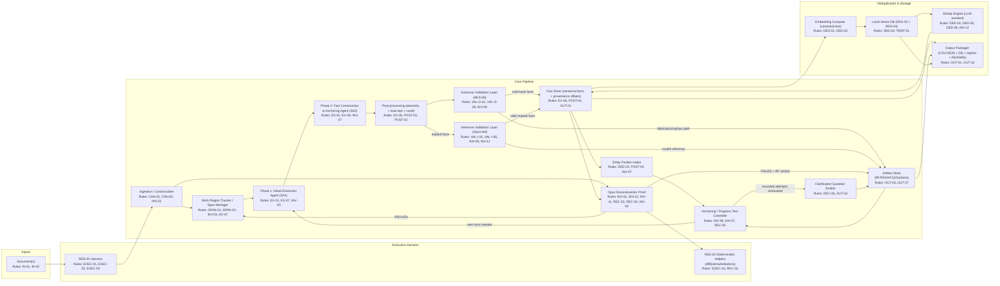
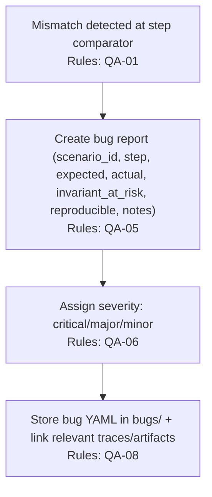

Sources: QA_strategy.md · requirements.md · split/03_non-negotiable_invariants/00_overview.md · split/03_non-negotiable_invariants/02_2_no_semantic_classification_requirement.md · split/03_non-negotiable_invariants/03_3_incomplete_structures_are_expected.md · split/03_non-negotiable_invariants/04_4_span_lifecycle_states.md · split/03_non-negotiable_invariants/05_5_facts_do_not_own_text.md

## Resources

- `RES-01` Claude Code — execution harness
- `RES-02` Python — deterministic helper scripts runtime
- `RES-03` SQLite — local DB engine / file format
- `RES-04` sqlite-vss — SQLite vector similarity extension
- `RES-05` FAISS — similarity search library (used by `RES-04`)
- `RES-06` NLTK — grammar validation toolkit and sentence boundary detection
- `RES-10` Qwen-3 Embedding model — embedding model option
- `RES-11` SentenceTransformers — embedding model family/library
- `RES-12` OpenAI `text-embedding-ada-002` — optional embedding API/model
- `RES-13` llama.cpp — local model inference backend
- `RES-14` Ollama — local model runtime/server
- `RES-15` Stanford CoreNLP — parser backend (via `RES-06`)
- `RES-17` pandas — in-memory tabular processing (DataFrames)

## Problem Statement

Large unstructured documents often contain repetitive and interdependent details, making updates difficult and increasing the risk of inconsistency. The system’s purpose is to extract all unique, atomic facts from one or more documents and organize them into a structured knowledge base (“detail index”) with deduplication, reference resolution, and contextual links so each piece of information is stored exactly once and can be maintained consistently. The solution must run locally with simple tooling and prioritize accuracy and completeness without information loss, where completeness is defined by derivability: base facts must be sufficient for byte-exact reconstruction of the canonical source text and for deriving implied facts when needed.

## Goal List

* **GOAL-01 — Structured fact index:** Extract all unique, atomic facts from one or more input documents and store them in a structured knowledge base (“detail index”), including documents of arbitrary length (potentially hundreds of pages).
* **GOAL-02 — Completeness by derivability:** Preserve base facts sufficient for byte-exact reconstruction of the canonical source text and for deriving implied facts when needed (not exhaustive enumeration of implications).
* **GOAL-03 — Atomic information units:** Ensure each stored fact contains exactly one assertion (split conjunctions and compound statements into separate facts).
* **GOAL-04 — Global deduplication:** Store each unique fact exactly once while preserving references to every location it appears (even when phrased differently).
* **GOAL-05 — Context preservation:** Represent conditional/context-dependent statements as separate facts with explicit links between condition and consequence (links may be untyped).
* **GOAL-06 — Provenance traceability:** Attach character-offset provenance back to the canonical input string for every extracted fact (and retain multiple provenance references per fact when applicable).
* **GOAL-07 — Reference resolution:** Resolve pronouns/references when computable; when not computable, preserve structure with explicit unknown placeholders rather than guessing or omitting.
* **GOAL-08 — Easy maintenance:** Support adding, removing, and modifying individual facts and merging new documents/sections by extracting and deduplicating new facts into the same store.
* **GOAL-09 — LLM-ready outputs:** Produce artifacts that are easy to package and consume (e.g., CSV/JSON fact list with metadata/links, optional vector index files, and clear README/documentation).
* **GOAL-10 — Local, lightweight automation:** Run entirely on a local developer machine with simple, fast-starting tools (no cloud dependencies) and a script-driven workflow that minimizes manual intervention.
* **GOAL-11 — Review and consistency workflows:** Enable fact-level review, editing, and conflict checking by centralizing each unique fact and its provenance in a single source of truth.

## Indexed rule list

### Invariants

* **Precedence:** invariants apply globally and override any conflicting requirements/rules in this document.
* **INV-01 — Byte-exact provenance & reconstruction:** canonical UTF-8 source string; all provenance via character offsets; reconstruction must reproduce exact bytes; reconstruction success is *sufficiency*, not exhaustive coverage.
* **INV-02 — No semantic classification required:** core pipeline need not assign relation types; links may be untyped hypotheses; goal is derivability/reconstruction, not ontology construction.
* **INV-03 — Incomplete structures expected:** any graph produced (facts, anchors, spans) is assumed incomplete; incompleteness is surfaced only via reconstruction failures and Clarification Questions (not via explicit completeness claims).
* **INV-04 — Span lifecycle states:** spans only transition `ATTEMPTABLE → PROVEN` or `ATTEMPTABLE → FAILED`.
* **INV-05 — Facts do not own text:** facts are latent explanations; the fact↔text mapping is not computable; avoid “ownership/coverage by offsets” language.
* **INV-06 — Progress test on reconstruction failures:** don’t classify causes; run anchoring/progress attempts before escalation.
* **INV-07 — Anchoring unanchored text:** anchoring search must be attempted for uncovered phrases and validated via re-reconstruction.
* **INV-08 — Island join failures:** detect adjacent proven islands lacking a join anchor; treat as distinct failure mode.
* **INV-09 — No illegal fact fabrication:** prohibit grammar fabrications (types 1–5) and inference fabrications (types 6–8); prefer honest incompleteness.
* **INV-10 — No formal proof languages:** no Lean/Coq/Isabelle semantic-equivalence proofs; validation is byte-exact reconstruction + deterministic helpers.
* **INV-11 — Derivability principle:** completeness defined by (a) reconstruction success and (b) implications derivable from extracted base facts.
* **INV-12 — Transitive anchors:** facts can be conditioned by contextual relations; dedup must preserve condition/fact structure.

#### INV-01: Byte-exact Provenance and Reconstruction (expanded)

* **Canonical source text:** the "source text" is the canonical UTF-8 string produced by ingestion after one-time format decoding (e.g., PDF→text) (`CAN-01`, `CAN-02`).
* **Provenance via offsets:** every reference back to the source document is stored as character offsets into that canonical string (context only; no text ownership) (`GOAL-06`, `EX-06`, `INV-05`).
* **Reconstruction is an explanation test (not a coverage proof):** the system attempts to re-explain a target region using its current anchors + facts + links (`REC-01`, `REC-02`).
  * **Pass condition:** reconstruction succeeds only if the system reproduces the exact original substring byte-for-byte; no paraphrase or inference acceptance (`REC-03`).
  * **No ownership:** reconstruction never assigns text ownership to facts (`INV-05`).
  * **Interpretation:** reconstruction success is a sufficiency threshold (the minimum facts needed to reproduce the original substring), not a claim of exhaustive fact extraction (`REC-01`, `INV-03`).
* **Failure semantics:** if reconstruction fails, the only conclusion is that the current understanding is insufficient to explain the text region (not a diagnosis of why) (`REC-04`, `INV-06`).
* **Escalation:** if reconstruction remains impossible after bounded progress attempts, emit a Clarification Question artifact (`REC-05`, `REC-06`, `OUT-03`).

#### INV-02: No Semantic Classification Requirement (expanded)

* **No required relation typing:** the system is not required to assign semantic relation types (e.g., "prerequisite", "is-a") as part of the core pipeline.
* **Untyped links as hypotheses:** links between facts may be untyped and treated as hypotheses; they exist to preserve context and support reconstruction/derivability, not to finalize an ontology.
* **Objective is comprehension completeness:** prioritize extracting base facts sufficient for deriving needed implications per the Derivability Principle (`INV-11`), not ontology construction.

#### INV-03: Incomplete Structures are Expected (expanded)

* **Assume incompleteness:** any graph produced (facts, anchors, spans) is assumed incomplete.
* **Surface via failure/CQ only:** incompleteness is surfaced only through reconstruction failures and Clarification Questions, not through explicit completeness claims.

#### INV-04: Span Lifecycle States (expanded)

* **Computability is a claim:** a span can be marked `ATTEMPTABLE` when it appears “computable enough to attempt” based on the current partial graph / current covering node set; this is not a guarantee.
* **Authoritative test:** the only authoritative test is the reconstruction attempt itself.
* **State meanings:**
  * `ATTEMPTABLE` — we think we have enough coverage to try reconstruction.
  * `PROVEN` — reconstruction succeeds; no uncovered words/phrases remain. PROVEN indicates the reconstruction threshold has been met (sufficiency), not that every possible fact has been extracted.
  * `FAILED` — reconstruction fails; uncovered words/phrases remain.
* **Failure is normal:** a span can be attempted and still fail; failure drives additional search/progress attempts (or escalation to Clarification Questions).

#### INV-05: Facts Do Not Own Text (expanded)

* **Facts are explanations:** facts are latent explanations, not text owners.
* **Overlaps are expected:** multiple facts may explain overlapping text; some text may only be explainable through composition.
* **No computable ownership mapping:** the mapping between facts and source text is not computable.
* **Why reconstruction exists:** reconstruction exists precisely because this mapping is unknowable.

### Execution / harness rules

* **EXEC-01 — `RES-01` harness:** orchestration is via `RES-01`; agents are sub-agents.
* **EXEC-02 — File I/O between agents:** sub-agents communicate via files to manage context.
* **EXEC-03 — Sequential pipeline:** Phase 2 depends on Phase 1; not a parallel ensemble.
* **EXEC-04 — Deterministic helper scripts only:** `RES-02` used for mechanical/deterministic operations (diff, joining, substitutions); no inference.
* **EXEC-05 — Reasoning-model minimization:** larger reasoning is optional and only for strictly necessary cases (e.g., borderline dedup, fluff classification, CQ quality).

### Input + canonicalization rules

* **IN-01 — Input formats & multi-doc:** accept raw documents (at minimum text; may include JSON/other); support multiple documents/folders; aggregate facts.
* **IN-02 — Large document support:** stream/chunk to respect memory/context; don’t ignore sections.
* **CAN-01 — Canonical UTF-8 string:** ingestion produces canonical UTF-8; all offsets index into it.
* **CAN-02 — No format artifacts:** canonical text should not retain format artifacts (e.g., PDF headers/JSON syntax).
* **SPAN-01 — Interval-based spans:** work regions are `[start,end)` offsets; spans may overlap and nest; not a disjoint partition.
* **SPAN-02 — Work region initialization:** unprocessed set begins as entire doc/region; no pre-existing `PROVEN/FAILED` spans.

### Extraction + post-processing rules

* **EX-01 — Two-phase extraction:** Phase 1 extracts raw details; Phase 2 constructs anchored atomic facts.
* **EX-02 — Base vs implied taxonomy:** every extracted fact must be categorized as Base or Implied.
* **EX-03 — Base facts are grammar-grounded:** all S/P/O elements must be supported by source grammar.
* **EX-04 — Implied facts are constrained:** only when logically derivable and contextually needed (coref/reconstruction/important).
* **EX-05 — Atomicity:** no compound facts; split conjunctions (“and/or/but”) into separate facts.
* **EX-06 — Source context required:** each fact carries provenance offsets (not ownership).
* **EX-07 — Iterate until reconstruction + derivability:** extraction continues until reconstruction threshold is met and derivability criterion satisfied (or escalated via CQ).
* **EX-08 — Chunking boundaries:** extraction may chunk (e.g., sentence boundaries) for context limits; anchoring/reconstruction operate across the doc.
* **EX-09 — Reprocess meaningful zero-fact regions:** if a region yields no facts but isn’t fluff, re-run extraction/anchoring attempts.
* **POST-01 — Dual representation preserved:** canonical fact text for dedup/search + source context for reconstruction/provenance.
* **POST-02 — Coreference resolution algorithm:** use Entity Position Index nearest-neighbor + agreement filters; if not computable, emit placeholder `UNKNOWN_REF_N`.
* **POST-03 — Conditionals split + linked:** split condition and consequence into separate facts; link may be untyped.
* **POST-04 — Untyped relationship links allowed:** record untyped links for contextual/hierarchical relations; no semantic typing required.

### Grammar validation rules

* **VAL-G-01 — Detect grammar fabrication types 1–5:** Hidden Copula, Attribute-to-Process, Pronoun Concord, Tense Fabrication, Forced Subject.
* **VAL-G-02 — Verb presence check:** if no finite verb in source span, triplet verbs/copulas are suspect.
* **VAL-G-03 — Forced-subject check:** if no subject in source, subject invention is illegal.
* **VAL-G-04 — Concord check:** enforce agreement constraints across extracted elements.
* **VAL-G-05 — Tense justification:** tense markers must be evidenced in source.
* **VAL-G-06 — Entity provenance check:** every entity must map to a source span.
* **VAL-G-07 — Predicate source check:** predicate must be present or valid transformation; no invented predicates.
* **VAL-G-08 — Escalation required:** illegal/flagged grammar extractions must not enter fact list; must produce audit artifacts and/or CQ as required.

### Inference validation rules

* **VAL-I-01 — Validate implied facts:** implied facts must be justified as derivable from base facts.
* **VAL-I-02 — Invalid coreference detection (type 6):** reject pronoun antecedents that don’t exist or don’t agree.
* **VAL-I-03 — Ungrounded implication detection (type 7):** reject implications that don’t follow from base facts.
* **VAL-I-04 — Context boundary violation detection (type 8):** reject cross-section inference without explicit connection.
* **VAL-I-05 — No phantom entities:** implied facts cannot introduce entities absent from source/base facts.
* **VAL-I-06 — Inference failure handling:** produce InvalidInferenceAttempt artifact; do not include invalid inference; emit CQ when required.

### Syntactic orphan rules

* **ORPH-01 — No forced triplets from fragments:** fragments lacking structure are not coerced into (S,P,O).
* **ORPH-02 — Orphan handling protocol:** record Entity Declarations / Attribute Annotations; emit CQ; register orphan; never suggest fabricated triplet as an option.

### Reconstruction / anchoring rules

* **REC-01 — Reconstruction ≠ completeness claim:** reconstruction proves sufficiency for byte-exact rebuild, not exhaustive extraction.
* **REC-02 — Reconstruction proof trace required:** reconstruction must produce R(S) and a trace; deterministic helpers are allowed only for mechanics.
* **REC-03 — Byte-for-byte comparison required:** no semantic/paraphrase acceptance.
* **REC-04 — On mismatch: uncovered list + FAILED:** produce uncovered substrings list and transition span to `FAILED`.
* **REC-05 — Bounded anchoring iterations required:** perform progress test iterations before CQ.
* **REC-06 — CQ emission gate:** only after anchoring fails after bounded attempts OR derivation is impossible; not for merely unextracted implications.
* **REC-07 — Island join handling:** detect proven islands without join anchor; attempt bounded join anchoring; emit targeted CQ if unresolved.

### Deduplication + indexing rules

* **DED-01 — Embed canonical fact text:** embeddings computed from canonical fact text (not source context).
* **DED-02 — Local vector store:** store embeddings in local DB (e.g., `RES-03` + `RES-04`) for similarity search.
* **DED-03 — Entity Position Index required:** maintain mapping entity → spans → fact_ids for coref/anchoring/join resolution.
* **DED-04 — LLM-assisted dedup loop:** retrieve candidates via similarity; adjudicate; merge refs; remove duplicates.
* **DED-05 — No information loss in dedup:** merge only truly identical facts; preserve all references.
* **DED-06 — Preserve transitive anchors:** dedupe conditions separately; preserve condition-to-fact links; don’t destroy context.

### Outputs + artifact rules

* **OUT-01 — Fact list output schema:** stable IDs; canonical text; provenance offsets; optional untyped links; placeholder registry.
* **OUT-02 — Vector DB output:** local vector DB file is an output artifact.
* **OUT-03 — Clarification Question artifact schema:** doc_id, region_offsets, verbatim original_text, failure_type, failure_statement, clarification_request, optional context, author_response.
* **OUT-04 — ReconstructionFailure artifact schema:** span_id, original_text T(S), reconstructed_text R(S), uncovered list, substitutions log, facts_used, proof_trace, anchoring_attempts, optional island join structure.
* **OUT-05 — FabricationAttempt artifact schema:** source span+offsets, attempted triplet, violation type, legal extractions, syntactic analysis, detection rule, CQ reference.
* **OUT-06 — InvalidInferenceAttempt artifact schema:** source span+offsets, base facts, attempted inference, violation details, trace, CQ reference.
* **OUT-07 — Syntactic Orphan Registry schema:** orphan_id, orphan_text, offsets, orphan_type, legal extraction, references, resolution state.
* **OUT-08 — Work region report:** produce per-run report of processed regions, fluff, and CQs (or equivalent map).
* **OUT-09 — README/documentation:** explain outputs, querying, updates, merge workflow.
* **OUT-10 — Packaging:** outputs assembled into a predictable folder structure.

### Maintenance rules

* **MNT-01 — Add/merge new documents:** support incremental or full rerun + merge into existing fact base.
* **MNT-02 — Modify/remove facts:** support updates and vector index refresh.
* **MNT-03 — Idempotent reruns:** rerunning on same/overlapping input must not create duplicates.

### Performance/constraints rules

* **PERF-01 — Local-first:** run locally; no cloud dependency.
* **PERF-02 — Fast startup:** prefer lightweight components and quick initialization.
* **PERF-03 — Accuracy priority:** multiple passes are acceptable to meet invariants.
* **PERF-04 — Script-driven:** no GUI required.

### QA rules

* **QA-01 — Step-by-step validation:** compare expected vs actual at each step; stop+report on unexpected outcome.
* **QA-02 — Tests as hypotheses:** failures refine what a test *actually* captures.
* **QA-03 — Stop on first mismatch per scenario:** record mismatch and stop scenario run.
* **QA-04 — Coverage analysis:** map scenarios to invariants; add scenarios for gaps.
* **QA-05 — Bug report schema:** scenario_id, step, expected, actual, invariant_at_risk, severity, reproducible, notes.
* **QA-06 — Severity levels:** critical/major/minor semantics.
* **QA-07 — Test run artifacts required:** step trace, artifacts collected, final state, pass/fail summary.
* **QA-08 — QA directory structure:** standardized paths for scenarios/runs/bugs/coverage.

---

## Component diagrams

### Component diagram: Atomic Fact Extraction & Management System (requirements.md)



### Component diagram: QA / Validation Harness (QA_strategy.md)

```mermaid
flowchart LR
  %% Component diagram (high-level QA harness)

  subgraph QA_INPUTS["QA Inputs"]
    SCN["Scenario Specs (TS-###)<br/>Rules: QA-02, QA-03"]
    EXP["Expected Step Outcomes<br/>Rules: QA-01"]
  end

  subgraph SUT["System Under Test (Pipeline)"]
    PIPE["Pipeline Steps 1..10<br/>(Ingestion→Termination)<br/>Rules: QA-01, INV-01..INV-11, REC-03"]
    ARTIF["Artifacts Produced<br/>(RF/FA/IIA/CQ/Traces)<br/>Rules: QA-07, OUT-03..OUT-07"]
  end

  subgraph QA_RUN["QA Runner"]
    RUNNER["Scenario Runner<br/>Rules: QA-03"]
    CMP["Step Comparator (expected vs actual)<br/>Rules: QA-01"]
    TRACE["Step Trace Logger<br/>Rules: QA-07"]
    BUG["Bug Report Generator<br/>Rules: QA-05, QA-06"]
    COV["Coverage Analyzer<br/>Rules: QA-04"]
  end

  subgraph QA_OUTPUTS["QA Outputs"]
    RUNS["Runs/Traces/Artifacts Store<br/>Rules: QA-07, QA-08"]
    BUGS["Bugs/*.yaml<br/>Rules: QA-05, QA-08"]
    COVREP["Invariant Coverage Report<br/>Rules: QA-04, QA-08"]
  end

  SCN --> RUNNER
  EXP --> CMP
  RUNNER --> PIPE
  PIPE --> CMP
  CMP -->|match| TRACE
  CMP -->|mismatch (STOP)| BUG
  TRACE --> RUNS
  ARTIF --> RUNS
  BUG --> BUGS
  RUNS --> COV
  COV --> COVREP
```

---

## Algorithms as Mermaid flowcharts

### ALG-01: Two-phase extraction pipeline (detail → anchored facts)

```mermaid
flowchart TD
  %% Rules: EX-01, EX-02, EX-05, EX-06, POST-01, POST-02, VAL-G-01..VAL-G-08, VAL-I-01..VAL-I-06, INV-09, OUT-05, OUT-06, ORPH-02

  A["Start: work region text + canonical offsets<br/>Rules: SPAN-01, CAN-01"] --> B["Phase 1: Detail Extraction (raw details)<br/>Rules: EX-01, INV-03"]
  B --> C["Write details via file I/O<br/>Rules: EXEC-02"]
  C --> D["Phase 2: Fact Construction & Anchoring<br/>(produce candidate facts + provenance offsets)<br/>Rules: EX-01, EX-06, INV-07"]
  D --> E["Post-process: split compounds + canonicalize + coref resolution<br/>Rules: EX-05, POST-01, POST-02"]
  E --> F["Grammar validation (deterministic flags)<br/>Rules: VAL-G-01..VAL-G-08, INV-09"]
  F --> G{ "Grammar fabrication / orphan detected?<br/>Rules: INV-09, ORPH-01" }

  G -->|Yes| H["Create FabricationAttempt + legal extractions<br/>Rules: OUT-05, VAL-G-08, ORPH-02"]
  H --> I["Emit/record Clarification Question if needed<br/>Rules: REC-06, OUT-03"]
  I --> J["Register syntactic orphan<br/>Rules: OUT-07, ORPH-02"]

  G -->|No| K{ "Fact type = Implied?<br/>Rules: EX-02" }
  K -->|No (Base)| L["Accept base fact into Fact Store<br/>Rules: EX-03, OUT-01"]
  K -->|Yes (Implied)| M["Inference validation (derivability checks)<br/>Rules: VAL-I-01..VAL-I-06, INV-11"]
  M --> N{ "Inference valid?<br/>Rules: VAL-I-01" }
  N -->|Yes| O["Accept implied fact into Fact Store<br/>Rules: EX-04, OUT-01"]
  N -->|No| P["Create InvalidInferenceAttempt + (optional) CQ<br/>Rules: OUT-06, REC-06, OUT-03"]
```

### ALG-02: Work region iteration loop (extract until reconstruction / derivability)

```mermaid
flowchart TD
  %% Rules: EX-07, SPAN-01, SPAN-02, INV-04, REC-01, REC-03, REC-05, REC-06, INV-11, OUT-08

  A["Start: ingest documents<br/>Rules: IN-01, IN-02, CAN-01"] --> B["Initialize unprocessed work regions<br/>Rules: SPAN-02, SPAN-01"]
  B --> C{ "Unprocessed regions remain?<br/>Rules: EX-09" }
  C -->|Yes| D["Select next work region<br/>Rules: SPAN-01"]
  D --> E["Run ALG-01 (two-phase extraction + validation)<br/>Rules: EX-01, INV-09"]
  E --> F["Mark region processed<br/>Rules: EX-09, SPAN-01"]
  F --> G["Attempt reconstruction for affected spans<br/>Rules: INV-01, REC-03, INV-04"]
  G --> C

  C -->|No| H["Finalize: ensure all spans PROVEN or FAILED(+CQ)<br/>Rules: INV-04, REC-06"]
  H --> I["Emit Work Region Report / map<br/>Rules: OUT-08"]
```

### ALG-03: Coreference resolution (Entity Position Index driven)

```mermaid
flowchart TD
  %% Rules: POST-02, DED-03, VAL-I-02, INV-09

  A["Input: pronoun/reference at position X in canonical string<br/>Rules: CAN-01, POST-02"] --> B["Query Entity Position Index for nearest entities before X<br/>Rules: DED-03"]
  B --> C["Filter candidates by agreement (number/gender/person)<br/>Rules: POST-02, VAL-I-02"]
  C --> D{ "Single unambiguous candidate?<br/>Rules: POST-02" }
  D -->|Yes| E["Resolve pronoun → entity; update canonical fact text<br/>Rules: POST-02, POST-01"]
  D -->|No| F["Use surrounding context to disambiguate<br/>Rules: POST-02"]
  F --> G{ "Resolvable from available context?<br/>Rules: INV-09 (no guessing)" }
  G -->|Yes| E
  G -->|No| H["Emit placeholder UNKNOWN_REF_N<br/>Rules: POST-02, INV-09"]
```

### ALG-04: Grammar validation (fabrication detection types 1–5)

```mermaid
flowchart TD
  %% Rules: VAL-G-01..VAL-G-08, INV-09, OUT-05, ORPH-02

  A["Input: source span + extracted triplet<br/>Rules: EX-06, CAN-01"] --> B["Tokenize/POS/parse (deterministic tool)<br/>Rules: VAL-G-01"]
  B --> C["Checks: verb presence, subject presence, concord, tense, entity provenance, predicate source<br/>Rules: VAL-G-02..VAL-G-07"]
  C --> D{ "Any fabrication flags?<br/>Rules: VAL-G-01, INV-09" }

  D -->|No| E["Pass triplet onward (base fact candidate)<br/>Rules: EX-03"]
  D -->|Yes| F["Reject illegal triplet from fact list<br/>Rules: INV-09, VAL-G-08"]
  F --> G["Create FabricationAttempt artifact + legal extractions<br/>Rules: OUT-05, ORPH-02"]
  G --> H["If fragment is syntactic orphan: record entity/attribute + emit CQ<br/>Rules: ORPH-02, OUT-03, OUT-07"]
```

### ALG-05: Inference validation (fabrication detection types 6–8)

```mermaid
flowchart TD
  %% Rules: VAL-I-01..VAL-I-06, INV-11, INV-09, OUT-06, OUT-03

  A["Input: implied fact + claimed base facts<br/>Rules: EX-04, VAL-I-01"] --> B["Verify entities exist in source/base facts (no phantoms)<br/>Rules: VAL-I-05"]
  B --> C["Check coreference validity (agreement + antecedent exists)<br/>Rules: VAL-I-02"]
  C --> D["Check entailment/derivability (no ungrounded implication)<br/>Rules: VAL-I-03, INV-11"]
  D --> E["Check context scope boundaries<br/>Rules: VAL-I-04"]
  E --> F{ "All inference checks pass?<br/>Rules: VAL-I-01" }

  F -->|Yes| G["Accept implied fact<br/>Rules: EX-04"]
  F -->|No| H["Reject implied fact; create InvalidInferenceAttempt<br/>Rules: OUT-06, VAL-I-06"]
  H --> I["Emit CQ when needed (derivation impossible / unresolved reference)<br/>Rules: REC-06, OUT-03"]
```

### ALG-06: Reconstruction proof + span lifecycle

```mermaid
flowchart TD
  %% Rules: INV-01, INV-04, INV-05, INV-10, INV-11, REC-02, REC-03, REC-04, OUT-04

  A["Input: span text T(S) + relevant facts/building blocks<br/>Rules: INV-01, INV-04"] --> B["Opus produces R(S) + proof trace<br/>Rules: REC-02, INV-10"]
  B --> C["RES-02 deterministic helpers (join/substitute/diff)<br/>Rules: EXEC-04, REC-02"]
  C --> D["Byte-for-byte compare R(S) vs T(S)<br/>Rules: REC-03, INV-01"]
  D --> E{ "Exact match?<br/>Rules: REC-03" }

  E -->|Yes| F["Span state → PROVEN<br/>Rules: INV-04, REC-01"]
  E -->|No| G["Compute uncovered words/phrases (verbatim)<br/>Rules: REC-04"]
  G --> H["Span state → FAILED + ReconstructionFailure artifact<br/>Rules: INV-04, OUT-04"]
  H --> I["Trigger progress test / anchoring loop (ALG-07)<br/>Rules: REC-05, INV-06"]
```

### ALG-07: Anchoring operation (progress test loop)

```mermaid
flowchart TD
  %% Rules: INV-06, INV-07, REC-05, REC-06, DED-03, OUT-04, OUT-03

  A["Input: ReconstructionFailure.uncovered_words_phrases<br/>Rules: OUT-04, INV-07"] --> B["Set attempt = 1..MAX (bounded)<br/>Rules: REC-05"]
  B --> C["Find nearby entities using Entity Position Index<br/>Rules: DED-03, INV-07"]
  C --> D["Search existing facts involving nearby entities<br/>Rules: INV-07"]
  D --> E{ "Found explanation facts?<br/>Rules: INV-07" }

  E -->|Yes| F["Re-run reconstruction (ALG-06) to validate anchoring<br/>Rules: REC-02, REC-03"]
  E -->|No| G["Expand context around uncovered phrase<br/>Rules: INV-07"]
  G --> H["Run extraction again on expanded context (ALG-01)<br/>Rules: EX-07, INV-06"]
  H --> F

  F --> I{ "Did uncovered text shrink?<br/>Rules: INV-06" }
  I -->|Yes| B
  I -->|No| J{ "Attempts exhausted?<br/>Rules: REC-05" }
  J -->|No| B
  J -->|Yes| K["Emit Clarification Question artifact<br/>Rules: REC-06, OUT-03"]
```

### ALG-08: Island join failure detection & handling

```mermaid
flowchart TD
  %% Rules: INV-08, REC-07, OUT-04, OUT-03, INV-05

  A["During reconstruction: detect multiple PROVEN islands<br/>Rules: INV-08, INV-04"] --> B["Identify boundary offset where islands touch<br/>Rules: INV-08"]
  B --> C["Attempt bounded join anchoring (relations/connectors search)<br/>Rules: INV-08, REC-07"]
  C --> D{ "Join anchor found?<br/>Rules: INV-08" }

  D -->|Yes| E["Update facts/anchors and re-reconstruct<br/>Rules: INV-07, REC-02"]
  D -->|No| F["Record island join failure in ReconstructionFailure artifact<br/>Rules: OUT-04, INV-08"]
  F --> G["Emit targeted Clarification Question about boundary relationship<br/>Rules: OUT-03, REC-07"]
```

### ALG-09: Deduplication loop (embedding + LLM adjudication)

```mermaid
flowchart TD
  %% Rules: DED-01..DED-06, INV-12, OUT-01

  A["Input: current fact list (canonical text + refs)<br/>Rules: OUT-01, POST-01"] --> B["Compute embeddings on canonical fact text<br/>Rules: DED-01"]
  B --> C["Insert facts+embeddings into local vector DB<br/>Rules: DED-02, PERF-01"]
  C --> D["For each fact: query top-K similar candidates<br/>Rules: DED-02, DED-04"]
  D --> E["LLM adjudicates duplicates vs merely-related<br/>Rules: DED-04"]
  E --> F{ "Duplicates found?<br/>Rules: DED-04" }

  F -->|No| D
  F -->|Yes| G["Merge duplicates: keep one canonical fact<br/>Merge all provenance refs + preserve transitive anchors<br/>Rules: DED-05, DED-06, INV-12"]
  G --> H["Remove duplicates from list and update vector DB/index<br/>Rules: DED-04"]
  H --> D

  D --> I["Output final unique facts + updated DB<br/>Rules: OUT-01, OUT-02"]
```

### ALG-10: QA step-by-step validation (pipeline steps 1–10)

```mermaid
flowchart TD
  %% Rules: QA-01 plus step-linked invariants (INV-01..INV-11) and reconstruction/anchoring rules

  A["Start scenario input<br/>Rules: QA-01"] --> S1["Step 1: Ingestion (canonical UTF-8; offsets valid)<br/>Rules: INV-01, CAN-01, CAN-02"]
  S1 --> C1{ "Expected == Actual?<br/>Rules: QA-01" }
  C1 -->|No| STOP["STOP + REPORT mismatch<br/>Rules: QA-01, QA-05"]
  C1 -->|Yes| S2["Step 2: Work Region Init (unprocessed = all; ATTEMPTABLE)<br/>Rules: SPAN-02, INV-04"]
  S2 --> C2{ "Expected == Actual?<br/>Rules: QA-01" }
  C2 -->|No| STOP
  C2 -->|Yes| S3["Step 3: Fact Extraction (atomic; offsets; base/implied)<br/>Rules: EX-02, EX-05, EX-06"]
  S3 --> C3{ "Expected == Actual?<br/>Rules: QA-01" }
  C3 -->|No| STOP
  C3 -->|Yes| S4["Step 4: Grammar Validation flags (types 1–5)<br/>Rules: INV-09, VAL-G-01"]
  S4 --> C4{ "Expected == Actual?<br/>Rules: QA-01" }
  C4 -->|No| STOP
  C4 -->|Yes| S5["Step 5: Inference Validation flags (types 6–8)<br/>Rules: INV-09, VAL-I-01"]
  S5 --> C5{ "Expected == Actual?<br/>Rules: QA-01" }
  C5 -->|No| STOP
  C5 -->|Yes| S6["Step 6: Reconstruction proof (R(S)+trace)<br/>Rules: REC-02, INV-10"]
  S6 --> S7["Step 7: Byte-compare R(S) vs T(S)<br/>Rules: REC-03, INV-01"]
  S7 --> C7{ "Exact match?<br/>Rules: REC-03" }
  C7 -->|Yes| S10["Step 10: Termination criteria (derivability + PROVEN/FAILED)<br/>Rules: INV-11, INV-04"]
  C7 -->|No| S8["Step 8: Anchoring operation before CQ<br/>Rules: INV-06, INV-07, REC-05"]
  S8 --> S9["Step 9: Clarification Question only after bounded failure<br/>Rules: REC-06, OUT-03"]
  S9 --> S10
```

### ALG-11: QA discovery / iteration process

```mermaid
flowchart TD
  %% Rules: QA-02, QA-03, QA-04, QA-07

  A["Phase 1: Run scenario suite<br/>Rules: QA-02"] --> B["Record expected vs actual per step; STOP on first mismatch per scenario<br/>Rules: QA-01, QA-03"]
  B --> C["Collect mismatches + artifacts (RF/FA/IIA/CQ)<br/>Rules: QA-07, OUT-03..OUT-07"]
  C --> D["Phase 2: Refine hypotheses (what did test actually capture?)<br/>Rules: QA-02"]
  D --> E["Phase 3: Coverage analysis (scenario→invariant map)<br/>Rules: QA-04"]
  E --> F{ "Uncovered invariants remain?<br/>Rules: QA-04" }
  F -->|Yes| G["Design/add scenarios targeting gaps<br/>Rules: QA-04"]
  G --> A
  F -->|No| H["Phase 4: Iterate until suite is stable / documented known issues<br/>Rules: QA-02"]
```

### ALG-12: Bug reporting protocol


