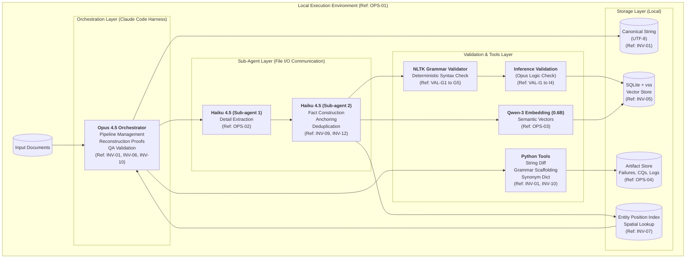
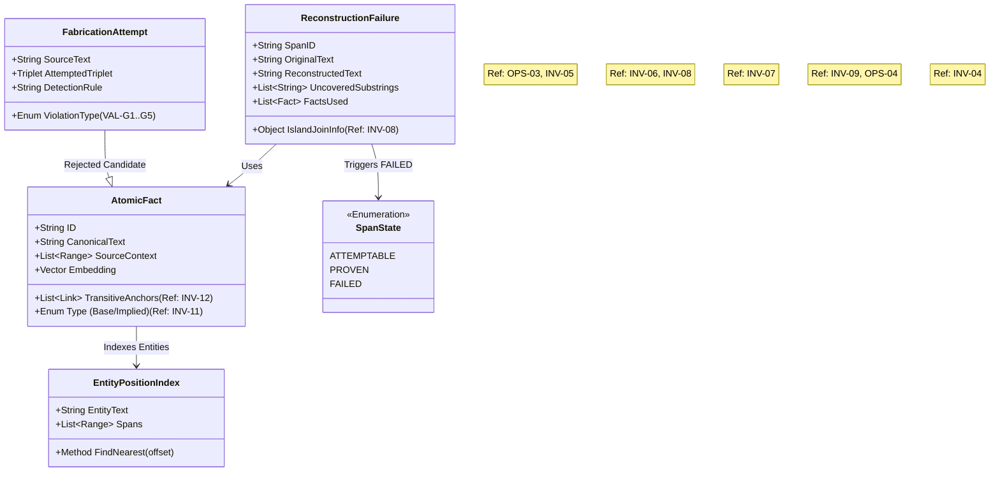
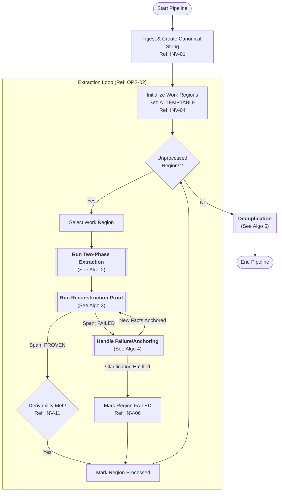
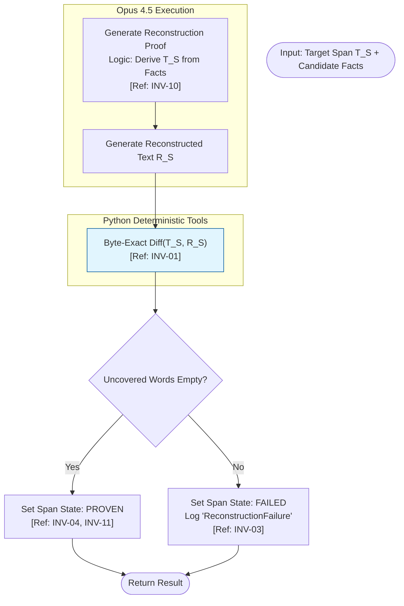

Here are the high-level components, algorithms, and rules for the Atomic Fact Extraction System.

### Part 1: Indexed Rule List

This section defines the unique identifiers for all Non-negotiable Invariants (INV), Validation Rules (VAL), and Operational Constraints (OPS). These IDs are referenced in the diagrams below to ensure every component and logic step traces back to the requirements.

#### **Category 1: Core Invariants (INV)**

| ID | Rule Name | Requirement Definition |
| --- | --- | --- |
| **INV-01** | **Byte-Exact Provenance** | Source text is the canonical input string. References are character offsets. Reconstruction must reproduce the exact original substring byte-for-byte. |
| **INV-02** | **No Semantic Classification** | Links between facts are untyped hypotheses. No forced ontology (e.g., "is-a") is permitted. |
| **INV-03** | **Incompleteness Expected** | Graphs are assumed incomplete. Incompleteness is surfaced only via reconstruction failure. |
| **INV-04** | **Span Lifecycle** | Spans transition from `ATTEMPTABLE`  `PROVEN` (threshold met) or `FAILED` (uncovered text remains). |
| **INV-05** | **Facts Explain, Don't Own** | Facts are latent explanations. Multiple facts can explain overlapping text. Facts do not "own" text. |
| **INV-06** | **Progress Test** | Failure classification is not attempted directly. Failures trigger **Anchoring**. If Anchoring fails (stalls), emit Clarification Question. |
| **INV-07** | **Anchoring Operation** | Uncovered text triggers: Entity Position Index query  Context Expansion  New Fact Extraction. |
| **INV-08** | **Island Join Failures** | Distinct failure where two `PROVEN` islands cannot be connected. Triggers specific "Island Join" Clarification Question. |
| **INV-09** | **No Illegal Fabrication** | Honest incompleteness (Entity Declarations) is preferred over fabricated triplets. Do not invent structure. |
| **INV-10** | **No Formal Proof Languages** | Validation is text-based formal reconstruction (Opus) + deterministic diff (Python), not Lean/Coq. |
| **INV-11** | **Derivability Principle** | Extraction is COMPLETE if base facts are sufficient to derive all implications. Exhaustive enumeration is not required. |
| **INV-12** | **Transitive Anchors** | Contextual conditions are deduplicated; facts under different conditions share transitive anchors. |

#### **Category 2: Grammar Validation Rules (VAL-G)**

*Enforced by NLTK (Deterministic Pre-Filter)*
| ID | Rule Name | Constraint |
| :--- | :--- | :--- |
| **VAL-G1** | **Hidden Copula** | Reject adding verbs (is/are) to noun phrases lacking finite verbs. |
| **VAL-G2** | **Attribute-to-Process** | Reject converting static adjectives to temporal verbs (e.g., "remains"). |
| **VAL-G3** | **Pronoun Concord** | Subject/Object/Pronoun agreement (number/gender/person) must match source. |
| **VAL-G4** | **Tense Fabrication** | Reject assigning tense to timeless/inherent property constructions. |
| **VAL-G5** | **Forced Subject** | Reject inventing entities to complete triplets for syntactic orphans. |

#### **Category 3: Inference Validation Rules (VAL-I)**

*Enforced by Opus (Logic/Reasoning Validation)*
| ID | Rule Name | Constraint |
| :--- | :--- | :--- |
| **VAL-I1** | **Coreference Consistency** | Inferred antecedents must agree in number/gender/person with the pronoun. |
| **VAL-I2** | **Logical Entailment** | Implications must logically follow from base facts (e.g., spatial containment). |
| **VAL-I3** | **Context Scope** | Inferences must not span unrelated document sections without markers. |
| **VAL-I4** | **Phantom Entities** | Inferred entities must exist in base facts or source text. |

#### **Category 4: Operational Constraints (OPS)**

| ID | Rule Name | Constraint |
| --- | --- | --- |
| **OPS-01** | **Local Execution** | No cloud dependencies. Local Python + Local Models + SQLite. |
| **OPS-02** | **Two-Phase Extraction** | Extraction is sequential: Phase 1 (Raw Details)  Phase 2 (Fact Construction). |
| **OPS-03** | **Dual Representation** | Facts have **Canonical Text** (normalized, for embedding) and **Source Context** (offsets, for reconstruction). |
| **OPS-04** | **Artifact Generation** | Failures generate structured artifacts (JSON), not just logs. |

---

### Part 2: High-Level Component Diagrams

#### Diagram 1: System Context & Architecture

This diagram outlines the local execution environment, the agent hierarchy (Claude Code Harness), and the data flow constraints.



#### Diagram 2: Data Objects & State

This class diagram details the structure of Facts, Artifacts, and Spans, referencing the specific invariants they enforce.



---

### Part 3: Algorithm Flowcharts

#### Algorithm 1: The Main Extraction Pipeline

This covers the outer loop of processing work regions, terminating only when the Derivability Principle (INV-11) is met.



#### Algorithm 2: Two-Phase Extraction & Validation

This details how Haiku sub-agents interact to produce candidate facts and how NLTK acts as a pre-filter.

```mermaid
flowchart TD
    Input([Input: Source Text Span])
    
    subgraph "Phase 1: Detail Extraction"
        Haiku1["Haiku 4.5 (Sub-agent 1)"]
        ExtractDetails["Extract Raw Observations/Claims<br/>(Not yet triplets)<br/>[Ref: OPS-02]"]
        WriteFile1["Write Details to File System"]
    end
    
    Input --> Haiku1 --> ExtractDetails --> WriteFile1
    
    subgraph "Phase 2: Fact Construction"
        ReadFile1["Read Details from File System"]
        Haiku2["Haiku 4.5 (Sub-agent 2)"]
        Anchor["Anchor Details to Source Offsets<br/>[Ref: INV-01, INV-05]"]
        FormTriplets["Form Subject-Predicate-Object"]
    end
    
    WriteFile1 --> ReadFile1 --> Haiku2 --> Anchor --> FormTriplets
    
    subgraph "Validation Pipeline"
        NLTK_Check{"NLTK Grammar Check<br/>[Ref: VAL-G1..G5]"}
        
        FormTriplets --> NLTK_Check
        
        NLTK_Check -- "Fail (Grammar)" --> LogFab["Log 'FabricationAttempt'<br/>Extract Entity Only<br/>[Ref: INV-09]"]
        
        NLTK_Check -- "Pass" --> TypeCheck{Is Implied Fact?}
        
        TypeCheck -- "No (Base Fact)" --> ValidFact
        TypeCheck -- "Yes" --> OpusCheck{Opus Inference Check<br/>[Ref: VAL-I1..I4]}
        
        OpusCheck -- "Fail (Logic)" --> LogInf["Log 'InvalidInferenceAttempt'"]
        OpusCheck -- "Pass" --> ValidFact
    end
    
    LogFab --> ValidFact([Return Candidate Facts])
    LogInf --> ValidFact

    style NLTK_Check fill:#ffccbc,stroke:#bf360c
    style OpusCheck fill:#fff9c4,stroke:#fbc02d

```

#### Algorithm 3: Reconstruction Proof & Inference Validation

This details the "Explanation Test" logic.



#### Algorithm 4: Failure Handling (Anchoring & Island Joins)

This details the "Progress Test" and how the system distinguishes between missing facts and structural failures.

```mermaid
flowchart TD
    Input([Input: ReconstructionFailure]) --> TypeCheck{Failure Type?}
    
    %% Path A: Island Join Failure
    TypeCheck -- "Islands Proven,<br/>Join Failed" --> IslandFail["Ref: INV-08<br/>Detect Island Join Failure"]
    IslandFail --> EmitCQ_Join["Emit Clarification Question:<br/>Island Join Failure"]
    EmitCQ_Join --> ReturnFail([Return: Failed])
    
    %% Path B: Unanchored Text
    TypeCheck -- "Unanchored<br/>Text" --> AnchorLoop["Start Anchoring Loop"]
    
    subgraph "Anchoring Operation [Ref: INV-07]"
        AnchorLoop --> PosQuery[Query Entity Position Index]
        PosQuery --> ContextExp[Expand Context around Uncovered]
        ContextExp --> NewExt[Extract New Facts (Call Algo 2)]
        
        NewExt --> ReRunRec[Re-Run Reconstruction]
        ReRunRec --> CheckProgress{Uncovered<br/>Reduced?<br/>Ref: INV-06}
        
        CheckProgress -- Yes --> LoopCheck{Max Attempts?}
        LoopCheck -- No --> AnchorLoop
    end
    
    LoopCheck -- Yes --> EmitCQ_Unanchored["Emit Clarification Question:<br/>Structural Failure<br/>[Ref: INV-06]"]
    CheckProgress -- No --> EmitCQ_Unanchored
    
    EmitCQ_Unanchored --> ReturnFail
    LoopCheck -- No --> ReturnSuccess([Return: New Facts Found])
    
    style AnchorLoop fill:#e1f5fe,stroke:#01579b
    style EmitCQ_Unanchored fill:#ffccbc,stroke:#bf360c

```

#### Algorithm 5: Deduplication Logic

This details the handling of duplicate facts, specifically preserving **Transitive Anchors** per Invariant 12.

```mermaid
flowchart TD
    Start([Input: Fact List]) --> ComputeEmbed[Compute Embeddings <br/> (Canonical Text Only) <br/> Ref: OPS-03]
    ComputeEmbed --> VectorIndex[Build/Update SQLite VSS]
    
    IterateFacts[Select Next Fact A] --> Query[Query Vector DB: <br/> Find Nearest Neighbors]
    Query --> Candidates[List Candidates]
    
    subgraph "Dedup Logic (Haiku 2)"
        Candidates --> Compare{Are Facts <br/> Semantically Identical?}
        
        Compare -- Yes --> CheckContext{Check Transitive Anchors <br/> [Ref: INV-12]}
        
        CheckContext -- Different Conditions --> MergeRef[Merge Content <br/> Keep Distinct Condition Links]
        CheckContext -- Same Conditions --> MergeFull[Consolidate to Fact A <br/> Remove Duplicate]
        
        Compare -- No --> Keep[Keep as Distinct Fact]
    end
    
    MergeRef --> UpdateDB[Update Vector DB & Graph]
    MergeFull --> UpdateDB
    Keep --> Next{More Facts?}
    UpdateDB --> Next
    
    Next -- Yes --> IterateFacts
    Next -- No --> End([End Dedup])

```