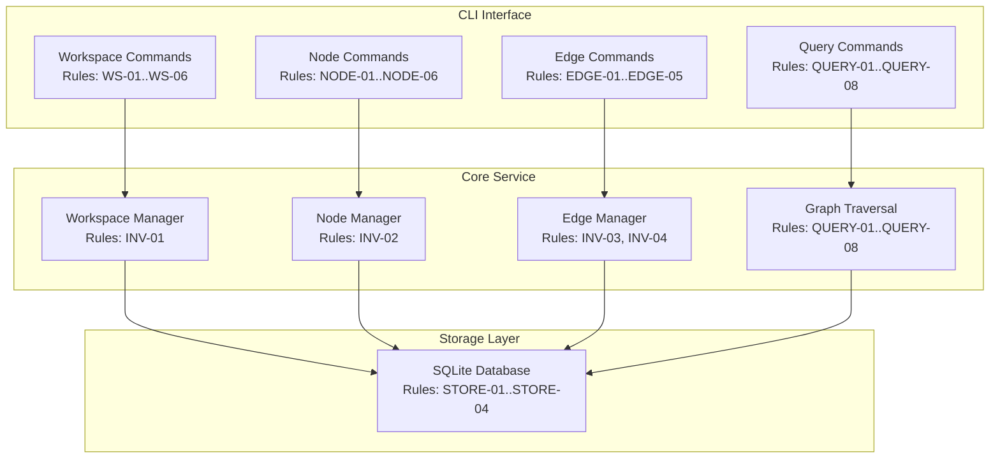
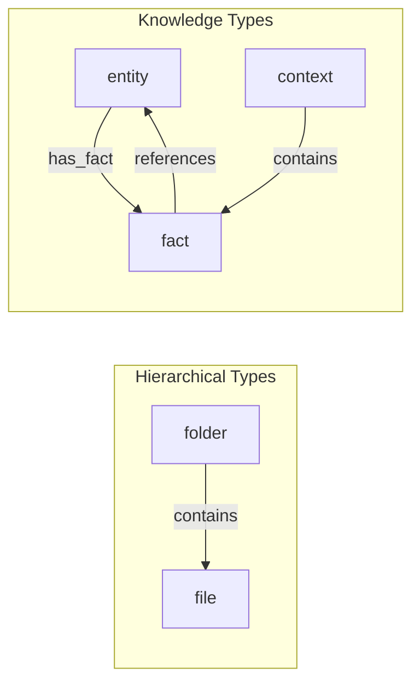

# Knowledge Graph Store PRD

Sources: AGENTS.md

## Resources

- `RES-01` Python 3.12+ — runtime environment
- `RES-02` SQLite — graph storage backend
- `RES-03` NetworkX — graph operations (optional, for complex queries)
- `RES-04` Every Code — orchestration harness (consumer)

## Problem Statement

AI agents need to store and query hierarchical, relational knowledge beyond flat vector
similarity. This includes folder structures, entity relationships, fact networks, and
context hierarchies. Rather than file I/O, agents should write to named workspaces
containing nodes (facts, entities, contexts) and edges (relationships), enabling
graph traversal, path queries, and hierarchical aggregation.

## Goal List

* **GOAL-01 — Workspace isolation:** Support multiple named workspaces with independent graphs.
* **GOAL-02 — Node CRUD:** Create, read, update, delete nodes with typed properties.
* **GOAL-03 — Edge CRUD:** Create, read, update, delete edges with typed relationships.
* **GOAL-04 — Hierarchical queries:** Query parent/child/ancestor/descendant relationships.
* **GOAL-05 — Path queries:** Find paths between nodes, shortest path, all paths.
* **GOAL-06 — Subgraph extraction:** Extract connected subgraphs by node set or edge type.
* **GOAL-07 — CLI interface:** All operations available via command-line for agent use.
* **GOAL-08 — Persistence:** Workspaces persist across process restarts.

## Indexed Rule List

### Invariants

* **Precedence:** Invariants apply globally and override any conflicting requirements.
* **INV-01 — Workspace isolation:** Operations on one workspace cannot affect another.
* **INV-02 — Node ID uniqueness:** Node IDs are unique within a workspace.
* **INV-03 — Edge referential integrity:** Edges can only reference existing nodes.
* **INV-04 — No orphan edges:** Deleting a node deletes all its edges.

### Workspace Rules

* **WS-01 — Create workspace:** `create <name>` initializes empty graph workspace.
* **WS-02 — List workspaces:** `list` shows all workspaces with node/edge counts.
* **WS-03 — Delete workspace:** `delete <name>` removes workspace and all data.
* **WS-04 — Export workspace:** `export <name> --format <json|cypher>` exports graph.
* **WS-05 — Import workspace:** `import <name> --file <path>` imports graph data.
* **WS-06 — Workspace location:** Workspaces stored in `.knowledgegraph/` directory.

### Node Rules

* **NODE-01 — Add node:** `node add <ws> --id <id> --type <type> --props <json>`
* **NODE-02 — Get node:** `node get <ws> <id>` returns node with properties.
* **NODE-03 — Update node:** `node update <ws> <id> --props <json>` merges properties.
* **NODE-04 — Delete node:** `node delete <ws> <id>` removes node and edges (INV-04).
* **NODE-05 — List nodes:** `node list <ws> --type <type>` filters by node type.
* **NODE-06 — Node types:** Common types: `fact`, `entity`, `context`, `folder`, `file`.

### Edge Rules

* **EDGE-01 — Add edge:** `edge add <ws> --from <id> --to <id> --rel <type> --props <json>`
* **EDGE-02 — Get edges:** `edge get <ws> --node <id>` returns all edges for node.
* **EDGE-03 — Delete edge:** `edge delete <ws> --from <id> --to <id> --rel <type>`
* **EDGE-04 — List edges:** `edge list <ws> --rel <type>` filters by relationship type.
* **EDGE-05 — Edge types:** Common types: `contains`, `references`, `depends_on`, `related_to`, `parent_of`.

### Query Rules

* **QUERY-01 — Children query:** `query children <ws> <id>` returns direct children.
* **QUERY-02 — Ancestors query:** `query ancestors <ws> <id>` returns all ancestors.
* **QUERY-03 — Descendants query:** `query descendants <ws> <id>` returns all descendants.
* **QUERY-04 — Path query:** `query path <ws> <from-id> <to-id>` returns shortest path.
* **QUERY-05 — All paths:** `query all-paths <ws> <from> <to> --max-depth <int>`
* **QUERY-06 — Neighbors:** `query neighbors <ws> <id> --depth <int>` returns n-hop neighborhood.
* **QUERY-07 — Subgraph:** `query subgraph <ws> --nodes <ids> --expand <int>` extracts subgraph.
* **QUERY-08 — Filter by type:** All queries support `--node-type` and `--edge-type` filters.

### Output Rules

* **OUT-01 — Node format:** JSON object with `{id, type, properties, edges}`.
* **OUT-02 — Edge format:** JSON object with `{from, to, relationship, properties}`.
* **OUT-03 — Path format:** JSON array of node IDs representing path.
* **OUT-04 — Subgraph format:** JSON with `{nodes: [...], edges: [...]}`.
* **OUT-05 — Error reporting:** Errors to stderr; non-zero exit on failure.

### Storage Rules

* **STORE-01 — Database format:** SQLite with nodes and edges tables per workspace.
* **STORE-02 — Indexes:** Index on node_id, node_type, edge_from, edge_to, edge_rel.
* **STORE-03 — Atomic writes:** Transactions ensure consistency.
* **STORE-04 — Schema versioning:** Version table for migrations.

## Component Diagrams

### Component Diagram: Knowledge Graph Store

### Component Diagram: Node Types

## Success Metrics

| ID | Metric | Target | Measurement | Goals |
|----|--------|--------|-------------|-------|
| `MET-01` | Node add latency | <5ms | Benchmark 1000 adds | GOAL-02 |
| `MET-02` | Edge add latency | <5ms | Benchmark 1000 adds | GOAL-03 |
| `MET-03` | Children query (1k nodes) | <10ms | Benchmark 100 queries | GOAL-04 |
| `MET-04` | Path query (10k nodes) | <100ms | Benchmark 100 queries | GOAL-05 |
| `MET-05` | Subgraph extraction | <50ms | Extract 100-node subgraph | GOAL-06 |
| `MET-06` | Workspace isolation | 100% | Cross-workspace query returns empty | GOAL-01, INV-01 |
| `MET-07` | Referential integrity | 100% | No dangling edges after node delete | INV-03, INV-04 |
| `MET-08` | Persistence verification | 100% | Restart and query | GOAL-08 |
