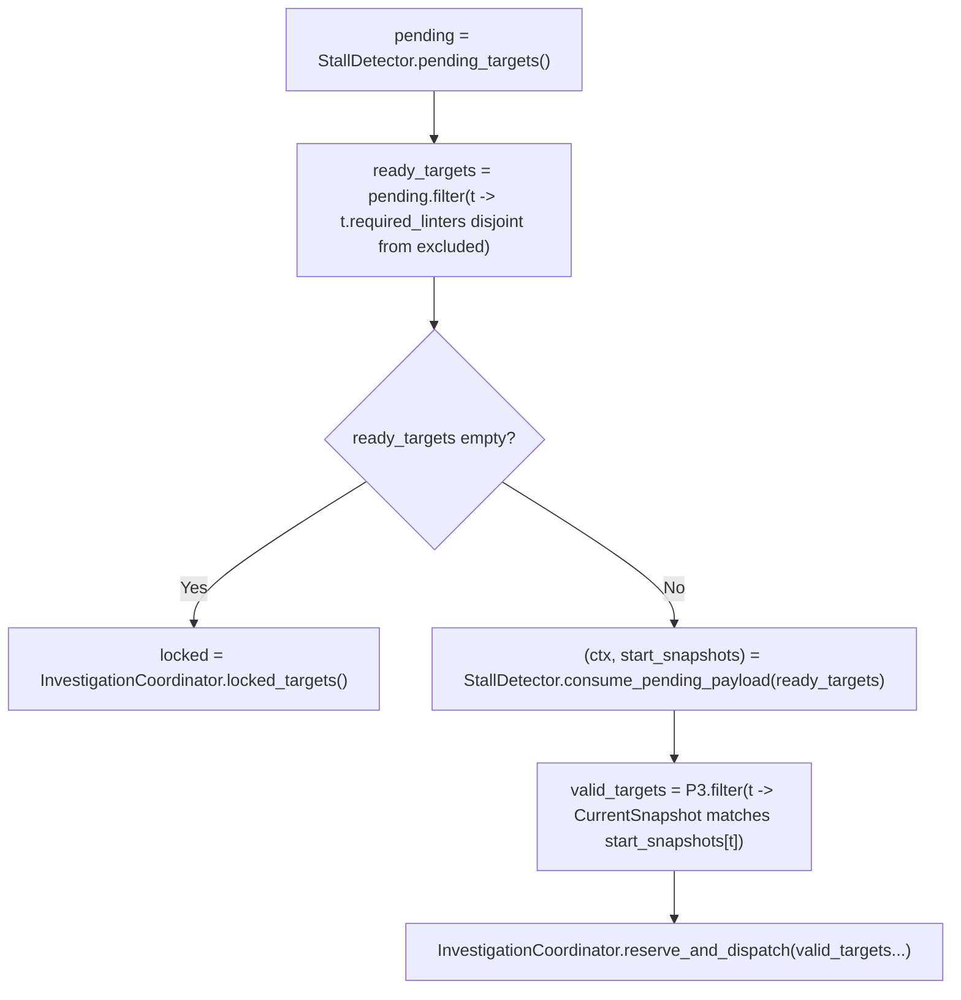

## Audit Report: COM-14 (Orchestrator)

### Executive Summary

The orchestration logic defined in the flowchart establishes a robust "tick" loop that prioritizes data consistency and CAS (Compare-And-Swap) safety. However, the current logic exhibits a significant bottleneck in the handling of deferred investigations (`O11`), where a single stale linter can globally block all pending investigations, even those unrelated to the stale tool. Additionally, the handling of permanently failing linters within the `pending` queue risks creating a "zombie state" where targets remain pending indefinitely.

### Critical Logic Defects

#### 1. Global Blocking in Pending Queue Dispatch (`O11`)

* **Defect:** The decision node `O11` checks `pending non-empty AND excluded empty?`. This logic dictates that if *any* linter is currently refreshing (staleness), *no* pending investigations can be dispatched.
* **Impact:** A single slow or oscillating linter will starve investigations for the entire project, effectively serializing independent workflows. This violates the spirit of `GOAL-03` (Stalled-target recovery) by introducing unnecessary latency.
* **Correction:** Change `O11` to filtered logic. Instead of a boolean gate, select targets from `pending` whose required linters are **not** in `excluded`. Dispatch those subsets immediately and leave the rest in `pending`.

#### 2. Infinite Livelock for Broken Linters

* **Defect:** If a linter enters a permanent failure state (e.g., configuration error) and remains in `excluded` indefinitely (as per `PROC-05` transitions), any target pending on that linter will cycle through `O10 -> O11 -> O15` forever.
* **Impact:** The system will never reach `SUCCESS` because `pending` is never empty, but it will also never dispatch the work. The loop will spin idly.
* **Correction:** Implement a "Give Up" threshold. If a target remains in `pending` for  ticks or if the blocking linter transitions to a hard `FAILED` state (distinct from `PENDING_REFRESH`), the target should be forcefully removed from `pending`, marked as `unlintable` (or logged as an error), and the loop allowed to proceed.

### Race Conditions & Concurrency Risks

#### 1. Snapshot Validity in Deferred Dispatch (`O13`)

* **Risk:** `O13` retrieves `start_snapshots` stored when the target was first stalled. Between the time the target was stalled and the time `excluded` clears (allowing dispatch), the file on disk may have changed externally.
* **Impact:** The investigator may launch using a `start_snapshot` that no longer matches the filesystem. If the investigator relies on reading the file from disk, it will analyze code that doesn't match the snapshot, potentially leading to hallucinated results.
* **Mitigation:** Insert a validation step between `O13` and `O14`. Compare `start_snapshots` against the current `ChangeTracker`. If they differ, drop the investigation (treat as handled by `ExternalChangeWorkflow`) rather than dispatching it.

#### 2. The "Idle Path" Blind Spot (`O18`)

* **Risk:** `O18` specifies "wait/select". If this wait implementation is purely internal (waiting on agent/investigator futures), the system may become unresponsive to external file changes during the wait period.
* **Mitigation:** Ensure the `wait/select` mechanism explicitly includes a file watcher event or a short timeout. The loop must wake up immediately upon file system events to trigger `ExternalChangeWorkflow`.

### Algorithmic Improvements

#### 1. Optimistic Dispatch for Unaffected Targets

* **Improvement:** The current flow `O16` computes `plan` using `excluded`. This implies that if Linter A is stale, we might stop fixing Linter B errors on the same file.
* **Recommendation:** `ActionabilityPolicy` should be granular. If a file has errors from Linter A (Stale) and Linter B (Healthy), the plan should include the file but *only* act on Linter B's errors. This allows progress to continue partially rather than halting completely.

#### 2. Early Pruning of Unlintable Projects (`O4`)

* **Observation:** The check at `O4` (`ProjectTarget unlintable?`) is placed after investigation polling.
* **Improvement:** Move `O4` to be the very first step in the loop (`O2` -> `O4`). If the project is unlintable, there is no value in polling investigations, refreshing linters, or checking staleness. Fail fast to save cycles.

### Corrected Logic Snippets

**Refined Pending Dispatch (Replaces O11, O12, O13):**

**Refined Actionability Input (Updates O16):**

This formula ensures that actionability is determined solely by errors from currently healthy linters.

### Next Step

Would you like me to rewrite the Mermaid flowchart to incorporate the granular pending dispatch and early unlintable check?