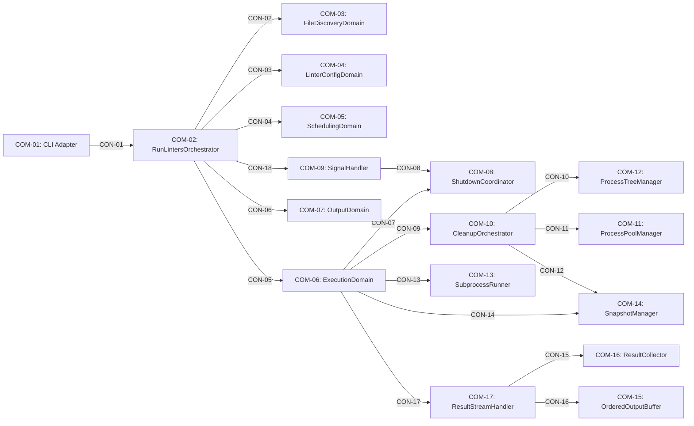

# Component: Architecture (root)

Sources: [requirements.md](../requirements.md) | [design-map.md](../design-map.md) | [plan.md](../plan.md) | [components architecture.md](../../../../processes/components/architecture.md)

## Component and surface map

## Components

### Component: COM-01 — CLI Adapter

Pattern: cli-adapter
Implements: (GOAL-01)
Capabilities: (CAP-01)
Surface: (SUR-01)
Package: [com-01-cli-adapter.md](com-01-cli-adapter.md)
Cross-references: (requires: EXEC-01, EXEC-02; uses: CON-01)

### Component: COM-02 — RunLintersOrchestrator

Pattern: orchestrator
Implements: (GOAL-01, GOAL-03)
Capabilities: (CAP-02)
Surface: (SUR-02)
Package: [com-02-run-linters-orchestrator.md](com-02-run-linters-orchestrator.md)
Cross-references: (requires: EXEC-03, EXEC-04, OUT-05, INV-05; uses: CON-01, CON-02, CON-03, CON-04, CON-05, CON-06, CON-18)

### Component: COM-03 — FileDiscoveryDomain

Pattern: leaf-domain
Implements: (GOAL-01, GOAL-04)
Capabilities: (CAP-03)
Surface: (SUR-03)
Package: [com-03-file-discovery-domain.md](com-03-file-discovery-domain.md)
Cross-references: (uses: RES-03, CON-02; requires: EXEC-02, IN-06, INV-02, INV-03)

### Component: COM-04 — LinterConfigDomain

Pattern: domain
Implements: (GOAL-02)
Capabilities: (CAP-04)
Surface: (SUR-04)
Package: [com-04-linter-config-domain.md](com-04-linter-config-domain.md)
Cross-references: (requires: INV-01, IN-01, IN-02, IN-03, PROC-01, EXEC-03; uses: CON-03)

### Component: COM-05 — SchedulingDomain

Pattern: scheduler
Implements: (GOAL-02, GOAL-04)
Capabilities: (CAP-05)
Surface: (SUR-05)
Package: [com-05-scheduling-domain.md](com-05-scheduling-domain.md)
Cross-references: (requires: INV-02, INV-04, PROC-03, PROC-04, PROC-05, PROC-06, PROC-07, PERF-01, PERF-02; uses: CON-04)

### Component: COM-06 — ExecutionDomain

Pattern: executor
Implements: (GOAL-02, GOAL-03, GOAL-04)
Capabilities: (CAP-06)
Surface: (SUR-06)
Package: [com-06-execution-domain.md](com-06-execution-domain.md)
Cross-references: (requires: INV-02, INV-03, INV-04, PROC-08, PROC-09, PROC-10, PROC-11; uses: CON-05, CON-07, CON-09, CON-13, CON-14, CON-17)

### Component: COM-07 — OutputDomain

Pattern: presentation-domain
Implements: (GOAL-04)
Capabilities: (CAP-07)
Surface: (SUR-07)
Package: [com-07-output-domain.md](com-07-output-domain.md)
Cross-references: (requires: OUT-01, OUT-02, OUT-03, OUT-04, OUT-05, INV-02; uses: CON-06)

### Component: COM-08 — ShutdownCoordinator

Pattern: coordinator
Implements: (GOAL-03)
Capabilities: (CAP-08)
Surface: (SUR-08)
Package: [com-08-shutdown-coordinator.md](com-08-shutdown-coordinator.md)
Cross-references: (requires: PROC-11; uses: CON-07, CON-08)

### Component: COM-09 — SignalHandler

Pattern: signal-adapter
Implements: (GOAL-03)
Capabilities: (CAP-09)
Surface: (SUR-09)
Package: [com-09-signal-handler.md](com-09-signal-handler.md)
Cross-references: (uses: CON-18, CON-08)

### Component: COM-10 — CleanupOrchestrator

Pattern: cleanup-orchestrator
Implements: (GOAL-03)
Capabilities: (CAP-10)
Surface: (SUR-10)
Package: [com-10-cleanup-orchestrator.md](com-10-cleanup-orchestrator.md)
Cross-references: (requires: PROC-11; uses: CON-09, CON-10, CON-11, CON-12)

### Component: COM-11 — ProcessPoolManager

Pattern: pool-manager
Implements: (GOAL-02, GOAL-03)
Capabilities: (CAP-11)
Surface: (SUR-11)
Package: [com-11-process-pool-manager.md](com-11-process-pool-manager.md)
Cross-references: (requires: PERF-01, PERF-02; uses: CON-11)

### Component: COM-12 — ProcessTreeManager

Pattern: platform-boundary
Implements: (GOAL-03)
Capabilities: (CAP-12)
Surface: (SUR-12)
Package: [com-12-process-tree-manager.md](com-12-process-tree-manager.md)
Cross-references: (uses: RES-05, CON-10; requires: PROC-10)

### Component: COM-13 — SubprocessRunner

Pattern: subprocess-adapter
Implements: (GOAL-02, GOAL-03)
Capabilities: (CAP-13)
Surface: (SUR-13)
Package: [com-13-subprocess-runner.md](com-13-subprocess-runner.md)
Cross-references: (uses: RES-05, CON-13; requires: PROC-10)

### Component: COM-14 — SnapshotManager

Pattern: snapshot-service
Implements: (GOAL-03)
Capabilities: (CAP-14)
Surface: (SUR-14)
Package: [com-14-snapshot-manager.md](com-14-snapshot-manager.md)
Cross-references: (uses: RES-05, CON-12, CON-14; requires: PROC-09)

### Component: COM-15 — OrderedOutputBuffer

Pattern: ordering-buffer
Implements: (GOAL-04)
Capabilities: (CAP-15)
Surface: (SUR-15)
Package: [com-15-ordered-output-buffer.md](com-15-ordered-output-buffer.md)
Cross-references: (requires: OUT-03, INV-02; uses: CON-16)

### Component: COM-16 — ResultCollector

Pattern: aggregator
Implements: (GOAL-02, GOAL-04)
Capabilities: (CAP-16)
Surface: (SUR-16)
Package: [com-16-result-collector.md](com-16-result-collector.md)
Cross-references: (requires: INV-01, OUT-01; uses: CON-15)

### Component: COM-17 — ResultStreamHandler

Pattern: result-stream
Implements: (GOAL-03, GOAL-04)
Capabilities: (CAP-17)
Surface: (SUR-17)
Package: [com-17-result-stream-handler.md](com-17-result-stream-handler.md)
Cross-references: (requires: PROC-11; uses: CON-17, CON-15, CON-16)

## Contracts (CON-XX)

- CON-01 — CLI invoke (COM-01 → COM-02). Spec: [design-map.md#contract-con-01-cli-invoke](../design-map.md#contract-con-01-cli-invoke)
- CON-02 — Discover files (COM-02 → COM-03). Spec: [design-map.md#contract-con-02-discover-files](../design-map.md#contract-con-02-discover-files)
- CON-03 — Configure linters (COM-02 → COM-04). Spec: [design-map.md#contract-con-03-configure-linters](../design-map.md#contract-con-03-configure-linters)
- CON-04 — Build schedule (COM-02 → COM-05). Spec: [design-map.md#contract-con-04-build-schedule](../design-map.md#contract-con-04-build-schedule)
- CON-05 — Execute schedule (COM-02 → COM-06). Spec: [design-map.md#contract-con-05-execute-schedule](../design-map.md#contract-con-05-execute-schedule)
- CON-06 — Present results (COM-02 → COM-07). Spec: [design-map.md#contract-con-06-present-results](../design-map.md#contract-con-06-present-results)
- CON-07 — Shutdown initiation (COM-06 → COM-08). Spec: [design-map.md#contract-con-07-shutdown-initiation](../design-map.md#contract-con-07-shutdown-initiation)
- CON-08 — Signal-to-shutdown routing (COM-09 → COM-08). Spec: [design-map.md#contract-con-08-signal-to-shutdown](../design-map.md#contract-con-08-signal-to-shutdown)
- CON-09 — Cleanup registration (COM-06 → COM-10). Spec: [design-map.md#contract-con-09-cleanup-registration](../design-map.md#contract-con-09-cleanup-registration)
- CON-10 — Terminate trees (COM-10 → COM-12). Spec: [design-map.md#contract-con-10-terminate-trees](../design-map.md#contract-con-10-terminate-trees)
- CON-11 — Pool shutdown (COM-10 → COM-11). Spec: [design-map.md#contract-con-11-pool-shutdown](../design-map.md#contract-con-11-pool-shutdown)
- CON-12 — Restore snapshots (COM-10 → COM-14). Spec: [design-map.md#contract-con-12-restore-snapshots](../design-map.md#contract-con-12-restore-snapshots)
- CON-13 — Run subprocess (COM-06 → COM-13). Spec: [design-map.md#contract-con-13-run-subprocess](../design-map.md#contract-con-13-run-subprocess)
- CON-14 — Snapshot per chunk (COM-06 → COM-14). Spec: [design-map.md#contract-con-14-snapshot-per-chunk](../design-map.md#contract-con-14-snapshot-per-chunk)
- CON-15 — Aggregate chunks (COM-17 → COM-16). Spec: [design-map.md#contract-con-15-aggregate-chunks](../design-map.md#contract-con-15-aggregate-chunks)
- CON-16 — Ordered output (COM-17 → COM-15). Spec: [design-map.md#contract-con-16-ordered-output](../design-map.md#contract-con-16-ordered-output)
- CON-17 — Result collection loop (COM-06 → COM-17). Spec: [design-map.md#contract-con-17-result-collection-loop](../design-map.md#contract-con-17-result-collection-loop)
- CON-18 — Install SIGINT handler (COM-02 → COM-09). Spec: [design-map.md#contract-con-18-install-sigint-handler](../design-map.md#contract-con-18-install-sigint-handler)

## Component packages

* `com-01-cli-adapter.md` — COM-01 + ALG-01
* `com-02-run-linters-orchestrator.md` — COM-02 + ALG-02
* `com-03-file-discovery-domain.md` — COM-03 + ALG-03
* `com-04-linter-config-domain.md` — COM-04 + ALG-04
* `com-05-scheduling-domain.md` — COM-05 + ALG-05
* `com-06-execution-domain.md` — COM-06 + ALG-06
* `com-07-output-domain.md` — COM-07 + ALG-07
* `com-08-shutdown-coordinator.md` — COM-08 + ALG-08
* `com-09-signal-handler.md` — COM-09 + ALG-09
* `com-10-cleanup-orchestrator.md` — COM-10 + ALG-10
* `com-11-process-pool-manager.md` — COM-11 + ALG-11
* `com-12-process-tree-manager.md` — COM-12 + ALG-12
* `com-13-subprocess-runner.md` — COM-13 + ALG-13
* `com-14-snapshot-manager.md` — COM-14 + ALG-14
* `com-15-ordered-output-buffer.md` — COM-15 + ALG-15
* `com-16-result-collector.md` — COM-16 + ALG-16
* `com-17-result-stream-handler.md` — COM-17 + ALG-17

## Algorithms (ALG-XX)

- ALG-01 — CLI adapter. Spec: [com-01-cli-adapter.md](com-01-cli-adapter.md)
- ALG-02 — Run orchestrator. Spec: [com-02-run-linters-orchestrator.md](com-02-run-linters-orchestrator.md)
- ALG-03 — File discovery. Spec: [com-03-file-discovery-domain.md](com-03-file-discovery-domain.md)
- ALG-04 — Linter configuration. Spec: [com-04-linter-config-domain.md](com-04-linter-config-domain.md)
- ALG-05 — Scheduling. Spec: [com-05-scheduling-domain.md](com-05-scheduling-domain.md)
- ALG-06 — Execution. Spec: [com-06-execution-domain.md](com-06-execution-domain.md)
- ALG-07 — Output. Spec: [com-07-output-domain.md](com-07-output-domain.md)
- ALG-08 — Shutdown initiation. Spec: [com-08-shutdown-coordinator.md](com-08-shutdown-coordinator.md)
- ALG-09 — Signal handling. Spec: [com-09-signal-handler.md](com-09-signal-handler.md)
- ALG-10 — Cleanup ordering. Spec: [com-10-cleanup-orchestrator.md](com-10-cleanup-orchestrator.md)
- ALG-11 — Process pool sizing. Spec: [com-11-process-pool-manager.md](com-11-process-pool-manager.md)
- ALG-12 — Process tree termination. Spec: [com-12-process-tree-manager.md](com-12-process-tree-manager.md)
- ALG-13 — Subprocess execution. Spec: [com-13-subprocess-runner.md](com-13-subprocess-runner.md)
- ALG-14 — Snapshots. Spec: [com-14-snapshot-manager.md](com-14-snapshot-manager.md)
- ALG-15 — Ordered output buffering. Spec: [com-15-ordered-output-buffer.md](com-15-ordered-output-buffer.md)
- ALG-16 — Result aggregation. Spec: [com-16-result-collector.md](com-16-result-collector.md)
- ALG-17 — Result stream handling. Spec: [com-17-result-stream-handler.md](com-17-result-stream-handler.md)

## Shared artifacts

* `shared-file-registry.md` — IAR-04 spec
* `shared-diagnostic-collector.md` — IAR-07 spec

## Cross-component invariants

* INV-01 — Linter instance identity is correctness-critical. Cross-references: (satisfies: GOAL-02)
* INV-02 — Deterministic ordering. Cross-references: (satisfies: GOAL-04)
* INV-03 — Existence-only drift handling. Cross-references: (satisfies: GOAL-02)
* INV-04 — Parallel execution must be conflict-free. Cross-references: (satisfies: GOAL-02)
* INV-05 — No compatibility layer. Cross-references: (satisfies: GOAL-01)
