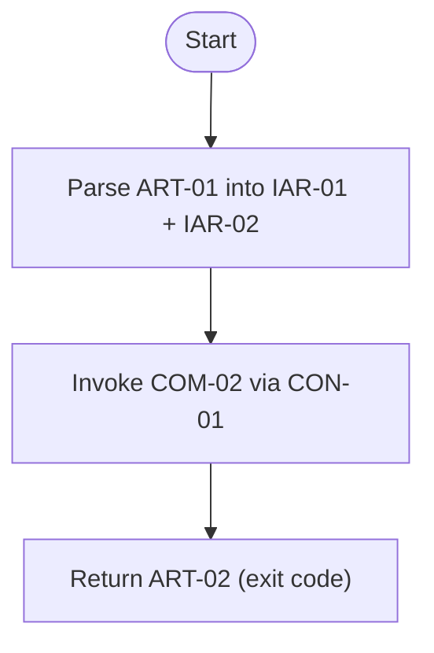

# Component: COM-01 — CLI Adapter

Sources: [requirements.md](../requirements.md) | [design-map.md](../design-map.md) | [architecture.md](architecture.md) | [components architecture.md](../../../../processes/components/architecture.md)

Implements: (ALG-01)
Cross-references: (requires: EXEC-01, EXEC-02; satisfies: GOAL-01)

## Capabilities

- CAP-01 — Parse lint invocation into run inputs.
  Derived-from: (GOAL-01)

## Surface: SUR-01

Contracts: ()

## Uses contracts

- CON-01 — Invoke RunLintersOrchestrator. Spec: [design-map.md#contract-con-01-cli-invoke](../design-map.md#contract-con-01-cli-invoke)

## Algorithms (ALG-XX)

### ALG-01 — Parse run inputs and invoke orchestrator

Guarantees: (INV-02)

