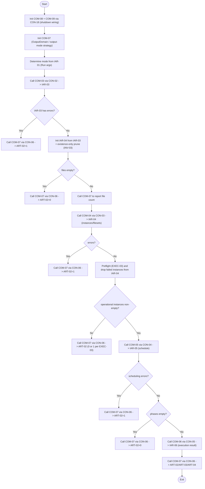

# Component: COM-02 — RunLintersOrchestrator (composition root)

Sources: [requirements.md](../requirements.md) | [design-map.md](../design-map.md) | [plan.md](../plan.md) | [architecture.md](architecture.md) | [components architecture.md](../../../../processes/components/architecture.md)

Implements: (ALG-02)
Cross-references: (requires: EXEC-03, EXEC-04, OUT-05; satisfies: GOAL-01, GOAL-03)

## Capabilities

- CAP-02 — Drive the run lifecycle and coordinate domains.
  Derived-from: (GOAL-01, GOAL-03)

## Surface: SUR-02

Contracts: (CON-01)

- CON-01 — Invoked by CLI adapter. Spec: [design-map.md#contract-con-01-cli-invoke](../design-map.md#contract-con-01-cli-invoke)

## Uses contracts

- CON-02 — File discovery. Spec: [design-map.md#contract-con-02-discover-files](../design-map.md#contract-con-02-discover-files)
- CON-03 — Linter configuration. Spec: [design-map.md#contract-con-03-configure-linters](../design-map.md#contract-con-03-configure-linters)
- CON-04 — Scheduling. Spec: [design-map.md#contract-con-04-build-schedule](../design-map.md#contract-con-04-build-schedule)
- CON-05 — Execution. Spec: [design-map.md#contract-con-05-execute-schedule](../design-map.md#contract-con-05-execute-schedule)
- CON-06 — Output + exit code. Spec: [design-map.md#contract-con-06-present-results](../design-map.md#contract-con-06-present-results)
- CON-18 — SIGINT handler installation. Spec: [design-map.md#contract-con-18-install-sigint-handler](../design-map.md#contract-con-18-install-sigint-handler)

## State holders (IAR-XX)

- IAR-01 — Run args
- IAR-02 — Runtime facts
- IAR-04 — File registry
- IAR-06 — Execution result
- IAR-07 — Output meta (diagnostic accumulation)
- IAR-11 — Shutdown event

## Algorithms (ALG-XX)

### ALG-02 — Orchestrate a lint run

Guarantees: (INV-02, INV-05)

