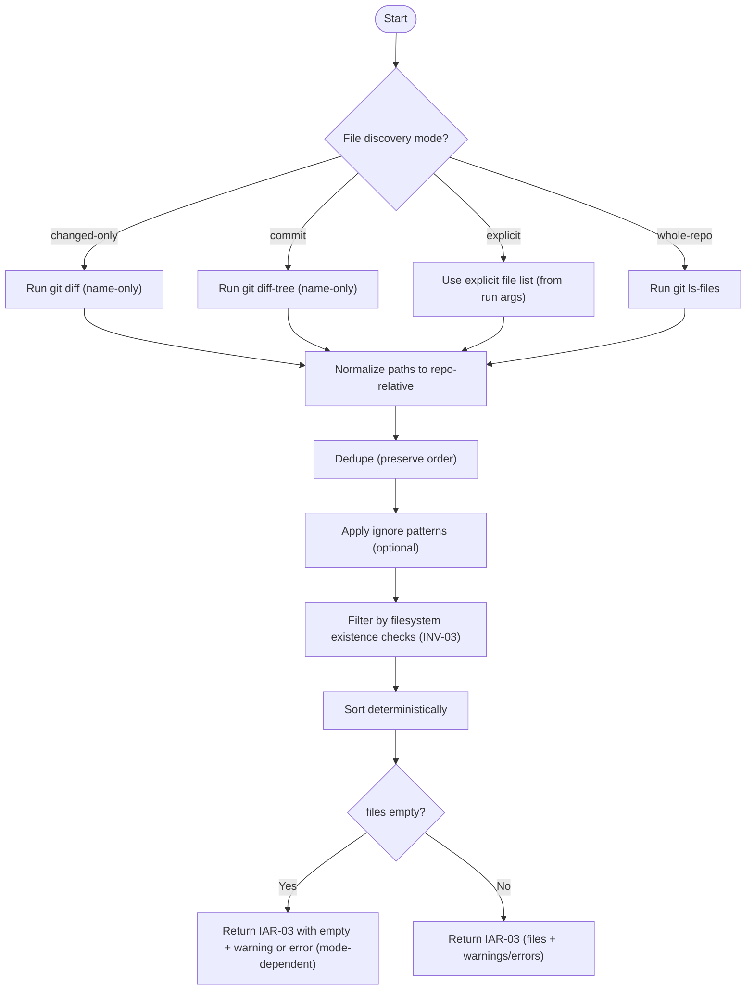
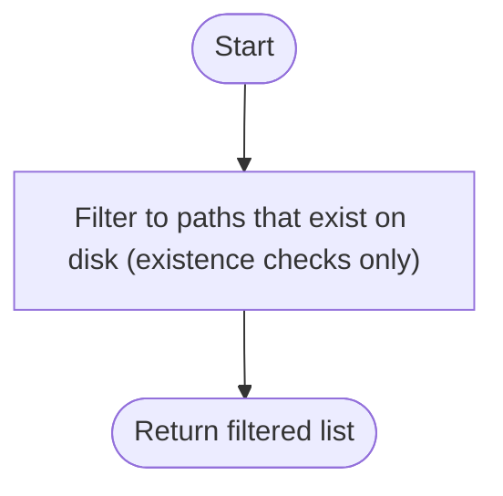

# Component: COM-03 — FileDiscoveryDomain

Sources: [requirements.md](../requirements.md) | [design-map.md](../design-map.md) | [plan.md](../plan.md) | [architecture.md](architecture.md) | [components architecture.md](../../../../processes/components/architecture.md)

Implements: (ALG-03)
Cross-references: (uses: RES-03; requires: EXEC-02, IN-06, INV-02; satisfies: GOAL-01)

## Capabilities

- CAP-03 — Produce a deterministic candidate fileset for the run.
  Derived-from: (GOAL-01, GOAL-04)

## Surface: SUR-03

Contracts: (CON-02)

- CON-02 — Discover files. Spec: [design-map.md#contract-con-02-discover-files](../design-map.md#contract-con-02-discover-files)

## State holders (IAR-XX)

- IAR-01 — Run args (mode selection inputs)
- IAR-03 — File discovery result

## Algorithms (ALG-XX)

### ALG-03 — File discovery pipeline

Guarantees: (INV-02, INV-03)

### Helper — Existence-only filter for drift handling

