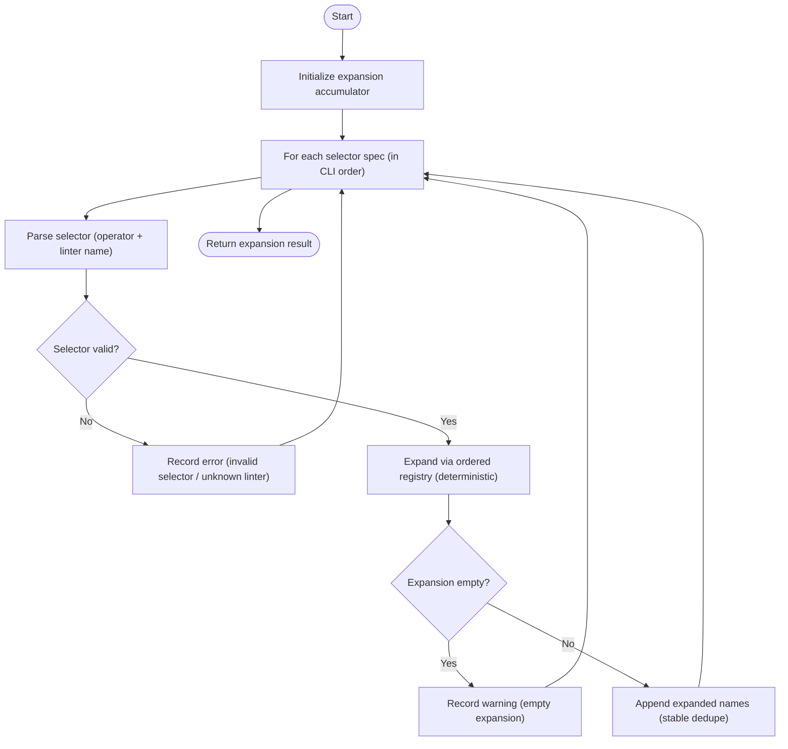
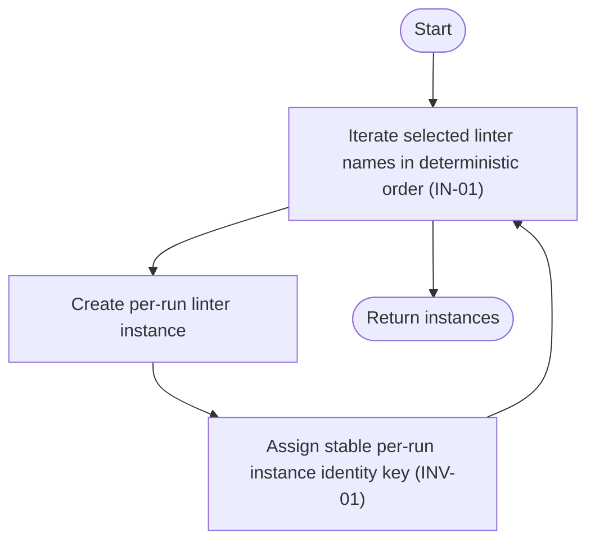
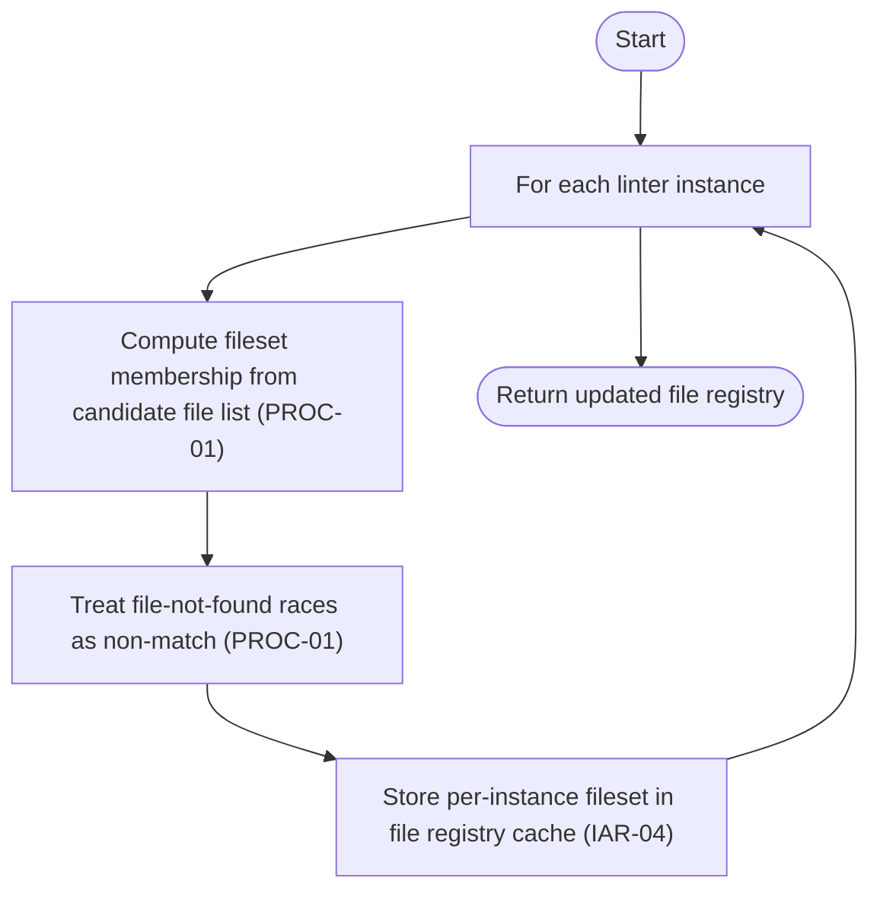
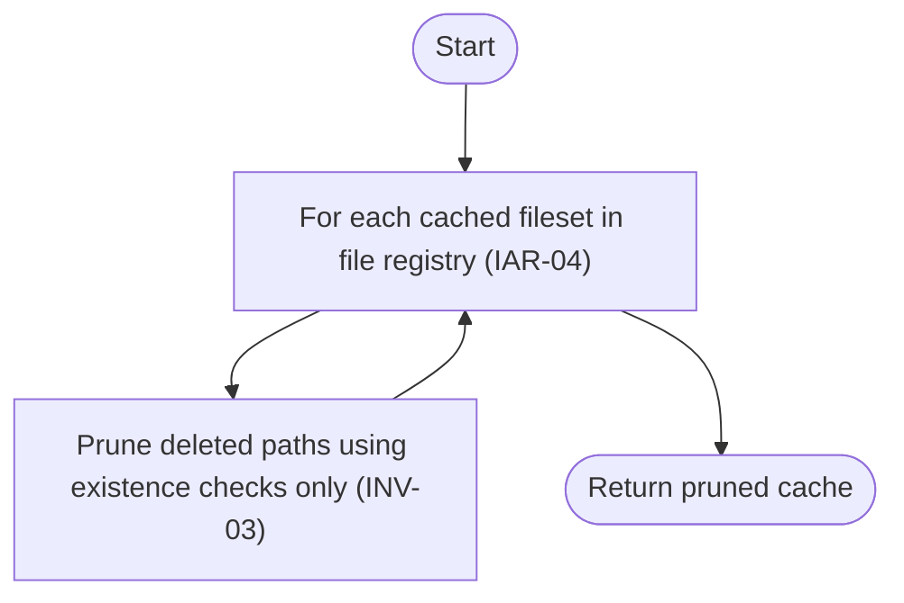
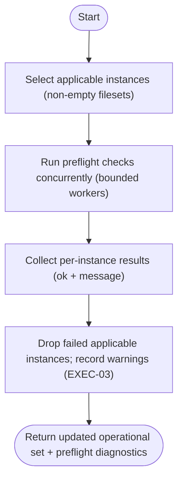

# Component: COM-04 — LinterConfigDomain

Sources: [requirements.md](../requirements.md) | [design-map.md](../design-map.md) | [plan.md](../plan.md) | [architecture.md](architecture.md) | [components architecture.md](../../../../processes/components/architecture.md)

Implements: (ALG-04)
Cross-references: (requires: INV-01, IN-01, IN-02, IN-03, PROC-01, EXEC-03; satisfies: GOAL-02)

## Capabilities

- CAP-04 — Expand linter specs into operational instances and filesets.
  Derived-from: (GOAL-02)

## Surface: SUR-04

Contracts: (CON-03)

- CON-03 — Configure linter instances and filesets. Spec: [design-map.md#contract-con-03-configure-linters](../design-map.md#contract-con-03-configure-linters)

## State holders (IAR-XX)

- IAR-03 — File discovery result (candidate file list)
- IAR-04 — File registry (instances + fileset cache)

## Algorithms (ALG-XX)

### ALG-04 — Spec expansion, instance identity, filesets, and preflight

Guarantees: (INV-01, INV-02, INV-03)

#### Spec expansion

#### Per-run instance creation

#### Fileset computation and existence-only pruning

#### Preflight checks

