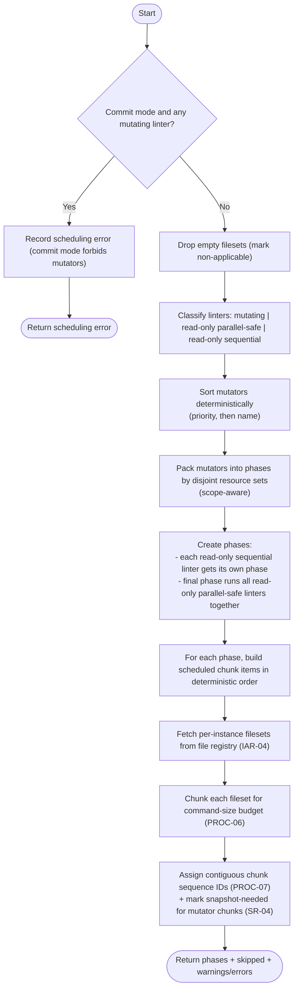

# Component: COM-05 — SchedulingDomain

Sources: [requirements.md](../requirements.md) | [design-map.md](../design-map.md) | [plan.md](../plan.md) | [architecture.md](architecture.md) | [components architecture.md](../../../../processes/components/architecture.md)

Implements: (ALG-05)
Cross-references: (requires: INV-04, PROC-04, PROC-05, PROC-06, PROC-07, PERF-02; satisfies: GOAL-02)

## Capabilities

- CAP-05 — Build deterministic, conflict-free phases and ARG_MAX-safe chunks.
  Derived-from: (GOAL-02, GOAL-04)

## Surface: SUR-05

Contracts: (CON-04)

- CON-04 — Build schedule. Spec: [design-map.md#contract-con-04-build-schedule](../design-map.md#contract-con-04-build-schedule)

## State holders (IAR-XX)

- IAR-01 — Run args (commit mode + concurrency cap)
- IAR-02 — Runtime facts (ARG_MAX budgeting inputs)
- IAR-04 — File registry (instances + fileset cache)
- IAR-05 — Scheduling result (phases + items)

## Algorithms (ALG-XX)

### ALG-05 — Build a deterministic, conflict-free schedule

Guarantees: (INV-02, INV-04)



### Helper — ArgMaxChunker

```mermaid
flowchart TD
  %% Cross-references: (requires: PROC-06)
  A([Start]) --> B["Compute per-invocation command-size budget\n(ARG_MAX - base command - environment - safety margin)"]
  B --> C{Budget valid (> 0)?}
  C -- No --> C1["Record scheduling error (budget exhausted before files)"] --> Z([Stop])
  C -- Yes --> D["Iterate fileset in deterministic order"]
  D --> E{Any single path exceeds budget?}
  E -- Yes --> E1["Record scheduling error (single path exceeds budget)"] --> Z
  E -- No --> F["Accumulate paths into chunks until next path would exceed budget"]
  F --> G["Emit chunks in order"]
  G --> H([Return chunks])
```
