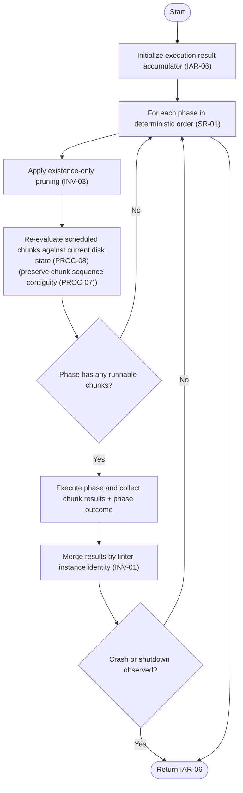

# Component: COM-06 — ExecutionDomain

Sources: [requirements.md](../requirements.md) | [design-map.md](../design-map.md) | [plan.md](../plan.md) | [architecture.md](architecture.md) | [components architecture.md](../../../../processes/components/architecture.md)

Implements: (ALG-06)
Cross-references: (requires: INV-03, INV-04, PROC-08, PROC-09, PROC-10, PROC-11; satisfies: GOAL-02, GOAL-03, GOAL-04)

## Capabilities

- CAP-06 — Execute scheduled phases with drift handling, snapshot safety, and shutdown.
  Derived-from: (GOAL-02, GOAL-03, GOAL-04)

## Surface: SUR-06

Contracts: (CON-05)

- CON-05 — Execute schedule. Spec: [design-map.md#contract-con-05-execute-schedule](../design-map.md#contract-con-05-execute-schedule)

## Uses contracts

- CON-07 — Shutdown initiation. Spec: [design-map.md#contract-con-07-shutdown-initiation](../design-map.md#contract-con-07-shutdown-initiation)
- CON-09 — Cleanup registration. Spec: [design-map.md#contract-con-09-cleanup-registration](../design-map.md#contract-con-09-cleanup-registration)
- CON-13 — Subprocess execution. Spec: [design-map.md#contract-con-13-run-subprocess](../design-map.md#contract-con-13-run-subprocess)
- CON-14 — Snapshot per chunk. Spec: [design-map.md#contract-con-14-snapshot-per-chunk](../design-map.md#contract-con-14-snapshot-per-chunk)
- CON-17 — Result collection loop. Spec: [design-map.md#contract-con-17-result-collection-loop](../design-map.md#contract-con-17-result-collection-loop)

## State holders (IAR-XX)

- IAR-04 — File registry (existence-only pruning + cache ownership)
- IAR-05 — Scheduling result (phases + items)
- IAR-06 — Execution result
- IAR-11 — Shutdown event
- IAR-13 — Inflight task registry
- IAR-15 — Process tree handles
- IAR-17 — Subprocess invocation

## Algorithms (ALG-XX)

### ALG-06 — Phase execution with drift handling, snapshots, shutdown, and ordered output

Guarantees: (INV-03, INV-04)

#### Execute phases (phase loop)



#### Execute a phase

```mermaid
flowchart TD
  %% Cross-references: (requires: INV-03, PROC-09, PROC-10, PROC-11, OUT-03, OUT-04)
  A([Start]) --> B["Observe shutdown event (IAR-11)\n(SIGINT handler already installed via COM-09)"]
  B --> C["Create process pool (COM-11)\n+ initialize process tree tracking (COM-12)"]
  C --> D["Register deterministic cleanup ordering (COM-10):\nterminate trees → shut down executor → restore snapshots (PROC-11)"]

  D --> E["For each scheduled chunk in deterministic order"]
  E --> F["Filter chunk paths by existence checks only (INV-03)"]
  F --> G{Chunk empty after filtering?}
  G -- Yes --> H["Record skipped/empty chunk result while preserving chunk sequence contiguity (PROC-07)"] --> E
  G -- No --> I{Mutator chunk (snapshot-needed)? (SR-04)}
  I -- Yes --> J["Create snapshot for this chunk before submission (COM-14)"] --> K
  I -- No --> K["Submit chunk to subprocess runner (COM-13)\n(track in IAR-13)"]
  K --> E

  E --> L["Collect completed chunk results (COM-17)\n(stream ordered text output when enabled)"]
  L --> M{Shutdown initiated?}
  M -- Yes --> N["Return partial phase results + shutdown marker (OUT-05)"]
  M -- No --> O([Return phase results + phase outcome])
```
