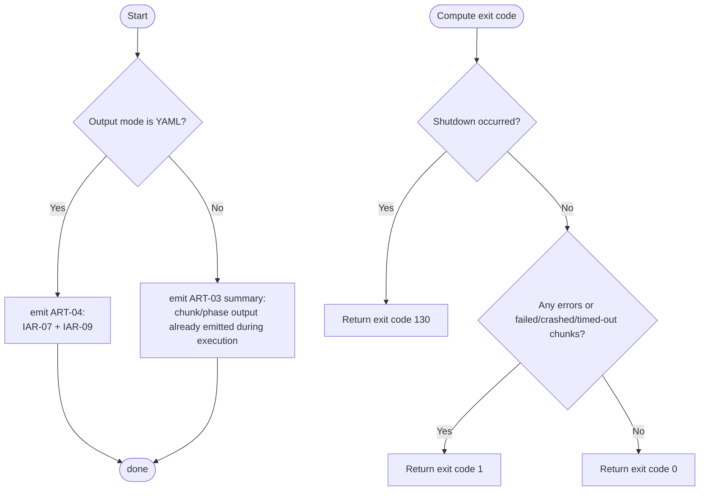

# Component: COM-07 — OutputDomain

Sources: [requirements.md](../requirements.md) | [design-map.md](../design-map.md) | [plan.md](../plan.md) | [architecture.md](architecture.md) | [components architecture.md](../../../../processes/components/architecture.md)

Implements: (ALG-07)
Cross-references: (requires: OUT-01, OUT-02, OUT-03, OUT-04, OUT-05; satisfies: GOAL-04)

## Capabilities

- CAP-07 — Render deterministic output and compute the process exit code.
  Derived-from: (GOAL-04)

## Surface: SUR-07

Contracts: (CON-06)

- CON-06 — Present results + exit code. Spec: [design-map.md#contract-con-06-present-results](../design-map.md#contract-con-06-present-results)

## State holders (IAR-XX / ART-XX)

- IAR-01 — Run args (output mode selection)
- IAR-06 — Execution result
- IAR-07 — Output meta (warnings/errors)
- IAR-09 — Aggregated results
- ART-02 — Process exit code
- ART-03 — Text output stream
- ART-04 — YAML output artifact

## Algorithms (ALG-XX)

### ALG-07 — Output strategy + exit-code ownership

Guarantees: (INV-02)

