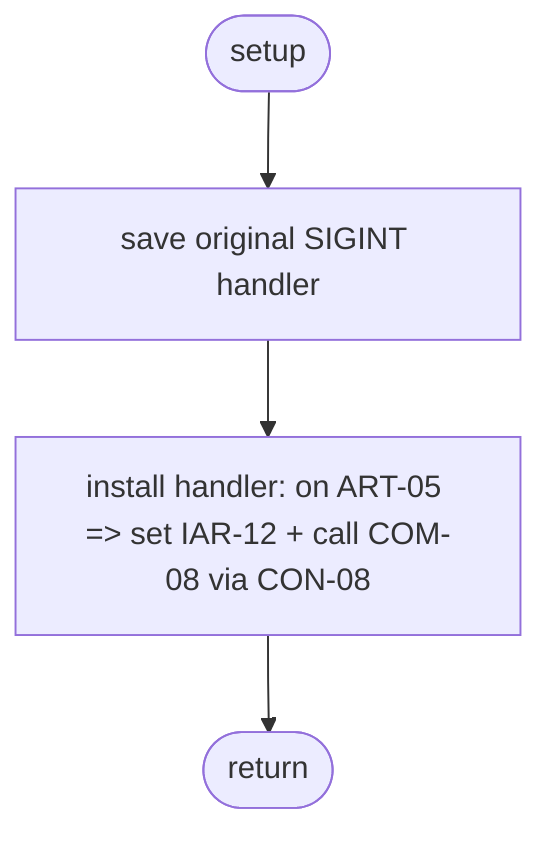

# Component: COM-09 — SignalHandler

Sources: [requirements.md](../requirements.md) | [design-map.md](../design-map.md) | [plan.md](../plan.md) | [architecture.md](architecture.md) | [components architecture.md](../../../../processes/components/architecture.md)

Implements: (ALG-09)
Cross-references: (requires: GOAL-03, OUT-05; satisfies: GOAL-03)

## Capabilities

- CAP-09 — Translate OS signals into shutdown initiation.
  Derived-from: (GOAL-03)

## Surface: SUR-09

Contracts: (CON-18)

- CON-18 — Install SIGINT handler. Spec: [design-map.md#contract-con-18-install-sigint-handler](../design-map.md#contract-con-18-install-sigint-handler)

## Uses contracts

- CON-08 — Route signal into shutdown initiation. Spec: [design-map.md#contract-con-08-signal-to-shutdown](../design-map.md#contract-con-08-signal-to-shutdown)

## State holders (IAR-XX / ART-XX)

- ART-05 — SIGINT signal
- IAR-11 — Shutdown event
- IAR-12 — Shutdown reason

## Algorithms (ALG-XX)

### ALG-09 — Install and route SIGINT into ShutdownCoordinator

Guarantees: (INV-02)

