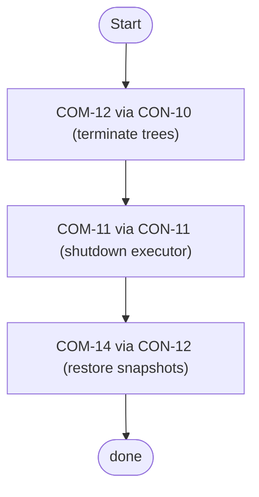

# Component: COM-10 — CleanupOrchestrator

Sources: [requirements.md](../requirements.md) | [design-map.md](../design-map.md) | [plan.md](../plan.md) | [architecture.md](architecture.md) | [components architecture.md](../../../../processes/components/architecture.md)

Implements: (ALG-10)
Cross-references: (requires: PROC-11; satisfies: GOAL-03)

## Capabilities

- CAP-10 — Enforce deterministic cleanup ordering and restore semantics.
  Derived-from: (GOAL-03)

## Surface: SUR-10

Contracts: (CON-09)

- CON-09 — Cleanup registration and ordering. Spec: [design-map.md#contract-con-09-cleanup-registration](../design-map.md#contract-con-09-cleanup-registration)

## Uses contracts

- CON-10 — Terminate trees. Spec: [design-map.md#contract-con-10-terminate-trees](../design-map.md#contract-con-10-terminate-trees)
- CON-11 — Pool shutdown. Spec: [design-map.md#contract-con-11-pool-shutdown](../design-map.md#contract-con-11-pool-shutdown)
- CON-12 — Restore snapshots. Spec: [design-map.md#contract-con-12-restore-snapshots](../design-map.md#contract-con-12-restore-snapshots)

## State holders (IAR-XX)

- IAR-13 — Inflight task registry
- IAR-18 — Cleanup result

## Algorithms (ALG-XX)

### ALG-10 — Deterministic cleanup ordering

Guarantees: (INV-02)

