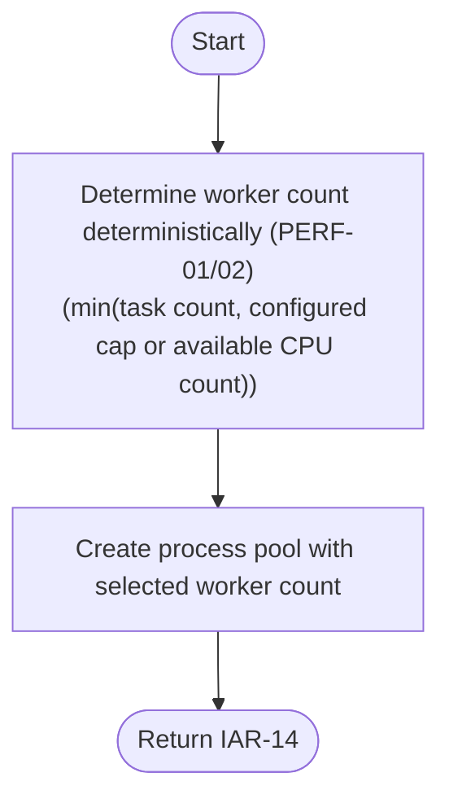

# Component: COM-11 — ProcessPoolManager

Sources: [requirements.md](../requirements.md) | [design-map.md](../design-map.md) | [plan.md](../plan.md) | [architecture.md](architecture.md) | [components architecture.md](../../../../processes/components/architecture.md)

Implements: (ALG-11)
Cross-references: (requires: PERF-02, PROC-11; satisfies: GOAL-02)

## Capabilities

- CAP-11 — Provide deterministic pool sizing and shutdown behavior.
  Derived-from: (GOAL-02, GOAL-03)

## Surface: SUR-11

Contracts: (CON-11)

- CON-11 — Pool sizing + shutdown semantics. Spec: [design-map.md#contract-con-11-pool-shutdown](../design-map.md#contract-con-11-pool-shutdown)

## State holders (IAR-XX)

- IAR-01 — Run args (concurrency cap selection)
- IAR-02 — Runtime facts (available CPU count)
- IAR-05 — Scheduling result (task count derivation)
- IAR-14 — Executor handle

## Algorithms (ALG-XX)

### ALG-11 — Deterministic pool sizing

Guarantees: (INV-02)

