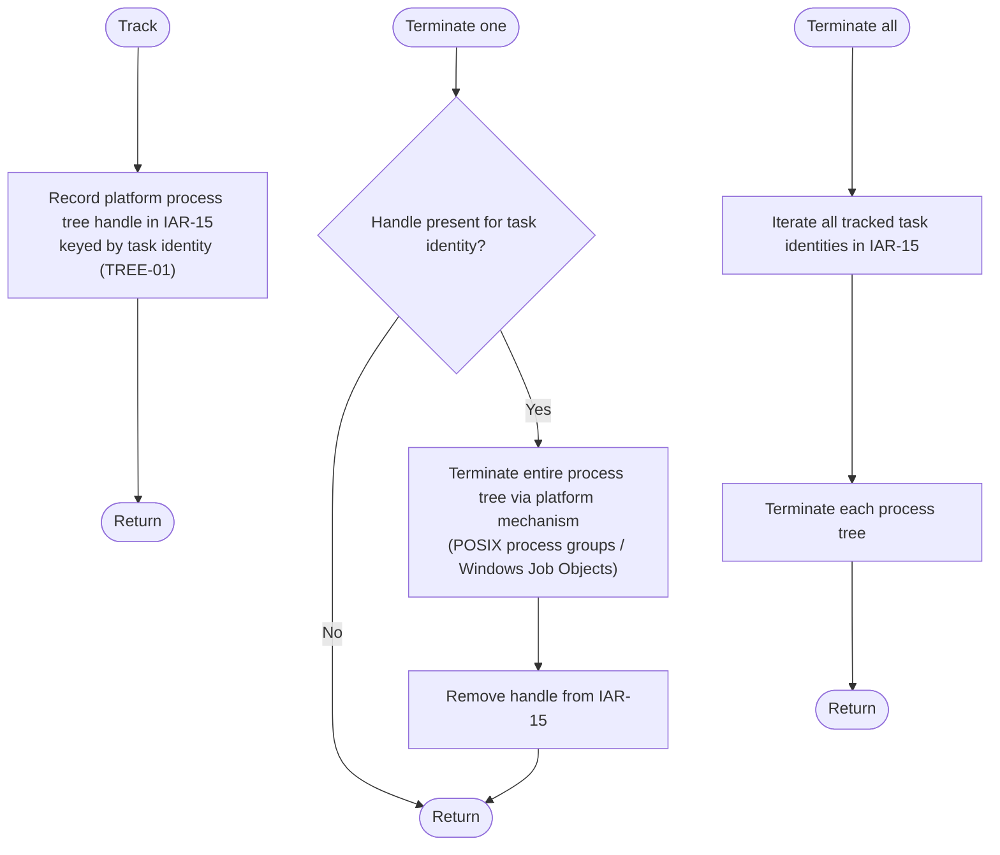

# Component: COM-12 — ProcessTreeManager

Sources: [requirements.md](../requirements.md) | [design-map.md](../design-map.md) | [plan.md](../plan.md) | [architecture.md](architecture.md) | [components architecture.md](../../../../processes/components/architecture.md)

Implements: (ALG-12)
Cross-references: (requires: PROC-10; uses: RES-05)

## Capabilities

- CAP-12 — Isolate and terminate process trees deterministically.
  Derived-from: (GOAL-03)

## Surface: SUR-12

Contracts: (CON-10)

- CON-10 — Terminate process trees. Spec: [design-map.md#contract-con-10-terminate-trees](../design-map.md#contract-con-10-terminate-trees)

## State holders (IAR-XX)

- IAR-15 — Process tree handles

## Algorithms (ALG-XX)

### ALG-12 — Track and terminate process trees

Guarantees: (INV-02)

