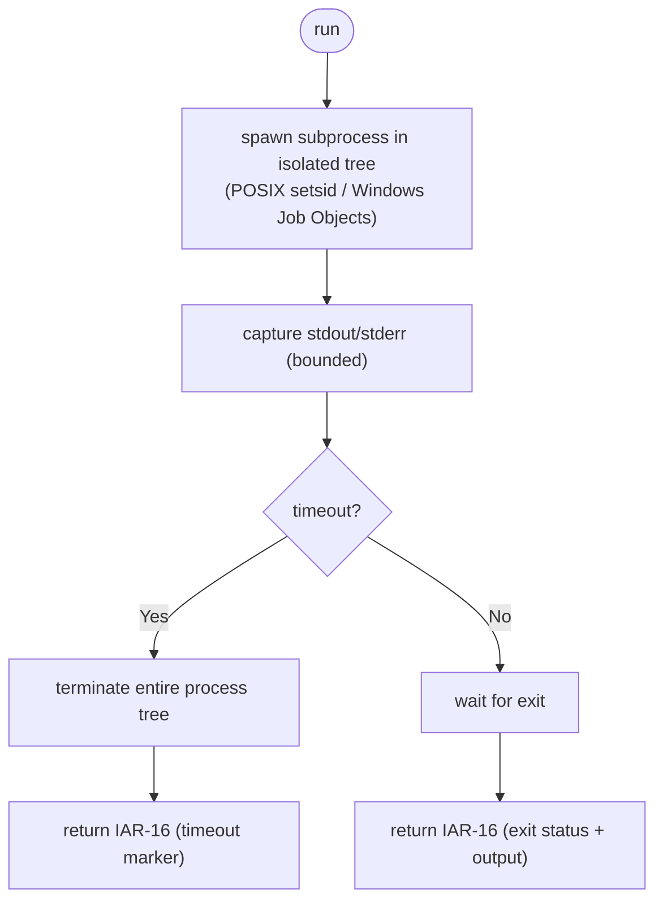

# Component: COM-13 — SubprocessRunner

Sources: [requirements.md](../requirements.md) | [design-map.md](../design-map.md) | [plan.md](../plan.md) | [architecture.md](architecture.md) | [components architecture.md](../../../../processes/components/architecture.md)

Implements: (ALG-13)
Cross-references: (requires: PROC-10; uses: RES-05)

## Capabilities

- CAP-13 — Execute subprocesses in killable process trees with timeout/crash markers.
  Derived-from: (GOAL-02, GOAL-03)

## Surface: SUR-13

Contracts: (CON-13)

- CON-13 — Run subprocess in a killable process tree. Spec: [design-map.md#contract-con-13-run-subprocess](../design-map.md#contract-con-13-run-subprocess)

## State holders (IAR-XX)

- IAR-15 — Process tree handles
- IAR-16 — Subprocess result
- IAR-17 — Subprocess invocation

## Algorithms (ALG-XX)

### ALG-13 — Execute a linter chunk in an isolated process tree

Guarantees: (INV-02)

