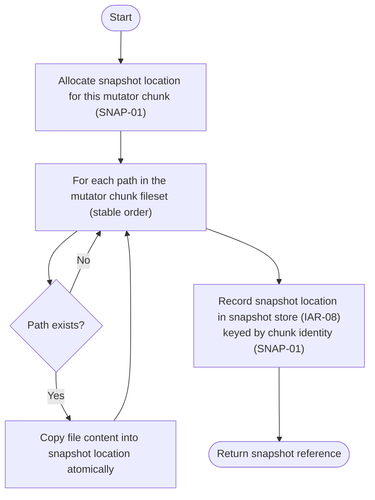
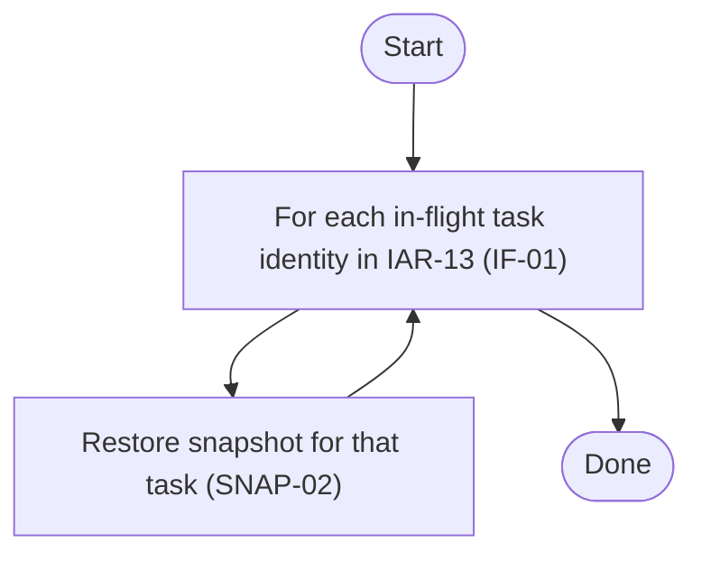

# Component: COM-14 — SnapshotManager

Sources: [requirements.md](../requirements.md) | [design-map.md](../design-map.md) | [plan.md](../plan.md) | [architecture.md](architecture.md) | [components architecture.md](../../../../processes/components/architecture.md)

Implements: (ALG-14)
Cross-references: (requires: PROC-09, PROC-11; satisfies: GOAL-03)

## Capabilities

- CAP-14 — Create and restore snapshots for mutator safety.
  Derived-from: (GOAL-03)

## Surface: SUR-14

Contracts: (CON-12, CON-14)

- CON-14 — Snapshot per chunk. Spec: [design-map.md#contract-con-14-snapshot-per-chunk](../design-map.md#contract-con-14-snapshot-per-chunk)
- CON-12 — Restore snapshots. Spec: [design-map.md#contract-con-12-restore-snapshots](../design-map.md#contract-con-12-restore-snapshots)

## State holders (IAR-XX)

- IAR-08 — Snapshot store
- IAR-13 — Inflight task registry

## Algorithms (ALG-XX)

### ALG-14 — Snapshot creation and restore semantics

Guarantees: (INV-04)

#### Snapshot creation (main process, before submit)

#### Restore all in-flight snapshots (used on fail-fast/SIGINT)

